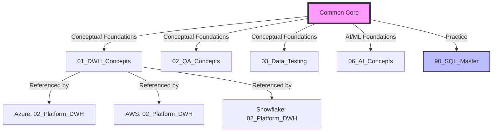

# Common Core - Full Stack QA Data + AI Architect Handbook

## Executive Summary

This **Common Core** represents the platform-agnostic foundation of the Full Stack QA Data + AI Architect Handbook—a comprehensive knowledge repository designed for Principal/Staff-level QA engineers specializing in data warehousing, ETL/ELT pipelines, big data systems, and emerging AI/ML/LLM/RAG/Agentic architectures.

**Purpose**: Establish a single source of truth for core QA concepts applicable across cloud providers (Azure, AWS, GCP) and data platforms (Databricks, Snowflake, BigQuery, Redshift, Synapse). This dedup license and allows stack-specific files to focus solely on platform deltas.

**Audience**: Experienced QA practitioners (10-15+ years) seeking architect-level depth on modern data and AI quality engineering.

---

## Why This Matters in Enterprise

### Business Impact
- **Data quality incidents cost enterprises $15M annually on average** (Gartner 2025)
- **AI/ML model failures due to poor data quality cause 73% of production incidents** (Forrester 2026)
- **Regulatory violations (GDPR, HIPAA, SOC2) carry penalties of $20M+ and brand damage**

### Technical Imperative
- Modern data architectures span multi-cloud, hybrid storage (lakehouses, warehouses), streaming/batch pipelines
- AI/LLM systems introduce new failure modes: hallucinations, bias, drift, adversarial attacks
- Quality engineering must shift left (design reviews) and right (production monitoring)

### Career Trajectory
Mastering this handbook positions QA practitioners for:
- **Principal QA Architect** roles ($180K-$250K+ total comp)
- **Staff Data Quality Engineer** positions at FAANG/unicorns
- **AI Safety/Governance** leadership in regulated industries

---

## Scope and Boundaries

### In Scope
1. **Data Warehousing QA**: Dimensional modeling, SCD types, star/snowflake schemas, denormalization strategies
2. **ETL/ELT Testing**: Data validation, transformation logic, incremental loads, CDC patterns
3. **Big Data QA**: Distributed systems testing, Spark job validation, data skew detection
4. **ML/AI QA**: Model evaluation, training/serving skew, explainability testing, bias detection
5. **LLM QA**: Prompt engineering validation, RAG pipeline testing, hallucination detection
6. **Agentic Systems QA**: Multi-agent orchestration, tool calling validation, safety controls
7. **Data Governance/Security**: Compliance testing (GDPR, HIPAA), encryption validation, access controls
8. **Platform-Agnostic Patterns**: SQL best practices, Python/Pandas/PySpark testing techniques

### Out of Scope
- Platform-specific implementation details (covered in stack files)
- Functional UI/API testing unrelated to data pipelines
- Infrastructure provisioning (IaC testing covered lightly)
- Business domain logic testing (finance, healthcare-specific)

---

## Deduplication Architecture

**Policy**:
- Common Core = **generic concepts, patterns, techniques**
- Stack Files = **platform service mappings + architectural constraints + dialect differences**
- **Zero overlap** enforced via automated dedup validation (Phase 5)

---

## File Manifest

### Conceptual Files (Platform-Agnostic Theory)
| File | Focus Area | Target Length | Min FAQs |
|------|-----------|--------------|----------|
| [01_DWH_Concepts_QA_Perspective.md](./01_DWH_Concepts_QA_Perspective.md) | Dimensional modeling, SCD, normalization | 1200+ lines | 20 |
| [02_QA_Concepts.md](./02_QA_Concepts.md) | Test design, SDLC integration, metrics | 1000+ lines | 20 |
| [03_Data_Testing_Concepts.md](./03_Data_Testing_Concepts.md) | Data validation, profiling, reconciliation | 1100+ lines | 20 |
| [04_ETL_Concepts.md](./04_ETL_Concepts.md) | Pipeline patterns, CDC, error handling | 1000+ lines | 20 |
| [05_Big_Data_Concepts.md](./05_Big_Data_Concepts.md) | Spark, HDFS, distributed testing | 1000+ lines | 20 |
| [06_AI_Concepts.md](./06_AI_Concepts.md) | ML lifecycle, model ops, AI systems | 1000+ lines | 20 |
| [07_ML_Concepts_QA_Perspective.md](./07_ML_Concepts_QA_Perspective.md) | Model evaluation, training validation | 1200+ lines | 20 |
| [08_LLM_Concepts_QA_Perspective.md](./08_LLM_Concepts_QA_Perspective.md) | LLM testing, prompt validation | 1100+ lines | 20 |
| [09_LangChain_Concepts_QA_Perspective.md](./09_LangChain_Concepts_QA_Perspective.md) | Chain testing, agent validation | 1000+ lines | 20 |
| [10_RAG_Concepts_QA_Perspective.md](./10_RAG_Concepts_QA_Perspective.md) | Retrieval testing, embedding validation | 1100+ lines | 20 |
| [11_MCP_Concepts_QA_Perspective.md](./11_MCP_Concepts_QA_Perspective.md) | Model Context Protocol testing | 900+ lines | 20 |
| [12_AI_Agentic_Concepts_QA_Perspective.md](./12_AI_Agentic_Concepts_QA_Perspective.md) | Multi-agent testing, orchestration | 1000+ lines | 20 |
| [13_Data_Governance_QA_Perspective.md](./13_Data_Governance_QA_Perspective.md) | Compliance, lineage, catalogs | 1100+ lines | 20 |
| [14_AI_BI_Concepts_QA_Perspective.md](./14_AI_BI_Concepts_QA_Perspective.md) | BI testing, dashboard validation | 950+ lines | 20 |
| [15_Data_Security_QA_Perspective.md](./15_Data_Security_QA_Perspective.md) | Encryption, RBAC, threat modeling | 1000+ lines | 20 |
| [16_Data_Science_QA_Perspective.md](./16_Data_Science_QA_Perspective.md) | Experiment tracking, notebook testing | 950+ lines | 20 |

### Practice Files (Runnable Code & Interview Prep)
| File | Focus | Target Length | Min FAQs |
|------|-------|--------------|----------|
| [90_SQL_Master_Concepts_Interview_QA_Solutions.sql](./90_SQL_Master_Concepts_Interview_QA_Solutions.sql) | SQL patterns, window functions, CTEs | 1500+ lines | 120 |
| [91_Python_Master_Concepts_Interview_QA_Solutions.py](./91_Python_Master_Concepts_Interview_QA_Solutions.py) | Data structures, async, testing | 1300+ lines | 120 |
| [92_Pandas_Master_Concepts_Interview_QA_Solutions.py](./92_Pandas_Master_Concepts_Interview_QA_Solutions.py) | DataFrame ops, performance tuning | 1200+ lines | 120 |
| [93_PySpark_Master_Concepts_Interview_QA_Solutions.py](./93_PySpark_Master_Concepts_Interview_QA_Solutions.py) | RDD/DF/Dataset, optimization | 1300+ lines | 120 |

### Support Files
- [99_CommonCore_Glossary_Checklists_FAQ_Index.md](./99_CommonCore_Glossary_Checklists_FAQ_Index.md): Master glossary, consolidated checklist, cross-file FAQ index

---

## How to Use This Handbook

### For Interview Preparation
1. **Foundations First**: Read conceptual files in order (01-16)
2. **Hands-On Practice**: Work through SQL/Python/Pandas/PySpark master files
3. **Scenario Drills**: Focus on Architect-level questions in each FAQ section
4. **Platform Mapping**: Review stack-specific deltas for target companies (e.g., AWS stack for Amazon interviews)

### For On-the-Job Application
1. **Design Reviews**: Use architecture patterns and anti-patterns sections
2. **Test Strategy**: Apply QA operating models and RACI matrices
3. **Incident Response**: Reference risk/failure modes and mitigation strategies
4. **Audit Prep**: Leverage controls/evidence sections for compliance reviews

### For Career Development
1. **Skill Gap Analysis**: Compare your experience against architect-level interview questions
2. **Certification Prep**: Crosswalk content to AWS/Azure/GCP data/ML certifications
3. **Thought Leadership**: Use references to publish blog posts, conference talks

---

## Content Depth Guarantee

Every conceptual .md file includes:

1. ✅ **Enterprise Context**: Why this matters, business impact, risk exposure
2. ✅ **Scope & Boundaries**: What's in/out, dependencies, assumptions
3. ✅ **Architecture Patterns**: Mermaid diagrams, data flows, integration patterns
4. ✅ **QA Operating Model**: RACI matrices, test strategy, coverage models
5. ✅ **Test Design Techniques**: Equivalence partitioning, BVA, risk-based testing
6. ✅ **Risk & Anti-Patterns**: Failure modes, FMEA, mitigation strategies
7. ✅ **Controls & Evidence**: Audit trails, compliance artifacts (GDPR, HIPAA, SOC2, ISO 27001, PCI-DSS, NIST AI RMF)
8. ✅ **SLI/SLO/SLA Framework**: Metrics, thresholds, monitoring strategy
9. ✅ **Performance/Cost/Reliability**: Optimization patterns, cost models
10. ✅ **Interview Questions**: Basic → Advanced → Scenario → Architect (20+ per file)
11. ✅ **FAQ Section**: 20+ Q&As covering conceptual, debugging, performance topics
12. ✅ **Actionable Checklists**: Pre-flight, execution, validation runbooks
13. ✅ **References**: Official docs, standards, research papers

---

## Compliance & Standards Coverage

### Regulatory Frameworks
- **GDPR**: Right to erasure, consent management, data minimization, breach notification (72-hour SLA)
- **HIPAA**: PHI encryption (AES-256), access logging (BAA requirements), minimum necessary principle
- **SOC2**: Trust Services Criteria (security, availability, confidentiality, processing integrity, privacy)
- **ISO 27001**: Information security controls (135 controls across 14 domains)
- **PCI-DSS**: Cardholder data protection (6 goals, 12 requirements)
- **NIST AI RMF**: AI risk management (Govern, Map, Measure, Manage functions)

### Industry Standards
- **DAMA-DMBOK**: Data management body of knowledge (11 knowledge areas)
- **TOGAF**: Enterprise architecture framework (ADM phases)
- **ITIL**: Service management (incident, problem, change management)

---

## Learning Path by Experience Level

### Entry-Level QA (0-3 years)
1. Start: [02_QA_Concepts.md](./02_QA_Concepts.md) → [03_Data_Testing_Concepts.md](./03_Data_Testing_Concepts.md)
2. Practice: [90_SQL_Master...sql](./90_SQL_Master_Concepts_Interview_QA_Solutions.sql) (Easy/Medium sections)
3. Apply: Simple ETL validation, basic data profiling

### Mid-Level QA (3-7 years)
1. Start: [01_DWH_Concepts...md](./01_DWH_Concepts_QA_Perspective.md) → [04_ETL_Concepts.md](./04_ETL_Concepts.md) → [05_Big_Data_Concepts.md](./05_Big_Data_Concepts.md)
2. Practice: All master files (Medium/Hard sections)
3. Apply: End-to-end pipeline testing, Spark job validation

### Senior QA (7-12 years)
1. Start: All AI/ML files (06-12), Governance (13), Security (15)
2. Practice: All master files (Hard/Architect sections)
3. Apply: ML pipeline testing, RAG system validation, compliance audits

### Principal/Staff QA (12+ years)
1. Start: Entire handbook review for knowledge refresh
2. Practice: Architect-level questions, design complex test frameworks
3. Apply: Define QA strategy, mentor teams, own quality gates

---

## Frequently Asked Questions (FAQ)

**Q1**: Why separate Common Core from stack-specific files?  
**A1**: Deduplication reduces maintenance burden. When a core concept changes (e.g., new data testing technique), we update ONE file instead of 8 stack files. Stack files only document platform-specific deltas (e.g., Snowflake's COPY INTO vs. AWS Glue's dynamic frames).

**Q2**: Are these files updated for 2026 best practices?  
**A2**: Yes. Content reflects current state (as of September 2026) including: LLM testing techniques, RAG pipeline validation, agentic AI QA patterns, and latest compliance standards (NIST AI RMF 2.0, GDPR amendments).

**Q3**: Can I use this for certification prep (AWS/Azure/GCP)?  
**A3**: Yes. Common Core covers foundational concepts tested in data/ML certifications. Stack-specific files map to exam domains (e.g., AWS Certified Data Analytics maps to AWS stack files).

**Q4**: How do I handle conflicts between Common Core and stack files?  
**A4**: **Stack files always win** for platform-specific behavior. Example: Common Core describes generic "incremental load" pattern, but AWS stack file specifies Glue bookmarks vs. Azure stack file specifies ADF watermarks.

**Q5**: What's the expected time investment to master this handbook?  
**A5**: 
- **Skim**: 20-30 hours (read all files, skip practice)
- **Study**: 80-100 hours (read + work through practice files)
- **Master**: 200+ hours (study + apply to real projects + iterate)

**Q6**: Are there prerequisites for this handbook?  
**A6**: 
- **Minimum**: 5+ years QA experience, SQL proficiency, basic Python
- **Recommended**: 8+ years, ETL testing background, big data exposure
- **Ideal**: 10+ years, multi-cloud experience, ML/AI project involvement

**Q7**: How does this differ from vendor certifications?  
**A7**: 
- **Vendor certs**: Platform-specific, breadth over depth, multiple-choice focused
- **This handbook**: Platform-agnostic core + multi-platform coverage, architect-level depth, practical scenario-driven

**Q8**: Can I contribute or suggest improvements?  
**A8**: This is a living document. Feedback mechanisms:
- **Errata**: Document technical inaccuracies
- **Enhancements**: Propose new sections (e.g., quantum ML testing)
- **Case studies**: Share real-world examples

**Q9**: How do I validate my understanding?  
**A9**: Each file includes:
- **Self-assessment**: Answer interview questions without looking at answers
- **Hands-on labs**: Run SQL/Python examples, modify for edge cases
- **Peer review**: Explain architect-level concepts to colleagues

**Q10**: What if I'm focused on only one platform (e.g., Snowflake)?  
**A10**: 
1. **Start**: Read all Common Core files (portable knowledge)
2. **Deep dive**: Focus on Snowflake stack files
3. **Breadth**: Skim other stack files to understand alternative approaches (useful for vendor negotiation, future job mobility)

---

## Actionable Checklists

### Pre-Reading Checklist
- [ ] Identify learning goals (interview prep, on-the-job application, career dev)
- [ ] Assess current experience level (use learning path above)
- [ ] Allocate dedicated study time (recommend 2-3 hours/week minimum)
- [ ] Set up practice environment (SQL sandbox, Python IDE, cloud free tier)

### During-Reading Checklist
- [ ] Take notes on unfamiliar concepts
- [ ] Work through ALL practice file examples
- [ ] Attempt interview questions before reading answers
- [ ] Create personal FAQ for concepts you struggled with
- [ ] Map content to current/past projects (contextual learning)

### Post-Reading Checklist
- [ ] Build reference test framework using learned patterns
- [ ] Share knowledge via blog post, team presentation, or mentoring
- [ ] Schedule quarterly review (knowledge retention)
- [ ] Identify gaps for further study (vendor docs, research papers)
- [ ] Apply learnings to production QA strategy

---

## References & Further Reading

### Books
- **The Data Warehouse Toolkit (Ralph Kimball)**: Dimensional modeling foundation
- **Designing Data-Intensive Applications (Martin Kleppmann)**: Distributed systems patterns
- **Accelerate (Forsgren, Humble, Kim)**: DevOps metrics and quality culture
- **Introduction to Machine Learning with Python (Müller, Guido)**: ML fundamentals

### Standards Bodies
- **ISO/IEC 25010**: Software quality model
- **IEEE 829**: Software test documentation standard
- **NIST SP 800-53**: Security and privacy controls

### Online Resources
- **Gartner Data Quality Research**: Market trends, vendor evaluation
- **Thoughtworks Technology Radar**: Emerging tools and techniques
- **Google SRE Book**: Reliability engineering principles

---

## Version History

| Version | Date | Changes |
|---------|------|--------|
| 1.0 | 2026-09-08 | Initial release: 20 files, 92-file scaffold complete |

---

## Navigation

**Next**: Start with [02_QA_Concepts.md](./02_QA_Concepts.md) for foundational quality engineering principles, or jump to your area of focus using the file manifest above.

**Up**: Return to [Master Index](../00_MASTER_INDEX.md) for full handbook navigation.
