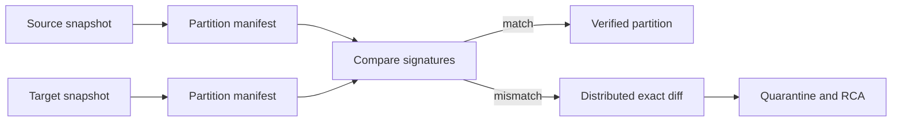
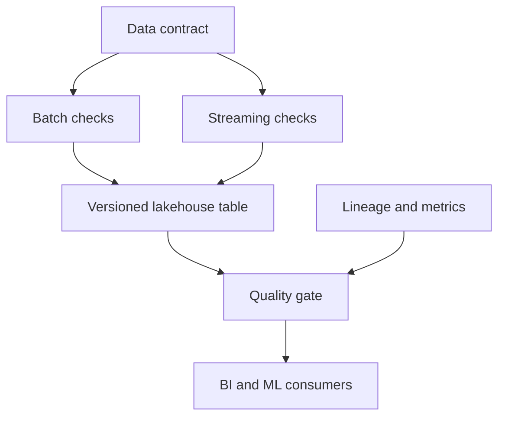

# Big Data Testing — Senior Test Engineer / Test Architect Interview Guide

## 1. Interview Expectations at 15+ Years

**What interviewers expect from a 15+ year candidate:**

- Can test distributed systems at petabyte scale
- Understands Spark internals (DAG, shuffle, serialization)
- Has tested Hadoop/Hive/Spark pipelines with billions of rows
- Knows how to handle data skew, partitioning, and serialization issues
- Can design test frameworks for batch and streaming big data
- Understands Delta Lake, Iceberg, and lakehouse concepts
- Has debugged production Spark jobs with OOM and performance issues

**Senior Engineer:** Tests Spark jobs, validates results
**Lead:** Designs big data test strategy, mentors team
**Test Architect:** Architects test frameworks for lakehouse, streaming, batch
**Staff/Principal:** Influences big data strategy across org, defines testing standards

## 2. Technology Overview

### What it is
Big data testing validates distributed data processing systems (Hadoop, Spark, Flink) for correctness, performance, and reliability at scale.

### How it works
Data ingested → stored in HDFS/cloud storage → processed by distributed engines (Spark, Hive, Flink) → results stored/queried.

### Where it is used
Data lakes, data warehouses, ETL/ELT pipelines, ML feature stores, real-time analytics.

### How it fails
- Data skew causing stragglers
- Serialization/deserialization errors
- Shuffle failures due to network/memory
- Partitioning issues
- Schema evolution problems
- Late-arriving data in streams
- Exactly-once semantics violations

### How it should be tested
- Data ingestion validation (counts, schema)
- Transformation logic validation
- Output validation (row-level, aggregate)
- Performance testing (execution time, resource usage)
- Fault tolerance testing (node failure, network partition)
- Idempotency and exactly-once testing

### How it should be automated
- Spark test suites with local cluster
- Data generation for scale testing
- Continuous validation pipelines
- Metadata-driven test frameworks

## 3. Core Concepts

### Hadoop Ecosystem

#### HDFS (Hadoop Distributed File System)
- **What:** Distributed storage for big data.
- **Why:** Fault-tolerant, scalable storage.
- **How:** Data split into blocks, replicated across nodes.
- **Testing:** Block placement, replication factor, data locality.
- **Failure Modes:** Data loss, under-replicated blocks, namenode failure.
- **Production:** Monitor block health, balance data across nodes.

#### MapReduce
- **What:** Distributed processing paradigm.
- **Why:** Batch processing at scale.
- **How:** Map phase → Shuffle → Reduce phase.
- **Testing:** Map logic correctness, shuffle correctness, reduce logic.
- **Failure Modes:** Mapper/reducer failures, skew, combinator issues.
- **Production:** Monitor job counters, task failures.

#### Hive
- **What:** SQL-like interface for Hadoop.
- **Why:** Familiar SQL for big data querying.
- **How:** SQL converted to MapReduce/Tez/Spark jobs.
- **Testing:** Query correctness, partition pruning, join optimization.
- **Failure Modes:** Incorrect results, slow queries, UDF failures.
- **Production:** Monitor query performance, partition health.

### Spark Core Concepts

#### RDD (Resilient Distributed Dataset)
- **What:** Fault-tolerant distributed collection.
- **Why:** Foundation of Spark API.
- **How:** Immutable, partitioned, lineage-based recovery.
- **Testing:** Transformation correctness, action results, partitioning.
- **Failure Modes:** Serialization errors, closure issues, memory leaks.
- **Production:** Monitor RDD lineage, persistence levels.

#### DataFrame & Dataset
- **What:** Structured API with schema optimization.
- **Why:** Better performance, optimization via Catalyst.
- **How:** Schema-aware, optimized physical plan.
- **Testing:** Schema validation, transformation correctness, action results.
- **Failure Modes:** Schema mismatch, optimization bugs, UDF issues.
- **Production:** Use DataFrame API; avoid RDD when possible.

#### Spark SQL
- **What:** SQL interface for Spark.
- **Why:** Familiar querying with optimization.
- **How:** SQL parsed to logical plan, optimized by Catalyst.
- **Testing:** Query correctness, plan optimization, result validation.
- **Failure Modes:** Wrong results, slow queries, parsing errors.
- **Production:** Use DataFrame/SQL interchangeably.

#### Structured Streaming
- **What:** Stream processing with microbatch model.
- **Why:** Fault-tolerant, exactly-once stream processing.
- **How:** Continuous queries with trigger intervals.
- **Testing:** Exactly-once semantics, watermarking, state management.
- **Failure Modes:** Duplicate processing, state loss, watermark issues.
- **Production:** Monitor stream processing lag, state size.

### Key Concepts

#### Partitions
- **What:** Logical splits of data for parallel processing.
- **Why:** Enables parallelism, data locality.
- **How:** Hash/range partitioning, partitioning by key.
- **Testing:** Partition balance, skew detection, partition pruning.
- **Failure Modes:** Data skew, hot partitions, too many/few partitions.
- **Production:** Monitor partition size, avoid skew.

#### Bucketing
- **What:** Technique to improve join performance.
- **Why:** Pre-shuffled data for efficient joins.
- **How:** Data hashed into fixed number of buckets.
- **Testing:** Bucket distribution, join correctness, skew handling.
- **Failure Modes:** Bucket skew, incorrect bucketing, join duplication.
- **Production:** Use bucketing for frequent joins.

#### Shuffle
- **What:** Data redistribution between stages.
- **Why:** Required for groupBy, join, etc.
- **How:** Map output → sort → shuffle → reduce input.
- **Testing:** Shuffle correctness, data loss prevention, efficiency.
- **Failure Modes:** Shuffle failures, excessive shuffle, skew.
- **Production:** Monitor shuffle read/write, spilling to disk.

#### Serialization
- **What:** Converting objects to bytes for network/storage.
- **Why:** Required for data transfer between nodes.
- **How:** Java/Kryo serialization, Avro/Parquet for columnar.
- **Testing:** Serialization correctness, deserialization, versioning.
- **Failure Modes:** Serialization errors, version incompatibility, bloated size.
- **Production:** Use Kryo; avoid Java serialization; use columnar formats.

#### Schema Evolution
- **What:** Handling changes to data schema over time.
- **Why:** Data sources change; need backward/forward compatibility.
- **How:** Add/drop columns, change types, rename columns.
- **Testing:** Backward/forward compatibility, data conversion.
- **Failure Modes:** Data loss, type conversion errors, schema drift.
- **Production:** Use schema registry; Avro/Parquet with evolution.

#### Exactly-Once Semantics
- **What:** Each record processed exactly once despite failures.
- **Why:** Prevents duplicates, ensures correctness.
- **How:** Idempotent operations, transactional writes, checkpointing.
- **Testing:** Duplicate detection, loss detection, recovery correctness.
- **Failure Modes:** Duplicates, data loss, inconsistent state.
- **Production:** Use checkpointing; idempotent sinks.

#### Watermarking
- **What:** Tracking event time for late data handling.
- **Why:** Enables late data handling in streams.
- **How:** Max event time seen minus allowed lateness.
- **Testing:** Watermark advancement, late data handling, state cleanup.
- **Failure Modes:** Watermark stalls, incorrect lateness, state explosion.
- **Production:** Monitor watermark lag; tune allowed lateness.

#### Checkpointing
- **What:** Saving streaming state for fault tolerance.
- **Why:** Enables recovery from failures.
- **How:** Periodic snapshot of state to reliable storage.
- **Testing:** Checkpoint correctness, recovery accuracy, performance impact.
- **Failure Modes:** Incomplete checkpoints, corruption, slow recovery.
- **Production:** Monitor checkpoint interval; storage for checkpoints.

#### Data Skew
- **What:** Uneven data distribution across partitions.
- **Why:** Causes stragglers, poor resource utilization.
- **How:** Some partitions have much more data than others.
- **Testing:** Skew detection, partition balance, join performance.
- **Failure Modes:** Stragglers, long tails, resource waste.
- **Production:** Monitor partition sizes; use salting, broadcast joins.

## 4. ARCHITECTURE

```mermaid
flowchart LR
    A[Data Ingestion] --> B[Raw Storage (HDFS/Cloud)]
    B --> C[Batch Processing (Spark/Hive)]
    B --> D[Stream Processing (Spark Structured/Flunk)]
    C --> E[Processed Storage]
    D --> E
    E --> F[Query Engines (Presto/Trino)]
    E --> G[ML Feature Store]
    E --> H[BI/Dashboard]
    I[Test Framework] --> B
    I --> C
    I --> D
    I --> E
    I --> F
    J[Data Generation] --> B
    J --> C
    J --> D
    K[Metadata/Lakehouse] --> L[Delta Lake/Iceberg]
    L --> B
    L --> C
    L --> D
```

**Components:**
- Data ingestion (Kafka, Flume, APIs)
- Storage layer (HDFS, S3, ADLS, GCS)
- Batch processing (Spark, Hive, Flink Batch)
- Stream processing (Spark Structured Streaming, Flink, Kafka Streams)
- Query engines (Presto, Trino, Spark SQL)
- ML feature stores
- BI/dashboard consumers

**Test Points:**
- Ingestion validation (counts, schema, duplicates)
- Processing logic validation (transformations, aggregations)
- Output validation (row-level, aggregates, schemas)
- Performance (execution time, resource utilization)
- Fault tolerance (node failure, network partition)
- Idempotency and exactly-once semantics

**Scalability:**
- Horizontal scaling (add nodes)
- Partitioning strategies
- Columnar storage (Parquet/ORC)
- Compression (Snappy, Zstd)

**Reliability:**
- Checkpointing for streams
- Replication for storage
- Idempotent processing
- Automatic failover

## 5. TOP 50 INTERVIEW QUESTIONS

## Q1. Explain the difference between batch and stream processing testing.

**Difficulty:** Medium
**Interview Stage:** Technical Screen

### What the interviewer is testing
Understanding of processing paradigms.

### Strong Senior-Level Answer
Batch: Process finite dataset; test completeness, correctness, idempotency. Stream: Infinite dataset; test exactly-once, watermarking, state management, latency. Different validation approaches.

### Architect-Level Answer
Batch testing focuses on finite dataset correctness. Stream testing requires temporal correctness, exactly-once guarantees, and handling of infinite data. Implement: 1) Batch: input-output validation, 2) Stream: event-time validation, watermark tests, state checkpointing.

### Real-World Enterprise Scenario
Streaming job processed duplicate records due to missing checkpoint; batch job had same logic but no duplicates.

### Likely Follow-Up Questions
- How do you test exactly-once in streams?
- What if stream has bounded data?
- How do you test batch idempotency?

### Common Weak Answer
"Batch is finite; stream is infinite."

### Interviewer Probe
"Stream job processes 1 hour windows. Is it batch or stream?"

### Hands-On Exercise
Design test plan for batch vs stream processing with same business logic.

---

## Q2. How do you test data ingestion in a big data pipeline?

**Difficulty:** Medium
**Interview Stage:** Technical Screen

### What the interviewer is testing
Ingestion validation skills.

### Strong Senior-Level Answer
Test ingestion: 1) Record count matches source, 2) Schema validation, 3) No data corruption/loss, 4) Duplicate detection, 5) Format validation (Parquet/Avro/JSON), 6) Timeliness/freshness. Validate at storage layer.

### Architect-Level Answer
Ingestion is trust boundary. Implement: 1) Source-to-storage reconciliation, 2) Schema validation with registry, 3) Duplicate detection with hashing, 4) Format validation tests, 5) Ingestion latency monitoring, 6) Corrupted file quarantine. Use metadata for tracking.

### Real-World Enterprise Scenario
Ingestion dropped 5% records due to malformed JSON lines; undetected until reconciliation.

### Likely Follow-Up Questions
- How do you validate schema at ingestion?
- What if source format changes?
- How do you handle corrupted files?

### Common Weak Answer
"Check record count."

### Interviewer Probe
"Source has 1M records. Storage shows 950K. What happened?"

### Hands-On Exercise
Write Python/PySpark to validate ingestion counts and schema.

---

## Q3. How do you test Spark DataFrame transformations?

**Difficulty:** Medium
**Interview Stage:** Technical Screen

### What the interviewer is testing
Spark transformation testing.

### Strong Senior-Level Answer
Test DataFrame transformations: 1) Schema validation, 2) Row-level correctness with sample data, 3) Aggregate correctness, 4) Partitioning correctness, 5) Performance with scale, 6) Edge cases (null, empty, duplicates). Use local Spark for testing.

### Architect-Level Answer
DataFrame testing requires systematic approach. Implement: 1) Schema validation tests, 2) Unit tests for transformations, 3) Property-based testing, 4) Golden dataset validation, 5) Performance benchmarking, 6) Regression testing. Use PySpark local mode for fast tests.

### Real-World Enterprise Scenario
UDF returned NULL for valid input; transformation logic bug undetected in unit tests.

### Likely Follow-Up Questions
- How do you test UDFs in Spark?
- What if transformation is slow?
- How do you test at scale?

### Common Weak Answer
"Collect data and test in Python."

### Interviewer Probe
"DataFrame transformation works on 100 rows but fails on 1M. Why?"

### Hands-On Exercise
Write PySpark test for DataFrame transformation with golden dataset.

---

## Q4. How do you test Spark joins for correctness and performance?

**Difficulty:** Hard
**Interview Stage:** Technical Deep Dive

### What the interviewer is testing
Join validation in distributed systems.

### Strong Senior-Level Answer
Test joins: 1) Join correctness (cartesian product avoided), 2) Join type validation (inner/left/right/full), 3) Skew handling, 4) Broadcast join eligibility, 5) Shuffle minimization, 6) Performance with scale. Validate against nested loop join for small data.

### Architect-Level Answer
Join testing requires skew awareness. Implement: 1) Join correctness tests, 2) Broadcast join validation, 3) Skew detection and handling, 4) Shuffle metrics analysis, 5) Partition-based join testing, 6) Sort-merge join validation. Use EXPLAIN to validate join strategy.

### Real-World Enterprise Scenario
Join caused shuffle spill to disk; performance degraded 10×.

### Likely Follow-Up Questions
- How do you detect join skew?
- What if broadcast join not possible?
- How do you test join performance?

### Common Weak Answer
"Test with small data."

### Interviewer Probe
"Join works on 1K rows but slow on 1M rows. Why?"

### Hands-On Exercise
Write PySpark to test join correctness and performance with skew detection.

---

## Q5. How do you test Spark aggregations (groupBy, agg)?

**Difficulty:** Medium
**Interview Stage:** Technical Screen

### What the interviewer is testing
Aggregation testing.

### Strong Senior-Level Answer
Test aggregations: 1) Group correctness, 2) Aggregate function correctness (sum, count, avg, etc.), 3) Partitioning correctness, 4) Shuffle behavior, 5) Null handling in aggregates, 6) Performance with scale. Validate with sample data.

### Architect-Level Answer
Aggregation testing needs shuffle awareness. Implement: 1) Group validation tests, 2) Aggregate function tests, 3) Partitioning correctness, 4) Shuffle metrics analysis, 5) Null handling tests, 6) Combiner validation. Use aggregate-by-key for testing.

### Real-World Enterprise Scenario
Aggregate lost NULL groups due to improper handling.

### Likely Follow-Up Questions
- How do you test NULL handling in aggregates?
- What if aggregate is slow?
- How do you test at scale?

### Common Weak Answer
"Test with GROUP BY in SQL."

### Interviewer Probe
"SUM aggregate loses NULL groups. Why?"

### Hands-On Exercise
Write PySpark to test aggregation correctness with NULL handling.

---

## Q6. How do you test window functions in Spark?

**Difficulty:** Hard
**Interview Stage:** Technical Deep Dive

### What the interviewer is testing
Window function testing.

### Strong Senior-Level Answer
Test window functions: 1) Window specification correctness, 2) Frame specification (rows/range), 3) Ordering correctness, 4) Partitioning correctness, 5) Null handling in windows, 6) Performance with scale. Validate with known sequences.

### Architect-Level Answer
Window testing requires frame awareness. Implement: 1) Window specification tests, 2) Frame boundary tests, 3) Ordering tests, 4) Partitioning tests, 5) Null handling tests, 6) Performance benchmarking. Use frame clauses (ROWS/RANGE) for testing.

### Real-World Enterprise Scenario
RANGE window with DATE type produced wrong results due to implicit conversion.

### Likely Follow-Up Questions
- How do you test window frames?
- What if ordering is ambiguous?
- How do you test at scale?

### Common Weak Answer
"Test with SQL window functions."

### Interviewer Probe
"Window function works on small data but wrong on large data. Why?"

### Hands-On Exercise
Write PySpark to test window functions with frame boundary validation.

---

## Q7. How do you test Spark UDFs (User Defined Functions)?

**Difficulty:** Medium
**Interview Stage:** Technical Screen

### What the interviewer is testing
UDF validation.

### Strong Senior-Level Answer
Test UDFs: 1) Input validation, 2) Output correctness, 3) Exception handling, 4) Performance, 5) Serialization, 6) Determinism (if required). Test with edge cases and production-like data.

### Architect-Level Answer
UDF testing requires isolation. Implement: 1) Input/output validation, 2) Exception scenario testing, 3) Performance benchmarking, 4) Serialization tests, 5) Determinism validation, 6) UDF registration/unregistration. Use Pandas UDFs for better performance.

### Real-World Enterprise Scenario
UDF threw exception on NULL input; job failed silently due to try/catch.

### Likely Follow-Up Questions
- How do you test UDF performance?
- What if UDF is non-deterministic?
- How do you test serialization?

### Common Weak Answer
"Test UDF in isolation."

### Interviewer Probe
"UDF works in Python but fails in Spark. Why?"

### Hands-On Exercise
Write PySpark UDF test with input/output validation and exception handling.

---

## Q8. How do you test Spark Structured Streaming for exactly-once semantics?

**Difficulty:** Very Hard
**Interview Stage:** Architect

### What the interviewer is testing
Streaming correctness guarantees.

### Strong Senior-Level Answer
Test exactly-once: 1) Inject duplicate events, 2) Inject missing events, 3) Stop/restart stream, 4) Simulate failures, 5) Validate state recovery, 6) Check for duplicates/loss in sink. Use checkpointing and idempotent sinks.

### Architect-Level Answer
Exactly-once testing requires failure injection. Implement: 1) Duplicate detection in sink, 2) Loss detection via source-sink comparison, 3) Checkpoint correctness, 4) Recovery testing, 5) Watermark validation, 6) Idempotent sink validation. Use Kafka for controlled injection.

### Real-World Enterprise Scenario
Streaming job processed duplicates after failure due to missing idempotent sink.

### Likely Follow-Up Questions
- How do you test duplicate detection?
- What if checkpoint storage fails?
- How do you test recovery?

### Common Weak Answer
"Check for duplicates in output."

### Interviewer Probe
"Stream stopped and restarted. How do you validate no duplicates?"

### Hands-On Exercise
Design exactly-once test for Spark Structured Streaming with failure injection.

---

## Q9. How do you test watermarking in Spark Structured Streaming?

**Difficulty:** Hard
**Interview Stage:** Technical Deep Dive

### What the interviewer is testing
Late data handling.

### Strong Senior-Level Answer
Test watermarking: 1) Watermark advancement correctness, 2) Late data handling within allowed lateness, 3) State cleanup for expired data, 4) Watermark stalls detection, 5) Event time vs processing time, 6) Performance with late data. Validate with controlled late data injection.

### Architect-Level Answer
Watermark testing requires temporal validation. Implement: 1) Watermark advancement tests, 2) Late data handling tests, 3) State cleanup validation, 4) Watermark stall detection, 5) Event time correctness, 6) Allowed lateness tuning. Use event time in data.

### Real-World Enterprise Scenario
Watermark stalled due to missing events; late data processed incorrectly.

### Likely Follow-Up Questions
- How do you test late data handling?
- What if watermark doesn't advance?
- How do you tune allowed lateness?

### Common Weak Answer
"Watermark is max event time."

### Interviewer Probe
"Watermark advanced but late data dropped. Why?"

### Hands-On Exercise
Write PySpark to test watermarking with late data injection and state validation.

---

## Q10. How do you test Spark checkpoints for streaming?

**Difficulty:** Hard
**Interview Stage:** Technical Deep Dive

### What the interviewer is testing
Fault tolerance in streaming.

### Strong Senior-Level Answer
Test checkpoints: 1) Checkpoint correctness, 2) Recovery accuracy, 3) Performance impact, 4) Checkpoint cleanup, 5) Failure scenarios (node failure, network), 6) State size monitoring. Validate state after recovery matches expected.

### Architect-Level Answer
Checkpoint testing requires failure scenarios. Implement: 1) Checkpoint serialization tests, 2) Recovery correctness tests, 3) Performance impact analysis, 4) Storage validation, 5) Failure injection tests, 6) Garbage collection validation. Use reliable storage for checkpoints.

### Real-World Enterprise Scenario
Checkpoint corrupted; streaming job lost state and restarted from beginning.

### Likely Follow-Up Questions
- How do you test checkpoint correctness?
- What if recovery is slow?
- How do you monitor state size?

### Common Weak Answer
"Checkpoint saves state."

### Interviewer Probe
"Checkpoint taken but recovery lost data. Why?"

### Hands-On Exercise
Design checkpoint test for streaming with failure injection and recovery validation.

---

## Q11. How do you test data skew in Spark?

**Difficulty:** Hard
**Interview Stage:** Technical Deep Dive

### What the interviewer is testing
Skew detection and handling.

### Strong Senior-Level Answer
Test skew: 1) Partition size distribution, 2) Join skew detection, 3) Aggregation skew detection, 4) Straggler identification, 5) Mitigation strategies (salting, broadcast), 6) Performance impact. Validate with skewed datasets.

### Architect-Level Answer
Skew testing requires statistical analysis. Implement: 1) Partition size analysis, 2) Join skew detection via keys, 3) Aggregation skew detection, 4) Straggler identification via task metrics, 5) Mitigation validation, 6) Performance benchmarking. Use skew join hints.

### Real-World Enterprise Scenario
Join on user_id had 80% data for one user; caused 20-minute straggler.

### Likely Follow-Up Questions
- How do you detect partition skew?
- What if skew cannot be avoided?
- How do you test mitigation strategies?

### Common Weak Answer
"Check for long-running tasks."

### Interviewer Probe
"Two keys have 90% of data. What happens to join?"

### Hands-On Exercise
Write PySpark to detect and mitigate data skew with salting technique.

---

## Q12. How do you test partitioning in Spark?

**Difficulty:** Medium
**Interview Stage:** Technical Screen

### What the interviewer is testing
Partitioning strategy validation.

### Strong Senior-Level Answer
Test partitioning: 1) Partition count correctness, 2) Data distribution balance, 3) Partitioning key effectiveness, 4) Partition pruning, 5) Performance with different partition counts, 6) Repartitioning correctness. Validate with sample data.

### Architect-Level Answer
Partitioning testing requires balance validation. Implement: 1) Partition count validation, 2) Data distribution analysis (entropy/variance), 3) Partitioning key tests, 4) Partition pruning tests, 5) Repartitioning correctness tests, 6) Skew detection. Use partitionBy for testing.

### Real-World Enterprise Scenario
Too many partitions (1000) caused scheduler overhead; too few (2) caused underutilization.

### Likely Follow-Up Questions
- How do you choose partition count?
- What if data is skewed?
- How do you test partition pruning?

### Common Weak Answer
"Use default partitioning."

### Interviewer Probe
"Partition count too high causes overhead. Too low causes skew."

### Hands-On Exercise
Write PySpark to test partitioning correctness and balance.

---

## Q13. How do you test serialization in Spark?

**Difficulty:** Medium
**Interview Stage:** Technical Screen

### What the interviewer is testing
Serialization correctness.

### Strong Senior-Level Answer
Test serialization: 1) Object serialization/deserialization, 2) Custom class handling, 3) Performance impact, 4) Version compatibility, 5) Exception handling, 6) Closed-over variables. Validate with test objects.

### Architect-Level Answer
Serialization testing needs version awareness. Implement: 1) Serialization round-trip tests, 2) Custom class tests, 3) Performance benchmarking, 4) Schema evolution tests, 5) Exception scenario tests, 6) Closure validation. Use Kryo serializer for better performance.

### Real-World Enterprise Serializable class changed; deserialization failed after jar update.

### Likely Follow-Up Questions
- How do you test custom class serialization?
- What if serialization is slow?
- How do you test version compatibility?

### Common Weak Answer
"Use Java serialization."

### Interviewer Probe
"Kryo vs Java serialization. Performance difference?"

### Hands-On Exercise
Write PySpark to test serialization with custom class and versioning.

---

## Q14. How do you test schema evolution in big data pipelines?

**Difficulty:** Hard
**Interview Stage:** Technical Deep Dive

### What the interviewer is testing
Schema change handling.

### Strong Senior-Level Answer
Test schema evolution: 1) Backward compatibility (old readers with new data), 2) Forward compatibility (new readers with old data), 3) Data conversion correctness, 4) Schema registry validation, 5) Performance impact, 6) Error handling for incompatible changes. Validate with schema versions.

### Architect-Level Answer
Schema evolution testing requires version matrix. Implement: 1) Backward/forward compatibility tests, 2) Data conversion validation, 3) Schema registry integration, 4) Performance benchmarking, 5) Error handling tests, 6) Version retirement strategy. Use Avro/Parquet with evolution.

### Real-World Enterprise Scenario
New column added as NOT NULL without default; old data failed to load.

### Likely Follow-Up Questions
- How do you test backward compatibility?
- What if schema change is incompatible?
- How do you use schema registry?

### Common Weak Answer
"Just load new schema."

### Interviewer Probe
"Schema changed from string to int. Data has 'N/A'. What happens?"

### Hands-On Exercise
Write PySpark to test schema evolution with backward/forward compatibility.

---

## Q15. How do you test Delta Lake for ACID transactions?

**Difficulty:** Hard
**Interview Stage:** Technical Deep Dive

### What the interviewer is testing
Lakehouse transaction guarantees.

### Strong Senior-Level Answer
Test Delta Lake ACID: 1) Atomicity (all-or-nothing writes), 2) Consistency (constraints), 3) Isolation (concurrent writes), 4) Durability (recovery after failure). Validate with concurrent writers and failures.

### Architect-Level Answer
Delta Lake testing requires transaction scenarios. Implement: 1) Atomicity tests with failure injection, 2) Constraint validation tests, 3) Isolation level testing (SI), 4) Durability tests with failure recovery, 5) Time travel validation, 6) History retention testing. Use Delta Lake API for testing.

### Real-World Enterprise Scenario
Concurrent Delta Lake writes caused version conflicts; job failed silently.

### Likely Follow-Up Questions
- How do you test atomicity?
- What if constraints are violated?
- How do you test time travel?

### Common Weak Answer
"Delta Lake is ACID by default."

### Interviewer Probe
"Two writers update same row. What happens?"

### Hands-On Exercise
Design Delta Lake ACID test with concurrent writers and failure injection.

---

## Q16. How do you test data lakes with poor file organization?

**Difficulty:** Hard
**Interview Stage:** Technical Deep Dive

### What the interviewer is testing
Data lake organization impact.

### Strong Senior-Level Answer
Test file organization: 1) File size distribution, 2) File count impact, 3) Directory structure, 4) Partition effectiveness, 5) Small files problem, 6) Performance impact. Validate with organized vs disorganized data.

### Architect-Level Answer
File organization affects performance. Implement: 1) File size analysis, 2) Small files detection and compaction, 3) Partition validation, 4) Directory structure tests, 5) Metadata caching tests, 6) Query performance impact. Use OPTIMIZE/ZORDER for Delta Lake.

### Real-World Enterprise Scenario
Data lake had 10M small files; query performance degraded 100×.

### Likely Follow-Up Questions
- How do you detect small files problem?
- What if compaction fails?
- How do you monitor file organization?

### Common Weak Answer
"Just store files."

### Interviewer Probe
"10K files vs 1 file. Query performance difference?"

### Hands-On Exercise
Design file organization test with compaction and partitioning validation.

---

## Q17. How do you test Kafka producers and consumers?

**Difficulty:** Medium
**Interview Stage:** Technical Screen

### What the interviewer is testing
Kafka client testing.

### Strong Senior-Level Answer
Test Kafka clients: 1) Producer correctness (acknowledgments, retries), 2) Consumer correctness (offset commit, group management), 3) Message ordering, 4) Duplicate detection, 5) Loss detection, 6) Performance with scale. Validate end-to-end pipeline.

### Architect-Level Answer
Kafka testing requires cluster awareness. Implement: 1) Producer validation tests, 2) Consumer group tests, 3) Offset management tests, 4) Duplication/loss detection, 5) Performance benchmarking, 6) Failure scenario testing. Use embedded Kafka for testing.

### Real-World Enterprise Scenario
Consumer committed offset before processing; processing failure caused message loss.

### Likely Follow-Up Questions
- How do you test message ordering?
- What if consumer group rebalances?
- How do you test at scale?

### Common Weak Answer
"Test producer and consumer separately."

### Interviewer Probe
"Producer sends 100 messages. Consumer receives 99. What happened?"

### Hands-On Exercise
Write Python to test Kafka producer-consumer pipeline with validation.

---

## Q18. How do you test exactly-once semantics in Kafka Streams?

**Difficulty:** Very Hard
**Interview Stage:** Architect

### What the interviewer is testing
Streaming correctness in Kafka Streams.

### Strong Senior-Level Answer
Test exactly-once: 1) Idempotent processing, 2) Transactional writes, 3) Offset commit after processing, 4) Failure recovery, 5) Duplicate detection, 6) Loss detection. Validate with controlled injection and failure scenarios.

### Architect-Level Answer
Kafka Streams exactly-once requires transactional testing. Implement: 1) Idempotent processor tests, 2) Transactional write validation, 3) Offset commit tests, 4) Failure recovery tests, 5) Duplicate detection in sink, 6) Loss detection via source-sink comparison. Use Kafka transactions.

### Real-World Enterprise Scenario
Kafka Streams job lost transactions during broker failure; duplicates appeared in output.

### Likely Follow-Up Questions
- How do you test transactional writes?
- What if broker fails during commit?
- How do you test recovery?

### Common Weak Answer
"Check for duplicates."

### Interviewer Probe
"Stream processing stopped. How do you validate exactly-once recovery?"

### Hands-On Exercise
Design exactly-once test for Kafka Streams with failure injection and validation.

---

## Q19. How do you test Flink for stateful stream processing?

**Difficulty:** Hard
**Interview Stage:** Technical Deep Dive

### What the interviewer is testing
Flink state management.

### Strong Senior-Level Answer
Test Flink state: 1) State correctness, 2) State backend (heap/rocksdb), 3) Checkpointing, 4) Savepoints, 5) Rescaling, 6) State TTL. Validate state after operations and recovery.

### Architect-Level Answer
Flink state testing requires backend awareness. Implement: 1) State correctness tests, 2) State backend validation, 3) Checkpoint correctness, 4) Savepoint tests, 5) Rescaling validation, 6) State TTL tests, 7) Failure recovery testing. Use RocksDB state backend for large state.

### Real-World Enterprise Scenario
Flink job used heap state backend; state size caused OOM during checkpoint.

### Likely Follow-Up Questions
- How do you test state backends?
- What if state is too large?
- How do you test rescaling?

### Common Weak Answer
"State is just variables."

### Interviewer Probe
"Flink job OOM during checkpoint. Why?"

### Hands-On Exercise
Design Flink state test with state backend validation and checkpoint recovery.

---

## Q20. How do you test big data with data quality issues (nulls, duplicates, bad format)?

**Difficulty:** Medium
**Interview Stage:** Technical Screen

### What the interviewer is testing
Data quality in big data.

### Strong Senior-Level Answer
Test data quality: 1) Null rate validation, 2) Duplicate detection, 3) Format validation (Parquet/Avro/JSON), 4) Schema validation, 5) Outlier detection, 6) Data profiling. Validate at ingestion and after transformations.

### Architect-Level Answer
Big data quality needs scaling. Implement: 1) Data quality metrics collection, 2) Null/duplicate/anomaly detection, 3) Schema validation with registry, 4) Data profiling suite, 5) Outlier detection (IQR/Z-score), 6) Quality gates in pipeline. Use Deequ/Great Expectations for scale.

### Real-World Enterprise Scenario
Data had 20% NULLs in key column; join produced wrong results.

### Likely Follow-Up Questions
- How do you test at scale?
- What if data quality degrades?
- How do you automate quality checks?

### Common Weak Answer
"Check for NULLs manually."

### Interviewer Probe
"Data has 30% duplicates. How do you detect and handle?"

### Hands-On Exercise
Write PySpark to validate data quality with null/duplicate detection.

---

## Q21. Your Spark job fails with OOM error. How do you investigate?

**Difficulty:** Hard
**Interview Stage:** Production Debugging

### What the interviewer is testing
OOM debugging in Spark.

### Strong Senior-Level Answer
1) Check Spark UI for stage times, 2) Check shuffle read/write, 3) Check memory usage per executor, 4) Check GC time, 5) Check serialization size, 6) Check UDF memory usage, 7) Check broadcast variables, 8) Check data skew. Use Spark UI and logs.

### Architect-Level Answer
OOM debugging requires systematic analysis. Implement: 1) Spark UI monitoring, 2) Memory leak detection, 3) Serialization size analysis, 4) Broadcast variable validation, 5) UDF memory profiling, 6) Data skew detection, 7) Garbage collection analysis. Use heap dumps for deep analysis.

### Real-World Enterprise Scenario
Broadcast variable of 1GB caused OOM on executors with 2GB memory.

### Likely Follow-Up Questions
- How do you detect memory leaks?
- What if OOM is in driver?
- How do you prevent OOM?

### Common Weak Answer
"Increase executor memory."

### Interviewer Probe
"Executor memory increased but OOM still happens. What else?"

### Hands-On Exercise
Write PySpark to detect memory usage patterns and suggest optimizations.

---

## Q22. How do you test Spark job performance at scale?

**Difficulty:** Hard
**Interview Stage:** Technical Deep Dive

### What the interviewer is testing
Performance testing skills.

### Strong Senior-Level Answer
Test performance: 1) Execution time, 2) Resource utilization (CPU/memory), 3) Shuffle metrics, 4) Serialization/deserialization time, 5) I/O time, 6) Scaling behavior (weak/strong scaling). Validate with production-like data volumes.

### Architect-Level Answer
Performance testing requires bottleneck identification. Implement: 1) Execution time benchmarking, 2) Resource utilization monitoring, 3) Shuffle metrics analysis, 4) Serialization benchmarking, 5) I/O time analysis, 6) Scaling tests with increasing data/nodes. Use Spark UI and Ganglia for monitoring.

### Real-World Enterprise Scenario
Job shuffled 1TB of data; performance degraded due to disk I/O bottleneck.

### Likely Follow-Up Questions
- How do you measure resource utilization?
- What if scaling is sublinear?
- How do you optimize shuffle?

### Common Weak Answer
"Time the job and see if it's fast."

### Interviewer Probe
"Job scales poorly with more nodes. Why?"

### Hands-On Exercise
Design Spark performance test suite with resource monitoring and scaling validation.

---

## Q23. How do you test Hive queries for correctness and optimization?

**Difficulty:** Medium
**Interview Stage:** Technical Screen

### What the interviewer is testing
Hive testing.

### Strong Senior-Level Answer
Test Hive queries: 1) Query correctness vs expected results, 2) Plan optimization (partition pruning, join order), 3) UDF correctness, 4) Partition effectiveness, 5) Bucketing effectiveness, 6) Query performance. Validate with sample data.

### Architect-Level Answer
Hive testing needs optimization awareness. Implement: 1) Query correctness tests, 2) Plan analysis (EXPLAIN), 3) Partition pruning tests, 4) Join order validation, 5) UDF tests, 6) Bucketing validation, 7) Query performance benchmarking. Use Hive metastore for schema.

### Real-World Enterprise Scenario
Hive query scanned full table due to missing partition filter; performance degraded.

### Likely Follow-Up Questions
- How do you test partition pruning?
- What if UDF fails?
- How do you test query performance?

### Common Weak Answer
"Run query and check results."

### Interviewer Probe
"Hive query uses ORDER BY on 1B rows. Performance?"

### Hands-On Exercise
Write Hive query test with correctness and optimization validation.

---

## Q24. How do you test data lakehouse concepts (Delta Lake, Iceberg, Hudi)?

**Difficulty:** Hard
**Interview Stage:** Architecture

### What the interviewer is testing
Lakehouse testing.

### Strong Senior-Level Answer
Test lakehouse: 1) ACID transactions, 2) Time travel, 3) Schema evolution, 4) Partition evolution, 5) Optimize/ZORDER, 6) Clustering, 7) Change data feed, 8) Streaming ingestion. Validate each lakehouse feature.

### Architect-Level Answer
Lakehouse testing requires feature validation. Implement: 1) ACID transaction tests, 2) Time travel correctness, 3) Schema evolution tests, 4) Partition evolution tests, 5) Optimize/ZORDER validation, 6) Clustering tests, 7) Change data feed validation, 8) Streaming ingestion tests. Use lakehouse-specific APIs.

### Real-World Enterprise Scenario
Iceberg table had incorrect time travel; historical queries returned wrong data.

### Likely Follow-Up Questions
- How do you test time travel?
- What if schema evolution fails?
- How do you test streaming ingestion?

### Common Weak Answer
"Lakehouse is just Parquet with metadata."

### Interviewer Probe
"Delta Lake time travel shows wrong version. Why?"

### Hands-On Exercise
Design lakehouse feature test with ACID, time travel, and schema evolution validation.

---

## Q25. How do you test big data with encryption (at rest/in transit)?

**Difficulty:** Hard
**Interview Stage:** Technical Deep Dive

### What the interviewer is testing
Encryption-aware testing.

### Strong Senior-Level Answer
Test encryption: 1) Encryption at rest correctness, 2) Encryption in transit (TLS), 3) Key management, 4) Decryption performance, 5) Key rotation, 6) Integrity validation. Validate encrypted vs unencrypted data consistency.

### Architect-Level Answer
Encryption testing requires security awareness. Implement: 1) At-rest encryption tests, 2) In-transit encryption tests, 3) Key management tests, 4) Decryption performance tests, 5) Key rotation tests, 6) Integrity validation tests. Use AWS KMS/Azure Key Vault for key management.

### Real-World Enterprise Scenario
Encrypted S3 bucket had wrong key; decryption failed silently producing NULLs.

### Likely Follow-Up Questions
- How do you test at-rest encryption?
- What if key rotation fails?
- How do you test decryption performance?

### Common Weak Answer
"Encryption is handled by storage."

### Interviewer Probe
"Encryption key changed. Data unreadable. What happened?"

### Hands-On Exercise
Design encryption test for big data with key management and integrity validation.

---

## Q26. How do you test big data with compression (Snappy, Gzip, Zstd)?

**Difficulty:** Medium
**Interview Stage:** Technical Screen

### What the interviewer is testing
Compression testing.

### Strong Senior-Level Answer
Test compression: 1) Compression ratio, 2) Decompression correctness, 3) Performance impact, 4) Algorithm selection, 5) Error handling, 6) Compatibility with readers. Validate compressed vs uncompressed data.

### Architect-Level Answer
Compression testing needs algorithm awareness. Implement: 1) Compression ratio tests, 2) Decompression correctness tests, 3) Performance benchmarking, 4) Algorithm validation, 5) Error scenario tests, 6) Reader compatibility tests. Use native library benchmarks.

### Real-World Enterprise Scenario
Compression algorithm changed; downstream readers couldn't decompress data.

### Likely Follow-Up Questions
- How do you test decompression correctness?
- What if compression is slow?
- How do you test algorithm compatibility?

### Common Weak Answer
"Just compress data."

### Interviewer Probe
"Snappy vs Zstd. Compression ratio difference?"

### Hands-On Exercise
Write PySpark to test compression with ratio and correctness validation.

---

## Q27. How do you test big data with columnar formats (Parquet, ORC, Avro)?

**Difficulty:** Medium
**Interview Stage:** Technical Screen

### What the interviewer is testing
Columnar format testing.

### Strong Senior-Level Answer
Test columnar formats: 1) Schema validation, 2) Data correctness, 3) Null handling, 4) Compression effectiveness, 5) Predicate pushdown, 6) Statistics validity. Validate format vs row-based storage.

### Architect-Level Answer
Columnar testing needs format awareness. Implement: 1) Schema validation tests, 2) Data correctness tests, 3) Null handling tests, 4) Compression effectiveness tests, 5) Predicate pushdown tests, 6) Statistics validation tests. Use Parquet tools for validation.

### Real-World Enterprise Scenario
Parquet statistics outdated; predicate pushdown scanned full file instead of pruning.

### Likely Follow-Up Questions
- How do you test predicate pushdown?
- What if format is corrupted?
- How do you test statistics?

### Common Weak Answer
"Parquet is just columnar storage."

### Interviewer Probe
"Parquet file has wrong statistics. What happens to query performance?"

### Hands-On Exercise
Write PySpark to test columnar format with schema and predicate pushdown validation.

---

## Q28. How do you test big data with bad records (malformed JSON, corrupt Parquet)?

**Difficulty:** Hard
**Interview Stage:** Technical Deep Dive

### What the interviewer is testing
Bad record handling.

### Strong Senior-Level Answer
Test bad records: 1) Malformed JSON handling, 2) Corrupt Parquet handling, 3) Avro schema mismatch, 4) CSV parsing errors, 5) Error handling strategies, 6) Dead letter queue. Validate error handling and data quality.

### Architect-Level Answer
Bad record handling requires strategy. Implement: 1) Malformed input detection, 2) Error handling validation (fail/skip/quarantine), 3) Dead letter queue tests, 4) Data quality metrics, 5) Error logging validation, 6) Recovery from bad records. Use try/catch with validation.

### Real-World Enterprise Scenario
Malformed JSON line caused Spark task to fail; job failed due to lack of error handling.

### Likely Follow-Up Questions
- How do you test error handling?
- What if bad records are frequent?
- How do you quarantine bad data?

### Common Weak Answer
"Fail fast on bad data."

### Interviewer Probe
"Corrupt Parquet file. How do you handle without stopping job?"

### Hands-On Exercise
Design bad record handling test with error strategies and quarantine validation.

---

## Q29. How do you test big data with late-arriving data in streams?

**Difficulty:** Hard
**Interview Stage:** Technical Deep Dive

### What the interviewer is testing
Late data handling in streams.

### Strong Senior-Level Answer
Test late data: 1) Watermark advancement, 2) Late data handling within allowed lateness, 3) State cleanup for expired data, 4) Late data beyond lateness (discard/flag), 5) Event time vs processing time, 6) Performance with late data. Validate with controlled late injection.

### Architect-Level Answer
Late data testing requires temporal validation. Implement: 1) Watermark tests, 2) Late data handling tests, 3) State cleanup validation, 4) Late disposal/flagging tests, 5) Event time correctness tests, 6) Allowed lateness tuning. Use event time in stream data.

### Real-World Enterprise Scenario
Late data beyond allowed lateness caused state explosion; job OOM.

### Likely Follow-Up Questions
- How do you test late data within lateness?
- What if late data exceeds lateness?
- How do you tune allowed lateness?

### Common Weak Answer
"Process all late data."

### Interviewer Probe
"Late data arrives 2 hours late. Allowed lateness is 1 hour. What happens?"

### Hands-On Exercise
Design late data test for streaming with watermark and state validation.

---

## Q30. How do you test big data with schema drift in production?

**Difficulty:** Very Hard
**Interview Stage:** Architect

### What the interviewer is testing
Schema drift detection and handling.

### Strong Senior-Level Answer
Test schema drift: 1) Drift detection methods, 2) Impact analysis, 3) Automatic schema correction, 4) Data conversion strategies, 5) Backward/forward compatibility, 6) Monitoring and alerting. Validate with schema version history.

### Architect-Level Answer
Schema drift requires proactive monitoring. Implement: 1) Schema version tracking, 2) Drift detection algorithms, 3) Impact analysis automation, 4) Conversion strategy validation, 5) Compatibility testing, 6) Alerting on drift detection. Use schema registry for versioning.

### Real-World Enterprise Scenario
Schema drift went undetected for 2 months; downstream jobs failed silently.

### Likely Follow-Up Questions
- How do you detect schema drift?
- What if drift is detected late?
- How do you handle data conversion?

### Common Weak Answer
"Schema doesn't drift in production."

### Interviewer Probe
"Schema changed from INT to STRING. Data has 'N/A'. What happens?"

### Hands-On Exercise
Design schema drift detection test with version tracking and impact analysis.

---

## Q31. How do you test big data with data lineage and impact analysis?

**Difficulty:** Hard
**Interview Stage:** Architecture

### What the interviewer is testing
Lineage-based testing.

### Strong Senior-Level Answer
Test lineage: 1) Lineage extraction accuracy, 2) Impact analysis for changes, 3) Data flow validation, 4) Transformation verification, 5) Root cause analysis, 6) Lineage dashboard. Validate lineage with known changes.

### Architect-Level Answer
Lineage testing requires validation framework. Implement: 1) Lineage extraction tests, 2) Impact analysis validation, 3) Data flow correctness tests, 4) Transformation verification tests, 5) Root cause analysis tests, 6) Lineage monitoring dashboard. Use OpenLineage for standardization.

### Real-World Enterprise Scenario
Lineage missed a dynamic SQL transformation; impact analysis incomplete for schema change.

### Likely Follow-Up Questions
- How do you extract lineage?
- What if lineage is incomplete?
- How do you validate lineage accuracy?

### Common Weak Answer
"Trace lineage manually."

### Interviewer Probe
"Lineage shows Table A→B→C. But transformation uses Table D. How?"

### Hands-On Exercise
Write script to extract and validate big data lineage from source to sink.

---

## Q32. How do you test big data with machine learning integration (feature store)?

**Difficulty:** Hard
**Interview Stage:** Technical Deep Dive

### What the interviewer is testing
ML feature store testing.

### Strong Senior-Level Answer
Test feature store: 1) Feature correctness, 2) Feature freshness, 3) Feature versioning, 4) Feature drift detection, 5) Online/offline consistency, 6) Serving latency. Validate features used in training and serving.

### Architect-Level Answer
Feature store testing requires ML awareness. Implement: 1) Feature correctness tests, 2) Freshness validation, 3) Versioning tests, 4) Drift detection tests, 5) Online/offline consistency tests, 6) Serving latency tests. Use Feast or similar for feature store.

### Real-World Enterprise Scenario
Feature store had stale features; model accuracy degraded 15% over time.

### Likely Follow-Up Questions
- How do you test feature correctness?
- What if features are outdated?
- How do you test online/offline consistency?

### Common Weak Answer
"Feature store is just a table."

### Interviewer Probe
"Feature freshness is 24 hours. Model needs real-time features. What happens?"

### Hands-On Exercise
Design feature store test with correctness, freshness, and drift detection validation.

---

## Q33. How do you test big data with security (encryption, masking, access control)?

**Difficulty:** Hard
**Interview Stage:** Technical Deep Dive

### What the interviewer is testing
Security testing in big data.

### Strong Senior-Level Answer
Test security: 1) Encryption at rest/in transit, 2) Data masking/PII handling, 3) Access control validation, 4) Audit logging, 5) Key management, 6) Integrity validation. Validate security controls and data protection.

### Architect-Level Answer
Security testing requires compliance awareness. Implement: 1) Encryption tests, 2) PII masking validation, 3) Access control tests, 4) Audit logging tests, 5) Key management tests, 6) Integrity validation tests. Use Apache Ranger/Sentry for access control.

### Real-World Enterprise Scenario
PII masking failed; credit card numbers visible in logs.

### Likely Follow-Up Questions
- How do you test encryption?
- What if masking fails?
- How do you test access control?

### Common Weak Answer
"Security is handled by platform."

### Interviewer Probe
"Access control misconfigured. User sees restricted data. What happened?"

### Hands-On Exercise
Design security test for big data with encryption, masking, and access control validation.

---

## Q34. Your Spark job runs 10× slower than expected. Diagnose.

**Difficulty:** Hard
**Interview Stage:** Production Debugging

### What the interviewer is testing
Performance debugging.

### Strong Senior-Level Answer
1) Check Spark UI for stage times, 2) Check shuffle read/write, 3) Check serialization size, 4) Check data skew, 5) Check UDF performance, 6) Check broadcast variables, 7) Check GC time, 8) Check resource utilization. Use Spark UI and logs for bottleneck identification.

### Architect-Level Answer
Performance debugging requires systematic analysis. Implement: 1) Spark UI analysis, 2) Shuffle bottleneck detection, 3) Serialization size analysis, 4) UDF performance profiling, 5) Broadcast variable validation, 6) Data skew detection, 7) Resource utilization monitoring. Use flame graphs for deep profiling.

### Real-World Enterprise Scenario
UDF deserialization caused 90% of job time; broadcasting small table fixed it.

### Likely Follow-Up Questions
- How do you detect shuffle bottlenecks?
- What if UDF is the bottleneck?
- How do you prevent performance regression?

### Common Weak Answer
"Check data size."

### Interviewer Probe
"Job uses 100% CPU but slow. What is bottleneck?"

### Hands-On Exercise
Write PySpark to profile job performance and identify bottlenecks.

---

## Q35. How do you test big data with checkpointing for batch processing?

**Difficulty:** Medium
**Interview Stage:** Technical Screen

### What the interviewer is testing
Batch checkpointing (e.g., Spark checkpoint).

**Note:** Batch checkpointing is less common than streaming; usually refers to RDD checkpointing or job restartability.

### Strong Senior-Level Answer
Test batch checkpointing: 1) Checkpoint correctness, 2) Restart accuracy, 3) Performance impact, 4) Storage validation, 5) Failure scenarios (node failure, disk failure), 6) Garbage collection. Validate state after restart matches expected.

### Architect-Level Answer
Batch checkpoint testing requires failure scenarios. Implement: 1) Checkpoint serialization tests, 2) Restart correctness tests, 3) Performance impact analysis, 4) Storage validation tests, 5) Failure injection tests, 6) GC validation. Use reliable storage for checkpoints.

### Real-World Enterprise Scenario
Spark RDD checkpoint corrupted; job restarted from beginning losing intermediate results.

### Likely Follow-Up Questions
- How do you test checkpoint correctness?
- What if recovery is slow?
- How do you monitor checkpoint storage?

### Common Weak Answer
"Checkpoint saves intermediate results."

### Interviewer Probe
"Checkpoint taken but restart lost data. Why?"

### Hands-On Exercise
Design batch checkpoint test for Spark with failure injection and restart validation.

---

## Q36. How do you test big data with cluster failure (node/network)?

**Difficulty:** Very Hard
**Interview Stage:** Architect

### What the interviewer is testing
Fault tolerance testing.

### Strong Senior-Level Answer
Test cluster failure: 1) Node failure handling, 2) Network partition handling, 3) Data durability, 4) Service continuity, 5) Failover time, 6) Data consistency after failure. Validate with failure injection and recovery scenarios.

### Architect-Level Answer
Cluster failure testing requires chaos engineering. Implement: 1) Node failure tests, 2) Network partition tests, 3) Data durability tests, 4) Service continuity tests, 5) Failover time validation, 6) Consistency after failure tests. Use chaos monkey for injection.

### Real-World Enterprise Scenario
Node failure caused data loss due to insufficient replication factor.

### Likely Follow-Up Questions
- How do you simulate node failure?
- What if all nodes fail?
- How do you test data durability?

### Common Weak Answer
"Cluster is fault-tolerant by design."

### Interviewer Probe
"Network partition splits cluster. What happens to data?"

### Hands-On Exercise
Design cluster failure test with node/network failure injection and consistency validation.

---

## Q37. How do you test big data with workload isolation (resource pools, queues)?

**Difficulty:** Hard
**Interview Stage:** Technical Deep Dive

### What the interviewer is testing
Resource management testing.

### Strong Senior-Level Answer
Test workload isolation: 1) Resource pool correctness, 2) Queue management, 3) Priority handling, 4) Resource limits, 5) Preemption, 6) Fair sharing. Validate resource allocation and job isolation.

### Architect-Level Answer
Workload isolation testing requires resource awareness. Implement: 1) Resource pool tests, 2) Queue management tests, 3) Priority handling tests, 4) Resource limit tests, 5) Preemption tests, 6) Fair sharing validation. Use YARN capacity scheduler or Kubernetes for resource pools.

### Real-World Enterprise Scenario
Low-priority job consumed all resources; high-priority jobs starved.

### Likely Follow-Up Questions
- How do you test resource pools?
- What if resource limits are ignored?
- How do you test fair sharing?

### Common Weak Answer
"Resource pools just limit memory."

### Interviewer Probe
"Two jobs in same pool. One uses 90% resources. What happens to other?"

### Hands-On Exercise
Design workload isolation test with resource pool and queue validation.

---

## Q38. How do you test big data with job chaining (workflow/oozie/airflow)?

**Difficulty:** Hard
**Interview Stage:** Technical Deep Dive

### What the interviewer is testing
Workflow testing.

### Strong Senior-Level Answer
Test job chaining: 1) Individual job correctness, 2) Dependency validation, 3) Data flow between jobs, 4) Failure handling, 5) Retry mechanisms, 6) Workflow restartability. Validate end-to-end workflow correctness.

### Architect-Level Answer
Workflow testing requires dependency awareness. Implement: 1) Individual job tests, 2) Dependency validation tests, 3) Data flow validation tests, 4) Failure handling tests, 5) Retry mechanism tests, 6) Workflow restartability tests. Use Airflow/DAG validation for testing.

### Real-World Enterprise Scenario
Workflow failed because upstream job output changed format; downstream job broke.

### Likely Follow-Up Questions
- How do you test job dependencies?
- What if workflow fails mid-way?
- How do you test restartability?

### Common Weak Answer
"Test each job separately."

### Interviewer Probe
"Job A output changed. Job B expects old format. What happens?"

### Hands-On Exercise
Design workflow test for chained jobs with dependency and data flow validation.

---

## Q39. How do you test big data with data archiving and retention policies?

**Difficulty:** Hard
**Interview Stage:** Technical Deep Dive

### What the interviewer is testing
Data lifecycle management.

### Strong Senior-Level Answer
Test archiving: 1) Retention policy correctness, 2) Archive accessibility, 3) Archive integrity, 4) Retrieval performance, 5) Cost optimization, 6) Legal compliance. Validate data lifecycle from creation to deletion.

### Architect-Level Answer
Archiving testing requires lifecycle awareness. Implement: 1) Retention policy tests, 2) Archive accessibility tests, 3) Archive integrity tests, 4) Retrieval performance tests, 5) Cost optimization tests, 6) Legal compliance tests. Use storage tiers (hot/warm/cold) for archiving.

### Real-World Enterprise Scenario
Archived data in Glacier had incorrect retrieval settings; restore took days instead of hours.

### Likely Follow-Up Questions
- How do you test archive integrity?
- What if retrieval is too slow?
- How do you test legal compliance?

### Common Weak Answer
"Archive and forget."

### Interviewer Probe
"Data archived to S3 Glacier. Retrieval performance?"

### Hands-On Exercise
Design archiving test with retention, accessibility, and integrity validation.

---

## Q40. How do you test big data with data compaction and optimization?

**Difficulty:** Hard
**Interview Stage:** Technical Deep Dive

### What the interviewer is testing
Data optimization techniques.

### Strong Senior-Level Answer
Test compaction: 1) Compaction correctness, 2) Storage savings, 3) Query performance improvement, 4) Compaction frequency, 5) Compaction strategies (binpack, etc.), 6) Impact on writes. Validate compacted vs original data.

### Architect-Level Answer
Compaction testing requires storage awareness. Implement: 1) Compaction correctness tests, 2) Storage savings analysis, 3) Query performance benchmarking, 4) Compaction strategy tests, 5) Write impact analysis, 6) Automated compaction validation. Use Delta Lake OPTIMIZE/ZORDER for compaction.

### Real-World Enterprise Scenario
Compaction ran too frequently; write performance degraded due to constant compaction.

### Likely Follow-Up Questions
- How do you test compaction correctness?
- What if compaction fails?
- How do you optimize read vs write?

### Common Weak Answer
"Compaction just saves space."

### Interviewer Probe
"ZORDER on wrong columns. What happens to query performance?"

### Hands-On Exercise
Design compaction test with storage savings and query performance validation.

---

## Q41. How do you test big data with data sampling for validation?

**Difficulty:** Medium
**Interview Stage:** Technical Screen

### What the interviewer is testing
Sampling-based validation.

### Strong Senior-Level Answer
Test sampling: 1) Sampling correctness, 2) Statistical validity, 3) Bias detection, 4) Sample size determination, 5) Sampling methods (random, stratified, systematic), 6) Validation against sample. Validate sample represents population.

### Architect-Level Answer
Sampling testing needs statistical awareness. Implement: 1) Sampling correctness tests, 2) Statistical validity tests (CI, p-value), 3) Bias detection tests, 4) Sample size determination tests, 5) Sampling method tests, 6) Validation against sample. Use statistical libraries for validation.

### Real-World Enterprise Scenario
Sample was not stratified; missed important minority group in validation.

### Likely Follow-Up Questions
- How do you test sampling correctness?
- What if sample is biased?
- How do you determine sample size?

### Common Weak Answer
"Just take random sample."

### Interviewer Probe
"Sample of 1000 from 1B rows. Confidence level?"

### Hands-On Exercise
Design sampling test with statistical validity and bias detection validation.

---

## Q42. How do you test big data with data masking and anonymization?

**Difficulty:** Hard
**Interview Stage:** Technical Deep Dive

### What the interviewer is testing
Privacy-preserving testing.

### Strong Senior-Level Answer
Test masking: 1) Masking correctness, 2) Reversibility (if applicable), 3) Format preservation, 4) Statistical properties, 5) PII detection, 6) Irreversibility (for anonymization). Validate masked data protects privacy.

### Architect-Level Answer
Masking testing requires privacy awareness. Implement: 1) Masking correctness tests, 2) Reversibility tests, 3) Format preservation tests, 4) Statistical property tests, 5) PII detection tests, 6) Irreversibility tests. Use FPE or tokenization for masking.

### Real-World Enterprise Scenario
Masking was reversible; PII could be recovered from masked data.

### Likely Follow-Up Questions
- How do you test masking correctness?
- What if masking breaks analytics?
- How do you test anonymization?

### Common Weak Answer
"Just replace with XXX."

### Interviewer Probe
"Masking preserves format but changes distribution. How does it affect analytics?"

### Hands-On Exercise
Design masking test with correctness, reversibility, and privacy validation.

---

## Q43. How do you test big data with data enrichment (joining with reference data)?

**Difficulty:** Medium
**Interview Stage:** Technical Screen

### What the interviewer is testing
Data enrichment testing.

### Strong Senior-Level Answer
Test enrichment: 1) Join correctness, 2) Reference data validity, 3) Enrichment completeness, 4) Enrichment accuracy, 5) Duplicate handling, 6) Performance impact. Validate enriched data against source and reference.

### Architect-Level Answer
Enrichment testing requires join awareness. Implement: 1) Join correctness tests, 2) Reference data validation tests, 3) Completeness tests, 4) Accuracy tests, 5) Duplicate handling tests, 6) Performance impact analysis. Use broadcast joins for small reference data.

### Real-World Enterprise Scenario
Reference data had outdated ZIP codes; enrichment produced wrong geographic assignments.

### Likely Follow-Up Questions
- How do you test reference data validity?
- What if enrichment is incomplete?
- How do you test at scale?

### Common Weak Answer
"Just join with reference data."

### Interviewer Probe
"Reference data has 10% error rate. How does it affect enrichment?"

### Hands-On Exercise
Design enrichment test with join correctness and reference data validation.

---

## Q44. How do you test big data with data summarization (roll-up, drill-down)?

**Difficulty:** Medium
**Interview Stage:** Technical Screen

### What the interviewer is testing
Summarization testing.

### Strong Senior-Level Answer
Test summarization: 1) Roll-up correctness, 2) Drill-down correctness, 3) Aggregation validity, 4) Granularity handling, 5) Performance impact, 6) Summary-detail consistency. Validate summary vs detail data.

### Architect-Level Answer
Summarization testing requires granularity awareness. Implement: 1) Roll-up correctness tests, 2) Drill-down correctness tests, 3) Aggregation validity tests, 4) Granularity handling tests, 5) Summary-detail consistency tests, 6) Performance impact analysis. Use OLAP cube concepts for validation.

### Real-World Enterprise Scenario
Roll-up summed across wrong dimension; summary showed incorrect totals.

### Likely Follow-Up Questions
- How do you test roll-up correctness?
- What if drill-down is incomplete?
- How do you test summary-detail consistency?

### Common Weak Answer
"Just aggregate data."

### Interviewer Probe
"Roll-up sums revenue by region but should be by product. What happens?"

### Hands-On Exercise
Design summarization test with roll-up, drill-down, and consistency validation.

---

## Q45. How do you test big data with data merging (upsert, merge)?

**Difficulty:** Hard
**Interview Stage:** Technical Deep Dive

### What the interviewer is testing
Merge/upsert testing.

### Strong Senior-Level Answer
Test merging: 1) Upsert correctness (insert/update), 2) Merge logic validation, 3) Duplicate handling, 4) Conflict resolution, 5) Performance impact, 6) Idempotency. Validate merge vs separate insert/update.

### Architect-Level Answer
Merge testing requires transaction awareness. Implement: 1) Upsert correctness tests, 2) Merge logic validation tests, 3) Duplicate handling tests, 4) Conflict resolution tests, 5) Impact analysis tests, 6) Idempotency tests. Use Delta Lake MERGE for testing.

### Real-World Enterprise Scenario
MERGE incorrectly updated existing rows instead of inserting new ones.

### Likely Follow-Up Questions
- How do you test upsert correctness?
- What if merge logic is wrong?
- How do you test idempotency?

### Common Weak Answer
"Upsert is just insert or update."

### Interviewer Probe
"MERGE matches on key but updates wrong columns. What happens?"

### Hands-On Exercise
Design merge test with upsert validation and conflict resolution testing.

---

## Q46. How do you test big data with data versioning (time travel)?

**Difficulty:** Hard
**Interview Stage:** Technical Deep Dive

### What the interviewer is testing
Time travel testing.

### Strong Senior-Level Answer
Test versioning: 1) Time travel correctness, 2) Version history accuracy, 3) Read/write isolation, 4) Garbage collection, 5) Performance impact, 6) Version retention policies. Validate historical data access.

### Architect-Level Answer
Versioning testing requires lakehouse awareness. Implement: 1) Time travel correctness tests, 2) Version history validation tests, 3) Read/write isolation tests, 4) Garbage collection tests, 5) Performance impact analysis, 6) Version retention tests. Use Delta Lake/Iceberg time travel for testing.

### Real-World Enterprise Scenario
Time travel returned wrong version due to incorrect transaction log.

### Likely Follow-Up Questions
- How do you test time travel correctness?
- What if version history is wrong?
- How do you test garbage collection?

### Common Weak Answer
"Time travel just reads old data."

### Interviewer Probe
"Time travel to invalid timestamp. What happens?"

### Hands-On Exercise
Design versioning test with time travel and history validation.

---

## Q47. How do you test big data with data archiving to object storage (S3/GCS/ADLS)?

**Difficulty:** Medium
**Interview Stage:** Technical Screen

### What the interviewer is testing
Object storage testing.

### Strong Senior-Level Answer
Test object storage: 1) Upload/download correctness, 2) Metadata handling, 3) Encryption at rest, 4) Access control, 5) Multipart upload, 6) Performance with scale. Validate data integrity and accessibility.

### Architect-Level Answer
Object storage testing requires storage awareness. Implement: 1) Upload/download tests, 2) Metadata handling tests, 3) Encryption tests, 4) Access control tests, 5) Multipart upload tests, 6) Performance benchmarking. Use storage SDKs for testing.

### Real-World Enterprise Scenario
Multipart upload failed partway through; object was incomplete and unusable.

### Likely Follow-Up Questions
- How do you test multipart upload?
- What if access control is wrong?
- How do you test encryption?

### Common Weak Answer
"Just store data in bucket."

### Interviewer Probe
"Upload of 10GB file failed at 5GB. What happens to object?"

### Hands-On Exercise
Design object storage test with upload/download and encryption validation.

---

## Q48. How do you test big data with data validation frameworks (Deequ, Great Expectations)?

**Difficulty:** Medium
**Interview Stage:** Technical Screen

### What the interviewer is testing
Validation framework testing.

### Strong Senior-Level Answer
Test frameworks: 1) Constraint correctness, 2) Validation accuracy, 3) Reporting correctness, 4) Performance impact, 5) Integration with pipeline, 6) Extensibility. Validate framework catches known issues.

### Architect-Level Answer
Framework testing requires validation awareness. Implement: 1) Constraint validation tests, 2) Accuracy validation tests, 3) Reporting validation tests, 4) Performance impact analysis, 5) Pipeline integration tests, 6) Extensibility tests. Use test suites for specific frameworks.

### Real-World Enterprise Scenario
Great Expectations expectation was misconfigured; passed invalid data.

### Likely Follow-Up Questions
- How do you test constraint correctness?
- What if framework is slow?
- How do you test extensibility?

### Common Weak Answer
"Framework validates data."

### Interviewer Probe
"Framework expectation wrong. What does it validate?"

### Hands-On Exercise
Design validation framework test with constraint and accuracy validation.

---

## Q49. How do you test big data with data governance (ownership, stewardship)?

**Difficulty:** Hard
**Interview Stage:** Architecture

### What the interviewer is testing
Data governance testing.

### Strong Senior-Level Answer
Test governance: 1) Ownership validation, 2) Stewardship responsibilities, 3) Data quality accountability, 4) Metadata accuracy, 5) Lineage validation, 6) Access control compliance. Validate governance policies and responsibilities.

### Architect-Level Answer
Governance testing requires policy awareness. Implement: 1) Ownership tests, 2) Stewardship tests, 3) Data quality accountability tests, 4) Metadata accuracy tests, 5) Lineage validation tests, 6) Access control compliance tests. Use data catalog for metadata.

### Real-World Enterprise Scenario
Data steward unaware of responsibilities; data quality issues went unaddressed for months.

### Likely Follow-Up Questions
- How do you test ownership?
- What if stewardship is unclear?
- How do you test data quality accountability?

### Common Weak Answer
"Governance is just documentation."

### Interviewer Probe
"Data owner changed. Responsibilities not transferred. What happened?"

### Hands-On Exercise
Design governance test with ownership, stewardship, and accountability validation.

---

## Q50. Architect a test strategy for a petabyte-scale data lakehouse with batch and streaming workloads.

**Difficulty:** Architect
**Interview Stage:** Architect Round

### What the interviewer is testing
Enterprise-scale test architecture.

### Strong Senior-Level Answer
Petabyte-scale test strategy: 1) Tiered validation (sampling + targeted validation), 2) Metadata-driven test generation, 3) Automated reconciliation at scale, 4) Performance benchmark suite, 5) Fault tolerance testing with chaos engineering, 6) Data quality monitoring with SLAs, 7) Streaming exactly-once validation, 8) Batch idempotency testing, 9) Schema evolution testing, 10) Security and compliance validation.

### Architect-Level Answer
Enterprise test strategy requires comprehensive design. Implement: 1) Sampling framework for petabyte-scale, 2) Metadata-driven test generation, 3) Automated reconciliation with hashing, 4) Performance benchmarks with resource monitoring, 5) Chaos engineering for fault tolerance, 6) Data quality SLA monitoring, 7) Streaming validation with checkpointing, 8) Batch validation with idempotency, 9) Schema evolution with registry, 10) Governance validation with policy checks. Use cloud-native services for scale.

### Real-World Enterprise Scenario
Petabyte data lakehouse tested manually; 2-week test cycles. Automated strategy reduced to 2 hours with 95% coverage.

### Likely Follow-Up Questions
- How do you prioritize testing at petabyte-scale?
- What is the testing pyramid for big data?
- How do you measure test effectiveness?

### Common Weak Answer
"Test all data manually."

### Interviewer Probe
"Petabyte scale, limited resources. How do you ensure quality?"

### Hands-On Exercise
Design petabyte-scale test strategy with sampling, automation, and fault tolerance.

## Scenario-Based Interview Questions

1. **A 5-billion-row source has 4.98 billion target rows.** Confirm snapshots and partition manifests; compare per-date/hash-bucket counts and signatures; exact anti-join divergent partitions. Inspect rejects, CDC offsets, and overwrite scope. Hashes localize but do not alone prove correctness. Automate partition coverage. Follow-up: how detect an omitted whole partition?
2. **A 10-billion-row migration must finish overnight.** Use immutable manifests, stable partition ranges, distributed count/aggregate/key checks, and resumable work. Avoid driver collection and repeated full scans. Trade-off: compute cost versus cutover evidence. Follow-up: what evidence blocks cutover?
3. **Spark join has one straggler task.** Inspect skewed key frequency, shuffle bytes, spill, task time, and physical plan. Validate salting/AQE/broadcast options against output. Follow-up: what if the hot key is semantically indivisible?
4. **Streaming output duplicates after restart.** Correlate offsets, checkpoint, sink commit, and event IDs; test failure after commit. Implement idempotent sink/transaction key. Follow-up: which system boundary provides exactly-once effect?
5. **Late events arrive after window output.** Inspect event time, watermark, allowed lateness, output mode, and correction policy. Test inside/outside watermark and downstream updates. Follow-up: when is dropping too-late input acceptable?
6. **Nested schema change corrupts records.** Compare per-file schema, reader/writer version, field name/type/nullability, and compatibility. Quarantine incompatible data and stage producer rollout. Follow-up: can schema merge hide semantic change?
7. **Small files slow table reads.** Measure file count/size, partition cardinality, listing time, and compaction. Tune output partitioning without collapsing all data into one writer. Automate small-file budget. Follow-up: how preserve concurrency?
8. **Cloud scan cost doubles after deployment.** Inspect bytes scanned, pruning, casts, stats, plan, and file layout. Correct the predicate/layout and add cost regression gate. Follow-up: runtime versus billed scan bytes?
9. **Job succeeds while reject count spikes.** Inspect parser permissiveness, corrupt-record path, source schema/version, and error distribution. Fail or quarantine based on criticality; do not silently lose rows. Follow-up: which reject rate blocks publish?
10. **A 10-billion-row exact comparison exceeds SLA.** Validate snapshot; use distributed full partition checks and signatures to narrow exact key-level diff. Reuse immutable verified partitions. Follow-up: what remains probabilistic?

## System Design / Test Architecture

### Design 1: 5-billion-row batch reconciliation
**Problem:** Prove source-target completeness and transformation correctness overnight. **Requirements:** full coverage, localization, restart, audit. **Assumptions:** stable snapshots and partition key. **Proposed Architecture:** manifest -> partition schema/count/signature -> compare -> exact distributed diff on mismatches -> evidence store.
**Mermaid Diagram:**

**Test Strategy:** schema, count, aggregates, key uniqueness, exact diff. **Automation Strategy:** resumable partition tasks. **Scalability:** distributed join/pruning. **Performance:** avoid rescanning verified immutable partitions. **Reliability:** per-partition retry. **Failure Handling:** fail on snapshot mismatch. **Observability:** coverage and mismatch metrics. **Security:** least-privilege data access. **Cost Considerations:** compute only divergent buckets. **Trade-offs:** signatures narrow search but exact checks prove. **Alternative Designs:** CDC ledger reconciliation. **Interviewer Follow-Ups:** how detect missing partitions?

### Design 2: Batch and streaming lakehouse quality gate
**Problem:** Validate batch and continuous tables with shared data contracts. **Requirements:** schema, freshness, duplicates, late events, transactional publication. **Assumptions:** table versions are queryable. **Proposed Architecture:** contract registry -> batch/stream adapters -> validation -> versioned publish -> observability.
**Mermaid Diagram:**

**Test Strategy:** parity, schema evolution, commit atomicity, lateness, recovery. **Automation Strategy:** shared semantics with engine adapters. **Scalability:** incremental validation. **Performance:** partition pruning/state budgets. **Reliability:** checkpoint/transaction recovery. **Failure Handling:** reject or quarantine by severity. **Observability:** freshness/state/rejects. **Security:** table ACL/PII. **Cost Considerations:** avoid full scans per micro-batch. **Trade-offs:** shared semantics versus runtime-specific controls. **Alternative Designs:** separate rules with common contract. **Interviewer Follow-Ups:** what checks are synchronous?

### Design 3: Kafka-to-Spark single logical effect
**Problem:** Validate source replay and sink commit semantics. **Requirements:** offsets, event identity, checkpoint, idempotent writes. **Assumptions:** event IDs and output state are queryable. **Proposed Architecture:** deterministic producer -> Spark query -> checkpoint -> transactional/idempotent sink -> replay oracle.
**Test Strategy:** duplicates, reordering, restart, timeout before/after commit, checkpoint loss. **Automation Strategy:** event fixtures and fault injection. **Scalability:** partition/consumer matrix. **Performance:** lag/throughput. **Reliability:** checkpoint durability. **Failure Handling:** reconcile unknown outcome. **Observability:** offsets, batch/operation IDs. **Security:** topic ACLs. **Cost:** retention and state limits. **Trade-offs:** transactional sink complexity versus at-least-once plus dedup. **Alternative Designs:** durable event ledger. **Interviewer Follow-Ups:** which component provides the guarantee?

### Design 4: Skew-aware data and benchmark platform
**Problem:** Reproduce production performance distributions. **Requirements:** deterministic synthetic data, skew/cardinality control, safe storage, repeatable metrics. **Assumptions:** production profiles can be privacy-reviewed. **Proposed Architecture:** workload profile -> seeded generator -> fixture store -> isolated Spark benchmark -> result catalog.
**Test Strategy:** hot keys, tails, nulls, high cardinality, wide rows, small files. **Automation Strategy:** versioned generators. **Scalability:** distributed generation. **Performance:** task skew/shuffle/spill. **Reliability:** seed/config manifest. **Failure Handling:** cleanup temp storage. **Observability:** plan and metrics. **Security:** synthetic data. **Cost:** size tiers. **Trade-offs:** realism versus fixture size. **Alternative Designs:** anonymized samples. **Interviewer Follow-Ups:** how validate representativeness?

### Design 5: Multi-cloud lake quality platform
**Problem:** Standardize quality evidence across AWS, Azure, and GCP. **Requirements:** portable contracts, local execution, identity boundaries, cost. **Assumptions:** common rule intent has provider adapters. **Proposed Architecture:** versioned contracts -> cloud adapters -> distributed checks -> result catalog -> owner-specific gates.
**Test Strategy:** schema/semantic parity, object ACLs, format compatibility, retries, lineage. **Automation Strategy:** provider-specific CI templates. **Scalability:** execute near data. **Performance:** minimize cross-cloud egress. **Reliability:** partition-level retry. **Failure Handling:** provider outage classified separately. **Observability:** cost/latency per cloud. **Security:** workload identity/encryption. **Cost Considerations:** egress budgets. **Trade-offs:** portability versus native capabilities. **Alternative Designs:** one neutral engine. **Interviewer Follow-Ups:** where accept provider-specific behavior?

## Hands-On Exercises

### Exercise 1: 5B-row reconciliation plan
**Problem:** Locate missing rows without collecting. **Input:** source/target partition manifests and stable keys. **Expected Output:** verified/mismatched partitions and exact diffs. **Solution:** align snapshot IDs; compare schema/count/signatures; distributed anti-join divergent buckets. **Explanation:** signatures narrow; exact comparison proves. **Complexity / Performance:** distributed scans on selected partitions. **Production Considerations:** persist manifest/checkpoint. **Interview Follow-Up:** duplicate keys?

### Exercise 2: Skew fixture and salted join
**Problem:** Reproduce hot key and test mitigation. **Input:** deterministic seed, row count, skew fraction. **Expected Output:** same keyed logical output before/after salting. **Solution:** generate skew, salt hot-side rows, expand matching dimension safely, compare output counts/values. **Complexity:** shuffle-dependent. **Production:** target only hot keys. **Follow-Up:** how avoid fanout for non-hot keys?

### Exercise 3: Watermark boundary test
**Problem:** Validate late-event policy. **Input:** events around watermark and controlled time. **Expected Output:** accepted, corrected, or dropped results per contract. **Solution:** deterministic stream, advance event time, assert sink/state. **Production:** match deployed watermark/output mode. **Follow-Up:** what if event arrives after finalization?

### Exercise 4: Schema evolution compatibility
**Problem:** Read historical and current schema files. **Input:** old/new nested schemas. **Expected Output:** additive nullable changes accepted; incompatible type changes rejected. **Solution:** explicit reader matrix and expected schema. **Performance:** metadata checks before scan. **Production:** version protocol/runtime. **Follow-Up:** absent field versus null?

### Exercise 5: Replace driver collection in a test
**Problem:** Test currently calls `collect()` on all output. **Input:** production-sized DataFrame comparison. **Expected Output:** bounded-memory correctness. **Solution:** distributed anti-joins, partition aggregates, bounded mismatch sample. **Complexity:** shuffle. **Production:** monitor driver/executor memory. **Follow-Up:** which assertion still needs full scan?

## Production Debugging Playbook

1. **Skewed join straggler:** Symptom: one task dominates. Investigation: key distribution, partition bytes, shuffle/spill, plan. Hypotheses: hot key or bad stats. Evidence: max/median task duration. Root Cause: skew partition. Fix: AQE/salting/rewrite. Prevention: skew fixture. Monitoring: task ratio/spill.
2. **Duplicate stream output after restart:** Symptom: repeated event IDs. Investigation: offsets/checkpoint/sink commit. Hypotheses: replay after successful write. Evidence: repeated operation ID. Root Cause: non-idempotent sink. Fix: dedup/transaction key. Prevention: after-commit fault test. Monitoring: duplicate rate.
3. **10x scan cost:** Symptom: bytes scanned increase. Investigation: filters, casts, stats, plan, file layout. Root Cause: pruning loss/small files. Fix: predicate/layout correction. Prevention: cost gate. Monitoring: bytes/cost per job.
4. **Schema drift corrupts records:** Symptom: rejects spike. Investigation: file schemas, producer version, parser mode. Root Cause: incompatible rollout. Fix: quarantine and compatibility release. Prevention: schema matrix. Monitoring: rejects by version.
5. **Checkpoint recovery replays excessively:** Symptom: long replay/duplicate effect. Investigation: checkpoint path, offset, retention, sink idempotency. Root Cause: checkpoint loss or misconfiguration. Fix: restore and reconcile. Prevention: recovery drill. Monitoring: lag/recovery duration.

## Architect-Level Trade-offs

| Decision | Option A | Option B | Choose A when | Choose B when | Trade-off |
|---|---|---|---|---|---|
| Reconciliation | Collect/sort | Distributed keyed diff | Tiny fixture | Large unordered data | Distributed setup required |
| Join | Broadcast | Shuffle | Measured small side | Large/unstable side | Broadcast memory risk |
| Skew | Salt keys | AQE/runtime | Known hot keys | Runtime stats reliable | Salting adds complexity |
| Test fidelity | Local Spark | Cluster integration | Logic and edges | Resource/failure behavior | Cluster tests cost more |
| Stream proof | Micro-batch unit | Restart integration | Operator logic | End-to-end contract | Integration slower |
| Schema | Strict reject | Additive compatible | Critical fixed schema | Governed evolution | Flexibility can hide semantics |

## 10 Questions That Expose Surface-Level 15+ Year Experience

1. What did you collect to the driver that caused a production problem?
2. How did you prove a streaming restart avoided duplicate effects?
3. What skew distribution and task metric drove your fix?
4. Which plan assertion did you remove because it overfit the optimizer?
5. How did schema evolution affect old readers?
6. What was the largest reconciliation volume and how did you localize mismatches?
7. How did you test UDF behavior in production runtime?
8. What checkpoint recovery failure did you rehearse?
9. Which performance metric proved a production improvement?
10. What Spark testing decision did you reverse after evidence?

## Top 10 Must-Master Questions

| Question | Why it matters | Weak answer | Strong answer | Follow-up |
|---|---|---|---|---|
| Q11 | Equality | Collect and compare | Keyed distributed diff | Duplicates? |
| Q13 | Laziness | DataFrame exists | Action executes path | Driver cost? |
| Q14 | Determinism | Seed only | Stable business ordering | Ties? |
| Q17 | Skew | Add executors | Distribution/task evidence | AQE? |
| Q21 | Replay | Spark exactly once | Sink idempotency | Ambiguous commit? |
| Q22 | Watermark | Set duration | Boundary/state semantics | Too late? |
| Q23 | Recovery | Checkpoint configured | Failure around commit | State migration? |
| Q31 | Scale | Sample only | Distributed full checks | Cost? |
| Q32 | Migration | Counts match | Snapshot/exact strategy | Rollback? |
| Q44 | Exactly-once | Framework promise | Source/engine/sink composition | Which boundary? |

## One-Day Revision Plan

| Time | Study block |
|---|---|
| 08:30–09:30 | Spark laziness, schema, partitions, shuffle |
| 09:30–11:00 | Write DataFrame/schema/join/window tests |
| 11:15–12:30 | Whiteboard skew and 10B-row reconciliation |
| 13:15–14:15 | Watermarks, checkpoints, restart, sink idempotency |
| 14:15–15:15 | Diagnose OOM, skew, plan regression, schema drift |
| 15:30–16:30 | Design test platform and evolution gate |
| 16:30–17:30 | Answer Q1–Q50 with follow-up pressure |
| 17:30–18:00 | Review incident narrative and evidence |

## Night-Before-Interview Cheat Sheet

- Spark is lazy and unordered; bounded actions execute the tested path.
- Define schema, keys, nulls, duplicates, and order explicitly.
- UDF tests need executor/runtime coverage.
- Window deduplication requires deterministic tie-breakers.
- Diagnose skew with key frequencies, task time, shuffle, and spill.
- AQE may alter physical plans; gate meaningful behavior, not full plan text.
- Streaming needs event-time boundaries, checkpoint recovery, and sink idempotency.
- Exactly-once effect is an end-to-end source/engine/sink property.
- Schema evolution depends on format, protocol, runtime, and consumers.
- At 5B/10B rows, distributed checks prove; samples only help diagnosis.

## Interview Cheat Sheet

| Topic | Test pattern | Trap |
|---|---|---|
| Equality | Built-in assertion on bounded expected data | Assume row order |
| Schema | Full StructType comparison | Columns only |
| Execution | Action on tested result | No action in test |
| Join | Key uniqueness and anti-join | Silent fanout |
| Skew | Hot-key fixture + task stats | Add executors blindly |
| Streaming | Controlled event time + restart | First batch only |
| Checkpoint | Recovery contract | Reuse incompatible state |
| Performance | Shuffle/spill/task skew | Exact plan snapshot |
| Scale | Distributed full checks | Driver collect |
| Evolution | Version matrix | Schema merge equals semantic safety |

## Senior vs Lead vs Test Architect

| Capability | Senior Engineer | Lead | Test Architect |
|---|---|---|---|
| Coding | Robust transforms/tests | Shared review/fixture practice | Reusable API/runtime support |
| Scale | Profiles jobs/skew | Guides tuning | Distributed quality gates |
| Streaming | Tests operators | Owns recovery practice | Governs source/checkpoint/sink |
| Debugging | Uses plans/logs | Coordinates RCA | Improves platform observability |
| Governance | Follows standards | Aligns teams | Balances shared and domain-owned controls |

## Interviewer Scorecard

| Competency | Evidence to seek |
|---|---|
| Spark semantics | Laziness, partitions, shuffle, nulls |
| PySpark testing | Explicit schemas and bounded assertions |
| Data correctness | Keys, duplicates, aggregates, reconciliation |
| Performance | Plan/runtime, skew, memory, shuffle |
| Streaming | Event time, watermark, checkpoint, idempotency |
| Lakehouse | Versioned schema and transaction behavior |
| Reliability | Failure injection and recovery |
| Architecture | CI tiers, shared APIs, scale/cost/governance |

## Final Interview Readiness Checklist

- [ ] Can compare DataFrames without assuming order or collecting large results.
- [ ] Can assert nested schema and explain evolution.
- [ ] Can explain lazy execution and action boundaries.
- [ ] Can test deterministic windows and null semantics.
- [ ] Can diagnose skew with key and task evidence.
- [ ] Can test UDF serialization in deployed runtime.
- [ ] Can test watermark boundaries and checkpoint recovery.
- [ ] Can explain sink idempotency and exactly-once boundaries.
- [ ] Can design 5B/10B-row distributed reconciliation.
- [ ] Can whiteboard runtime governance and rollback.

## Sources & Further Reading

1. **Apache Spark**, [Testing PySpark](https://spark.apache.org/docs/latest/api/python/getting_started/testing_pyspark.html), current documentation; accessed 2026-10-03. Useful for DataFrame/schema utilities and fixture examples.
2. **Apache Spark**, [PySpark Testing Utilities](https://spark.apache.org/docs/latest/api/python/reference/pyspark.testing.html), current API documentation; accessed 2026-10-03. Useful for equality assertion behavior.
3. **Apache Spark**, [Structured Streaming Guide](https://spark.apache.org/docs/latest/streaming/index.html), current documentation; accessed 2026-10-03. Useful for event-time and checkpoint concepts.
4. **Apache Spark**, [Performance Tuning](https://spark.apache.org/docs/latest/sql-performance-tuning.html), current documentation; accessed 2026-10-03. Useful for partitioning, join strategies, AQE, skew, and statistics.
5. **Apache Spark**, [Spark SQL, DataFrames and Datasets Guide](https://spark.apache.org/docs/latest/sql-programming-guide.html), current documentation; accessed 2026-10-03. Useful for DataFrame semantics and runtime context.