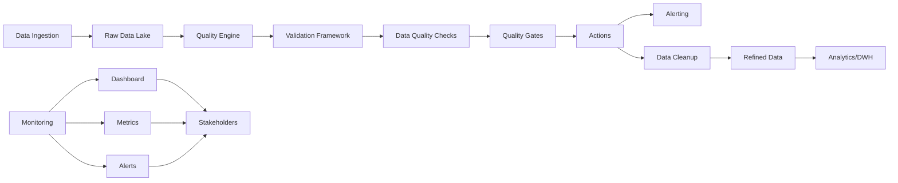
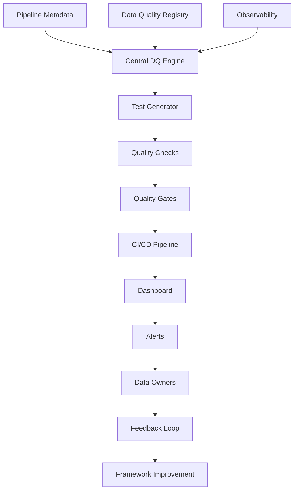
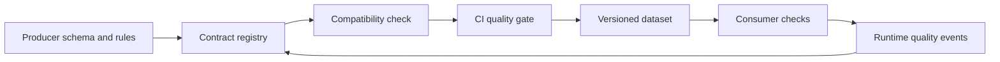
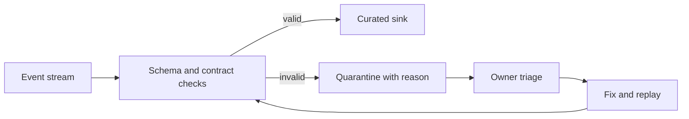
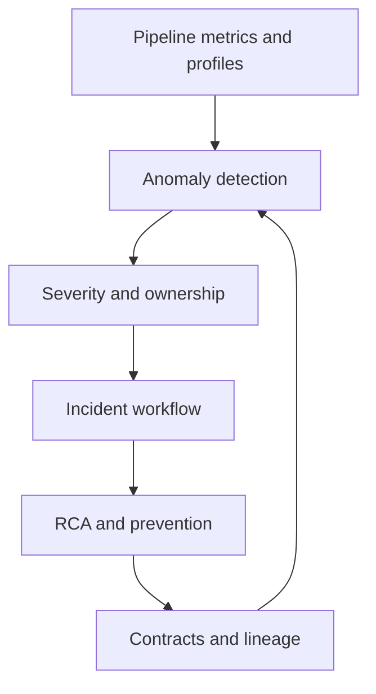
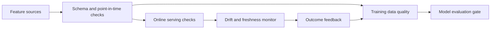

# Data Testing & Data Quality — Senior Test Engineer / Test Architect Interview Guide

## 1. Interview Expectations at 15+ Years

**What interviewers expect from a 15+ year candidate:**

- Can design data quality framework for 5,000+ pipelines
- Deep understanding of data quality dimensions (completeness, accuracy, validity, uniqueness, consistency, timeliness)
- Has implemented data observability and anomaly detection
- Can design data contracts and schema validation
- Understands production data quality incidents and RCA
- Can architect quality gates in CI/CD pipelines
- Has built Great Expectations/Deequ frameworks
- Can handle data drift, schema drift, lineage issues

1. **Senior Engineer:** Validates data quality rules
2. **Lead:** Designs DQ framework, defines SLAs
3. **Test Architect:** Architects data quality platform, defines governance
4. **Staff/Principal:** Influences data strategy across org, defines data contracts

## 2. Technology Overview

### What it is
Data quality (DQ) testing validates data against quality standards, contracts, and business requirements. Focuses on data profiling, anomaly detection, validation, and monitoring.

### How it works
Data is profiled → anomalies detected → validation runs → quality gates → alerts/actions. Automated frameworks enforce data quality rules across the data pipeline.

### Where it is used
Data pipelines, ETL/ELT processes, data lakes, warehouses, real-time streams, reporting systems.

### How it fails
- Profiling misses critical metrics
- Validation rules are incomplete
   - Late detection of data issues
- Alert fatigue due to noisy metrics
- No actionable quality outcomes

### How it should be tested
- Data profiling correctness
- Anomaly detection accuracy
- Validation rule effectiveness
- Quality gate functionality
- Monitoring and alerting reliability
- Integration with CI/CD

### How it should be automated
- Great Expectations/Deequ test frameworks
- Automated data quality checks in pipelines
- CI/CD integration with quality gates
- Monitoring with alerting
- Automated data lineage validation

## 3. Core Concepts

### Data Quality Dimensions

- **What:** Five (or more) core dimensions of data quality.
- **Why:** Provides systematic framework for assessing data quality.
- **How:** Completeness (no missing values), Accuracy (matches truth), Validity (conforms to schema), Uniqueness (no duplicates), Consistency (across systems).
- **Testing:** Each dimension tested with specific assertions.
- **Failure Modes:** Hidden data quality issues, silent failures.
- **Production:** Continuous monitoring for these dimensions.

#### Data Completeness
- **What:** Measure of how much data is present.
- **Why:** Missing data affects reliability.
- **How:** Count non-null values vs total records.
- **Testing:** Threshold-based alerts for missing data.
- **Failure Modes:** Undetected missing records.
- **Production:** Automated percentage monitoring.

#### Data Accuracy
- **What:** Match between data and reality/truth source.
- **Why:** Wrong data leads to wrong decisions.
- **How:** Compare with trusted source (master data, external system).
- **Testing:** Reconciliation against golden source.
- **Failure Modes:** Drift from source, transformation errors.
- **Production:** Automatic reconciliation with alerts.

#### Data Validity
- **What:** Conformance to expected format/structure.
- **Why:** Invalid data breaks processing.
- **How:** Schema validation, format checks, range validation.
- **Testing:** Schema validation tests, format checks.
- **Failure Modes:** Wrong types, malformed data.
- **Production:** Schema enforcement in ingestion.

#### Data Uniqueness
- **What:** Absence of duplicate records.
- **Why:** Duplicates skew analytics.
- **How:** Identify and remove duplicates based on business keys.
- **Testing:** Duplicate detection algorithms.
- **Failure Modes:** Duplicate processing, duplicate metrics.
- **Production:** Deduplication in pipeline.

#### Data Consistency
- **What:** Same data values across systems.
- **Why:** Inconsistent data causes confusion.
- **How:** Reconciliation between systems.
- **Testing:** Cross-system validation.
- **Failure Modes:** Inconsistent state, synchronization delays.
- **Production:** Consistent data governance.

#### Timeliness/Freshness
- **What:** How current the data is.
- **Why:** Stale data affects decisions.
- **How:** Measure time since last update.
- **Testing:** Latency measurement.
- **Failure Modes:** Late data, delayed updates.
- **Production:** SLA-based freshness monitoring.\n### Data Profiling

- **What:** Automated discovery of data characteristics.
- **Why:** Identifies quality issues early.
- **How:** Statistics, distributions, correlations.
- **Testing:** Profile accuracy, coverage.
- **Failure Modes:** Incomplete profiling.
- **Production:** Scheduled profiling runs.

#### Automated Profiling
- **What:** Automated data statistics generation.
- **Why:** Efficient data understanding.
- **How:** Row counts, column types, null rates, value distributions.
- **Testing:** Profile consistency across runs.
- **Failure Modes:** Biased sampling.
- **Production:** Continuous profiling.

#### Data Quality Score
- **What:** Composite metric of data quality.
- **Why:** Single quality indicator.
- **How:** Weighted average of dimensions.
- **Testing:** Score accuracy.
- **Failure Modes:** Poor weight selection.
- **Production:** Dashboard for stakeholders.

### Anomaly Detection

- **What:** Identification of unusual data patterns.
- **Why:** Early detection of problems.
- **How:** Statistical methods (z-score, IQR), machine learning.
- **Testing:** False positive/negative rates.
- **Failure Modes:** Missed anomalies, false alarms.
- **Production:** Automated anomaly alerts.

### Data Contracts

- **What:** Explicit agreement between data producers and consumers.
- **Why:** Defines expectations and responsibilities.
- **How:** JSON schema, documentation, SLA.
- **Testing:** Contract validation.
- **Failure Modes:** Contract drift.
- **Production:** Contract enforcement in CI/CD.

### Great Expectations

- **What:** Open-source data validation framework.
- **Why:** Declarative validation.
- **How:** Expectations defined in Python.
- **Testing:** Expectation correctness, performance.
- **Failure Modes:** Expectation bugs.
- **Production:** Integration in pipelines.

### Great Expectations Framework

- **What:** Structured validation of data.
- **Why:** Validates complex conditions.
- **How:** Expect_table, Expect_column_values_to_be_of_type, etc.
- **Testing:** Expectation implementation correctness.
- **Failure Modes:** Expectation chaining issues.
- **Production:** Automated test execution.

### Deequ

- **What:** AWS open-source data quality library for Spark.
- **Why:** Spark-native validation.
- **How:** Static analysis, runtime checks.
- **Testing:** Check correctness.
- **Failure Modes:** Check bugs.
- **Production:** Spark integration.

### Data Observability

- **What:** Monitoring data pipeline health.
- **Why:** Proactive issue detection.
- **How:** Metrics, lineage, data flow monitoring.
- **Testing:** Monitoring accuracy.
- **Failure Modes:** Blind spots in monitoring.
- **Production:** Dashboards for stakeholders.

### Data Lineage

- **What:** Track data origin and transformations.
- **Why:** Root cause analysis.
- **How:** Metadata capture.
- **Testing:** Lineage accuracy.
- **Failure Modes:** Incomplete lineage.
- **Production:** Automated lineage extraction.

### Data Governance

- **What:** Organizational rules for data management.
- **Why:** Compliance and quality assurance.
- **How:** Policies, roles, standards.
- **Testing:** Policy compliance.
- **Failure Modes:** Policy violations.
- **Production:** Enforcement mechanisms.

## 4. ARCHITECTURE



**Components:**
- Data ingestion (various sources)
- Raw storage (data lake)
- Quality engine (DQ framework)
- Validation framework (rules, expectations)
- Quality checks (constraints, validations)
- Quality gates (CI/CD integration)
- Actions (cleanup, alerting)
- Monitoring (dashboards, metrics, alerts)

**Test Points:**
- Data ingestion validation
- Quality rule execution
- Quality gate functioning
- Alert correctness
- Data quality metrics accuracy
- Monitoring accuracy

**Scalability:**
- Horizontal scaling of quality engine
- Distributed validation for large data
- Sampling for large datasets
- Caching for performance

**Reliability:**
- Idempotent quality checks
- Retry mechanisms for transient failures
- Dead-letter queues for validation errors
- Fallback mechanisms

## 5. TOP 50 INTERVIEW QUESTIONS

## Q1. What is data quality and why is it important?

**Difficulty:** Medium
**Interview Stage:** Technical Screen

### What the interviewer is testing
Understanding of data quality fundamentals.

### Strong Senior-Level Answer
Data quality ensures data is fit for purpose: accurate, complete, consistent, timely, valid. Poor data quality leads to wrong decisions, wasted resources, compliance issues. High-quality data is foundation of analytics, ML, reporting.

### Architect-Level Answer
Data quality is a platform concern. Design: 1) Data quality as a service, 2) Quality gates in CI/CD, 3) Automated quality checks, 4) Quality SLA dashboard, 5) Governance integration. Data quality impacts all downstream systems.

### Real-World Enterprise Scenario
Healthcare system with poor data quality had 20% medication errors due to incorrect patient data.

### Likely Follow-Up Questions
- What are key data quality dimensions?
- How do you measure data quality?
- How do you prioritize data quality issues?

### Common Weak Answer
"Data quality is good data."

### Interviewer Probe
"Data quality impacts downstream systems. How?"

### Hands-On Exercise
Design data quality framework for a banking system with 5 critical tables.

---

## Q2. List and explain the five core data quality dimensions.

**Difficulty:** Medium
**Interview Stage:** Technical Screen

### What the interviewer is testing
Knowledge of data quality dimensions.

### Strong Senior-Level Answer
Core dimensions:
1) Completeness: No missing data
2) Accuracy: Matches truth
3) Validity: Conforms to schema
4) Uniqueness: No duplicates
5) Consistency: Same across systems

Each dimension critical for different aspects of data usage.

### Architect-Level Answer
Dimensions can be expanded. Add: Timeliness, Security, Trust. Dimensions guide testing priorities. Each dimension requires specific validation.

### Real-World Enterprise Scenario
Financial reports had 10% error rate due to completeness issues.

### Likely Follow-Up Questions
- How do you measure completeness?
- What if dimension conflicts?
- How do you prioritize dimensions?

### Common Weak Answer
"Complete, accurate, valid."

### Interviewer Probe
"Uniqueness dimension. What happens if violated?"

### Hands-On Exercise
Write SQL to measure each dimension for a sample table.

---

## Q3. How do you implement data completeness validation?

**Difficulty:** Medium
**Interview Stage:

### What the interviewer is testing
Completeness validation implementation.

### Strong Senior-Level Answer
Count non-null values per column against total rows. Set thresholds (e.g., >95%). Alert when below threshold. Track trend over time. Validate with source for critical columns.

### Architect-Level Answer
Completeness validation requires automation. Implement: 1) Automated completeness checks, 2) Threshold-based alerting, 3) Trend monitoring, 4) Source reconciliation for critical data, 5) Data lineage for completeness tracking. Use Great Expectations or Deequ for implementation.

### Real-World Enterprise Scenario
E-commerce platform had 5% incomplete order data; resolved with automated validation.

### Likely Follow-Up Questions
- How do you set completeness thresholds?
- What if columns are optional?
- How do you test completeness?

### Common Weak Answer
"Check for null values."

### Interviewer Probe
"Completeness threshold 99% but business says 99.9% required. What do you do?"

### Hands-On Exercise
Write Python code to validate completeness with threshold-based alerting.

---

## Q4. How do you measure data accuracy?

**Difficulty:** Hard
**Interview Stage:** Technical Deep Dive

### What the interviewer is testing
Accuracy measurement implementation.

### Strong Senior-Level Answer
Compare data against trusted source (master data, external system). Use reconciliation: source record vs target record matching. For high-volume data, use hashing for approximate matching. Validate key metrics (revenue, counts, totals).

### Architect-Level Answer
Accuracy validation requires source trust. Implement: 1) Source tracking, 2) Reconciliation automation, 3) Exception handling for mismatches, 4) Impact analysis, 5) Automated source updates. Use change data capture for real-time accuracy.

### Real-World Enterprise Scenario
Customer address accuracy improved from 80% to 95% after automated reconciliation.

### Likely Follow-Up Questions
- How do you handle source changes?
- What if source is unreliable?
- How do you test accuracy at scale?

### Common Weak Answer
"Compare with source."

### Interviewer Probe
"Accuracy threshold is 99.9%. Sample shows 99.8%. What do you do?"

### Hands-On Exercise
Write SQL to reconcile source data and identify mismatches.

---

## Q5. How do you validate data validity?

**Difficulty:** Medium
**Interview Stage:** Technical Screen

### What the interviewer is testing
Validity validation implementation.

### Strong Senior-Level Answer
Validate data schema, format, business rules. Use schema validation, regex patterns, constraints. Validate against reference data, lookup tables.

### Architect-Level Answer
Validity validation requires systematic approach. Implement: 1) Schema validation using Avro/Parquet metadata, 2) Format validation (email, phone, dates), 3) Business rule validation, 4) Reference data validation, 5) Automated validation in pipeline. Use Great Expectations for declarative validation.

### Real-World Enterprise Scenario
Email format validation prevented 1000s of invalid emails in marketing campaigns.

### Likely Follow-Up Questions
- How do you validate email formats?
- What if business rules conflict?
- How do you handle format evolution?

### Common Weak Answer
"Check data types."

### Interviewer Probe
"Data valid according to schema but business meaning is wrong. Why?"

### Hands-On Exercise
Write Python script to validate data format and business rules.

---

## Q6. How do you detect and handle data duplicates?

**Difficulty:** Medium
**Interview Stage:** Technical Screen

### What the interviewer is testing
Duplicate detection implementation.

### Strong Senior-Level Answer
Detect duplicates: 1) Hash-based detection (MD5/SHA on key columns), 2) Row-by-row comparison, 3) Rank functions, 4) Window functions. Handle duplicates: remove, flag for review, merge.

### Architect-Level Answer
Duplicate detection requires automation. Implement: 1) Duplicate detection algorithms, 2) Duplicate handling strategies (remove, quarantine, merge), 3) Alerting on duplicates, 4) Prevention mechanisms, 5) Monitoring duplicate rates. Use deduplication in pipeline.

### Real-World Enterprise Scenario
Customer duplicate detection reduced customer counts from 1.2M to 1M (20% reduction).

### Likely Follow-Up Questions
- How do you detect duplicates at scale?
- What if duplicates are legitimate?
- How do you handle duplicate updates?

### Common Weak Answer
"Remove duplicates."

### Interviewer Probe
"Duplicate with same business key but different values. Which to keep?"

### Hands-On Exercise
Write SQL to detect and handle duplicates with business key logic.

---

## Q7. How do you validate data consistency across systems?

**Difficulty:** Hard
**Interview Stage:** Technical Deep Dive

### What the interviewer is testing
Cross-system consistency validation.

### Strong Senior-Level Answer
Validate consistency: 1) Reconciliation between systems, 2) Synchronize timestamps, 3) Master data synchronization, 4) Compare aggregates, 5) Compare transactional data. Use ETL logs for traceability.

### Architect-Level Answer
Consistency validation requires systematic approach. Implement: 1) Cross-system reconciliation tests, 2) Synchronization monitoring, 3) Master data governance, 4) Reconciliation dashboards, 5) Automated consistency checks. Use change data capture for real-time sync.

### Real-World Enterprise Scenario
CRM and ERP systems had inconsistent customer data; resolved with reconciliation process.

### Likely Follow-Up Questions
- How do you handle synchronization delays?
- What if systems have different data?
- How do you test consistency?

### Common Weak Answer
"Compare data between systems."

### Interviewer Probe
"Two systems have same data but different timestamps. Which is correct?"

### Hands-On Exercise
Write SQL to validate consistency across two systems with reconciliation logic.

---

## Q8. How do you implement automated data quality checks in CI/CD?

**Difficulty:** Hard
**Interview Stage:** Architecture

### What the interviewer is testing
CI/CD integration of quality checks.

### Strong Senior-Level Answer
Implement: 1) Automated quality gates in CI/CD, 2) Pre-commit hooks for code quality, 3) Post-merge validation, 4) Quality dashboards, 5) Rollback on quality failure. Use Great Expectations/Deequ in pipeline.

### Architect-Level Answer
CI/CD integration requires automation. Implement: 1) Quality checks as part of CI/CD pipeline, 2) Quality gate definitions, 3) Automated fail-fast, 4) Quality metrics in pull requests, 5) Quality review workflow. Use GitHub Actions/Ansible for implementation.

### Real-World Enterprise Scenario
CI/CD pipeline stops on data quality failure; reduced defects significantly.

### Likely Follow-Up Questions
- How do you define quality gates?
- What if tests take too long?
- How do you handle flaky tests?

### Common Weak Answer
"Run tests before merge."

### Interviewer Probe
"Quality gate fails due to false positive. How do you handle?"

### Hands-On Exercise
Design CI/CD pipeline with data quality gates and automation.

---

## Q9. How do you design a data quality framework for 5,000 pipelines?

**Difficulty:** Very Hard
**Interview Stage:** Architect

### What the interviewer is testing
Enterprise-scale DQ framework design.

### Strong Senior-Level Answer
Design layered framework: 1) Centralized quality engine, 2) Metadata-driven test generation, 3) Quality service API, 4) Orchestration for scaling, 5) Monitoring and alerting, 6) CI/CD integration. Use serverless for scale. Leverage Great Expectations/Deequ.

### Architect-Level Answer
Enterprise DQ framework requires systematic design. Implement: 1) Unified quality platform, 2) Metadata-driven tests, 3) Orchestration for scalability, 4) Monitoring and alerting, 5) CI/CD integration, 6) Self-service for teams. Use cloud-native services for scale and governance.

### Real-World Enterprise Scenario
5,000 pipelines tested manually; framework reduced testing time by 90%.

### Likely Follow-Up Questions
- How do you prioritize pipelines?
- What if some pipelines have low usage?
- How do you handle framework maintenance?

### Common Weak Answer
"Test all pipelines manually."

### Interviewer Probe
"5,000 pipelines, 2 data engineers. How do you scale testing?"

### Hands-On Exercise
Design enterprise data quality framework with metadata, orchestration, and monitoring.

---

## Q10. How do you handle data quality incidents in production?

**Difficulty:** Hard
**Interview Stage:** Production Debugging

### What the interviewer is testing
Incident management skills.

### Strong Senior-Level Answer
Handle incidents: 1) Immediate isolation, 2) Root cause analysis, 3) Remediation, 4) Post-incident review, 5) Prevention. Use incident management tools.

### Architect-Level Answer
Incident management requires systematic approach. Implement: 1) Incident detection and response, 2) Root cause analysis, 3) Remediation playbooks, 4) Post-incident review, 5) Prevention mechanisms. Use Slack/Teams for communication.

### Real-World Enterprise Scenario
Data quality incident caused revenue reporting error; incident managed with 4-hour resolution.

### Likely Follow-Up Questions
- How do you detect incidents?
- What if root cause is complex?
- How do you prevent recurrence?

### Common Weak Answer
"Fix the data."

### Interviewer Probe
"Incident affects 1000 users. How do you prioritize?"

### Hands-On Exercise
Design incident response plan for data quality issues with escalation and communication.

---

## Q11. How do you validate data contracts?

**Difficulty:** Hard
**Interview Stage:** Technical Deep Dive

### What the interviewer is testing
Data contract validation.

### Strong Senior-Level Answer
Validate contracts: 1) Schema validation, 2) Data quality validation, 3) Contract versioning, 4) Contract enforcement, 5) Consumer validation. Use OpenAPI/Swagger for contracts.

### Architect-Level Answer
Contract validation requires systematic approach. Implement: 1) Contract schema validation, 2) Data quality validation, 3) Contract versioning, 4) Contract enforcement in pipeline, 5) Consumer validation. Use GitOps for contract management.

### Real-World Enterprise Scenario
Data contract prevented breaking schema change; caught in PR.

### Likely Follow-Up Questions
- How do you version contracts?
- What if consumer changes?
- How do you enforce contracts?

### Common Weak Answer
"Validate schema."

### Interviewer Probe
"Contract changed but consumer not updated. What happens?"

### Hands-On Exercise
Design data contract validation framework with schema and quality checks.

---

## Q12. How do you implement data observability?

**Difficulty:** Hard
**Interview Stage:

### What the interviewer is testing
Data observability implementation.

### Strong Senior-Level Answer
Implement: 1) Data lineage, 2) Data quality metrics, 3) Data volume/timeliness monitoring, 4) Anomaly detection, 5) Alerting, 6) Dashboard. Use tools like Monte Carlo, DataHub.

### Architect-Level Answer
Observability requires comprehensive monitoring. Implement: 1) Data lineage tools, 2) Quality metrics collection, 3) Volume/timeliness monitoring, 4) Anomaly detection, 5) Alerting, 6) Dashboard. Use cloud-native observability platforms.

### Real-World Enterprise Scenario
Data observability reduced time to detect data issues from 24h to 5 minutes.

### Likely Follow-Up Questions
- How do you monitor lineage?
- What if monitoring fails?
- How do you handle false alerts?

### Common Weak Answer
"Just collect metrics."

### Interviewer Probe
"Monitoring shows all metrics green but data quality issues exist. Why?"

### Hands-On Exercise
Design data observability framework with monitoring and alerting.

---

## Q13. How do you handle data drift detection?

**Difficulty:** Hard
**Interview Stage:** Technical Deep Dive

### What the interviewer is testing
Data drift detection.

### Strong Senior-Level Answer
Detect drift: 1) Statistical tests (Kolmogorov-Smirnov, KS test), 2) Feature importance changes, 3) Model performance degradation, 4) Alert on significant drift. Monitor drift over time.

### Architect-Level Answer
Drift detection requires systematic approach. Implement: 1) Statistical drift detection, 2) Feature importance monitoring, 3) Model performance drift detection, 4) Alerting, 5) Drift dashboard. Use online learning for continuous monitoring.

### Real-World Enterprise Scenario
Feature drift detected in 2 days; model retrained, preventing revenue loss.

### Likely Follow-Up Questions
- How do you define drift threshold?
- What if drift is gradual?
- How do you handle drift remediation?

### Common Weak Answer
"Detect changes in data."

### Interviewer Probe
"Drift detected but model performance unchanged. Do we need to act?"

### Hands-On Exercise
Design data drift detection with statistical tests and alerting.

---

## Q14. How do you implement Great Expectations for data validation?

**Difficulty:** Medium
**Interview Stage:** Technical Screen

### What the interviewer is testing
Great Expectations implementation.

### Strong Senior-Level Answer
Implement: 1) Expectation suites, 2) Validation with batch, 3) Reporting, 4) Integration with pipelines, 5) Monitoring. Use examples: expect_table_row_count_to_equal, expect_column_values_to_be_of_type.

### Architect-Level Answer
Great Expectations integration requires systematic approach. Implement: 1) Expectation suite management, 2) Validation automation, 3) Reporting, 4) Pipeline integration, 5) Monitoring. Use Git for expectation version control.

### Real-World Enterprise Scenario
Great Expectations caught data quality issues in CI/CD; reduced defects by 80%.

### Likely Follow-Up Questions
- How do you define expectations?
- What if expectations fail?
- How do you integrate with pipeline?

### Common Weak Answer
"Create expectation suite."

### Interviewer Probe
"Expectation suite wrong. What happens?"

### Hands-On Exercise
Write Great Expectations suite for validating customer data.

---

## Q15. How do you test data quality using Deequ?

**Difficulty:** Medium
**Interview Stage:** Technical Screen

### What the interviewer is testing
Deequ implementation.

### Strong Senior-Level Answer
Implement: 1) Deequ analysis, 2) Spark integration, 3) Constraint validation, 4) Reporting, 5) CI/CD integration. Use examples: Deequ constraints for uniqueness, completeness.

### Architect-Level Answer
Deequ integration requires Spark awareness. Implement: 1) Deequ analysis jobs, 2) Constraint validation, 3) Reporting, 4) Integration with Spark, 5) Monitoring. Use AWS Glue or EMR for execution.

### Real-World Enterprise Scenario
Deequ detected data quality issues in Redshift; fixed before loading.

### Likely Follow-Up Questions
- How do you define Deequ constraints?
- What if Deequ is slow?
- How do you integrate with Spark?

### Common Weak Answer
"Run Deequ analysis."

### Interviewer Probe
"Deequ constraint fails. What does it mean?"

### Hands-On Exercise
Write PySpark with Deequ constraints for data validation.

---

## Q16. How do you design a data quality dashboard?

**Difficulty:** Hard
**Interview Stage:** Architecture

### What the interviewer is testing
Dashboard design.

### Strong Senior-Level Answer
Design: 1) KPI widgets, 2) Status indicators, 3) Trend charts, 4) Drill-down capabilities, 5) Alert integration. Use visualizations for data quality metrics.

### Architect-Level Answer
Dashboard design requires user awareness. Implement: 1) KPI visualization, 2) Status indicators, 3) Trend analysis, 4) Drill-down, 5) Alerts, 6) Role-based access. Use Grafana/Power BI for dashboard.

### Real-World Enterprise Scenario
Data quality dashboard reduced time to detect issues by 90%.

### Likely Follow-Up Questions
- How do you choose KPIs?
- What if dashboard is slow?
- How do you handle user access?

### Common Weak Answer
"Build dashboard with charts."

### Interviewer Probe
"Dashboard shows all metrics green but data quality issues exist. Why?"

### Hands-On Exercise
Design data quality dashboard with KPIs, trends, and alerts.

---

## Q17. How do you implement anomaly detection for data quality?

**Difficulty:** Hard
**Interview Stage:** Technical Deep Dive

### What the interviewer is testing
Anomaly detection implementation.

### Strong Senior-Level Answer
Implement: 1) Statistical methods (z-score, IQR), 2) Machine learning (isolation forest), 3) Rule-based detection, 4) Alerting, 5) Investigation. Use alerts for significant deviations.

### Architect-Level Answer
Anomaly detection requires systematic approach. Implement: 1) Statistical methods, 2) ML models, 3) Rule-based detection, 4) Alerting, 5) Investigation tools. Use cloud-based anomaly detection services.

### Real-World Enterprise Scenario
Anomaly detection identified data quality issues 24 hours earlier than manual review.

### Likely Follow-Up Questions
- How do you define normal vs anomalous?
- What if false positives are high?
- How do you investigate anomalies?

### Common Weak Answer
"Detect outliers."

### Interviewer Probe
"Anomaly detection flagged 100 rows as anomalous. How do you investigate?"

### Hands-On Exercise
Design anomaly detection system with statistical methods and alerting.

---

## Q18. How do you handle data quality with time-series data?

**Difficulty:** Hard
**Interview Stage:** Technical Deep Dive

### What the interviewer is testing
Time-series data quality.

### Strong Senior-Level Answer
Test: 1) Seasonality detection, 2) Trend detection, 3) Lag validation, 4) Outlier detection in time dimension, 5) Interpolation methods. Validate data quality over time.

### Architect-Level Answer
Time-series quality requires temporal awareness. Implement: 1) Seasonality detection, 2) Trend validation, 3) Lag validation, 4) Outlier detection, 5) Interpolation, 6) Time-based validation. Use time-series databases for analysis.

### Real-World Enterprise Scenario
Time-series data had missing values affecting forecasting accuracy.

### Likely Follow-Up Questions
- How do you detect seasonality?
- What if data has gaps?
- How do you handle time-based anomalies?

### Common Weak Answer
"Check time-series values."

### Interviewer Probe
"Time-series shows unusual spike. What could cause it?"

### Hands-On Exercise
Design time-series data quality validation with seasonal and trend analysis.

---

## Q19. How do you test data quality in streaming data?

**Difficulty:** Very Hard
**Interview Stage:** Architect

### What the interviewer is testing
Streaming data quality.

### Strong Senior-Level Answer
Test: 1) Schema validation, 2) Schema evolution, 3) Late data handling, 4) Watermark validation, 5) State validation, 6) Exactly-once semantics. Validate streaming data as it arrives.

### Architect-Level Answer
Streaming data quality requires real-time validation. Implement: 1) Schema validation, 2) Schema evolution tests, 3) Late data handling, 4) Watermark validation, 5) State validation, 6) Exactly-once validation. Use stream processing frameworks for testing.

### Real-World Enterprise Scenario
Streaming data quality issues caused downstream processing failures.

### Likely Follow-Up Questions
- How do you test schema evolution in streams?
- What if late data causes issues?
- How do you handle exactly-once semantics?

### Common Weak Answer
"Test streaming data as it comes."

### Interviewer Probe
"Streaming job had duplicate records. How do you debug?"

### Hands-On Exercise
Design streaming data quality validation with schema evolution and late data handling.

---

## Q20. How do you implement data quality for IoT data?

**Difficulty:** Very Hard
**Interview Stage:** Architect

### What the interviewer is testing
IoT data quality testing.

### Strong Senior-Level Answer
IoT data quality: 1) Sensor calibration validation, 2) Timestamp synchronization, 3) Missing data handling, 4) Duplicate detection, 5) Outlier detection, 6) Integrity validation. Validate sensor data reliability.

### Architect-Level Answer
IoT data quality requires sensor awareness. Implement: 1) Sensor calibration tests, 2) Timestamp synchronization, 3) Missing data handling, 4) Duplicate detection, 5) Outlier detection, 6) Integrity validation. Use edge computing for real-time validation.

### Real-World Enterprise Scenario
IoT sensor calibration drift caused inaccurate readings; detected with data quality checks.

### Likely Follow-Up Questions
- How do you validate sensor calibration?
- What if timestamps are out of sync?
- How do you handle missing data?

### Common Weak Answer
"Validate IoT data."

### Interviewer Probe
"IoT sensor shows unusual reading. Is it sensor fault or data anomaly?"

### Hands-On Exercise
Design IoT data quality validation with sensor calibration and timestamp synchronization.

---

## Q21. Your data quality dashboard shows all metrics green but business reports issues. How do you investigate?

**Difficulty:** Hard
**Interview Stage:** Production Debugging

### What the interviewer is testing
Systematic debugging.

### Strong Senior-Level Answer
1) Check data freshness, 2) Check metric calculations, 3) Check downstream consumption, 4) Check business logic, 5) Check data source. Use data lineage to trace.

### Architect-Level Answer
Dashboard green but business issues requires investigation. Implement: 1) Data freshness check, 2) Metric calculation validation, 3) Downstream consumption analysis, 4) Business logic review, 5) Source validation. Use root cause analysis.

### Real-World Enterprise Scenario
Dashboard metrics green but business reports revenue discrepancies; investigation revealed calculation error.

### Likely Follow-Up Questions
- How do you trace data lineage?
- What if metric calculation is wrong?
- How do you validate business logic?

### Common Weak Answer
"Check dashboard data."

### Interviewer Probe
"Dashboard shows 100 units sold but business reports 120. What happened?"

### Hands-On Exercise
Write investigation plan for data quality issues with business impact.

---

## Q22. How do you test data quality with GDPR/CCPA compliance?

**Difficulty:** Hard
**Interview Stage:** Technical Deep Dive

### What the interviewer is testing
Compliance testing.

### Strong Senior-Level Answer
Test compliance: 1) PII detection, 2) Consent validation, 3) Right to deletion, 4) Data retention policies, 5) Anonymization validation. Validate regulatory compliance.

### Architect-Level Answer
Compliance testing requires legal awareness. Implement: 1) PII detection, 2) Consent validation, 3) Deletion testing, 4) Retention policy validation, 5) Anonymization validation. Use data catalog for compliance.

### Real-World Enterprise Scenario
GDPR compliance violation due to missing consent for PII.

### Likely Follow-Up Questions
- How do you detect PII?
- What if consent is missing?
- How do you handle deletion requests?

### Common Weak Answer
"Check for PII."

### Interviewer Probe
"Data has PII but no consent. What happens?"

### Hands-On Exercise
Design compliance test for GDPR with PII detection and consent validation.

---

## Q23. How do you test data quality with AI/ML model inputs?

**Difficulty:** Very Hard
**Interview Stage:** Architect

### What the interviewer is testing
ML data quality.

### Strong Senior-Level Answer
Test ML inputs: 1) Data distribution validation, 2) Feature completeness, 3) Outlier detection, 4) Missing value handling, 5) Label validation. Validate inputs match model training expectations.

### Architect-Level Answer
ML data quality requires model awareness. Implement: 1) Data distribution validation, 2) Feature completeness tests, 3) Outlier detection, 4) Missing value validation, 5) Label validation. Use automated pipelines for continuous validation.

### Real-World Enterprise Scenario
ML model input data drift caused accuracy degradation; detected with data quality checks.

### Likely Follow-Up Questions
- How do you detect data distribution drift?
- What if features are incomplete?
- How do you validate labels?

### Common Weak Answer
"Validate ML features."

### Interviewer Probe
"ML model accuracy dropped due to input data changes. What could cause?"

### Hands-On Exercise
Design ML data quality validation with distribution drift and feature validation.

---

## Q24. How do you implement data quality with multi-tenancy?

**Difficulty:** Hard
**Interview Stage:** Technical Deep Dive

### What the interviewer is testing
Multi-tenant data quality.

### Strong Senior-Level Answer
Implement: 1) Tenant isolation, 2) Tenant-specific quality rules, 3) Cross-tenant validation, 4) Resource allocation, 5) Data governance. Validate per-tenant quality.

### Architect-Level Answer
Multi-tenant quality requires isolation. Implement: 1) Tenant data isolation, 2) Tenant-specific rules, 3) Cross-tenant validation, 4) Resource management, 5) Governance. Use tenant identifiers for separation.

### Real-World Enterprise Scenario
Multi-tenant platform had data quality issues across tenants; implemented per-tenant quality checks.

### Likely Follow-Up Questions
- How do you isolate tenants?
- What if rules conflict?
- How do you validate cross-tenant?

### Common Weak Answer
"Separate data per tenant."

### Interviewer Probe
"Tenant A and B share same database. What happens to data quality?"

### Hands-On Exercise
Design multi-tenant data quality with tenant isolation and validation.

---

## Q25. How do you test data quality with shadow database (copy of production data)?

**Difficulty:** Hard
**Interview Stage:** Technical Deep Dive

### What the interviewer is testing
Shadow database testing.

### Strong Senior-Level Answer
Test: 1) Data correctness (shadow vs production), 2) Performance, 3) Schema validation, 4) Data volume, 5) Data freshness. Validate shadow matches production.

### Architect-Level Answer
Shadow testing requires validation. Implement: 1) Shadow database setup, 2) Data correctness validation, 3) Performance testing, 4) Schema validation, 5) Data freshness. Use automated comparison.

### Real-World Enterprise Scenario
Shadow database used for testing; validated data matches production before deployment.

### Likely Follow-Up Questions
- How do you validate shadow data?
- What if shadow is stale?
- How do you maintain shadow?

### Common Weak Answer
"Create shadow database."

### Interviewer Probe
"Shadow database has old data. What do you do?"

### Hands-On Exercise
Design shadow database validation with data correctness and performance testing.

---

## Q26. How do you test data quality with backup and restore?

**Difficulty:** Medium
**Interview Stage:** Technical Screen

### What the interviewer is testing
Backup/restore quality.

### Strong Senior-Level Answer
Test: 1) Backup completeness, 2) Restore accuracy, 3) Recovery time, 4) Integrity, 5) Performance. Validate backup meets recovery objectives.

### Architect-Level Answer
Backup testing requires systematic approach. Implement: 1) Backup completeness tests, 2) Restore accuracy tests, 3) Recovery time measurement, 4) Integrity validation, 5) Performance testing. Use automated backup validation.

### Real-World Enterprise Scenario
Backup restoration test revealed corrupted data; discovered backup process failure.

### Likely Follow-Up Questions
- How do you test backup completeness?
- What if restore is slow?
- How do you test integrity?

### Common Weak Answer
"Backup and restore."

### Interviewer Probe
"Backup restored but data is corrupted. What happened?"

### Hands-On Exercise
Design backup quality test with completeness and restore validation.

---

## Q27. How do you implement data quality with data catalog integration?

**Difficulty:** Hard
**Interview Stage:** Technical Deep Dive

### What the interviewer is testing
Catalog integration.

### Strong Senior-Level Answer
Implement: 1) Catalog metadata, 2) Quality metrics in catalog, 3) Lineage integration, 4) Quality gates in catalog, 5) Search capabilities. Validate catalog quality.

### Architect-Level Answer
Catalog integration requires metadata awareness. Implement: 1) Catalog metadata enrichment, 2) Quality metrics in catalog, 3) Lineage integration, 4) Quality gates, 5) Search. Use metadata APIs for integration.

### Real-World Enterprise Scenario
Data catalog integrated quality metrics; improved discoverability and trust.

### Likely Follow-Up Questions
- How do you integrate with catalog?
- What if catalog is incomplete?
- How do you validate catalog?

### Common Weak Answer
"Add quality to catalog."

### Interviewer Probe
"Catalog shows quality metric. What does it mean?"

### Hands-On Exercise
Design catalog integration with quality metadata and lineage.

---

## Q28. How do you test data quality with real-time streaming dashboard?

**Difficulty:** Very Hard
**Interview Stage:** Architect

### What the interviewer is testing
Real-time quality testing.

### Strong Senior-Level Answer
Test: 1) Data latency, 2) Data freshness, 3) Real-time validation, 4) Performance, 5) Monitoring. Validate streaming dashboard quality in real-time.

### Architect-Level Answer
Real-time testing requires speed. Implement: 1) Latency testing, 2) Freshness validation, 3) Real-time validation, 4) Performance monitoring, 5) Alerting. Use streaming platforms for testing.

### Real-World Enterprise Scenario
Real-time dashboard showed data quality issues; detected with real-time validation.

### Likely Follow-Up Questions
- How do you test latency?
- What if real-time validation is slow?
- How do you monitor?

### Common Weak Answer
"Test dashboard in real-time."

### Interviewer Probe
"Real-time dashboard shows issue. How do you debug?"

### Hands-On Exercise
Design real-time dashboard quality with latency and validation testing.

---

## Q29. How do you test data quality with data warehouse migrations?

**Difficulty:** Very Hard
**Interview Stage:** Architect

### What the interviewer is testing
Migration quality.

### Strong Senior-Level Answer
Test migrations: 1) Data completeness, 2) Schema validation, 3) Performance, 4) Data integrity, 5) Business rule validation, 6) Cutover validation. Validate migration correctness.

### Architect-Level Answer
Migration testing requires systematic approach. Implement: 1) Data completeness tests, 2) Schema validation, 3) Performance tests, 4) Integrity validation, 5) Business rule validation, 6) Cutover tests. Use parallel runs for validation.

### Real-World Enterprise Scenario
DWH migration had data quality issues; discovered after cutover; impact on reporting.

### Likely Follow-Up Questions
- How do you test data completeness?
- What if migration is slow?
- How do you test schema validation?

### Common Weak Answer
"Migrate data and test."

### Interviewer Probe
"Migration cutover shows data mismatch. What happened?"

### Hands-On Exercise
Design migration quality with validation and cutover testing.

---

## Q30. Architect a data quality platform for 100+ data sources.

**Difficulty:** Architect
**Interview Stage:** Architect Round

### What the interviewer is testing
Enterprise-scale DQ platform design.

### Strong Senior-Level Answer
Design platform: 1) Centralized engine, 2) Metadata-driven tests, 3) Orchestration for scale, 4) Monitoring, 5) CI/CD integration, 6) Self-service for teams. Use serverless for scale and governance.

### Architect-Level Answer
Enterprise platform requires comprehensive design. Implement: 1) Unified quality platform, 2) Metadata-driven tests, 3) Orchestration, 4) Monitoring, 5) CI/CD, 6) Self-service. Use cloud-native services for scale and governance.

### Real-World Enterprise Scenario
100+ data sources tested manually; platform reduced testing time by 95%.

### Likely Follow-Up Questions
- How do you prioritize sources?
- What if sources are diverse?
- How do you handle framework maintenance?

### Common Weak Answer
"Build platform for all sources."

### Interviewer Probe
"100+ sources, limited resources. How do you scale?"

### Hands-On Exercise
Design enterprise data quality platform with metadata, orchestration, and monitoring.

---

## Q31. A quality score improves after a rule change, but business users report worse data. How do you investigate?
**Difficulty:** Hard | **Interview Stage:** Production Debugging
### What the interviewer is testing
Whether the candidate distinguishes score movement from real fitness for use.
### Strong Senior-Level Answer
Compare rule versions, populations, weights, and excluded records; trace the affected critical data elements to source and downstream consumers. Recompute old and new rules over the same snapshots, sample failures, and ask the data owner to confirm business semantics before reverting or changing thresholds.
### Architect-Level Answer
Version rules and score definitions, preserve lineage to the source run, and report dimension-level measures rather than one opaque composite. Treat material rule changes as governed releases with impact analysis and replay capability.
### Real-World Enterprise Scenario
A null threshold was relaxed to reduce alert volume, raising the aggregate score while omitting missing payment dates from the denominator.
### Likely Follow-Up Questions
- How do you compare scores across rule versions?
- Who approves a semantic rule change?
- How do you communicate uncertainty to consumers?
### Common Weak Answer
"The score is higher, so quality improved."
### Interviewer Probe
Did the population or denominator change?
### Hands-On Exercise
Design a versioned score report that exposes population, denominator, rule version, and exceptions.

## Q32. Design a data-quality framework for 5,000 pipelines without creating a centralized bottleneck.
**Difficulty:** Architect | **Interview Stage:** Architecture
### What the interviewer is testing
Platform scale, federated ownership, and governance.
### Strong Senior-Level Answer
Standardize contracts, rule metadata, execution interfaces, result schemas, alert routing, and ownership while allowing domains to author business rules. Run checks near data, prioritize critical datasets, and provide reusable templates rather than central review of every rule.
### Architect-Level Answer
Use a registry/control plane for ownership, criticality, lineage, policy, and rule versions; distributed execution adapters for warehouses, Spark, and streams; and a results plane for metrics, incidents, and audit. Enforce quotas, cost attribution, access control, compatibility, and SLOs. Roll out in tiers based on criticality and adoption readiness.
### Real-World Enterprise Scenario
Thousands of independently deployed pipelines need contract checks but share a finite warehouse budget.
### Likely Follow-Up Questions
- How do you prevent rule duplication?
- What belongs in the control plane?
- How do teams onboard without migration downtime?
### Common Weak Answer
"Run every possible check centrally after every job."
### Interviewer Probe
How does the platform behave if its metadata service is unavailable?
### Hands-On Exercise
Whiteboard control plane, execution adapters, result store, and ownership workflow.

## Q33. A downstream KPI changed while source row counts remain stable. How do you localize the defect?
**Difficulty:** Hard | **Interview Stage:** Production Debugging
### What the interviewer is testing
Lineage-based diagnosis beyond volume checks.
### Strong Senior-Level Answer
Pin the time window, business definition, and affected dimensions; compare source, intermediate, and serving aggregates at matching grains. Inspect schema, joins, filters, late data, deduplication, and semantic-model changes; isolate a small discrepant partition and trace record-level examples.
### Architect-Level Answer
Use lineage and run metadata to walk upstream from the KPI, compare versioned transformations and contracts, and identify the first divergence. Preserve reproducible snapshots and distinguish data defect from definition or freshness change.
### Real-World Enterprise Scenario
Revenue count is stable, but a many-to-many customer mapping doubles a subset of attributed sales.
### Likely Follow-Up Questions
- Which grain should reconciliation use?
- How do you avoid comparing different refresh snapshots?
- What evidence is needed before rollback?
### Common Weak Answer
"Check the source row count and rerun the pipeline."
### Interviewer Probe
At which layer does the first invariant fail?
### Hands-On Exercise
Create a triage query that compares revenue by date, region, and source system across layers.

## Q34. How do you distinguish schema drift from a legitimate schema evolution?
**Difficulty:** Hard | **Interview Stage:** Technical Deep Dive
### What the interviewer is testing
Compatibility, contract ownership, and change control.
### Strong Senior-Level Answer
Compare the observed schema with a versioned contract and classify additions, removals, renames, type changes, nullability, and semantic changes. Validate producer intent, consumer compatibility, and sample values; block breaking changes or route them through an explicit migration plan.
### Architect-Level Answer
Use producer-owned contracts with compatibility policy by data format and consumer needs. Publish changes before deployment, support dual-read/backfill where required, and monitor actual consumer usage rather than assuming optional columns are unused.
### Real-World Enterprise Scenario
A producer changes a decimal field to string to accommodate a new sentinel value; parsing succeeds but downstream aggregates silently exclude it.
### Likely Follow-Up Questions
- Is adding a nullable field always backward compatible?
- How do you coordinate a rename across teams?
- What does schema compatibility not guarantee?
### Common Weak Answer
"Any added column is safe."
### Interviewer Probe
Can a schema-compatible change still alter business meaning?
### Hands-On Exercise
Classify five schema diffs as compatible, conditional, or breaking and state the gate.

## Q35. A freshness SLA is missed even though the pipeline reports success. What is your response?
**Difficulty:** Hard | **Interview Stage:** Production Debugging
### What the interviewer is testing
Business-aware freshness measurement and incident handling.
### Strong Senior-Level Answer
Measure freshness from event/business time and expected delivery, not only job completion time. Check source arrival, watermark/partition completeness, orchestration lag, and serving refresh. Notify affected consumers with scope and last-good timestamp; restore or backfill and verify downstream recovery.
### Architect-Level Answer
Define freshness SLOs per dataset and consumer, separate processing latency from source delay, and propagate incident context through lineage. Use severity based on business impact, late-data policy, and replay cost; avoid green status based solely on scheduler success.
### Real-World Enterprise Scenario
An upstream batch is empty but validly completes, leaving yesterday's balances presented as current.
### Likely Follow-Up Questions
- What is the authoritative event timestamp?
- How do you handle weekends and holidays?
- Which consumers must be paged?
### Common Weak Answer
"The scheduler succeeded, so freshness is fine."
### Interviewer Probe
What timestamp does the consumer see, and what does it represent?
### Hands-On Exercise
Define freshness metrics for hourly events with a 15-minute lateness allowance.

## Q36. How do you set thresholds for anomaly detection when seasonality and sparse data are present?
**Difficulty:** Very Hard | **Interview Stage:** Technical Deep Dive
### What the interviewer is testing
Statistical judgment, false-alert costs, and contextual baselines.
### Strong Senior-Level Answer
Start with business limits and historical distributions; segment by season, day, and known events where justified. Use minimum-volume safeguards, robust statistics, and shadow evaluation; review precision/recall and alert burden with owners before paging.
### Architect-Level Answer
Combine hard invariants for catastrophic conditions with adaptive baselines for expected variation. Version models and thresholds, measure drift and false negatives, and retain a human override with expiry. Sparse data should fall back to conservative rules rather than overfit.
### Real-World Enterprise Scenario
Holiday sales appear anomalous under a weekday baseline, while a low-volume market produces unstable percent changes.
### Likely Follow-Up Questions
- How do you bootstrap a new dataset?
- Which metric optimizes alert quality?
- How do you detect a threshold model becoming stale?
### Common Weak Answer
"Alert whenever today's count differs by 10%."
### Interviewer Probe
What is the cost of a false negative versus a false positive here?
### Hands-On Exercise
Propose a baseline and fallback rule for a seasonal, low-volume pipeline.

## Q37. How do you validate completeness and correctness at 10 billion rows economically?
**Difficulty:** Architect | **Interview Stage:** Architecture
### What the interviewer is testing
Scalable reconciliation and limits of sampling.
### Strong Senior-Level Answer
Use partition-level counts and aggregates, stable key-range or hash buckets, and targeted anti-joins for discrepant partitions. Validate critical fields and business aggregates; sample only for exploratory diagnosis, not as proof of exact completeness.
### Architect-Level Answer
Co-locate computations, exploit partition pruning, use deterministic hashes with collision-aware design, and compare snapshot-consistent inputs. Track reconciliation manifests and escalate from cheap invariants to exact record-level checks only where signals diverge.
### Real-World Enterprise Scenario
Daily lake-to-warehouse reconciliation cannot afford two full cross-region scans.
### Likely Follow-Up Questions
- When are checksums unsafe?
- How do you choose bucket keys?
- How do you handle deletes and late updates?
### Common Weak Answer
"Randomly sample one percent and assume the rest matches."
### Interviewer Probe
What confidence does that sample provide for rare but high-impact defects?
### Hands-On Exercise
Design a two-stage reconciliation using partition aggregates then key-level anti-join.

## Q38. What is your strategy for rejected and quarantined records?
**Difficulty:** Hard | **Interview Stage:** Technical Deep Dive
### What the interviewer is testing
Data loss prevention, traceability, and safe remediation.
### Strong Senior-Level Answer
Define reject reasons, immutable source identifiers, run/version metadata, and retention. Distinguish poison records from transient failures; make accepted, rejected, and quarantined counts reconcile to input. Provide authorized replay after correction without duplicating prior output.
### Architect-Level Answer
Treat quarantine as a governed data product with access controls, remediation ownership, privacy retention, replay idempotency, and aging alerts. Avoid silently dropping records or allowing bad records to block unrelated partitions indefinitely.
### Real-World Enterprise Scenario
One malformed event causes a streaming consumer to retry forever, holding back healthy events.
### Likely Follow-Up Questions
- Who is allowed to replay a record?
- How do you prove no record was lost during recovery?
- When should a bad record block a release?
### Common Weak Answer
"Skip invalid rows and log an error."
### Interviewer Probe
Can every rejected source record be accounted for exactly once?
### Hands-On Exercise
Specify a quarantine table schema and replay state machine.

## Q39. How do you test quality rules in CI/CD without scanning production-sized data?
**Difficulty:** Hard | **Interview Stage:** Architecture
### What the interviewer is testing
Layered validation and representative test data.
### Strong Senior-Level Answer
Unit-test rule logic with boundary cases and synthetic fixtures; contract-test schema and metadata; integration-test representative partitions in an ephemeral environment. Keep production monitoring for distribution/freshness properties that only emerge at scale.

### Architect-Level Answer
Make rules declarative and versioned, test compatibility and cost plans, and promote rule bundles through environments. Use privacy-safe fixtures and sampled snapshots for realistic distributions, while clearly stating which guarantees require full production execution.
### Real-World Enterprise Scenario
A null threshold is changed in a pull request and should be tested cheaply before a daily production scan.
### Likely Follow-Up Questions
- What is not reproducible in a unit test?
- How do you test an evolving schema?
- How do you avoid CI using sensitive production data?
### Common Weak Answer
"Run the entire production table scan for every commit."
### Interviewer Probe
Which rule properties can be proved from a tiny fixture, and which cannot?
### Hands-On Exercise
Create a CI test matrix for a null-rate rule and a seasonal volume anomaly.

## Q40. How do you keep data-quality alerts actionable across multiple teams?
**Difficulty:** Architect | **Interview Stage:** Manager
### What the interviewer is testing
Ownership, routing, severity, and incident lifecycle.
### Strong Senior-Level Answer
Every alert should identify dataset, owner, failed rule, affected interval, severity, lineage/consumers, and a runbook. Route to the accountable producer first, notify consumers based on impact, and suppress duplicates only when incidents share a cause.
### Architect-Level Answer
Derive ownership from a governed catalog, establish severity and response SLOs, and measure alert-to-acknowledgement and recurrence. Keep suppression auditable and time-bounded; do not suppress repeated failures merely to improve alert metrics.
### Real-World Enterprise Scenario
An upstream schema break creates hundreds of downstream null alerts that overwhelm unrelated teams.
### Likely Follow-Up Questions
- How do you identify the root incident?
- What is the escalation policy for an unowned dataset?
- How do you measure alert fatigue?
### Common Weak Answer
"Email the data team when any rule fails."
### Interviewer Probe
Which team owns prevention versus downstream mitigation?
### Hands-On Exercise
Design an alert payload and deduplication key for a lineage-aware incident.

## Q41. A data contract passes in staging but breaks a consumer after deployment. What controls were missing?
**Difficulty:** Very Hard | **Interview Stage:** Production Debugging
### What the interviewer is testing
Consumer compatibility and deployment sequencing.
### Strong Senior-Level Answer
Compare deployed producer schema and values with the tested contract, inspect consumer-version coverage, and reproduce against the exact artifact. Likely gaps include unregistered consumers, semantic changes, stale fixtures, or an unsafe rollout order. Restore compatibility, replay affected data, and add a consumer-driven contract test.
### Architect-Level Answer
Use a compatibility registry, usage telemetry, deprecation windows, and staged producer/consumer rollout. Contracts should include behavior and semantics, not just field names/types; support parallel schema versions or dual-write transitions when necessary.
### Real-World Enterprise Scenario
A field remains decimal but changes from gross to net revenue, so structural checks pass while downstream reports are wrong.
### Likely Follow-Up Questions
- How do you discover unknown consumers?
- How do you rollback a breaking data change?
- How do you test semantic compatibility?
### Common Weak Answer
"The schema didn't change, so the consumer is at fault."
### Interviewer Probe
What contract captured the field's business meaning?
### Hands-On Exercise
Draft a contract change checklist for a producer's field semantic change.

## Q42. How do you detect and manage PII leakage in quality checks and reports?
**Difficulty:** Very Hard | **Interview Stage:** Architecture
### What the interviewer is testing
Privacy-by-design in validation infrastructure.
### Strong Senior-Level Answer
Run checks on approved fields, avoid returning raw offending rows by default, and report counts plus stable masked identifiers. Enforce access controls, retention, and redaction for logs/exports; use synthetic or tokenized data in non-production.
### Architect-Level Answer
Classify data through metadata, apply policy before rule execution and artifact storage, audit access, and threat-model derived diagnostics. Allow narrowly scoped break-glass access with approval and expiration; quality systems inherit the dataset's sensitivity.
### Real-World Enterprise Scenario
A failed uniqueness assertion uploads an entire customer email column into an unrestricted CI log.
### Likely Follow-Up Questions
- How do you investigate a defect without raw values?
- What should be redacted at source versus display time?
- How do you test the redaction pipeline?
### Common Weak Answer
"Only data engineers can see the report."
### Interviewer Probe
Could a support artifact or exception message expose the same value?
### Hands-On Exercise
Design a redacted failure record with useful reproducibility metadata.

## Q43. How do you validate data quality for streaming pipelines with late and duplicate events?
**Difficulty:** Very Hard | **Interview Stage:** Technical Deep Dive
### What the interviewer is testing
Temporal semantics, watermark policy, and exactly-once misconceptions.
### Strong Senior-Level Answer
Test event-time windows with on-time, late, duplicate, out-of-order, and beyond-watermark records. Verify deduplication keys, state expiry, allowed lateness, and sink idempotency. Reconcile accepted, delayed, and dropped counts and document correction behavior.
### Architect-Level Answer
Define event-time contract and correction SLA with consumers. Exercise checkpoint recovery and replay, monitor watermark lag/state size, and distinguish processing guarantees from business-level uniqueness. Ensure late corrections update downstream aggregates consistently.
### Real-World Enterprise Scenario
Mobile clients upload transactions hours later; dashboards close windows too early and never apply corrections.
### Likely Follow-Up Questions
- Which timestamp controls the window?
- What happens after the watermark passes?
- How do you make sink writes idempotent?
### Common Weak Answer
"Streaming systems process each event exactly once."
### Interviewer Probe
What does exactly-once mean across the source, computation, and external sink?
### Hands-On Exercise
Specify input events and expected aggregates before and after a late correction.

## Q44. How do you prove a quality gate does not block pipelines unnecessarily?
**Difficulty:** Hard | **Interview Stage:** Manager
### What the interviewer is testing
Balancing defect prevention with delivery throughput.
### Strong Senior-Level Answer
Classify rules by severity and consumer impact, measure block frequency and confirmed defect rate, and provide warning-only rollout before enforcement. Define exception owner, reason, expiry, and remediation; review false positives and false negatives with domain owners.
### Architect-Level Answer
Use policy tiers and risk-based gates, with auditable override and automated expiry. Evaluate opportunity cost and incident reduction over time; separate data contract violations from statistical warnings and transient infrastructure failures.
### Real-World Enterprise Scenario
A soft anomaly threshold blocks daily financial close because a legitimate holiday pattern was not modeled.
### Likely Follow-Up Questions
- Which checks are release-blocking?
- How do you tune thresholds after a false positive?
- Who can grant an exception?
### Common Weak Answer
"Make every quality rule a hard failure."
### Interviewer Probe
What evidence changes a warning into a blocking gate?
### Hands-On Exercise
Create severity and exception policy for schema, freshness, and distribution checks.

## Q45. How do you validate lineage and impact analysis for a changing upstream dataset?
**Difficulty:** Hard | **Interview Stage:** Architecture
### What the interviewer is testing
Dependency visibility and completeness of change assessment.
### Strong Senior-Level Answer
Trace declared and observed dependencies downstream from the dataset, identify critical consumers and owners, then test a schema/semantic change against the impact list. Compare metadata lineage with query/job telemetry to find undocumented usage.
### Architect-Level Answer
Combine static metadata, runtime lineage, and catalog ownership, exposing lineage confidence and freshness. Use impact analysis in CI and change review, while providing a safe fallback when lineage is incomplete.
### Real-World Enterprise Scenario
A column rename breaks a dormant monthly regulatory extract absent from the DAG metadata.
### Likely Follow-Up Questions
- How do you discover out-of-band consumers?
- How stale can lineage be before it is unsafe?
- How should uncertain impact affect a release?
### Common Weak Answer
"Check the orchestration DAG."
### Interviewer Probe
What evidence captures ad hoc SQL consumers?
### Hands-On Exercise
Design a change-impact report with direct, transitive, and confidence-ranked consumers.

## Q46. How do you measure data-quality program value without reducing it to one score?
**Difficulty:** Architect | **Interview Stage:** Director
### What the interviewer is testing
Business outcomes and honest measurement.
### Strong Senior-Level Answer
Track issue detection lead time, incident frequency/severity, affected consumers, remediation time, rule coverage for critical elements, and cost of quality controls. Establish baselines and connect measures to business impact rather than asserting all detected anomalies are defects.
### Architect-Level Answer
Use a balanced scorecard across prevention, detection, operations, and adoption. Segment by domain and risk; include false-alert burden and compute cost. Attribute benefits cautiously using comparable periods or pilots, and retain qualitative consumer feedback.
### Real-World Enterprise Scenario
Executives ask whether a new data observability platform reduced financial-reporting risk.
### Likely Follow-Up Questions
- How do you estimate prevented loss?
- What metrics can be gamed?
- How do you account for increased detection creating more incidents initially?
### Common Weak Answer
"We created 10,000 checks."
### Interviewer Probe
What decision changed because of a quality signal?
### Hands-On Exercise
Define four outcome measures and a before/after evaluation design.

## Q47. A quality check is expensive and only rarely finds defects. Should it be removed?
**Difficulty:** Very Hard | **Interview Stage:** Architecture
### What the interviewer is testing
Risk/cost trade-off and defense-in-depth reasoning.
### Strong Senior-Level Answer
Estimate scan cost, defect severity and detectability, downstream coverage, and alternatives. Optimize predicate/partition pruning, frequency, or sampling for exploration; retain exact checks for high-impact invariants unless equivalent controls exist. Review historical incidents, not only recent alert counts.
### Architect-Level Answer
Use expected-loss and control coverage to set execution cadence, with layered cheap checks and targeted deep checks. Preserve auditability and perform periodic full verification where approximation is used.
### Real-World Enterprise Scenario
A full referential-integrity scan costs hours but protects a low-frequency regulatory export.
### Likely Follow-Up Questions
- How do you estimate rare-event risk?
- When is sampling acceptable?
- What change would trigger restoring the full check?
### Common Weak Answer
"Remove checks that fail rarely."
### Interviewer Probe
Does low detection frequency mean low risk or effective prevention?
### Hands-On Exercise
Compare full scan, partition scan, and risk-based cadence for the same invariant.

## Q48. How do you handle an upstream owner disputing a quality incident?
**Difficulty:** Hard | **Interview Stage:** Manager
### What the interviewer is testing
Evidence-led cross-team resolution and clear semantics.
### Strong Senior-Level Answer
Align on contract, source snapshot, rule version, and affected examples. Separate observed fact from interpretation, reproduce independently, involve the business owner for ambiguous semantics, and record decisions and remediation ownership without blame.
### Architect-Level Answer
Establish a data-product operating model with named producer/consumer responsibilities, escalation, and contract-change governance. If the contract is wrong, correct it transparently and assess prior impact rather than forcing the producer to satisfy an invalid rule.
### Real-World Enterprise Scenario
The producer considers a blank account category valid while the consumer treats it as a reconciliation failure.
### Likely Follow-Up Questions
- Who decides the semantic definition?
- What if the producer cannot remediate before an SLA?
- How do you prevent the same dispute recurring?
### Common Weak Answer
"Tell the producer to fix their bad data."
### Interviewer Probe
Where is the agreed definition documented and versioned?
### Hands-On Exercise
Draft an incident update that states evidence, impact, owner, and next decision.

## Q49. How would you design a quality gate for ML feature data?
**Difficulty:** Architect | **Interview Stage:** Architecture
### What the interviewer is testing
Feature validity, training-serving consistency, and model risk.
### Strong Senior-Level Answer
Validate schema, null/range/distribution expectations, label joins, point-in-time correctness, freshness, and training-serving parity. Keep checks aligned with feature criticality and evaluate quality by segment, not only aggregate volume.
### Architect-Level Answer
Version feature definitions with lineage to source and model, test point-in-time joins against leakage, and monitor online/offline skew. Gate model promotion on data and model evidence together; do not infer model fitness from input checks alone.
### Real-World Enterprise Scenario
A late-arriving label join leaks future outcomes into training features while online serving remains unaffected.
### Likely Follow-Up Questions
- How do you detect temporal leakage?
- What should block training versus deployment?
- How do you monitor delayed labels?
### Common Weak Answer
"Check that all features are non-null."
### Interviewer Probe
Can a valid-looking feature contain information unavailable at prediction time?
### Hands-On Exercise
Define point-in-time feature checks for an event timestamp and prediction timestamp.

## Q50. How do you evolve a data-quality platform across cloud warehouses, Spark, and streaming systems?
**Difficulty:** Architect | **Interview Stage:** Director
### What the interviewer is testing
Abstraction boundaries and technology-specific semantics.
### Strong Senior-Level Answer
Standardize rule intent, metadata, result format, ownership, and policy; implement execution adapters that use native capabilities. Be explicit about unsupported semantics and ensure each adapter passes a shared conformance suite.
### Architect-Level Answer
Avoid a lowest-common-denominator engine that erases platform strengths. Provide portable rules for common invariants and extension points for engine-specific operations, with versioned capabilities, cost controls, and migration plans.
### Real-World Enterprise Scenario
The same freshness rule runs on a warehouse batch, a Spark lakehouse table, and a Kafka stream but has different timestamp semantics.
### Likely Follow-Up Questions
- Which abstractions belong in the shared API?
- How do you test semantic parity across adapters?
- How do you retire an engine integration?
### Common Weak Answer
"Translate every rule to generic SQL."
### Interviewer Probe
Which engine-specific behavior would make that translation incorrect?
### Hands-On Exercise
Define a portable rule interface and two capability-specific implementations.

## Scenario-Based Interview Questions

## S1. Data quality dashboard shows high null rates but business says data is fine.

**Problem:** DQ dashboard flags high null rates in critical column but business says data is acceptable.
**Assumptions:** Column has optional values; business uses default when missing.
**Investigation:** Check column business rules; validate with source; understand expected null rate.
**Root Cause:** Column is optional for certain record types; current rule too strict.
**Solution:** Update validation rule to allow null based on record type; add metadata.
**Trade-offs:** Flexibility vs consistency; complexity vs accuracy.
**Automation:** Automated null validation based on record type.
**Follow-ups:**
- How do you define optional columns?
- What if null rates vary by record type?
- How do you align DQ rules with business?

## S2. DQ framework increased 50% infrastructure cost but reduced defects by 80%.

**Problem:** DQ framework has high infrastructure cost but high ROI.
**Assumptions:** Framework uses serverless computing; cost per execution high.
**Investigation:** Analyze cost per test; weigh against defect reduction; calculate total cost of ownership.
**Root Cause:** Many low-value tests; framework inefficient.
**Solution:** Prioritize high-value tests; remove low-value tests; optimize test execution.
**Trade-offs:** Cost vs coverage; thoroughness vs efficiency.
**Automation:** Automated test prioritization.
**Follow-ups:**
- How do you prioritize tests?
- What if some tests are redundant?
- How do you measure DQ framework ROI?

## S3. Data quality score dropped after framework update but business complaints decreased.

**Problem:** DQ score decreased but business complaints decreased.
**Assumptions:** DQ score based on strict rules; business adapted to higher standards.
**Investigation:** Review DQ score calculation; understand business adaptation.
**Root Cause:** DQ framework became stricter; business improved data quality.
**Solution:** Update DQ score to reflect business improvement; communicate score change.
**Trade-offs:** Metric alignment vs business reality.
**Automation:** Automated DQ score recalibration.
**Follow-ups:**
- How do you align DQ metrics with business?
- What if metric vs business conflict?
- How do you communicate metric changes?

## S4. Data quality alerts flood operations team but incidents reduced.

**Problem:** Many DQ alerts but fewer incidents.
**Assumptions:** Alerts are noisy; many false positives.
**Investigation:** Review alert thresholds; analyze false positive rate; refine alerting.
**Root Cause:** Alert thresholds too low; many benign variations.
**Solution:** Adjust thresholds; implement smarter alerting; add exception handling.
**Trade-offs:** Alert sensitivity vs noise; false positives vs missed alerts.
**Automation:** Automated threshold adjustment.
**Follow-ups:**
- How do you set alert thresholds?
- What if alerts cause alert fatigue?
- How do you improve alert quality?

## S5. DQ framework prevented 10 critical incidents in year but cost $2M.

**Problem:** DQ framework expensive but prevents critical incidents.
**Assumptions:** 10 incidents prevented; each incident cost $500K (recovery, penalties).
**Investigation:** Calculate ROI: benefit $5M - cost $2M = $3M ROI.
**Root Cause:** Framework prevented high-cost incidents.
**Solution:** Justify investment with ROI analysis; show long-term benefits.
**Trade-offs:** Short-term cost vs long-term savings.
**Automation:** Automated cost-benefit analysis.
**Follow-ups:**
- How do you calculate DQ ROI?
- What if incidents are hard to quantify?
- How do you justify DQ investment?

## S6. Data quality framework rollout faced resistance from data owners.

**Problem:** DQ framework resistance from data owners.
**Assumptions:** Framework seen as restrictive; ownership concerns.
**Investigation:** Engage data owners; understand concerns; co-design framework.
**Root Cause:** Lack of stakeholder involvement; perceived control loss.
**Solution:** Involve data owners in framework design; educate on benefits; shared ownership.
**Trade-offs:** Autonomy vs consistency; collaboration vs efficiency.
**Automation:** Automated stakeholder engagement.
**Follow-ups:**
- How do you engage data owners?
- What if ownership conflicts?
- How do you build trust?

## S7. Data quality framework false positive cost $1M in investigation resources.

**Problem:** DQ framework causes false positives; high investigation cost.
**Assumptions:** 1000 false positives; each investigation costs $1K.
**Investigation:** Analyze false positive rate; refine rules; improve alerting.
**Root Cause:** Rules too strict; false positives due to edge cases.
**Solution:** Refine rules; add exception handling; improve investigation automation.
**Trade-offs:** Accuracy vs noise; thoroughness vs efficiency.
**Automation:** Automated false positive analysis.
**Follow-ups:**
- How do you reduce false positives?
- What if investigation resources limited?
- How do you improve rule accuracy?

## S8. DQ framework detected data quality issues but team ignored them.

**Problem:** DQ framework detected issues but team ignored.
**Assumptions:** Alerts ignored; culture of complacency.
**Investigation:** Analyze alert patterns; understand team culture; improve urgency.
**Root Cause:** Alert fatigue; lack of urgency; blame culture.
**Solution:** Improve alert urgency; focus on critical issues; create accountability.
**Trade-offs:** Alert urgency vs noise; blame vs solution.
**Automation:** Automated criticality assessment.
**Follow-ups:**
- How do you prioritize alerts?
- What if team ignores alerts?
- How do you create urgency?

## S9. DQ framework had 20% false negatives in production.

**Problem:** DQ framework missed 20% of critical issues.
**Assumptions:** Framework missed high-impact issues; detection rate low.
**Investigation:** Review detection rules; improve sensitivity; add new detection methods.
**Root Cause:** Detection rules insufficient; edge cases not covered.
**Solution:** Improve detection; add new rules; use ML for pattern detection.
**Trade-offs:** Sensitivity vs false positives; coverage vs complexity.
**Automation:** Automated detection improvement.
**Follow-ups:**
- How do you improve detection coverage?
- What if sensitivity increases false positives?
- How do you test detection accuracy?

## S10. DQ framework consumed 30% of pipeline execution time.

**Problem:** DQ framework slow; pipeline execution delayed.
**Assumptions:** Framework runs on every execution; inefficient.
**Investigation:** Analyze framework performance; optimize; reduce execution frequency.
**Root Cause:** Framework too heavy; inefficient tests.
**Solution:** Optimize tests; parallelize; cache results; run less frequently.
**Trade-offs:** Speed vs coverage; frequent vs batch testing.
**Automation:** Automated performance optimization.
**Follow-ups:**
- How do you optimize DQ performance?
- What if speed is critical?
- How do you balance speed vs coverage?

---

## System Design / Test Architecture

## Design data quality framework for 5,000 pipelines

**Problem:** Enterprise has 5,000 pipelines; manual DQ testing impossible.
**Requirements:** Automated testing, CI/CD integration, scalable, maintainable.
**Assumptions:** Pipelines in various languages; cloud deployment; diverse data sources.

**Proposed Architecture:**


**Test Strategy:**
- Automated data profiling
- Schema validation
- Completeness validation
- Accuracy validation
- Consistency validation
- Performance monitoring
- Quality gate enforcement
- Dashboard visualization
- Alert configuration

**Automation Strategy:**
- Metadata-driven test generation
- CI/CD integration
- Parallel execution
- Continuous improvement

**Scalability:**
- Distributed execution
- Dynamic scaling
- Caching strategies
- Efficient test selection

**Performance:**
- Lightweight checks
- Incremental validation
- Resource optimization
- Smart sampling

**Reliability:**
- Retry mechanisms
- Error isolation
- Fallback testing
- Recovery procedures

**Failure Handling:**
- Test infrastructure failure
- Data source unavailability
- Network issues

**Observability:**
- Test coverage dashboard
- Failure rate tracking
- Performance metrics
- Quality trends

**Security:**
- Data access controls
- PII protection
- Audit logging

**Cost Considerations:**
- Compute cost optimization
- Storage for artifacts
- Resource allocation

**Trade-offs:**
- Comprehensive testing vs speed
- Exact validation vs sampling
- Automation cost vs manual effort

**Alternative Designs:**
- Polling-based framework
- Event-driven framework
- Hybrid framework

**Interviewer Follow-Ups:**
- How do you prioritize pipelines?
- What if pipelines have different requirements?
- How do you measure DQ effectiveness?

---

## Hands-On Exercises

### Design 2: Contract registry and CI quality gate
**Problem:** Govern producer/consumer schemas and semantics across thousands of pipelines. **Requirements:** versioning, compatibility, ownership, rollout, exception lifecycle. **Assumptions:** datasets have discoverable owners and deployment metadata. **Proposed Architecture:** registry -> producer contract test -> consumer compatibility check -> deployment gate -> runtime observability.



**Test Strategy:** schema, nullability, semantic rules, compatibility, consumer behavior. **Automation Strategy:** metadata-driven CI plugins. **Scalability:** partition by domain and prioritize critical elements. **Performance:** static checks before data scans. **Reliability:** immutable versions and rollback. **Failure Handling:** warnings versus blocking changes. **Observability:** owner/version/compatibility status. **Security:** access-controlled metadata. **Cost Considerations:** avoid duplicative full scans. **Trade-offs:** central policy consistency versus domain autonomy. **Alternative Designs:** federated catalogs with shared protocol. **Interviewer Follow-Ups:** who approves breaking change?

### Design 3: Streaming data-quality and quarantine pipeline
**Problem:** Validate events continuously without stopping healthy traffic for isolated bad records. **Requirements:** low latency, schema/business checks, quarantine, replay, backpressure. **Assumptions:** event identity and source offset are available. **Proposed Architecture:** schema gate -> rule engine -> valid sink / quarantine topic -> replay and incident workflow.



**Test Strategy:** malformed, duplicate, late, invalid reference, poison event, recovery. **Automation Strategy:** deterministic stream fixtures and replay tests. **Scalability:** partitioned rules and bounded state. **Performance:** per-event latency budget. **Reliability:** offsets/checkpoints and idempotent sink. **Failure Handling:** distinguish bad record from unavailable dependency. **Observability:** reject rate by rule/source. **Security:** redact payload samples. **Cost Considerations:** quarantine retention. **Trade-offs:** drop, quarantine, or halt by severity. **Alternative Designs:** fail-fast topic-specific pipeline. **Interviewer Follow-Ups:** what rule is safe to run synchronously?

### Design 4: Data observability and incident ownership platform
**Problem:** Detect silent freshness, volume, schema, distribution, and lineage failures across domains. **Requirements:** context-aware thresholds, owner routing, incident lifecycle, privacy. **Assumptions:** orchestrator events and dataset metadata are accessible. **Proposed Architecture:** pipeline events -> baseline engine -> lineage impact -> severity/owner routing -> incident feedback.



**Test Strategy:** known anomalies, seasonality, alert routing, suppression expiry. **Automation Strategy:** calibrated baselines plus deterministic contract checks. **Scalability:** aggregate profiles and prioritize critical elements. **Performance:** sampling/sketches for high volume. **Reliability:** monitoring pipeline health itself. **Failure Handling:** deduplicate alerts without hiding recurrence. **Observability:** alert precision, age, MTTR. **Security:** safe metrics and row-level evidence access. **Cost Considerations:** profile only at useful granularity. **Trade-offs:** sensitivity versus alert fatigue. **Alternative Designs:** domain-managed monitors. **Interviewer Follow-Ups:** how detect monitor failure?

### Design 5: Quality-gated ML feature data product
**Problem:** Prevent invalid or drifting input data from degrading models. **Requirements:** schema, point-in-time correctness, label/feature quality, drift and lineage. **Assumptions:** model owner defines critical features and prediction time. **Proposed Architecture:** feature contract -> training/serving validators -> cohort metrics -> model release gate -> delayed outcome monitoring.



**Test Strategy:** leakage, parity, null spikes, distribution drift, cohort coverage. **Automation Strategy:** versioned feature checks in pipeline CI and runtime. **Scalability:** critical-feature tiers. **Performance:** low-overhead online checks. **Reliability:** missing feature fallback policy. **Failure Handling:** fail/route high-risk predictions. **Observability:** model/feature version and cohort. **Security:** protected-feature governance. **Cost Considerations:** sample where exact checks are expensive. **Trade-offs:** strict gates versus availability. **Alternative Designs:** shadow validation before promotion. **Interviewer Follow-Ups:** which drift signal blocks release?

## H1. Write SQL to validate data completeness

**Problem:** Validate data completeness across 10 critical tables.

**Input:** Tables with critical columns: id, name, amount, timestamp.

**Expected Output:** Completeness report per table.

**Solution:**
```sql
-- Method 1: Simple count
SELECT 
    table_name,
    column_name,
    100.0 * COUNT(column_name) / COUNT(*) AS completeness_pct
FROM information_schema.columns
WHERE table_schema = 'production'
GROUP BY table_name, column_name;

-- Method 2: Custom completeness with thresholds
WITH completeness_cte AS (
    SELECT 
        table_name,
        column_name,
        COUNT(*) AS total_rows,
        COUNT(column_name) AS non_null_rows,
        100.0 * COUNT(column_name) / COUNT(*) AS completeness_pct
    FROM production.table_name
    GROUP BY table_name, column_name
)
SELECT *,
    CASE 
        WHEN completeness_pct < 95 THEN 'CRITICAL'
        WHEN completeness_pct < 99 THEN 'WARNING'
        ELSE 'OK'
    END AS status
FROM completeness_cte
WHERE completeness_pct < 95;
```

**Explanation:** Count non-null values vs total rows; calculate completeness percentage; flag critical issues.

**Complexity:** O(n) per column.

**Production Considerations:**
- Run during off-peak
- Track completeness trends
- Alert on degradation

---

## H2. Write Python script to detect data anomalies

**Problem:** Detect anomalies in customer data (age, income, location).

**Input:** DataFrame with columns: customer_id, age, income, location, signup_date.

**Expected Output:** Anomalies report.

**Solution:**
```python
import pandas as pd
import numpy as np
from scipy import stats

def detect_anomalies(df):
    anomalies = []
    
    # Age anomalies (below 18 or above 120)
    age_anomalies = df[
        (df['age'] < 18) | (df['age'] > 120)
    ]
    if not age_anomalies.empty:
        anomalies.append({
            'type': 'age_range',
            'count': len(age_anomalies),
            'ids': age_anomalies['customer_id'].tolist()
        })
    
    # Income anomalies (negative income)
    income_anomalies = df[df['income'] < 0]
    if not income_anomalies.empty:
        anomalies.append({
            'type': 'negative_income',
            'count': len(income_anomalies),
            'ids': income_anomalies['customer_id'].tolist()
        })
    
    # Location anomalies (unknown country)
    location_anomalies = df[
        df['location'].isnull() | (df['location'] == '')
    ]
    if not location_anomalies.empty:
        anomalies.append({
            'type': 'missing_location',
            'count': len(location_anomalies),
            'ids': location_anomalies['customer_id'].tolist()
        })
    
    return anomalies
```

**Explanation:** Detect common data anomalies using simple rules; extensible for complex anomalies.

**Complexity:** O(n) per rule; can be vectorized.

**Production Considerations:**
- Handle large datasets efficiently
- Log anomalies for audit
- Alert on critical anomalies

---

## H3. Write script to validate data contracts

**Problem:** Validate data contracts for customer table.

**Input:** Contract definition, customer data.

**Expected Output:** Validation results.

**Solution:**
```python
import json
from typing import Dict, List, Any

def validate_data_contract(data: Dict, contract: Dict) -> Dict:
    results = {
        'valid': True,
        'violations': [],
        'timestamp': datetime.utcnow().isoformat()
    }
    
    # Check required columns
    required_columns = contract.get('required_columns', [])
    for column in required_columns:
        if column not in data.columns:
            results['valid'] = False
            results['violations'].append(f"Missing required column: {column}")
    
    # Check column types
    column_types = contract.get('column_types', {})
    for column, expected_type in column_types.items():
        if column in data.columns:
            actual_type = str(data[column].dtype)
            if expected_type not in actual_type:
                results['valid'] = False
                results['violations'].append(
                    f"Column {column} type mismatch: expected {expected_type}, got {actual_type}"
                )
    
    # Check value ranges (example: age range 0-150)
    range_checks = contract.get('range_checks', {})
    for column, (min_val, max_val) in range_checks.items():
        if column in data.columns:
            out_of_range = data[
                (data[column] < min_val) | (data[column] > max_val)
            ]
            if not out_of_range.empty:
                results['valid'] = False
                results['violations'].append(
                    f"Column {column} values out of range: "
                    f"{len(out_of_range)} records out of [{min_val}, {max_val}]"
                )
    
    return results
```

**Explanation:** Validate data against contract specification: required columns, types, and value ranges.

**Complexity:** O(n) for each validation; can be parallelized.

**Production Considerations:**
- Validate contracts against production data
- Alert on violations
- Maintain contract version history

---

## Production Debugging Incidents

### H4. Validate a versioned data contract
**Problem:** Detect incompatible producer changes before consumer deployment. **Input:** current contract and candidate schema/sample. **Expected Output:** compatible, warning, or blocking result with rule IDs. **Solution:** compare required/optional fields, types, nullability, semantic constraints, and owner-approved evolution policy. **Explanation:** schema compatibility alone cannot prove business meaning. **Complexity / Performance:** schema checks are metadata-scale; semantic checks scan changed data. **Production Considerations:** record contract/version and exception expiry. **Interview Follow-Up:** how support backward-compatible optional fields?

### H5. Test anomaly alert precision and suppression
**Problem:** Prevent seasonal volume change from paging while catching a real pipeline outage. **Input:** labeled historical healthy/incident windows. **Expected Output:** alert/no-alert with severity, owner, and evidence. **Solution:** compare static contract bounds and season-aware baseline; test holidays, missing data, and sustained drift; ensure suppression expires. **Explanation:** adaptive thresholds must not learn a gradual defect as normal. **Complexity / Performance:** profile cost by dataset size. **Production Considerations:** monitor false alerts and missed incidents. **Interview Follow-Up:** what hard invariant remains outside the anomaly model?

## P1. Data quality score dropped 20% in one week.

**Symptom:** Data quality score decreased significantly.
**Investigation:** Check data ingestion, validation rules, external source changes.
**Hypotheses:** New source introduced low-quality data; validation rules changed.
**Evidence:** New data source with low completeness; validation rule relaxed.
**Root Cause:** Inadequate validation for new source.
**Fix:** Update validation for new source; tighten rules.
**Prevention:** Validate all sources with existing rules; phase new data.
**Monitoring:** Track quality score trends; alert on degradation.

## P2. Data quality dashboard shows 0% completeness for critical metric.

**Symptom:** Critical metric completeness 0%.
**Investigation:** Check data ingestion for that metric; validation rules; source availability.
**Hypotheses:** Metric source failed; validation rule too strict; data loss.
**Evidence:** Metric source table empty; validation threshold too high.
**Root Cause:** Metric source failed; validation threshold unrealistic.
**Fix:** Fix source; adjust threshold; investigate cause.
**Prevention:** Validate source health; set realistic thresholds.
**Monitoring:** Alert on completeness < 90%.

## P3. Data quality alerts spike but no real incidents.

**Symptom:** Many alerts but no incidents.
**Investigation:** Review alert rules; analyze false positive rate; understand thresholds.
**Hypotheses:** Alert thresholds too low; false positives due to edge cases.
**Evidence:** Alert rate 100/hour; incident rate 0.
**Root Cause:** Alert thresholds too sensitive.
**Fix:** Adjust thresholds; add exception handling.
**Prevention:** Implement smart thresholds; review alert rules regularly.
**Monitoring:** Track false positive rate; alert on high false positives.

## P4. Data quality framework consumed 80% of pipeline execution time.

**Symptom:** DQ framework causing performance issues.
**Investigation:** Analyze DQ execution; identify bottlenecks; optimize.
**Hypotheses:** Many low-value tests; inefficient validation.
**Evidence:** DQ framework took 8 hours; actual data processing 2 hours.
**Root Cause:** Too many tests; inefficient validation.
**Fix:** Remove low-value tests; optimize validation; parallelize tests.
**Prevention:** Prioritize high-value tests; optimize performance.
**Monitoring:** Track DQ execution time; alert on high overhead.

## P5. Data quality framework rollout failed due to user resistance.

**Symptom:** Users rejected DQ framework.
**Investigation:** Understand user concerns; engage stakeholders; gather feedback.
**Hypotheses:** Framework seen as restrictive; lack nsatisfactory trade-offs.
**Evidence:** Users bypassed framework; created workarounds.
**Root Cause:** Lack of user involvement; poor communication.
**Fix:** Involve users; co-design; communicate benefits.
**Prevention:** Stakeholder engagement; change management.
**Monitoring:** Track framework usage; identify resistance.

---

## Architect-Level Trade-offs

| Decision | Option A | Option B | When to Choose A | When to Choose B | Trade-offs |
|----------|----------|----------|------------------|------------------|------------|
| Validation frequency | Every run | Daily/Scheduled | Real-time needs | Resource constraints | Accuracy vs overhead |
| Validation depth | Comprehensive | Sampled | Critical metrics | General monitoring | Coverage vs performance |
| Alert threshold | Strict | Lenient | High-risk data | General monitoring | Sensitivity vs noise |
| Data owner involvement | Full control | Central governance | Autonomy | Consistency | Control vs standardization |
| Manual validation | Yes | No | Complex decisions | Routine validation | Human judgment vs automation |
| Rollback capability | Full | Limited | High-risk changes | Routine changes | Safety vs speed |

---

## 10 Questions That Expose Surface-Level 15+ Year Experience

1. What was the largest dataset you actually validated end-to-end? How long did it take?
2. What was your most difficult data-quality incident? Walk me through root cause analysis.
3. What bottleneck did your DQ framework have? How did you fix it?
4. Tell me about a production defect your DQ strategy failed to catch.
5. What did you deliberately decide NOT to automate? Why?
6. What architecture decision did you reverse later, and why?
7. How did you prove your DQ framework scaled?
8. How did you handle data source changes that broke DQ?
9. What was your most challenging data quality investigation?
10. How did you measure the impact of your DQ framework on business outcomes?

---

## Top 10 Must-Master Questions

1. **Data quality framework design** — Design for 5,000 pipelines
2. **DQ score calculation** — Calculate and interpret DQ score
3. **DQ incident investigation** — Investigate production incident
4. **DQ automation** — Automate data quality checks
5. **DQ framework evaluation** — Evaluate existing DQ framework
6. **DQ stakeholder management** — Manage data owner resistance
7. **DQ incident response** — Respond to data quality incident
8. **DQ measurement ROI** — Calculate DQ ROI
9. **DQ framework optimization** — Optimize existing DQ framework
10. **DQ framework integration** — Integrate DQ with CI/CD

---

## One-Day Revision Plan

| Time Block | Focus | Activity |
|-----------|-------|----------|
| 08:00-09:30 | Fundamentals | Review DQ dimensions, validation methods |
| 09:30-11:00 | Implementation | Practice Python/PySpark DQ validation |
| 11:00-12:30 | Framework Design | Design DQ framework for 5,000 pipelines |
| 12:30-13:30 | Lunch | — |
| 13:30-15:00 | Incident Response | Practice production incident investigation |
| 15:00-16:30 | Review | Review Top 10 Must-Master questions |
| 16:30-17:30 | Final Revision | Review cheat sheet, key concepts, trade-offs |

---

## Night-Before-Interview Cheat Sheet

**Key Concepts:**
- Data quality dimensions
- Completeness, accuracy, validity, uniqueness, consistency
- DQ framework architecture
- Validation strategies
- Alerting and monitoring
- ROI calculation

**SQL Patterns:**
- Completeness validation
- Accuracy reconciliation
- Schema validation
- Contract validation

**Python Patterns:**
- Great Expectations usage
- Deequ for Spark
- Data validation workflows
- Anomaly detection

**Common Failure Modes:**
- Incomplete validation rules
- Alert fatigue
- Performance bottlenecks
- Stakeholder resistance

**Common Interviewer Traps:**
- "DQ framework will test everything"
- "DQ framework can handle all data"
- "DQ framework guarantees 100% accuracy"

**Must-Remember Trade-offs:**
- Coverage vs performance
- Accuracy vs automation
- Strictness vs usability
- Cost vs benefit

**High-Frequency Questions:**
- Design DQ framework for 5,000 pipelines
- Calculate DQ ROI
- Investigate production incident
- Optimize DQ framework
- Integrate DQ with CI/CD

---

## Interview Cheat Sheet

| Concept | Key Point | Common Trap |
|---------|-----------|-------------|
| DQ Dimensions | Completeness, accuracy, validity, uniqueness, consistency | Missing dimension |
| DQ Framework | Centralized platform | Single point of failure |
| Validation | Automated and continuous | Manual validation |
| Alerting | Smart thresholds | Alert fatigue |
| Integration | CI/CD | Limited integration |
| ROI | Business impact | Focusing only on cost |
| Stakeholder | Involvement | Top-down approach |

---

## Senior vs Lead vs Test Architect

| Capability | Senior Engineer | Lead | Test Architect |
|-----------|----------------|------|----------------|
| DQ Framework | Implements tests | Designs DQ strategy | Architects DQ platform |
| Validation | Runs tests | Defines test strategy | Defines quality standards |
| Automation | Automates checks | Builds automation framework | Architects automation platform |
| Architecture | Understands pipeline | Designs DQ architecture | Designs enterprise DQ architecture |
| Governance | Follows DQ standards | Enforces DQ standards | Defines DQ governance |
| Leadership | Technical contributor | Team standards | Technical direction |
| Communication | Report issues | Stakeholder communication | Executive reporting |
| Strategy | Implement DQ strategy | Defines DQ strategy | Defines enterprise DQ strategy |
| Governance | Follow standards | Enforce standards | Define DQ governance |

**Interviewer Expectation:**
- Senior: "How do you test this data?"
- Lead: "How do you standardize DQ testing?"
- Architect: "How do you design DQ platform for enterprise?"

---

## Interviewer Scorecard

| Competency | Rating 1-5 | Notes |
|-----------|------------|-------|
| Fundamentals | | DQ dimensions, validation |
| Implementation | | Python, SQL, frameworks |
| Architecture | | DQ platform design |
| Integration | | CI/CD, monitoring |
| Stakeholder | | Engagement, communication |
| Performance | | Optimization, scaling |
| Security | | PII, compliance |
| Incident | | Response, investigation |
| ROI | | Measurement, justification |
| Leadership | | Team, strategy |

---

## Final Interview Readiness Checklist

- [ ] Can explain DQ dimensions and testing
- [ ] Can write DQ validation in Python/SQL
- [ ] Can design DQ framework for 5,000 pipelines
- [ ] Can investigate production DQ incident
- [ ] Can optimize DQ framework
- [ ] Can integrate DQ with CI/CD
- [ ] Can justify DQ investment
- [ ] Can discuss trade-offs
- [ ] Can whiteboard DQ architecture
- [ ] Can answer follow-up questions
- [ ] Can explain real-world DQ examples
- [ ] Can discuss DQ governance

---

## Sources & Further Reading

1. **Great Expectations Documentation** — https://greatexpectations.io/ (official docs)
2. **Deequ Documentation** — https://github.com/awslabs/deequ (AWS data quality library)
3. **Data Quality Fundamentals** — Martin Fowler, "Data Quality"
4. **Data Governance** — HIMSS, "Data Governance Framework"
5. **DQ in Big Data** — IBM, "Data Quality in Big Data Environments"
6. **DQ for AI** — NVIDIA, "Data Quality for AI/ML"
7. **ISO 8000** — Data quality standards
8. **GDPR/CCPA Compliance** — Regulations for data quality

*Last updated: 2026-10-02*