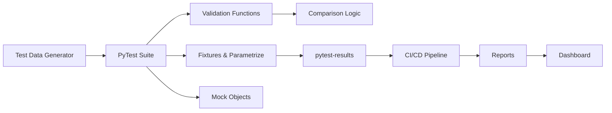
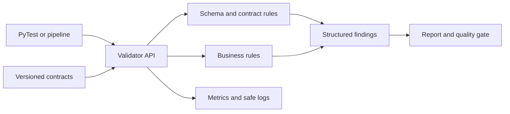
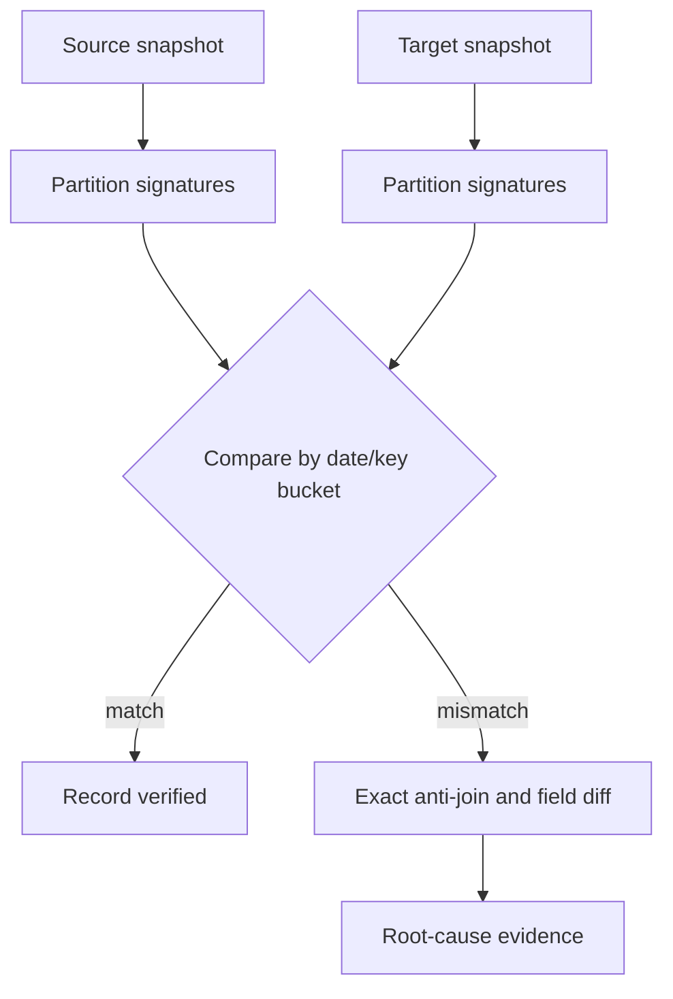

# Python + Pandas Test Automation — Senior Test Engineer / Test Architect Interview Guide

## 1. Interview Expectations at 15+ Years

**What interviewers expect from a 15+ year candidate:**

- Expertise in test automation frameworks (PyTest)
- Deep knowledge of Pandas DataFrame operations and edge cases
- Experience with data validation libraries (Great Expectations, Pandas validation)
- Can design reusable test libraries for data pipelines
- Has built CI/CD for data validation
- Can debug complex data transformation issues
- Understands performance optimization for large datasets

**Senior Engineer:** Writes validation code, executes tests
**Lead:** Designs test frameworks, sets standards
**Test Architect:** Architects enterprise test platform, defines patterns
**Staff/Principal:** Influences testing strategy across org

## 2. Technology Overview

### What it is
Python + Pandas for data testing - using Pandas DataFrames and Python testing frameworks to validate data pipelines, ETL processes, and data transformations.

### How it works
Data loaded into Pandas → transformation executed → validation applied → test assertions run → results reported.

### Where it is used
Data validation, ETL testing, data pipeline testing, reconciliation.

### How it fails
- Memory exhaustion on large data
- Silent NaN handling issues
- Datetime parsing inconsistencies
- Index misalignment
- Chained operation side effects

### How it should be tested
Unit tests for each transformation, integration tests for pipeline, end-to-end validation.

### How it should be automated
PyTest with fixtures, parametrization, CI/CD integration.

## 3. Core Concepts

### PyTest Framework

- **What:** Testing framework for Python.
- **Why:** Standard testing framework, rich features.
- **How:** Test discovery, fixtures, parametrization, assertions.
- **Testing:** Use pytest for all tests.
- **Failure Modes:** Test isolation, fixture scope.
- **Production:** CI/CD integration.

### Pandas DataFrame

- **What:** 2D labeled data structure.
- **Why:** Efficient data manipulation.
- **How:** Series, indexing, operations.
- **Testing:** Validate shape, dtypes, content.
- **Failure Modes:** Memory, index, dtype issues.
- **Production:** Use categoricals, chunked reading.

### Fixtures

- **What:** Setup/teardown for tests.
- **Why:** Reusable test setup.
- **How:** @pytest.fixture decorator.
- **Testing:** Use fixtures for test data.
- **Failure Modes:** Scope issues.
- **Production:** Session-scoped fixtures.

### Parameterization

- **What:** Run same test with different inputs.
- **Why:** Reduce test code duplication.
- **How:** @pytest.mark.parametrize.
- **Testing:** Parametrize test cases.
- **Failure Modes:** Too many combinations.
- **Production:** Selective parameterization.

### Mocking

- **What:** Replace dependencies with test doubles.
- **Why:** Isolate tests.
- **How:** unittest.mock, pytest-mock.
- **Testing:** Mock external dependencies.
- **Failure Modes:** Over-mocking.
- **Production:** Mock databases, APIs.

### Chunking

- **What:** Process data in chunks.
- **Why:** Handle large datasets.
- **How:** pandas.read_csv(chunksize=N).
- **Testing:** Test chunk processing logic.
- **Failure Modes:** Incomplete chunks.
- **Production:** Use for large files.

### MultiIndex

- **What:** Hierarchical index.
- **Why:** Complex data organization.
- **How:** pd.MultiIndex.from_tuples.
- **Testing:** Validate MultiIndex levels.
- **Failure Modes:** Level alignment.
- **Production:** Use for grouped operations.

### Type Hints

- **What:** Type annotations in Python.
- **Why:** Code clarity, IDE support.
- **How:** typing module.
- **Testing:** Validate types.
- **Failure Modes:** Runtime type checking.
- **Production:** Use for maintainability.

## 4. ARCHITECTURE

**Components:**
- Test data generator
- PyTest suite
- Fixtures and parameterization
- Validation functions
- Mock objects
- CI/CD pipeline

## 5. TOP 50 INTERVIEW QUESTIONS

## Q1. How do you test a Pandas DataFrame transformation?

**Difficulty:** Medium
**Interview Stage:** Technical Screen

### What the interviewer is testing
DataFrame transformation testing.

### Strong Senior-Level Answer
Test: 1) Input shape and schema, 2) Transformation logic edge cases, 3) Output shape and schema, 4) Content correctness with sample data, 5) Edge cases (empty, single row, all nulls). Use parameterized tests.

### Architect-Level Answer
Transformation testing requires isolation. Implement: 1) Unit tests for each function, 2) Integration tests for pipeline, 3) Golden dataset validation, 4) Property-based testing. Use fixtures for test data.

### Real-World Enterprise Scenario
Pandas transformation bug missed NaN handling; caused 100K rows of invalid data.

### Likely Follow-Up Questions
- How do you test with large data?
- What if transformation has side effects?
- How do you test edge cases?

### Common Weak Answer
"Compare output with expected."

### Interviewer Probe
"Test runs on 100 rows but production has 1M rows. What else to test?"

### Hands-On Exercise
Write PyTest for DataFrame transformation with edge case testing.

---

## Q2. How do you handle memory issues when testing large datasets in Pandas?

**Difficulty:** Hard
**Interview Stage:** Technical Deep Dive

### What the interviewer is testing
Memory management in Pandas.

### Strong Senior-Level Answer
Use: 1) Chunked reading, 2) Sample validation, 3) Generators, 4) Efficient data types (category, int8), 5) Drop unused columns early. Validate chunks individually then on combined.

### Architect-Level Answer
Large dataset testing requires strategy. Implement: 1) Sampling for initial tests, 2) Chunk testing, 3) Memory profiling, 4) Incremental validation, 5) Distributed alternatives (Dask). Use efficient data types.

### Real-World Enterprise Scenario
Pandas test with 10GB CSV caused OOM; switched to chunked validation.

### Likely Follow-Up Questions
- How do you choose sample size?
- What if chunks are inconsistent?
- How do you validate chunk boundaries?

### Common Weak Answer
"Increase memory."

### Interviewer Probe
"Chunked test shows different results than full data. Why?"

### Hands-On Exercise
Write Python to test large dataset with chunked reading and validation.

---

## Q3. How do you test DataFrame merge/join operations?

**Difficulty:** Medium
**Interview Stage:** Technical Screen

### What the interviewer is testing
Join/merge validation.

### Strong Senior-Level Answer
Test merge: 1) All join types (inner, left, right, outer), 2) Key validation (duplicate keys), 3) Column conflicts, 4) Empty DataFrames, 5) Null handling in keys. Validate row counts and sample rows.

### Architect-Level Answer
Merge testing needs comprehensive coverage. Implement: 1) Join type matrix tests, 2) Key uniqueness tests, 3) Column name conflicts, 4) Edge case tests (empty, single row), 5) Null handling. Use parameterized tests.

### Real-World Enterprise Scenario
Left join lost 500 rows due to key type mismatch.

### Likely Follow-Up Questions
- How do you test different join types?
- What if join keys have duplicates?
- How do you test performance?

### Common Weak Answer
"Just check row count."

### Interviewer Probe
"Inner join produces correct count but outer join wrong. Why?"

### Hands-On Exercise
Write PyTest to validate DataFrame merge with different join types.

---

## Q4. How do you test DataFrame groupby operations?

**Difficulty:** Medium
**Interview Stage:** Technical Screen

### What the interviewer is testing
Groupby validation.

### Strong Senior-Level Answer
Test groupby: 1) Group correctness (items in right group), 2) Aggregation correctness, 3) Handling missing groups, 4) Multiple groupby keys, 5) Aggregation functions (sum, mean, count, etc.). Validate with known groupings.

### Architect-Level Answer
Groupby testing requires validation. Implement: 1) Group membership tests, 2) Aggregation result tests, 3) Missing group handling, 4) Multi-key groupby tests, 5) Aggregation function tests. Compare with SQL GROUP BY.

### Real-World Enterprise Scenario
Groupby excluded rows with null group key; expected them in 'Unknown' group.

### Likely Follow-Up Questions
- How do you test all aggregation functions?
- What if group key has nulls?
- How do you test multi-key groupby?

### Common Weak Answer
"Check aggregate values."

### Interviewer Probe
"GroupBy on two keys. How do you validate grouping?"

### Hands-On Exercise
Write PyTest to validate DataFrame groupby with known groupings.

---

## Q5. How do you test handling of missing values (NaN, None) in Pandas?

**Difficulty:** Medium
**Interview Stage:** Technical Screen

### What the interviewer is testing
NaN/None handling.

### Strong Senior-Level Answer
Test missing values: 1) Detection (isna(), isnull()), 2) Filling (fillna, dropna), 3) Propagation, 4) Type-specific behavior (numeric vs string), 5) Grouping/filtering with nulls. Test edge cases.

### Architect-Level Answer
Missing value testing needs edge case coverage. Implement: 1) Null detection tests, 2) Fill strategy tests, 3) Dropna behavior tests, 4) Null propagation validation, 5) Type-specific null handling. Define null policy.

### Real-World Enterprise Scenario
fillna() silently converted "" to NaN; data loss.

### Likely Follow-Up Questions
- How do you test fillna?
- What if dropna drops all data?
- How do you handle mixed types?

### Common Weak Answer
"Handle nulls appropriately."

### Interviewer Probe
"fillna with different strategies. Which to choose?"

### Hands-On Exercise
Write Python to test missing value handling with detection and filling validation.

---

## Q6. How do you test DataFrame indexing and selection?

**Difficulty:** Medium
**Interview Stage:** Technical Screen

### What the interviewer is testing
Indexing validation.

### Strong Senior-Level Answer
Test indexing: 1) Label-based (.loc), 2) Position-based (.iloc), 3) Boolean indexing, 4) Slice indexing, 5) MultiIndex indexing. Validate edge cases (empty, single row, out-of-bounds).

### Architect-Level Answer
Indexing testing requires coverage. Implement: 1) .loc vs .iloc tests, 2) Boolean indexing tests, 3) Slice boundary tests, 4) MultiIndex indexing, 5) Out-of-bounds handling. Use assert_frame_equal.

### Real-World Enterprise Scenario
Boolean indexing with NaN booleans excluded all rows unexpectedly.

### Likely Follow-Up Questions
- How do you test loc vs iloc?
- What if index has duplicates?
- How do you test multiindex?

### Common Weak Answer
"Use .loc for label indexing."

### Interviewer Probe
".loc and .iloc give different results. User expected same. Why?"

### Hands-On Exercise
Write PyTest to validate DataFrame indexing with edge cases.

---

## Q7. How do you test DataFrame datetime operations?

**Difficulty:** Hard
**Interview Stage:** Technical Deep Dive

### What the interviewer is testing
Datetime operation validation.

### Strong Senior-Level Answer
Test datetime: 1) Parsing correctness, 2) Timezone handling, 3) Date arithmetic, 4) Time delta calculations, 5) Period operations. Test edge cases (DST, leap years).

### Architect-Level Answer
Datetime testing requires timezone awareness. Implement: 1) Parsing validation, 2) Timezone conversion tests, 3) Date arithmetic tests, 4) DST handling tests, 5) Period operation tests. Use tz-aware datetimes.

### Real-World Enterprise Scenario
Naive datetimes caused incorrect timezone conversions in report.

### Likely Follow-Up Questions
- How do you test timezone conversions?
- What if DST transition?
- How do you test date arithmetic?

### Common Weak Answer
"Use datetime correctly."

### Interviewer Probe
"Datetime arithmetic gives wrong result during DST transition. Why?"

### Hands-On Exercise
Write Python to test datetime operations with timezone handling.

### Q8. How do you test DataFrame aggregation functions?

**Difficulty:** Medium
**Interview Stage:** Technical Screen

### What the interviewer is testing
Aggregation function validation.

### Strong Senior-Level Answer
Test aggregations: 1) Sum, count, mean, median, std, var, min, max, 2) Handling of nulls, 3) Edge cases (empty, single value, all same). Validate against expected results.

### Architect-Level Answer
Aggregation testing needs edge case coverage. Implement: 1) Function correctness tests, 2) Null handling tests, 3) Edge case tests, 4) Performance tests with large data, 5) Precision tests. Compare with SQL aggregates.

### Real-World Enterprise Scenario
sum() gave different result due to floating point precision.

### Likely Follow-Up Questions
- How do you test floating point sums?
- What if aggregation is slow?
- How do you test median?

### Common Weak Answer
"Compare with expected values."

### Interviewer Probe
"Sum aggregation differs from SQL. What could cause?"

### Hands-On Exercise
Write PyTest to validate DataFrame aggregation functions with edge cases.

---

## Q9. How do you test DataFrame pivot and unpivot operations?

**Difficulty:** Hard
**Interview Stage:** Technical Deep Dive

### What the interviewer is testing
Pivot/unpivot validation.

### Strong Senior-Level Answer
Test pivot: 1) Column/value pairs correct, 2) Index handling, 3) Duplicate handling, 4) Multiple value columns. Test unpivot: 1) Row expansion, 2) Column preservation, 3) Value stacking, 4) Null handling.

### Architect-Level Answer
Pivot/unpivot testing needs structure validation. Implement: 1) Column mapping tests, 2) Duplicate handling tests, 3) Index preservation tests, 4) Value stacking tests, 5) Null handling tests. Validate round-trip pivot-unpivot.

### Real-World Enterprise Scenario
Pivot with duplicate columns produced wrong aggregation.

### Likely Follow-Up Questions
- How do you test pivot with duplicates?
- What if unpivot has wrong structure?
- How do you test round-trip?

### Common Weak Answer
"Check output structure."

### Interviewer Probe
"Pivot works for unique keys but not duplicates. What happens?"

### Hands-On Exercise
Write Python to test pivot and unpivot operations with validation.

---

## Q10. How do you test DataFrame apply/map operations with custom functions?

**Difficulty:** Hard
**Interview Stage:** Technical Deep Dive

### What the interviewer is testing
Apply/map validation.

### Strong Senior-Level Answer
Test apply: 1) Function correctness, 2) Return type validation, 3) Performance with scale, 4) Error handling. Test with edge cases; validate output dtype.

### Architect-Level Answer
Apply testing requires function isolation. Implement: 1) Unit tests for function, 2) Performance tests, 3) Error handling tests, 4) Type validation tests, 5) Edge case tests. Use vectorization where possible.

### Real-World Enterprise Scenario
apply function had side effects; modified global state.

### Likely Follow-Up Questions
- How do you test custom functions?
- What if apply is slow?
- How do you handle exceptions?

### Common Weak Answer
"Test apply output."

### Interviewer Probe
"apply is slow but vectorized version exists. What do you do?"

### Hands-On Exercise
Write PyTest to validate DataFrame apply with edge cases and performance checks.

---

## Q11. How do you reconcile two large extracts without loading both into Pandas memory?

**Difficulty:** Hard | **Interview Stage:** Technical Deep Dive

### What the interviewer is testing
Ability to choose a scale-appropriate comparison strategy rather than forcing Pandas to act as a distributed engine.

### Strong Senior-Level Answer
First compare schema, partition/file metadata, row counts, and business aggregates. For row-level differences, partition both inputs by a stable key or date and compare bounded chunks; use database/Spark anti-joins when the data already resides there. Define duplicate and null-key semantics before comparing.

### Architect-Level Answer
Use a tiered reconciliation design: inexpensive counts and aggregates, deterministic bucket/hash comparisons, then exact key-level drilldown for mismatches. Persist run IDs, source snapshots, and mismatch samples. Hashes narrow the search but are not a substitute for exact comparison where collision risk is unacceptable.

### Real-World Enterprise Scenario
A daily 80-million-row parquet export exceeds the CI worker's memory. Compare per-day partitions first, then investigate only the mismatched customer/date buckets.

### Likely Follow-Up Questions
- What if the key is not unique?
- How do you distinguish late-arriving rows from missing rows?
- When would you move the comparison into SQL or Spark?

### Common Weak Answer
"Read both files into DataFrames and use `merge` with an indicator."

### Interviewer Probe
What guarantees that your partitioning does not silently omit null or malformed keys?

### Hands-On Exercise
Design a chunked reconciliation that reports duplicate keys, left-only keys, right-only keys, and changed values.

---

## Q12. How do Pandas indexes create false mismatches in validation code?

**Difficulty:** Hard | **Interview Stage:** Coding / Technical Deep Dive

### What the interviewer is testing
Understanding that Pandas aligns many operations by labels rather than only by row position.

### Strong Senior-Level Answer
Inspect index uniqueness and meaning before comparing. Sort by business key and reset indexes only when index labels are not part of the contract. For joins, validate cardinality and use explicit keys. `assert_frame_equal` can compare index, order, dtype, and values, so configure only the dimensions that are intentionally irrelevant.

### Architect-Level Answer
Define comparison semantics in a reusable validator: key set, row order, index, dtype, null equality, and numeric tolerance. Make defaults strict and require explicit opt-outs.

### Real-World Enterprise Scenario
Two extracts contain identical rows in different orders; a positional comparison falsely reports hundreds of thousands of differences.

### Likely Follow-Up Questions
- When should index be part of expected output?
- What if business keys are duplicated?
- How do you compare floats safely?

### Common Weak Answer
"Call `reset_index(drop=True)` on every frame."

### Interviewer Probe
Could resetting the index hide a meaningful ordering or grouping defect?

### Hands-On Exercise
Compare two frames by composite key while preserving strict dtype and null checks.

---

## Q13. How do you test merge cardinality and prevent row multiplication?

**Difficulty:** Hard | **Interview Stage:** Coding

### What the interviewer is testing
Join correctness, duplicate detection, and business-key reasoning.

### Strong Senior-Level Answer
Check uniqueness on the expected one-side key before merge, use `validate="one_to_one"`, `one_to_many`, or `many_to_one` where appropriate, and inspect unmatched rows with `indicator=True`. Compare row counts and key multiplicities before and after.

### Architect-Level Answer
Treat relationship cardinality as schema metadata and enforce it in shared validators. Report violating keys, not just an assertion failure.

### Real-World Enterprise Scenario
A dimension table gained duplicate effective-date rows, multiplying fact revenue after a many-to-one lookup.

### Likely Follow-Up Questions
- How do you handle legitimate many-to-many relationships?
- Why is row count alone insufficient?
- What is the SQL equivalent check?

### Common Weak Answer
"Merge and check that the result is not empty."

### Interviewer Probe
How would you identify which keys caused a 1.4x row increase?

### Hands-On Exercise
Use `merge(validate=...)` and emit duplicate-key diagnostics before the merge.

---

## Q14. How do you compare nulls, NaNs, and missing columns consistently?

**Difficulty:** Hard | **Interview Stage:** Technical Deep Dive

### What the interviewer is testing
Precision about missing-value semantics and schema contracts.

### Strong Senior-Level Answer
Define whether `None`, `NaN`, `NaT`, blank strings, and absent columns are equivalent for each field. Validate schema before values; use nullable dtypes when appropriate and explicit null masks. Do not convert all missing values to strings or zero.

### Architect-Level Answer
Use field-level nullability and normalization policy from a versioned schema. Include missingness rate and null-transition checks in pipeline monitoring.

### Real-World Enterprise Scenario
An upstream CSV changes empty numeric cells from blank to the literal string `NULL`, bypassing a null-rate check.

### Likely Follow-Up Questions
- How do nullable integer dtypes behave?
- Should two nulls compare equal in reconciliation?
- How distinguish absent field from present-but-null?

### Common Weak Answer
"Use `fillna(0)` before comparison."

### Interviewer Probe
What business defect could be hidden by filling missing revenue with zero?

### Hands-On Exercise
Write schema validation that fails for a missing required column but counts nullable field nulls.

---

## Q15. How do you test floating-point transformations without brittle equality checks?

**Difficulty:** Medium | **Interview Stage:** Coding

### What the interviewer is testing
Numerical reasoning, tolerance choice, and edge-case awareness.

### Strong Senior-Level Answer
Use absolute and relative tolerance based on units and business impact; use `numpy.isclose` or `assert_frame_equal` tolerances. Test boundary values, large magnitudes, rounding stages, and NaN policy. Currency should generally use decimal/fixed-point semantics where required.

### Architect-Level Answer
Tolerance belongs to the data contract and must be derived from allowed business error, not loosened until tests pass. Track maximum absolute and relative error in reports.

### Real-World Enterprise Scenario
Aggregating millions of decimal values changes summation order and produces a tiny float difference that is immaterial for a metric but not for a financial ledger.

### Likely Follow-Up Questions
- When use `Decimal`?
- What is the difference between absolute and relative tolerance?
- How prevent tolerance from masking drift?

### Common Weak Answer
"Round every value to two decimals."

### Interviewer Probe
Would the same tolerance be valid for dollars and probabilities?

### Hands-On Exercise
Compare a numeric column with field-specific absolute/relative tolerance and report outliers.

---

## Q16. How do you validate date, timezone, and daylight-saving transformations?

**Difficulty:** Hard | **Interview Stage:** Technical Deep Dive

### What the interviewer is testing
Temporal correctness and reproducible boundary testing.

### Strong Senior-Level Answer
Keep timestamps timezone-aware, specify source and target zones, and test UTC conversion, ambiguous/nonexistent local times, midnight boundaries, leap days, and daylight-saving transitions. Avoid machine-local timezone defaults.

### Architect-Level Answer
Define event time versus processing time and canonical storage semantics in the data contract. Pin timezone database/runtime assumptions for reproducibility.

### Real-World Enterprise Scenario
A daily revenue aggregation misses transactions during a daylight-saving transition because a local hour is duplicated.

### Likely Follow-Up Questions
- How handle naive timestamps from CSV?
- What timezone should storage use?
- How test a late event crossing business date?

### Common Weak Answer
"Convert everything to strings and compare."

### Interviewer Probe
What does a naive timestamp mean if the producer's timezone is undocumented?

### Hands-On Exercise
Create parametrized tests for UTC conversion and DST boundary behavior.

---

## Q17. How do you test categorical, nullable, and extension dtypes?

**Difficulty:** Hard | **Interview Stage:** Technical Deep Dive

### What the interviewer is testing
Schema fidelity across Pandas versions and ingestion paths.

### Strong Senior-Level Answer
Assert dtype explicitly, include null and unseen-category cases, and test serialization round trips. Categorical order can be semantic; nullable integer/string types differ from object coercion.

### Architect-Level Answer
Pin supported library versions, define dtype compatibility rules, and validate data at ingestion rather than relying on inference from samples.

### Real-World Enterprise Scenario
An inferred integer column becomes float after one null appears, breaking a downstream database binding.

### Likely Follow-Up Questions
- What can CSV inference get wrong?
- How handle unknown categories?
- How test Parquet round trips?

### Common Weak Answer
"Pandas will infer the correct type."

### Interviewer Probe
Can a sample without nulls prove the production dtype contract?

### Hands-On Exercise
Read a fixture with an explicit schema and assert dtype, nullability, and category set.

---

## Q18. How do you test deterministic data-cleaning functions?

**Difficulty:** Medium | **Interview Stage:** Coding

### What the interviewer is testing
Pure-function design and edge-case coverage.

### Strong Senior-Level Answer
Separate parsing, normalization, validation, and rejection behavior. Parameterize empty values, malformed encodings, whitespace, Unicode, boundary values, and duplicate inputs. Assert both cleaned output and rejection reasons.

### Architect-Level Answer
Keep transformations pure and versioned; record rejected-row reason codes and source lineage so production failures can be reproduced.

### Real-World Enterprise Scenario
Name normalization changes Unicode behavior and merges two distinct customer records.

### Likely Follow-Up Questions
- Which normalization is reversible?
- How test idempotency?
- What should happen to malformed rows?

### Common Weak Answer
"Strip whitespace and drop bad rows."

### Interviewer Probe
How will downstream owners know why a record was rejected?

### Hands-On Exercise
Write a pure normalizer returning `(accepted_frame, rejected_frame)` with reason codes.

---

## Q19. How do you test chunked CSV processing for boundary defects?

**Difficulty:** Hard | **Interview Stage:** Coding

### What the interviewer is testing
Memory-aware implementation without loss at chunk boundaries.

### Strong Senior-Level Answer
Test empty file, header-only file, malformed row, final partial chunk, duplicate keys across chunks, encoding, and chunk-size invariance. Aggregate counts incrementally and avoid concatenating every chunk in memory.

### Architect-Level Answer
Define failure/restart semantics and checkpoint progress. For global deduplication, use an external key store or distributed engine rather than a Python set that grows without bound.

### Real-World Enterprise Scenario
The last partial chunk is skipped because loop termination assumes a full chunk size.

### Likely Follow-Up Questions
- How test different `chunksize` values?
- How resume after failure?
- When move to Spark/database?

### Common Weak Answer
"Read chunks and concatenate them at the end."

### Interviewer Probe
How prove results are invariant to chunk size?

### Hands-On Exercise
Run the same fixture with chunk sizes 1, 2, and larger than the input; compare outputs.

---

## Q20. How do you validate CSV and Parquet round-trip behavior?

**Difficulty:** Hard | **Interview Stage:** Technical Deep Dive

### What the interviewer is testing
Serialization contract and format-specific differences.

### Strong Senior-Level Answer
Compare schema, nulls, timestamps, decimals, categorical values, ordering expectations, and checksums after a write/read. CSV needs explicit dtype/NA/encoding/date parsing; Parquet preserves richer types but engine/version settings still matter.

### Architect-Level Answer
Maintain compatibility tests across supported writer/reader versions and schema evolution; validate partitions and metadata at scale.

### Real-World Enterprise Scenario
An empty string becomes null in CSV round-trip while consumers treat it as a valid code.

### Likely Follow-Up Questions
- What information does CSV not preserve?
- How handle schema evolution?
- What partition metadata must be checked?

### Common Weak Answer
"If the file opens, serialization passed."

### Interviewer Probe
Which round-trip differences are acceptable and who defines them?

### Hands-On Exercise
Write a round-trip test with explicit schema and null semantics.

---

## Q21. How do you test reusable validators without building an unmaintainable framework?

**Difficulty:** Hard | **Interview Stage:** Architecture

### What the interviewer is testing
Abstraction discipline and usability for multiple teams.

### Strong Senior-Level Answer
Start with composable validators for schema, keys, nullability, ranges, and reconciliation; return structured results with severity, evidence, and remediation context. Keep domain-specific rules close to owning code.

### Architect-Level Answer
Version public contracts, test backward compatibility, and measure adoption/false failures. Avoid a universal DSL before repeated needs are demonstrated.

### Real-World Enterprise Scenario
Five teams implement slightly different duplicate checks and report incompatible failure formats.

### Likely Follow-Up Questions
- What belongs in a shared package?
- How version validator behavior?
- How avoid common-library bottlenecks?

### Common Weak Answer
"Build one generic class that validates everything."

### Interviewer Probe
Which abstraction would you deliberately leave to the data product team?

### Hands-On Exercise
Design a `ValidationResult` schema and two composable validators.

---

## Q22. How do you test database/API extraction code without over-mocking?

**Difficulty:** Hard | **Interview Stage:** Technical Deep Dive

### What the interviewer is testing
Test-layer separation and integration realism.

### Strong Senior-Level Answer
Unit-test transformation logic with fixtures; contract-test request/SQL construction and pagination; integration-test a small real service/database slice. Mock unstable boundaries but keep at least one representative integration path.

### Architect-Level Answer
Use hermetic environments, synthetic credentials/data, and clear ownership of provider contracts. Test retries, pagination, rate limits, and partial responses.

### Real-World Enterprise Scenario
Mocked API always returns one page, so a production pagination omission is never detected.

### Likely Follow-Up Questions
- What is the smallest useful integration test?
- How test rate limiting?
- How isolate credentials?

### Common Weak Answer
"Mock all external calls."

### Interviewer Probe
What production behavior can your current mocks not represent?

### Hands-On Exercise
Create a fake paginated API and assert extraction visits every cursor exactly once.

---

## Q23. How do you test retry logic and idempotency in Python data jobs?

**Difficulty:** Hard | **Interview Stage:** Technical Deep Dive

### What the interviewer is testing
Failure semantics and duplicate prevention.

### Strong Senior-Level Answer
Inject transient and permanent failures; verify bounded retries, backoff, idempotency key, and no duplicate writes. Assert unknown outcomes are surfaced rather than treated as safe to repeat.

### Architect-Level Answer
Make checkpoint/commit boundaries explicit, use transactional or staged writes, and define replay behavior in the job contract.

### Real-World Enterprise Scenario
A write succeeds but client times out; retry inserts the same batch twice.

### Likely Follow-Up Questions
- Which exception types are retryable?
- What if sink lacks transactions?
- How prove exactly-once effect?

### Common Weak Answer
"Retry three times for any exception."

### Interviewer Probe
What evidence tells you a timed-out write committed?

### Hands-On Exercise
Test that a retry with the same batch ID produces one logical output.

---

## Q24. How do you test reusable PyTest fixtures and fixture scope?

**Difficulty:** Medium | **Interview Stage:** Technical Screen

### What the interviewer is testing
Test isolation, lifecycle, and setup cost.

### Strong Senior-Level Answer
Use function scope for mutable state, broader scope only for immutable expensive resources. Verify teardown after setup/assertion exceptions and ensure tests pass in random order.

### Architect-Level Answer
Fixture dependencies should express ownership; keep configuration, connection, and test data separate. Shared fixtures need explicit thread/process-safety guarantees.

### Real-World Enterprise Scenario
A session-scoped DataFrame is mutated by one test, causing order-dependent failures.

### Likely Follow-Up Questions
- When is session scope acceptable?
- How use factories for unique data?
- How isolate xdist workers?

### Common Weak Answer
"Make everything session-scoped to save time."

### Interviewer Probe
How prove a fixture cannot leak mutation across tests?

### Hands-On Exercise
Build a function-scoped fixture returning a fresh DataFrame and assert independent identity.

---

## Q25. How do you test PyTest parameterization without creating an unmaintainable test matrix?

**Difficulty:** Medium | **Interview Stage:** Coding

### What the interviewer is testing
Coverage design and readable failure diagnostics.

### Strong Senior-Level Answer
Parameterize meaningful boundary and equivalence classes, assign descriptive IDs, and avoid Cartesian expansion unless interactions are important. Separate property/invariant tests from curated examples.

### Architect-Level Answer
Use risk-based pairwise coverage for interacting configuration dimensions and track which combinations are intentionally excluded.

### Real-World Enterprise Scenario
Eight data sources times ten dtypes times six null patterns create 480 slow redundant cases.

### Likely Follow-Up Questions
- When property-based testing helps?
- How choose pairwise cases?
- How keep CI feedback fast?

### Common Weak Answer
"Test every possible combination."

### Interviewer Probe
What interaction failure would a one-factor-at-a-time matrix miss?

### Hands-On Exercise
Design a compact matrix for source type, nullable field, and malformed value.

---

## Q26. What is your approach to mocking and patching Python dependencies?

**Difficulty:** Hard | **Interview Stage:** Coding

### What the interviewer is testing
Isolation and avoidance of tests coupled to implementation details.

### Strong Senior-Level Answer
Patch the dependency where it is looked up, not necessarily where it was originally defined. Use fakes for behavior-rich contracts and mocks for narrow interactions. Assert meaningful outcomes rather than every internal call.

### Architect-Level Answer
Prefer dependency injection for stable seams; contract tests ensure fake behavior does not drift from real services.

### Real-World Enterprise Scenario
Test patches `requests.get` but module imported `get` directly, so real network calls escape.

### Likely Follow-Up Questions
- When use a fake server?
- How avoid over-mocking?
- What contract is still untested?

### Common Weak Answer
"Mock every function call."

### Interviewer Probe
How would a mock let a malformed provider response pass?

### Hands-On Exercise
Replace an external API with a fake implementing pagination and transient failure.

---

## Q27. How do you test exception handling and error reporting in validators?

**Difficulty:** Medium | **Interview Stage:** Technical Screen

### What the interviewer is testing
Actionable failures instead of silent data loss.

### Strong Senior-Level Answer
Test expected exception type, context, row/key evidence, and whether processing fails, quarantines, or continues per severity. Preserve original exception chaining and never swallow broad exceptions silently.

### Architect-Level Answer
Standardize error taxonomy, severity, source/run identifiers, and remediation ownership while preventing sensitive value leakage in logs.

### Real-World Enterprise Scenario
`except Exception: return True` turns a parser error into a passing quality gate.

### Likely Follow-Up Questions
- Which failures should be row-level rejects?
- How redact PII?
- When is fail-open acceptable?

### Common Weak Answer
"Catch all errors and log them."

### Interviewer Probe
How will the caller distinguish invalid data from validator infrastructure failure?

### Hands-On Exercise
Create structured error results for malformed rows and fatal schema mismatches.

---

## Q28. How do you test logging and reporting for a data validation library?

**Difficulty:** Medium | **Interview Stage:** Technical Deep Dive

### What the interviewer is testing
Operational diagnostics and data protection.

### Strong Senior-Level Answer
Assert event fields and severity, not brittle full log strings. Include run ID, dataset, rule, counts, and safe examples. Test that secrets/PII are redacted and successful runs do not flood logs.

### Architect-Level Answer
Emit structured metrics for pass/fail counts, duration, and drift; keep detailed row-level artifacts access controlled and retention bounded.

### Real-World Enterprise Scenario
An alert says “validation failed” but omits table, batch ID, and failed key count.

### Likely Follow-Up Questions
- What belongs in metric labels?
- How avoid high-cardinality telemetry?
- How test redaction?

### Common Weak Answer
"Print the entire failed DataFrame."

### Interviewer Probe
How debug one bad key without exposing customer data?

### Hands-On Exercise
Capture structured logs and assert redaction of a seeded email/address.

---

## Q29. How do you make configuration and environment handling testable?

**Difficulty:** Hard | **Interview Stage:** Technical Deep Dive

### What the interviewer is testing
Reproducible runs without hard-coded secrets or hidden global configuration.

### Strong Senior-Level Answer
Load config at explicit boundaries, validate required fields/types/ranges, inject dependencies, and test environment overrides. Secrets come from a secret manager and never appear in fixtures or logs.

### Architect-Level Answer
Version non-secret configuration, separate environment settings from business logic, and define safe defaults that fail closed for production credentials.

### Real-World Enterprise Scenario
Local tests pass because developer environment has a credential absent in CI.

### Likely Follow-Up Questions
- How test missing settings?
- What configuration may be cached?
- How rotate secrets?

### Common Weak Answer
"Read environment variables anywhere in the code."

### Interviewer Probe
Can a malformed config cause a destructive default target?

### Hands-On Exercise
Write a config parser that rejects missing endpoint and invalid timeout before network access.

---

## Q30. How do you package and version a shared test utility?

**Difficulty:** Hard | **Interview Stage:** Architecture

### What the interviewer is testing
Reusable library ownership and compatibility.

### Strong Senior-Level Answer
Use a clear package API, pyproject metadata, pinned supported dependencies, semantic versioning, changelog, CI tests, and a deprecation policy. Separate public validators from internal helpers.

### Architect-Level Answer
Test compatibility across supported Python/Pandas versions; publish immutable artifacts, dependency provenance, and migration guidance. Avoid a release process that blocks teams.

### Real-World Enterprise Scenario
A shared assertion changes null semantics and silently breaks 14 pipelines.

### Likely Follow-Up Questions
- How stage breaking changes?
- What is backward compatible?
- How measure adoption and support burden?

### Common Weak Answer
"Copy the helper into every repository."

### Interviewer Probe
How would you rollback a bad library release already consumed by CI?

### Hands-On Exercise
Define public API and compatibility tests for a schema validator package.

---

## Q31. How do you test a reusable schema-validation framework?

**Difficulty:** Hard | **Interview Stage:** Architecture

### What the interviewer is testing
Contract design across diverse datasets.

### Strong Senior-Level Answer
Test required/optional columns, dtypes, nullability, ranges, allowed values, extra-column policy, and schema versioning. Return all actionable violations when safe, rather than failing at the first issue.

### Architect-Level Answer
Use schema-as-data with ownership, compatibility modes, and drift policy. Validate the validator against mutation-generated schemas and maintain adapters for Pandas/Arrow/SQL types.

### Real-World Enterprise Scenario
A source adds a nullable field; one consumer should tolerate it while another must reject unknown columns.

### Likely Follow-Up Questions
- How do schemas evolve?
- How represent decimal scale?
- How test inferred schemas?

### Common Weak Answer
"Compare `df.columns` to a list."

### Interviewer Probe
How does the framework distinguish backward-compatible addition from breaking type change?

### Hands-On Exercise
Implement a schema rule set with warning and error severity.

---

## Q32. How do you design row-level reconciliation for source and target?

**Difficulty:** Very Hard | **Interview Stage:** Coding / Architecture

### What the interviewer is testing
Scalable correctness, key semantics, and useful discrepancy output.

### Strong Senior-Level Answer
Validate unique keys or define duplicate matching, normalize only contract-approved fields, compare counts/aggregates, then perform keyed anti-joins and field-level diffs. Sample or partition mismatches for diagnosis.

### Architect-Level Answer
Push large joins to the warehouse/Spark; use partition hashes for narrowing and exact comparisons for final proof. Persist comparison snapshot and lineage.

### Real-World Enterprise Scenario
Source and target both have 25 million rows, but 6,000 records differ after a migration.

### Likely Follow-Up Questions
- How handle duplicate business keys?
- What if order differs?
- How choose hash columns?

### Common Weak Answer
"Use `df1.equals(df2)`."

### Interviewer Probe
How will you isolate a single mismatched partition efficiently?

### Hands-On Exercise
Return missing, extra, duplicate, and changed-key groups separately.

---

## Q33. How do you test Pandas transformation invariants with property-based tests?

**Difficulty:** Hard | **Interview Stage:** Coding

### What the interviewer is testing
Invariant reasoning beyond hand-picked examples.

### Strong Senior-Level Answer
Generate bounded input frames and assert invariants such as row conservation, idempotent normalization, monotonic constraints, and sum-preservation where applicable. Constrain generators to valid schemas and include shrinking-friendly diagnostics.

### Architect-Level Answer
Use property-based testing for broad edge exploration, while retaining curated business examples and production incident regressions.

### Real-World Enterprise Scenario
A normalization function behaves correctly on examples but fails on empty strings combined with Unicode and null values.

### Likely Follow-Up Questions
- What properties are business-valid?
- How keep generated cases reproducible?
- When property tests are not appropriate?

### Common Weak Answer
"Generate random data and assert no exception."

### Interviewer Probe
Which invariant would detect duplicate removal that loses legitimate rows?

### Hands-On Exercise
Define properties for a deterministic deduplication function.

---

## Q34. How do you test data-quality rules without excessive false alarms?

**Difficulty:** Hard | **Interview Stage:** Technical Deep Dive

### What the interviewer is testing
Rule precision, baseline interpretation, and severity policy.

### Strong Senior-Level Answer
Use domain thresholds, historical distributions, criticality, and owner review. Classify hard contract violations separately from anomalies that warrant investigation. Measure false-positive/negative behavior.

### Architect-Level Answer
Use alert budgets, suppression windows with audit, trend-based baselines, and rule ownership. Never silently suppress a critical invariant.

### Real-World Enterprise Scenario
A legitimate seasonal spike repeatedly pages the data team and trains them to ignore alerts.

### Likely Follow-Up Questions
- How tune anomaly thresholds?
- When use static vs dynamic limits?
- How review suppressed findings?

### Common Weak Answer
"Raise the threshold until alerts stop."

### Interviewer Probe
What signal would show you tuned away a real defect?

### Hands-On Exercise
Design severity and alerting for row-count drop, null spike, and rare categorical value.

---

## Q35. How do you validate aggregation and reconciliation numerically?

**Difficulty:** Hard | **Interview Stage:** Coding

### What the interviewer is testing
Aggregate-level oracles and tolerance rationale.

### Strong Senior-Level Answer
Compare counts, sums, distinct keys, min/max, and grouped totals; check null and duplicate effects. Use decimal arithmetic for financial values and justified tolerances for floating computations.

### Architect-Level Answer
Use multiple independent controls because matching totals can hide offsetting errors. Segment by meaningful business dimensions and persist the comparison grain.

### Real-World Enterprise Scenario
Revenue totals match because one region is overstated by the same amount another is understated.

### Likely Follow-Up Questions
- Why are checksums not sufficient?
- How choose aggregate grain?
- How handle currency conversion?

### Common Weak Answer
"Totals match, so data is correct."

### Interviewer Probe
What localizes a matched total with wrong underlying records?

### Hands-On Exercise
Compare source/target counts and grouped sums by date/region/currency.

---

## Q36. How do you test streaming/API data ingestion with Pandas-based validators?

**Difficulty:** Hard | **Interview Stage:** Technical Deep Dive

### What the interviewer is testing
Boundaries of Pandas and streaming correctness.

### Strong Senior-Level Answer
Test parser/schema/business rules on bounded micro-batches; validate ordering, duplicate event IDs, late arrivals, and checkpoint/replay behavior in the owning stream engine. Do not claim a Pandas unit test proves streaming guarantees.

### Architect-Level Answer
Keep Pandas validators as shared local logic only where semantics match; integration-test source offsets, exactly-once effects, and backpressure in the stream platform.

### Real-World Enterprise Scenario
The same event arrives twice after consumer restart; batch validator sees each sample only once.

### Likely Follow-Up Questions
- Which layer tests watermarking?
- How handle late correction?
- What must be idempotent?

### Common Weak Answer
"Read a sample into Pandas and call streaming tested."

### Interviewer Probe
Which guarantee belongs to the consumer engine rather than the validator?

### Hands-On Exercise
Design micro-batch rule tests plus an integration replay test.

---

## Q37. How do you test Pandas memory and performance regressions?

**Difficulty:** Hard | **Interview Stage:** Technical Deep Dive

### What the interviewer is testing
Practical performance measurement.

### Strong Senior-Level Answer
Benchmark representative cardinality and distributions, measure peak memory and runtime, and compare algorithms. Avoid brittle single-run wall-clock thresholds; use controlled CI workers and regression bands.

### Architect-Level Answer
Set dataset-size envelopes and complexity expectations, profile allocations, and move out-of-memory workloads to SQL/Spark/streaming rather than over-tuning Pandas.

### Real-World Enterprise Scenario
A merge creates a Cartesian explosion after a key uniqueness defect.

### Likely Follow-Up Questions
- How profile peak memory?
- What is a realistic CI benchmark?
- When should Pandas be rejected?

### Common Weak Answer
"Optimize by adding `inplace=True`."

### Interviewer Probe
How distinguish algorithmic regression from noisy runner performance?

### Hands-On Exercise
Benchmark join with controlled key cardinality and assert a reasonable memory envelope.

---

## Q38. How do you test chunked Pandas processing for correctness and restartability?

**Difficulty:** Hard | **Interview Stage:** Architecture

### What the interviewer is testing
Streaming-like processing over file batches.

### Strong Senior-Level Answer
Verify result invariance over chunk sizes, final partial chunk, cross-chunk duplicates, checkpoint state, and restart after a failed write. Write idempotently using batch/run IDs.

### Architect-Level Answer
Define state ownership and atomic commit boundaries; use persistent external state for global uniqueness rather than unbounded in-memory sets.

### Real-World Enterprise Scenario
Restart reprocesses the last completed chunk and double-counts daily totals.

### Likely Follow-Up Questions
- How handle a crash after write but before checkpoint?
- How prove exactly-once output?
- Which engine is better at this scale?

### Common Weak Answer
"Save the current row number to a local file."

### Interviewer Probe
What happens if source file changes while a checkpoint is reused?

### Hands-On Exercise
Test replay of the same chunk against an idempotent sink.

---

## Q39. How do you test ML input-data quality using Python/Pandas?

**Difficulty:** Hard | **Interview Stage:** Technical Deep Dive

### What the interviewer is testing
Connection between data engineering and model risk.

### Strong Senior-Level Answer
Validate schema, missingness, ranges, label distribution, duplicates, feature/label leakage, train/serve parity, and cohort coverage. Include temporal availability checks and drift baselines.

### Architect-Level Answer
Version dataset and feature contracts, preserve split boundaries, and require domain review of label and protected-group quality.

### Real-World Enterprise Scenario
Training data contains a post-outcome status feature unavailable during online inference.

### Likely Follow-Up Questions
- How validate data drift?
- What can Pandas sample tests miss?
- How handle labels arriving later?

### Common Weak Answer
"Check for nulls and duplicates."

### Interviewer Probe
What feature is impossible to know at prediction time but can still look valid in the DataFrame?

### Hands-On Exercise
Write a feature-availability assertion using prediction and feature timestamps.

---

## Q40. How do you review Python data-test code for security and reliability?

**Difficulty:** Hard | **Interview Stage:** Code Review

### What the interviewer is testing
Secure and maintainable engineering judgment.

### Strong Senior-Level Answer
Check secret handling, SQL parameterization, path traversal, untrusted deserialization, broad exception catches, mutable globals, unsafe logging, retries, and deterministic cleanup.

### Architect-Level Answer
Use least-privilege identities, dependency scanning, reproducible environments, safe artifact retention, and a threat model for test data and CI.

### Real-World Enterprise Scenario
A test logs full API payloads containing customer identifiers and a bearer token.

### Likely Follow-Up Questions
- How test redaction?
- What should be mocked in security tests?
- How keep CI credentials isolated?

### Common Weak Answer
"It is test code, so security is less important."

### Interviewer Probe
How can test tooling become a production data exfiltration path?

### Hands-On Exercise
Review a validator that interpolates SQL and logs failed rows; enumerate fixes.

---

## Q41. A production data-quality defect escaped despite passing Pandas tests. How do you investigate?

**Difficulty:** Hard | **Interview Stage:** Production Debugging

### What the interviewer is testing
Evidence-led incident response and understanding of unit-test boundaries.

### Strong Senior-Level Answer
Pin the source snapshot, code, schema, and run parameters; trace values through extraction, parsing, transformation, and sink. Compare a failed business key at each boundary, then reproduce it in a minimal fixture. Distinguish missing coverage from a production-only environment or volume condition.

### Architect-Level Answer
Turn the root cause into the cheapest owning-layer guard, add lineage and failure evidence, and measure recurrence and escaped-defect rate.

### Real-World Enterprise Scenario
A parser treated the literal string `NULL` as a customer identifier only in one regional export.

### Likely Follow-Up Questions
- Which existing test should have caught this?
- How do you avoid adding one brittle test per incident?
- What evidence would show the fix works at production scale?

### Common Weak Answer
"Add more test data."

### Interviewer Probe
Which deterministic input reproduces the defect, and at which boundary does the value first diverge?

### Hands-On Exercise
Create a regression fixture and assert both normalized output and rejection reason.

---

## Q42. How do you test a Pandas library upgrade across a critical data estate?

**Difficulty:** Hard | **Interview Stage:** Architecture

### What the interviewer is testing
Dependency migration, compatibility, and release safety.

### Strong Senior-Level Answer
Inventory supported Python/Pandas versions and affected operations; run a representative compatibility suite with pinned fixtures covering dtypes, nulls, merge, parsing, and serialization. Compare outputs and performance before promoting.

### Architect-Level Answer
Use a canary lane and staged rollout, publish compatibility findings, retain rollback artifacts, and distinguish intended behavior changes from regressions.

### Real-World Enterprise Scenario
An upgrade changes inferred string dtype and breaks a downstream schema writer.

### Likely Follow-Up Questions
- Which code paths deserve expanded tests?
- How test multiple supported versions?
- What is the rollback trigger?

### Common Weak Answer
"Upgrade and fix whatever breaks in production."

### Interviewer Probe
How would you know a behavior changed if all unit tests still pass?

### Hands-On Exercise
Create a compatibility matrix for parser, dtype, merge, and output-format cases.

---

## Q43. A financial reconciliation is off by a small amount. How do you decide whether tolerance is appropriate?

**Difficulty:** Very Hard | **Interview Stage:** Production Debugging

### What the interviewer is testing
Numerical reasoning and business-risk judgment.

### Strong Senior-Level Answer
Trace currency scale, rounding stage, aggregation order, null handling, and conversion rates. Compare at transaction and aggregate grain. Use exact decimal semantics when the contract requires it; never widen tolerance before explaining the discrepancy.

### Architect-Level Answer
Define tolerance by currency/measure and business materiality, include maximum absolute/relative deltas, and alert on accumulating drift.

### Real-World Enterprise Scenario
Two systems round line items versus invoice totals, producing a small but systematic monthly discrepancy.

### Likely Follow-Up Questions
- Is the tolerance per row or aggregate?
- How handle currency conversion dates?
- What pattern indicates a real defect rather than floating error?

### Common Weak Answer
"Round both results to two decimals."

### Interviewer Probe
What evidence proves the error is bounded and non-systematic?

### Hands-On Exercise
Report deltas by invoice and currency using both absolute and relative tolerances.

---

## Q44. How do you test an incremental pipeline when source records can be corrected retroactively?

**Difficulty:** Very Hard | **Interview Stage:** Technical Deep Dive

### What the interviewer is testing
Incremental correctness, replay, and change semantics.

### Strong Senior-Level Answer
Test inserts, updates, deletes/tombstones, late corrections, and replay overlap. Validate watermark/checkpoint behavior, idempotent upsert, and reconciliation against a bounded full recomputation.

### Architect-Level Answer
Define correction horizon, change-data contract, and backfill procedure; retain source version and target lineage.

### Real-World Enterprise Scenario
A prior-month transaction amount is amended after the daily batch has advanced its watermark.

### Likely Follow-Up Questions
- How far back can data change?
- What if a delete is represented by absence?
- How do you prove replay is idempotent?

### Common Weak Answer
"Only process records newer than the last timestamp."

### Interviewer Probe
What happens when a correction has an old event time but a new update time?

### Hands-On Exercise
Build fixtures for insert/update/tombstone and assert final state after replay.

---

## Q45. How do you test a data validator's own false-positive and false-negative behavior?

**Difficulty:** Hard | **Interview Stage:** Technical Deep Dive

### What the interviewer is testing
Meta-validation of quality rules.

### Strong Senior-Level Answer
Create labeled valid and invalid examples, including boundary and adversarial cases; measure detection and false-alert rates by rule and data slice. Review failures with domain owners.

### Architect-Level Answer
Version rule definitions, maintain a challenge set, test sensitivity changes before rollout, and preserve hard invariants outside anomaly thresholds.

### Real-World Enterprise Scenario
A dynamic null-rate threshold adapts to a gradual upstream defect and stops alerting.

### Likely Follow-Up Questions
- How do you get trusted labels for validator behavior?
- What must remain a hard constraint?
- How do you avoid alert fatigue?

### Common Weak Answer
"If the rule runs, it is validated."

### Interviewer Probe
What test proves a rule catches a known defect without flagging legitimate seasonality?

### Hands-On Exercise
Build a labeled rule test corpus and report precision/recall.

---

## Q46. Design data-quality automation for 500 pipelines maintained by multiple teams.

**Difficulty:** Architect | **Interview Stage:** Architecture

### What the interviewer is testing
Platform design, governance, and adoption.

### Strong Senior-Level Answer
Provide shared schema/key/null validators, pytest fixtures, structured results, CI examples, and team-owned business rules. Start with metadata and critical datasets rather than forcing uniformity everywhere.

### Architect-Level Answer
Design versioned contracts, ownership, severity policy, result catalog, lineage, access control, onboarding, and exception process. Measure adoption and defects prevented, not number of checks.

### Real-World Enterprise Scenario
Teams use Pandas, SQL, and Spark but need a common release signal.

### Likely Follow-Up Questions
- What is common across engines?
- How prevent central platform bottlenecks?
- How retire a low-value check?

### Common Weak Answer
"Mandate one framework for every pipeline."

### Interviewer Probe
Which parts must be standardized, and which must remain domain-owned?

### Hands-On Exercise
Whiteboard contract registry, adapters, CI gates, and quality dashboard.

---

## Q47. How do you decide when Pandas is the wrong tool for validation?

**Difficulty:** Hard | **Interview Stage:** Architecture

### What the interviewer is testing
Tool selection and operational cost judgment.

### Strong Senior-Level Answer
Estimate memory after copies/joins, operation complexity, data locality, and runtime budget. Push filters/aggregates to SQL, use Spark for distributed transformations, and use Pandas for bounded local fixtures and analysis.

### Architect-Level Answer
Define supported workload envelope and migration triggers from measured resource use; keep validation semantics portable where useful.

### Real-World Enterprise Scenario
A 300-GB table is collected to a single CI runner for row comparison.

### Likely Follow-Up Questions
- How estimate peak memory?
- Can sampling prove completeness?
- Which checks should run in the warehouse?

### Common Weak Answer
"Pandas is fast enough if the machine has more RAM."

### Interviewer Probe
What is the data movement cost and what operator requires all rows locally?

### Hands-On Exercise
Choose execution engine for schema, aggregate, exact diff, and sample inspection checks.

---

## Q48. How do you design a privacy-safe data test environment?

**Difficulty:** Architect | **Interview Stage:** Security / Architecture

### What the interviewer is testing
Data governance and developer productivity.

### Strong Senior-Level Answer
Prefer synthetic or de-identified data, least-privilege service identities, isolated environments, safe secrets, and access-controlled artifacts. Preserve edge distributions without carrying direct identifiers.

### Architect-Level Answer
Define approved transformations, re-identification risk review, retention/deletion, lineage, audit, and exception process. Test redaction automatically.

### Real-World Enterprise Scenario
Failed test artifacts store full customer records in broadly accessible CI logs.

### Likely Follow-Up Questions
- How preserve rare combinations?
- What if production-like data is essential?
- How validate anonymization?

### Common Weak Answer
"Mask names and the data is anonymous."

### Interviewer Probe
Which quasi-identifiers could still re-identify the record?

### Hands-On Exercise
Design a synthetic fixture strategy for rare financial edge cases.

---

## Q49. How do you test a validation rule change without destabilizing every pipeline?

**Difficulty:** Architect | **Interview Stage:** Architecture

### What the interviewer is testing
Change management and compatibility.

### Strong Senior-Level Answer
Run old and candidate rules in shadow mode on representative pipelines, compare findings, review deltas with owners, then stage enforcement by severity and data criticality.

### Architect-Level Answer
Version policy, provide migration windows, exception expiry, audit, and rollback. Track rule noise and missed defects after rollout.

### Real-World Enterprise Scenario
A stricter duplicate rule flags legitimate repeated line items in 80 consumer jobs.

### Likely Follow-Up Questions
- Who approves exceptions?
- How distinguish legitimate duplicates from keys missing a line number?
- What is the deprecation period?

### Common Weak Answer
"Turn the new rule on everywhere and let teams fix failures."

### Interviewer Probe
How do you make impact visible before enforcement?

### Hands-On Exercise
Design shadow-to-warning-to-blocking rollout states.

---

## Q50. What would you change in your Python data-testing architecture after observing its production use?

**Difficulty:** Architect | **Interview Stage:** Manager / Director

### What the interviewer is testing
Technical ownership, learning, and influence.

### Strong Senior-Level Answer
Describe an evidence-backed decision: observed bottleneck or defect, alternatives, migration, outcome, and residual risk. Be precise about personal contribution and avoid invented metrics.

### Architect-Level Answer
Explain impacts on team autonomy, reliability, privacy, operating cost, and governance; describe how you validated adoption and prevented recurrence.

### Real-World Enterprise Scenario
A generic validator obscured domain-specific failure reasons and teams stopped trusting its results.

### Likely Follow-Up Questions
- What did you deliberately remove?
- Which metric changed your mind?
- What trade-off remained unresolved?

### Common Weak Answer
"We rewrote it with a newer library."

### Interviewer Probe
What evidence would falsify your claim that the new design is better?

### Hands-On Exercise
Prepare an architecture decision record with options, measured evidence, and rollback plan.

## Scenario-Based Interview Questions

1. **Source has 500 million rows and target has 498 million:** compare partition counts and aggregates, identify divergent date/key buckets, then run exact anti-joins in the warehouse/Spark. Verify snapshot alignment and late-arriving data before classifying rows as missing.
2. **A daily run exceeds worker memory:** profile cardinality and allocations; push filters/aggregations down, use chunked reads only when operation is streamable, and move global joins to a distributed engine.
3. **Pandas and SQL totals differ slightly:** inspect null rules, decimal/float types, timezone, filters, and aggregation grain; establish a business-derived tolerance rather than rounding away the discrepancy.
4. **A merge multiplies rows after deployment:** assert key uniqueness and expected merge cardinality; isolate duplicate effective-date keys and report affected partitions before reprocessing.
5. **One test passes only when run alone:** randomize order, inspect mutable fixtures/global state, and isolate shared files, database rows, and environment variables.
6. **CSV row count changes after a library update:** inspect parser options, quoting, encoding, NA markers, and malformed-line policy; compare rejected-row diagnostics against a frozen fixture.
7. **Validation is too slow for CI:** profile check costs; use fast contract tests on PR, representative integration sampling nightly, and full reconciliation in scheduled runs.
8. **A data validator misses an ML regression:** add feature/label distribution, temporal leakage, training-serving skew, and cohort checks; keep quality metrics tied to intended inference population.
9. **Production API rate-limits extraction:** test pagination and 429 behavior, bounded exponential backoff with jitter, resume checkpoint, and idempotent writes.
10. **Validation logs expose PII:** restrict artifacts, assess exposure, redact/rotate credentials as required, replace payload logging with keyed summaries, and test redaction.

## System Design / Test Architecture

### Design A: Reusable Python data-validation package
**Problem:** Multiple teams need consistent Pandas validation without surrendering domain ownership.
**Requirements:** Typed APIs, structured findings, schema rules, performance, versioning, safe logs, pytest integration.
**Assumptions:** DataFrames fit in memory for this package's target workloads; larger jobs use Spark/SQL adapters.
**Proposed Architecture:** Core rule protocol, Pandas adapter, schema/keys/null/range validators, result/report model, CLI/pytest adapters, and versioned configuration.

**Test strategy:** validator unit/property tests, adapter tests, compatibility tests, performance envelopes. **Automation:** PR checks and package release pipeline. **Scalability:** chunk/database/Spark adapters only where needed. **Performance:** vectorize and avoid copies. **Reliability:** deterministic output and exception taxonomy. **Failure handling:** distinguish data invalidity from validator outage. **Observability:** rule ID, run ID, duration, counts. **Security:** redact values and protect artifacts. **Cost:** keep optional expensive profiling. **Trade-offs:** shared consistency vs domain expressiveness. **Alternative:** use an established expectation framework with team-specific wrappers. **Follow-ups:** How evolve contracts without breaking consumers?

### Design B: Source-to-target reconciliation for large datasets
**Problem:** Reconcile hundreds of millions of rows with bounded memory.
**Requirements:** Correct snapshot alignment, duplicate/key diagnostics, changed values, fast localization, auditability.
**Assumptions:** Source and target can be queried/partitioned by date and stable business key.

**Proposed Architecture:** metadata precheck -> count/sum/checksum by partition -> compare partition signatures -> exact key joins only for mismatched partitions -> field diffs and evidence store.
**Mermaid Diagram:**

**Test strategy:** duplicate/null key checks, snapshot identity, aggregate reconciliation, exact diff. **Automation:** scheduled run with stored signatures. **Scalability:** push-down and partition pruning. **Performance:** sample only for triage, never as final proof. **Reliability:** restartable partition work. **Failure handling:** stale source snapshot is not a mismatch. **Observability:** per-partition status and duration. **Security:** least-privilege access. **Cost:** compare only affected partitions. **Trade-offs:** hash speed vs collision proof. **Alternative:** distributed hash aggregation. **Follow-ups:** How treat null keys and late records?

### Design C: Test automation for data pipelines in CI/CD
**Problem:** Give fast feedback while retaining production-scale confidence.
**Requirements:** Unit, contract, representative integration, scheduled full-volume tests and clear ownership.
**Proposed Architecture:** commit -> unit/fixture tests -> schema/contract tests -> ephemeral integration -> promotion gate -> scheduled reconciliation/observability.
**Test Strategy:** pure transformation tests, source contract, warehouse integration, production canaries. **Automation:** pytest markers and data fixtures. **Scalability:** parallelize independent tests; cap DB connections. **Performance:** enforce feedback budgets. **Reliability:** test retries and data cleanup. **Failure handling:** label code, environment, and data defects separately. **Observability:** durations, flake rate, failure taxonomy. **Security:** secret store and synthetic data. **Cost:** tier expensive checks. **Trade-offs:** fast gate vs broad coverage. **Alternative:** merge queue with post-merge suite. **Follow-ups:** What blocks merge?

### Design D: Safe extraction and retry framework
**Problem:** Ingest paginated APIs and databases reliably under rate limits and partial failure.
**Requirements:** At-least-once source delivery, resumability, audit, idempotent sink, secret safety.
**Proposed Architecture:** cursor reader -> schema/parser -> validator -> staged batch -> atomic/idempotent commit -> checkpoint.
**Test strategy:** duplicate page, missing cursor, 429, timeout-after-commit, malformed record. **Automation:** fake API plus contract integration. **Scalability:** bounded page/batch size. **Performance:** backpressure and concurrent partitions only when safe. **Reliability:** durable checkpoint. **Failure handling:** retry only known-transient errors; expose unknown commit state. **Observability:** page counts and lag. **Security:** credential isolation and payload redaction. **Cost:** quotas/backoff. **Trade-offs:** throughput vs ordering and API limits. **Alternative:** provider-managed export. **Follow-ups:** How prove no data loss across resume?

### Design E: ML input-data quality gate
**Problem:** Stop invalid training and serving feature data before model decisions are harmed.
**Requirements:** Schema, label, leakage, drift, cohort, privacy, and parity checks.
**Proposed Architecture:** immutable dataset snapshot -> schema/profile -> label/point-in-time audit -> feature validation -> model evaluation -> promotion decision.
**Test strategy:** golden examples, temporal leakage, null/range, subgroup representation, training-serving parity. **Automation:** dataset version keyed reports. **Scalability:** distributed aggregates and sampled row diagnostics. **Performance:** incremental profiles. **Reliability:** missing labels explicit. **Failure handling:** quarantine invalid data. **Observability:** drift by feature/cohort. **Security:** protected attributes governed. **Cost:** gate based on model risk. **Trade-offs:** strict schema vs legitimate evolution. **Alternative:** shadow model on new features. **Follow-ups:** Which failures are hard blocks?

## Hands-On Exercises

### Exercise 1: Write a reusable schema validator
**Problem:** Validate required columns, dtype, nullability, and unexpected columns. **Input:** DataFrame and schema dictionary. **Expected Output:** structured error list with rule/column/count. **Solution:** inspect schema before row rules; avoid coercion unless explicitly specified. **Explanation:** contract-first prevents downstream exceptions. **Complexity / Performance:** O(columns + rows for null checks). **Production Considerations:** redact example values and version schema. **Interview Follow-Up:** How support additive schema evolution?

### Exercise 2: Test key uniqueness and referential integrity
**Problem:** Find duplicate business keys and orphan foreign keys. **Input:** source/target DataFrames. **Expected Output:** duplicate and anti-join key sets. **Solution:** `duplicated(key, keep=False)` for duplicates; keyed merge with indicator or indexed membership for orphans. **Complexity / Performance:** approximately O(n log n) sort/hash; memory depends on key cardinality. **Production:** large data should use SQL/Spark. **Follow-Up:** How treat null foreign keys?

### Exercise 3: Build chunk-size-invariant CSV transformation
**Problem:** Normalize and validate rows without loading whole file. **Input:** CSV path and chunk size. **Expected Output:** same accepted/rejected counts and outputs for several chunk sizes. **Solution:** process chunks, write staged outputs, maintain explicit global key state only if bounded or externalized. **Complexity:** O(n) streaming work. **Production:** atomic commit and resume checkpoint. **Follow-Up:** What operation prevents streaming implementation?

### Exercise 4: Detect source-target aggregate drift
**Problem:** Compare grouped totals by date/region/currency. **Input:** source and target schemas. **Expected Output:** group-level mismatches with tolerances. **Solution:** normalize keys, aggregate each side, outer merge with `validate="one_to_one"`, compare counts and amounts. **Complexity:** O(n) grouping plus join. **Production:** preserve grain and distinguish missing group from zero. **Follow-Up:** Why does global total miss offsetting errors?

### Exercise 5: Review and repair unsafe validator code
**Problem:** Review code using `eval`, SQL string interpolation, broad `except`, and `fillna(0)`. **Expected Output:** risk list and corrected design. **Solution:** remove dynamic eval, parameterize SQL, narrow exceptions, preserve missingness, use explicit schema and structured result. **Complexity / Performance:** benchmark before/after. **Production:** secure secrets and artifact logs. **Follow-Up:** What tests guard against regression?

## Production Debugging Playbook

1. **Unexpected row-count drop:** verify source snapshot, extraction cursor, filters, parser rejects, and partition coverage; compare counts at each stage; fix and replay idempotently; alert on count deltas by partition.
2. **Join explosion:** inspect duplicate keys and merge cardinality, isolate offending partitions, repair dimension uniqueness or intended bridge logic; add `validate=` and multiplicity checks.
3. **Pandas OOM:** inspect copies, object dtype, join cardinality, and peak allocation; push computation down or stream; add size envelope and memory tests.
4. **Parser discrepancy after upgrade:** pin versions, compare parser options, quoting/NA/datetime semantics, and malformed-line handling; preserve canary fixtures and compatibility matrix.
5. **Flaky test contaminates batch:** reproduce in random order and parallel workers, inspect fixture scope, files, database rows, and globals; isolate per test and track first-attempt pass rate.

## Architect-Level Trade-offs

| Decision | Option A | Option B | Choose A when | Choose B when | Trade-off |
|---|---|---|---|---|---|
| Engine | Pandas | SQL/Spark | Data fits memory and local vectorization helps | Large/distributed processing needed | Distributed systems add operational overhead |
| Compare | Exact row diff | Aggregate/hash precheck | Small/critical dataset | Large search-space narrowing | Hashes are not final proof |
| Test data | Synthetic fixtures | De-identified production sample | Determinism/privacy | Distribution realism | Samples can omit rare edge cases |
| Quality rule | Static threshold | Drift-aware baseline | Contract invariant | Natural seasonality | Dynamic baselines can normalize defects |
| CI gate | Full volume | Tiered checks | Small stable datasets | Large expensive pipelines | Scheduled breadth adds detection delay |

## 10 Questions That Expose Surface-Level 15+ Year Experience

1. What is the largest Pandas dataset you validated, and what memory bottleneck appeared?
2. Which schema or null assumption caused a production defect?
3. How did you prove a merge had the expected cardinality?
4. What was your reconciliation strategy when counts differed at scale?
5. Which test did you move out of Pandas and why?
6. How did you quantify validator false positives and false negatives?
7. What fixture leak caused order-dependent failures?
8. What did you do when source and target aggregates matched but row-level data did not?
9. How did you preserve useful diagnostics without logging PII?
10. Which shared abstraction did teams reject, and what did you change?

## Top 10 Must-Master Questions

| Question | Why it matters | Weak answer | Strong answer | Likely follow-up |
|---|---|---|---|---|
| Q11 | Large-scale reconciliation | Load both frames | Pushdown, partition, exact diff | Duplicate keys? |
| Q12 | Index semantics | Reset everything | Explicit compare contract | Is order meaningful? |
| Q13 | Join safety | Merge and count | Validate cardinality | Many-to-many? |
| Q14 | Null meaning | Fill zero | Field-specific missingness | Absent vs null? |
| Q15 | Numeric checks | Round | Business-derived tolerance | Decimal? |
| Q16 | Time correctness | Parse strings | Timezone/availability semantics | DST? |
| Q19 | Memory | Concatenate chunks | Chunk invariance and state | Global dedup? |
| Q23 | Reliability | Retry all | Idempotency and commit state | Timeout-after-commit? |
| Q32 | Reconciliation | `DataFrame.equals` | Keyed exact comparisons | Localization? |
| Q39 | ML data quality | Null check only | Leakage/parity/cohort | Delayed labels? |

## One-Day Revision Plan

| Time | Study block |
|---|---|
| 08:30–09:30 | Pandas indexing, dtypes, nulls, merge semantics |
| 09:30–11:00 | Code schema, uniqueness, reconciliation, tolerance validators |
| 11:15–12:30 | Whiteboard large-volume comparison and reusable package design |
| 13:15–14:15 | Practice chunking, serialization, date/time edge cases |
| 14:15–15:15 | Debug OOM, join explosion, flaky fixtures, API retries |
| 15:30–16:30 | Design CI tiers and ML data-quality gate |
| 16:30–17:30 | Answer Q1–Q50 aloud with follow-ups |
| 17:30–18:00 | Review cheat sheet and one real incident story |

## Night-Before-Interview Cheat Sheet

- Validate schema and key semantics before comparing values.
- Pandas aligns many operations by index labels; define index/order contract.
- Check join cardinality before merge; use `validate=` where applicable.
- Null, blank, zero, absent column, NaN, and NaT are distinct until the contract says otherwise.
- Use absolute and relative tolerance derived from business impact; use Decimal for exact financial representation.
- Chunked processing should be invariant to chunk size and restart safely.
- Aggregate/hash checks localize; exact keyed diffs prove row-level equality.
- Use Pandas only while data and operations fit memory/latency constraints.
- Test external boundaries, retries, pagination, and timeout-after-commit.
- Never log full sensitive rows; return structured safe diagnostics.

## Interview Cheat Sheet

| Pattern | Use | Common trap |
|---|---|---|
| `merge(validate=...)` | Enforce expected join cardinality | Row multiplication |
| `indicator=True` | Diagnose left/right-only records | Ignore duplicate keys |
| `assert_frame_equal` | Strict frame contract | Disable checks wholesale |
| Nullable dtypes | Preserve integer/string null semantics | Implicit object coercion |
| `chunksize=` | Bound input memory | Global operation hidden in chunk loop |
| Grouped aggregates | Fast reconciliation precheck | Offset errors cancel globally |
| Parameterized tests | Boundary cases | Cartesian explosion |
| PyTest fixture | Lifecycle/isolation | Shared mutable frame |
| Structured errors | Actionable reporting | Dump PII values |
| SQL/Spark pushdown | Large-data work | Force data into local memory |

## Senior vs Lead vs Test Architect

| Capability | Senior Engineer | Lead | Test Architect |
|---|---|---|---|
| Python/Pandas | Implements correct validators | Sets reusable team patterns | Defines library contracts and engine boundaries |
| Test design | Covers edge cases | Plans layered suite | Aligns quality evidence to platform risk |
| Debugging | Finds data/code defect | Coordinates ownership | Improves lineage and observability architecture |
| Scale | Profiles memory/runtime | Guides teams to SQL/Spark | Designs tiered distributed validation |
| Governance | Uses safe data | Standardizes practices | Sets org-wide privacy and data-quality policy |

## Interviewer Scorecard

| Competency | Evidence to seek |
|---|---|
| Python/Pandas | Correct dtype, index, null, merge, and performance reasoning |
| Test engineering | Fixtures, parameterization, mocks, CI, reproducibility |
| Data quality | Schema, completeness, key integrity, reconciliation |
| Scale | Knows when not to use Pandas |
| Reliability | Retry, idempotency, checkpointing, error taxonomy |
| Security | Secret, PII, SQL, and artifact protection |
| Architecture | Reusable package with clear ownership and extension boundary |
| Communication | Evidence-based trade-offs and real incident learning |

## Final Interview Readiness Checklist

- [ ] Can design schema, key, null, and value validators.
- [ ] Can explain Pandas index alignment and merge cardinality.
- [ ] Can compare large extracts without loading them both into memory.
- [ ] Can test chunk-size invariance, restartability, and idempotency.
- [ ] Can choose exact equality, tolerance, or semantic comparison appropriately.
- [ ] Can build isolated pytest fixtures and meaningful parameterization.
- [ ] Can test API/database boundaries without over-mocking.
- [ ] Can explain when to move work to SQL, Spark, or streaming systems.
- [ ] Can provide actionable but privacy-safe diagnostics.
- [ ] Can discuss ML feature/label quality and training-serving parity.

## Sources & Further Reading

1. **pandas**, [Testing](https://pandas.pydata.org/docs/reference/api/pandas.testing.assert_frame_equal.html), current API documentation; accessed 2026-10-03. Useful for strict DataFrame equality options.
2. **pandas**, [Merge, join, and concatenate](https://pandas.pydata.org/docs/user_guide/merging.html), current user guide; accessed 2026-10-03. Useful for join behavior and alignment.
3. **pytest**, [Fixtures](https://docs.pytest.org/en/stable/how-to/fixtures.html), current documentation; accessed 2026-10-03. Useful for fixture scope, teardown, and dependency design.
4. **Python**, [Logging HOWTO](https://docs.python.org/3/howto/logging.html), current documentation; accessed 2026-10-03. Useful for structured application/test logging practices.
5. **TensorFlow/TFX**, [TensorFlow Data Validation](https://www.tensorflow.org/tfx/guide/tfdv), current guide; accessed 2026-10-03. Useful for schema, skew, and drift concepts.