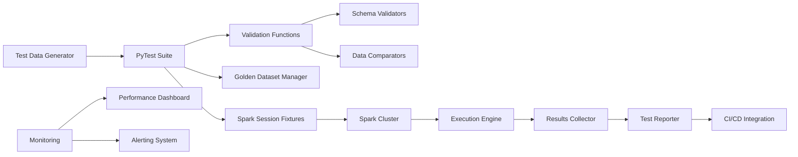
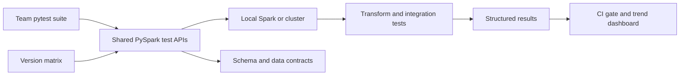
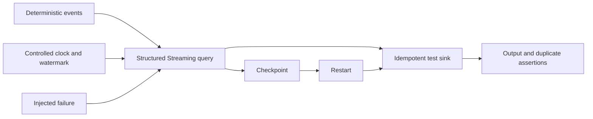

# PySpark Test Automation — Senior Test Engineer / Test Architect Interview Guide

## 1. Interview Expectations at 15+ Years

**What interviewers expect from a 15+ year candidate:**

- Expertise in Spark testing at scale (petabyte-level)
- Deep knowledge of Spark internals (DAG, shuffle, serialization)
- Experience building reusable PySpark test frameworks
- Ability to test complex transformations (window functions, joins, UDFs)
- Understanding of performance tuning and memory optimization
- Experience with Delta Lake, streaming, and schema evolution testing
- Can design CI/CD pipelines for Spark applications

**Senior Engineer:** Writes Spark test cases, executes validation
**Lead:** Designs test frameworks, sets testing standards
**Test Architect:** Architects enterprise test platform for Spark workloads
**Staff/Principal:** Influences Spark strategy across organization

## 2. Technology Overview

### What it is
PySpark test automation uses Spark's Python API to test data processing pipelines, transformations, and distributed computations at scale.

### How it works
Load test data → Execute Spark transformations → Validate results using DataFrame assertions → Report test outcomes.

### Where it is used
ETL/ELT pipelines, data warehouse loading, feature engineering, analytics processing, streaming applications.

### How it fails
- Memory exhaustion (OOM errors) on large data
- Serialization/deserialization errors
- Shuffle performance issues
- Data skew causing stragglers
- Incorrect handling of nulls/empty values
- Schema evolution compatibility issues
- Streaming state management problems
- Exactly-once semantics violations

### How it should be tested
Unit tests for transformations, integration tests for pipelines, end-to-end validation with golden datasets, performance testing.

### How it should be automated
PyTest with Spark fixtures, parameterized tests, CI/CD integration, golden dataset validation.

## 3. Core Concepts

### Spark Session Management
- **What:** Entry point for Spark functionality.
- **Why:** Controls cluster resources and configuration.
- **How:** SparkSession.builder.appName().getOrCreate()
- **Testing:** Isolate sessions per test, proper cleanup.
- **Failure Modes:** Resource leaks, configuration conflicts.
- **Production:** Configure for appropriate resource allocation.

### DataFrame Operations
- **What:** Spark's structured API for distributed data processing.
- **Why:** Optimized execution via Catalyst optimizer.
- **How:** Immutable distributed collections with schema.
- **Testing:** Validate schema, transformations, actions.
- **Failure Modes:** Schema mismatch, optimization bugs.
- **Production:** Use DataFrame API over RDD when possible.

### Test Data Generation
- **What:** Creating representative test datasets.
- **Why:** Ensures test reliability and reproducibility.
- **How:** Synthetic data, sampling production data, edge cases.
- **Testing:** Validate data quality and representativeness.
- **Failure Modes:** Biased samples, insufficient edge cases.
- **Production:** Use production-like data distributions.

### Golden Datasets
- **What:** Pre-validated expected outputs for comparison.
- **Why:** Provides ground truth for validation.
- **How:** Stored test data with expected results.
- **Testing:** Compare actual output to golden dataset.
- **Failure Modes:** Stale golden datasets, version drift.
- **Production:** Automate golden dataset updates.

### Schema Validation
- **What:** Verifying DataFrame schema matches expectations.
- **Why:** Prevents runtime errors from schema changes.
- **How:** Compare actual vs expected StructType.
- **Testing:** Test schema evolution compatibility.
- **Failure Modes:** Silent data corruption from schema drift.
- **Production:** Enforce schema contracts in CI/CD.

### Performance Testing
- **What:** Measuring execution time, resource usage, scalability.
- **Why:** Ensures efficient cluster utilization.
- **How:** Monitor Spark UI metrics, execution plans.
- **Testing:** Benchmark with production-like data volumes.
- **Failure Modes:** Performance regressions, resource waste.
- **Production:** Establish performance baselines and SLAs.

## 4. ARCHITECTURE

**Components:**
- Test data generation (synthetic, production samples)
- PyTest test suite with fixtures
- Spark session management (local/cluster)
- Golden dataset management
- Validation functions (schema, data, performance)
- Spark execution engine
- Results collection and reporting
- CI/CD integration
- Monitoring and alerting

## 5. TOP 50 INTERVIEW QUESTIONS

## Q1. How do you test PySpark DataFrame transformations?

**Difficulty:** Medium
**Interview Stage:** Technical Screen

### What the interviewer is testing
DataFrame transformation testing approach.

### Strong Senior-Level Answer
Test: 1) Input schema validation, 2) Transformation logic with sample data, 3) Output schema validation, 4) Edge cases (empty, nulls, duplicates), 5) Performance with representative data, 6) Golden dataset comparison. Use PyTest fixtures for test data.

### Architect-Level Answer
Transformation testing requires isolation and reproducibility. Implement: 1) Unit tests for each transformation function, 2) Integration tests for pipeline segments, 3) Golden dataset validation for end-to-end correctness, 4) Property-based testing for edge cases, 5) Performance benchmarking, 6) Schema validation tests. Use Spark local mode for fast unit tests.

### Real-World Enterprise Scenario
UDF returned incorrect results for NULL inputs; caused 5% data loss in customer analytics pipeline.

### Likely Follow-Up Questions
- How do you test with large datasets?
- What if transformation has external dependencies?
- How do you test edge cases comprehensively?

### Common Weak Answer
"Run transformation and check output."

### Interviewer Probe
"Test passes on 1K rows but fails on 1M rows with same data pattern. What could cause?"

### Hands-On Exercise
Write PyTest to validate PySpark DataFrame transformation with golden dataset comparison.

---

## Q2. How do you test PySpark join operations?

**Difficulty:** Hard
**Interview Stage:** Technical Deep Dive

### What the interviewer is testing
Join validation in distributed processing.

### Strong Senior-Level Answer
Test joins: 1) Join correctness (cardinality), 2) Join type behavior (inner/left/right/full), 3) Key handling (duplicates, nulls), 4) Performance optimization (broadcast, shuffle), 5) Skew detection and handling, 6) Result validation against expected output. Use EXPLAIN to verify join strategy.

### Architect-Level Answer
Join testing needs comprehensive coverage. Implement: 1) Join type matrix tests, 2) Key uniqueness tests, 3) Null handling tests, 4) Broadcast join eligibility tests, 5) Skew detection tests, 6) Performance benchmarking. Validate with known datasets and expected results.

### Real-World Enterprise Scenario
Broadcast join not used for small lookup table; caused unnecessary shuffle and performance degradation.

### Likely Follow-Up Questions
- How do you test join performance?
- What if data is skewed?
- How do you validate join correctness?

### Common Weak Answer
"Check row count after join."

### Hands-On Exercise
Write PyTest to validate PySpark join operations with different join types and skew detection.

---

## Q3. How do you test PySpark window functions?

**Difficulty:** Hard
**Interview Stage:** Technical Deep Dive

### What the interviewer is testing
Window function validation.

### Strong Senior-Level Answer
Test window functions: 1) Window specification correctness, 2) Frame specification (rows/range), 3) Ordering correctness, 4) Partitioning correctness, 5) Aggregate function correctness, 6) Edge cases (empty data, single row). Validate with known sequences.

### Architect-Level Answer
Window function testing requires temporal awareness. Implement: 1) Window specification tests, 2) Frame boundary tests, 3) Ordering tests, 4) Partitioning tests, 5) Aggregate function tests, 6) Performance tests. Use Window functions for testing.

### Real-World Enterprise Scenario
Window function with RANGE frame on timestamp produced incorrect results due to implicit conversion.

### Likely Follow-Up Questions
- How do you test different frame types?
- What if ordering column has duplicates?
- How do you test at scale?

### Common Weak Answer
"Check window function output."

### Hands-On Exercise
Write PyTest to validate PySpark window functions with different frame specifications.

---

## Q4. How do you test PySpark UDFs (User Defined Functions)?

**Difficulty:** Medium
**Interview Stage:** Technical Screen

### What the interviewer is testing
UDF validation approach.

### Strong Senior-Level Answer
Test UDFs: 1) Input validation (type, null handling), 2) Output correctness for known inputs, 3) Edge cases (extreme values, empty inputs), 4) Performance characteristics, 5) Serialization behavior, 6) Determinism (if required). Test with representative data samples.

### Architect-Level Answer
UDF testing requires isolation and performance awareness. Implement: 1) Unit tests for UDF logic, 2) Serialization tests, 3) Performance benchmarking, 4) Determinism tests, 5) Edge case tests, 6) Integration tests in transformation pipelines. Use Pandas UDFs for better performance when applicable.

### Real-World Enterprise Scenario
UDF threw exception on empty string input; caused task failures in production stage.

### Likely Follow-Up Questions
- How do you test UDF performance?
- What if UDF is non-deterministic?
- How do you test serialization?

### Common Weak Answer
"Test UDF with sample inputs."

### Hands-On Exercise
Write PyTest to validate PySpark UDF with input/output validation and performance testing.

---

## Q5. How do you test PySpark aggregation operations?

**Difficulty:** Medium
**Interview Stage:** Technical Screen

### What the interviewer is testing
Aggregation validation.

### Strong Senior-Level Answer
Test aggregations: 1) Group correctness (items in right group), 2) Aggregate function correctness (sum, count, avg, etc.), 3) Handling of null values, 4) Edge cases (empty data, single group, all same values), 5) Performance with scale. Validate against expected aggregations.

### Architect-Level Answer
Aggregation testing needs edge case coverage. Implement: 1) Group membership tests, 2) Aggregate function tests, 3) Null handling tests, 4) Edge case tests, 5) Performance tests. Compare results with SQL GROUP BY for validation.

### Real-World Enterprise Scenario
SUM aggregation gave different result due to floating point precision issues.

### Likely Follow-Up Questions
- How do you test null handling in aggregates?
- What if aggregation is slow?
- How do you test at scale?

### Common Weak Answer
"Check aggregate values."

### Hands-On Exercise
Write PyTest to validate PySpark aggregation operations with edge case testing.

---

## Q6. How do you test PySpark schema evolution?

**Difficulty:** Hard
**Interview Stage:** Technical Deep Dive

### What the interviewer is testing
Schema change handling.

### Strong Senior-Level Answer
Test schema evolution: 1) Backward compatibility (old code with new schema), 2) Forward compatibility (new code with old schema), 3) Data conversion correctness, 4) Schema registry validation, 5) Performance impact, 6) Error handling for incompatible changes. Validate with schema version history.

### Architect-Level Answer
Schema evolution testing requires version matrix. Implement: 1) Backward/forward compatibility tests, 2) Data conversion validation, 3) Schema registry integration, 4) Performance benchmarking, 5) Error handling tests, 6) Version retirement strategy. Use Avro/Parquet with evolution for testing.

### Real-World Enterprise Scenario
New column added as NOT NULL without default; old data failed to load causing pipeline failure.

### Likely Follow-Up Questions
- How do you test backward compatibility?
- What if schema change is incompatible?
- How do you use schema registry?

### Common Weak Answer
"Just load new schema."

### Hands-On Exercise
Write PyTest to test schema evolution with backward/forward compatibility validation.

---

## Q7. How do you test PySpark streaming applications?

**Difficulty:** Very Hard
**Interview Stage:** Architect

### What the interviewer is testing
Streaming application testing.

### Strong Senior-Level Answer
Test streaming: 1) Exactly-once semantics, 2) Watermarking and late data handling, 3) State management correctness, 4) Checkpointing and recovery, 5) Performance under load, 6) Fault tolerance (node failure, network partition). Validate with controlled data injection.

### Architect-Level Answer
Streaming testing requires temporal and failure scenario awareness. Implement: 1) Exactly-once validation, 2) Watermark advancement tests, 3) Late data handling tests, 4) State correctness tests, 5) Checkpoint recovery tests, 6) Performance benchmarks, 7) Failure injection tests. Use Kafka for controlled data injection.

### Real-World Enterprise Scenario
Streaming job lost state during checkpoint; required manual intervention to recover.

### Likely Follow-Up Questions
- How do you test exactly-once semantics?
- What if checkpoint storage fails?
- How do you test recovery time?

### Common Weak Answer
"Test streaming as batch processing."

### Hands-On Exercise
Design streaming test suite with exactly-once validation and failure injection.

---

## Q8. How do you test PySpark for data skew?

**Difficulty:** Hard
**Interview Stage:** Technical Deep Dive

### What the interviewer is testing
Skew detection and handling.

### Strong Senior-Level Answer
Test skew: 1) Partition size distribution analysis, 2) Join skew detection, 3) Aggregation skew detection, 4) Straggler identification, 5) Mitigation strategies (salting, broadcast), 6) Performance impact. Validate with skewed datasets.

### Architect-Level Answer
Skew testing requires statistical analysis. Implement: 1) Partition size analysis, 2) Join skew detection via keys, 3) Aggregation skew detection, 4) Straggler identification via task metrics, 5) Mitigation validation, 6) Performance benchmarking. Use skew join hints for testing.

### Real-World Enterprise Scenario
Join on user_id had 80% data for one user; caused 20-minute straggler delaying entire job.

### Likely Follow-Up Questions
- How do you detect partition skew?
- What if skew cannot be avoided?
- How do you test mitigation strategies?

### Common Weak Answer
"Check for long-running tasks."

### Hands-On Exercise
Write PySpark to detect and mitigate data skew with salting technique.

---

## Q9. How do you test PySpark checkpointing?

**Difficulty:** Hard
**Interview Stage:** Technical Deep Dive

### What the interviewer is testing
Fault tolerance validation.

### Strong Senior-Level Answer
Test checkpoints: 1) Checkpoint correctness, 2) Recovery accuracy, 3) Performance impact, 4) Checkpoint cleanup, 5) Failure scenarios (node failure, network), 6) State size monitoring. Validate state after recovery matches expected.

### Architect-Level Answer
Checkpoint testing requires failure scenarios. Implement: 1) Checkpoint serialization tests, 2) Recovery correctness tests, 3) Performance impact analysis, 4) Storage validation, 5) Failure injection tests, 6) Garbage collection validation. Use reliable storage for checkpoints.

### Real-World Enterprise Scenario
Checkpoint corrupted; streaming job lost state and restarted from beginning causing data reprocessing.

### Likely Follow-Up Questions
- How do you test checkpoint correctness?
- What if recovery is slow?
- How do you monitor state size?

### Common Weak Answer
"Checkpoint saves state."

### Hands-On Exercise
Design checkpoint test for streaming with failure injection and recovery validation.

---

## Q11. How do you compare two Spark DataFrames without relying on row order?

**Difficulty:** Medium | **Interview Stage:** Technical Screen

### What the interviewer is testing
Distributed data semantics and test-oracle precision.

### Strong Senior-Level Answer
Spark DataFrames are unordered unless explicitly sorted. Compare schema and key uniqueness first, then use keyed anti-joins and field-level comparisons or PySpark testing utilities for small fixtures. Avoid collecting production-sized results to the driver.

### Architect-Level Answer
Define comparison semantics for duplicates, null keys, numeric tolerance, and ordering in a shared test helper. Scale by partitioned aggregates and exact distributed diffs.

### Real-World Enterprise Scenario
An expected DataFrame has the same rows in a different partition order, causing a naive list comparison to fail.

### Likely Follow-Up Questions
- What if keys are not unique?
- How do you compare floating values?
- Which assertions collect data to the driver?

### Common Weak Answer
"Call `collect()` and compare Python lists."

### Interviewer Probe
How do you prove a comparison is complete without a global sort?

### Hands-On Exercise
Compare keyed frames using symmetric anti-joins and a field-level mismatch count.

---

## Q12. How do you assert a Spark schema precisely?

**Difficulty:** Medium | **Interview Stage:** Technical Screen

### What the interviewer is testing
Schema contracts and nullability/type awareness.

### Strong Senior-Level Answer
Compare `StructType` fields, order where meaningful, data types, nullability, metadata, and nested types. Use `assertSchemaEqual` for expected semantics, with intentional options for case sensitivity or nullability only when the contract allows them.

### Architect-Level Answer
Version schemas and define additive/breaking evolution policy. A schema inferred from one sample is not the contract.

### Real-World Enterprise Scenario
An integer identifier silently becomes long after source growth; a downstream schema expects integer.

### Likely Follow-Up Questions
- Does field order matter to your consumer?
- How do you handle nested arrays/structs?
- What is the compatibility policy for new nullable fields?

### Common Weak Answer
"Check `df.columns` only."

### Interviewer Probe
What can go wrong when schema nullability differs but sample rows contain no nulls?

### Hands-On Exercise
Create expected nested schema and test a compatible additive change.

---

## Q13. How does Spark laziness affect unit tests?

**Difficulty:** Medium | **Interview Stage:** Technical Deep Dive

### What the interviewer is testing
Execution model and action-aware assertions.

### Strong Senior-Level Answer
Transformations build a logical plan; actions trigger execution. A test must perform an action that exercises the relevant path, but should choose bounded assertions to avoid accidental full scans or driver collection.

### Architect-Level Answer
Separate transformation contract tests from execution/integration and performance tests. Inspect plans when physical strategy matters.

### Real-World Enterprise Scenario
A test builds a DataFrame but never triggers an action, so a malformed UDF fails only in production.

### Likely Follow-Up Questions
- Which assertions trigger jobs?
- How do you test a lazy error?
- Why can `count()` be expensive?

### Common Weak Answer
"If the DataFrame variable exists, the transformation ran."

### Interviewer Probe
How do you force evaluation of the exact column under test without materializing everything locally?

### Hands-On Exercise
Add an action-based test for a derived column and inspect Spark job count.

---

## Q14. How do you keep local Spark tests deterministic?

**Difficulty:** Hard | **Interview Stage:** Technical Deep Dive

### What the interviewer is testing
Sources of nondeterminism and isolation.

### Strong Senior-Level Answer
Use explicit schemas, stable input data, deterministic tie-breakers in windows, fixed timezone/locale, controlled shuffle settings where suitable, and isolated temp paths. Avoid assuming partition order.

### Architect-Level Answer
Distinguish deterministic business semantics from physical execution order. Test invariants and sorted keyed output, and pin supported Spark/runtime versions in CI.

### Real-World Enterprise Scenario
`row_number()` assigns different winners when ordering columns tie.

### Likely Follow-Up Questions
- Are random seeds sufficient?
- How handle nondeterministic UDFs?
- Which settings should not be pinned in functional tests?

### Common Weak Answer
"Run the test again until it passes."

### Interviewer Probe
What explicit tie-breaker makes the window result stable?

### Hands-On Exercise
Add deterministic ordering to a deduplication window.

---

## Q15. How do you test null handling in joins and aggregations?

**Difficulty:** Hard | **Interview Stage:** Coding

### What the interviewer is testing
SQL null semantics and business contracts.

### Strong Senior-Level Answer
Test null keys on both sides, null measures, all-null groups, and unmatched rows. Spark SQL equality does not treat null as equal to null; use null-safe equality only where domain semantics explicitly require it.

### Architect-Level Answer
Make null policy field-specific and consistent across Spark/SQL/Python paths. Assert rejected or unknown categories rather than silently coalescing to a valid key.

### Real-World Enterprise Scenario
Null customer IDs are incorrectly mapped to one synthetic customer during a join.

### Likely Follow-Up Questions
- What does `count(*)` versus `count(column)` count?
- When is `eqNullSafe` appropriate?
- How test all-null aggregates?

### Common Weak Answer
"Fill every null with an empty string."

### Interviewer Probe
Can coalescing null keys create false matches?

### Hands-On Exercise
Create join tests for null, unmatched, and matched keys.

---

## Q16. How do you test deduplication when records have ties?

**Difficulty:** Hard | **Interview Stage:** Coding

### What the interviewer is testing
Business winner rules and deterministic windows.

### Strong Senior-Level Answer
Define duplicate key and precedence fields, then use a window with a complete deterministic order including a stable final tie-breaker. Assert one winner and preserve or report discarded rows.

### Architect-Level Answer
Treat tie policy as a data contract; monitor duplicate volume and expose losing records for audit.

### Real-World Enterprise Scenario
Two CDC records share event timestamp but have different source sequence numbers.

### Likely Follow-Up Questions
- What if sequence number is absent?
- Is latest arrival always correct?
- How test rerun stability?

### Common Weak Answer
"Call `dropDuplicates` and keep whichever Spark returns."

### Interviewer Probe
What makes the chosen survivor reproducible across partition counts?

### Hands-On Exercise
Write a `row_number` window with explicit tie-break ordering.

---

## Q17. How do you test joins for data skew?

**Difficulty:** Hard | **Interview Stage:** Technical Deep Dive

### What the interviewer is testing
Data-distribution reasoning and performance validation.

### Strong Senior-Level Answer
Create skewed fixtures, inspect key frequencies and physical plan, measure task duration/partition sizes, and compare mitigation such as salting, broadcast, or adaptive execution. Correct output is still required after mitigation.

### Architect-Level Answer
Use production-like distributions and Spark UI/runtime stats; avoid hard-coded hints without evidence. Adaptive Query Execution may split skewed shuffle partitions when applicable/configured. [2]

### Real-World Enterprise Scenario
One customer owns most events and becomes the straggler for a daily join.

### Likely Follow-Up Questions
- When is broadcast unsafe?
- How validate a salted join has no loss/duplication?
- How does AQE change your test?

### Common Weak Answer
"Increase executor count."

### Interviewer Probe
Which task metrics distinguish skew from a generally slow cluster?

### Hands-On Exercise
Build a skewed input and verify salted output against a small exact oracle.

---

## Q18. How do you test partitioning and avoid over-partitioning?

**Difficulty:** Hard | **Interview Stage:** Technical Deep Dive

### What the interviewer is testing
Physical data layout and workload awareness.

### Strong Senior-Level Answer
Assert logical output independent of partition layout; separately test partition count, file count, and pruning for targeted workloads. Avoid creating one tiny file per key or assuming `repartition` is free.

### Architect-Level Answer
Use partition columns with query/selectivity and file-size goals; inspect actual plans and storage layout. Spark tuning must be benchmarked under realistic volume.

### Real-World Enterprise Scenario
Partitioning by high-cardinality user ID creates millions of tiny files.

### Likely Follow-Up Questions
- Difference between `repartition` and `coalesce`?
- How verify partition pruning?
- What happens after a shuffle?

### Common Weak Answer
"More partitions always mean more parallelism."

### Interviewer Probe
How would you detect small-file growth before it impacts readers?

### Hands-On Exercise
Compare explain plans and file counts for two partition strategies.

---

## Q19. How do you test a UDF and decide whether to replace it?

**Difficulty:** Hard | **Interview Stage:** Coding / Deep Dive

### What the interviewer is testing
Correctness and execution cost.

### Strong Senior-Level Answer
Unit-test pure Python logic separately, then Spark integration with null, Unicode, type, and boundary cases. Prefer built-in Spark SQL functions when they express the logic to retain optimizer visibility and avoid Python serialization overhead.

### Architect-Level Answer
Benchmark actual plan and throughput; a Pandas UDF/Arrow path has distinct batching and type semantics and still needs parity tests.

### Real-World Enterprise Scenario
A Python UDF dominates runtime and converts a simple string cleanup into row-wise Python work.

### Likely Follow-Up Questions
- What does Arrow change?
- How test exceptions in executors?
- When is a UDF justified?

### Common Weak Answer
"Python UDF is easiest, so use it everywhere."

### Interviewer Probe
What physical-plan evidence shows Python execution is the bottleneck?

### Hands-On Exercise
Implement equivalent built-in and UDF transforms; compare correctness and plan.

---

## Q20. How do you test window functions and their frame semantics?

**Difficulty:** Hard | **Interview Stage:** Coding

### What the interviewer is testing
Ordering, partitioning, and frame boundaries.

### Strong Senior-Level Answer
Test partition key, deterministic order, ties, nulls, preceding/following frame edges, and empty/single-row partitions. A running aggregate's default frame can differ from a row-based frame, so specify it explicitly where required.

### Architect-Level Answer
Use representative partitions and validate both row-level result and performance/shuffle implications.

### Real-World Enterprise Scenario
Running total includes peer rows with equal timestamps unexpectedly.

### Likely Follow-Up Questions
- `rowsBetween` versus `rangeBetween`?
- How resolve tied order keys?
- What is the shuffle cost?

### Common Weak Answer
"Test one normal row."

### Interviewer Probe
How would a duplicate timestamp change this result?

### Hands-On Exercise
Test rolling seven-row average and calendar-date rolling window separately.

---

## Q21. How do you test an incremental DataFrame transformation for idempotency?

**Difficulty:** Hard | **Interview Stage:** Technical Deep Dive

### What the interviewer is testing
Replay safety and state semantics.

### Strong Senior-Level Answer
Run the same batch twice and compare final state; include overlapping, late, update, and delete events. Validate transaction/batch keys and target merge behavior.

### Architect-Level Answer
Define exactly-once effects at the sink boundary rather than assuming Spark execution itself is exactly once; test source replay, checkpoint recovery, and idempotent sink together.

### Real-World Enterprise Scenario
Restart reprocesses a micro-batch and duplicates a downstream fact table.

### Likely Follow-Up Questions
- What if sink commit succeeds but checkpoint fails?
- How handle late updates?
- Which key defines event identity?

### Common Weak Answer
"Spark guarantees exactly once for every sink."

### Interviewer Probe
Which end-to-end component actually guarantees one logical effect?

### Hands-On Exercise
Replay the same batch twice into a keyed test sink and assert unchanged state.

---

## Q22. How do you test streaming watermarks and late data?

**Difficulty:** Very Hard | **Interview Stage:** Technical Deep Dive

### What the interviewer is testing
Event-time semantics and bounded state.

### Strong Senior-Level Answer
Use a streaming test harness with controlled event timestamps, advance processing time/watermark deterministically, and assert on-time, late-within-threshold, and too-late behavior. Validate aggregation finalization and state cleanup.

### Architect-Level Answer
Document allowed lateness, output mode, state retention, and correction policy; watermark behavior is a business contract as well as a runtime setting.

### Real-World Enterprise Scenario
Events arrive 45 minutes late after a mobile device reconnects.

### Likely Follow-Up Questions
- What does the watermark guarantee?
- How test late updates after output?
- How monitor state-store growth?

### Common Weak Answer
"Set watermark to one hour and late data is handled."

### Interviewer Probe
What happens to an event beyond the watermark for your chosen operator/output mode?

### Hands-On Exercise
Create deterministic event-time cases around watermark boundaries.

---

## Q23. How do you test checkpoint recovery after executor or driver failure?

**Difficulty:** Very Hard | **Interview Stage:** Production Debugging

### What the interviewer is testing
Recovery correctness and source/sink coordination.

### Strong Senior-Level Answer
Run a query to a durable test sink, stop/restart from the same checkpoint, inject a failure around commit, and verify output state, offsets, and deduplication. Never reuse incompatible checkpoint state across query changes without validating compatibility.

### Architect-Level Answer
Test recovery on the production-like storage backend, not only local filesystem; define checkpoint ownership, retention, and migration policy.

### Real-World Enterprise Scenario
Checkpoint is lost and the stream restarts from earliest offset, replaying months of data.

### Likely Follow-Up Questions
- Which source/sink combinations offer what guarantees?
- What if query plan changes?
- How test checkpoint corruption?

### Common Weak Answer
"Enable checkpointLocation and recovery is covered."

### Interviewer Probe
Which outputs prove recovery did not lose or duplicate records?

### Hands-On Exercise
Write a restart test around a temporary durable sink and fixed checkpoint path.

---

## Q24. How do you validate Delta Lake or lakehouse schema evolution?

**Difficulty:** Hard | **Interview Stage:** Technical Deep Dive

### What the interviewer is testing
Table contract and transaction behavior.

### Strong Senior-Level Answer
Test additive nullable fields, incompatible type changes, renamed/dropped fields, reader/writer versions, concurrent writes, time travel/version selection, and failed transaction atomicity. Be specific to the platform/runtime's supported semantics.

### Architect-Level Answer
Treat table protocol/features and catalog/runtime compatibility as deployment contracts; stage schema changes and maintain rollback/recovery procedures.

### Real-World Enterprise Scenario
Producer adds a nested field and one consumer silently reads the wrong positional element.

### Likely Follow-Up Questions
- What is backward compatible?
- How test concurrent writers?
- Does time travel replace backup/retention policy?

### Common Weak Answer
"Enable schema merge and it will handle evolution."

### Interviewer Probe
What happens to old readers when a new protocol feature is enabled?

### Hands-On Exercise
Test additive nullable evolution and assert old/new reader expectations.

---

## Q25. How do you test Spark transformations that use nondeterministic functions?

**Difficulty:** Hard | **Interview Stage:** Technical Deep Dive

### What the interviewer is testing
Determinism boundaries and correct oracle design.

### Strong Senior-Level Answer
Inject or materialize a deterministic seed/input when possible; otherwise assert invariants and allowed ranges instead of exact output. Mark nondeterministic behavior explicitly and avoid relying on partition order.

### Architect-Level Answer
Separate deterministic business contract from execution variability; pin runtime versions for regression suites and test reproducibility expectations.

### Real-World Enterprise Scenario
Random sampling returns different records after repartitioning.

### Likely Follow-Up Questions
- Are seeded random functions stable across versions?
- How test generated IDs?
- What must be recorded for replay?

### Common Weak Answer
"Sort output and it will be deterministic."

### Interviewer Probe
Which invariant remains valid when the actual sample changes?

### Hands-On Exercise
Test a randomized sampler for size, uniqueness, and distribution bounds.

---

## Q26. How do you test UDF serialization and executor-only failures?

**Difficulty:** Hard | **Interview Stage:** Technical Deep Dive

### What the interviewer is testing
Driver/executor runtime distinction.

### Strong Senior-Level Answer
Run an action that executes the UDF across partitions, include representative closures/dependencies, and test nulls, exceptions, and return types. Local single-partition tests may not expose serialization or environment differences.

### Architect-Level Answer
Test in the same runtime/container and dependency set as production; collect executor logs and distinguish task failure from driver failure.

### Real-World Enterprise Scenario
A closure captures a non-serializable client and fails only on remote executors.

### Likely Follow-Up Questions
- What should not be captured in a closure?
- How control side effects in UDFs?
- When use `mapPartitions`?

### Common Weak Answer
"The UDF works in a notebook, so it is production-ready."

### Interviewer Probe
How can you guarantee the test actually ran on executor processes?

### Hands-On Exercise
Run a multi-partition test with a deliberately invalid captured object.

---

## Q27. How do you test broadcast joins and prevent executor memory failures?

**Difficulty:** Hard | **Interview Stage:** Performance / Deep Dive

### What the interviewer is testing
Join strategy limits and plan validation.

### Strong Senior-Level Answer
Test correctness under the selected plan and benchmark with realistic dimension size. Inspect `explain` and runtime metrics; do not broadcast a table merely because it is “small” in a sample.

### Architect-Level Answer
Use data statistics and runtime thresholds; assert no unexpected plan regression only where plan is part of operational contract. Include memory and timeout failure tests.

### Real-World Enterprise Scenario
A dimension grows 20x and broadcast causes executor OOM.

### Likely Follow-Up Questions
- What controls auto broadcast?
- How do AQE and hints interact?
- What is the fallback strategy?

### Common Weak Answer
"Broadcast joins are always faster."

### Interviewer Probe
What measured evidence makes the broadcast safe at production size?

### Hands-On Exercise
Compare join output and physical plan with broadcast enabled/disabled.

---

## Q28. How do you test Python UDF versus Pandas UDF behavior?

**Difficulty:** Hard | **Interview Stage:** Coding / Performance

### What the interviewer is testing
Batching, Arrow, typing, and parity.

### Strong Senior-Level Answer
Use identical golden inputs covering nulls, nested types, empty batches, Unicode, and boundary sizes; compare semantics. Benchmark serialization/runtime using production-like volume and inspect Arrow compatibility.

### Architect-Level Answer
Prefer built-in expressions; use Pandas UDF only when measured benefit offsets dependency, memory, and batch semantics. Pin supported Spark/PyArrow versions.

### Real-World Enterprise Scenario
Pandas UDF behaves differently on an empty partition and fails a sparse batch.

### Likely Follow-Up Questions
- What can Arrow optimize?
- How do batch sizes affect memory?
- How test schema conversion?

### Common Weak Answer
"Pandas UDF is automatically faster."

### Interviewer Probe
Which path has the same null and type behavior in your supported runtime?

### Hands-On Exercise
Parity-test built-in, regular UDF, and Pandas UDF on one fixture.

---

## Q29. How do you validate Spark physical plans without overfitting tests to optimizer details?

**Difficulty:** Hard | **Interview Stage:** Technical Deep Dive

### What the interviewer is testing
Plan testing boundaries.

### Strong Senior-Level Answer
Test business results independently. Add targeted plan assertions for essential properties such as avoiding an accidental Cartesian join or ensuring partition pruning, not exact full-plan strings.

### Architect-Level Answer
Pair plan checks with runtime metrics and version-aware baselines; optimizer plans legitimately change across releases.

### Real-World Enterprise Scenario
A Spark upgrade changes join operator but preserves correct performance.

### Likely Follow-Up Questions
- Which plan property is stable enough to gate?
- How use `explain()`?
- What runtime metric proves the plan improved?

### Common Weak Answer
"Snapshot the entire explain output and require exact equality."

### Interviewer Probe
How detect a dangerous regression without rejecting valid optimizer changes?

### Hands-On Exercise
Assert absence of Cartesian product and measure shuffle bytes for a benchmark.

---

## Q30. How do you test Spark caching and persistence choices?

**Difficulty:** Hard | **Interview Stage:** Performance / Architecture

### What the interviewer is testing
Understanding cache cost and lifecycle.

### Strong Senior-Level Answer
Test correctness with and without cache; benchmark repeated actions; inspect storage usage and unpersist lifecycle. Cache only reused expensive data when memory and recomputation costs justify it.

### Architect-Level Answer
Include executor eviction, spill, job concurrency, and memory pressure; avoid tests that pass only because a local cache hides repeated scans.

### Real-World Enterprise Scenario
Cached intermediate DataFrame causes memory pressure and slower concurrent jobs.

### Likely Follow-Up Questions
- What is lazy about cache?
- When use checkpoint instead?
- How verify cached plan?

### Common Weak Answer
"Cache every DataFrame to make it fast."

### Interviewer Probe
What workload evidence shows cache improves end-to-end performance?

### Hands-On Exercise
Benchmark repeated action with/without cache and ensure unpersist occurs.

---

## Q31. How do you test a 5-billion-row transformation without materializing all rows in a unit test?

**Difficulty:** Very Hard | **Interview Stage:** Architecture

### What the interviewer is testing
Scale-aware validation and confidence.

### Strong Senior-Level Answer
Unit-test logic with tiny edge fixtures; integration-test partitioned representative data; performance-test realistic volume; run full reconciliation via distributed aggregates and keyed partition checks.

### Architect-Level Answer
Use deterministic input manifests, data-quality metrics by partition, sampled row diffs only for diagnosis, and exact distributed checks for critical requirements.

### Real-World Enterprise Scenario
A 5-billion-row daily fact table must be validated within a two-hour SLA.

### Likely Follow-Up Questions
- Can sampling prove no missing rows?
- Which aggregates localize errors?
- How control cost?

### Common Weak Answer
"Collect 1% to the driver and assume the rest."

### Interviewer Probe
What is your proof strategy for completeness at full scale?

### Hands-On Exercise
Design partitioned count/hash checks followed by exact anti-join on divergent buckets.

---

## Q32. How do you test a 10-billion-row migration for correctness and recoverability?

**Difficulty:** Architect | **Interview Stage:** Architecture

### What the interviewer is testing
Migration verification and operational controls.

### Strong Senior-Level Answer
Freeze source snapshot, validate schema and partition mapping, compare counts and aggregates, run key-level checks on all partitions in distributed compute, and rehearse restart/backfill.

### Architect-Level Answer
Use dual-write or phased cutover when feasible, immutable manifests, parallel read validation, rollback, and cost/time estimates. Sampling is supplemental, not the completeness proof.

### Real-World Enterprise Scenario
A warehouse migration moves 10 billion rows and must preserve historical facts.

### Likely Follow-Up Questions
- What evidence permits cutover?
- How detect offsetting aggregate errors?
- What is rollback if target is partially loaded?

### Common Weak Answer
"Compare total row counts and switch over."

### Interviewer Probe
How identify one missing hash bucket without scanning the whole target repeatedly?

### Hands-On Exercise
Whiteboard staged migration reconciliation and rollback gates.

---

## Q33. Design a PySpark test framework for multiple pipelines and teams.

**Difficulty:** Very Hard | **Interview Stage:** Architecture

### What the interviewer is testing
Reusable abstractions and team governance.

### Strong Senior-Level Answer
Provide SparkSession fixtures, schema/data assertions, deterministic local fixtures, structured reports, and CI templates. Keep domain transformation and expected business output owned by pipeline teams.

### Architect-Level Answer
Version library APIs, support runtime matrix, test dependency compatibility, publish migration path, and provide adapters for batch/streaming/Delta.

### Real-World Enterprise Scenario
Thirty teams need common row/schema assertions but use different Spark runtimes.

### Likely Follow-Up Questions
- What is in the core package?
- How avoid runtime coupling?
- How roll out a breaking assertion change?

### Common Weak Answer
"Make a giant BaseSparkTest class."

### Interviewer Probe
Which team owns the expected result when transformation semantics change?

### Hands-On Exercise
Design a test helper API with explicit schema, key, null, and tolerance options.

---

## Q34. Design streaming tests for late events, duplicates, and checkpoint recovery.

**Difficulty:** Very Hard | **Interview Stage:** Architecture

### What the interviewer is testing
Event-time and fault-tolerance contracts.

### Strong Senior-Level Answer
Use deterministic event-time inputs, watermark boundary cases, duplicate IDs, restart with same checkpoint, and a sink that exposes committed output. Assert allowed late-event and deduplication semantics.

### Architect-Level Answer
Test source offsets, state cleanup, checkpoint compatibility, sink idempotency, and failure around commit; do not infer end-to-end exactly-once from one component's guarantee.

### Real-World Enterprise Scenario
Kafka consumer restart replays records while late events update a windowed total.

### Likely Follow-Up Questions
- What happens beyond watermark?
- What if checkpoint schema changes?
- How prove exactly-once effect?

### Common Weak Answer
"Start the stream and confirm it produces rows."

### Interviewer Probe
Which observable state distinguishes duplicate processing from a legitimate correction?

### Hands-On Exercise
Create stream fixtures for on-time, late, duplicate, and too-late event IDs.

---

## Q35. Design a Spark performance regression suite.

**Difficulty:** Hard | **Interview Stage:** Architecture

### What the interviewer is testing
Benchmark validity and actionable performance signals.

### Strong Senior-Level Answer
Use fixed input snapshots and cluster shape, measure wall time, shuffle, spill, skew, task distribution, and output correctness; run representative workloads rather than toy benchmarks.

### Architect-Level Answer
Separate noisy shared-cluster signals from algorithmic changes, maintain runtime baselines by workload tier, and gate only meaningful regressions with confidence.

### Real-World Enterprise Scenario
A minor join change doubles shuffle and causes SLA misses only at month end.

### Likely Follow-Up Questions
- Which metric is stable in CI?
- How account for AQE?
- What is the right benchmark data volume?

### Common Weak Answer
"Fail if runtime is 5% slower on one run."

### Interviewer Probe
How prove a 15% timing change is signal rather than cluster noise?

### Hands-On Exercise
Create a repeated benchmark report with runtime and shuffle metrics.

---

## Q36. Design test-data generation for skewed and high-cardinality Spark workloads.

**Difficulty:** Hard | **Interview Stage:** Architecture

### What the interviewer is testing
Representative performance and correctness fixtures.

### Strong Senior-Level Answer
Generate deterministic distributions with hot keys, nulls, rare categories, wide rows, and realistic join cardinalities. Keep small golden fixtures for correctness and larger synthetic fixtures for performance.

### Architect-Level Answer
Record generator seed, parameters, and expected distribution statistics; avoid accidentally generating unrealistic IID data for skew-sensitive jobs.

### Real-World Enterprise Scenario
Uniform synthetic data hides a production hot-key straggler.

### Likely Follow-Up Questions
- How reproduce a generated failure?
- How ensure data is not too synthetic?
- Which distribution metrics matter?

### Common Weak Answer
"Use `range(1000000)` as production-like data."

### Interviewer Probe
Which key-frequency percentile should the benchmark reproduce?

### Hands-On Exercise
Build a seeded generator with configurable Zipf-like key skew and validate its profile.

---

## Q37. How do you test schema evolution across producers and Spark consumers?

**Difficulty:** Hard | **Interview Stage:** Technical Deep Dive

### What the interviewer is testing
Data contract compatibility.

### Strong Senior-Level Answer
Test additive optional columns, missing required columns, type widening/narrowing, nested evolution, unknown fields, and old/new producer-consumer combinations. Validate parser mode and defaults explicitly.

### Architect-Level Answer
Use compatibility registry and staged rollout; separate schema inference from approved contract and coordinate protocol/runtime versions.

### Real-World Enterprise Scenario
Producer changes decimal precision and historical files contain older schema.

### Likely Follow-Up Questions
- What is backward compatible?
- How read mixed schema partitions?
- How deprecate a field safely?

### Common Weak Answer
"Spark automatically handles schema changes."

### Interviewer Probe
Can schema merge hide an incompatible semantic change?

### Hands-On Exercise
Create old/new fixtures and assert consumer compatibility policy.

---

## Q38. How do you test output file layout and small-file behavior?

**Difficulty:** Hard | **Interview Stage:** Technical Deep Dive

### What the interviewer is testing
Storage layout and downstream operability.

### Strong Senior-Level Answer
Validate partition columns, file count/size distribution, empty partitions, schema, and read-back correctness. Do not assert an exact file count unless output layout is a contract.

### Architect-Level Answer
Monitor small-file trends, compaction cost, and query performance; test data correctness separately from layout optimization.

### Real-World Enterprise Scenario
Over-partitioned output creates 100,000 tiny files and slows downstream listings.

### Likely Follow-Up Questions
- How choose `coalesce`/`repartition`?
- How test partition pruning?
- What storage format/version is supported?

### Common Weak Answer
"Set `coalesce(1)` to avoid small files."

### Interviewer Probe
What bottleneck does one output partition create at high volume?

### Hands-On Exercise
Write output to a temporary path and inspect file size distribution.

---

## Q39. How do you test data quality at 10-billion-row scale?

**Difficulty:** Architect | **Interview Stage:** Architecture

### What the interviewer is testing
Completeness proof and cost-aware distributed validation.

### Strong Senior-Level Answer
Push checks into distributed execution: schema, partition counts, uniqueness, referential integrity, aggregates, and hash/key reconciliation. Use samples for diagnosis and full distributed checks for critical completeness guarantees.

### Architect-Level Answer
Tier checks by risk and incremental scope; use data skipping/partition pruning, precomputed manifests, and exact drilldown of divergent buckets.

### Real-World Enterprise Scenario
A 10-billion-row daily event table has a strict load SLA and costly full scans.

### Likely Follow-Up Questions
- Which checks can run incrementally?
- How detect hash collision risk?
- How monitor validation cost?

### Common Weak Answer
"Sample 1% and extrapolate exact completeness."

### Interviewer Probe
Which invariant requires full coverage rather than statistical confidence?

### Hands-On Exercise
Design partition signatures and a distributed mismatch drilldown plan.

---

## Q40. How do you govern a shared Spark test library across runtime upgrades?

**Difficulty:** Architect | **Interview Stage:** Architecture / Director

### What the interviewer is testing
Compatibility, rollout, and ownership.

### Strong Senior-Level Answer
Publish supported Spark/Python versions, run contract and integration suites on each lane, use semantic versioning, and provide migration guidance. Do not let all consumers float to a new runtime at once.

### Architect-Level Answer
Use canary consumers, compatibility reports, rollback, dependency provenance, and an exception policy with expiry.

### Real-World Enterprise Scenario
Spark upgrade changes assertion defaults and breaks many downstream CI jobs.

### Likely Follow-Up Questions
- How handle vendor-specific runtimes?
- Who approves API deprecation?
- What adoption metric matters?

### Common Weak Answer
"Upgrade all clusters to latest and fix failures later."

### Interviewer Probe
What evidence is required before declaring the shared library compatible?

### Hands-On Exercise
Draft a staged runtime/library upgrade plan with rollback gates.

---

## Q41. A production Spark job reports success, but business aggregates are wrong. How do you investigate?

**Difficulty:** Very Hard | **Interview Stage:** Production Debugging

### What the interviewer is testing
Data lineage, distributed debugging, and evidence-led RCA.

### Strong Senior-Level Answer
Pin input snapshot, code/runtime, schema, job parameters, and output partition. Reconcile counts and sums by business grain, inspect rejects/duplicates/nulls, and compare each transformation boundary. Use Spark UI/event logs and targeted exact diffs.

### Architect-Level Answer
Contain downstream publication, preserve immutable evidence, determine blast radius, and add the cheapest upstream contract that would have caught the defect. Track recovery and recurrence.

### Real-World Enterprise Scenario
A timestamp parsing change shifts transactions across business dates while row counts remain constant.

### Likely Follow-Up Questions
- Which metrics would localize the issue?
- How distinguish source change from transform bug?
- How safely backfill?

### Common Weak Answer
"Rerun the Spark job."

### Interviewer Probe
What evidence shows the output is wrong if total count and total amount match?

### Hands-On Exercise
Design grouped reconciliation by date, region, and currency.

---

## Q42. A Spark upgrade changes physical plans and runtime. How do you decide whether to roll back?

**Difficulty:** Hard | **Interview Stage:** Production Debugging

### What the interviewer is testing
Version migration discipline and plan interpretation.

### Strong Senior-Level Answer
Compare result correctness, schema, join behavior, shuffle/spill, task skew, and runtime under fixed inputs. A different plan is not itself a defect; material SLA or correctness regression is.

### Architect-Level Answer
Use canary workloads and supported version matrix, retain rollback compatibility, and identify config or optimizer changes before fleet rollout.

### Real-World Enterprise Scenario
AQE changes partition coalescing and improves most workloads but harms one skew-heavy report.

### Likely Follow-Up Questions
- What is a stable plan assertion?
- How do you test upgrade compatibility across formats?
- Which rollout metric blocks promotion?

### Common Weak Answer
"Any plan difference is a regression."

### Interviewer Probe
What runtime evidence ties the changed plan to the SLA miss?

### Hands-On Exercise
Compare old/new versions on a representative fixed workload and report plan/runtime deltas.

---

## Q43. A streaming query's state store grows continuously. What do you investigate?

**Difficulty:** Very Hard | **Interview Stage:** Production Debugging

### What the interviewer is testing
State lifecycle and watermark understanding.

### Strong Senior-Level Answer
Inspect event-time progress, watermark advancement, key cardinality, dedup/window state, late data, and state eviction. Verify event timestamps and watermark configuration against actual source behavior.

### Architect-Level Answer
Set state-size and processing-lag SLOs; define late-event policy, state-store capacity, checkpoint monitoring, and safe restart procedure.

### Real-World Enterprise Scenario
One producer sends future timestamps, preventing expected window-state cleanup.

### Likely Follow-Up Questions
- Can increasing watermark fix it safely?
- How detect state skew?
- What happens to late rows after eviction?

### Common Weak Answer
"Increase executor memory."

### Interviewer Probe
What observation proves the watermark is advancing with event time?

### Hands-On Exercise
Create a test with malformed future timestamps and assert quarantine behavior.

---

## Q44. A streaming restart replays records and duplicates downstream rows. What failed?

**Difficulty:** Very Hard | **Interview Stage:** Production Debugging

### What the interviewer is testing
End-to-end delivery semantics.

### Strong Senior-Level Answer
Inspect checkpoint offsets, sink commit protocol, batch IDs, and failure point. Spark can replay work; the sink must support idempotent/transactional writes for one logical effect.

### Architect-Level Answer
Test failure before/after sink commit, use stable event/batch keys, and define duplicate detection/reconciliation as part of operations.

### Real-World Enterprise Scenario
Sink commit succeeds, driver loses acknowledgement, then the same micro-batch is replayed.

### Likely Follow-Up Questions
- How does sink support idempotency?
- What if checkpoint is deleted?
- How recover duplicate output?

### Common Weak Answer
"Structured Streaming is exactly-once, so this cannot happen."

### Interviewer Probe
Which source, engine, and sink guarantees combine to produce the effective behavior?

### Hands-On Exercise
Inject failure after sink commit and verify a single logical event in output.

---

## Q45. A DataFrame test passes locally but fails on a cluster. Why?

**Difficulty:** Hard | **Interview Stage:** Production Debugging

### What the interviewer is testing
Environment and executor differences.

### Strong Senior-Level Answer
Compare Spark/Python/JVM/Arrow versions, timezone, locale, dependencies, serialization, partition count, and data distribution. Force actions and inspect executor-side errors and logs.

### Architect-Level Answer
Run contract tests in the production container/runtime and retain version metadata. Local mode is useful but not a substitute for distributed integration.

### Real-World Enterprise Scenario
UDF closes over a client available on driver but not serializable or installed on executors.

### Likely Follow-Up Questions
- How reproduce serialization errors?
- What belongs in dependency packaging?
- How detect environment drift?

### Common Weak Answer
"The cluster is unreliable."

### Interviewer Probe
Which command or event log would distinguish executor failure from driver failure?

### Hands-On Exercise
Build a CI smoke test in the same image and verify a multi-partition action.

---

## Q46. How do you test schema evolution across Parquet, Delta, and mixed historical partitions?

**Difficulty:** Hard | **Interview Stage:** Technical Deep Dive

### What the interviewer is testing
Format-specific compatibility and reader contracts.

### Strong Senior-Level Answer
Create fixtures for old/new schemas and mixed partitions; test reader options, nested fields, null defaults, type widening, and consumer expectations. Do not assume formats behave identically.

### Architect-Level Answer
Maintain a supported reader/writer compatibility matrix tied to runtime and table protocol; stage breaking changes and preserve rollback.

### Real-World Enterprise Scenario
Historical Parquet partitions lack a new field while current partitions contain it.

### Likely Follow-Up Questions
- How distinguish missing field from null value?
- What is safe type widening?
- How test a reader upgrade?

### Common Weak Answer
"Enable mergeSchema everywhere."

### Interviewer Probe
Could the merged schema hide a semantic change in an existing field?

### Hands-On Exercise
Read two schema versions and assert the intended compatibility behavior.

---

## Q47. How do you verify a Spark performance optimization preserves correctness?

**Difficulty:** Hard | **Interview Stage:** Performance / Deep Dive

### What the interviewer is testing
Optimization proof rather than assumption.

### Strong Senior-Level Answer
Run exact output comparison and workload benchmark on representative data; inspect physical plan and runtime metrics. Include skew, nulls, duplicates, and boundary cases affected by rewrite.

### Architect-Level Answer
Use canary, fixed input manifest, repeat runs, resource/SLA budget, and rollback. Performance gain cannot justify semantic drift.

### Real-World Enterprise Scenario
Replacing sort-merge with broadcast improves runtime but duplicates rows due to an incorrect dimension key.

### Likely Follow-Up Questions
- What metrics beyond wall-clock time?
- How account for cluster noise?
- When is a faster plan not better?

### Common Weak Answer
"The job ran faster once."

### Interviewer Probe
How would you prove the speedup is attributable to your code change?

### Hands-On Exercise
Build correctness and performance comparison for two join strategies.

---

## Q48. How do you design PySpark tests for reproducibility across local and managed runtimes?

**Difficulty:** Architect | **Interview Stage:** Architecture

### What the interviewer is testing
Portability and runtime governance.

### Strong Senior-Level Answer
Pin supported dependencies, use explicit schemas and timezone, avoid implementation-specific assumptions, and maintain a small runtime matrix for critical transformations.

### Architect-Level Answer
Document vendor extensions, protocol features, and deviations; run compatibility suites before runtime rollout and retain a rollback lane.

### Real-World Enterprise Scenario
Notebook succeeds on managed runtime but packaged job fails on open-source Spark due to an extension dependency.

### Likely Follow-Up Questions
- What must be portable?
- How test catalog and storage behavior?
- Which runtime differences are accepted?

### Common Weak Answer
"Spark is Spark everywhere."

### Interviewer Probe
What contract identifies the exact runtime and enabled extensions?

### Hands-On Exercise
Create a compatibility manifest and a CI matrix for supported runtimes.

---

## Q49. What should be validated for a Spark table before downstream publication?

**Difficulty:** Hard | **Interview Stage:** Technical Deep Dive

### What the interviewer is testing
Quality gate completeness and publication safety.

### Strong Senior-Level Answer
Validate schema, partition completeness, row/key constraints, referential integrity, business aggregates, freshness, rejected-row volume, and write transaction outcome. Make checks fit the table's risk and SLA.

### Architect-Level Answer
Publish only an immutable/atomic version with lineage, contract status, and rollback pointer; do not expose partially written output.

### Real-World Enterprise Scenario
Job writes most partitions then fails, while catalog points consumers at the partial table.

### Likely Follow-Up Questions
- How handle partial commits?
- Which rules are hard blockers?
- How publish atomically?

### Common Weak Answer
"The job status is SUCCESS."

### Interviewer Probe
What independent evidence confirms consumers see a complete version?

### Hands-On Exercise
Design pre-publication and post-publication checks for a partitioned fact table.

---

## Q50. What Spark testing decision would you reverse after seeing production behavior?

**Difficulty:** Architect | **Interview Stage:** Manager / Director

### What the interviewer is testing
Technical humility and evidence-based leadership.

### Strong Senior-Level Answer
Explain initial constraints, observed defect/performance evidence, alternatives, migration, outcome, and residual risks. Distinguish personal decisions from team results.

### Architect-Level Answer
Include operational ownership, cost, team adoption, compatibility, and what guardrail would have revealed the issue earlier.

### Real-World Enterprise Scenario
A broad shared test framework forced collecting Spark results to the driver; teams replaced it with distributed assertions and bounded evidence.

### Likely Follow-Up Questions
- Which metric changed your mind?
- What did you retain from the original design?
- How would you validate the new approach at 10x scale?

### Common Weak Answer
"We moved to the newest Spark version."

### Interviewer Probe
What evidence would make you reverse the new decision too?

### Hands-On Exercise
Prepare an architecture decision record with before/after metrics and rollback criteria.

## Scenario-Based Interview Questions

1. **Shuffle join has a 20-minute straggler:** inspect task size/skew, key frequencies, plan, and runtime metrics; verify salting/AQE correctness against an exact small oracle.
2. **Output differs by run:** check unordered collect, window ties, nondeterministic UDFs, input snapshots, and timezone; assert stable business invariants.
3. **Streaming restart duplicates records:** examine checkpoint/source offsets/sink commit boundary; inject timeout-after-commit and test idempotent effect.
4. **Schema evolution breaks one consumer:** reproduce old/new writer-reader combinations; determine compatibility rule and roll forward with staged schema.
5. **A test suite collects too much to the driver:** inspect assertion helper; replace with distributed aggregates/keyed diffs and bounded mismatch samples.
6. **AQE changes plan after upgrade:** compare result, runtime stats, shuffle, spill, and skew; avoid exact plan snapshot unless a critical operator invariant is required.
7. **Delta/transaction test passes locally but fails remotely:** compare storage backend, runtime, protocol, permissions, concurrent writers, and cleanup.
8. **5-billion-row count matches but revenue differs:** reconcile grouped totals by business grain and inspect null/duplicate/timestamp semantics.
9. **Small files accumulate after repartition change:** inspect partition cardinality and file sizes; tune output strategy without collapsing to one writer.
10. **Checkpoint is incompatible after query change:** restore prior version or perform explicit state migration; validate restart/rollback contract before deployment.

## System Design / Test Architecture

### Design A: Shared PySpark testing platform
**Problem:** Multiple teams need consistent test evidence across batch and streaming workloads.
**Requirements:** SparkSession lifecycle, schema/data assertions, fixtures, CI compatibility, diagnostics, and runtime/version support.
**Assumptions:** Domain transformations remain team-owned; platform supports multiple Spark distributions.

**Proposed Architecture:** shared assertion library, fixture plugin, test-data utilities, runtime matrix, report collector, and quality gate.

**Test Strategy:** library contracts, cross-version fixtures, failure cleanup, distributed execution. **Automation:** package CI and templates. **Scalability:** separate local correctness from cluster-scale tests. **Performance:** bounded actions. **Reliability:** fixture teardown and temp cleanup. **Failure Handling:** classify runtime vs test defects. **Observability:** app/runtime/job IDs. **Security:** protected test data and credentials. **Cost:** ephemeral clusters by suite tier. **Trade-offs:** shared API consistency vs vendor differences. **Alternative:** lightweight shared patterns without package. **Follow-ups:** How coordinate Spark vendor upgrades?

### Design B: Streaming pipeline correctness platform
**Problem:** Validate event-time aggregations and recovery under duplicates, lateness, and restarts.
**Requirements:** deterministic test clock/input, checkpoint verification, sink-state oracle, fault injection, and bounded execution.

**Proposed Architecture:** event fixture -> streaming query -> controlled clock/source -> checkpoint store -> idempotent test sink -> assertions on offsets/state/output.
**Mermaid Diagram:**

**Test Strategy:** on-time/late/too-late, duplicate IDs, restart, sink uncertainty. **Automation:** local mode plus integration lane. **Scalability:** production-like state size periodically. **Performance:** state growth and trigger lag. **Reliability:** checkpoint/sink compatibility. **Failure Handling:** bounded recovery. **Observability:** watermark, offsets, state rows. **Security:** synthetic events. **Cost:** short isolated runs. **Trade-offs:** simulation speed vs distributed fidelity. **Alternative:** managed stream integration tests. **Follow-ups:** What guarantee does each connector provide?

### Design C: Large-volume source-target reconciliation
**Problem:** Validate billion-row migration under bounded SLA.
**Requirements:** complete row coverage, mismatch localization, audit, restart.
**Proposed Architecture:** snapshot manifests, partition signatures, distributed anti-join, field diff, discrepancy registry.
**Test Strategy:** exact schema/key/dedup checks, grouped aggregates, exact full distributed key verification. **Automation:** partition fanout and resumable tasks. **Scalability:** storage pruning and distributed compute. **Performance:** choose partition grain and avoid repeated scans. **Reliability:** immutable snapshots. **Failure Handling:** retry partition independently. **Observability:** coverage/completion and mismatch metrics. **Security:** controlled access. **Cost:** skip verified partitions. **Trade-offs:** hashes narrow but don't alone prove. **Alternative:** CDC-based reconciliation. **Follow-ups:** How verify snapshot consistency?

### Design D: Skew and performance regression testing
**Problem:** Detect performance degradation on realistic Spark distributions.
**Requirements:** reproducible data shape, plan/runtime evidence, resource budgets.
**Proposed Architecture:** seeded generators, workload catalog, isolated cluster, event logs/Spark UI metrics, result oracle, baseline comparison.
**Test Strategy:** uniform and skewed workloads, join/aggregation variants, correctness and resource metrics. **Automation:** scheduled benchmark plus targeted PR microbench. **Scalability:** run on representative cluster size. **Performance:** wall time, shuffle, spill, max/median task. **Reliability:** repeat runs. **Observability:** plan and runtime version. **Security:** synthetic data. **Cost:** benchmark only hot paths. **Trade-offs:** CI noise vs fidelity. **Alternative:** query telemetry regression. **Follow-ups:** What is stable enough to gate?

### Design E: Spark schema and table-evolution gate
**Problem:** Producers evolve files/tables without breaking consumers.
**Requirements:** compatibility across versions, nested fields, nullability, reader/writer/runtime features.
**Proposed Architecture:** schema registry, compatibility checker, old/new fixture corpus, consumer test matrix, staged promotion.
**Test Strategy:** additive, rename/drop/type-change, mixed historical schema, time travel, failed transaction. **Automation:** producer PR contract check. **Scalability:** target critical consumer graph. **Performance:** avoid full-table scans for schema-only validation. **Reliability:** rollback/table version. **Observability:** schema version and rejected consumer. **Security:** table ACL. **Cost:** test only impacted consumers. **Trade-offs:** flexible schema vs strict contract. **Alternative:** versioned table namespace. **Follow-ups:** How handle incompatible but urgent change?

## Hands-On Exercises

### Exercise 1: Build a deterministic Spark transformation test
**Problem:** Normalize names while preserving schema and row semantics. **Input:** rows with repeated whitespace, null, and Unicode. **Expected Output:** exact values and schema. **Solution:** use Spark built-ins and `assertDataFrameEqual`/`assertSchemaEqual` against explicit-schema expected frame. **Complexity:** distributed regex transform. **Production Considerations:** avoid collecting large output; pin semantics. **Interview Follow-Up:** How handle ordering and nulls?

### Exercise 2: Test join cardinality and orphan keys
**Problem:** Join facts to one-row-per-key dimension. **Input:** duplicate dimension key and unknown fact key fixtures. **Expected Output:** fail duplicate dimension, report orphan facts. **Solution:** aggregate duplicate keys; left anti join for orphans; compare post-join row count. **Complexity:** shuffle-dependent. **Production:** inspect plan/statistics. **Follow-Up:** Is row-count equality sufficient?

### Exercise 3: Validate deterministic window deduplication
**Problem:** Keep latest event per key with source sequence tie-break. **Input:** same timestamps and duplicate IDs. **Expected Output:** stable selected record. **Solution:** `Window.partitionBy(key).orderBy(timestamp.desc(), sequence.desc(), event_id.desc())`, then row number. **Complexity:** partition sort/shuffle. **Production:** monitor ties and null precedence. **Follow-Up:** What if all precedence fields tie?

### Exercise 4: Inject a streaming restart
**Problem:** Verify no duplicate sink effect after restart. **Input:** deterministic event IDs and checkpoint path. **Expected Output:** exactly one logical output per event after replay. **Solution:** stop/restart query using same compatible checkpoint and idempotent sink; inject fault around commit. **Production:** use durable checkpoint backend. **Follow-Up:** What if checkpoint is unavailable?

### Exercise 5: Review a dangerous Spark test
**Problem:** Identify test that `collect()`s all output, compares partition order, uses inferred schemas, and ignores nulls. **Expected Output:** pinpoint scalability and correctness gaps. **Solution:** explicit schema, keyed/distributed assertions, null policy, bounded diagnostics. **Production:** separate performance integration tier. **Follow-Up:** What can use built-in testing utility versus custom helper?

## Production Debugging Playbook

1. **Skewed join straggler:** inspect task duration/partition bytes/key frequencies and physical plan; validate skew mitigation result; monitor max/median task ratio and shuffle spill.
2. **Streaming duplicate after restart:** correlate offsets, checkpoint, sink commits, and operation IDs; fix idempotent sink/commit protocol; alert on duplicate event IDs and restart replay volume.
3. **Executor OOM after broadcast:** inspect build-side size, stats, plan, executor memory, and AQE; remove unsafe hint or change join strategy; canary realistic dimension growth.
4. **Schema regression in nested data:** compare schema by partition/file and reader runtime; implement compatibility rule and staged migration; monitor corrupt/rejected records.
5. **Batch count matches but aggregates differ:** compare by date/key/currency, null and duplicate handling; use distributed exact mismatch localization; preserve snapshot manifests.

## Architect-Level Trade-offs

| Decision | Option A | Option B | Choose A when | Choose B when | Trade-off |
|---|---|---|---|---|---|
| Frame comparison | Collect/sort | Distributed keyed diff | Tiny deterministic fixtures | Large or unordered output | Distributed checks need more setup |
| Join strategy | Broadcast | Shuffle join | Measured small dimension | Both sides large or unstable | Broadcast risks memory pressure |
| Skew mitigation | Salting | AQE/runtime handling | Known severe hot key | Adaptive plans can respond | Salting adds complexity/data expansion |
| Test runtime | Local Spark | Cluster integration | Logic and edge cases | Resource/failure behavior | Cluster tests cost more |
| Streaming proof | Micro-batch unit | Restart integration | Operator semantics | Checkpoint/source/sink contract | Integration slower but necessary |
| Schema evolution | Strict reject | Compatible additive | Critical fixed contract | Producer evolves safely | Flexibility can hide semantic break |

## 10 Questions That Expose Surface-Level 15+ Year Experience

1. What did you collect to the driver that later caused a production issue?
2. Which Spark assertion default caused a false pass or false failure?
3. How did you prove a streaming restart did not duplicate a sink effect?
4. What was your skew distribution and what task metric exposed it?
5. Which physical-plan assertion did you remove because it overfit the optimizer?
6. How did schema evolution affect old readers and historical partitions?
7. What was the largest reconciliation volume and how did you localize mismatches?
8. How did you test Arrow/Pandas UDF parity in the deployed runtime?
9. What checkpoint incompatibility or migration did you rehearse?
10. Which performance metric proved the fix improved production rather than a microbenchmark?

## Top 10 Must-Master Questions

| Question | Why it matters | Weak answer | Strong answer | Follow-up |
|---|---|---|---|---|
| Q11 | DataFrame equality | Collect and compare | Keyed distributed diff | Duplicates? |
| Q13 | Lazy evaluation | DataFrame created | Action executes tested path | Driver collection? |
| Q14 | Determinism | Seed only | Explicit order and runtime | Nondeterministic UDF? |
| Q17 | Skew | Add executors | Distribution and task evidence | AQE? |
| Q21 | Replay safety | Spark exactly once | Sink-level idempotency | Commit ambiguity? |
| Q22 | Event time | Watermark setting | Boundary and state tests | Too-late event? |
| Q23 | Recovery | Checkpoint configured | Failure around commit verified | State migration? |
| Q31 | Billion rows | Sample only | Full distributed proof | Cost? |
| Q32 | Migration | Counts match | Snapshot/partition/exact strategy | Rollback? |
| Q39 | Scale quality | Collect sample | Distributed checks and drilldown | Completeness proof? |

## One-Day Revision Plan

| Time | Study block |
|---|---|
| 08:30–09:30 | Explain Spark laziness, schema, partitions, and action semantics |
| 09:30–11:00 | Write frame/schema tests, keyed diff, window dedupe |
| 11:15–12:30 | Whiteboard skew mitigation and 10-billion-row reconciliation |
| 13:15–14:15 | Test watermark, checkpoint, restart, and idempotent sink concepts |
| 14:15–15:15 | Diagnose executor OOM, skew, plan regression, and schema drift |
| 15:30–16:30 | Design shared framework and schema-evolution gate |
| 16:30–17:30 | Answer Q1–Q50 and defend scale trade-offs |
| 17:30–18:00 | Review Spark testing utilities and one production RCA story |

## Night-Before-Interview Cheat Sheet

- DataFrames are lazy and unordered; actions execute plans, and collection is bounded-only.
- Define schema, key uniqueness, null, duplicate, and order semantics before equality checks.
- Test UDF code locally and executor behavior in representative runtime.
- Use explicit tie-breakers for window deduplication.
- Test skew with realistic distributions and runtime task metrics, not only small fixtures.
- AQE can coalesce partitions and optimize skew based on runtime statistics; validate output and workload metrics.
- Streaming tests need event-time boundaries, restart, checkpoint, source offsets, and sink idempotency.
- “Exactly once” is an end-to-end source/processing/sink property, not a blanket Spark promise.
- Schema evolution depends on format, protocol, catalog, runtime, and consumer compatibility.
- For 5B/10B rows, use distributed full checks and targeted exact drilldown; samples are diagnostic only.

## Interview Cheat Sheet

| Topic | Test pattern | Trap |
|---|---|---|
| DataFrame equality | Built-in assertion on bounded expected data | Assume row order |
| Schema | Compare full `StructType` | Columns-only assertion |
| Lazy execution | Action on relevant result | No action in test |
| Join | Uniqueness, anti-join, count, plan | Silent multiplication |
| Skew | Hot-key fixture + task metrics | Add executors blindly |
| Streaming | Controlled event time + restart | Test only first batch |
| Checkpoint | Same checkpoint/recovery contract | Reuse incompatible state |
| Performance | Shuffle, spill, max task, runtime | Exact plan snapshot |
| Scale | Distributed full checks | Driver collect |
| Delta/schema | Versioned compatibility matrix | Assume schema merge solves semantics |

## Senior vs Lead vs Test Architect

| Capability | Senior Engineer | Lead | Test Architect |
|---|---|---|---|
| PySpark coding | Writes robust transformations/tests | Sets review and fixture patterns | Defines test API and runtime compatibility |
| Scale | Profiles jobs and skew | Guides team tuning | Designs distributed quality gates |
| Streaming | Tests operator behavior | Owns recovery practice | Governs checkpoint/source/sink contract |
| Debugging | Uses plans/logs | Coordinates data/platform RCA | Improves cluster observability and architecture |
| Governance | Follows standards | Standardizes teams | Balances shared platform and domain autonomy |

## Interviewer Scorecard

| Competency | Evidence to seek |
|---|---|
| Spark semantics | Lazy execution, partitions, shuffle, null behavior |
| PySpark testing | Explicit schemas and bounded assertions |
| Data correctness | Key, duplicate, aggregate, and reconciliation strategy |
| Performance | Plan/runtime metrics, skew, memory, shuffle |
| Streaming | Event time, watermark, checkpoint, idempotency |
| Schema/lakehouse | Versioned compatibility and transaction behavior |
| Reliability | Failure injection, recovery, rollback |
| Architecture | CI tiers, shared APIs, scale/cost/governance |

## Final Interview Readiness Checklist

- [ ] Can test Spark DataFrame results without assuming row order.
- [ ] Can assert nested schemas and explain nullability/type evolution.
- [ ] Can explain why an action is required to execute a lazy plan.
- [ ] Can write deterministic dedupe/window tests with tie-breakers.
- [ ] Can diagnose skew from key distributions and task metrics.
- [ ] Can test UDF serialization and runtime parity.
- [ ] Can test streaming watermark boundaries and checkpoint recovery.
- [ ] Can explain sink idempotency and exactly-once boundaries.
- [ ] Can design 5B/10B-row distributed reconciliation.
- [ ] Can whiteboard schema evolution, test platform, and rollback architecture.

## Sources & Further Reading

1. **Apache Spark**, [Testing PySpark](https://spark.apache.org/docs/latest/api/python/getting_started/testing_pyspark.html), current documentation; accessed 2026-10-03. Useful for `assertDataFrameEqual`, `assertSchemaEqual`, pytest fixtures, and test organization.
2. **Apache Spark**, [PySpark Testing Utilities](https://spark.apache.org/docs/latest/api/python/reference/pyspark.testing.html), current API documentation; accessed 2026-10-03. Useful for DataFrame and schema assertions.
3. **Apache Spark**, [Structured Streaming Programming Guide](https://spark.apache.org/docs/latest/streaming/index.html), current documentation; accessed 2026-10-03. Useful for current streaming guide navigation and semantics.
4. **Apache Spark**, [Performance Tuning](https://spark.apache.org/docs/latest/sql-performance-tuning.html), current documentation; accessed 2026-10-03. Useful for partitions, join strategy, AQE, skew, statistics, and shuffle behavior.
5. **Apache Spark**, [Spark SQL, DataFrames and Datasets Guide](https://spark.apache.org/docs/latest/sql-programming-guide.html), current documentation; accessed 2026-10-03. Useful for Spark SQL/DataFrame semantics and runtime context.

---

## Q10. How do you test PySpark with Delta Lake?

**Difficulty:** Hard
**Interview Stage:** Technical Deep Dive

### What the interviewer is testing
Lakehouse integration testing.

### Strong Senior-Level Answer
Test Delta Lake: 1) ACID transaction correctness, 2) Time travel validation, 3) Schema evolution handling, 4) Optimize/ZORDER effectiveness, 5) Change data feed, 6) Streaming ingestion correctness. Validate each Delta Lake feature.

### Architect-Level Answer
Delta Lake testing requires feature validation. Implement: 1) ACID transaction tests, 2) Time travel correctness tests, 3) Schema evolution tests, 4) Optimize/ZORDER validation, 5) Change data feed tests, 6) Streaming ingestion tests. Use Delta Lake API for testing.

### Real-World Enterprise Scenario
Delta Lake time travel showed wrong version due to incorrect transaction log.

### Likely Follow-Up Questions
- How do you test time travel?
- What if schema evolution fails?
- How do you test streaming ingestion?

### Common Weak Answer
"Delta Lake is just Parquet with metadata."

### Hands-On Exercise
Design Delta Lake feature test with ACID, time travel, and schema evolution validation.