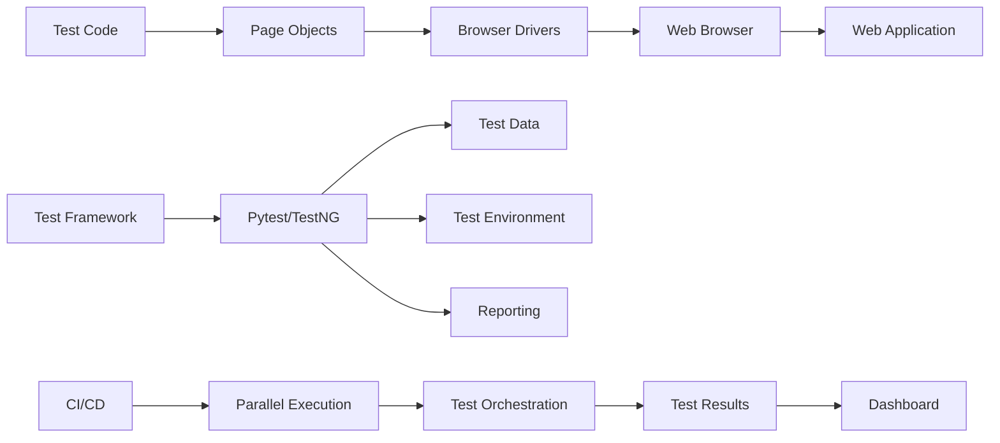
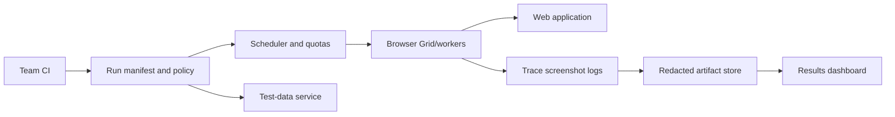
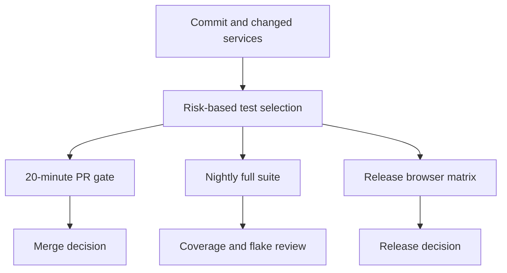
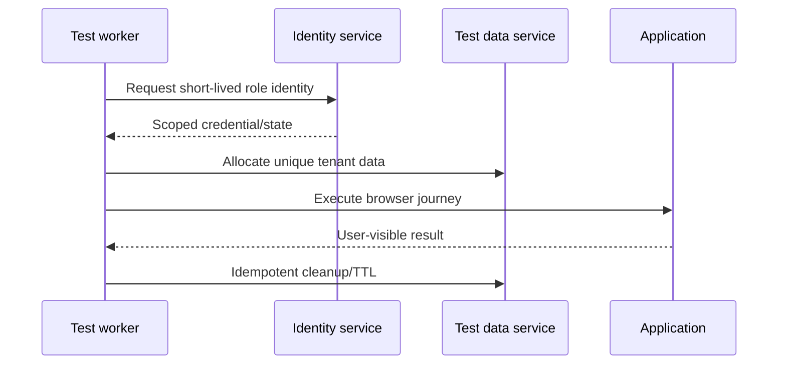
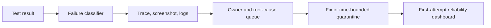
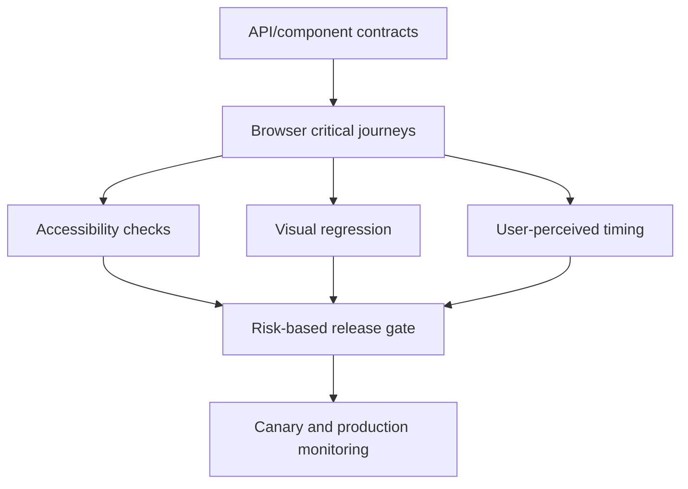

# Web Automation Testing — Senior Test Engineer / Test Architect Interview Guide

## 1. Interview Expectations at 15+ Years

Senior candidates must demonstrate enterprise web automation architecture.

**Senior Engineer:** Writes robust tests with proper abstractions
**Lead:** Designs frameworks for 10-30 engineers
**Test Architect:** Architects platform for 100+ engineers
**Staff/Principal:** Influences org-wide testing strategy and tooling

## 2. Technology Overview

Modern web apps are complex SPAs with dynamic content, authentication, and distributed backends.

### What it is
Web automation validates browser interactions, API contracts, and end-to-end user flows.

### How it works
Test script → Browser driver → Web application → Assertions → Reports

### Where it is used
Enterprise web apps, e-commerce, SaaS platforms, admin portals.

### How it fails
Dynamic content, auth flows, flaky selectors, network issues, browser incompatibilities.

### How it should be tested
Cross-browser, cross-environment, API-assisted tests, contract validation.

### How it should be automated
Page Object Model, fixture management, CI/CD integration, observability, parallelism.

## 3. Core Concepts

### Test Pyramid
**What:** Distribution of tests across layers.
**Why:** Balance speed and confidence.
**How:** 70% unit/API, 20% component/integration, 10% E2E.
**Testing:** Verify correct distribution maintained.
**Failure Modes:** Too many E2E tests cause slowness.
**Production:** Monitor test pyramid adherence.

### Page Object Model
**What:** Encapsulation of UI interactions in page classes.
**Why:** Maintainable, reusable test code.
**How:** Page classes with locators/methods.
**Testing:** POM correctness, locator stability.
**Failure Modes:** Over-abstraction, brittle locators.
**Production:** Regular refactoring for UI changes.

### Screenplay Pattern
**What:** User-centric test design pattern.
**Why:** Better maintainability, reusable tasks.
**How:** Actors, abilities, actions/tasks.
**Testing:** Task correctness, actor behavior.
**Failure Modes:** Over-engineering.
**Production:** Use for complex user journeys.

### Synchronization
**What:** Coordination with dynamic web content.
**Why:** Prevent flaky tests from timing issues.
**How:** Explicit/implicit waits, polling, custom expected conditions.
**Testing:** Wait reliability, timeout handling.
**Failure Modes:** Timeouts, race conditions.
**Production:** Optimize wait strategies.

### Authentication/Authorization
**What:** Managing login flows and permissions.
**Why:** Test user-specific functionality.
**How:** Cookie injection, API tokens, login pages.
**Testing:** Auth state correctness, permission coverage.
**Failure Modes:** Session expiry, token invalidation.
**Production:** Session state management.

### Test Data Management
**What:** Provision and manage test data.
**Why:** Consistent, realistic test scenarios.
**How:** Fixtures, data generation, API-assisted setup.
**Testing:** Data integrity, reset capability.
**Failure Modes:** Data contamination.
**Production:** Test data versioning.

### Environment Management
**What:** Managing test environments.
**Why:** Isolated, stable test execution.
**How:** Docker, infrastructure as code, service virtualization.
**Testing:** Environment availability, stability.
**Failure Modes:** Environment drift.
**Production:** Environment provisioning.

### Cross-Browser Testing
**What:** Testing across browser engines.
**Why:** Compatibility assurance.
**How:** Selenium Grid, cloud providers (BrowserStack, Sauce Labs).
**Testing:** Browser coverage, consistency.
**Failure Modes:** Browser-specific bugs.
**Production:** Cloud browser testing.

### Visual Testing
**What:** Detecting UI visual regressions.
**Why:** Catch visual bugs (layout, fonts, colors).
**How:** Screenshot comparison (Applitools, Percy, Playwright).
**Testing:** Visual diff accuracy.
**Failure Modes:** False positives.
**Production:** CI integration.

### Flaky Test Management
**What:** Identifying and handling flaky tests.
**Why:** Maintain trust in test results.
**How:** Retry logic, quarantine, root cause analysis.
**Testing:** Flakiness detection algorithms.
**Failure Modes:** Masking real issues.
**Production:** Flakiness dashboard and elimination.

## 4. ARCHITECTURE

## 5. top 50 interview questions

## Q1. Explain the web automation test pyramid strategy.

**Difficulty:** Medium
**Interview Stage:** Technical Screen

### What the interviewer is testing
Understanding of test layer balance.

### Strong Senior-Level Answer
Pyramid: 70% unit/API tests, 20% integration, 10% E2E. API tests are fast and stable; E2E tests validate user journeys but are slower. Test most logic via API.

### Architect-Level Answer
Pyramid design requires layer boundaries. API layer: 1) Contract testing, 2) Business logic validation, 3) Data setup; Component: 1) Integration testing, 2) Module testing; E2E: 1) User journey validation, 2) Critical path testing. Design for minimal E2E coverage.

### Real-World Enterprise Scenario
Team moved from 90% E2E to 70% API + 10% component + 20% E2E. Test execution dropped from 6 hours to 90 minutes.

### Likely Follow-Up Questions
- How do you decide what to test in each layer?
- What if business requires end-to-end coverage?
- How do you measure pyramid adherence?

### Common Weak Answer
"More E2E tests mean better coverage."

### Interviewer Probe
"If API tests catch 90% of bugs, why run E2E?"

### Hands-On Exercise
Design test pyramid for e-commerce checkout flow with layer distribution.

---

## Q2. How do you design a web automation framework for 300 engineers?

**Difficulty:** Very Hard
**Interview Stage:** Director Round

### What the interviewer is testing
Enterprise framework architecture.

### Strong Senior-Level Answer
Design components: 1) Shared POM library, 2) API-assisted test setup, 3) Authentication/authorization patterns, 4) Parallel execution, 5) Cross-browser support, 6) CI/CD integration, 7) Reporting dashboard, 8) Test data management, 9) Environment abstraction, 10) Observability and diagnostics.

### Architect-Level Answer
Enterprise framework requires governance and scalability. Implement: 1) Component libraries with versioning, 2) API-first testing approach, 3) Service virtualization for dependencies, 4) Kubernetes-based test grid, 5) GitOps for framework deployment, 6) Observability stack, 7) Governance policies. Use abstraction layers for browser/test infrastructure.

### Real-World Enterprise Scenario
Built framework for 300 engineers using Playwright with API-first testing. Reduced test maintenance by 70% through shared components.

### Likely Follow-Up Questions
- How do you handle framework versioning?
- What if teams need custom components?
- How do you maintain test stability?

### Common Weak Answer
"Just create a POM library."

### Interviewer Probe
"300 engineers, 1500 tests, 15% flaky. Priority?"

### Hands-On Exercise
Design framework architecture diagram for 300-engineer team with CI/CD and observability.

---

## Q3. How do you handle flaky tests in a large automation suite?

**Difficulty:** Hard
**Interview Stage:** Technical Deep Dive

### What the interviewer is testing
Flaky test diagnosis and handling.

### Strong Senior-Level Answer
Diagnose: 1) Analyze failure patterns, 2) Identify timing issues, 3) Check element stability, 4) Review test logic. Handle: 1) Retry logic with isolation, 2) Root cause fixing, 3) Quarantine for investigation, 4) Disable permanently if unfixable.

### Architect-Level Answer
Flaky test management requires systematic approach. Implement: 1) Flakiness detection algorithm (pattern analysis, correlation), 2) Retry analysis dashboard, 3) Root cause classification, 4) Quarantine process with SLA, 5) Automated quarantine recommendation. Use distributed tracing for diagnosis.

### Real-World Enterprise Scenario
Flaky test analysis identified 20% were timing issues, 30% were environment, 50% were test bugs. Fixed by implementing proper waits and improving test isolation.

### Likely Follow-Up Questions
- How do you detect flakiness algorithmically?
- What if retry hides real bugs?
- How do you prevent flaky tests?

### Common Weak Answer
"Add retry logic."

### Interviewer Probe
"Retry passes but production bug exists. What's wrong?"

### Hands-On Exercise
Design flake detection algorithm with failure pattern analysis and retry logic.

---

## Q4. Your UI automation suite is slow. How do you reduce execution time?"

**Difficulty:** Hard
**Interview Stage:** Technical Deep Dive

### What the interviewer is testing
Performance optimization.

### Strong Senior-Level Answer
Analyze: 1) Profile slow tests, 2) Identify bottlenecks, 3) Check redundant steps, 4) Review assertions. Optimize: 1) Parallel execution, 2) Reduce E2E tests, 3) Use API-assisted setup, 4) Optimize waits, 5) Browser configuration, 6) Headless mode.

### Architect-Level Answer
Test suite performance requires strategic optimization. Implement: 1) Test categorization (critical/path), 2) Priority-based execution, 3) API-first testing, 4) Test data caching, 5) Container orchestration for parallelism, 6) Execution analytics. Target 30-minute max suite.

### Real-World Enterprise Scenario
Suite took 3 hours. Optimized by replacing 60% of UI tests with API calls and adding parallel execution. Reduced to 20 minutes.

### Likely Follow-Up Questions
- How do you decide which tests to keep?
- What if parallelization infrastructure is limited?
- How do you measure optimization ROI?

### Common Weak Answer
"Run tests faster."

### Interviewer Probe
"Suite takes 3 hours. Reduce to 20 minutes. How?"

### Hands-On Exercise
Design optimization plan for a 3-hour test suite targeting 20 minutes.

---

## Q5. How do you handle authentication in web automation tests?"

**Difficulty:** Medium
**Interview Stage:** Technical Screen

### What the interviewer is testing
Auth integration with tests.

### Strong Senior-Level Answer
Methods: 1) Cookie/session injection (fast), 2) API token authentication, 3) Login page automation (UI), 4) OAuth flow handling, 5) SSO support. Test: 1) Auth state persistence, 2) Permission validation, 3) Multi-user scenarios.

### Architect-Level Answer
Auth testing requires security awareness. Implement: 1) Token management with refresh, 2) Role-based auth validation, 3) Session state management, 4) SSO integration, 5) Mock auth for unit tests. Use secure token storage.

### Real-World Enterprise Scenario
Used API token approach for auth; reduced login time from 10 seconds to <1 second per test.

### Likely Follow-Up Questions
- How do you handle multi-factor auth?
- What if tokens expire?
- How do you test SSO flows?

### Common Weak Answer
"Automate login each time."

### Interviewer Probe
"Login takes 10s per test × 1000 tests. Optimize?"

### Hands-On Exercise
Design auth strategy with token caching and permission validation.

---

## Q6. How do you implement cross-browser testing at scale?

**Difficulty:** Hard
**Interview Stage:** Technical Deep Dive

### What the interviewer is testing
Cross-browser test architecture.

### Strong Senior-Level Answer
Approach: 1) Identify browser matrix, 2) Parallel execution, 3) Cloud providers for browser matrix, 4) Headless for speed, 5) Visual validation per browser, 6) Feature detection for browser capabilities. Minimize browser count with feature targeting.

### Architect-Level Answer
Cross-browser testing requires resource management. Implement: 1) Browser matrix definition with market coverage, 2) Parallel execution orchestration, 3) Cloud provider integration (BrowserStack, Sauce Labs, LambdaTest), 4) Visual snapshot testing per browser, 5) Capability-based test selection, 6) Performance monitoring.

### Real-World Enterprise Scenario
Used cloud grid for 5 browsers × 3 OSes. Identified Safari flexbox bug before release.

### Likely Follow-Up Questions
- How do you decide browser matrix?
- What if cloud testing is slow?
- How do you detect browser compatibility issues early?

### Common Weak Answer
"Test on all browsers."

### Interviewer Probe
"1000 tests × 10 browsers × 5 minutes. How long?"

### Hands-On Exercise
Design cross-browser testing strategy for e-commerce site with 1000 tests.

---

## Q7. How do you handle dynamic content in web automation?"

**Difficulty:** Medium
**Interview Stage:** Technical Screen

### What the interviewer is testing
Dynamic element handling.

### Strong Senior-Level Answer
Techniques: 1) Explicit waits (WebDriverWait), 2) Polling for elements, 3) Custom expected conditions, 4) Retry logic for flaky elements, 5) Handle AJAX requests, 6) Wait for JavaScript to complete. Use WebDriverWait with proper conditions.

### Architect-Level Answer
Dynamic content requires robust synchronization. Implement: 1) Centralized wait utility, 2) Custom wait strategies, 3) Network idle detection, 4) JavaScript execution waiting, 5) Frame/iframe waiting, 6) Animation completion waiting. Use retry with backoff.

### Real-World Enterprise Scenario
Dynamic SPA content caused intermittent failures; implemented network idle detection to solve.

### Likely Follow-Up Questions
- How do you wait for network idle?
- What if element never appears?
- How do you handle iframes?

### Common Weak Answer
"Use implicit wait everywhere."

### Interviewer Probe
"Implicit wait causes other waits to timeout. Why?"

### Hands-On Exercise
Write wait utility with explicit, polling, and network idle strategies.

---

## Q8. How do you implement visual testing for web applications?"

**Difficulty:** Hard
**Interview Stage:** Technical Deep Dive

### What the interviewer is testing
Visual testing knowledge.

### Strong Senior-Level Answer
Approaches: 1) Screenshot comparison (Applitools, Percy, Playwright), 2) Baseline snapshots, 3) Visual diff algorithms, 4) Cross-browser visual testing, 5) Accessibility validation, 6) Regression detection. Handle dynamic content by excluding volatile regions.

### Architect-Level Answer
Visual testing requires integration. Implement: 1) Screenshot baseline management, 2) Visual diff CI integration, 3) Cross-browser visual testing, 4) Dynamic content exclusion, 5) Visual validation reporting, 6) Performance optimization for large screenshots. Use AI-assisted comparison.

### Real-World Enterprise Scenario
Visual testing caught CSS regression in payment form that functional tests missed.

### Likely Follow-Up Questions
- How do you handle dynamic content?
- What if baseline images are large?
- How do you integrate with CI/CD?

### Common Weak Answer
"Compare screenshots."

### Interviewer Probe
"Screenshots look identical to human but AI flags difference. Why?"

### Hands-On Exercise
Design visual testing framework with dynamic content handling and CI/CD integration.

---

## Q9. How do you test file uploads and downloads?"

**Difficulty:** Medium
**Interview Stage:** Technical Screen

### What the interviewer is testing
File I/O in automation.

### Strong Senior-Level Answer
Upload: 1) Use send_keys for input[type=file], 2) Drag-drop simulation, 3) API-assisted upload, 4) Handle file dialogs. Download: 1) Set browser download path, 2) Monitor download completion, 3) Validate file existence/content, 4) Clean up.

### Architect-Level Answer
File I/O testing requires robustness. Implement: 1) Upload strategy framework (input, drag-drop, API), 2) Download path management, 3) File existence checking, 4) Content validation, 5) Cleanup automation, 6) Timeout handling. Use temporary directories.

### Real-World Enterprise Scenario
Used API-assisted upload; replaced unreliable drag-drop with direct file service integration.

### Likely Follow-Up Questions
- How do you handle upload dialogs outside browser?
- What if download fails?
- How do you validate file content?

### Common Weak Answer
"Use send_keys and hope."

### Interviewer Probe
"Upload dialog appears. Browser doesn't handle. What do you do?"

### Hands-On Exercise
Design file upload/download test with validation and cleanup.

---

## Q10. How do you handle iframes and multiple windows?"

**Difficulty:** Medium
**Interview Stage:** Technical Screen

### What the interviewer is testing
Window/frame management.

### Strong Senior-Level Answer
Iframes: driver.switch_to.frame(), handle embedded content. Windows: driver.window_handles, driver.switch_to.window(). Always switch back to default/parent after interaction.

### Architect-Level Answer
Window/frame handling requires careful management. Implement: 1) Frame wait utilities, 2) Window handle tracking, 3) Switching back utilities, 4) Timeout handling, 5) Context-aware switching, 6) Cleanup mechanisms. Use page factory for complex apps.

### Real-World Enterprise Scenario
Payment iframe in checkout flow; required careful frame switching to complete transaction.

### Likely Follow-Up Questions
- What if frame index changes?
- How do you find window handle?
- What if switching fails?

### Common Weak Answer
"Use frame index 0."

### Interviewer Probe
"Iframe dynamically added/removed. How do you handle?"

### Hands-On Exercise
Write robust frame/window switching utility with error handling.

---

## Q11. Your tests pass locally but fail in CI. Diagnose."

**Difficulty:** Hard
**Interview Stage:** Production Debugging

### What the interviewer is testing
CI-specific failure analysis.

### Strong Senior-Level Answer
Check: 1) Environment differences (browser version, OS), 2) Network latency, 3) Resource constraints, 4) Parallel execution side effects, 5) Test data isolation, 6) Authentication state, 7) Timing differences. CI runs may be slower, need longer waits.

### Architect-Level Answer
CI failures require systematic analysis. Investigate: 1) Environment parity (Docker container), 2) Network conditions, 3) Resource limits (memory, CPU), 4) Test isolation (no shared state), 5) Parallel execution conflicts, 6) Browser driver versions. Use containerized browsers for consistency.

### Real-World Enterprise Scenario
Tests passed locally on Chrome 120 but CI had Chrome 118; CSS selector broke due to version difference.

### Likely Follow-Up Questions
- How do you ensure environment consistency?
- What if CI is resource-constrained?
- How do you detect parallel conflicts?

### Common Weak Answer
"Increase timeout in CI."

### Interviewer Probe
"Tests still fail in CI with more timeout. What else?"

### Hands-On Exercise
Design CI environment with Docker for consistent browser testing.

---

## Q12. How do you implement test data management for web automation?"

**Difficulty:** Medium
**Interview Stage:** Technical Screen

### What the interviewer is testing
Test data strategy.

### Strong Senior-Level Answer
Strategies: 1) Database setup/teardown, 2) API data seeding, 3) Synthetic data generation, 4) Test data factories, 5) Database snapshots (rollback), 6) Mock data. Clean up after tests, isolate test data.

### Architect-Level Answer
TDA requires systematic management. Implement: 1) Test data factory pattern, 2) Database fixtures, 3) API seeding with cleanup, 4) Snapshot/rollback mechanisms, 5) Data versioning, 6) Security-compliant test data. Use data masking for PII.

### Real-World Enterprise Scenario
Test data factory pattern created consistent test users with specific permissions for RBAC testing.

### Likely Follow-Up Questions
- How do you handle data cleanup?
- What if database reset is slow?
- How do you generate realistic data?

### Common Weak Answer
"Hardcode test data."

### Interviewer Probe
"Tests interfere due to shared data. How do you isolate?"

### Hands-On Exercise
Design test data factory with API seeding and database rollback.

---

## Q13. How do you implement accessibility testing in web automation?"

**Difficulty:** Hard
**Interview Stage:** Technical Deep Dive

### What the interviewer is testing
Accessibility validation.

### Strong Senior-Level Answer
Tools: axe-core, pa11y, Lighthouse. Integration: pytest-axe, Playwright accessibility APIs. Checks: WCAG compliance, ARIA labels, color contrast, keyboard navigation, screen reader compatibility.

### Architect-Level Answer
Accessibility testing requires standards compliance. Implement: 1) Automated axe-core scans, 2) WCAG compliance reports, 3) Keyboard navigation testing, 4) Color contrast validation, 5) ARIA validation, 6) Screen reader simulation. Integrate with CI/CD.

### Real-World Enterprise Scenario
Accessibility testing found missing form labels affecting 15% of form fields; fixed before WCAG audit.

### Likely Follow-Up Questions
- How often do you run accessibility tests?
- What if automated tests miss issues?
- How do you test screen readers?

### Common Weak Answer
"Run axe tool once."

### Interviewer Probe
"axe passes but screen reader fails. What's missing?"

### Hands-On Exercise
Design accessibility test suite integrating axe-core with detailed reporting.

---

## Q14. How do you handle cookies and session management in tests?"

**Difficulty:** Medium
**Interview Stage:** Technical Screen

### What the interviewer is testing
State management.

### Strong Senior-Level Answer
Manage: 1) Session cookies, 2) Persistent cookies, 3) Cookie consent banners, 4) Session expiry handling, 5) Cleanup between tests. Test with various cookie configurations.

### Architect-Level Answer
Session management requires state awareness. Implement: 1) Cookie persistence, 2) Consent handling, 3) Session restoration, 4) Expiry handling, 5) Cleanup automation, 6) Cross-test isolation. Use cookie containers for isolation.

### Real-World Enterprise Scenario
Cookie consent banner blocked test interaction; automated consent acceptance solved.

### Likely Follow-Up Questions
- How do you handle session expiry?
- What if cookies are secure?
- How do you isolate tests per user?

### Common Weak Answer
"Clear cookies after each test."

### Interviewer Probe
"Secure cookies require HTTPS. What about HTTP test env?"

### Hands-On Exercise
Design cookie management with consent handling and session restoration.

---

## Q15. Your element selector changes frequently. How do you handle?"

**Difficulty:** Hard
**Interview Stage:** Technical Deep Dive

### What the interviewer is testing
Selector resilience.

### Strong Senior-Level Answer
Use: 1) test-id attributes, 2) CSS classes with semantic names, 3) ARIA labels, 4) Custom data attributes. Avoid: auto-generated classes, deeply nested selectors. Implement: 1) Selector strategy, 2) Fallback locators, 3) Self-healing if available.

### Architect-Level Answer
Selector resilience requires strategy. Implement: 1) test-id convention, 2) Selector priority order (test-id > semantic CSS > XPath), 3) Locators as Page Object properties, 4) Dynamic locator handling. Work with dev team for testability hooks.

### Real-World Enterprise Scenario
Developers added data-testid attributes; reduced selector fragility by 80%.

### Likely Follow-Up Questions
- How do you handle dynamic element IDs?
- What if developers don't add test-ids?
- How do you validate selector resilience?

### Common Weak Answer
"Use generated CSS classes."

### Interviewer Probe
"XPath uses /html/body/div[3]/div[2]. Fragile? Yes."

### Hands-On Exercise
Design resilient locator strategy with fallback mechanisms for dynamic IDs.

---

## Q16. How do you implement parallel test execution?"

**Difficulty:** Hard
**Interview Stage:** Technical Deep Dive

### Strong Senior-Level Answer
Use: 1) pytest-xdist, 2) Playwright workers, 3) Selenium Grid, 4) Container orchestration (Kubernetes/Docker). Isolate tests, manage resources, handle shared state.

### Architect-Level Answer
Parallel execution requires orchestration. Implement: 1) Test isolation (no shared state), 2) Resource allocation, 3) Container-based execution, 4) Load balancing, 5) Failure handling, 6) Result aggregation. Use Kubernetes for scaling.

### Hands-On Exercise
Design parallel execution framework with test isolation and resource management.

---

## Q17. A 3-hour regression suite must finish in 20 minutes without losing meaningful coverage. How do you approach it?
**Difficulty:** Architect | **Interview Stage:** Architecture
### What the interviewer is testing
Measurement-led optimization rather than indiscriminate test deletion.
### Strong Senior-Level Answer
Establish duration and failure baselines by test, layer, browser, and setup/teardown. Move business rules to unit/API/component tests, retain a small set of critical browser journeys, parallelize only isolated tests, and remove duplicate assertions. Keep a scheduled full suite and compare defect detection before and after changes.
### Architect-Level Answer
Model the critical path, worker capacity, browser startup, environment bottlenecks, and data contention. Use risk-based tags, sharding, elastic workers, API-assisted setup, and separate blocking smoke from broader scheduled coverage. A 20-minute target is a service objective, not a reason to hide failures.
### Real-World Enterprise Scenario
An account platform has 2,400 tests; 60% of wall time is serial account setup and shared-environment contention.
### Likely Follow-Up Questions
- What data would you need before changing the suite?
- How do you avoid parallelism increasing flakiness?
- What coverage remains blocking on a pull request?
### Common Weak Answer
"Delete slow tests and run everything in parallel."
### Interviewer Probe
How will you show that escaped-defect risk did not increase?
### Hands-On Exercise
Design a 20-minute CI lane and a nightly lane, including test selection and measurable exit criteria.

## Q18. How do you decide which behaviors belong in API, component, and browser tests?
**Difficulty:** Hard | **Interview Stage:** Technical Deep Dive
### What the interviewer is testing
Risk-based test-layer allocation.
### Strong Senior-Level Answer
Test business rules at the lowest layer that gives a reliable oracle; use component tests for UI behavior and integration boundaries; reserve browser E2E for critical user-visible wiring such as sign-in, checkout, and permissions. Cover each risk once at the most diagnostic layer, then add only essential cross-layer journeys.
### Architect-Level Answer
Map failure modes to ownership boundaries and feedback cost. Treat the pyramid as a portfolio, not a fixed percentage. Include contract tests at service boundaries, accessibility checks at component/page level, and production telemetry for risks that cannot be represented faithfully in test environments.
### Real-World Enterprise Scenario
The payment calculation is validated in API tests; a concise E2E confirms that an authorized user can submit payment and see its resulting state.
### Likely Follow-Up Questions
- Which risks justify a full E2E test?
- Where do contract tests fit?
- How do you detect duplicated coverage?
### Common Weak Answer
"Use a 70/20/10 ratio for every product."
### Interviewer Probe
Which layer gives the fastest trustworthy feedback for a tax calculation change?
### Hands-On Exercise
Allocate tests for a checkout flow and justify each boundary.

## Q19. The application is a single-page app and a test passes before asynchronous results render. How do you synchronize it?
**Difficulty:** Hard | **Interview Stage:** Technical Deep Dive
### What the interviewer is testing
Understanding of observable readiness and race conditions.
### Strong Senior-Level Answer
Wait for a user-meaningful condition: a result row, status transition, or loading indicator to disappear. Prefer framework-native locator/actionability waits; avoid fixed sleeps and broad page-load assumptions. Set bounded timeouts and report the last observed state on failure.
### Architect-Level Answer
Define stable testability contracts with the frontend team: accessible roles/names, deterministic test IDs where needed, and explicit state indicators. Instrument network and browser diagnostics, but do not make a private API response the only oracle for a user-visible outcome.
### Real-World Enterprise Scenario
A search view updates via fetch after route navigation; waiting for `networkidle` is unreliable because analytics keeps long-lived requests active.
### Likely Follow-Up Questions
- When is a network wait appropriate?
- How do you handle optimistic UI updates?
- What diagnostic evidence should a timeout capture?
### Common Weak Answer
"Add a five-second sleep after every click."
### Interviewer Probe
What exact condition proves the application is ready for the assertion?
### Hands-On Exercise
Write a locator-based wait for a result state with a clear timeout message.

## Q20. How do you use network interception without making end-to-end tests unrealistic?
**Difficulty:** Hard | **Interview Stage:** Technical Deep Dive
### What the interviewer is testing
Controlled isolation and fidelity trade-offs.
### Strong Senior-Level Answer
Mock unstable third parties and rare error responses; keep first-party integration paths real in a smaller number of tests. Validate the intercepted request shape and the rendered outcome. Maintain separate contract/integration coverage so a mock cannot silently drift from the provider contract.
### Architect-Level Answer
Classify dependencies by ownership, determinism, and business risk. Version fixtures, record provenance, and keep an explicit balance of mocked and live tests. Avoid global interception that masks auth, caching, or routing defects.
### Real-World Enterprise Scenario
An e-commerce checkout mocks a shipping carrier's outage in a deterministic recovery test, while a scheduled integration suite checks the carrier sandbox.
### Likely Follow-Up Questions
- What should never be mocked in the critical path?
- How do you detect stale fixtures?
- How do you test timeout and partial-response behavior?
### Common Weak Answer
"Mock every API so UI tests run faster."
### Interviewer Probe
What defect could pass because your mock is more permissive than production?
### Hands-On Exercise
Define one live integration journey and one intercepted failure journey for an external payment API.

## Q21. How do you make authentication and authorization tests secure and repeatable?
**Difficulty:** Hard | **Interview Stage:** Technical Deep Dive
### What the interviewer is testing
Identity lifecycle, least privilege, and test isolation.
### Strong Senior-Level Answer
Use dedicated least-privilege test identities and supported auth setup (often API-assisted), isolate browser sessions, and test both allowed and denied actions. Keep credentials in a secret manager, avoid logging tokens, and include expiry/revocation cases.
### Architect-Level Answer
Separate identity-provider integration tests from application authorization tests. Define role/claim fixtures, short-lived credentials, audit evidence, rotation, and cleanup. Use synthetic tenants and ensure parallel workers cannot share mutable identity state.
### Real-World Enterprise Scenario
An SSO token expires halfway through a parallel suite and causes unrelated tests to fail as though authorization were broken.
### Likely Follow-Up Questions
- Which SSO behavior must be tested through the real provider?
- How do you validate tenant isolation?
- How do you prevent secrets in traces and screenshots?
### Common Weak Answer
"Log in once and reuse the same browser profile."
### Interviewer Probe
How would you prove that a user from tenant A cannot read tenant B's record?
### Hands-On Exercise
Design positive and negative role-based tests with isolated accounts and redacted artifacts.

## Q22. How do you test browser session expiry and cookie consent without coupling tests to internals?
**Difficulty:** Medium | **Interview Stage:** Technical Screen
### What the interviewer is testing
State transition coverage and user-observable contracts.
### Strong Senior-Level Answer
Create a controlled expired-session state, perform a protected action, and assert a clear re-authentication path with no data loss. For consent, test accept/reject/preferences and persistence according to policy. Assert behavior rather than hard-coding cookie implementation details unless security policy explicitly requires it.
### Architect-Level Answer
Maintain separate tests for policy compliance, session lifecycle, and browser persistence. Use isolated contexts, deterministic clocks or test hooks where supported, and verify consent behavior across relevant subdomains without exposing production identifiers.
### Real-World Enterprise Scenario
Consent is stored on a parent domain but the application runs on several subdomains, leading to inconsistent banners.
### Likely Follow-Up Questions
- How do you test a server-side revoked session?
- What is the risk of manipulating cookies directly?
- Which consent rules are legal/policy assertions versus UI assertions?
### Common Weak Answer
"Clear all cookies at the end of the test."
### Interviewer Probe
What should happen to an unsaved form when the session expires?
### Hands-On Exercise
Specify a test matrix for active, expired, revoked, and consented sessions.

## Q23. How do you select and maintain locators across a large engineering organization?
**Difficulty:** Hard | **Interview Stage:** Architecture
### What the interviewer is testing
Testability governance and maintainable contracts.
### Strong Senior-Level Answer
Prefer accessible role/name locators for user-facing behavior and stable test IDs for elements without a suitable semantic locator. Avoid generated classes and positional XPath. Keep locator ownership close to page/component abstractions and report selector failures with page and state context.
### Architect-Level Answer
Publish a lightweight testability contract, linting/review guidance, component-level examples, and migration metrics. Do not force test IDs everywhere; require them when semantic selectors cannot express the intended target. Track churn and repair cost by component.
### Real-World Enterprise Scenario
A redesign changes CSS classes across 40 teams; role-based selectors remain stable, while test IDs are retained for canvas-based widgets.
### Likely Follow-Up Questions
- How do you deal with duplicate accessible names?
- When is XPath justified?
- Who owns selector changes in a shared component?
### Common Weak Answer
"Use XPath because it can find anything."
### Interviewer Probe
What does a locator communicate about intended user behavior?
### Hands-On Exercise
Define locator conventions for a form, a repeated table, and a custom chart.

## Q24. How do you validate a multi-tenant authorization boundary through the browser?
**Difficulty:** Very Hard | **Interview Stage:** Technical Deep Dive
### What the interviewer is testing
Security-oriented test design and coverage of direct versus indirect access.
### Strong Senior-Level Answer
Create records under separate tenants, verify permitted views and actions, and attempt cross-tenant access through navigation, search, deep links, and cached state. Assert denial without leaking object existence or sensitive fields, and clean up test data.
### Architect-Level Answer
Pair browser journeys with API authorization tests and policy/unit tests. Build a risk matrix for tenant, role, resource, and operation; use non-production synthetic data; preserve audit logs while redacting PII. A UI-hidden button alone is not an authorization control.
### Real-World Enterprise Scenario
The UI hides an export action, but a bookmarked export URL still returns another tenant's report.
### Likely Follow-Up Questions
- How do you make this testing safe in shared environments?
- What is the difference between authentication and authorization evidence?
- How do you cover object-level authorization at scale?
### Common Weak Answer
"Check that the other tenant's menu is not visible."
### Interviewer Probe
What happens when the test changes only the resource ID in the URL?
### Hands-On Exercise
Build a tenant-role-operation matrix with expected allow/deny outcomes.

## Q25. How do you make visual regression testing useful rather than noisy?
**Difficulty:** Hard | **Interview Stage:** Technical Deep Dive
### What the interviewer is testing
Baseline governance and signal quality.
### Strong Senior-Level Answer
Capture stable, representative states with controlled viewport, fonts, locale, data, and animations. Mask only truly dynamic regions, review diffs, and keep semantic assertions alongside screenshots. Update baselines through reviewed changes, not automatic acceptance.
### Architect-Level Answer
Choose visual coverage by risk and component reuse, not every page/state combination. Version baselines by browser/OS where rendering differs, define ownership and approval flow, and measure false-positive review load. Keep accessibility and functional checks distinct because pixels do not prove either.
### Real-World Enterprise Scenario
A shared design-system button change creates hundreds of useful diffs but dynamic timestamps create thousands of false positives.
### Likely Follow-Up Questions
- Which rendering differences should be normalized?
- How do you review a baseline update safely?
- Can visual testing catch a broken keyboard flow?
### Common Weak Answer
"Compare every screenshot pixel and fail on any difference."
### Interviewer Probe
How would you tell a harmless anti-aliasing change from clipped production content?
### Hands-On Exercise
Define baseline capture conditions for a responsive account dashboard.

## Q26. How do you test accessibility in a web automation strategy?
**Difficulty:** Hard | **Interview Stage:** Technical Deep Dive
### What the interviewer is testing
Practical understanding of automated and manual accessibility evidence.
### Strong Senior-Level Answer
Run automated rules on critical pages, test keyboard navigation and focus behavior, verify names/roles/states, and include manual assistive-technology review for important flows. Treat automation as defect detection, not proof of conformance; document standard/version and scope.
### Architect-Level Answer
Shift checks left into component CI and design-system release gates, then sample end-to-end journeys and conduct periodic expert audits. Prioritize by user impact and legal obligations; triage violations with accountable owners and remediation SLAs.
### Real-World Enterprise Scenario
Automated scans pass, but a modal traps keyboard focus after an error is announced.
### Likely Follow-Up Questions
- Which issues are reliably automatable?
- How do you test screen-reader announcements?
- How do you avoid treating a score as conformance?
### Common Weak Answer
"Run an accessibility scanner and call it compliant."
### Interviewer Probe
How would a keyboard-only user complete and recover from this workflow?
### Hands-On Exercise
Create a test plan for a modal form including focus entry, error announcement, and focus return.

## Q27. How should cross-browser coverage be selected and debugged?
**Difficulty:** Hard | **Interview Stage:** Architecture
### What the interviewer is testing
Evidence-based browser support and failure isolation.
### Strong Senior-Level Answer
Use product analytics, support policy, and risk to select browser engines and versions. Run fast smoke coverage broadly and deeper journeys on representative combinations. On failure, capture browser/version, viewport, console, network, and screenshot evidence before assuming an application defect.
### Architect-Level Answer
Separate engine coverage from version coverage, and use a managed grid/cloud when it improves real-device coverage enough to justify cost. Keep a small reproducible local matrix and define support-window policy; do not equate more browser jobs with more confidence if test data is shared.
### Real-World Enterprise Scenario
Checkout passes Chromium but fails WebKit due to a date input behavior difference.
### Likely Follow-Up Questions
- How do you choose versions for a regulated product?
- When should a browser-specific workaround be accepted?
- How do you isolate grid capacity failures from product failures?
### Common Weak Answer
"Run every test on every browser every commit."
### Interviewer Probe
What evidence would distinguish a browser engine bug from invalid app behavior?
### Hands-On Exercise
Propose a PR/nightly/release browser matrix for a consumer finance portal.

## Q28. How do you test responsive behavior without multiplying the suite uncontrollably?
**Difficulty:** Medium | **Interview Stage:** Technical Deep Dive
### What the interviewer is testing
Representative viewport selection and layout-risk coverage.
### Strong Senior-Level Answer
Choose breakpoints from the design system and usage data, then cover critical workflows at a small representative set of viewport sizes. Assert layout behavior and reachable controls, not only exact pixel dimensions; add targeted tests for known breakpoint boundaries.
### Architect-Level Answer
Combine component-level responsive checks, visual snapshots at selected sizes, and a small number of end-to-end mobile journeys. Include orientation, zoom/text scaling, and touch interaction when product requirements demand them; use risk-based pairwise selection for broader combinations.
### Real-World Enterprise Scenario
A navigation menu works at desktop and narrow mobile widths but overlaps controls just above a breakpoint.
### Likely Follow-Up Questions
- How do you find breakpoint boundary defects?
- What should be tested on an actual device?
- How do you include localization expansion?
### Common Weak Answer
"Take a screenshot at 375 pixels."
### Interviewer Probe
Which user-visible behavior is actually at risk at this breakpoint?
### Hands-On Exercise
Design viewport cases for a localized checkout with a sticky footer.

## Q29. How do you test file upload and download flows reliably?
**Difficulty:** Hard | **Interview Stage:** Technical Deep Dive
### What the interviewer is testing
Boundary validation, security, and artifact determinism.
### Strong Senior-Level Answer
For upload, cover supported/unsupported type, size limits, malformed content, progress, and server-side result. For download, wait for the download event, verify filename and content/checksum, and remove artifacts. Keep test fixtures small and deterministic.
### Architect-Level Answer
Test policy at API/service level and a few browser journeys for user-facing progress and error recovery. Include malware scanning/quarantine outcomes where relevant, content-disposition and authorization checks, and prevent downloaded sensitive artifacts from leaking into CI logs.
### Real-World Enterprise Scenario
A successful UI upload returns before asynchronous virus scanning finishes, so the record appears pending rather than available.
### Likely Follow-Up Questions
- How do you test a file too large to upload in CI?
- What proves downloaded content is correct?
- How do you test interrupted transfers?
### Common Weak Answer
"Assert the upload button was clicked."
### Interviewer Probe
What state is the file in after upload acceptance but before processing completes?
### Hands-On Exercise
Specify upload cases and a download assertion using a temporary directory and checksum.

## Q30. How do you test browser-facing performance without confusing it with backend load testing?
**Difficulty:** Very Hard | **Interview Stage:** Technical Deep Dive
### What the interviewer is testing
Appropriate performance signals and test-layer boundaries.
### Strong Senior-Level Answer
Use browser measurements for user-perceived navigation/rendering and resource failures, with controlled environment and budgets. Use dedicated load tests for concurrency and backend capacity. Avoid unstable absolute timing assertions on shared CI workers; compare trends and enforce well-understood budgets.
### Architect-Level Answer
Define journey-level SLOs by device/network class, collect browser performance entries and server traces, and correlate them without using UI automation as a load generator. Gate on statistically meaningful regressions and separate lab benchmarks from real-user monitoring.
### Real-World Enterprise Scenario
The page's document response is fast, but a third-party script delays the primary action becoming usable.
### Likely Follow-Up Questions
- What is the difference between load, DOM-ready, and interactive signals?
- How would you avoid noisy CI thresholds?
- What production telemetry validates lab results?
### Common Weak Answer
"Measure how long `click()` takes."
### Interviewer Probe
Which user-visible milestone represents success for this journey?
### Hands-On Exercise
Define performance marks and budgets for a search-to-results workflow.

## Q31. How do you design test data lifecycle for parallel tests and ephemeral environments?
**Difficulty:** Very Hard | **Interview Stage:** Architecture
### What the interviewer is testing
Isolation, reproducibility, and environment lifecycle design.
### Strong Senior-Level Answer
Create data through supported APIs/factories with unique run and worker identifiers. Track ownership, use idempotent cleanup, and make tests safe to rerun. Prefer disposable tenant/schema/environment isolation when shared-state collisions are costly.
### Architect-Level Answer
Define data contracts and retention, deterministic seed strategy, quotas, cleanup controllers, and privacy constraints. Balance per-test isolation with provisioning cost; use immutable shared reference data only where it cannot be mutated. Make orphaned data observable and automatically expire it.
### Real-World Enterprise Scenario
Parallel order tests reuse a customer account, causing one worker to consume another worker's inventory.
### Likely Follow-Up Questions
- What if test cleanup fails after a timeout?
- How do you handle uniqueness constraints?
- How do you keep production-like data without PII exposure?
### Common Weak Answer
"Reset the shared database after every test."
### Interviewer Probe
Can the test be safely rerun after the browser crashes between submit and cleanup?
### Hands-On Exercise
Design a run-scoped fixture identifier and eventual cleanup process.

## Q32. How do you treat retries and quarantine in a trustworthy CI quality gate?
**Difficulty:** Very Hard | **Interview Stage:** Architecture
### What the interviewer is testing
Signal integrity and flakiness governance.
### Strong Senior-Level Answer
Retries provide diagnostic evidence, not a green pass that erases the first failure. Report first-attempt and final outcomes separately, quarantine with an owner and expiry, and keep critical security/data-loss tests blocking. Investigate flakes by failure signature and environment correlation.
### Architect-Level Answer
Publish flake rate, retry recovery, quarantine age, and escaped defect measures. Bound retry count, prevent permanent quarantine, and make bypasses auditable. Gate policy should distinguish infrastructure failures from product assertions without letting teams relabel failures indefinitely.
### Real-World Enterprise Scenario
A release is green only after two retries, masking a race introduced in a critical save flow.
### Likely Follow-Up Questions
- What is an acceptable quarantine SLA?
- How do you identify systemic infrastructure flakiness?
- Should a retried test block a release?
### Common Weak Answer
"Set retries to three so CI becomes stable."
### Interviewer Probe
What information does the first failed attempt preserve for the release decision?
### Hands-On Exercise
Define a retry/quarantine policy with expiry, ownership, and reporting fields.

## Q33. What diagnostics should an enterprise browser test capture on failure?
**Difficulty:** Hard | **Interview Stage:** Technical Deep Dive
### What the interviewer is testing
Actionable observability balanced against privacy and storage cost.
### Strong Senior-Level Answer
Capture test/run/commit/environment identifiers, browser and viewport, failed assertion, screenshot, console errors, relevant network failures, and trace/video when useful. Preserve enough surrounding steps to reproduce while redacting secrets and limiting retention.
### Architect-Level Answer
Use a correlation ID across CI orchestration, browser session, application logs, and service traces. Apply sampling and retention by failure class, encrypt artifacts, restrict access, and scrub headers, form fields, and PII before upload.
### Real-World Enterprise Scenario
Screenshots reveal the failure but contain customer-like data and are retained indefinitely in a public CI artifact store.
### Likely Follow-Up Questions
- What should never be captured in a trace?
- How do you correlate a UI action with server logs?
- How long should artifacts be retained?
### Common Weak Answer
"Take a screenshot on failure."
### Interviewer Probe
Can the artifact identify the responsible request without exposing its bearer token?
### Hands-On Exercise
Write an artifact policy specifying fields, redactions, ACL, and retention.

## Q34. How would you design a web automation platform used by 300 engineers?
**Difficulty:** Architect | **Interview Stage:** Director
### What the interviewer is testing
Platform architecture, adoption, governance, and service ownership.
### Strong Senior-Level Answer
Provide a supported runner/library, reusable fixtures, test-data APIs, browser execution options, CI templates, and consistent reports. Keep extension points for team-specific needs and publish examples, migration guidance, and support channels.
### Architect-Level Answer
Separate authoring SDK, orchestration, ephemeral execution workers, secrets/data services, artifact store, and analytics. Define compatibility/versioning, tenant quotas, isolation boundaries, SLOs, cost attribution, security review, and governance. Measure adoption and time-to-diagnosis, not test count alone.
### Real-World Enterprise Scenario
300 engineers across 20 teams need pull-request feedback while browser capacity is shared and costly.
### Likely Follow-Up Questions
- What is centralized versus owned by product teams?
- How do you roll out a breaking framework change?
- What is the platform's failure SLO?
### Common Weak Answer
"Build one shared Page Object Model library."
### Interviewer Probe
How does a team diagnose whether a red build is product, test, environment, or platform failure?
### Hands-On Exercise
Whiteboard authoring-to-results architecture and name each ownership boundary.

## Q35. How do you operate Selenium Grid or a cloud browser provider at scale?
**Difficulty:** Very Hard | **Interview Stage:** Architecture
### What the interviewer is testing
Distributed execution capacity, isolation, and vendor/runtime trade-offs.
### Strong Senior-Level Answer
Treat each browser session as a resource with bounded concurrency, startup/readiness checks, timeouts, and cleanup. Queue work according to priority, capture session IDs and capabilities, and distinguish provider/session failures from test failures.
### Architect-Level Answer
Model demand, session duration, browser mix, and peak concurrency; enforce quotas and back-pressure. Evaluate self-hosted Grid versus managed service for security, geographic coverage, operational burden, and cost. Monitor queue wait, session-start errors, utilization, and artifact completeness.
### Real-World Enterprise Scenario
A Monday morning PR surge saturates the grid, making tests fail before a browser is allocated.
### Likely Follow-Up Questions
- How do you prevent a runaway suite consuming all sessions?
- What data supports cloud-provider selection?
- How do you safely drain nodes during browser upgrades?
### Common Weak Answer
"Add more nodes whenever sessions queue."
### Interviewer Probe
How do you tell capacity saturation from a browser startup regression?
### Hands-On Exercise
Define autoscaling signals and a maximum-cost guardrail for a browser fleet.

## Q36. How do you govern framework versions without blocking team delivery?
**Difficulty:** Architect | **Interview Stage:** Director
### What the interviewer is testing
Compatibility strategy and organizational change management.
### Strong Senior-Level Answer
Version shared packages semantically, document supported runtimes, deprecate with warnings, and provide migration examples. Keep dependencies pinned in reproducible CI images and roll forward in stages with representative teams.
### Architect-Level Answer
Use compatibility tests across supported versions, release channels, automated dependency updates, and an end-of-support policy. Track adoption and breakage; reserve emergency security patches and rollback paths. Governance should standardize interfaces and safety while allowing team-owned domain abstractions.
### Real-World Enterprise Scenario
A browser-driver upgrade breaks a small set of legacy tests while teams need a security patch immediately.
### Likely Follow-Up Questions
- How long do you support an old major version?
- How do you test plugin compatibility?
- What is your rollback criterion?
### Common Weak Answer
"Upgrade everyone on the same day."
### Interviewer Probe
How can teams test the new version before the organization-wide default changes?
### Hands-On Exercise
Design a staged framework release policy with canary teams and deprecation milestones.

## Q37. How do you combine API-assisted setup with meaningful browser validation?
**Difficulty:** Hard | **Interview Stage:** Technical Deep Dive
### What the interviewer is testing
Efficient setup while preserving the UI behavior under test.
### Strong Senior-Level Answer
Use APIs to create deterministic preconditions and clean up, then exercise the user journey through the browser. Keep tests that specifically validate UI-created data and API/UI integration. Validate setup responses and avoid reaching directly into databases unless no supported interface exists.
### Architect-Level Answer
Treat setup APIs as versioned dependencies with contract coverage and scoped test credentials. Separate fixture failures from UI failures, use idempotency keys where creation may retry, and provide a fallback strategy for environments without seed APIs.
### Real-World Enterprise Scenario
Creating a year of ledger history through the UI makes one report test take 12 minutes; a fixture API provisions the same state in seconds.
### Likely Follow-Up Questions
- What if the setup endpoint has a defect?
- How do you avoid bypassing the behavior being tested?
- How should setup be observed and cleaned up?
### Common Weak Answer
"Use the database to insert whatever state is needed."
### Interviewer Probe
Which exact user-facing behavior does the browser test still prove?
### Hands-On Exercise
Design a fixture API contract and browser assertions for a seeded invoice.

## Q38. How do you include privacy and security controls in browser automation?
**Difficulty:** Very Hard | **Interview Stage:** Architecture
### What the interviewer is testing
Threat modeling across credentials, test data, execution, and artifacts.
### Strong Senior-Level Answer
Use synthetic or masked data, least-privilege identities, secret injection, isolated workers, encrypted transport/storage, and artifact redaction. Threat-model browser extensions, downloaded files, third-party scripts, and the CI runner itself.
### Architect-Level Answer
Define trust boundaries, retention, access audit, network egress policy, image provenance, patching, and tenant isolation. Security tests should include authorization and abuse cases, but test infrastructure must not become a privileged path into production systems.
### Real-World Enterprise Scenario
An automated test logs an SSO token into a browser console artifact uploaded to a shared build system.
### Likely Follow-Up Questions
- How do you test secure cookies over HTTPS in ephemeral environments?
- What is the risk of production-like data masking?
- How do you verify artifact scrubbing?
### Common Weak Answer
"The test environment is non-production, so secrets are not a concern."
### Interviewer Probe
Could a compromised test worker access another team's session or artifact?
### Hands-On Exercise
Create a threat checklist for a browser worker processing authenticated test data.

## Q39. How do you evaluate test selection for pull requests in a monorepo?
**Difficulty:** Architect | **Interview Stage:** Architecture
### What the interviewer is testing
Dependency-aware selection without unsafe omission.
### Strong Senior-Level Answer
Start with explicit tags and ownership, then map changed components to impacted tests using dependency metadata. Always run a small critical smoke suite and periodically compare selected runs with full runs to identify missed coverage. Fall back to broader execution when impact is unknown.
### Architect-Level Answer
Build a conservative impact graph from code ownership, service contracts, and runtime dependency data. Measure selection precision and recall against full-suite results; version the selection algorithm and make overrides auditable. Do not let an opaque model silently skip safety-critical tests.
### Real-World Enterprise Scenario
A shared authentication library changes, but path-based selection runs only the library's unit tests and misses downstream login regressions.
### Likely Follow-Up Questions
- How do you validate selection recall?
- What happens with generated code or dynamic dependencies?
- How do you handle flaky historical signals?
### Common Weak Answer
"Run tests only in directories that changed."
### Interviewer Probe
How will you discover that a test was incorrectly excluded?
### Hands-On Exercise
Design a dependency graph and safe fallback rules for a 30-service monorepo.

## Q40. How do you test OAuth redirects and third-party identity providers reliably?
**Difficulty:** Very Hard | **Interview Stage:** Technical Deep Dive
### What the interviewer is testing
Protocol boundary coverage and deterministic provider integration.
### Strong Senior-Level Answer
Test application callback handling and state/nonce validation with a controlled identity provider in integration tests; keep a smaller real-provider smoke suite for configuration and availability. Cover denial, expired code, invalid state, and return-to-path behavior without storing real user credentials.
### Architect-Level Answer
Separate protocol correctness, provider-specific configuration, and user authorization policy. Manage redirect allowlists, secret rotation, clock skew, and test-provider parity. Keep externally hosted login pages out of most UI regression tests while preserving end-to-end evidence for critical federation paths.
### Real-World Enterprise Scenario
Login succeeds locally but staging has an incorrect callback URI and drops users into a redirect loop.
### Likely Follow-Up Questions
- What does the state parameter defend against?
- How do you test clock skew and token expiry?
- What should be covered with a real provider?
### Common Weak Answer
"Automate the entire login page with a shared admin account."
### Interviewer Probe
What evidence proves the callback rejects a forged or replayed response?
### Hands-On Exercise
Specify negative OAuth callback tests and the assertions at the trust boundary.

## Q41. Production Debugging: Test suite takes 5min locally, 30min in CI.

**Symptom:** Significant CI slowdown.
**Investigation:** Environment, parallelism, network, data setup.
**Root Cause:** CI lacks parallelism; network delays; shared data.
**Fix:** Enable parallel execution; use API setup; network optimization.

## Q42. Production Debugging: Tests fail intermittently in CI only.

**Symptom:** Flaky CI failures.
**Investigation:** Check environment, parallel conflicts, timing.
**Root Cause:** Parallel execution race conditions.
**Fix:** Test isolation; sequential execution for conflicting tests.

## Q43. Architecture Design: Design test suite for 1000+ tests."

**Requirements:** Fast, parallel, maintainable.
**Solution:** Pytest + pytest-xdist, container-based execution, test categorization.

## Q44. Architecture Design: Reduce 3-hour regression to 20 minutes."

**Strategy:** Move to API-first testing; parallelize with Selenium Grid; reduce redundant tests.

## Q45. How would you measure whether a shared automation platform is improving engineering outcomes?
**Difficulty:** Architect | **Interview Stage:** Director
### What the interviewer is testing
Outcome metrics rather than vanity metrics.
### Strong Senior-Level Answer
Track feedback latency, first-attempt reliability, diagnostic time, maintenance effort, adoption, and defects found before release. Segment by team and test layer so a larger test count is not mistaken for better quality.
### Architect-Level Answer
Define leading and lagging measures with baselines and guard against gaming. Pair platform SLOs (queue time, session start, artifact availability) with product outcomes (escaped defects, incident severity, change failure rate) and review causal evidence before claiming ROI.
### Real-World Enterprise Scenario
Test count doubles while developer trust falls because retries hide intermittent failures.
### Likely Follow-Up Questions
- How do you measure defect detection effectiveness?
- Which metric can teams game unintentionally?
- How do you attribute outcomes to the platform?
### Common Weak Answer
"We measure success by the number of automated tests."
### Interviewer Probe
What would cause you to stop investing in a platform feature?
### Hands-On Exercise
Propose a scorecard with definitions, owners, and anti-gaming checks.

## Q46. A test passes only after retry. Should the release be green?
**Difficulty:** Architect | **Interview Stage:** Director
### What the interviewer is testing
Release risk reasoning and honest reporting of nondeterminism.
### Strong Senior-Level Answer
Report the first-attempt failure and classify it; a retry is evidence of instability, not proof that the original failure is harmless. Critical flows should have explicit policy, and infrastructure failures require corroborating evidence before being excluded.
### Architect-Level Answer
Use risk-specific gates: a retried assertion failure on a high-impact path may block or require human disposition, while a confirmed worker provisioning error can be rerun. Preserve raw attempts, ownership, and trend data so retry policy does not normalize product races.
### Real-World Enterprise Scenario
A double-submit race causes duplicate orders in one run out of ten, but CI marks the build green after retry.
### Likely Follow-Up Questions
- How do you distinguish flaky test code from a flaky product?
- What should the release dashboard display?
- When is an automatic rerun justified?
### Common Weak Answer
"If it passes on retry, it is fine."
### Interviewer Probe
Would a customer accept a 10% chance of duplicate submission?
### Hands-On Exercise
Write a release-gate policy for assertion failures, infrastructure failures, and quarantined tests.

## Q47. How do you prove an automation framework is maintainable across teams and years?
**Difficulty:** Architect | **Interview Stage:** Architecture
### What the interviewer is testing
Evolution strategy, ownership, and measurable maintenance burden.
### Strong Senior-Level Answer
Use stable public interfaces, examples, compatibility tests, code review conventions, and clear ownership. Measure change lead time, breakage after upgrades, duplicate utilities, and time spent repairing tests; periodically remove abstractions that no longer reduce cost.
### Architect-Level Answer
Treat the framework as a product with roadmap, support policy, versioned contracts, deprecation windows, contribution model, security lifecycle, and adoption feedback. Avoid central ownership becoming a bottleneck by enabling safe extension points and federated maintainers.
### Real-World Enterprise Scenario
The original framework team has disbanded; dozens of teams depend on undocumented internal helpers.
### Likely Follow-Up Questions
- How do you sunset a framework safely?
- What belongs in core versus a plugin?
- How do you avoid abstraction lock-in?
### Common Weak Answer
"Keep adding utilities to the shared library."
### Interviewer Probe
Which user problem justifies each layer of abstraction?
### Hands-On Exercise
Define a public API, extension point, and deprecation path for a browser fixture.

## Q48. What belongs in a production synthetic-monitoring journey versus a pre-release E2E suite?
**Difficulty:** Very Hard | **Interview Stage:** Architecture
### What the interviewer is testing
Safe production validation and observability design.
### Strong Senior-Level Answer
Use synthetic monitoring for a small, low-impact critical path with dedicated accounts and reversible actions; pre-release E2E covers richer destructive and failure cases in controlled environments. Monitor availability and user-visible outcomes, and ensure synthetic data cannot affect customers.
### Architect-Level Answer
Design production probes with explicit rate, data isolation, privacy, regional coverage, alert ownership, and kill switch. Correlate synthetic results with real-user telemetry while recognizing that one synthetic identity/network does not represent all users.
### Real-World Enterprise Scenario
A production checkout probe creates real orders and triggers fulfillment because cleanup failed.
### Likely Follow-Up Questions
- Which transactions are safe to synthesize?
- How do you test regional identity and payment dependencies?
- What prevents probes from causing alert storms?
### Common Weak Answer
"Run the full regression suite in production every hour."
### Interviewer Probe
How does the probe prove a transaction without producing a business side effect?
### Hands-On Exercise
Design a production-safe synthetic login and read-only account journey.

## Q49. How do you test resilience when a dependency is slow or unavailable?
**Difficulty:** Very Hard | **Interview Stage:** Technical Deep Dive
### What the interviewer is testing
Failure-mode coverage and graceful degradation.
### Strong Senior-Level Answer
Use controlled service virtualization or fault injection to exercise timeout, retry, fallback, and user messaging. Assert bounded waits, no duplicate writes, recovery after dependency restoration, and useful correlation data. Keep a small integration suite against the real dependency contract.
### Architect-Level Answer
Define dependency-level failure budgets and test retry budgets, circuit breaking, idempotency, queue behavior, and partial results. Inject faults at service boundaries in non-production; ensure fault tooling cannot target production unintentionally.
### Real-World Enterprise Scenario
A profile page blocks indefinitely when recommendation service stalls, despite recommendations being non-critical.
### Likely Follow-Up Questions
- How do you distinguish retry from duplicate side effects?
- What user experience should degrade gracefully?
- How do you test recovery without timing-sensitive sleeps?
### Common Weak Answer
"Mock the service returning 500."
### Interviewer Probe
What should the browser show after the dependency recovers without refreshing?
### Hands-On Exercise
Create cases for timeout, partial response, retry exhaustion, and recovery.

## Q50. How would you set quality gates for an organization with different product and regulatory risks?
**Difficulty:** Architect | **Interview Stage:** Director
### What the interviewer is testing
Risk governance, proportionality, and decision accountability.
### Strong Senior-Level Answer
Set a minimum baseline for all teams, then add gates based on impact, data sensitivity, regulation, and user harm. Make evidence and exceptions explicit: required layers, accessibility/security checks, flaky-test policy, approvals, and rollback readiness.
### Architect-Level Answer
Use a risk taxonomy tied to business impact and control obligations, with auditable policy-as-code and accountable exception expiry. Measure compliance and outcomes; avoid a single universal pass threshold that either burdens low-risk teams or under-protects critical systems.
### Real-World Enterprise Scenario
A public marketing site and a regulated payments portal share a CI platform but should not share identical release controls.
### Likely Follow-Up Questions
- Who owns risk acceptance?
- How do you prevent exemptions becoming permanent?
- What evidence is retained for audit?
### Common Weak Answer
"Every project must have 100% test coverage."
### Interviewer Probe
How does the policy change when a feature handles irreversible financial transactions?
### Hands-On Exercise
Define baseline and elevated quality gates for two contrasting products.

## H1. Design web automation framework for 1000 tests."

**Problem:** Scalable web test framework.

## H2. Write pytest fixture for browser management."

**Problem:** Shared browser across tests.

## H3. Implement API-assisted test setup."

**Problem:** Fast test data setup via API.

## P1. Flaky production test failures."
**Symptom:** Tests fail intermittently.
**Root Cause:** Dynamic content without proper waits.
**Fix:** Implement robust wait strategies.

## P2. Cross-browser inconsistency."
**Symptom:** Tests pass Chrome, fail Safari.
**Root Cause:** CSS flexbox implementation differs.
**Fix:** Browser-specific handling.

## P3. Test suite timeout in CI."
**Symptom:** CI times out before suite completion.
**Root Cause:** Sequential execution with network delays.
**Fix:** Parallel execution; reduced test count.

## P4. Test data contamination."
**Symptom:** Tests depend on test order.
**Root Cause:** Shared test data without cleanup.
**Fix:** Isolated data per test; automatic cleanup.

## P5. Authentication token expiry."
**Symptom:** Tests fail mid-suite due to expired tokens.
**Root Cause:** Long suite + short token lifetime.
**Fix:** Token refresh mechanism.

---

## Scenario-Based Interview Questions

## S1. 15 engineering teams need to share automation framework.

**Problem:** Framework adoption across teams.
**Assumptions:** Different tech stacks; team autonomy.
**Solution:** Centralized core; modular extensions; training.
**Trade-offs:** Standardization vs flexibility.

## S2. Dashboard shows different data than API.

**Problem:** Data inconsistency.
**Root Cause:** Different data sources; timing differences.
**Investigation:** Trace lineage; check refresh schedules; verify API responses.

## S3. Tests fail only on staging, not production.

**Problem:** Environment-specific failure.
**Investigation:** Staging config; test data; auth.
**Root Cause:** Staging auth differs from production.
**Fix:** Staging environment parity; test config.

---

## Architect-Level Trade-offs

| Decision | Option A | Option B | When Choose A | When Choose B | Trade-offs |
|----------|----------|----------|---------------|---------------|------------|
| Test layers | More E2E | More API | Complex UI flows | Fast feedback | E2E coverage vs stability |
| Browser testing | Cloud | Local | Real browsers | Speed/cost | Coverage vs cost |
| Selectors | test-id | CSS/XPath | Developer support | No dev changes | Maintainability vs effort |
| Parallel execution | Container | Grid | Scaling | Existing infra | Flexibility vs setup |
| Data management | API seeding | Database reset | Speed | Data isolation | Speed vs isolation |

---

## 10 Questions That Expose Surface-Level 15+ Year Experience

1. What's the largest test suite you've maintained? How did you keep it stable?
2. How did you handle a major app redesign breaking all selectors?
3. What was your most difficult CI/CD integration?
4. How did you measure test effectiveness beyond pass/fail?
5. What did you deliberately NOT automate?
6. Tell me about a flaky test you couldn't fix.
7. How did you handle test data scaling issues?
8. What architecture decision did you reverse?
9. How did you handle authentication in a complex SSO environment?
10. How did you convince teams to adopt your framework?

---

## Top 10 Must-Master Questions

1. **Test pyramid strategy** — Layer distribution and rationale
2. **Framework for 300 engineers** — Enterprise design
3. **Flaky test handling** — Detection and mitigation
4. **Suite performance optimization** — Reducing execution time
5. **Authentication handling** — Secure, efficient auth in tests
6. **Cross-browser testing** — Scale and strategy
7. **Dynamic content handling** — Wait strategies
8. **File upload/download** — Robust I/O handling
9. **Visual testing** — UI regression detection
10. **CI environment debugging** — Local vs CI failures

---

## One-Day Revision Plan

| Time | Focus | Activity |
|------|-------|----------|
| 09:00-10:30 | Fundamentals | Review test pyramid, POM, synchronization |
| 10:30-12:00 | Advanced Patterns | Review flakiness, parallelization, auth |
| 12:00-13:00 | Lunch | — |
| 13:00-14:30 | Hands-On | Code exercises, framework design |
| 14:30-16:00 | Scenarios | Production debugging scenarios |
| 16:00-17:30 | Review | Top 10 questions, trade-offs |
| 17:30-18:00 | Final Prep | Cheat sheet review |

---

## Night-Before-Interview Cheat Sheet

**Key Concepts:**
- Test pyramid (API > Component > E2E)
- POM & Screenplay pattern
- Synchronization strategies
- Auth/token management
- Parallel execution

**Patterns:**
- Wait strategies (explicit, fluent)
- Selector strategies (test-id priority)
- Data management (API seeding)
- Environment isolation

**Common Traps:**
- More E2E = better testing
- Longer waits fix flakiness
- Implicit waits everywhere

**Must-Remember:**
- Test isolation
- Environment parity
- Layered testing strategy

---

## Interview Cheat Sheet

| Concept | Key Point | Common Trap |
|---------|-----------|-------------|
| Test Pyramid | API > Component > E2E | More E2E is better |
| Synchronization | Explicit waits | Implicit everywhere |
| Selectors | test-id preferred | Generated CSS classes |
| Parallelization | Isolated tests | Shared state causes failures |
| Auth | Token caching | Login every test |
| Data Mgmt | API-assisted setup | Hardcoded data |
| CI/CD | Environment parity | Assuming local = CI |
| Visual Testing | Baseline management | Ignoring dynamic content |
| Flaky Tests | Root cause fixing | Just adding retries |
| Security | Token management | Storing credentials |

---

## Senior vs Lead vs Test Architect

| Capability | Senior Engineer | Lead | Test Architect |
|-----------|----------------|------|----------------|
| Coding | Writes tests | Code reviews | Framework architecture |
| Testing | Executes tests | Defines strategy | Defines quality vision |
| Automation | Automation code | Automation strategy | Automation architecture |
| Architecture | Follow patterns | Design patterns | Define architecture |
| Data | Generate test data | Data strategy | Data platform |
| Debugging | Fix test failures | Lead investigations | System-wide debugging |
| Performance | Optimize tests | Performance strategy | Performance optimization |
| Scalability | Handle test scope | Scale approach | Enterprise scaling |
| Reliability | Stable tests | Test reliability | Enterprise reliability |
| CI/CD | Run tests | CI/CD setup | CI/CD architecture |
| Leadership | Technical work | Team leadership | Org leadership |
| Communication | Report issues | Team coordination | Stakeholder communication |
| Strategy | Implement | Define team strategy | Define org strategy |
| Governance | Follow standards | Enforce standards | Define standards |

---

## Interviewer Scorecard

| Competency | Rating 1-5 | Notes |
|-----------|------------|-------|
| Fundamentals | | Test pyramid, patterns |
| Hands-on | | Selenium/Playwright coding |
| Framework Design | | Architecture patterns |
| Flaky Tests | | Diagnosis, handling |
| Performance | | Suite optimization |
| Auth Testing | | Token/state management |
| Cross-Browser | | Strategy, scaling |
| CI/CD | | Integration, parity |
| Data Management | | Test data strategies |
| Scalability | | 100+ engineers |
| Reliability | | Test stability |
| Communication | | Clear explanations |
| Leadership | | Strategic thinking |

---

## Final Interview Readiness Checklist

- [ ] Can explain test pyramid and strategy
- [ ] Can design framework for 300 engineers
- [ ] Can handle flaky tests systematically
- [ ] Can optimize performance from hours to minutes
- [ ] Can implement auth in tests efficiently
- [ ] Can do cross-browser testing at scale
- [ ] Can handle dynamic content robustly
- [ ] Can implement CI/CD for web tests
- [ ] Can debug CI vs local failures
- [ ] Can discuss scalability (1000+ tests)
- [ ] Can design observable test system
- [ ] Can answer architecture-level questions
- [ ] Can explain real production issues
- [ ] Can handle follow-up questions
- [ ] Can defend testing decisions

---

## System Design / Test Architecture

### Design 1: Web automation platform for 300 engineers
**Problem:** Provide self-service, reliable browser testing across many teams. **Requirements:** isolated runs, browser matrix, parallel capacity, data setup, diagnostics, governance. **Assumptions:** CI submits jobs and environments are shared but tenant-scoped. **Proposed Architecture:** CI manifest -> admission/quota service -> Selenium Grid or browser workers -> data broker -> artifact store/reporting.

**Test Strategy:** platform contract, tenant isolation, browser capability, saturation, node-loss, artifact ACL. **Automation Strategy:** versioned templates and thin shared libraries. **Scalability:** queue-aware autoscaling and per-team quotas. **Performance:** track queue, session startup, test runtime separately. **Reliability:** drain unhealthy nodes and bound retries. **Failure Handling:** preserve unknown outcomes for side effects. **Observability:** session allocation, flake, queue, artifact success. **Security:** short-lived credentials, egress limits, redaction. **Cost Considerations:** ephemeral workers and retention tiers. **Trade-offs:** shared consistency versus team autonomy. **Alternative Designs:** managed cloud browser service. **Interviewer Follow-Ups:** How prevent one team from monopolizing Grid?

### Design 2: Reduce a 3-hour regression to a 20-minute pull-request gate
**Problem:** Shorten feedback without losing meaningful coverage. **Requirements:** critical journey coverage, broader scheduled confidence, measurable selection. **Assumptions:** test history and product risk map exist. **Proposed Architecture:** classify coverage -> PR smoke -> nightly full suite -> release browser matrix -> selection audit.

**Test Strategy:** move rule permutations to API/component layers; retain critical user journeys. **Automation Strategy:** duration-aware sharding and ownership tags. **Scalability:** increase workers only after measuring downstream capacity. **Performance:** optimize setup, queue, and longest shard. **Reliability:** first-attempt pass rate and retry budgets. **Failure Handling:** separate app, test, and infrastructure errors. **Observability:** runtime/selection/missed-defect review. **Security:** environment-scoped secrets. **Cost Considerations:** cap concurrency. **Trade-offs:** faster gate has narrower coverage; nightly/release runs restore breadth. **Alternative Designs:** service-owned gates with shared release suite. **Interviewer Follow-Ups:** How prove test selection is safe?

### Design 3: Authentication, authorization, and parallel test-data isolation
**Problem:** Test SSO and role-specific journeys without shared state collisions. **Requirements:** least privilege, deterministic identities, isolated entities, secret hygiene. **Assumptions:** test IdP and supported setup API are available. **Proposed Architecture:** identity broker -> worker-scoped role/session -> test-data API -> isolated browser context -> audit/cleanup.

**Test Strategy:** role matrix, direct URL access, expiry, cross-tenant denial, cleanup failure. **Automation Strategy:** API-assisted setup with dedicated login tests. **Scalability:** worker-scoped accounts and quotas. **Performance:** reuse setup APIs, not browser state. **Reliability:** TTL backstop. **Failure Handling:** cleanup and identity-provider outages classified. **Observability:** identity/data/run IDs. **Security:** no committed cookies/tokens, redacted logs. **Cost Considerations:** balance identity fleet size with parallelism. **Trade-offs:** realism versus speed. **Alternative Designs:** dedicated tenant per pipeline. **Interviewer Follow-Ups:** Which checks must use the real IdP?

### Design 4: Flaky-test diagnosis and release signal
**Problem:** CI suite has 10% intermittent failures. **Requirements:** preserve defect detection, reduce false alarms, keep owners accountable. **Assumptions:** rerun and environment metadata can be captured. **Proposed Architecture:** first-attempt results -> failure taxonomy -> trace/log correlation -> owner SLA -> quarantine review and expiry.

**Test Strategy:** repeat in isolation and in suite; correlate by test/browser/node/data. **Automation Strategy:** report retry outcomes separately. **Scalability:** classify at run volume without losing per-test detail. **Performance:** prioritize top runtime and flake contributors. **Reliability:** critical tests cannot be silently quarantined. **Failure Handling:** infrastructure retry only after classification. **Observability:** first-pass, retry, age, RCA category. **Security:** redact artifacts. **Cost Considerations:** retain rich traces on failure. **Trade-offs:** quarantine restores flow but reduces confidence. **Alternative Designs:** fail immediately with infrastructure circuit-breaker. **Interviewer Follow-Ups:** What is your quarantine expiry policy?

### Design 5: Web quality gates with accessibility, visual, and API checks
**Problem:** Validate a critical customer journey without overloading browser E2E. **Requirements:** functional confidence, accessibility, visual stability, API contract, performance signal. **Assumptions:** component/API suites already exist. **Proposed Architecture:** lower-layer contract checks -> browser critical path -> accessibility scan/manual review -> visual diff -> release observability.

**Test Strategy:** business invariants at lower levels; browser validates user-visible integration. **Automation Strategy:** select by risk and change impact. **Scalability:** representative browser matrix. **Performance:** distinguish journey timing from load testing. **Reliability:** stable data and reviewed baselines. **Failure Handling:** severity-aware gates. **Observability:** correlate UI run and backend request IDs. **Security:** role/data isolation. **Cost Considerations:** visual and cross-browser runs on targeted lanes. **Trade-offs:** broad confidence versus runtime. **Alternative Designs:** visual/accessibility checks at component level. **Interviewer Follow-Ups:** Which tests should not be E2E?

## Hands-On Exercises

### Exercise 1: Design a 20-minute pull-request suite
**Problem:** Reduce a three-hour suite without losing critical risk coverage. **Input:** test inventory with duration, layer, flake rate, owner, and risk. **Expected Output:** PR/nightly/release selection with rationale. **Solution:** remove duplicate E2E assertions, prioritize critical journeys, shard by duration, optimize setup, preserve full scheduled coverage. **Explanation:** faster feedback is not fewer quality signals if risk is redistributed deliberately. **Complexity / Performance:** model critical path and capacity. **Production Considerations:** audit selection misses. **Interview Follow-Up:** What metric proves confidence stayed acceptable?

### Exercise 2: Build a stable locator and state wait
**Problem:** Add an order and wait for its final visible status. **Input:** page, order ID. **Expected Output:** pass only when that order is confirmed. **Solution:** semantic or governed test-ID locator scoped to row/dialog and explicit state assertion. **Explanation:** click completion is not business completion. **Complexity / Performance:** bounded wait. **Production Considerations:** avoid fixed sleeps and broad selectors. **Interview Follow-Up:** How handle an unknown outcome after submit?

### Exercise 3: Isolate multi-user test data
**Problem:** Run buyer and approver scenarios in parallel. **Input:** worker ID, test ID, role. **Expected Output:** separate sessions and unique records. **Solution:** allocate unique entities via API, create per-role browser contexts, guarantee teardown/TTL. **Explanation:** fresh browser context does not isolate backend state. **Complexity / Performance:** one setup per scenario. **Production Considerations:** least-privilege identities and cleanup monitoring. **Interview Follow-Up:** What can be shared safely?

### Exercise 4: Review a retry that may duplicate a purchase
**Problem:** Browser command times out after submit. **Input:** order request and operation reference. **Expected Output:** no duplicate order. **Solution:** query authoritative status by reference; retry only when absence and idempotency are proven. **Explanation:** client timeout does not prove server rollback. **Complexity / Performance:** bounded status lookup. **Production Considerations:** correlate UI and backend audit IDs. **Interview Follow-Up:** How represent unknown outcome?

### Exercise 5: Create a failure artifact policy
**Problem:** Capture diagnostics while protecting user data. **Input:** screenshot, console, trace, logs. **Expected Output:** reproducible evidence with sensitive fields redacted. **Solution:** synthetic data, redaction, encryption, least-privilege access, TTL, and upload acknowledgement. **Explanation:** traces can contain DOM/network data. **Complexity / Performance:** upload/storage budgets. **Production Considerations:** test redaction and retention. **Interview Follow-Up:** What minimum metadata reproduces the failure?

## Production Debugging Playbook

1. **CI-only timeout:** Symptom: local pass, CI timeout. Investigation: browser/driver, viewport, CPU, network, test order, shared data, trace. Hypotheses: race, resource pressure, collision. Evidence: action timeline and server correlation. Root Cause: wait was weaker than application readiness. Fix: state-based wait and isolation. Prevention: CI reproduction lane. Monitoring: first-attempt failure category.
2. **Grid queue spike:** Symptom: suite duration rises while browser time is flat. Investigation: slot demand, node health, leaked sessions, retry traffic. Root Cause: unbounded retries amplify saturation. Fix: quotas/backpressure and classified retry. Prevention: load/cancel tests. Monitoring: queue/startup SLO.
3. **Cross-browser-only failure:** Symptom: Safari/Firefox path fails. Investigation: version, locale, viewport, console, network, DOM behavior. Root Cause: unsupported assumption or real browser-specific defect. Fix: product correction or justified compatibility logic. Prevention: targeted matrix. Monitoring: result by engine/version.
4. **Duplicate business action:** Symptom: repeated order/refund after timeout. Investigation: operation ID and server commit log. Root Cause: blind retry after uncertain outcome. Fix: idempotency/read-back. Prevention: timeout-after-commit test. Monitoring: duplicate side-effect rate.
5. **Sensitive artifact exposure:** Symptom: screenshot/trace reveals PII or token. Investigation: restrict access, identify scope, rotate credential if exposed. Root Cause: unredacted production-like data. Fix: purge/shorten retention and redact. Prevention: synthetic data and artifact scan. Monitoring: scan failures/access audit.

## Architect-Level Trade-offs

| Decision | Option A | Option B | Choose A when | Choose B when | Trade-off |
|---|---|---|---|---|---|
| Browser | Local | Grid/cloud | Small suite and fast feedback | Parallel/cross-platform demand | Remote queue and operating cost |
| Setup | UI-driven | API-assisted | Login/setup behavior is under test | Large preconditions | API setup needs independent contract tests |
| Wait | Explicit state | Fixed sleep | Most application states | Rare timing workaround | Sleep is slow and fragile |
| Retry | No retry | Classified bounded retry | Preserve signal | Transient infrastructure fault proven | Retry may hide defects/amplify load |
| Evidence | Screenshot | Trace/video/log bundle | Simple visual failure | Intermittent complex failure | Storage/privacy burden |
| Coverage | Full E2E | Layered pyramid | Few critical journeys | Many rules/invariants | Layers need consistent contracts |

## 10 Questions That Expose Surface-Level 15+ Year Experience

1. What was the most expensive source of flakiness in your suite?
2. How did you prove 20-minute PR coverage did not hide defects?
3. What action did you refuse to retry blindly?
4. How did browser-context isolation differ from backend data isolation?
5. Which Grid metric showed the saturation point?
6. How did you secure traces and screenshots?
7. Which accessibility defect escaped automation?
8. What did you choose not to automate?
9. What browser-platform abstraction did you remove?
10. Which production incident changed your test architecture?

## Top 10 Must-Master Questions

| Question | Why it matters | Weak answer | Strong answer | Follow-up |
|---|---|---|---|---|
| Q1 | Layer choice | Everything in UI | Risk and layer boundaries | What remains E2E? |
| Q4 | Suite runtime | Add workers | Profile, layer, shard, gate | Prove coverage? |
| Q10 | CI debugging | Add sleeps | Version/data/resource evidence | Reproduce how? |
| Q11 | Flake policy | Retry only | First-attempt metrics and RCA | Quarantine SLA? |
| Q12 | Ambiguous action | Click again | Idempotency and source-of-truth | Eventually consistent? |
| Q18 | Authorization | Hide button | Server-side negative checks | Cross-tenant? |
| Q22 | 3h to 20m | Skip slow tests | Risk-tiered suite architecture | Selection audit? |
| Q27 | Privacy | Log all traces | Redaction/access/retention | Prove redaction? |
| Q31 | Platform scale | One shared POM | Control/execution planes | Team quota? |
| Q40 | Value | Script count | Risk, reliability, feedback, cost | Attribution? |

## One-Day Revision Plan

| Time | Study block |
|---|---|
| 08:30–09:30 | Explain test layers, Selenium/WebDriver/Grid, and locator policy |
| 09:30–11:00 | Implement fixture, state wait, API setup, and isolation |
| 11:15–12:30 | Whiteboard 300-engineer platform and 20-minute suite |
| 13:15–14:15 | Work auth, parallel data, visual/accessibility scenarios |
| 14:15–15:15 | Diagnose CI, Grid, retry, and artifact incidents |
| 15:30–16:30 | Defend flake metrics, governance, and cost trade-offs |
| 16:30–17:30 | Answer Q1–Q50 with follow-up questions |
| 17:30–18:00 | Rehearse one genuine production incident and architecture decision |

## Night-Before-Interview Cheat Sheet

- Browser tests prove a small number of user-visible critical journeys.
- Test business rules at API/component layers when cheaper and more diagnosable.
- Use stable semantic locators and waits on meaningful state.
- Isolate browser session and mutable server-side data separately.
- API-assisted setup is valid; independently test its contract.
- A timed-out side effect is an unknown outcome, not a safe retry.
- Keep first-attempt reliability separate from retry-adjusted pass rate.
- Scale workers to Grid and backend capacity, not CPU count alone.
- Capture traces with redaction, access control, and retention.
- Measure queue, runtime, flake, time-to-diagnosis, and business risk.

## Interview Cheat Sheet

| Concern | Strong pattern | Common trap |
|---|---|---|
| Locator | Semantic, unique, scoped | Generated class/position |
| Wait | Bounded condition on UI state | Global sleep |
| Data | Unique worker/test entity | Shared mutable account |
| Auth | Short-lived least privilege | Committed cookie/token |
| Flake | Classify, measure first attempt | Retry until green |
| Parallelism | Capacity-aware sharding | Max out workers blindly |
| Runtime | PR smoke + nightly breadth + release matrix | Drop slow tests |
| Diagnostics | Trace plus version/correlation | Screenshot with no context |
| Accessibility | Automated checks plus human testing | Scanner score as conformance |
| Value | Risk reduction and feedback time | Number of scripts |

## Sources & Further Reading

1. **Selenium Project**, [Test Practices](https://www.selenium.dev/documentation/test_practices/), continuously maintained; accessed 2026-10-03. Useful for maintainable browser automation practices.
2. **Selenium Project**, [Selenium Grid](https://www.selenium.dev/documentation/grid/), continuously maintained; accessed 2026-10-03. Useful for distributed browser execution and capacity design.
3. **Microsoft Playwright**, [Writing Tests](https://playwright.dev/python/docs/writing-tests), continuously maintained; accessed 2026-10-03. Useful for locator, assertion, fixture, and test isolation practices.
4. **W3C**, [WebDriver](https://www.w3.org/TR/webdriver/), living standard; accessed 2026-10-03. Useful for browser automation protocol semantics.
5. **W3C**, [Web Content Accessibility Guidelines (WCAG) 2.2](https://www.w3.org/TR/WCAG22/), 2023; accessed 2026-10-03. Useful for accessibility coverage expectations.
6. **OWASP**, [Web Security Testing Guide](https://owasp.org/www-project-web-security-testing-guide/), current project; accessed 2026-10-03. Useful for authentication, authorization, and web security test risks.

