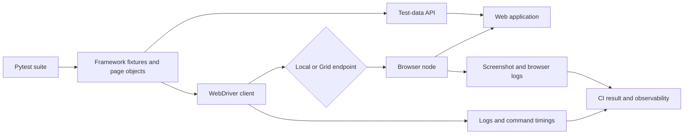
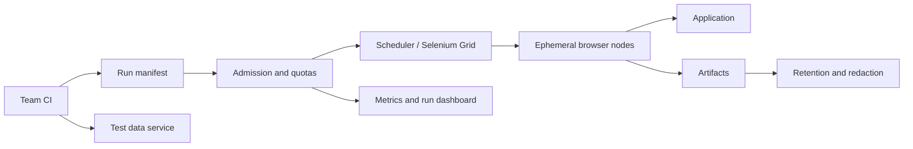
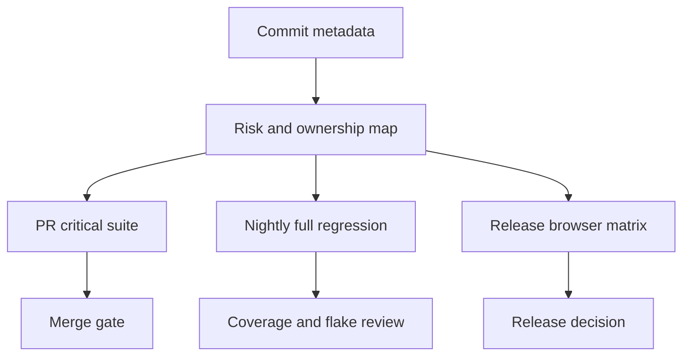
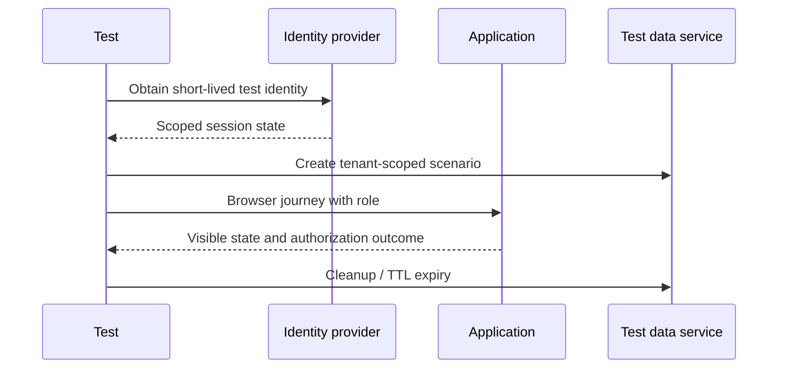

# Python + Selenium — Senior Test Engineer / Test Architect Interview Guide

## 1. Interview Expectations at 15+ Years

A senior candidate should build reliable browser tests and explain where Selenium belongs among unit, API, component, and end-to-end checks. A Lead should standardize fixtures, locators, test data, diagnostics, and suite ownership across teams. A Test Architect should design a secure, observable execution platform with capacity controls, browser/version policy, and measurable reliability. A Staff/Principal candidate should influence product testability and release strategy across organizations while remaining able to debug a WebDriver session or review Python test code.

Interviewers look for evidence: suite size and runtime, flake rate, retry policy, defect detection, maintenance cost, concurrency limits, and a production incident changed by the candidate. Avoid claiming a fixed test-pyramid percentage as universal; select layers from risk, feedback time, and system boundaries.

## 2. Technology Overview

Selenium is a browser automation project centered on WebDriver, a standardized command interface implemented by browser drivers. A Python client sends commands to a local or remote driver; the driver controls a browser and returns results. Selenium Manager can manage drivers and browsers for supported environments, while Selenium Grid routes sessions to remote browser capacity. Selenium is appropriate where browser coverage, existing WebDriver investment, ecosystem compatibility, or remote execution matter. It is not a substitute for API and component tests.

Common failure sources include races between test and application state, unstable locators, shared test data, browser/driver mismatch, session leaks, overloaded Grid nodes, and poor failure evidence. Prefer semantic locators and condition-based explicit waits. Selenium documentation warns against mixing implicit and explicit waits because resulting timeout durations can be unpredictable. [1][2]

## 3. Core Concepts

### WebDriver and session lifecycle
**What:** A client-server protocol for browser commands, with a session and capabilities. **Why:** It separates test code from browser implementation and supports remote execution. **How:** Create options, start a driver session, navigate/interact/assert, capture evidence, and always quit. **Testing:** Verify startup, teardown, capability negotiation, and cleanup after exceptions. **Failure modes:** orphaned sessions, incompatible capabilities, transport timeouts. **Production:** Set bounded session and command timeouts; attach a correlation ID and always release capacity.

### Locators and synchronization
**What:** Locators identify elements; waits synchronize with observable application state. **Why:** Dynamic applications do not become ready merely because navigation returned. **How:** Prefer role/name or stable test IDs when available; use explicit waits for visibility, clickability, or domain state. **Testing:** Exercise delayed render, stale node replacement, and disabled controls. **Failure modes:** positional selectors, broad XPath, fixed sleeps, mixed implicit/explicit waits. **Production:** Treat locator quality as a product testability contract.

### Isolation, fixtures, and data
**What:** Each test receives an independent browser session and controlled data. **Why:** Shared cookies, accounts, or records create order-dependent outcomes. **How:** Use pytest fixtures with reliable teardown; create data through APIs or dedicated setup endpoints, then verify the user-visible workflow in the browser. **Testing:** Randomize order and run in parallel. **Failure modes:** shared mutable account, stale records, cleanup skipped after failure. **Production:** Use tenant-scoped namespaces, expiry/TTL, and idempotent cleanup.

### Grid, parallelism, and evidence
**What:** Grid routes sessions to browser nodes; parallelism shortens feedback but consumes capacity. **Why:** Distributed execution supports cross-browser/platform coverage. **How:** Shard by historical duration and reserve capacity per pipeline. **Testing:** Measure queue time, session startup, node health, and test duration separately. **Failure modes:** saturated nodes, noisy neighbors, video/screenshot storage overload. **Production:** Enforce quotas, back-pressure, and artifact retention.

### Security and authentication
**What:** Tests exercise identity, session, and authorization behavior. **Why:** UI automation can accidentally expose secrets or bypass critical permission paths. **How:** Use least-privilege test identities, short-lived credentials, and API-assisted setup only when the UI behavior under test is not authentication itself. **Testing:** Verify positive and negative role paths, logout, expiry, and tenant boundaries. **Failure modes:** secret leakage in logs/screenshots, reusable shared credentials. **Production:** Secret-store injection, redaction, and isolated test tenants.

## 4. Architecture



The suite owns scenario intent; page/service objects own interaction boundaries; fixtures own lifecycle; test-data services own deterministic setup; Grid owns session placement; CI owns scheduling and result aggregation. Keep business assertions in tests rather than hiding them in page objects. Capture browser, driver, Selenium, OS, test, commit, and environment versions with each run. Do not store credentials or unredacted customer data in artifacts.

## 5. Top 50 Interview Questions

### Q1. How do you decide whether a behavior belongs in a Selenium end-to-end test?
**Difficulty:** Medium | **Stage:** Technical Screen
- **Testing:** Risk-based layer selection and test-oracle clarity.
- **Senior answer:** Use Selenium for a small set of high-value user journeys where browser rendering, client-side behavior, or cross-system integration is part of the risk. Test rules and edge cases at lower layers for faster diagnosis.
- **Architect answer:** Track coverage by business risk and failure mode, not raw UI-test count. Each E2E test should have an owner, data strategy, runtime budget, and evidence path.
- **Scenario:** Validate one purchase path in browser; cover tax permutations through service tests.
- **Follow-ups:** What is the minimum critical journey set? How do you avoid duplicate coverage?
- **Weak answer:** “All requirements should be tested through UI.”
- **Probe / exercise:** For checkout, place payment calculation, authorization, and final confirmation at appropriate layers and justify each.

### Q2. Explain Selenium 4 architecture and a remote session command path.
**Difficulty:** Medium | **Stage:** Technical Deep Dive
- **Testing:** Protocol understanding and ability to debug client/driver/browser boundaries.
- **Senior answer:** Python binding serializes WebDriver commands; the local driver or Grid receives them and controls a browser. A remote session adds routing and node allocation.
- **Architect answer:** Separate session-creation latency, command latency, application latency, and assertion time. Capability negotiation and version metadata are first-class diagnostics.
- **Scenario:** A click timeout may originate in client transport, Grid queueing, browser responsiveness, or an unready application.
- **Follow-ups:** What changes in Grid? Where would you add correlation IDs?
- **Weak answer:** “Selenium directly clicks the browser.”
- **Probe / exercise:** Draw the command path for a remote Chrome session and annotate failure boundaries.

### Q3. How do you choose stable locators for a rapidly changing SPA?
**Difficulty:** Medium | **Stage:** Technical Deep Dive
- **Testing:** Accessibility-aware locator design and product/testability collaboration.
- **Senior answer:** Prefer accessible role and name for user-facing controls, then explicit stable test IDs when semantics are insufficient. Avoid generated classes and positional selectors.
- **Architect answer:** Define a locator policy with component owners; add lint/review checks for brittle patterns. A test ID is a contract, not a reason to make inaccessible UI.
- **Scenario:** A translated checkout changes visible labels, so tests use role/name plus locale-aware fixtures or stable IDs for non-user-visible widgets.
- **Follow-ups:** How do you handle duplicate names? How are test IDs governed?
- **Weak answer:** “Use XPath because it can find anything.”
- **Probe / exercise:** Propose a locator for a save button inside a named dialog and explain strictness.

### Q4. When do you use implicit, explicit, and fixed waits?
**Difficulty:** Medium | **Stage:** Technical Screen
- **Testing:** Synchronization correctness.
- **Senior answer:** Use explicit waits for a specific condition and bounded timeout. Avoid routine fixed sleeps. Keep implicit wait at zero or consistent with the project policy; do not mix implicit and explicit waits because timeout behavior becomes hard to predict.
- **Architect answer:** Wait for business-relevant state, not merely DOM presence; publish timeout categories and actionable messages.
- **Scenario:** A loading overlay disappears before API-backed results settle; wait for the expected result state.
- **Follow-ups:** How do you choose polling and timeout values? Which condition is too weak?
- **Weak answer:** “Add a 10-second sleep after every click.”
- **Probe / exercise:** Write an explicit wait for a result row to become visible.

### Q5. How do you handle stale elements after a React re-render?
**Difficulty:** Medium | **Stage:** Technical Screen
- **Testing:** DOM lifecycle understanding.
- **Senior answer:** A WebElement is a reference to a particular DOM node; after replacement, reacquire it through a locator and wait for the new state. Do not blindly retry a non-idempotent action.
- **Architect answer:** Encapsulate a small, bounded stale-reference recovery only for safe reads; for writes, first establish whether the action occurred to avoid duplicate submission.
- **Scenario:** A payment submit succeeds but confirmation render replaces the button; a retry could double-submit.
- **Follow-ups:** How do you prove the prior click committed? What idempotency key exists?
- **Weak answer:** “Catch every exception and retry.”
- **Probe / exercise:** Describe safe recovery when a click throws after the server may have processed it.

### Q6. What belongs in a Page Object, and what should stay in the test?
**Difficulty:** Medium | **Stage:** Technical Screen
- **Testing:** Maintainable abstraction boundaries.
- **Senior answer:** Page objects expose meaningful user actions and page state, not low-level locator plumbing everywhere. Tests retain scenario intent and business assertions.
- **Architect answer:** Prefer small component objects for reusable regions; avoid a giant base page and avoid page objects that encode workflow policy for every team.
- **Scenario:** Shared navigation belongs in a component; “user cannot approve own refund” stays explicit in the scenario test.
- **Follow-ups:** When would Screenplay help? How do you prevent abstraction drift?
- **Weak answer:** “Put all Selenium code in one BasePage.”
- **Probe / exercise:** Refactor a test with repeated selectors while preserving readable intent.

### Q7. How do pytest fixtures improve browser lifecycle reliability?
**Difficulty:** Medium | **Stage:** Technical Screen
- **Testing:** Fixture scope and deterministic cleanup.
- **Senior answer:** A function-scoped driver fixture starts a clean session and quits in `finally`/fixture teardown. Shared expensive resources should not share mutable browser state across tests.
- **Architect answer:** Make fixture dependencies explicit; separate browser configuration, authenticated state, API data setup, and artifact hooks. Ensure cleanup happens after assertion and setup failures.
- **Scenario:** A test fails during login; teardown still closes the session and saves failure evidence.
- **Follow-ups:** What should be session-scoped? How do xdist workers isolate data?
- **Weak answer:** “Create driver globally once for speed.”
- **Probe / exercise:** Sketch a yield fixture with guaranteed `quit()`.

### Q8. How do you use API-assisted setup without reducing E2E confidence?
**Difficulty:** Medium | **Stage:** Technical Deep Dive
- **Testing:** Test-layer boundary and setup strategy.
- **Senior answer:** Create expensive preconditions via supported APIs, then verify the critical user action and result through the browser. Keep UI login tests for authentication-specific risks.
- **Architect answer:** Validate API setup contract separately, record created entity IDs, and ensure the browser sees the same tenant/identity context.
- **Scenario:** Create a cart with 20 line items through API, then test the final checkout review and submit in UI.
- **Follow-ups:** What if the setup API bypasses business rules? How do you validate eventual consistency?
- **Weak answer:** “API setup means it is not an end-to-end test.”
- **Probe / exercise:** Separate setup assertions from the browser behavior under test.

### Q9. How should authentication state be handled in parallel browser tests?
**Difficulty:** Hard | **Stage:** Technical Deep Dive
- **Testing:** Identity, isolation, and secret management.
- **Senior answer:** Use dedicated users or tenant-scoped identities, obtain short-lived state per worker where possible, and avoid shared mutable accounts. Test login separately when it is the behavior under test.
- **Architect answer:** Integrate with identity provider test tenants and secrets service; rotate credentials and redact storage/cookie artifacts. Include role and tenant claims in diagnostics without exposing tokens.
- **Scenario:** Parallel tests update profile preferences and invalidate each other’s session.
- **Follow-ups:** How do you test expiry? Can a cookie be reused safely?
- **Weak answer:** “Store one admin cookie in the repository.”
- **Probe / exercise:** Design data isolation for 40 workers and three authorization roles.

### Q10. How do you investigate a test that passes locally but fails in CI?
**Difficulty:** Hard | **Stage:** Technical Deep Dive
- **Testing:** Evidence-led debugging.
- **Senior answer:** Compare browser/driver versions, headless mode, viewport, locale, timezone, CPU/memory, network, test order, data collisions, and timing. Use screenshot, logs, and reproducible run metadata.
- **Architect answer:** Classify environment, product, data, synchronization, and test defects; measure retry-adjusted failure separately from first-attempt reliability.
- **Scenario:** CI node is CPU-throttled and animation delays interaction.
- **Follow-ups:** How do you avoid “fixing” the test by inflating timeout? What is the minimal reproducer?
- **Weak answer:** “CI is slower; add waits everywhere.”
- **Probe / exercise:** Given one screenshot and a timeout, list the next three evidence sources you need.

### Q11. How would you classify and manage flaky tests without hiding product defects?
**Difficulty:** Hard | **Stage:** Technical Deep Dive
- **Testing:** Reliability metrics and responsible retry policy.
- **Senior answer:** Detect repeatability by rerunning the same test in a clean isolated environment; classify root cause and create an owner/SLA. Retries are diagnostic data, not a pass substitute.
- **Architect answer:** Report first-attempt pass rate, final pass rate, retry count, quarantine age, and user-risk coverage. Quarantine must not remove sole coverage of a critical journey.
- **Scenario:** A test passes on retry 12% of the time, clustered on one node pool.
- **Follow-ups:** What is an acceptable quarantine time? When does a retry indicate infrastructure failure?
- **Weak answer:** “Set retry count to three and ignore flakes.”
- **Probe / exercise:** Propose flake metrics and a policy for a payment smoke test.

### Q12. How do you handle a click that may have succeeded despite a WebDriver timeout?
**Difficulty:** Hard | **Stage:** Technical Deep Dive
- **Testing:** Distributed command ambiguity and idempotency.
- **Senior answer:** Do not repeat blindly. Query an authoritative UI-visible or API state using a unique transaction reference; retry only if the operation is confirmed absent and safe.
- **Architect answer:** Design application operations with idempotency keys and visible transaction states; capture command timestamps and correlate with server logs.
- **Scenario:** Remote connection drops after “Place order”; the backend created an order but the browser never received response.
- **Follow-ups:** How do you avoid duplicate side effects? What if status is eventually consistent?
- **Weak answer:** “Retry the click until it passes.”
- **Probe / exercise:** Write a decision table for confirmed success, confirmed absence, and unknown outcome.

### Q13. How would you run Selenium tests in parallel with pytest-xdist?
**Difficulty:** Hard | **Stage:** Coding / Deep Dive
- **Testing:** Isolation and concurrency design.
- **Senior answer:** Use per-test sessions, worker-specific data, avoid global driver objects, and bound concurrency based on Grid capacity. Split tests by duration and mark tests that cannot safely parallelize.
- **Architect answer:** Model throughput as session capacity plus app/backend capacity; monitor queue time and downstream load. Parallelize independent tests, not shared mutable workflows.
- **Scenario:** Doubling workers doubles Grid queue time and worsens total suite duration.
- **Follow-ups:** What is the saturation point? How do you shard deterministically?
- **Weak answer:** “More workers always make tests faster.”
- **Probe / exercise:** Identify shared-state hazards in a suite that uses one customer account.

### Q14. How do you design reliable browser downloads and file-upload tests?
**Difficulty:** Hard | **Stage:** Technical Deep Dive
- **Testing:** Browser filesystem behavior and portability.
- **Senior answer:** Configure a known download directory, wait for completion, validate file name/content/checksum, and clean it per test. For uploads, use the file input path rather than OS dialogs where supported.
- **Architect answer:** Keep filesystem paths isolated by worker and avoid relying on timing or platform-specific dialogs. Validate business result in the app as well as file bytes.
- **Scenario:** A CSV export appears before its write completes and a test reads a truncated file.
- **Follow-ups:** How do you test a signed download URL? What data is sensitive in artifacts?
- **Weak answer:** “Sleep five seconds then check file exists.”
- **Probe / exercise:** Define completion criteria beyond file existence.

### Q15. How should JavaScript execution be used in Selenium tests?
**Difficulty:** Hard | **Stage:** Technical Deep Dive
- **Testing:** Correctness of browser interaction and avoiding test bypass.
- **Senior answer:** Use JavaScript for diagnostics or cases where the native WebDriver API lacks a needed browser capability, not to bypass visibility, disabled state, or user interaction constraints.
- **Architect answer:** Mark and review JS helpers; assert the same user-observable behavior and avoid helpers that conceal broken accessibility or event handling.
- **Scenario:** JavaScript clicks a covered button, so the test passes although a real user cannot interact.
- **Follow-ups:** When is script execution justified? How do you distinguish instrumentation from bypass?
- **Weak answer:** “JS click is more stable.”
- **Probe / exercise:** Review a helper that sets an input value directly and explain which events it misses.

### Q16. How do you test frames, windows, tabs, and alerts robustly?
**Difficulty:** Hard | **Stage:** Technical Screen
- **Testing:** Context switching and cleanup.
- **Senior answer:** Wait for the expected frame/window, switch by stable handle or frame locator, perform the action, then restore the original context. Assert alert text before accepting/dismissing.
- **Architect answer:** Hide context switching behind small explicit helpers with timeout diagnostics and ensure failures do not leave subsequent tests in a contaminated context.
- **Scenario:** SSO opens a new tab only under one browser configuration.
- **Follow-ups:** How do you handle multiple matching windows? What if the popup is blocked?
- **Weak answer:** “Switch to the last window and hope.”
- **Probe / exercise:** Describe how you identify the newly created window without relying on handle ordering.

### Q17. What makes a locator policy scalable across multiple teams?
**Difficulty:** Hard | **Stage:** Manager / Technical Deep Dive
- **Testing:** Governance and product collaboration.
- **Senior answer:** Define preferred semantic locators, a documented test-ID convention for gaps, and code review checks. Ask product teams to keep accessibility names meaningful.
- **Architect answer:** Measure locator churn and failure causes; provide linting, component-level helpers, and ownership routes for missing hooks without forcing one universal abstraction.
- **Scenario:** Ten teams independently create selectors for a shared design system.
- **Follow-ups:** Who owns test IDs? How do you avoid coupling app code to one framework?
- **Weak answer:** “The automation team owns all selectors.”
- **Probe / exercise:** Draft a locator acceptance checklist for a reusable dialog component.

### Q18. How do you test authorization, not just authentication, through the browser?
**Difficulty:** Hard | **Stage:** Technical Deep Dive
- **Testing:** Permission boundary coverage.
- **Senior answer:** Test a role matrix for allowed and denied actions, including direct navigation, hidden controls, API response behavior, and cross-tenant access. UI hiding alone is not authorization.
- **Architect answer:** Pair browser tests with API/security tests and derive role cases from policy data; prioritize high-impact privilege escalation paths.
- **Scenario:** A read-only user cannot see “Delete” but can invoke the route directly.
- **Follow-ups:** How do you cover resource-level permissions? How do you avoid brittle role combinatorics?
- **Weak answer:** “Assert the button is not displayed.”
- **Probe / exercise:** Design one positive and two negative cases for a finance approval workflow.

### Q19. How do you test OAuth or SSO flows without making the suite brittle?
**Difficulty:** Hard | **Stage:** Technical Deep Dive
- **Testing:** External dependency boundaries and identity risk.
- **Senior answer:** Keep a focused set of real identity-provider tests; use controlled test tenants and short-lived credentials. For most app journeys, use supported authenticated state setup while separately testing redirect, callback, and error handling.
- **Architect answer:** Contract-test identity integration and monitor provider outages separately from application defects. Never disable certificate or state/nonce validation to simplify automation.
- **Scenario:** IdP rate limiting makes every UI test attempt to log in independently.
- **Follow-ups:** Which flows can be mocked? How do you validate token expiry and revocation?
- **Weak answer:** “Mock the whole login and call auth covered.”
- **Probe / exercise:** Split SSO risks into test layers and explain the evidence for each.

### Q20. What is your approach to cross-browser and responsive coverage?
**Difficulty:** Hard | **Stage:** Technical Deep Dive
- **Testing:** Risk-based compatibility matrix.
- **Senior answer:** Use a representative browser/OS matrix based on actual customer usage and supported policy. Run critical workflows on all supported engines; use focused visual/layout checks at selected viewports.
- **Architect answer:** Separate engine coverage from version coverage; balance cloud-provider cost, release cadence, and failure diagnostics. Track coverage gaps explicitly.
- **Scenario:** A CSS regression affects Safari only on narrow viewport.
- **Follow-ups:** How do you choose versions? What should be smoke versus nightly?
- **Weak answer:** “Run everything in every browser.”
- **Probe / exercise:** Propose a matrix for a B2B application supporting Chromium, Firefox, and WebKit.

### Q21. CI reports a rising timeout rate after a frontend release. How do you investigate?
**Difficulty:** Hard | **Stage:** Technical Deep Dive
- **Testing:** Evidence-driven regression analysis.
- **Senior answer:** Segment by test, locator, browser, environment, commit, and command timing; compare app performance and DOM changes. Check whether the wait condition still represents readiness.
- **Architect answer:** Correlate trace, frontend telemetry, backend request IDs, and deployment version while preserving a control cohort.
- **Scenario:** A skeleton disappears but API errors now leave the page indefinitely loading.
- **Follow-ups:** How do you prove regression versus environment? Which signal is trustworthy?
- **Weak answer:** “Increase global timeout.”
- **Probe / exercise:** Create a triage order for timeout rate, screenshot, console error, and network log.

### Q22. Your full suite takes three hours. Reduce it to twenty minutes without losing meaningful coverage.
**Difficulty:** Very Hard | **Stage:** Architecture
- **Testing:** Optimization under coverage constraints.
- **Senior answer:** Baseline durations, remove duplicate E2E assertions by moving rules to lower layers, parallelize independent tests, optimize setup, and select a risk-based PR subset with full scheduled regression.
- **Architect answer:** Use historical duration-aware sharding, capacity limits, changed-component impact, and critical-path smoke gates. Preserve a periodic broad compatibility run and audit selection misses.
- **Scenario:** 1,200 tests, 10 workers, shared tenant state; naive parallelism makes failures worse.
- **Follow-ups:** How do you prove coverage did not regress? How do you handle flaky tests?
- **Weak answer:** “Use 100 workers and skip slow tests.”
- **Probe / exercise:** Propose stages for PR, merge, nightly, and release.

### Q23. Design test-data management for 1,000+ browser tests.
**Difficulty:** Very Hard | **Stage:** Architecture
- **Testing:** Deterministic, parallel-safe data lifecycle.
- **Senior answer:** Generate data per test or worker through supported APIs, use unique namespaces, and make cleanup idempotent. Seed boundary and invalid data deliberately.
- **Architect answer:** Provide a versioned data service with ownership, TTL, tenancy boundaries, audit trails, and quotas; avoid one giant shared golden environment.
- **Scenario:** Parallel tests race on “latest customer” records.
- **Follow-ups:** How do you keep realistic data? What if cleanup fails?
- **Weak answer:** “Reset the database before every test.”
- **Probe / exercise:** Design lifecycle states for test data from allocation through expiry.

### Q24. How do you stop retries from hiding release-blocking defects?
**Difficulty:** Very Hard | **Stage:** Architecture
- **Testing:** Signal integrity and quality gates.
- **Senior answer:** Preserve first-attempt results and fail/flag unstable critical tests based on explicit policy. Retried pass is not equivalent to deterministic pass.
- **Architect answer:** Gate on risk-weighted stability, severity, and defect evidence; allow infrastructure retry only when a classified platform failure is independently proven.
- **Scenario:** Checkout failure passes on retry after duplicate order creation.
- **Follow-ups:** What retry rate blocks release? Who approves quarantine?
- **Weak answer:** “Retries make CI reliable.”
- **Probe / exercise:** Define status semantics: pass, flaky-pass, infrastructure error, and fail.

### Q25. How do you prove a visual regression is meaningful rather than rendering noise?
**Difficulty:** Hard | **Stage:** Technical Deep Dive
- **Testing:** Visual oracle calibration.
- **Senior answer:** Stabilize viewport, fonts, locale, data, and animation; mask only dynamic regions with explicit justification. Review diffs against component intent and pair with DOM/accessibility assertions.
- **Architect answer:** Establish baseline ownership, approval audit trail, threshold calibration, and critical-region weighting; never blindly update all baselines.
- **Scenario:** A shared font change shifts currency values across dozens of pages.
- **Follow-ups:** How do you test responsive behavior? What should not be masked?
- **Weak answer:** “Set a high pixel threshold until tests pass.”
- **Probe / exercise:** Describe a review policy for a 1.5% screenshot diff on a payment summary.

### Q26. What accessibility checks belong in a Selenium strategy?
**Difficulty:** Hard | **Stage:** Technical Deep Dive
- **Testing:** Accessibility risk and appropriate automation limits.
- **Senior answer:** Automate repeatable checks for names, roles, relationships, keyboard reachability, and common rule violations; complement with manual screen-reader and usability evaluation.
- **Architect answer:** Shift checks to component and CI layers where possible; include assistive-technology/browser combinations for high-risk journeys. Automated scanners do not prove conformance or usability.
- **Scenario:** A checkout button is visually present but inaccessible by keyboard.
- **Follow-ups:** How do you prevent false confidence from a scanner? How do you prioritize findings?
- **Weak answer:** “Run an accessibility plugin once.”
- **Probe / exercise:** Add keyboard-only acceptance criteria to a modal workflow.

### Q27. How do you capture diagnostics while protecting customer and secret data?
**Difficulty:** Hard | **Stage:** Technical Deep Dive
- **Testing:** Observability and privacy-by-design.
- **Senior answer:** Capture screenshot, browser console, test logs, and session metadata on failure; redact secrets and use synthetic data. Restrict access and retention.
- **Architect answer:** Define artifact classification, encryption, access auditing, retention TTL, and redaction tests. Avoid recording every session when risk/cost does not justify it.
- **Scenario:** Video shows a one-time password from an authentication page.
- **Follow-ups:** How do you prove redaction works? What metadata is sufficient to reproduce?
- **Weak answer:** “Keep all screenshots forever for debugging.”
- **Probe / exercise:** Write an artifact policy for a regulated application.

### Q28. How do you distinguish application performance testing from Selenium test timing?
**Difficulty:** Hard | **Stage:** Technical Deep Dive
- **Testing:** Measurement validity.
- **Senior answer:** Browser E2E duration includes grid queue, startup, network, rendering, and test overhead; it is not a controlled performance benchmark. Use dedicated load/performance tools and instrumented measurements.
- **Architect answer:** Use Selenium for user-perceived journey smoke/performance budgets with controlled environments, but prevent it from replacing protocol-level load testing.
- **Scenario:** UI test duration doubles while backend latency is unchanged due to Grid saturation.
- **Follow-ups:** Which timings do you report? How do you isolate client and server time?
- **Weak answer:** “The Selenium run proves the system supports 1,000 users.”
- **Probe / exercise:** Split an observed 30-second journey into measurable components.

### Q29. How do you manage browser and driver versions across local and CI environments?
**Difficulty:** Hard | **Stage:** Technical Deep Dive
- **Testing:** Reproducibility and dependency control.
- **Senior answer:** Pin or record browser images for controlled CI and use Selenium Manager where appropriate for local setup. Capture versions in reports and test supported upgrade paths before rollout.
- **Architect answer:** Maintain tested compatibility lanes and staged browser upgrades. Selenium Manager automates supported driver/browser management, but network, cache, policy, and platform constraints still need explicit handling.
- **Scenario:** A browser auto-update changes headless rendering overnight.
- **Follow-ups:** How do you test upgrade candidates? How are offline agents handled?
- **Weak answer:** “Whatever is installed on the runner is fine.”
- **Probe / exercise:** Define a version rollout from canary to fleet.

### Q30. How would you structure an extensible Python Selenium framework without creating a framework product nobody can change?
**Difficulty:** Very Hard | **Stage:** Architecture
- **Testing:** Abstraction discipline and governance.
- **Senior answer:** Keep a thin shared layer for driver lifecycle, waits, evidence, and conventions. Let teams own test scenarios and small page/components; avoid custom wrappers that merely rename Selenium APIs.
- **Architect answer:** Version shared packages semantically, provide migration paths, compatibility tests, and extension points. Measure adoption and maintenance burden, not number of abstractions.
- **Scenario:** 20 teams need different identity and data setup but share browser platform.
- **Follow-ups:** What belongs in a plugin? How do you deprecate APIs?
- **Weak answer:** “Build a universal framework that supports every possible tool.”
- **Probe / exercise:** Mark responsibilities for core library, team library, and application tests.

### Q31. Design a browser execution platform for 300 engineers and 1,000+ tests.
**Difficulty:** Very Hard | **Stage:** Architecture
- **Testing:** Multi-tenant platform design.
- **Senior answer:** Provide CI templates, shared Python packages, isolated test data, browser matrix, Grid capacity, reports, and failure artifacts.
- **Architect answer:** Separate control plane (admission, scheduling, quotas, metadata) and execution plane (ephemeral browser nodes); isolate teams, secret scopes, network access, and artifact retention. Scale on queue time and session demand, not test count alone.
- **Scenario:** Release traffic creates a morning Grid queue spike.
- **Follow-ups:** How do you prioritize release blockers? How do you prevent one team exhausting capacity?
- **Weak answer:** “Deploy one large Selenium Grid cluster.”
- **Probe / exercise:** Whiteboard admission, session routing, artifact flow, and tenant quotas.

### Q32. Design a test strategy for a high-risk financial workflow with SSO and external payment provider.
**Difficulty:** Very Hard | **Stage:** Architecture
- **Testing:** Risk decomposition and dependency boundaries.
- **Senior answer:** Validate calculations and state transitions at service level; test browser workflow and accessibility; use provider sandbox/contract tests; add limited production-safe synthetic monitoring.
- **Architect answer:** Define authorization and audit invariants, idempotency, synthetic data, PCI-safe artifact policy, failure injection, and release gates tied to business risk.
- **Scenario:** Payment provider intermittently times out after authorization.
- **Follow-ups:** What must be real versus simulated? How do you validate reconciliation?
- **Weak answer:** “Automate the happy path in UI.”
- **Probe / exercise:** Map risks to unit, API, contract, UI, and production layers.

### Q33. How do you test a browser workflow with eventual consistency?
**Difficulty:** Very Hard | **Stage:** Technical Deep Dive
- **Testing:** Asynchronous system semantics.
- **Senior answer:** Wait for an explicit user-visible state with bounded polling and distinguish pending from failed. Avoid arbitrary waits and stale cached assertions.
- **Architect answer:** Align test timeout with the product SLO and expose correlation/operation IDs. Test late, duplicate, and out-of-order completion separately.
- **Scenario:** A submitted report appears in search after 8–25 seconds.
- **Follow-ups:** What if timeout expires but work completes later? Can polling cause load?
- **Weak answer:** “Sleep 30 seconds.”
- **Probe / exercise:** Design state assertions for pending, completed, and failed.

### Q34. How should browser tests cover client-side validation and server-side validation?
**Difficulty:** Hard | **Stage:** Technical Deep Dive
- **Testing:** Layered validation and bypass paths.
- **Senior answer:** Check representative user feedback in browser, but test rule combinations and authoritative server rejection at API/domain layers. Client validation is convenience, not a security boundary.
- **Architect answer:** Derive shared rule cases from contract/specification where practical and test parity; ensure browser tests cover accessibility of error messages.
- **Scenario:** Browser blocks malformed input but a direct request persists it.
- **Follow-ups:** How do you test localization? What if server and UI rules differ intentionally?
- **Weak answer:** “The disabled submit button proves validation.”
- **Probe / exercise:** Specify equivalent UI and API assertions for an invalid tax identifier.

### Q35. What is your approach to browser network interception and service virtualization?
**Difficulty:** Very Hard | **Stage:** Architecture
- **Testing:** Determinism versus realism.
- **Senior answer:** Mock unstable or expensive external dependencies for focused UI behavior tests; maintain separate contract/integration tests against real boundaries. Keep fixtures representative and failure modes explicit.
- **Architect answer:** Version stubs with contracts, label mocked coverage, and prevent accidental fallback to live external systems. Use real integrations for a small, controlled confidence suite.
- **Scenario:** A third-party address service rate-limits CI unpredictably.
- **Follow-ups:** How do you test timeout and malformed response? What risks do mocks hide?
- **Weak answer:** “Mock all network calls so UI tests never fail.”
- **Probe / exercise:** Design one success, timeout, and invalid-schema stub.

### Q36. How would you validate a Selenium Grid deployment before allowing teams to use it?
**Difficulty:** Very Hard | **Stage:** Architecture
- **Testing:** Platform SLOs and operational readiness.
- **Senior answer:** Test session creation, browser capabilities, queueing, node loss, video/artifacts, cleanup, and concurrency across supported browsers.
- **Architect answer:** Set SLOs for admission-to-session latency, successful session allocation, command reliability, and artifact availability. Load-test realistic session profiles and exercise upgrade/rollback.
- **Scenario:** Sessions start but nodes leak after client cancellation.
- **Follow-ups:** How do you simulate node loss? What is the capacity recovery policy?
- **Weak answer:** “A sample test passed, so Grid is ready.”
- **Probe / exercise:** Draft platform acceptance criteria and failure drills.

### Q37. What changes when scaling from 10 to 100 to 1,000 parallel tests?
**Difficulty:** Very Hard | **Stage:** Architecture
- **Testing:** Capacity, contention, and economic reasoning.
- **Senior answer:** At 10, isolate tests and measure startup. At 100, manage Grid queues, app/backend load, and data collisions. At 1,000, add admission control, quotas, sharding, ephemeral capacity, and artifact lifecycle.
- **Architect answer:** Model bottlenecks across browser CPU/memory, Grid, identity provider, database, network, and test-data service. More workers can worsen feedback when a downstream system saturates.
- **Scenario:** 1,000 sessions cause shared staging database lock contention.
- **Follow-ups:** Which bottleneck do you scale first? How do you keep tests representative?
- **Weak answer:** “Add nodes until runtime drops.”
- **Probe / exercise:** Sketch a load/capacity model and the first three metrics to collect.

### Q38. How do you make test execution resilient to Grid or browser-node failure?
**Difficulty:** Very Hard | **Stage:** Architecture
- **Testing:** Fault handling and correct status semantics.
- **Senior answer:** Fail fast on confirmed platform outage, retry session allocation only within bounded policy, and preserve original failure evidence. Do not retry an uncertain business action.
- **Architect answer:** Health checks, circuit breakers, queue back-pressure, node draining, and failure-domain-aware routing; classify platform errors separately from application failures.
- **Scenario:** Node dies mid-submit and operation outcome is unknown.
- **Follow-ups:** How do you recover state? What should CI report?
- **Weak answer:** “Restart all tests automatically.”
- **Probe / exercise:** Build a failure decision tree for before-session, read, and side-effect command failures.

### Q39. How do you govern framework changes across teams without blocking delivery?
**Difficulty:** Architect | **Stage:** Director / Architecture
- **Testing:** Adoption, compatibility, and technical leadership.
- **Senior answer:** Provide documented defaults, examples, support channels, and clear ownership. Use opt-in previews before mandatory adoption.
- **Architect answer:** Publish versioned contracts, deprecation windows, migration tooling, security policy, and measurable adoption outcomes. Governance should focus on risk and interoperability, not central approval of every test.
- **Scenario:** A shared wait helper change breaks 12 teams.
- **Follow-ups:** How do you stage rollout? Who owns exceptions?
- **Weak answer:** “Force everyone onto the latest main branch.”
- **Probe / exercise:** Draft an API deprecation and migration plan.

### Q40. How do you measure whether browser automation is delivering business value?
**Difficulty:** Architect | **Stage:** Manager / Director
- **Testing:** Outcome-oriented engineering metrics.
- **Senior answer:** Track feedback latency, escaped defects in covered journeys, first-attempt reliability, maintenance effort, and release confidence. Avoid counting scripts as value.
- **Architect answer:** Tie test investment to risk reduction and decision quality; include false failures, capacity cost, and time-to-diagnosis. Compare before/after with a defined baseline.
- **Scenario:** Script count grows 40% but releases remain equally risky and slower.
- **Follow-ups:** How do you attribute prevented defects? What metric can be gamed?
- **Weak answer:** “We automated 80% of cases.”
- **Probe / exercise:** Create a compact scorecard for a quarterly quality review.

### Q41. A test fails only on Firefox in Grid. Walk through production-grade triage.
**Difficulty:** Hard | **Stage:** Production Debugging
- **Testing:** Cross-browser diagnosis.
- **Senior answer:** Reproduce with pinned browser/driver, compare capability and viewport, inspect screenshot/console/network, and isolate app versus browser behavior.
- **Architect answer:** Check node image, fonts, proxy, resource pressure, and browser support policy; attach exact versions and session ID to defect.
- **Scenario:** A date picker behaves differently due to locale defaults.
- **Follow-ups:** When is browser-specific handling justified? How do you prevent local-only fixes?
- **Weak answer:** “Skip Firefox.”
- **Probe / exercise:** List evidence needed before assigning the bug to browser or product.

### Q42. Grid queue time rises while test duration stays flat. Diagnose it.
**Difficulty:** Hard | **Stage:** Production Debugging
- **Testing:** Platform observability.
- **Senior answer:** Inspect requested versus available slots, node health, session duration/leaks, scheduler queues, and concurrency spikes. Compare by browser/capability.
- **Architect answer:** Separate demand forecast from capacity, identify noisy tenants, and apply quotas/back-pressure or autoscaling. Validate that browser startup is not blocked by image pulls or downloads.
- **Scenario:** CI retries multiply demand during an outage.
- **Follow-ups:** What is a useful queue SLO? How do you avoid scaling on useless retry load?
- **Weak answer:** “Restart Grid.”
- **Probe / exercise:** Propose dashboard panels and alert thresholds.

### Q43. A test passes after retry but intermittently creates duplicate records. What now?
**Difficulty:** Very Hard | **Stage:** Production Debugging
- **Testing:** Side-effect safety and release response.
- **Senior answer:** Stop blind retry; inspect operation IDs and backend state, determine whether the command committed, and repair test data. Treat duplicate creation as a product or test safety defect.
- **Architect answer:** Introduce idempotency keys, explicit operation states, and retry classes. Preserve first-attempt and duplicate-side-effect metrics.
- **Scenario:** WebDriver times out after submit, then test repeats action.
- **Follow-ups:** How do you distinguish retry by client from user double-click? How to prevent recurrence?
- **Weak answer:** “Increase the timeout and rerun.”
- **Probe / exercise:** Write the safe retry contract for a create operation.

### Q44. CI screenshots are blank, but the browser test reports a failure. Investigate.
**Difficulty:** Hard | **Stage:** Production Debugging
- **Testing:** Artifact pipeline diagnostics.
- **Senior answer:** Check capture timing, browser process/session status, artifact upload permissions, file size, and whether the page crashed. Capture a local artifact in the same runner image.
- **Architect answer:** Monitor artifact success independently from test success; provide fallback DOM snapshot/console and correlation metadata while applying retention and privacy rules.
- **Scenario:** Container terminates before asynchronous upload completes.
- **Follow-ups:** How do you preserve evidence on worker crash? What data must be scrubbed?
- **Weak answer:** “The screenshot plugin is broken.”
- **Probe / exercise:** Create a resilient artifact lifecycle with upload acknowledgement.

### Q45. A test suite became slower after moving to headless mode. Why might that happen?
**Difficulty:** Hard | **Stage:** Production Debugging
- **Testing:** Browser environment and performance diagnosis.
- **Senior answer:** Headless is not inherently faster; inspect CPU/GPU settings, viewport, browser version, resource contention, screenshots/video, and test concurrency. Compare same workloads under controlled conditions.
- **Architect answer:** Benchmark queue, startup, app response, and browser rendering separately; choose mode based on supported production behavior rather than assumed speed.
- **Scenario:** Headless container lacks shared memory and suffers renderer instability.
- **Follow-ups:** What changes could hide real UI defects? How do you tune container resources?
- **Weak answer:** “Headless should always be faster.”
- **Probe / exercise:** Define an A/B benchmark plan.

### Q46. How would you design an organization-wide Selenium quality platform with security and governance?
**Difficulty:** Architect | **Stage:** Architecture
- **Testing:** Sociotechnical platform design.
- **Senior answer:** Standardize supported library, fixture patterns, browser versions, reporting, and security handling while keeping teams responsible for product scenarios.
- **Architect answer:** Provide isolated execution tenancy, policy-as-code, short-lived secrets, artifact controls, SBOM/dependency scanning, quotas, and self-service templates. Establish service ownership and SLOs.
- **Scenario:** Hundreds of engineers need regulated and non-regulated environments.
- **Follow-ups:** How are exceptions handled? What is centrally operated versus team-owned?
- **Weak answer:** “Create a shared framework and require everybody to use it.”
- **Probe / exercise:** Define platform contract and two governance metrics.

### Q47. When would you keep Selenium instead of migrating to another browser tool?
**Difficulty:** Architect | **Stage:** Architecture
- **Testing:** Migration decision quality.
- **Senior answer:** Keep it when current coverage, browser support, Grid investment, team skills, and reliability meet needs. Migrate only for measurable capability or maintenance gains.
- **Architect answer:** Compare total cost: migration, dual-run, ecosystem, browser matrix, diagnostics, and vendor dependence. Use a pilot on representative tests and preserve protocol-level requirements.
- **Scenario:** A team proposes migration solely because another tool has auto-waiting.
- **Follow-ups:** What evidence would justify migration? How do you de-risk coexistence?
- **Weak answer:** “Selenium is old, so replace it.”
- **Probe / exercise:** Build a decision matrix for a 2,000-test estate.

### Q48. How do WebDriver BiDi capabilities change browser diagnostics and network testing?
**Difficulty:** Architect | **Stage:** Technical Deep Dive
- **Testing:** Current protocol awareness and maturity judgment.
- **Senior answer:** BiDi adds bidirectional event communication over WebSocket for browser events such as logs and network activity; Selenium documents emerging logging, network, and script features. Check browser and binding support before depending on it. [3]
- **Architect answer:** Adopt behind capability checks and a compatibility layer; do not treat evolving coverage as uniform across browsers. Use BiDi where event streaming improves diagnosis or controlled interception.
- **Scenario:** Need console and network evidence without polling browser logs.
- **Follow-ups:** How does it compare with CDP? What fallback is needed?
- **Weak answer:** “BiDi is fully supported everywhere now.”
- **Probe / exercise:** Define a cross-browser capability fallback strategy.

### Q49. How do you test a critical journey when the external dependency is unavailable or nondeterministic?
**Difficulty:** Architect | **Stage:** Architecture
- **Testing:** Confidence decomposition and resilience.
- **Senior answer:** Test app behavior using deterministic stubs, contract-check the external boundary, and run a small controlled real integration suite. Cover timeout, malformed response, and recovery.
- **Architect answer:** Keep test results attributable to dependency health versus product behavior; use circuit-breaker behavior and production synthetic checks where appropriate.
- **Scenario:** Tax provider has a planned outage during release validation.
- **Follow-ups:** Which gate should block release? What evidence supports degraded mode?
- **Weak answer:** “Mock it all and assume production works.”
- **Probe / exercise:** Specify confidence evidence from stub, contract, integration, and monitoring.

### Q50. Tell me about a browser automation architecture decision you reversed and how you proved the replacement was better.
**Difficulty:** Architect | **Stage:** Manager / Director
- **Testing:** Ownership, learning, influence, and measurable outcomes.
- **Senior answer:** State the initial constraint, decision, observed failure mode, alternatives, migration, and measured outcome. Be precise about personal contribution and residual risk.
- **Architect answer:** Include impact on teams, costs, reliability, accessibility, and operating model; explain how the new approach was piloted and rolled back safely.
- **Scenario:** A centralized page-object library created bottlenecks; teams moved to thin shared primitives and owned components.
- **Follow-ups:** What evidence changed your mind? What would you retain?
- **Weak answer:** “We adopted the latest framework and it was better.”
- **Probe / exercise:** Prepare a five-minute architecture decision record from a real experience.

## 6. Scenario-Based Interview Questions

### Scenario 1: Three-hour regression must fit a 20-minute pull-request gate
**Assumptions:** 1,200 tests; multiple services; release requires broad browser confidence. **Approach:** Establish duration and failure baselines; identify duplicate business-rule coverage; move combinatorial checks down-layer; maintain a compact critical journey suite; duration-balance shards; retain scheduled full matrix. **Investigate:** Queue time, setup time, slow tests, flake retries, shared data. **Likely causes:** serial fixtures, global account contention, expensive login, Grid saturation. **Solution/trade-off:** Faster PR gate plus nightly breadth; risk is selection misses, mitigated through change-impact audit and periodic full runs. **Automation:** Historical sharding, test tags, changed-component mapping. **Follow-ups:** What blocks merge? How is reduced coverage measured?

### Scenario 2: Tests pass locally but fail on CI only
**Assumptions:** Same commit, CI uses containers and remote Grid. **Approach:** Capture full environment tuple; compare browser, viewport, timezone, locale, network, CPU, data, order, and concurrency. **Investigation:** Re-run isolated and in suite; inspect screenshot/console/network/session logs. **Root causes:** resource starvation, shared account, timing race, version drift, proxy. **Solution/trade-off:** Reproduce in CI image and fix the cause; avoid broad sleeps. **Automation:** Attach versions and test-data IDs to each result. **Follow-ups:** Which CI-only change is least invasive to test?

### Scenario 3: A submit command times out and outcome is unknown
**Assumptions:** Server may have committed the transaction. **Approach:** Stop the test from repeating side effects; query state by unique operation reference. **Investigation:** Correlate client command time with server audit and operation ID. **Root causes:** response lost, Grid node crash, backend slowness, actual rejection. **Solution/trade-off:** Idempotency key, operation status, bounded recovery. **Automation:** Add explicit unknown-outcome test. **Follow-ups:** What is safe to retry?

### Scenario 4: Role-based user accesses a forbidden record by direct URL
**Assumptions:** UI hides the control but API authorization may be weak. **Approach:** Test direct navigation, UI affordance, API boundary, and tenant/resource ownership. **Investigation:** Inspect identity claims, route, server audit, and response. **Root cause:** authorization enforced only client-side. **Solution/trade-off:** Server-side policy enforcement with deny-by-default; avoid relying on UI state. **Automation:** Policy-derived negative matrix. **Follow-ups:** How to avoid combinatorial roles?

### Scenario 5: Grid queue grows after enabling retries
**Assumptions:** Retry-on-failure enabled globally. **Approach:** Measure arrival rate, queue, session duration, node health, retry volume. **Investigation:** Compare first attempt and retry causes; inspect outage correlation. **Root cause:** retries amplify load during node instability. **Solution/trade-off:** classify retryable platform errors, circuit-break and cap retries. **Automation:** Retry budget and queue SLO alert. **Follow-ups:** What is the difference between retry and rerun?

### Scenario 6: Firefox-only date entry failure
**Assumptions:** Browser matrix is supported. **Approach:** Pin versions and locale; compare DOM, input type, keyboard behavior, screenshot, console. **Investigation:** Verify native date control behavior and app parsing. **Root cause:** locale/timezone or browser implementation difference. **Solution/trade-off:** Use accessible interaction and explicit locale; avoid browser-specific JS injection unless documented. **Automation:** Cross-browser contract case. **Follow-ups:** Is the expected date locale-dependent?

### Scenario 7: Visual snapshots show broad diffs after a font deployment
**Assumptions:** Baselines were stable. **Approach:** Confirm font resource loaded, viewport and DPR, compare component diffs and business-critical alignment. **Root cause:** intended font change or failed font fallback. **Solution/trade-off:** Approve reviewed baseline changes, mask only justified volatile regions. **Automation:** Font readiness check and baseline owner review. **Follow-ups:** Which diffs indicate functional risk?

### Scenario 8: Download test intermittently reads an incomplete export
**Assumptions:** File appears before write completion. **Approach:** Wait for browser download completion or stable file size and validate content/checksum. **Investigation:** Correlate export job state, filesystem, and network response. **Root cause:** race or asynchronous export still running. **Solution/trade-off:** assert user-visible completed state then file integrity. **Automation:** Worker-scoped directories with cleanup. **Follow-ups:** How do you test large exports?

### Scenario 9: Shared account causes order-dependent failures
**Assumptions:** Tests mutate profile/cart state. **Approach:** Prove order dependence by randomized execution and worker isolation. **Root cause:** shared mutable identity/data. **Solution/trade-off:** worker/test-scoped accounts or API-created tenant state; extra provisioning cost. **Automation:** Unique IDs, TTL, state reset verification. **Follow-ups:** Which state can safely be shared?

### Scenario 10: Screenshots contain regulated data
**Assumptions:** Existing CI artifacts are broadly readable. **Approach:** Restrict exposure immediately, identify artifact scope/retention, redact or purge per policy. **Root cause:** production-like data and unrestricted evidence collection. **Solution/trade-off:** synthetic data, redaction, encryption, least-privilege access, shorter retention; retain enough diagnostics. **Automation:** Secret/PII scanning and artifact-policy tests. **Follow-ups:** How do you prove redaction does not hide relevant failures?

## 7. System Design / Test Architecture

### Design A: Browser platform for 300 engineers
**Problem/requirements:** Self-service, isolated, multi-browser runs, auditable artifacts, predictable PR feedback. **Assumptions:** CI is the scheduler; browser nodes can be ephemeral.

**Proposed architecture:** CI templates submit a run manifest to admission control; scheduler applies tenant quotas and browser capabilities; Grid routes sessions to ephemeral nodes; data service allocates isolated entities; artifacts stream to encrypted storage; results enter a dashboard.



**Test strategy:** Platform contract tests, capability matrix, node-loss and saturation tests, tenant isolation, artifact ACL tests. **Automation:** Reusable pytest plugin with thin configuration. **Scalability/performance:** Scale on queue depth and session demand; cap retries. **Reliability/failure:** drain unhealthy nodes, preserve unknown outcomes, back-pressure admission. **Observability:** queue latency, allocation success, session leaks, command error rate, artifact availability. **Security:** short-lived secrets, egress policy, tenant isolation. **Cost:** autoscale ephemeral nodes and retain artifacts by risk. **Trade-offs:** central consistency vs local team autonomy. **Alternative:** managed cloud browser service. **Follow-ups:** What is the Grid SLO? What is the isolation boundary?

### Design B: 3-hour regression to 20-minute gate
**Problem/requirements:** Reduce PR latency without eliminating business-risk coverage. **Assumptions:** Existing suite has duration and result history.

**Proposed architecture:** Instrument tests; classify by risk/layer; optimize setup and shard; run smoke on PR, full suite nightly, expanded cross-browser on release; compare missed-defect and escaped-defect signals.



**Test strategy:** Preserve critical flows and lower-level breadth. **Automation:** duration-aware sharding, test selection audit. **Scalability:** Scale only independent work. **Performance:** Optimize setup, queue, and slowest shard. **Reliability:** First-attempt metrics, retry budgets. **Observability:** Runtime by stage and test. **Security:** Gate secrets by environment. **Cost:** balance parallelism with cloud spend. **Trade-offs:** faster feedback risks selection gaps; mitigate with nightly/release breadth. **Alternative:** split suite by service. **Follow-ups:** How prove selection safety?

### Design C: Authentication and test identity
**Problem/requirements:** Exercise SSO and authorization without logging every test through a slow external identity system. **Proposed architecture:** dedicated IdP sandbox; focused real SSO tests; short-lived worker identities; authenticated state fixture for unrelated workflows; role/resource matrix from policy source.



**Test strategy:** Real redirect/callback, expiry, logout, negative access; API authorization checks. **Automation:** isolated workers and token redaction. **Scalability:** identity-provider rate limits. **Reliability:** sandbox outage classification. **Observability:** correlation IDs, auth outcome codes. **Security:** least privilege and ephemeral secrets. **Cost/trade-off:** realistic identity coverage versus test speed. **Alternative:** service-issued signed test sessions restricted to non-production. **Follow-ups:** How test revocation?

### Design D: Failure diagnostics and privacy
**Problem/requirements:** Reproducible failures without leaking credentials or user data. **Proposed architecture:** collect metadata, console, screenshot, and optional video; redact at capture/upload; encrypt artifacts; policy-based retention and access.

**Test strategy:** Inject secret/PII into test page and prove artifacts redact it while preserving useful evidence. **Automation:** artifact hooks run after failure and worker termination. **Scalability:** object lifecycle and storage cost. **Reliability:** acknowledgement and fallback upload. **Observability:** capture/upload success. **Security:** ACL audit and retention. **Trade-offs:** video improves diagnosis but increases exposure and cost. **Alternative:** on-demand rerun with restricted capture. **Follow-ups:** What data is the minimum reproducibility set?

### Design E: Cross-browser compatibility strategy
**Problem/requirements:** Cover supported browser engines and responsive layouts within budget. **Proposed architecture:** critical journey smoke across engines; focused compatibility tests per feature; full matrix scheduled on stable releases; pinned candidate browser lane before rollout.

**Test strategy:** Browser-specific controls, keyboard/accessibility, locale, viewport, downloads, and visual behavior. **Automation:** capability profiles and version metadata. **Scalability:** distribute matrix by risk and change. **Performance:** avoid Cartesian product of every test and version. **Reliability:** browser-specific quarantines only with owner and expiry. **Observability:** outcome by engine/version. **Security:** only approved images/extensions. **Cost:** prioritize customer usage. **Trade-offs:** broad coverage vs runtime. **Alternative:** managed cross-browser service. **Follow-ups:** What would make you add a browser to every PR?

## 8. Hands-On Exercises

### Exercise 1: Explicit wait and resilient assertion
**Problem:** Wait for an order status to become `Confirmed` without a fixed sleep. **Input:** order number and status element. **Expected output:** pass on confirmed; useful timeout otherwise.
```python
from selenium.webdriver.common.by import By
from selenium.webdriver.support import expected_conditions as EC
from selenium.webdriver.support.ui import WebDriverWait


def wait_for_order_status(driver, order_number: str, timeout: int = 15) -> str:
    locator = (By.CSS_SELECTOR, f'[data-order="{order_number}"] [data-testid="status"]')
    element = WebDriverWait(driver, timeout, poll_frequency=0.25).until(
        EC.visibility_of_element_located(locator)
    )
    return element.text.strip()
```
**Explanation:** The wait is bounded and state-specific. In production, avoid interpolating untrusted selector text; use a safer stable lookup pattern if IDs are uncontrolled. **Complexity:** Polling cost is bounded by timeout and frequency. **Follow-up:** How would you handle stale replacement?

### Exercise 2: Driver lifecycle fixture
**Problem:** Guarantee session cleanup after test failure.
```python
import pytest
from selenium import webdriver


@pytest.fixture
def driver():
    options = webdriver.ChromeOptions()
    options.add_argument("--headless=new")
    browser = webdriver.Chrome(options=options)
    browser.set_window_size(1440, 1000)
    try:
        yield browser
    finally:
        browser.quit()
```
**Expected output:** Each test receives and closes its own session. **Production considerations:** Add remote URL/configuration, bounded timeouts, and failure artifact hooks. **Follow-up:** What changes for Grid and parallel workers?

### Exercise 3: Safe form submission with ambiguous outcome
**Problem:** Prevent duplicate create action after timeout. **Input:** unique client reference. **Expected output:** one record or a clear unknown state, never an unverified second submit. **Solution:** Submit once; wait for confirmation; on timeout query by reference through an authoritative API; retry only if absence is confirmed and operation is idempotent. **Complexity:** One browser interaction plus bounded status lookup. **Production:** Correlate request and audit IDs. **Follow-up:** What if status is eventually consistent?

### Exercise 4: Diagnose brittle page-object design
**Problem:** Review code that uses `time.sleep(10)`, index-based XPath, catches all exceptions, and clicks with JavaScript. **Expected output:** identify timing, selector, and false-positive risks. **Solution:** use semantic/stable locators, explicit conditions, narrow exception handling, and native interactions; keep assertions in test. **Production:** Add locator ownership and flake reporting. **Follow-up:** Which failure should remain visible rather than retried?

### Exercise 5: Parallel test-data isolation
**Problem:** Create 40 workers that each test an account update. **Input:** worker ID and test run ID. **Expected output:** unique account per worker/test, deterministic cleanup. **Solution:** API setup allocates `run_id + worker_id + test_id`, fixture stores resource ID, teardown deletes idempotently or TTL expires. **Complexity:** O(number of tests) provisioning. **Production:** Enforce quotas and cleanup monitoring. **Follow-up:** How do you share immutable reference data safely?

## 9. Production Debugging Playbook

1. **CI-only timeout:** Symptom: wait failure in CI. Investigate exact browser, Grid node, viewport, commit, logs, network, and resource pressure. Hypotheses: race, overload, data collision. Evidence: trace timeline and server request IDs. Root cause: state wait was weaker than SPA readiness. Fix: wait for domain state. Prevention: testability contract. Monitor first-attempt reliability and timeout category.
2. **Grid session leak:** Symptom: queue grows despite low test count. Investigate active sessions, client disconnects, node cleanup. Hypotheses: missing `quit()`, worker crash, stale Grid registration. Evidence: session age and node logs. Root cause: teardown not guaranteed on setup exception. Fix: fixture `finally` plus node TTL. Prevention: crash tests. Monitor active-session age.
3. **Duplicate transaction:** Symptom: duplicated order after retry. Investigate transaction reference and command timeline. Hypotheses: click committed but response lost. Evidence: backend audit proves first action succeeded. Root cause: unsafe action retry. Fix: idempotency reference and status query. Prevention: retry classification. Monitor duplicate side effects.
4. **Firefox-specific failure:** Symptom: date selection fails in one engine. Investigate exact versions, locale, input type, console, and rendered state. Root cause may be locale parsing or browser-specific behavior. Fix: correct user-level interaction or product defect. Prevention: targeted compatibility tests. Monitor failure rate by browser/version.
5. **Artifact contains secrets:** Symptom: screenshot/video leaks a credential. Investigate access logs and retention immediately. Root cause: unredacted auth flow or production-like data. Fix: restrict/purge artifacts, rotate exposed credentials, add redaction. Prevention: synthetic secrets and artifact scanning. Monitor scan failures and access events.

## 10. Architect-Level Trade-offs

| Decision | Option A | Option B | Choose A when | Choose B when | Trade-off |
|---|---|---|---|---|---|
| Browser execution | Local browser | Grid/cloud | Developer feedback or small suite | Parallel/cross-platform demand | Grid adds queue and operational cost |
| Synchronization | Explicit state wait | Fixed sleep | Almost all application state | Rare external timing workaround | Sleep is slow and fragile |
| Test setup | UI setup | API-assisted setup | Setup itself is the behavior under test | Large or expensive preconditions | API setup needs independent contract coverage |
| Isolation | New account per test | Shared account | Mutating or parallel workflows | Read-only immutable scenarios | Isolation costs provisioning |
| Browser versions | Pinned images | Floating latest | Reproducible release gates | Early compatibility discovery | Pinned can lag; floating can destabilize |
| Evidence | Screenshot only | Video/trace/log bundle | Low-risk/simple apps | Complex intermittent failures | Rich evidence costs storage/privacy |
| Retry policy | No retry | Classified bounded retry | Deterministic signal required | Known transient infrastructure faults | Retry can mask defects or amplify load |

## 11. 10 Questions That Expose Surface-Level 15+ Year Experience

1. What was your largest Selenium suite, and how did you measure first-attempt reliability?
2. Which production defect escaped because the UI suite asserted the wrong state?
3. What was the slowest test bottleneck, and what evidence isolated it?
4. How did you prevent retries from duplicating a business operation?
5. Which browser automation did you deliberately not build, and why?
6. What framework abstraction did you remove after teams adopted it?
7. How did you handle secrets and regulated data in screenshots or videos?
8. What was your Grid saturation point, and what metric showed it?
9. Which compatibility issue required a product change rather than a test workaround?
10. What architecture decision did you reverse, and what measured evidence changed your mind?

## 12. Top 10 Must-Master Questions

| Question | Why it matters | Weak answer | Strong answer covers | Likely follow-up |
|---|---|---|---|---|
| Q1 layer choice | Cost and signal | “Everything in UI” | Risk, layer, diagnosis | What remains E2E? |
| Q4 waits | Flake root cause | Fixed sleeps | State-based bounded wait | How set timeout? |
| Q11 flaky tests | Trust in gates | Retry only | First-attempt reliability, RCA | When quarantine? |
| Q12 ambiguous action | Duplicate side effects | Click again | Idempotency and state query | Eventual consistency? |
| Q22 suite runtime | Delivery speed | Add workers | Layering, sharding, capacity | Prove coverage? |
| Q31 platform design | Scale | One Grid | Control/execution planes | Tenant isolation? |
| Q18 authorization | Security | Hide button | Server-side access tests | Cross-tenant access? |
| Q27 privacy evidence | Compliance | Save everything | Redaction, access, retention | Prove redaction? |
| Q48 BiDi | Current protocol depth | Assume universal | Capability maturity and fallback | CDP differences? |
| Q50 decision reversal | Genuine ownership | Buzzwords | Evidence, trade-off, outcome | What changed your mind? |

## 13. One-Day Revision Plan

| Time | Activity |
|---|---|
| 08:30–09:30 | Explain WebDriver, session lifecycle, and test-layer choice aloud |
| 09:30–11:00 | Implement fixture, explicit wait, stable locator, and cleanup |
| 11:15–12:30 | Whiteboard Grid platform and 300-engineer governance |
| 13:15–14:15 | Work through auth, data isolation, and retry scenarios |
| 14:15–15:15 | Triage CI-only and cross-browser failures from evidence |
| 15:30–16:30 | Design 20-minute PR suite with nightly/release coverage |
| 16:30–17:30 | Answer Q1–Q50 in random order; record weak points |
| 17:30–18:00 | Review cheat sheet and articulate one real architecture decision |

Use active recall: answer before reading, then score specificity, evidence, trade-offs, and follow-up readiness.

## 14. Night-Before-Interview Cheat Sheet

- WebDriver is a client/driver/browser protocol path; remote Grid adds routing and node capacity.
- Prefer semantic locators; wait for the state the user needs, not a fixed duration.
- Do not mix implicit and explicit waits casually.
- `quit()` belongs in guaranteed teardown.
- Retry reads cautiously; never blindly retry ambiguous side effects.
- Isolate browser sessions and mutable test data.
- Separate UI journey confidence from API, contract, and load testing.
- Measure first-attempt pass rate, queue time, runtime, triage time, and escaped risk.
- Capture versioned evidence; redact secrets and regulate retention.
- Selenium Manager simplifies supported driver/browser setup; verify offline and pinned CI requirements.
- Treat WebDriver BiDi as capability-dependent; plan cross-browser fallback.

## 15. Interview Cheat Sheet

| Concern | Pattern | Common trap |
|---|---|---|
| Locator | role/name, then governed test ID | generated CSS classes |
| Wait | bounded explicit wait on domain state | global sleep |
| Session | function-scoped fixture and guaranteed quit | global driver |
| Setup | API creates state; UI validates user journey | UI setup for every record |
| Flake | classify, measure first attempt, own fix | hide with retries |
| Parallelism | unique data + capacity-aware workers | shared account |
| Security | short-lived secrets, redaction, TTL | commit storage state |
| Grid | monitor queue, allocation, session leaks | scale nodes without bottleneck diagnosis |
| Diagnostics | screenshot + logs + version + correlation | screenshot without context |
| BiDi | capability gate and fallback | assume identical browser support |

## 16. Senior vs Lead vs Test Architect

| Capability | Senior Engineer | Lead | Test Architect |
|---|---|---|---|
| Coding | Reliable pytest/Selenium tests | Reusable conventions | Stable extension contracts |
| Testing | Risk-based scenarios | Coverage ownership | Portfolio-level risk model |
| Debugging | Diagnoses local failure | Coordinates team RCA | Improves platform and product observability |
| Scale | Parallelizes safely | Balances team demand | Designs quotas, scheduling, capacity and SLOs |
| Security | Handles credentials safely | Enforces team practice | Defines identity/artifact governance |
| Leadership | Delivers features | Mentors and standardizes | Aligns platform, product, security, and operations |

A Mid-Level answer names Selenium features; a Senior explains implementation and evidence; a Lead standardizes safe team practice; an Architect defends system-wide trade-offs; Staff/Principal influence product testability and engineering strategy across boundaries.

## 17. Interviewer Scorecard

Rate each competency with evidence and a follow-up, not one blended score.

| Competency | Evidence to seek |
|---|---|
| WebDriver fundamentals | Correct client/driver/browser/Grid path |
| Python and pytest | Fixture isolation and reliable teardown |
| Locator/wait strategy | Semantic selectors and explicit state waits |
| Test architecture | Layer choice, maintainability, ownership |
| Test data/auth | Parallel isolation and least privilege |
| Debugging | Reproducible evidence and root-cause reasoning |
| Performance/scale | Queue, capacity, and downstream bottleneck awareness |
| Security/privacy | Secret and artifact protection |
| CI/CD | Useful gates, retry semantics, observability |
| Leadership/trade-offs | Measured outcomes and candid reversals |

## 18. Final Interview Readiness Checklist

- [ ] Can explain WebDriver, driver, browser, and Grid responsibilities.
- [ ] Can design stable locators and state-based waits.
- [ ] Can write a pytest fixture with guaranteed teardown.
- [ ] Can explain API-assisted setup without overstating E2E coverage.
- [ ] Can isolate authentication and test data across workers.
- [ ] Can diagnose CI-only, Grid, and cross-browser failures from evidence.
- [ ] Can reduce suite time without discarding business-risk coverage.
- [ ] Can explain safe handling of ambiguous side effects and retries.
- [ ] Can whiteboard a platform for 300 engineers.
- [ ] Can discuss privacy, observability, cost, and governance.
- [ ] Can describe a real architecture decision with measured outcomes.

## Sources & Further Reading

1. **Selenium Project**, [Selenium Documentation](https://www.selenium.dev/documentation/), continuously maintained; accessed 2026-10-03. Useful for WebDriver architecture, Selenium Manager, and project components.
2. **Selenium Project**, [Waiting Strategies](https://www.selenium.dev/documentation/webdriver/waits/), continuously maintained; accessed 2026-10-03. Useful for explicit/implicit wait behavior and race-condition guidance.
3. **Selenium Project**, [WebDriver BiDi](https://www.selenium.dev/documentation/webdriver/bidi/), continuously maintained; accessed 2026-10-03. Useful for protocol status, event-driven browser communication, and feature maturity.
4. **Selenium Project**, [Grid](https://www.selenium.dev/documentation/grid/), continuously maintained; accessed 2026-10-03. Useful for remote routing, parallel execution, and cross-platform browser architecture.
5. **Selenium Project**, [Test Practices](https://www.selenium.dev/documentation/test_practices/), continuously maintained; accessed 2026-10-03. Useful for maintainable browser test design.
6. **W3C**, [WebDriver](https://www.w3.org/TR/webdriver/), living standard; accessed 2026-10-03. Useful for protocol and browser automation semantics.
