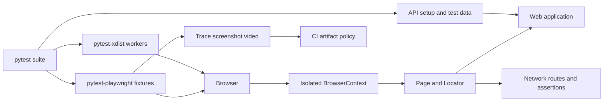
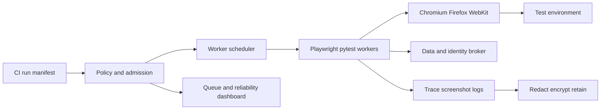
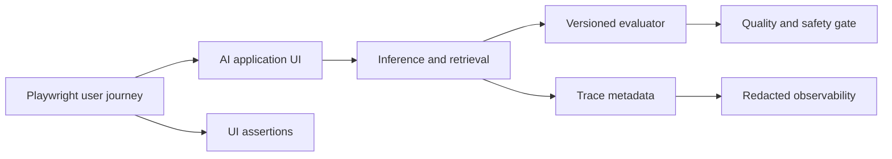

# Python + Playwright — Senior Test Engineer / Test Architect Interview Guide

## 1. Interview Expectations at 15+ Years

A senior candidate should reason about browser state, locator semantics, actionability, isolated contexts, deterministic setup, and useful diagnostics rather than reciting APIs. A Lead should build repeatable pytest conventions and coach product teams to expose accessible interfaces. A Test Architect should select where Playwright fits, govern browser/version policy, data and auth isolation, parallel capacity, artifact privacy, and release signals. Staff/Principal candidates connect platform decisions to customer risk, engineering productivity, and organizational adoption.

Playwright's Python documentation recommends its pytest plugin for end-to-end suites. The plugin provides function-scoped `context` and `page` fixtures, browser selection, and trace/video/screenshot options; `pytest-xdist` can run tests concurrently, but excessive workers can cause unexpected behavior. [1][2] Questions below are synthesized from role needs and official technical documentation, not claims about specific companies' interview scripts.

## 2. Technology Overview

Playwright for Python is a browser automation library supporting synchronous and asynchronous APIs and Chromium, Firefox, and WebKit engines. Its `Browser` manages browser processes; a `BrowserContext` is an isolated session boundary for cookies, storage, permissions, and pages; `Page` is a tab; `Locator` describes how to find elements at action time. Actions perform actionability checks and wait for the element to satisfy them; locators resolving to multiple elements can fail strictness rather than silently choosing one. [2][3]

The framework is valuable for modern web apps, cross-engine tests, network control, and CI diagnostics. It is not a complete substitute for API, contract, accessibility, or performance testing. Typical failures still include bad assertions, shared server-side state, incorrect test expectations, dependency instability, and poor test design; auto-waiting cannot make an incorrect oracle reliable.

## 3. Core Concepts

### Browser, context, page
**What:** Browser process, isolated browser profile, and tab. **Why:** Context isolation is the practical unit for session separation. **How:** Create separate contexts for users or tests, then pages within them. **Testing:** Validate cookies/storage do not leak between contexts. **Failure modes:** Shared context, leaked state, unmanaged browser lifecycle. **Production:** Keep contexts short-lived and isolate server-side test data too.

### Locators, auto-waiting, strictness
**What:** Locators are deferred queries; actions retry relevant actionability checks. **Why:** Dynamic DOMs make cached element references brittle. **How:** Prefer role/name, label, placeholder, or governed test IDs. Click checks include uniqueness, visibility, stability, event reception, and enabled state. **Testing:** Validate duplicate matches fail visibly and actions wait for intended state. **Failure modes:** broad selectors, `force=True`, weak assertions. **Production:** Locator failures are product/testability signals; do not suppress strictness.

### Pytest plugin and async API
**What:** Official plugin supplies browser/context/page fixtures; sync and async Playwright APIs are available. **Why:** Standardized lifecycle and CI execution. **How:** Use plugin fixtures for ordinary pytest suites; use async deliberately when the system/test composition benefits. **Testing:** Validate fixture scope and event-loop ownership. **Failure modes:** mixing sync/async patterns, custom fixture lifecycle leaks. **Production:** Keep one execution model per suite unless a justified boundary exists.

### Network, API setup, and mocking
**What:** Playwright can observe and route HTTP(S) requests, fulfill/abort requests, and use API request facilities. **Why:** Deterministic UI tests and efficient test setup. **How:** Mock unstable dependencies for focused tests, preserve separate contract and real-integration checks. **Testing:** Include timeout, error, malformed response, and success. **Failure modes:** over-mocking; service workers may make some network events unavailable to built-in routing. **Production:** Label mocked coverage and manage fixture versioning. [4]

### Traces and artifacts
**What:** A trace records action timeline, locator details, snapshots, logs, network, and metadata. **Why:** CI failures are often hard to reproduce locally. **How:** Enable `retain-on-failure` or targeted recording and inspect locally with Trace Viewer. **Testing:** Verify artifacts are available and scrubbed. **Failure modes:** secrets in request/DOM snapshots; missing upload due to worker termination. **Production:** Apply least privilege, retention, encryption, and synthetic data. [5]

### Parallelism and determinism
**What:** Tests execute across workers and browser configurations. **Why:** Reduce feedback time. **How:** Isolate context plus backend data; balance shards by measured duration. **Testing:** Random order, repeat, and worker-count matrix. **Failure modes:** shared mutable records, app overload, nondeterministic dependencies. **Production:** Cap workers based on app and test-platform capacity.

## 4. Architecture



Keep scenario intent and business assertions in tests; keep reusable interaction concepts in page/component objects; keep fixture scope and cleanup explicit. Browser context isolation does not isolate server state. Test data, identities, and environment dependencies need independent boundaries. Record Playwright/Python/browser versions, commit, locale, viewport, worker, and run ID. Use network mocking as a deliberate boundary, not a universal escape hatch.

## 5. Top 50 Interview Questions

Each answer should be adapted to the candidate's real experience; examples are design prompts, not invented personal history.

### Q1. Explain Browser, BrowserContext, Page, and Locator as ownership boundaries.
**Difficulty:** Medium | **Stage:** Technical Screen
- **Testing:** State model and isolation reasoning.
- **Senior answer:** Browser is the process, context isolates session state, page is a tab, locator is a deferred query against current DOM. Separate contexts model independent users without launching a new process for each one.
- **Architect answer:** Decide process/context lifetimes based on isolation, startup cost, and parallelism; context isolation does not isolate server-side entities.
- **Scenario:** Compare a buyer and approver in distinct contexts.
- **Follow-ups:** What state can still leak? How do you model popups?
- **Weak answer:** “A context is just a tab.”
- **Probe/exercise:** Draw two users sharing a browser process but not cookies.

### Q2. Why can Playwright auto-waiting reduce flakes, and what can it not guarantee?
**Difficulty:** Medium | **Stage:** Technical Deep Dive
- **Testing:** Actionability semantics and oracle discipline.
- **Senior answer:** Actions wait for relevant conditions such as visibility, stability, event reception, enabled state, and unique locator resolution. It does not prove the backend completed the business operation or that the assertion is correct.
- **Architect answer:** Pair actionability with web-first assertions on domain-visible state and explicit network/domain synchronization only where needed.
- **Scenario:** Button click succeeds but stale results remain visible.
- **Follow-ups:** Why not wait for `networkidle` everywhere? What does `force` bypass?
- **Weak answer:** “Playwright never flakes because it auto-waits.”
- **Probe/exercise:** Define success after submitting a purchase.

### Q3. How do you choose role-based locators versus test IDs?
**Difficulty:** Medium | **Stage:** Technical Screen
- **Testing:** Accessibility and locator contract.
- **Senior answer:** Prefer role and accessible name for user-visible controls; use a stable test ID when semantics cannot uniquely or reliably express the target. Scope within dialogs/regions.
- **Architect answer:** Define a team convention and review locator churn. Test IDs should complement, not substitute for, accessible UI.
- **Scenario:** Two “Save” buttons exist in a settings page.
- **Follow-ups:** How do you handle localization? Who owns IDs?
- **Weak answer:** “Use CSS selectors for everything.”
- **Probe/exercise:** Write a unique locator for Save within the Billing dialog.

### Q4. What does locator strictness tell you, and when should it not be disabled?
**Difficulty:** Medium | **Stage:** Technical Screen
- **Testing:** Ambiguity and application semantics.
- **Senior answer:** A strictness failure means the locator matches more than one element for an action that expects one. Scope it to a meaningful region or improve the locator instead of selecting the first match.
- **Architect answer:** Treat strictness as a safety property preventing accidental action on the wrong control.
- **Scenario:** A global `Delete` locator targets multiple rows.
- **Follow-ups:** When is `.nth()` justified? How do you test sort order?
- **Weak answer:** “Use first() to make it pass.”
- **Probe/exercise:** Scope delete to a row with a known record key.

### Q5. How do BrowserContext isolation and backend test-data isolation differ?
**Difficulty:** Medium | **Stage:** Technical Deep Dive
- **Testing:** Full-system isolation.
- **Senior answer:** Context isolates browser cookies, storage, and related browser state; it does not create a new account, tenant, database row, or external dependency state.
- **Architect answer:** Compose isolated browser contexts with unique data namespaces, service-level setup, TTL cleanup, and tenant boundaries.
- **Scenario:** Two clean contexts still update the same customer profile.
- **Follow-ups:** How do you handle shared immutable data? What if cleanup fails?
- **Weak answer:** “New context means test isolation is solved.”
- **Probe/exercise:** List isolation requirements for two parallel users.

### Q6. How should pytest-playwright fixtures be scoped?
**Difficulty:** Medium | **Stage:** Technical Screen
- **Testing:** Lifecycle and isolation.
- **Senior answer:** Use provided function-scoped context/page for independent tests; browser process may be shared by plugin while contexts are isolated. Custom fixtures should preserve teardown and avoid leaking mutable state.
- **Architect answer:** Keep fixture graph explicit and provide separate setup for identities/data; test teardown under failures and worker termination.
- **Scenario:** A test's storage state bleeds into another due to custom session scope.
- **Follow-ups:** Which resources can be session-scoped? How do xdist workers affect scopes?
- **Weak answer:** “Make all fixtures session-scoped for speed.”
- **Probe/exercise:** Diagram browser and page fixture lifetimes.

### Q7. When would you use synchronous versus asynchronous Playwright in Python?
**Difficulty:** Hard | **Stage:** Technical Deep Dive
- **Testing:** Runtime model trade-offs.
- **Senior answer:** Sync is straightforward for conventional pytest tests. Async is useful when the surrounding application/test harness is async or concurrent I/O needs are material. Avoid mixing APIs and event-loop owners casually.
- **Architect answer:** Standardize one model for a suite and validate plugin/event-loop compatibility; do not assume async browser actions automatically make browser execution faster.
- **Scenario:** Existing async service test harness needs browser checks in the same loop.
- **Follow-ups:** What creates event-loop conflicts? How do you test cleanup?
- **Weak answer:** “Async is always faster.”
- **Probe/exercise:** Identify which API fits a synchronous pytest plugin suite.

### Q8. How do you use web-first assertions effectively?
**Difficulty:** Medium | **Stage:** Technical Screen
- **Testing:** Assertion synchronization and meaningful oracles.
- **Senior answer:** Use assertions that retry until expected UI state or timeout, such as expected text/value/visibility. Assert the business result, not merely that a click returned.
- **Architect answer:** Align assertion timeout with product SLO and ensure the assertion uniquely identifies the entity/state under test.
- **Scenario:** Assert order row status by order ID rather than any “Complete” text.
- **Follow-ups:** When do you assert API response too? Why not `is_visible()` immediately?
- **Weak answer:** “Click then assert immediately.”
- **Probe/exercise:** Write an assertion for a specific invoice's paid state.

### Q9. How do you test a popup or new tab without timing assumptions?
**Difficulty:** Medium | **Stage:** Technical Screen
- **Testing:** Event synchronization.
- **Senior answer:** Use an event expectation around the triggering action, then assert the resulting page URL and content. Avoid polling page lists after a sleep.
- **Architect answer:** Treat popups as related but distinct pages in the same context; validate opener and target relationship if security-sensitive.
- **Scenario:** OAuth opens a consent window.
- **Follow-ups:** What if popup is blocked? How do you close it safely?
- **Weak answer:** “Select the last page after clicking.”
- **Probe/exercise:** State a synchronized popup test sequence.

### Q10. How do you test iframes robustly?
**Difficulty:** Medium | **Stage:** Technical Screen
- **Testing:** Frame boundary handling.
- **Senior answer:** Use frame locators to address content and assert frame readiness and user-visible controls. Avoid brittle frame indices where named or URL-scoped frames exist.
- **Architect answer:** Decide whether third-party frame behavior is integration scope or should be stubbed; retain contract/security coverage separately.
- **Scenario:** Embedded payment widget reloads its frame.
- **Follow-ups:** How do cross-origin restrictions affect test code? How to observe readiness?
- **Weak answer:** “Switch to frame 0.”
- **Probe/exercise:** Identify stable frame selection criteria.

### Q11. How do you handle authentication state safely?
**Difficulty:** Hard | **Stage:** Technical Deep Dive
- **Testing:** Credential lifecycle and session isolation.
- **Senior answer:** Use controlled test identities and short-lived storage state where appropriate; protect state files because they contain session credentials. Test the real login flow separately.
- **Architect answer:** Generate states per role/worker, store only in protected ephemeral locations, rotate secrets, and test revocation/expiry. Never commit auth state.
- **Scenario:** Shared storage-state file expires mid-suite and causes misleading errors.
- **Follow-ups:** How do you test MFA? What state can be reused safely?
- **Weak answer:** “Check in the authenticated JSON file.”
- **Probe/exercise:** Define a secure state-file lifecycle.

### Q12. How do you mock a network response with Playwright, and what evidence does that not provide?
**Difficulty:** Hard | **Stage:** Coding / Deep Dive
- **Testing:** Mock boundary understanding.
- **Senior answer:** Route a specific endpoint and fulfill controlled success/error payloads. This proves frontend behavior against that fixture, not the backend contract or live integration.
- **Architect answer:** Version fixtures against schemas, add contract tests and a small real integration lane, and avoid overly broad route globs.
- **Scenario:** Simulate an address API timeout.
- **Follow-ups:** How does service worker affect route visibility? How do you avoid leaking a mock to unrelated tests?
- **Weak answer:** “Mock every request.”
- **Probe/exercise:** Route only `/api/address` and preserve unrelated requests.

### Q13. How do you test API-assisted setup and browser behavior independently?
**Difficulty:** Hard | **Stage:** Technical Deep Dive
- **Testing:** Layer separation.
- **Senior answer:** Use API setup for preconditions, assert setup response/contract, then perform the target user behavior in browser. Keep user login and core UI path tests where they are directly at risk.
- **Architect answer:** Correlate created entity IDs and tenant identity; add cleanup and independent API coverage.
- **Scenario:** Seed a large invoice through API then test one approval journey.
- **Follow-ups:** What if API setup bypasses domain invariants? How to prove UI reads committed state?
- **Weak answer:** “API setup makes UI testing meaningless.”
- **Probe/exercise:** Partition setup, interaction, and oracle responsibilities.

### Q14. What are the risks of `force=True` on an action?
**Difficulty:** Hard | **Stage:** Technical Deep Dive
- **Testing:** User realism and hidden failures.
- **Senior answer:** It disables non-essential actionability checks; a forced click can pass through an overlay or interact with an element a user cannot reach. Use only when the test intentionally targets that behavior and document why.
- **Architect answer:** Track forced actions and review them as risk exceptions; fix app layering/accessibility when possible.
- **Scenario:** A modal blocks a submit button but force-click hides the regression.
- **Follow-ups:** Which checks remain? What alternative instrumentation exists?
- **Weak answer:** “Force makes tests stable.”
- **Probe/exercise:** Review a force-click workaround and identify what product bug it masks.

### Q15. How do you decide whether to wait for `networkidle`?
**Difficulty:** Hard | **Stage:** Technical Deep Dive
- **Testing:** SPA lifecycle and wait correctness.
- **Senior answer:** Avoid treating global network quiet as universal readiness; polling, analytics, or WebSockets may prevent idle and responses may finish before rendering. Prefer a business-specific assertion or response plus UI state.
- **Architect answer:** Define explicit app readiness signals for complex SPAs and set bounded timeouts; monitor background traffic impact.
- **Scenario:** Analytics beacon keeps the page from reaching idle.
- **Follow-ups:** What if a websocket remains open? How can app expose readiness?
- **Weak answer:** “Always wait for networkidle.”
- **Probe/exercise:** Choose the right wait for a search result with background telemetry.

### Q16. How do you capture and use traces for a failure that occurred only in CI?
**Difficulty:** Hard | **Stage:** Technical Deep Dive
- **Testing:** Diagnostic workflow.
- **Senior answer:** Enable traces on failure or for a targeted rerun, inspect actions, snapshots, console, network, and metadata. Correlate with CI environment and test-data identity.
- **Architect answer:** Make trace availability an artifact SLO, restrict access, redact data, and control retention; traces can contain sensitive DOM/network information.
- **Scenario:** Locator clicked wrong row after a sort race.
- **Follow-ups:** What does trace not prove? How should artifacts be shared?
- **Weak answer:** “A trace is just a video.”
- **Probe/exercise:** Name three trace panels that distinguish locator ambiguity from app latency.

### Q17. How do you run browser tests in parallel without cross-test interference?
**Difficulty:** Hard | **Stage:** Technical Deep Dive
- **Testing:** Concurrency and isolation.
- **Senior answer:** Use separate contexts, unique backend entities, deterministic setup, worker-aware names, and controlled external dependencies. Set workers according to app and browser capacity.
- **Architect answer:** Measure queue time and downstream saturation; use duration-aware shards, quotas, and backpressure.
- **Scenario:** Running `pytest-xdist` with twice the workers increases failures and duration.
- **Follow-ups:** How do you find the saturation knee? Which fixtures are shared?
- **Weak answer:** “Set workers to CPU count.”
- **Probe/exercise:** Identify parallel hazards in a shared cart workflow.

### Q18. How should screenshots, videos, and traces be retained?
**Difficulty:** Hard | **Stage:** Technical Deep Dive
- **Testing:** Privacy and operational controls.
- **Senior answer:** Capture only the needed level for diagnosis, prefer failure retention, and restrict access. Use synthetic data and redact tokens/PII.
- **Architect answer:** Classify artifact data, encrypt, audit access, enforce TTL, and test redaction. A trace may contain more than a screenshot, including network and DOM details.
- **Scenario:** A trace includes an authorization header.
- **Follow-ups:** How do you investigate while complying with retention? How prove the redactor works?
- **Weak answer:** “Artifacts are internal, so safe.”
- **Probe/exercise:** Draft a policy for regulated and nonregulated pipelines.

### Q19. How do you test file uploads and downloads?
**Difficulty:** Hard | **Stage:** Technical Deep Dive
- **Testing:** Browser file lifecycle and content validation.
- **Senior answer:** Set input files directly for upload where appropriate; validate accepted/rejected formats and resulting server state. For downloads, wait for download event, save to worker-isolated path, and verify content/checksum.
- **Architect answer:** Include size limits, interrupted transfer, malicious file handling, and artifact privacy; do not rely only on extension.
- **Scenario:** Export begins asynchronously and file exists before complete.
- **Follow-ups:** How do you test signed URLs? What about huge files?
- **Weak answer:** “Assert file exists.”
- **Probe/exercise:** Specify robust download completion and data assertions.

### Q20. How do you test WebSockets or event-driven UI updates?
**Difficulty:** Hard | **Stage:** Technical Deep Dive
- **Testing:** Eventual UI state and real-time behavior.
- **Senior answer:** Observe relevant websocket lifecycle or frame events when useful, but assert the user-visible state with a bounded timeout. Use deterministic server fixtures for message ordering/error cases.
- **Architect answer:** Separate protocol-level event tests from browser integration and production telemetry; avoid relying on internal frames as the sole business oracle.
- **Scenario:** Live transaction status updates arrive twice/out of order.
- **Follow-ups:** How test reconnect? What does the browser tool not simulate?
- **Weak answer:** “Wait one second then read the page.”
- **Probe/exercise:** Design cases for reconnect, duplicate event, and stale event.

### Q21. A locator click times out even though the element is visible. Diagnose it.
**Difficulty:** Hard | **Stage:** Technical Deep Dive
- **Testing:** Actionability interpretation.
- **Senior answer:** Check uniqueness, stability, overlay/event interception, enabled state, frame, and whether the locator resolves to intended element. Inspect trace snapshots and action log.
- **Architect answer:** Correlate with app transitions, responsive layout, animations, and accessibility semantics; avoid `force` until root cause is understood.
- **Scenario:** A transparent overlay catches clicks during transition.
- **Follow-ups:** How distinguish overlay from disabled? What is the expected user experience?
- **Weak answer:** “Increase timeout.”
- **Probe/exercise:** Enumerate actionability checks relevant to click.

### Q22. Your Playwright suite takes 90 minutes; business asks for 15. How do you respond?
**Difficulty:** Very Hard | **Stage:** Architecture
- **Testing:** Optimization with retained confidence.
- **Senior answer:** Instrument queue/setup/test time; reduce duplicate E2E permutations; move deterministic business rules lower; shard and parallelize only independent work.
- **Architect answer:** Design PR smoke, nightly broad, and release cross-browser lanes; selection is auditable and periodically compared against full runs. Model backend and browser capacity before adding workers.
- **Scenario:** 900 tests, 8 workers, API setup dominates.
- **Follow-ups:** How prove coverage? How treat first-attempt flakiness?
- **Weak answer:** “Set 64 workers and skip slow tests.”
- **Probe/exercise:** Create a run strategy and metrics for each lane.

### Q23. Design a Playwright test platform for 300 engineers.
**Difficulty:** Very Hard | **Stage:** Architecture
- **Testing:** Platform/product ownership boundary.
- **Senior answer:** Shared pytest plugin, supported browser images, API data setup, artifact convention, CI examples, and team-owned scenarios.
- **Architect answer:** Multi-tenant scheduler, quotas, ephemeral workers, secrets boundary, artifact retention, versioned library, and SLOs for queue/startup/diagnostics. Avoid mandatory monolithic page-object library.
- **Scenario:** Teams require different browser matrices and data setup.
- **Follow-ups:** What is centrally governed? How are framework releases rolled out?
- **Weak answer:** “Provide a common `BasePage`.”
- **Probe/exercise:** Draw control plane, workers, and artifact flow.

### Q24. How do you manage auth storage state across workers and environments?
**Difficulty:** Very Hard | **Stage:** Architecture
- **Testing:** Identity isolation and token hygiene.
- **Senior answer:** Generate per-role or per-worker state, keep it out of source control, and regenerate when expired. Test login separately.
- **Architect answer:** Use short-lived credentials, secret management, access auditing, environment-specific scopes, and redaction. Validate revocation and tenant boundaries.
- **Scenario:** One shared state file creates cross-worker account collisions.
- **Follow-ups:** Can state be cached? How rotate safely?
- **Weak answer:** “Reuse admin state from a committed file.”
- **Probe/exercise:** Define safe lifecycle and scope for state artifacts.

### Q25. How do you test responsive layouts and mobile behavior?
**Difficulty:** Hard | **Stage:** Technical Deep Dive
- **Testing:** Browser emulation limits and layout coverage.
- **Senior answer:** Emulate viewport, touch, and device characteristics for responsive/browser layout checks; distinguish emulation from a real device/OS certification test.
- **Architect answer:** Choose breakpoints from product design and usage analytics; run critical flows at representative widths and native device tests where hardware behavior matters.
- **Scenario:** Touch target overlaps at tablet width.
- **Follow-ups:** Does mobile emulation prove Safari iOS? How select widths?
- **Weak answer:** “One desktop screenshot covers responsive.”
- **Probe/exercise:** Select viewport matrix for a data-heavy workflow.

### Q26. How would you add accessibility testing to Playwright without overstating automation?
**Difficulty:** Hard | **Stage:** Technical Deep Dive
- **Testing:** Accessible semantics and test-layer scope.
- **Senior answer:** Use role-based locators as a useful signal, automate selected rule scans and keyboard paths, and complement with manual assistive-technology testing.
- **Architect answer:** Integrate checks at component/CI boundaries, prioritize user journeys, and distinguish automated rule coverage from conformance/usability.
- **Scenario:** A visually styled custom dropdown cannot be operated by keyboard.
- **Follow-ups:** What do accessible locators imply? What do they not prove?
- **Weak answer:** “If `get_by_role` works, accessibility passes.”
- **Probe/exercise:** Specify keyboard acceptance for a custom menu.

### Q27. How should APIRequestContext be used for setup and cleanup?
**Difficulty:** Hard | **Stage:** Coding / Deep Dive
- **Testing:** Integration boundary and robust lifecycle.
- **Senior answer:** Use a scoped request context to create known state and cleanup; assert setup responses and retain entity IDs. Keep UI behavior as the test target.
- **Architect answer:** Ensure same base URL, tenant, and identity semantics; idempotent cleanup and TTL backstop; do not bypass behavior being tested.
- **Scenario:** API creates an invoice but UI search index is eventually consistent.
- **Follow-ups:** How verify async propagation? What contract tests back setup API?
- **Weak answer:** “Setup API can create any state, no validation needed.”
- **Probe/exercise:** Outline fixture teardown when setup partially fails.

### Q28. What is the risk of broad network interception in a UI suite?
**Difficulty:** Hard | **Stage:** Technical Deep Dive
- **Testing:** Mock fidelity and observability.
- **Senior answer:** Broad routes can hide real integration defects, alter unrelated requests, and make tests pass with impossible combinations. Route only needed endpoints and preserve live contract coverage elsewhere.
- **Architect answer:** Version mocks with schemas, audit unmatched routes, and know service-worker interactions; document each mocked boundary. [4]
- **Scenario:** `**/*` fulfills every API with canned success and hides auth outage.
- **Follow-ups:** How test timeout, 500, malformed JSON? How discover drift?
- **Weak answer:** “Mock everything so tests are deterministic.”
- **Probe/exercise:** Set up a route that only intercepts a specific endpoint and method.

### Q29. How do Playwright traces compare with screenshots and videos?
**Difficulty:** Hard | **Stage:** Technical Deep Dive
- **Testing:** Diagnostic evidence choice.
- **Senior answer:** Screenshot is a moment; video shows visual sequence; trace includes action timeline, locator, DOM snapshots, logs, network, and metadata. A trace usually improves diagnosis but has privacy and storage implications.
- **Architect answer:** Capture on failure or selected runs, upload reliably, restrict and expire, and measure artifact success independently. [5]
- **Scenario:** Need understand why a button click targeted a different record.
- **Follow-ups:** What can trace miss? How redact request bodies?
- **Weak answer:** “Trace is just video.”
- **Probe/exercise:** Choose artifact bundle for a rare race and justify cost.

### Q30. How do you choose browser coverage and update cadence?
**Difficulty:** Very Hard | **Stage:** Architecture
- **Testing:** Compatibility risk and operational discipline.
- **Senior answer:** Cover supported engines and representative versions based on customers and criticality; pin CI for reproducibility and test upgrades in a candidate lane.
- **Architect answer:** Separate engine, channel, OS, locale, and viewport axes; avoid the full Cartesian matrix. Canary updates and rollback maintain confidence.
- **Scenario:** A new WebKit version changes file-picker behavior.
- **Follow-ups:** What runs on PR versus nightly? How handle unsupported versions?
- **Weak answer:** “Always test only Chromium.”
- **Probe/exercise:** Build a cost-aware matrix for three engines and two release channels.

### Q31. Design an evaluation strategy for an AI-assisted test generator.
**Difficulty:** Architect | **Stage:** Architecture
- **Testing:** AI-specific oracle and generated-code risk.
- **Senior answer:** Measure compilability, locator quality, meaningful assertion coverage, execution success, maintenance, and unsafe behavior on curated tasks; require human review before merge.
- **Architect answer:** Version prompts/models, include adversarial app content, prevent secrets/tool access, use held-out scenarios and human-calibrated scoring. Generated code is a proposal, not trusted output.
- **Scenario:** Agent proposes a force click and removes a security assertion.
- **Follow-ups:** How score usefulness? What counts as regressions?
- **Weak answer:** “Count generated tests.”
- **Probe/exercise:** Define rubric separating syntax, behavior, and safety.

### Q32. How do you test browser behavior with service workers and network routes?
**Difficulty:** Very Hard | **Stage:** Technical Deep Dive
- **Testing:** Browser request lifecycle understanding.
- **Senior answer:** Determine whether service worker handles requests and whether context/page route sees them; use dedicated service-worker configuration only when consistent with scenario. Playwright notes routing may miss events when service workers take over. [4]
- **Architect answer:** Keep real service-worker tests separate from deterministic route-mock tests and clearly label coverage.
- **Scenario:** Mock never intercepts a cached API response.
- **Follow-ups:** Should service workers be blocked globally? How test offline behavior?
- **Weak answer:** “Route globs always see every request.”
- **Probe/exercise:** Design a real PWA offline test and a separate API-mock test.

### Q33. How should WebSocket tests validate messages without coupling to implementation details?
**Difficulty:** Hard | **Stage:** Technical Deep Dive
- **Testing:** Event contract and user value.
- **Senior answer:** Test message schema/order at a protocol/service level and assert user-visible state in browser; use deterministic fixtures for reconnect, duplicates, and ordering.
- **Architect answer:** Add observability for connection state and sequence IDs; don't assert internal frame detail unless protocol itself is contract.
- **Scenario:** Notifications arrive after the UI route changes.
- **Follow-ups:** How test reconnect backoff? What does browser automation not simulate?
- **Weak answer:** “Wait one second and check toast.”
- **Probe/exercise:** Define reconnect and duplicate-event acceptance criteria.

### Q34. How do you distinguish locator failure, application defect, and environment defect?
**Difficulty:** Hard | **Stage:** Production Debugging
- **Testing:** Diagnostic classification.
- **Senior answer:** Read error, locator count, actionability log, trace snapshot, console/network, environment versions, and reproduce with same data. Assign only with evidence.
- **Architect answer:** Standardize failure taxonomy and collect stable run metadata; measure categories and ownership without encouraging blame transfer.
- **Scenario:** Timeout follows a CSS redesign only on one viewport.
- **Follow-ups:** What evidence would falsify locator hypothesis?
- **Weak answer:** “The test is flaky.”
- **Probe/exercise:** Use trace evidence to define next experiment.

### Q35. A test passes locally but fails in CI after increasing workers. What is your approach?
**Difficulty:** Hard | **Stage:** Production Debugging
- **Testing:** Concurrency diagnosis.
- **Senior answer:** Reduce to one worker, then scale; inspect shared data, account state, app rate limits, CPU, memory, and trace. Determine whether failure is contention or timing.
- **Architect answer:** Find saturation knee, model queue and backend load, introduce quotas or isolated data and optimize only after attribution.
- **Scenario:** Login throttling begins above 12 workers.
- **Follow-ups:** How protect IdP? Should browser workers equal CPU count?
- **Weak answer:** “Increase retry count.”
- **Probe/exercise:** Propose experiment matrix for workers 1/4/8/16.

### Q36. A mocked API test passes but production UI fails after a schema change. What did the test strategy miss?
**Difficulty:** Hard | **Stage:** Production Debugging
- **Testing:** Contract ownership and mock fidelity.
- **Senior answer:** The mock was stale and no schema/contract or real integration lane caught drift. Update fixture and add compatibility tests using producer-owned contract/version.
- **Architect answer:** Track mock age, validate fixtures against schemas, and include canary real integration without making all UI tests externally dependent.
- **Scenario:** Backend renames optional field to required nested field.
- **Follow-ups:** Which team owns schema? How deploy compatibly?
- **Weak answer:** “Mocks are always reliable.”
- **Probe/exercise:** Add CI validation that fixture payload matches contract.

### Q37. A trace upload fails after worker termination. How do you make diagnostics reliable?
**Difficulty:** Hard | **Stage:** Production Debugging
- **Testing:** Artifact pipeline resilience.
- **Senior answer:** Check trace output path, process lifecycle, CI artifact step, and permissions; upload before teardown and preserve test result even if artifact upload fails.
- **Architect answer:** Separate artifact transport from test process with durable staging, acknowledgments, retry limits, and privacy controls.
- **Scenario:** Container is killed immediately after pytest.
- **Follow-ups:** Which failures block merge? How retain evidence after crash?
- **Weak answer:** “Rerun until artifact appears.”
- **Probe/exercise:** Design artifact states and alerts.

### Q38. How do you diagnose WebKit-only failures in a cross-browser suite?
**Difficulty:** Hard | **Stage:** Production Debugging
- **Testing:** Engine-specific evidence.
- **Senior answer:** Pin browser build, inspect trace/console/network, compare locale/viewport, and confirm supported behavior against actual user journey. Separate app bug from unsupported assumption.
- **Architect answer:** Maintain browser-version canary lanes and route engine-owned defects with reproducible evidence; do not hide failures with engine-specific skips without expiry.
- **Scenario:** Date parsing differs due to locale.
- **Follow-ups:** What is the product contract? How update browser baseline?
- **Weak answer:** “Skip WebKit.”
- **Probe/exercise:** State evidence required to justify an exception.

### Q39. How do you prevent generated or recorded tests from becoming brittle?
**Difficulty:** Hard | **Stage:** Technical Deep Dive
- **Testing:** Maintenance and selector quality.
- **Senior answer:** Review generated code, replace implementation selectors with semantic locators, extract meaningful actions, and assert business outcomes. Recording is a bootstrap, not architecture.
- **Architect answer:** Add review linting, ownership, flaky-test metrics, and codegen policy. AI-generated scripts require same threat and correctness review as code.
- **Scenario:** Codegen creates long CSS chains and hard-coded waits.
- **Follow-ups:** What is a useful generator boundary? How evaluate test value?
- **Weak answer:** “Recorded scripts are ready for CI.”
- **Probe/exercise:** Review a generated test and identify top three refactors.

### Q40. How do you set release gates using flaky and probabilistic-looking UI evidence?
**Difficulty:** Architect | **Stage:** Director / Architecture
- **Testing:** Gate semantics and decision quality.
- **Senior answer:** Define first-attempt pass, critical-flow coverage, and known infrastructure errors explicitly. Critical failures should not be erased by reruns.
- **Architect answer:** Gate on risk-weighted confidence and clear failure classes; require owner/SLA for quarantines and monitor escaped defects. Avoid a single blended pass percentage.
- **Scenario:** Overall 99% pass rate hides recurring payment failure.
- **Follow-ups:** What evidence can override a red gate? Who owns that decision?
- **Weak answer:** “Release if 95% pass.”
- **Probe/exercise:** Write gate rules for a critical and a noncritical test.

### Q41. Design test data and tenancy for 1,000+ parallel Playwright tests.
**Difficulty:** Architect | **Stage:** Architecture
- **Testing:** Scale/isolation architecture.
- **Senior answer:** Allocate unique tenant/entity per test or worker; maintain idempotent setup and TTL cleanup.
- **Architect answer:** Central data allocation API, quota/TTL, ownership metadata, deterministic seeds, audit, and capacity controls; browser context alone is insufficient.
- **Scenario:** Tests collide on unique username and stale cleanup.
- **Follow-ups:** How handle realistic relational data? What is cleanup SLO?
- **Weak answer:** “Clone production for every run.”
- **Probe/exercise:** Diagram allocation, use, cleanup, and leak reconciliation.

### Q42. Design an observability model for a distributed Playwright suite.
**Difficulty:** Architect | **Stage:** Architecture
- **Testing:** Diagnosability and platform SLOs.
- **Senior answer:** Store test/run/worker/browser/commit identifiers, trace, screenshot, console, and outcome category.
- **Architect answer:** Link CI control plane, browser execution, app traces, and data setup through correlation IDs; monitor queue, startup, action, assertion, artifact, and retry metrics.
- **Scenario:** The suite is red but failures have no common grouping.
- **Follow-ups:** How avoid high-cardinality metrics? What gets sampled?
- **Weak answer:** “Save the terminal log.”
- **Probe/exercise:** Define dimensions for failure triage without leaking user data.

### Q43. Design a reliable visual regression system for a multi-team product.
**Difficulty:** Very Hard | **Stage:** Architecture
- **Testing:** Visual oracle and baseline governance.
- **Senior answer:** Pin environment, stable data, viewport, fonts, and mask justified dynamic areas; review diffs with ownership.
- **Architect answer:** Version baselines by browser/viewport, enforce auditable approvals, threshold calibration, and accessibility/DOM checks; never mass-accept snapshots blindly.
- **Scenario:** Global CSS change impacts 70 components.
- **Follow-ups:** What is a false positive rate? How prioritize diffs?
- **Weak answer:** “Set threshold high enough to pass.”
- **Probe/exercise:** Specify baseline change workflow and emergency path.

### Q44. How do you use Playwright API testing alongside browser testing?
**Difficulty:** Hard | **Stage:** Technical Deep Dive
- **Testing:** Layer boundaries and tool fit.
- **Senior answer:** Use API requests for setup, contracts, and service behavior; use browser for rendering and user flows. Share schemas and IDs, not redundant UI execution.
- **Architect answer:** Build separate reports and gates by layer with correlation to same scenario; ensure API auth mode matches intended contract.
- **Scenario:** UI test is slow because it creates many records through forms.
- **Follow-ups:** What UI behavior remains tested? How treat API eventual consistency?
- **Weak answer:** “Playwright means browser-only.”
- **Probe/exercise:** Propose layered coverage for file upload and approval.

### Q45. What must be tested before a Playwright/browser upgrade reaches all teams?
**Difficulty:** Hard | **Stage:** Production Debugging
- **Testing:** Controlled change management.
- **Senior answer:** Run representative test corpus against old and candidate versions; compare failures, traces, runtime, browser support, and artifact behavior.
- **Architect answer:** Canary, compatibility contract, rollback, dependency lock, and phased rollout; separate product regressions from browser change.
- **Scenario:** Browser upgrade changes screenshot baselines and file chooser behavior.
- **Follow-ups:** How long parallel-run? What is rollback criterion?
- **Weak answer:** “Update all dependencies directly.”
- **Probe/exercise:** Draft a browser upgrade gate.

### Q46. When would you choose Playwright over Selenium, or retain both?
**Difficulty:** Architect | **Stage:** Architecture
- **Testing:** Evidence-based tool choice.
- **Senior answer:** Compare browser/protocol needs, existing skills/investment, integration environment, diagnostics, accessibility, and CI. Keep both only with distinct needs and governance.
- **Architect answer:** Compare total ownership cost, migration, interoperability, browser coverage, vendor/platform dependency, and long-term capability; run representative pilot and dual-run selectively.
- **Scenario:** A rewrite is proposed because auto-waits reduce one category of flake.
- **Follow-ups:** What is the migration success metric? How avoid two frameworks forever?
- **Weak answer:** “Playwright is newer, so Selenium should be removed.”
- **Probe/exercise:** Score a tool decision using real suite data.

### Q47. How do you protect a Playwright platform from test code accessing production or exfiltrating secrets?
**Difficulty:** Architect | **Stage:** Security / Architecture
- **Testing:** Threat modeling and least privilege.
- **Senior answer:** Restrict environment URLs and network egress, use scoped credentials, separate production secrets, and scan artifacts.
- **Architect answer:** Policy-as-code, isolated runners, workload identity, secret broker, audit logs, dependency review, and incident response. Tests are executable code, not inherently trusted.
- **Scenario:** A developer accidentally points a destructive test at production.
- **Follow-ups:** How prevent and detect? What exceptions are safe?
- **Weak answer:** “Tell engineers not to do that.”
- **Probe/exercise:** Define controls at CI, network, and identity layers.

### Q48. How do you evaluate AI-assisted locator repair or self-healing tests?
**Difficulty:** Architect | **Stage:** Technical Deep Dive
- **Testing:** Correctness oracle and unsafe automation.
- **Senior answer:** Treat suggested locator as a candidate; validate uniqueness, semantics, intended element, and test outcome. Do not auto-accept changes just because the test turns green.
- **Architect answer:** Use held-out mutations, measure precision/false repair rate, preserve human approval for critical flows, and log model/prompt/version. Safety includes not weakening assertions.
- **Scenario:** Repair changes “Delete account” to another nearby button.
- **Follow-ups:** What is an acceptable false repair rate? How detect assertion removal?
- **Weak answer:** “AI healing prevents maintenance.”
- **Probe/exercise:** Define acceptance rubric for automated selector repair.

### Q49. How do you test browser-level performance without confusing it with load testing?
**Difficulty:** Hard | **Stage:** Technical Deep Dive
- **Testing:** Measurement validity.
- **Senior answer:** Browser tests can measure controlled user journey timings and performance budgets; they are not a concurrency/load generator. Control machine, cache, network, and browser.
- **Architect answer:** Use dedicated performance tools for load; correlate browser vitals with backend traces and avoid gating on noisy total wall-clock unless calibrated.
- **Scenario:** LCP regresses while API latency stays stable.
- **Follow-ups:** Which metric reflects user impact? How separate Grid queue?
- **Weak answer:** “Run 500 Playwright workers to load test.”
- **Probe/exercise:** Split observed time into queue, navigation, render, and assertion.

### Q50. Describe a Playwright architecture or test strategy you would deliberately not standardize.
**Difficulty:** Architect | **Stage:** Manager / Director
- **Testing:** Judgment, ownership, and trade-off maturity.
- **Senior answer:** Identify a rule whose value depends on context, such as one universal page-object layer or universal network mocking; explain boundaries and guardrails.
- **Architect answer:** Explain organizational cost of over-centralization, allowed extension points, measurable outcomes, and how exceptions remain observable.
- **Scenario:** A shared library blocks teams from testing domain-specific flows.
- **Follow-ups:** What is the minimum common contract? How detect fragmentation?
- **Weak answer:** “Everyone must follow my framework exactly.”
- **Probe/exercise:** Draft a one-page platform contract with explicit non-goals.

## 6. Scenario-Based Interview Questions

1. **Three-hour suite to 20 minutes:** instrument queue/setup/test time; move rule permutations below UI; use critical PR smoke, nightly breadth, release cross-browser suite; audit selection misses and preserve first-attempt metrics.
2. **CI-only locator timeout:** inspect trace actionability, browser build, viewport, CPU, test data, worker count, console/network; reproduce under the same image before changing timeout.
3. **Auth expires mid-suite:** regenerate short-lived role state per worker; keep login/expiry tests separate; redact state and verify identity-provider rate limits.
4. **Mock passes while production fails:** fixture drift; validate mocks against contract, add a real integration lane, and track fixture age.
5. **Service worker hides route events:** distinguish service-worker integration tests from deterministic network mocks; configure workers intentionally rather than globally changing production-like behavior.
6. **Parallel test data collisions:** allocate namespaced records and tenant-scoped identities, randomize ordering, and monitor cleanup TTL.
7. **Trace contains sensitive response data:** restrict access, determine exposure, rotate affected secret, redact and shorten retention, then test redaction automatically.
8. **WebKit-only date issue:** pin engine, locale, timezone, inspect trace and actual supported contract; correct product or test rather than blanket skip.
9. **`networkidle` never occurs:** identify long-lived requests/telemetry; replace with domain readiness assertion and bounded response expectation.
10. **AI locator repair changes the action:** treat repair as proposal; validate target identity and preserved business assertions; require review for destructive flows.

## 7. System Design / Test Architecture

### Design A: Multi-team Playwright platform
**Problem/requirements:** Self-service browser testing for 300 engineers, parallel runs, browser matrix, isolated artifacts, clear ownership. **Assumptions:** CI is the control plane; workers can be containerized.

**Proposed architecture:** Versioned pytest plugin, run manifest, policy/admission service, capacity-aware worker pool, data/identity broker, encrypted artifact service, and results catalog.



**Test strategy:** plugin contract, browser install compatibility, tenant/security isolation, load, worker death, artifact upload. **Automation:** reusable fixtures and templates; teams own domain tests. **Scalability/performance:** scale on queue and CPU/memory; cap downstream traffic. **Reliability/failure:** admission backpressure, bounded reruns, worker draining. **Observability:** queue, worker startup, first-attempt pass, trace availability. **Security:** egress policy, short-lived identity, encrypted artifacts. **Cost:** ephemeral workers and retention tiers. **Trade-offs:** central reliability vs local flexibility. **Alternative:** managed cloud browsers. **Follow-ups:** SLOs? Who owns fixtures?

### Design B: 3-hour regression to 20-minute PR gate
**Requirements:** Preserve critical flow confidence while reducing PR delay. **Assumptions:** Test history and risk map are available.

**Proposed architecture:** classify coverage, move business permutations to API/component tests, optimize setup, duration-balance shards, use a small smoke gate plus full scheduled/release suites.

**Test strategy:** monitor selection recall against full runs and escaped defects. **Automation:** tags, historical duration sharding, dependency mapping. **Scalability/performance:** scale only after removing queue/setup bottlenecks. **Reliability:** retry categories and quarantine expiry. **Observability:** stage duration and test selection audit. **Security:** separate secret scopes. **Cost:** define worker budget. **Trade-off:** PR coverage is narrower; nightly suite supplies breadth. **Alternative:** service-owned pipelines. **Follow-ups:** What blocks merge? How detect a missed test?

### Design C: Deterministic RAG or AI-assisted workflow UI tests
**Requirements:** Validate UI behavior with nondeterministic AI output while protecting tool/data safety. **Assumptions:** Service API and evaluation traces are available.

**Proposed architecture:** browser test drives prompt UI; controlled inference fixture or versioned response for interaction tests; separate evaluation pipeline checks quality/safety; trace captures model and retrieval metadata.



**Test strategy:** deterministic UI contract and separate probabilistic evaluation. **Automation:** holdout cases and safety regressions. **Scalability:** sampled evaluation and bounded cost. **Reliability:** provider outage semantics. **Observability:** prompt/model/retriever version and latency. **Security:** prompt injection and secret redaction. **Trade-off:** mocks improve UI determinism but not model confidence. **Alternative:** end-to-end live model tests only in controlled nightly lane. **Follow-ups:** What counts as an acceptable answer?

### Design D: Secure browser artifact pipeline
**Requirements:** Useful trace diagnostics without leaking secrets, with upload survival after worker exit.

**Proposed architecture:** per-test artifact directory; capture on failure; redaction/scanning; encrypted object store; metadata catalog; TTL and audited access. **Test strategy:** seed fake secrets/PII and verify removal while preserving diagnostic value. **Automation:** upload acknowledgement, retry, worker-crash test. **Scalability:** lifecycle policies and compression. **Performance:** async upload without losing CI finalization. **Reliability:** durable staging. **Observability:** artifact capture/upload rate. **Security:** least privilege and retention. **Cost:** failure-only traces. **Trade-off:** less evidence versus minimized exposure. **Alternative:** on-demand restricted rerun. **Follow-ups:** Which artifacts need longer retention?

### Design E: Cross-browser release confidence
**Requirements:** Cover Chromium, Firefox, WebKit and responsive layouts without a full Cartesian explosion.

**Proposed architecture:** PR smoke on primary engine plus targeted engine coverage; nightly critical journey matrix; candidate browser upgrade lane; release full supported matrix.

**Test strategy:** risk-driven feature/browser cases, visual and keyboard tests, locale/viewport. **Automation:** browser config matrix and version metadata. **Scalability:** duration-aware partitioning. **Performance:** cap browser count by change/risk. **Reliability:** canary and rollback. **Observability:** outcome by engine/build. **Security:** approved images. **Cost:** use actual customer usage. **Trade-off:** not every test runs on every engine. **Alternative:** managed provider. **Follow-ups:** Which coverage must be on every pull request?

## 8. Hands-On Exercises

### Exercise 1: Semantic locator and business assertion
**Problem:** Submit an invoice and wait for the specific row to become paid. **Input:** page, invoice number. **Expected output:** pass only when that invoice shows Paid.
```python
from playwright.sync_api import Page, expect


def mark_invoice_paid(page: Page, invoice_number: str) -> None:
    row = page.get_by_role("row", name=f"Invoice {invoice_number}")
    expect(row).to_be_visible()
    row.get_by_role("button", name="Mark paid").click()
    expect(row.get_by_role("status")).to_have_text("Paid")
```
**Explanation:** Locators are re-evaluated and assertions retry; exact accessible naming depends on app semantics. **Complexity:** bounded locator/assertion polling. **Production:** Include authorization and idempotency tests. **Follow-up:** What if there are duplicate invoice labels?

### Exercise 2: API route mock with one controlled endpoint
**Problem:** Mock search results without intercepting unrelated traffic.
```python
import json
from playwright.sync_api import Page


def install_search_mock(page: Page) -> None:
    payload = {"items": [{"id": "inv-42", "status": "open"}]}
    page.route(
        "**/api/search?*",
        lambda route: route.fulfill(
            status=200,
            content_type="application/json",
            body=json.dumps(payload),
        ),
    )
```
**Expected output:** Search UI renders the controlled record. **Production:** Separate contract/live integration test; ensure service worker behavior is understood. **Follow-up:** Add 503 and malformed payload cases.

### Exercise 3: Isolated contexts for buyer and approver
**Problem:** Verify one user cannot inherit another's browser session. **Input:** browser fixture, two identities. **Expected output:** distinct role state and no cookie bleed. **Solution:** Create two contexts, authenticate each, open pages, assert role-specific access, close both in `finally`/fixtures. **Performance:** Reuse browser process, not session context. **Production:** Server-side data must also be distinct. **Follow-up:** How simulate shared tenant but different roles?

### Exercise 4: Popup synchronization
**Problem:** Click “Open statement” and validate a new tab. **Expected output:** new page has statement URL and expected heading.
```python
from playwright.sync_api import Page, expect


def test_statement_opens_new_tab(page: Page) -> None:
    page.goto("/accounts/123")
    with page.expect_popup() as popup_info:
        page.get_by_role("link", name="Open statement").click()
    statement = popup_info.value
    expect(statement).to_have_url("**/statements/123")
    expect(statement.get_by_role("heading", name="Statement")).to_be_visible()
```
**Production considerations:** Verify authorization in target tab and close/context teardown. **Follow-up:** How assert popup blocked state?

### Exercise 5: Diagnose unsafe test code
**Problem:** Review `page.locator(".btn:nth-child(3)").click(force=True); page.wait_for_timeout(5000); assert page.locator(".ok").count()`. **Expected output:** identify brittle selector, forced interaction, fixed sleep, weak count oracle. **Solution:** semantic locator, web-first assertion on named result, explicit handling of ambiguity. **Complexity/performance:** avoid needless five-second delay. **Production:** capture trace on failure. **Follow-up:** Which app state proves the business action committed?

## 9. Production Debugging Playbook

1. **CI actionability timeout:** Symptom: click timeout. Investigate trace, strictness, visibility, stability, event reception, enabled status, overlay, viewport. Root cause may be real overlay or selector ambiguity. Fix app or locator; prevent through component testability contract; monitor by locator and browser.
2. **Parallel data collision:** Symptom: wrong record or intermittent duplicate. Investigate test IDs, tenant, worker, setup/cleanup timestamps. Root cause shared backend entity despite separate contexts. Fix namespace/TTL; monitor leaked-resource count.
3. **Trace missing:** Symptom: CI failure with no trace. Investigate plugin flags, output path, worker exit, permissions, artifact upload. Fix guaranteed upload/ack; monitor trace availability and upload latency.
4. **Mock drift:** Symptom: tests green, live deployment broken. Investigate fixture version and API schema. Root cause broad/stale mock. Fix schema-validated fixtures and integration lane; monitor mock age and contract mismatch.
5. **Service-worker routing gap:** Symptom: route handler never sees request. Investigate registered service worker/cache and routing scope. Root cause worker handles request. Fix dedicated configuration or real PWA test; monitor unmatched interception assumptions.

## 10. Architect-Level Trade-offs

| Decision | Option A | Option B | Choose A when | Choose B when | Trade-off |
|---|---|---|---|---|---|
| Locator | Role/name | Test ID | User semantics are stable | Widget lacks meaningful role/name | IDs need governance |
| Synchronization | Web-first assertion | Network event | User-visible outcome is contract | Specific API response is contract | Network completion may not imply render |
| Isolation | New context | New browser process | Session state separation is enough | Process crash isolation is required | Process startup costs more |
| Dependency | Mock route | Real service | Deterministic UI behavior test | Integration compatibility confidence | Mock can drift |
| API | Sync | Async | Conventional pytest suite | Async harness/concurrent IO warrants it | Mixed models add complexity |
| Artifacts | Failure-only trace | Every-run trace | Cost/privacy constrain capture | Short-term investigation needs broad evidence | More artifacts cost storage and exposure |

## 11. 10 Questions That Expose Surface-Level 15+ Year Experience

1. Which false-positive or false-negative did auto-waiting fail to prevent?
2. How did you isolate backend state when every test already had a fresh context?
3. What was the measured worker saturation point and why?
4. Which trace evidence changed your initial diagnosis?
5. How did you validate that mocks still matched provider contracts?
6. What user risk was lost when you reduced E2E coverage?
7. How did you protect storage-state files and trace contents?
8. Which page-object or fixture abstraction did you remove?
9. What did you choose not to run on every browser and what evidence supported it?
10. How did a real production incident change your testability or release design?

## 12. Top 10 Must-Master Questions

| Question | Why it matters | Weak answer | Strong answer should cover | Follow-up |
|---|---|---|---|---|
| Q1 | State boundaries | “Context is tab” | Browser/context/page/locator roles | What leaks server-side? |
| Q2 | Auto-wait limits | “No flakes” | Actionability vs business completion | Why not network idle? |
| Q4 | Strictness | “Use first” | Unique intent and scoping | How handle dynamic rows? |
| Q5 | Isolation | “Fresh context” | Backend data/identity too | How cleanup? |
| Q11 | Auth state | “Commit state file” | Secret lifecycle | MFA and expiry? |
| Q17 | Parallelism | “More workers” | Capacity and uniqueness | Saturation knee? |
| Q22 | Runtime | “Skip slow tests” | Layering plus scheduled breadth | Prove selection? |
| Q28 | Mocking | “Mock all” | Contract/integration complement | Detect drift? |
| Q29 | Traces | “Video” | Actions, DOM, network, privacy | What is retained? |
| Q47 | Security | “Tell developers” | Network, identity, artifact controls | Threat model? |

## 13. One-Day Revision Plan

| Time | Focus |
|---|---|
| 08:30–09:30 | Explain Browser/Context/Page/Locator and auto-wait limits aloud |
| 09:30–11:00 | Implement semantic locator, web-first assertion, route mock, popup test |
| 11:15–12:30 | Whiteboard 300-engineer platform and data isolation |
| 13:15–14:15 | Analyze trace, strictness, service-worker, and mock-drift failures |
| 14:15–15:15 | Design PR/nightly/release browser matrix |
| 15:30–16:30 | Work through auth, parallelism, privacy, and AI-assisted test scenarios |
| 16:30–17:30 | Answer Q1–Q50 at random with follow-up pressure |
| 17:30–18:00 | Review personal evidence, metrics, and trade-offs |

## 14. Night-Before-Interview Cheat Sheet

- Browser process, BrowserContext session boundary, Page tab, Locator deferred query.
- Auto-wait checks actionability; it does not prove business completion.
- Strictness is useful: ambiguous action should fail, not select first.
- Use role/name first; test IDs are governed fallback contracts.
- Fresh context does not mean fresh backend data.
- API setup accelerates preconditions; separately test API contract and UI target behavior.
- `force=True` can hide overlays and user interaction defects.
- Network mocking is scoped confidence, not live integration proof.
- Trace contains rich diagnostics and potentially sensitive content.
- Scale workers to the bottleneck, not CPU count alone.
- Run PR smoke, nightly breadth, release cross-browser coverage with audited selection.

## 15. Interview Cheat Sheet

| Concern | Practical approach | Trap |
|---|---|---|
| Locators | Role/name then stable ID | Generated CSS, `.first` without reason |
| Waits | Actionability + web-first domain assertion | Assume click means operation committed |
| Context | One isolated context per test/user | Ignore backend shared state |
| Network | Route narrowly; contract/integration separately | Mock everything |
| Parallelism | Unique data, capacity-aware workers | CPU count as worker policy |
| Auth | Short-lived role state, protected files | Commit storage state |
| Diagnostics | Trace retained on failure | Treat trace as privacy-free |
| Async | Choose one suite model | Mix loops and sync calls |
| Visual | Stable fonts/viewport/data and reviewed baselines | Mass accept diffs |
| AI assistance | Candidate patch with human review | Auto-heal by changing assertions |

## 16. Senior vs Lead vs Test Architect

| Capability | Senior Engineer | Lead | Test Architect |
|---|---|---|---|
| Playwright | Writes robust locator tests | Sets fixture and review practices | Defines platform contracts and capacity |
| Isolation | Isolates context/data | Coordinates team identity/data | Designs multi-tenant brokers and policy |
| Debugging | Uses trace for RCA | Shares ownership and trends | Links CI, browser, app, and backend telemetry |
| CI/CD | Adds useful gates | Aligns team lanes | Designs org-level release confidence |
| Governance | Follows policy | Coaches adoption | Balances guardrails and autonomy |

Mid-level recognizes API names; Senior implements and debugs; Lead standardizes across teams; Architect chooses scalable trade-offs; Staff/Principal influences product and platform strategy across organizational boundaries.

## 17. Interviewer Scorecard

| Competency | Evidence to seek |
|---|---|
| Browser model | Correct context/page/session boundaries |
| Locator and waits | Semantic intent and actionability understanding |
| Python/pytest | Fixture scope and async discipline |
| Network/API | Mock vs contract vs integration separation |
| Data/auth | Parallel isolation and secret handling |
| Diagnostics | Trace-based evidence and privacy controls |
| Architecture | Platform capacity, governance, cost |
| Security | Least privilege and production isolation |
| Leadership | Adoption, measured outcomes, trade-off defense |

## 18. Final Interview Readiness Checklist

- [ ] Can explain Browser, BrowserContext, Page, and Locator ownership.
- [ ] Can distinguish actionability from business completion.
- [ ] Can choose role-based locators and handle strictness correctly.
- [ ] Can write pytest tests with isolated state and sound cleanup.
- [ ] Can distinguish browser-context isolation from backend data isolation.
- [ ] Can safely use auth state and API-assisted setup.
- [ ] Can design network mocks with contract and live integration coverage.
- [ ] Can diagnose with traces and protect sensitive artifacts.
- [ ] Can size parallel workers from measured bottlenecks.
- [ ] Can whiteboard a scalable platform for multiple teams.
- [ ] Can compare Playwright and Selenium using evidence rather than fashion.

## Sources & Further Reading

1. **Microsoft Playwright**, [Playwright for Python: Introduction](https://playwright.dev/python/docs/intro), continuously maintained; accessed 2026-10-03. Useful for supported engines, Python APIs, and pytest setup.
2. **Microsoft Playwright**, [Auto-waiting and Actionability](https://playwright.dev/python/docs/actionability), continuously maintained; accessed 2026-10-03. Useful for action checks, locators, and web-first assertions.
3. **Microsoft Playwright**, [Pytest Plugin Reference](https://playwright.dev/python/docs/test-runners), continuously maintained; accessed 2026-10-03. Useful for fixture scope, browser matrix, parallelism, and artifacts.
4. **Microsoft Playwright**, [Network](https://playwright.dev/python/docs/network), continuously maintained; accessed 2026-10-03. Useful for routing, request events, mocking, WebSockets, and service-worker caveats.
5. **Microsoft Playwright**, [Trace Viewer](https://playwright.dev/python/docs/trace-viewer), continuously maintained; accessed 2026-10-03. Useful for action timelines, DOM snapshots, logs, network, and trace handling.
6. **pytest-xdist**, [pytest-xdist documentation](https://pytest-xdist.readthedocs.io/), continuously maintained; accessed 2026-10-03. Useful for distributed pytest execution concepts.
