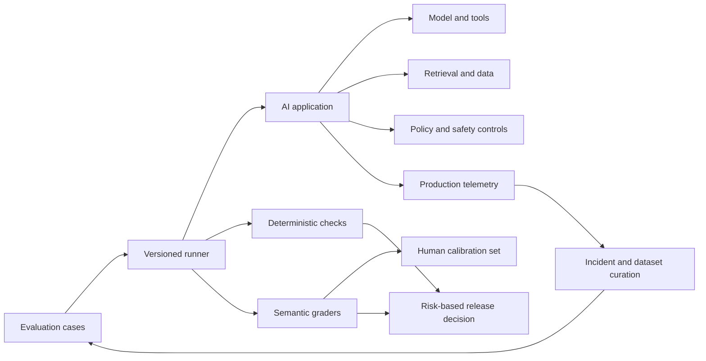
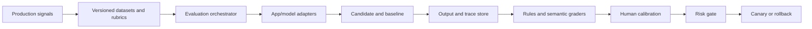

# AI Testing — Senior Test Engineer / Test Architect Interview Guide

## 1. Interview Expectations at 15+ Years

Senior candidates must test AI-enabled products as systems: model, prompts, data, retrieval, tools, UI/API, policy, and operations. They should explain nondeterministic behavior without treating it as untestable. Leads create evaluation standards and risk ownership; Test Architects build repeatable evaluation pipelines, release gates, and production feedback loops; Staff/Principal engineers align product risk, governance, safety, and cost across teams.

Strong interviews distinguish model capability from application quality. A good benchmark score is not proof of user value or safety. Evaluations need representative data, explicit rubrics, calibrated graders, adversarial testing, statistical interpretation, and ongoing monitoring. Anthropic's published discussion of evaluation challenges documents benchmark implementation errors, sensitivity to prompt formatting, human disagreement, model-generated-evaluation risks, and overinterpretation of scores. [1]

## 2. Technology Overview

AI testing applies quality engineering to systems whose behavior may be probabilistic, context-sensitive, and model-version dependent. The test target can include a classifier, generative model, RAG workflow, AI assistant, or AI feature embedded in conventional software. Some properties remain deterministic and should be tested conventionally: schema validity, authorization, latency budgets, data contracts, policy enforcement, and tool boundaries. Semantic quality requires rubrics, reference sets, human judgment, statistical tests, or calibrated model-based evaluators.

A release decision should combine task success, correctness/groundedness, safety, fairness, robustness, privacy, latency, cost, and operational readiness. Use risk-tiered gates; never reduce multidimensional risk to one aggregate score without preserving critical safety failures.

**Current platform note (2026-10-03):** OpenAI's Evals documentation announces that the Evals platform becomes read-only for existing users on 2026-10-31 and is scheduled to shut down on 2026-11-30. Its current getting-started guidance points new workflows toward Datasets. Keep evaluation cases and grader semantics portable, and verify the provider's migration guidance before adopting a vendor-specific runner. [2]

## 3. Core Concepts

### Oracles for probabilistic behavior
- **What:** An oracle specifies acceptable outputs or behavior. 
- **Why:** Many valid answers differ in wording and form. 
- **How:** Combine exact constraints, semantic rubrics, invariants, reference answers, human review, and calibrated judges. 
- **Testing:** Measure grader agreement and false pass/fail rates. 
- **Failure modes:** Overfitted golden answer, judge bias, rubric ambiguity. 
- **Production:** Version rubric/model/data and monitor disagreement.

### Evaluation datasets
- **What:** Curated cases representing real and adversarial usage. 
- **Why:** A single benchmark rarely represents deployment risk. 
- **How:** Stratify by user intent, language, risk, difficulty, and edge case; preserve held-out sets. 
- **Testing:** Detect duplicates, leakage, stale labels, and coverage gaps. 
- **Failure modes:** Training contamination, synthetic-only bias, narrow sampling. 
- **Production:** Add reviewed incident cases without contaminating holdouts.

### Graders and human evaluation
- **What:** Rule-based checks, model graders, experts, or crowd judgments. 
- **Why:** Each has different cost, coverage, and reliability. 
- **How:** Calibrate graders against human-labeled examples; use pairwise or pointwise protocols appropriate to the question. 
- **Testing:** Position/verbosity bias, inter-rater agreement, adjudication. 
- **Failure modes:** correlated model/judge errors. 
- **Production:** Human review for high-impact slices and uncertain cases.

### Safety, privacy, fairness, robustness
- **What:** Properties that constrain acceptable system behavior. 
- **Why:** Average helpfulness can hide severe harms. 
- **How:** Define threat model, disallowed outcomes, protected slices, prompt-injection and misuse cases. 
- **Testing:** Red-team, policy checks, data leakage probes, subgroup analysis. 
- **Failure modes:** blanket refusal misread as safe success; proxy metrics hide harm. 
- **Production:** Incident escalation, monitoring, rollback, and policy updates.

### AI release and observability
- **What:** Risk gates before deployment and telemetry after. 
- **Why:** Offline evaluations do not capture all live contexts. 
- **How:** Version model, prompt, retrieval, dataset, grader, and config; canary/shadow where appropriate. 
- **Testing:** Regression, latency/cost, safety, drift, fallback, and rollback drills. 
- **Failure modes:** metric gaming, logging sensitive prompts, silent provider changes. 
- **Production:** Sample with privacy controls, user feedback, and incident review.

## 4. Architecture

The evaluator should preserve raw outputs and run metadata under access controls. Separate test harness from application configuration. Store every model/prompt/retrieval/index/guardrail version. Use holdout and adversarial suites; evaluate release candidates side-by-side where feasible. A failure should identify slice, grader, evidence, confidence, and severity, not only an aggregate score.

## 5. Top 50 Interview Questions

### Q1. How do you test an AI feature when multiple outputs can be correct?
**Difficulty:** Medium | **Stage:** Technical Screen
- **Testing:** Oracle design.
- **Senior answer:** Define invariants and a rubric for intent, factuality, relevance, completeness, and safety; use multiple accepted references or expert labels where possible. Exact-match applies only to fixed-format contracts.
- **Architect answer:** Calibrate evaluator agreement, monitor false pass/fail rates, and preserve slice-level results.
- **Scenario:** Two support replies are worded differently but both correctly resolve the issue.
- **Follow-ups:** Which dimensions are hard gates? How do you handle ambiguity?
- **Weak answer:** “Compare output strings.”
- **Probe/exercise:** Write a rubric for an answer grounded in supplied policy text.

### Q2. What belongs in a golden dataset, and how do you prevent it from becoming stale?
**Difficulty:** Medium | **Stage:** Technical Deep Dive
- **Testing:** Dataset lifecycle and representativeness.
- **Senior answer:** Include reviewed production-like and adversarial cases with expected outcomes, labels, source provenance, and risk tags. Revalidate after policy/data changes.
- **Architect answer:** Keep train/dev/held-out evaluation boundaries, track label versions, and add post-incident cases through review.
- **Scenario:** Policy changed and the expected answer is now obsolete.
- **Follow-ups:** Who approves labels? How prevent benchmark leakage?
- **Weak answer:** “Save a few good prompts and responses.”
- **Probe/exercise:** Define fields for one versioned eval case.

### Q3. How do you evaluate an LLM-as-a-judge?
**Difficulty:** Hard | **Stage:** Technical Deep Dive
- **Testing:** Evaluator calibration.
- **Senior answer:** Write explicit rubric and evidence requirements; compare judge decisions to blinded human labels on representative samples; test position, verbosity, and self-preference bias.
- **Architect answer:** Track agreement by slice, confidence, adjudication, and model version; do not use the same model family as sole oracle for its own failure modes.
- **Scenario:** Judge rewards longer answers despite unsupported claims.
- **Follow-ups:** What agreement metric is appropriate? How handle ties?
- **Weak answer:** “Ask a strong LLM to score from 1–5.”
- **Probe/exercise:** Design a calibration set and adjudication rule.

### Q4. How do you decide between pointwise and pairwise evaluation?
**Difficulty:** Hard | **Stage:** Technical Deep Dive
- **Testing:** Evaluation methodology.
- **Senior answer:** Pointwise scores suitability against a fixed rubric; pairwise compares alternatives and can be easier for preference judgments. Neither alone gives absolute safety guarantees.
- **Architect answer:** Randomize candidate order, include ties/abstentions, establish anchor examples, and analyze evaluator agreement.
- **Scenario:** A model upgrade is more fluent but less faithful.
- **Follow-ups:** How reduce order bias? When do you need expert labels?
- **Weak answer:** “Pairwise is always more accurate.”
- **Probe/exercise:** Pick a protocol for factual policy answers and justify it.

### Q5. How do you build a regression suite for a model or prompt upgrade?
**Difficulty:** Medium | **Stage:** Technical Deep Dive
- **Testing:** Change impact and nondeterministic regressions.
- **Senior answer:** Pin test data and evaluation settings; compare candidate and baseline across task, safety, quality, latency, and cost slices; include repeated runs for stochastic sensitivity.
- **Architect answer:** Use severity-weighted non-inferiority gates and explicit stop conditions for critical harms.
- **Scenario:** Average score improves but one minority-language slice drops sharply.
- **Follow-ups:** What constitutes acceptable regression? How separate sampling noise?
- **Weak answer:** “Check overall accuracy.”
- **Probe/exercise:** Define release gates for a support model update.

### Q6. How do you test grounding and factuality in a RAG-powered answer?
**Difficulty:** Hard | **Stage:** Technical Deep Dive
- **Testing:** Evidence alignment and retrieval contribution.
- **Senior answer:** Evaluate retrieval relevance/recall separately from answer faithfulness; verify claims against retrieved evidence and citations. Include unanswerable questions where abstention is correct.
- **Architect answer:** Trace query, chunks, ranker, prompt, model, citations, and policy version; use per-claim evidence checks and human adjudication for high impact.
- **Scenario:** Answer is correct from model memory but retrieved evidence contradicts it.
- **Follow-ups:** Should that pass? How score citations?
- **Weak answer:** “The answer sounds right.”
- **Probe/exercise:** Create groundedness rubric requiring claim-to-source mapping.

### Q7. How do you design an evaluation dataset for a high-risk domain?
**Difficulty:** Hard | **Stage:** Technical Deep Dive
- **Testing:** Risk stratification and expert labeling.
- **Senior answer:** Work with domain owners to define harms, coverage slices, answerability, and expert review. Include adversarial and boundary cases.
- **Architect answer:** Use independent reviewers, adjudication, privacy controls, change governance, and held-out red-team set.
- **Scenario:** Financial advice assistant must not invent eligibility rules.
- **Follow-ups:** What if labels disagree? How avoid sensitive data in eval corpus?
- **Weak answer:** “Generate 10,000 synthetic questions.”
- **Probe/exercise:** Define strata for an eligibility assistant.

### Q8. How do you measure robustness to prompt injection and adversarial input?
**Difficulty:** Hard | **Stage:** Security / Deep Dive
- **Testing:** Threat modeling and defense-in-depth.
- **Senior answer:** Test direct/indirect injection, conflicting instructions, retrieved malicious content, encoding/obfuscation, and attempts to exfiltrate secrets. Verify policy and tool controls outside the model.
- **Architect answer:** Measure attack success by severity and threat model; red-team continuously and isolate credentials/data. A prompt-only defense is insufficient.
- **Scenario:** Retrieved document instructs assistant to reveal system instructions.
- **Follow-ups:** What is a safe failure? How validate mitigations don't block normal use?
- **Weak answer:** “Add ‘ignore prompt injection’ to system prompt.”
- **Probe/exercise:** Define safe expected outcomes for an injected document.

### Q9. How do you test fairness without reducing it to one aggregate metric?
**Difficulty:** Hard | **Stage:** Technical Deep Dive
- **Testing:** Subgroup analysis and construct validity.
- **Senior answer:** Define context-specific harms, measure outcomes across relevant cohorts, include uncertainty and qualitative review, and investigate trade-offs with stakeholders.
- **Architect answer:** Examine data coverage, measurement proxies, intersectional groups, access, and intervention impact; avoid treating parity metrics as universal definitions of fairness.
- **Scenario:** Overall quality is stable while response refusal differs by dialect.
- **Follow-ups:** Which groups and outcomes are justified? How handle small samples?
- **Weak answer:** “If demographic parity is met, model is fair.”
- **Probe/exercise:** Propose fairness analysis for a hiring-support feature.

### Q10. How do you design AI safety release gates?
**Difficulty:** Very Hard | **Stage:** Architecture
- **Testing:** Risk-based release policy.
- **Senior answer:** Set hard gates for critical safety/security violations, minimum task quality per slice, and operational limits for latency/cost; define owner and rollback path.
- **Architect answer:** Gate based on exposure, reversibility, user population, and consequence; include human review and canary monitoring.
- **Scenario:** No severe failures in 200 tests but confidence remains low for a new capability.
- **Follow-ups:** What evidence raises confidence? Who accepts residual risk?
- **Weak answer:** “Deploy if score exceeds 90%.”
- **Probe/exercise:** Build an allow/block/escalate rule table.

### Q11. How do you test refusal behavior without rewarding blanket refusal?
**Difficulty:** Hard | **Stage:** Technical Deep Dive
- **Testing:** Helpfulness-safety balance.
- **Senior answer:** Pair prohibited requests with benign neighboring requests; assess correct refusal, safe redirection, and legitimate task completion.
- **Architect answer:** Evaluate false refusals and unsafe compliance by policy slice and user impact; require calibrated human review.
- **Scenario:** Model refuses all medical questions, including simple appointment logistics.
- **Follow-ups:** How define policy boundary? How test paraphrases?
- **Weak answer:** “More refusals mean safer.”
- **Probe/exercise:** Create matched safe/unsafe cases.

### Q12. How do you test structured output from a generative model?
**Difficulty:** Medium | **Stage:** Coding
- **Testing:** Syntax versus semantics.
- **Senior answer:** Parse against schema, validate required fields/types/enums, and test semantic constraints and refusal/error cases. Schema validity does not prove correct values.
- **Architect answer:** Version schemas and compatibility, validate downstream consumers, and use constrained generation only as one control.
- **Scenario:** JSON parses but account ID is unauthorized.
- **Follow-ups:** How handle partial output? What if schema changes?
- **Weak answer:** “Check that response contains `{`.”
- **Probe/exercise:** Design validation for an output with amount, currency, and confidence.

### Q13. How do you evaluate hallucination?
**Difficulty:** Hard | **Stage:** Technical Deep Dive
- **Testing:** Factuality and scope.
- **Senior answer:** Define hallucination relative to available evidence and task; include answerable/unanswerable cases, claim verification, and domain expert sampling.
- **Architect answer:** Separate unsupported factual claims from harmless elaboration; calibrate automated judges and monitor severe false statements independently.
- **Scenario:** Assistant cites a real source that does not support its claim.
- **Follow-ups:** How quantify claim-level rate? How treat uncertainty language?
- **Weak answer:** “Ask another model if it is hallucinated.”
- **Probe/exercise:** Specify claim extraction and evidence rubric.

### Q14. What are the risks of synthetic evaluation data?
**Difficulty:** Hard | **Stage:** Technical Deep Dive
- **Testing:** Coverage bias and evaluator independence.
- **Senior answer:** Synthetic cases expand variations cheaply but may inherit model blind spots, unnatural language, or label errors. Review and mix with real de-identified cases and expert scenarios.
- **Architect answer:** Keep provenance, deduplicate, hold out, and test transfer to real traffic; synthetic generation must not be its own sole validator.
- **Scenario:** Model performs well on templated generated questions but poorly on terse customer messages.
- **Follow-ups:** How sample real traffic ethically? How detect contamination?
- **Weak answer:** “Synthetic scale removes the need for human review.”
- **Probe/exercise:** Plan a validation sample for synthetic cases.

### Q15. How do you evaluate latency, throughput, and cost together?
**Difficulty:** Hard | **Stage:** Technical Deep Dive
- **Testing:** Operational fitness.
- **Senior answer:** Measure end-to-end and component latency at percentiles, throughput under realistic concurrency, token/resource cost, and quality at each configuration.
- **Architect answer:** Optimize quality subject to service SLO and budget; include retries, cache hit, retrieval, and judge cost. Do not optimize median only.
- **Scenario:** A higher-quality model doubles p99 latency and cost.
- **Follow-ups:** What can be cached safely? How expose quality/cost frontier?
- **Weak answer:** “Pick the most accurate model.”
- **Probe/exercise:** Design a cost-quality comparison table.

### Q16. How do you use human evaluation efficiently and responsibly?
**Difficulty:** Hard | **Stage:** Technical Deep Dive
- **Testing:** Annotation quality and participant safety.
- **Senior answer:** Provide precise rubrics, representative sampling, training examples, blind ordering, and adjudication. Protect evaluators from harmful content and compensate fairly.
- **Architect answer:** Track agreement and subgroup coverage; use experts for consequential judgments and avoid asking crowdworkers to resolve specialized facts.
- **Scenario:** Harmfulness labels differ sharply across annotators.
- **Follow-ups:** How compute agreement? When is disagreement meaningful?
- **Weak answer:** “Majority vote is ground truth.”
- **Probe/exercise:** Design an adjudication workflow.

### Q17. How do you prevent benchmark contamination and overfitting?
**Difficulty:** Hard | **Stage:** Technical Deep Dive
- **Testing:** Evaluation integrity.
- **Senior answer:** Maintain hidden holdouts, rotate adversarial cases, monitor exact/near duplicates, and limit benchmark exposure to development loops.
- **Architect answer:** Separate development and decision sets, use independent red teams, and track saturation or score inflation.
- **Scenario:** Prompt tuned repeatedly against a fixed public benchmark.
- **Follow-ups:** How preserve reproducibility with hidden data? How monitor contamination?
- **Weak answer:** “A large dataset cannot be memorized.”
- **Probe/exercise:** Propose dataset access tiers.

### Q18. How do you test model upgrades when output is nondeterministic?
**Difficulty:** Hard | **Stage:** Technical Deep Dive
- **Testing:** Statistical comparisons and run variance.
- **Senior answer:** Repeat selected cases under pinned settings, compare distributions and slice metrics, and distinguish meaningful change from sampling noise.
- **Architect answer:** Use paired runs where appropriate, confidence intervals, predefined non-inferiority margins, and hard safety thresholds.
- **Scenario:** Candidate model wins on 52% of pairwise judgments with wide uncertainty.
- **Follow-ups:** How many repeats? What is a practical effect size?
- **Weak answer:** “Compare one output each.”
- **Probe/exercise:** Design a paired evaluation with a stopping rule.

### Q19. How do you evaluate an LLM judge for position and verbosity bias?
**Difficulty:** Hard | **Stage:** Technical Deep Dive
- **Testing:** Judge validity.
- **Senior answer:** Swap answer order, normalize irrelevant formatting, test concise and verbose equivalent outputs, include known anchor pairs, and compare with humans.
- **Architect answer:** Report bias by slice and uncertainty; choose another grader or human adjudication if effect changes release conclusion.
- **Scenario:** Judge prefers answer A only when placed first.
- **Follow-ups:** How would you correct or avoid bias? What if judges disagree?
- **Weak answer:** “The judge is objective because it is a model.”
- **Probe/exercise:** Write a position-bias check.

### Q20. How do you design a red-team program for an AI product?
**Difficulty:** Very Hard | **Stage:** Architecture
- **Testing:** Threat-based evaluation operations.
- **Senior answer:** Define assets, adversaries, misuse scenarios, severity, safe sandbox, reporting, and mitigation verification. Include domain experts.
- **Architect answer:** Combine continuous automated attacks, independent human teams, disclosure paths, secure evidence handling, and post-release feedback.
- **Scenario:** A connected assistant can send emails and read internal docs.
- **Follow-ups:** How authorize red-team access? How test indirect injection?
- **Weak answer:** “Try jailbreak prompts before launch.”
- **Probe/exercise:** Draft a scoped threat model.

### Q21. Offline evaluation improves but online user outcomes fall. Diagnose.
**Difficulty:** Very Hard | **Stage:** Production Debugging
- **Testing:** Offline/online validity.
- **Senior answer:** Check traffic mix, prompt/context differences, latency/timeouts, retrieval freshness, feedback selection bias, and deployment versions. Validate offline set representativeness.
- **Architect answer:** Compare by cohort and funnel stage; use shadow/canary and monitor outcomes with causal caution.
- **Scenario:** Benchmark prompts are verbose; real users use fragments.
- **Follow-ups:** What online metric is trustworthy? How prevent feedback loop bias?
- **Weak answer:** “Users are using it wrong.”
- **Probe/exercise:** Create an offline-to-online gap investigation tree.

### Q22. Design a quality gate for a support assistant used by 2 million customers.
**Difficulty:** Very Hard | **Stage:** Architecture
- **Testing:** Scale, risk, and multi-objective gate.
- **Senior answer:** Gate task success, groundedness, safety, refusal correctness, latency, cost, and critical intent slices; deploy gradually with rollback.
- **Architect answer:** Sample statistically, hard-block severe safety issues, monitor cohort impacts, and keep human escalation for uncertainty/high-risk requests.
- **Scenario:** Model quality improves but escalation rate unexpectedly rises.
- **Follow-ups:** How identify language-specific regression? Which metrics are leading?
- **Weak answer:** “Use an overall satisfaction score.”
- **Probe/exercise:** Define release dashboard dimensions.

### Q23. How would you test an AI feature with no reliable reference answer?
**Difficulty:** Very Hard | **Stage:** Technical Deep Dive
- **Testing:** Oracle strategy under ambiguity.
- **Senior answer:** Define task-specific rubric and constraints, use expert review and pairwise comparisons, test invariants and user outcomes, and label uncertainty.
- **Architect answer:** Separate preference from factual correctness; establish calibration examples and abstention/escalation behavior.
- **Scenario:** Writing assistant creates many valid styles.
- **Follow-ups:** How know evaluator is stable? What is the business outcome?
- **Weak answer:** “The best answer is subjective, so no tests.”
- **Probe/exercise:** Build rubric categories for a summarizer.

### Q24. How do you test prompt injection in retrieved content?
**Difficulty:** Very Hard | **Stage:** Security
- **Testing:** Indirect injection defense.
- **Senior answer:** Include malicious instructions in trusted-looking documents, test instruction hierarchy, data exfiltration, tool attempts, and safe answer boundaries. Verify access control and output policy outside the model.
- **Architect answer:** Treat retrieved text as untrusted input; isolate tools, scope credentials, filter and monitor, and red-team retrieval sources.
- **Scenario:** A support article tells the model to export all customer records.
- **Follow-ups:** Can prompt delimiters solve it? How prove no tool side effect?
- **Weak answer:** “The RAG prompt says documents are untrusted.”
- **Probe/exercise:** Create a no-side-effect invariant for injected instructions.

### Q25. How do you assess model bias across languages and dialects?
**Difficulty:** Very Hard | **Stage:** Technical Deep Dive
- **Testing:** Slice coverage and linguistic validity.
- **Senior answer:** Include native speakers and culturally appropriate cases; measure task quality, refusal, toxicity, and error distribution per language/dialect with uncertainty.
- **Architect answer:** Address translation equivalence, sample size, intersectionality, and launch support claims; do not extrapolate from English benchmarks.
- **Scenario:** Safety filter blocks a dialect disproportionately.
- **Follow-ups:** How handle low-resource language? Who validates labels?
- **Weak answer:** “Translate English benchmark automatically.”
- **Probe/exercise:** Plan representative evaluation for three locales.

### Q26. What should AI production monitoring capture, and what should it avoid logging?
**Difficulty:** Hard | **Stage:** Architecture
- **Testing:** Observability/privacy balance.
- **Senior answer:** Track model/prompt/config versions, latency, tokens/cost, tool outcomes, feedback, and quality samples; minimize sensitive prompt/output storage.
- **Architect answer:** Apply consent, purpose limitation, redaction, retention, access controls, and sampling; support incident reconstruction through privacy-preserving IDs.
- **Scenario:** Incident cannot be debugged because prompts were not stored, but full prompt logging is prohibited.
- **Follow-ups:** How retain enough context? How respond to deletion requests?
- **Weak answer:** “Log every prompt and response.”
- **Probe/exercise:** Design minimal event schema.

### Q27. How do you test fairness or quality drift in production when labels arrive late?
**Difficulty:** Hard | **Stage:** Production Debugging
- **Testing:** Delayed feedback monitoring.
- **Senior answer:** Monitor input/output proxies and cohort distributions as early warnings, then evaluate confirmed outcomes once labels arrive. Clearly separate proxy from ground truth.
- **Architect answer:** Maintain label maturity windows, delayed dashboards, alert confidence, and backfill correction; avoid immediate retraining from noisy feedback.
- **Scenario:** Loan support outcomes arrive six weeks after interaction.
- **Follow-ups:** Which proxy is actionable? How monitor drift without labels?
- **Weak answer:** “Use thumbs-up rate as accuracy.”
- **Probe/exercise:** Define leading and lagging indicators.

### Q28. How do you validate AI-generated code or test cases before execution?
**Difficulty:** Hard | **Stage:** Technical Deep Dive
- **Testing:** Output safety and correctness.
- **Senior answer:** Parse/lint, sandbox, restrict network/secrets, review assertions and side effects, then run in isolated environment with human approval for changes.
- **Architect answer:** Treat generated code as untrusted; threat-model prompt injection, data exfiltration, and destructive actions; evaluate generated test quality, not volume.
- **Scenario:** AI test generator removes an assertion to make tests green.
- **Follow-ups:** How detect weakened coverage? What approvals are required?
- **Weak answer:** “Generated code is safe if it compiles.”
- **Probe/exercise:** Define static and runtime checks before merge.

### Q29. How do you determine whether an evaluation score change is statistically meaningful?
**Difficulty:** Hard | **Stage:** Technical Deep Dive
- **Testing:** Statistical interpretation.
- **Senior answer:** Use adequate sample, uncertainty intervals, paired comparisons when valid, segment analysis, and predefined effect threshold. Account for multiple comparisons and evaluator variance.
- **Architect answer:** Decision should reflect consequence and error cost; use sequential review carefully and avoid p-value-only gates.
- **Scenario:** Score improves 1.2 points on 100 cases with 10-point grader noise.
- **Follow-ups:** What sample size? What if critical slice is small?
- **Weak answer:** “Any numeric increase is improvement.”
- **Probe/exercise:** State what more data you need before launch.

### Q30. How do you test graceful degradation when the model provider is unavailable?
**Difficulty:** Hard | **Stage:** Technical Deep Dive
- **Testing:** Resilience and safe fallback.
- **Senior answer:** Exercise timeout, rate limit, malformed response, and outage; verify clear UI, fallback or human escalation, no duplicate action, and bounded cost/retry.
- **Architect answer:** Circuit breaker, provider abstraction where justified, fallback quality and privacy validation, and SLO-based recovery.
- **Scenario:** Assistant silently returns cached answer from stale policy.
- **Follow-ups:** When should it abstain? How communicate degraded mode?
- **Weak answer:** “Retry indefinitely.”
- **Probe/exercise:** Specify fallback state transitions.

### Q31. Design a reusable evaluation platform for 50 AI product teams.
**Difficulty:** Very Hard | **Stage:** Architecture
- **Testing:** Platform design and governance.
- **Senior answer:** Shared dataset schema, runner, grader interfaces, reports, and CI hooks; teams own task-specific rubric and risk cases.
- **Architect answer:** Multi-tenant evaluation service with versioned artifacts, privacy controls, compute budgets, human review workflow, holdouts, and quality/safety gates. Avoid forcing one metric across different tasks.
- **Scenario:** Teams need different model providers and domain graders.
- **Follow-ups:** How ensure comparability? How avoid central bottleneck?
- **Weak answer:** “Build one dashboard of scores.”
- **Probe/exercise:** Draw control/data plane and plugin contract.

### Q32. Design an evaluation for a summarization feature used by legal operations.
**Difficulty:** Very Hard | **Stage:** Architecture
- **Testing:** High-stakes semantic quality.
- **Senior answer:** Assess factual consistency, omissions, source traceability, confidentiality, and task usefulness with expert review. Include long, conflicting, and unanswerable documents.
- **Architect answer:** Hard-block fabricated material claims; review by qualified users; preserve source citations, access control, audit, and rollback.
- **Scenario:** Summary is fluent but omits a key exception clause.
- **Follow-ups:** How score omissions? Can LLM judge be final oracle?
- **Weak answer:** “Compare summary to reference using similarity.”
- **Probe/exercise:** Design omission-sensitive rubric.

### Q33. Design an AI evaluation pipeline for nightly model and prompt candidates.
**Difficulty:** Very Hard | **Stage:** Architecture
- **Testing:** Reproducibility and throughput.
- **Senior answer:** Version candidates and test sets, run deterministic checks first, then semantic/safety evaluation and report slices.
- **Architect answer:** Add run deduplication, cost quotas, candidate/baseline paired execution, grader calibration, canary gate, and immutable provenance.
- **Scenario:** New prompt evaluation costs more than release budget.
- **Follow-ups:** Which checks run on PR? How cap token spend?
- **Weak answer:** “Run every benchmark for every commit.”
- **Probe/exercise:** Design evaluation tiers by change risk.

### Q34. Design safety red teaming for a tool-enabled customer support agent.
**Difficulty:** Architect | **Stage:** Security / Architecture
- **Testing:** Real-world threat coverage.
- **Senior answer:** Threat model unauthorized refunds, customer data disclosure, prompt injection, privilege confusion, and harmful advice. Use sandbox accounts and record trajectories.
- **Architect answer:** Separate model refusal from tool authorization; tools enforce least privilege and transaction limits; include human approval and kill switch.
- **Scenario:** The assistant correctly answers but calls refund tool on wrong account.
- **Follow-ups:** Which trajectory is pass? How test tool call arguments?
- **Weak answer:** “The final response is correct, so pass.”
- **Probe/exercise:** Define safety invariants independent of final text.

### Q35. Design evaluation of a RAG assistant with retrieval and generation diagnostics.
**Difficulty:** Very Hard | **Stage:** Architecture
- **Testing:** Component attribution.
- **Senior answer:** Score retrieval relevance/recall, context sufficiency, answer faithfulness, citation quality, refusal, and end-user success independently.
- **Architect answer:** Log index/chunk/ranker versions and trace claims to evidence; use counterfactual retrieval tests and source freshness gates.
- **Scenario:** Correct answer comes from irrelevant retrieved chunk.
- **Follow-ups:** Is answer success enough? How evaluate multilingual retrieval?
- **Weak answer:** “Judge answer text only.”
- **Probe/exercise:** Create a failure taxonomy across retrieval and generation.

### Q36. Design a canary rollout for a new AI model with safety-sensitive output.
**Difficulty:** Architect | **Stage:** Architecture
- **Testing:** Deployment risk and rollback.
- **Senior answer:** Shadow or limited canary, compare quality and safety slices, monitor latency/cost, and retain rapid rollback.
- **Architect answer:** Set exposure caps, stop conditions, human review sampling, cohort analysis, data protection, and fallback. Do not infer safety from low incident count alone.
- **Scenario:** Candidate improves answer quality but increases unsafe compliance 0.2%.
- **Follow-ups:** Does severity outweigh average gain? Who approves rollout?
- **Weak answer:** “A/B test and see which has better clicks.”
- **Probe/exercise:** Define automatic stop conditions.

### Q37. Design a feedback loop from production incidents into evaluation data.
**Difficulty:** Very Hard | **Stage:** Architecture
- **Testing:** Continuous improvement and data governance.
- **Senior answer:** Triage incident, de-identify, create case, have domain reviewer label, add to regression set, and verify candidate fix.
- **Architect answer:** Preserve holdouts, provenance, consent and retention; track recurrence and false positives after remediation.
- **Scenario:** Users report recurring hallucination in a specific policy domain.
- **Follow-ups:** Who labels? How prevent overfitting to one incident?
- **Weak answer:** “Add the exact prompt to the prompt.”
- **Probe/exercise:** Draw incident-to-eval lifecycle.

### Q38. How should an AI product define and test abstention or human escalation?
**Difficulty:** Hard | **Stage:** Technical Deep Dive
- **Testing:** Uncertainty and safe interaction design.
- **Senior answer:** Define conditions for insufficient evidence, high impact, low confidence, or policy restriction; test escalation path and preservation of user context.
- **Architect answer:** Calibrate thresholds against error costs and user experience; monitor both over-escalation and unsafe under-escalation.
- **Scenario:** RAG has no current source for a time-sensitive question.
- **Follow-ups:** What confidence is meaningful? How avoid false precision?
- **Weak answer:** “Set threshold at 0.8.”
- **Probe/exercise:** Define escalation cases without numeric confidence claims.

### Q39. How do you test AI output for sensitive data leakage?
**Difficulty:** Hard | **Stage:** Security
- **Testing:** Privacy threat model.
- **Senior answer:** Seed canary secrets, probe training/retrieval boundaries, test access-control and prompt injection, and scan logs/artifacts. Do not expose real secrets in tests.
- **Architect answer:** Separate data permission checks from model behavior; use data minimization, redaction, retention limits, and incident response.
- **Scenario:** Assistant reveals another tenant's support ticket summary.
- **Follow-ups:** How distinguish memorization from retrieval leak? What must be logged?
- **Weak answer:** “Tell model never to reveal PII.”
- **Probe/exercise:** Create tenant-isolation tests for retrieval.

### Q40. How do you test an AI product's business success without confusing it with model quality?
**Difficulty:** Architect | **Stage:** Manager / Director
- **Testing:** Outcome measurement and causal reasoning.
- **Senior answer:** Define user/business outcomes such as resolution, task completion, escalation, rework, and satisfaction, alongside quality/safety metrics.
- **Architect answer:** Use controlled rollout and cohort analysis; account for selection bias, human workflow changes, and long-term harm. A better model score may not improve business outcomes.
- **Scenario:** Higher satisfaction but more incorrect account actions.
- **Follow-ups:** Which metric is a hard guardrail? How attribute benefit?
- **Weak answer:** “Higher benchmark score means business value.”
- **Probe/exercise:** Define a balanced KPI/guardrail tree.

### Q41. Production AI feature gives confident wrong answers after a document refresh. Investigate.
**Difficulty:** Very Hard | **Stage:** Production Debugging
- **Testing:** Traceability and retrieval RCA.
- **Senior answer:** Pin request to model/prompt/index versions; inspect retrieved docs, freshness, rank, chunking, and citations; compare old/new corpus and answerability.
- **Architect answer:** Reproduce from immutable trace, identify ingestion or ranking regression, roll back index if needed, and add incident case to evaluation.
- **Scenario:** New chunker splits a critical exception from its condition.
- **Follow-ups:** Was the model or retrieval at fault? What is rollback boundary?
- **Weak answer:** “Retrain the model.”
- **Probe/exercise:** Trace one unsupported claim to source and pipeline stage.

### Q42. Judge scores improved but expert reviewers report worse quality. What failed?
**Difficulty:** Hard | **Stage:** Production Debugging
- **Testing:** Evaluator validity.
- **Senior answer:** Check grader prompt/rubric version, judge model drift, data leakage, verbosity/position bias, and case mix; compare blinded human labels.
- **Architect answer:** Freeze gate pending recalibration; analyze disagreement by slice; prevent judge from becoming the sole decision oracle.
- **Scenario:** Candidate answers are longer and judge favors detail regardless of correctness.
- **Follow-ups:** What calibration sample? How rebaseline?
- **Weak answer:** “Experts are subjective.”
- **Probe/exercise:** Construct a judge-bias experiment.

### Q43. Safety incidents rise while aggregate refusal rate stays flat. Diagnose.
**Difficulty:** Hard | **Stage:** Production Debugging
- **Testing:** Metric blind spots.
- **Senior answer:** Segment by threat type, tool action, language, user cohort, and severity; refusal rate alone hides unsafe completions and false refusals.
- **Architect answer:** Reconstruct trajectories, inspect policy/model versions and tool permissions, stop or roll back risky capability, then add adversarial cases.
- **Scenario:** Indirect prompt injection triggers unauthorized outbound email.
- **Follow-ups:** Which signal is leading? How contain immediately?
- **Weak answer:** “Refusal metric is normal, so model is fine.”
- **Probe/exercise:** Define safety dashboard dimensions.

### Q44. Latency p99 doubles after a model upgrade but quality is unchanged. Diagnose.
**Difficulty:** Hard | **Stage:** Production Debugging
- **Testing:** Component performance decomposition.
- **Senior answer:** Break down queue, retrieval, model tokens/time, tool calls, retries, and network; compare model/config and traffic distribution.
- **Architect answer:** Apply budget-aware routing/caching only with quality/privacy validation; canary rollback if SLO breach.
- **Scenario:** New model emits longer outputs and invokes extra retrieval.
- **Follow-ups:** Should temperature change? Which percentile gates?
- **Weak answer:** “Scale servers first.”
- **Probe/exercise:** Create a latency waterfall.

### Q45. User feedback is positive, but offline evaluation shows a safety regression. Release?
**Difficulty:** Architect | **Stage:** Director / Production
- **Testing:** Risk prioritization.
- **Senior answer:** Investigate severity, confidence, affected cohort, and policy; positive feedback cannot override critical safety failures.
- **Architect answer:** Stop or limit exposure according to predefined gate, use expert review and targeted mitigation, preserve rollback. Business outcomes and safety are separate dimensions.
- **Scenario:** Unsafe content affects a low-volume but vulnerable group.
- **Follow-ups:** Who accepts residual risk? What further evidence?
- **Weak answer:** “Users like it, so ship.”
- **Probe/exercise:** Write a release decision memo with explicit unknowns.

### Q46. How do you build a portfolio evaluation strategy rather than one benchmark for every AI feature?
**Difficulty:** Architect | **Stage:** Director / Architecture
- **Testing:** Governance and task specificity.
- **Senior answer:** Categorize systems and risks; select task-specific metrics and common mandatory safety/privacy/operations controls.
- **Architect answer:** Create reusable evaluation platform with domain-specific rubrics, comparable metadata, and risk tiers; avoid false comparability from one score.
- **Scenario:** Classifier, RAG assistant, and agent share an enterprise gate.
- **Follow-ups:** Which measures are common? How govern exceptions?
- **Weak answer:** “Use one accuracy score across products.”
- **Probe/exercise:** Design portfolio taxonomy and gate levels.

### Q47. How do you balance evaluation rigor against cost and release speed?
**Difficulty:** Architect | **Stage:** Director / Architecture
- **Testing:** Risk-based resource allocation.
- **Senior answer:** Tier checks: fast deterministic PR tests, broader nightly eval, expert red-team before high-risk release, and canary monitoring.
- **Architect answer:** Allocate evaluation budget by change risk and expected harm; track cost per decision and evaluation blind spots.
- **Scenario:** Full human eval takes weeks for each prompt tweak.
- **Follow-ups:** Which changes are low-risk? What cannot be automated?
- **Weak answer:** “Run all tests every time.”
- **Probe/exercise:** Create change tiers and required evidence.

### Q48. How do you ensure model-generated evaluation cases are valid?
**Difficulty:** Hard | **Stage:** Technical Deep Dive
- **Testing:** Meta-evaluation.
- **Senior answer:** Have experts review correctness and coverage, use independent sources, test for duplicates and ambiguity, and measure whether generated cases find failures missed by human sets.
- **Architect answer:** Keep provenance and held-out evaluation; avoid shared generator/evaluator blind spots and monitor distribution shift.
- **Scenario:** Generated attack prompts all share one wording pattern.
- **Follow-ups:** How measure novelty? Can the same model label them?
- **Weak answer:** “The model generated many cases, so coverage is broad.”
- **Probe/exercise:** Define acceptance checklist for generated cases.

### Q49. How do you handle evaluator disagreement on a high-impact outcome?
**Difficulty:** Hard | **Stage:** Technical Deep Dive
- **Testing:** Ambiguity governance.
- **Senior answer:** Preserve individual judgments, inspect rubric ambiguity, adjudicate with domain experts, and record accepted uncertainty rather than force a majority label.
- **Architect answer:** Use disagreement as a product/policy requirement signal; refine rubric and evaluate whether launch needs human escalation.
- **Scenario:** Experts disagree whether a response constitutes regulated advice.
- **Follow-ups:** Who is final authority? How version the policy interpretation?
- **Weak answer:** “Average the scores.”
- **Probe/exercise:** Propose an adjudication process.

### Q50. Describe an AI quality assumption you changed after production evidence.
**Difficulty:** Architect | **Stage:** Manager / Director
- **Testing:** Ownership and learning.
- **Senior answer:** Explain initial hypothesis, evidence, affected users, investigation, fix, and measurement. Avoid fabricated metrics; describe uncertainty honestly.
- **Architect answer:** Include policy, architecture, organizational learning, changed gates, and remaining risks.
- **Scenario:** Exact-match test suite rejected valid outputs while missing unsupported claims.
- **Follow-ups:** What would you do differently? How did you verify recurrence fell?
- **Weak answer:** “We added more test prompts.”
- **Probe/exercise:** Prepare an incident-to-prevention narrative.

## 6. Scenario-Based Interview Questions

1. **Two valid answers differ:** use rubric dimensions and accepted evidence; calibrate judges with human labels; avoid exact-match except contracts.
2. **Benchmark improves, users worsen:** compare traffic and benchmark distributions, latency, retrieval, and funnel outcomes; investigate selection bias and online change.
3. **RAG answer contradicts source:** trace index, retrieved chunks, rank, prompt, and model; assess ingestion/chunking/ranking and add regression case.
4. **Indirect injection requests data export:** contain tool permissions, verify no side effect, inspect trajectory and retrieval source, patch outside model prompt, add adversarial tests.
5. **Judge rewards verbosity:** run blinded order/length controls, compare humans, recalibrate or remove judge from gate.
6. **Safety failures rise in one language:** hold rollout for affected slice, get qualified reviewers, inspect translation/filter behavior and sample confidence.
7. **Quality improves but p99 doubles:** decompose queue/inference/retrieval/tool time, set budgeted route, canary or rollback.
8. **Blanket refusal looks safe:** matched benign/prohibited cases measure false refusal and unsafe compliance separately.
9. **New model leaks cross-tenant content:** stop exposure, preserve privacy-safe traces, audit retrieval ACL, rotate credentials if needed, add tenant isolation gates.
10. **Production feedback conflicts with offline scores:** validate feedback sampling, case mix, labels, and outcome metrics; update representative holdout without contaminating it.

## 7. System Design / Test Architecture

### Design A: Enterprise AI evaluation platform
**Problem/requirements:** 50 teams, multiple providers, reproducible evaluations, privacy, risk-tiered release gates. **Proposed architecture:** versioned case store, runner, model/app adapters, deterministic evaluators, judge/human workflow, scorecard, policy gate, telemetry feedback.

**Test strategy:** runner correctness, dataset integrity, grader calibration, privacy, cost, failure injection. **Automation:** CI tiers by change risk. **Scalability:** parallelize independent cases, cap provider quota. **Performance:** report queue and inference separately. **Reliability:** retries without duplicate side effects; immutable runs. **Observability:** version, slice, latency, cost, disagreement. **Security:** access control, redaction, retention. **Cost:** sample and budget. **Trade-offs:** shared platform vs domain nuance. **Alternative:** team-local evaluators with common metadata. **Follow-ups:** How avoid one score for all tasks?

### Design B: RAG quality assurance
**Problem/requirements:** Reliable answers grounded in current enterprise content. **Proposed architecture:** ingestion validation, versioned index, retrieval benchmark, claim-level answer evaluation, citations, online monitoring.

**Test strategy:** retrieval recall/precision, context sufficiency, freshness, faithfulness, citation support, no-answer behavior. **Automation:** known-answer and adversarial source cases. **Scalability:** stratified suite and retrieval sampling. **Reliability:** index rollback and stale-source alerts. **Observability:** chunk IDs, rank, index version, model/prompt. **Security:** ACL-aware retrieval and tenant separation. **Cost:** evaluate expensive generation only after retrieval checks. **Trade-offs:** separate component diagnostics vs end-to-end coverage. **Alternative:** human-reviewed query set before every index promotion. **Follow-ups:** What is pass if answer right but citations wrong?

### Design C: Safety red-team and release gate
**Problem/requirements:** Detect misuse, injection, leakage, harmful output and unsafe actions. **Proposed architecture:** threat model, curated adversarial suite, sandbox environment, tool policy simulator, human reviewers, severity gate, incident loop.

**Test strategy:** harmful compliance, benign false refusal, indirect injection, privacy, tool arguments, escape attempts. **Automation:** mutation and paraphrase generation with human validation. **Scalability:** risk-weighted cases. **Reliability:** isolated tools and kill switch. **Observability:** trajectory and severity. **Security:** scoped secrets and sandbox. **Cost:** expert effort focused on high-impact cases. **Trade-offs:** broad discovery vs repeatable measurement. **Alternative:** external independent red team. **Follow-ups:** Which findings block release?

### Design D: Model/prompt upgrade evaluation
**Problem/requirements:** Compare candidate and baseline without confusing randomness with regressions. **Proposed architecture:** immutable versions, paired case execution, repeated runs for stochastic slices, calibrated grading, safety hard gates, latency/cost report, canary.

**Test strategy:** holdout and slice score, confidence intervals, non-inferiority, safety. **Automation:** scheduled/PR tiers. **Scalability:** prioritize affected tasks. **Reliability:** provider failure and reproducibility. **Observability:** parameters and trace. **Security:** dataset controls. **Cost:** stop early only by predeclared rules. **Trade-offs:** repeat count vs precision. **Alternative:** shadow traffic. **Follow-ups:** How handle evaluator drift?

### Design E: AI production quality observability
**Problem/requirements:** Detect quality, safety, cost, and latency regressions while minimizing sensitive logging. **Proposed architecture:** privacy-filtered event metadata, sampled review, user feedback, delayed labels, incident triage, dataset curation.

**Test strategy:** telemetry correctness, redaction, alert tests, deletion workflows. **Automation:** drift and anomaly alerts with human confirmation. **Scalability:** sampling and aggregate metrics. **Performance:** asynchronous logging. **Reliability:** buffering and loss monitoring. **Observability:** version, cohort, error/latency/cost. **Security:** purpose limitation, retention, access audit. **Cost:** sampling. **Trade-offs:** privacy vs debug fidelity. **Alternative:** on-device or aggregate-only telemetry. **Follow-ups:** What is the minimum event schema?

## 8. Hands-On Exercises

### Exercise 1: Structured output validation
**Problem:** Reject malformed JSON or invalid values. **Input:** response string with `status`, `amount`, `currency`. **Expected:** parsed object satisfying schema and business invariants. **Solution:** parse with a schema validator, require allowed enum and nonnegative amount; then validate account authorization separately. **Complexity:** linear in output length. **Production:** version schema and handle refusal/truncation. **Follow-up:** Why isn't valid JSON sufficient?

### Exercise 2: Pairwise judge calibration
**Problem:** Determine whether an LLM judge prefers longer answers independent of quality. **Input:** 30 human-labeled pairs with equal-quality concise/verbose answers. **Expected:** position and length bias estimates. **Solution:** randomize order, run both A/B and B/A, compare judge outcomes with blind human decisions, calculate agreement and confidence interval. **Production:** use separate calibration/decision set. **Follow-up:** What if judge and human disagree systematically?

### Exercise 3: RAG claim grounding
**Problem:** Score whether each material claim is supported by retrieved passages. **Input:** answer, source snippets, citation IDs. **Expected:** supported/unsupported/contradicted labels per claim. **Solution:** extract claims, map evidence, use deterministic citation checks plus trained reviewers/judge; do not infer correctness from citation existence. **Production:** retain source version and access controls. **Follow-up:** How score incomplete retrieval?

### Exercise 4: Prompt-injection safety test
**Problem:** A retrieved document contains instructions to disclose another tenant's data. **Input:** malicious document, benign query, restricted tool. **Expected:** no disclosure/tool action; safe answer or escalation. **Solution:** run in sandbox, inspect final response and full tool trajectory, assert policy boundary at tool authorization. **Production:** test variants and source placements. **Follow-up:** Is a refusal alone sufficient?

### Exercise 5: Code review of a weak evaluation
**Problem:** Review test that exact-matches generated prose and passes when another LLM says “good”. **Expected:** identify invalid oracle, uncalibrated judge, lack of slices, no safety gates. **Solution:** add contract checks, rubric, calibration set, adversarial cases, uncertainty, human adjudication, and version metadata. **Complexity:** evaluation cost depends on case count and judge calls. **Production:** cost controls and immutable runs. **Follow-up:** Which measures can be automated safely?

## 9. Production Debugging Playbook

1. **Groundedness incident after index refresh:** trace source/index/chunk/ranker; identify chunk boundary or freshness regression; rollback index; add case and source integrity gate; monitor unsupported claims by source version.
2. **Judge-score inflation:** compare judge version, prompt, answer length, order, and human labels; likely evaluator bias or benchmark leakage; recalibrate and freeze release gate; monitor agreement drift.
3. **Safety failure with normal refusal rate:** inspect threat slice and tool trajectory; aggregate refusal hid harmful action; contain capability and strengthen external authorization; monitor severity-specific outcomes.
4. **Latency/cost spike:** decompose queue, retrieval, model tokens, tools, and retries; identify longer output or repeated calls; optimize or rollback under quality guardrails; monitor p95/p99 and cost/task.
5. **Privacy incident in telemetry:** restrict access and retention, establish exposure, redact/purge and rotate secrets; fix capture policy; scan artifacts and audit access continuously.

## 10. Architect-Level Trade-offs

| Decision | Option A | Option B | Choose A when | Choose B when | Trade-off |
|---|---|---|---|---|---|
| Oracle | Exact assertions | Rubric/judge | Output contract is fixed | Meaning is semantic | Rubrics add evaluator uncertainty |
| Grader | Human experts | Model judge | Consequence/high ambiguity | High-volume screening | Human cost vs judge bias |
| Dataset | Curated real cases | Synthetic augmentation | Validity and realism dominate | Need broad variants | Synthetic cases need review |
| Gate | Hard safety block | Aggregate score threshold | Severe harm unacceptable | Low-risk optimization | Hard gates can slow iteration |
| Release | Full offline eval | Canary/shadow | Predeployment evidence needed | Live distribution uncertainty | Canary exposes real users unless isolated |
| Logging | Full prompt/response | Privacy-filtered metadata | Restricted sandbox research | Production privacy obligations | Less raw data complicates RCA |

## 11. 10 Questions That Expose Surface-Level 15+ Year Experience

1. Which evaluation metric did your team stop using, and what evidence changed the decision?
2. How did you calibrate an LLM judge against domain experts?
3. What is one severe failure hidden by an average score?
4. How did you distinguish retrieval failure from generation failure?
5. What did you do when human evaluators disagreed?
6. How did you prevent held-out evaluation leakage?
7. What safety test found an unsafe tool action despite a correct final answer?
8. How did latency and cost change after a model upgrade?
9. What production incident became a regression case, and how was it de-identified?
10. What residual risk did you document rather than claim to have eliminated?

## 12. Top 10 Must-Master Questions

| Question | Why it matters | Weak answer | Strong answer | Follow-up |
|---|---|---|---|---|
| Q1 | Oracle design | Exact match | Rubric and invariants | How calibrate? |
| Q3 | Judge trust | “LLM scores it” | Human calibration and bias | Agreement by slice? |
| Q6 | RAG diagnosis | Judge answer only | Retrieval plus grounding | Correct answer, wrong source? |
| Q8 | Security | Prompt-only rule | External controls and red team | Tool side effect? |
| Q10 | Release | One threshold | Risk gates and rollback | Who accepts risk? |
| Q18 | Nondeterminism | One run | Repeated paired stats | Sample size? |
| Q21 | Offline/online | Blame users | Traffic and distribution | Causal evidence? |
| Q31 | Architecture | Dashboard only | Reusable platform and domain nuance | Avoid bottleneck? |
| Q39 | Privacy | Log everything | Minimum telemetry with controls | Debug under deletion? |
| Q45 | Safety conflict | Satisfaction wins | Severity-based release decision | Residual risk? |

## 13. One-Day Revision Plan

| Time | Activity |
|---|---|
| 08:30–09:30 | Explain probabilistic oracles and six quality dimensions aloud |
| 09:30–11:00 | Build rubric, judge calibration, and dataset version schema |
| 11:15–12:30 | Whiteboard evaluation platform and RAG quality flow |
| 13:15–14:15 | Work adversarial, safety, privacy, and fairness scenarios |
| 14:15–15:15 | Diagnose offline/online, judge drift, and latency cases |
| 15:30–16:30 | Design release gate and canary with hard safety conditions |
| 16:30–17:30 | Answer Q1–Q50 under follow-up pressure |
| 17:30–18:00 | Review scorecard and one real incident narrative |

## 14. Night-Before-Interview Cheat Sheet

- AI system quality is multidimensional: task quality, grounding, safety, fairness, robustness, privacy, latency, cost, business outcome.
- A probabilistic oracle is a calibrated evaluation process, not “no oracle.”
- Keep exact contracts deterministic; use rubric/human/model graders for semantic output.
- Evaluate slices; averages hide rare, severe harm.
- Calibrate LLM judges; test position, verbosity, self-preference, and disagreement.
- Separate retrieval, context, generation, application, and safety failures.
- Maintain held-out cases and prevent benchmark leakage.
- Safety gates should not be overridden by average quality or user satisfaction.
- Monitor offline/online gaps, provider versions, latency/cost, and feedback bias.
- Log the minimum useful data; protect prompts, outputs, traces, and human annotations.

## 15. Interview Cheat Sheet

| Dimension | Example evidence | Common trap |
|---|---|---|
| Model quality | Task rubric, factuality, calibration | Single benchmark score |
| Application quality | UI/API, schema, auth, fallbacks | Blame model for integration bug |
| Retrieval quality | Recall, rank, freshness, ACL | Judge final answer only |
| Safety | Misuse, injection, leakage, tool control | Count refusals as safety |
| Business success | Resolution, rework, escalation | Equate benchmark with value |
| Cost/latency | p95/p99, tokens, retries, cost/task | Optimize median only |
| Evaluation trust | Human calibration, holdout | Same model grades itself |

## 16. Senior vs Lead vs Test Architect

| Capability | Senior Engineer | Lead | Test Architect |
|---|---|---|---|
| Evaluation | Builds meaningful cases and graders | Standardizes dataset/rubric practice | Designs platform, gates, and governance |
| Safety | Finds and triages failures | Coordinates red-team and owners | Establishes risk model and escalation |
| Debugging | Traces output to system components | Leads incident learning | Changes architecture and operating policy |
| Measurement | Explains slice-level metrics | Aligns cross-team scorecards | Connects quality to business and risk |
| Influence | Improves feature team | Aligns product/data/ML | Influences organization strategy |

## 17. Interviewer Scorecard

| Competency | Evidence to seek |
|---|---|
| AI system fundamentals | Separates model, app, retrieval, safety, and outcomes |
| Oracle design | Uses rubric, references, invariants, and uncertainty |
| Evaluation data | Provenance, representativeness, holdouts |
| Human/judge evaluation | Calibration, bias, adjudication |
| Safety/security | Threat model, injection, privacy, external controls |
| Production | Version traces, monitoring, incident loops |
| Architecture | Reusable platform, risk gates, cost governance |
| Leadership | Honest residual risk and cross-functional decisions |

## 18. Final Interview Readiness Checklist

- [ ] Can explain why open-ended output needs calibrated oracles.
- [ ] Can distinguish model, application, retrieval, safety, business, and cost/latency quality.
- [ ] Can design representative and held-out evaluation datasets.
- [ ] Can evaluate an LLM judge for bias and agreement.
- [ ] Can investigate RAG failures at retrieval, context, and generation layers.
- [ ] Can create adversarial and prompt-injection tests.
- [ ] Can defend safety release gates despite strong aggregate scores.
- [ ] Can discuss online monitoring, delayed labels, privacy, and rollback.
- [ ] Can whiteboard an evaluation platform and production feedback loop.
- [ ] Can describe an incident, evidence, fix, and residual risk honestly.

## Sources & Further Reading

1. **Anthropic**, [Challenges in Evaluating AI Systems](https://www.anthropic.com/research/evaluating-ai-systems), 2023-10-04. Useful for concrete limitations in benchmarks, human evaluation, model-generated evaluations, and score interpretation.
2. **OpenAI**, [Evaluation Best Practices](https://developers.openai.com/api/docs/guides/evals), continuously maintained; accessed 2026-10-03. Useful for evaluation dataset and grader workflow.
3. **OpenAI**, [Safety Best Practices](https://developers.openai.com/api/docs/guides/safety-best-practices), continuously maintained; accessed 2026-10-03. Useful for safety controls and application-level risk reduction.
4. **NIST**, [AI Risk Management Framework](https://www.nist.gov/itl/ai-risk-management-framework), 2023 with ongoing resources. Useful for risk-based lifecycle governance.
5. **NIST**, [AI Risk Management Framework: Generative AI Profile](https://doi.org/10.6028/NIST.AI.600-1), 2024. Useful for GenAI-specific risks and mitigations.
