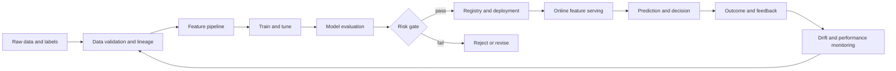
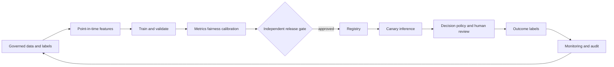

# Machine Learning Testing — Senior Test Engineer / Test Architect Interview Guide

## 1. Interview Expectations at 15+ Years

A senior engineer should validate training/serving data, labels, features, split strategy, metrics, thresholds, model artifacts, inference contracts, and production behavior. A Lead standardizes reproducibility and ownership across data science and engineering. A Test Architect designs quality gates across data/model/serving/monitoring while balancing statistical uncertainty and business cost. Staff/Principal candidates influence lifecycle governance, fairness, rollback, and organizational model risk without presenting a metric as proof of safety.

Metric selection must follow the decision objective. Scikit-learn distinguishes prediction quality from decision making and documents that classification metrics behave differently under class imbalance; its tools support multiple metrics and threshold analysis. [1] TensorFlow Data Validation documents schema checks, training-serving skew, and drift as distinct checks rather than one generic “data quality” score. [2]

## 2. Technology Overview

An ML system includes data acquisition, labeling, feature engineering, training, evaluation, packaging, serving, and feedback. Testing covers deterministic contracts (schema, feature order, serialization, permissions, latency) and statistical properties (generalization, calibration, subgroup performance, robustness, drift). The system can fail before model training through leakage or bad labels, during deployment through preprocessing mismatch, or after deployment through changing populations and feedback loops.

Do not evaluate only model artifacts. Validate the whole decision system: thresholds, fallback, feature freshness, online/offline parity, latency, cost, monitoring, and rollback. A good offline metric can coexist with a poor business outcome or unacceptable subgroup harm.

## 3. Core Concepts

### Data, labels, and leakage
**What:** Inputs, target definitions, and information boundaries. **Why:** Invalid data or future information can create impressive but non-generalizable results. **How:** Validate schema, ranges, missingness, lineage, label windows, and point-in-time feature availability. **Testing:** temporal split, leakage probes, label audits, training-serving comparison. **Failure modes:** target leakage, duplicates across splits, delayed labels. **Production:** version source snapshots and label policies.

### Evaluation design and metrics
**What:** A split and score that estimate relevant future performance. **Why:** Accuracy or a single aggregate can obscure class or cost-sensitive failures. **How:** Choose time/group split, baseline, per-class metrics, threshold, calibration, and uncertainty according to use. **Testing:** holdout discipline, confidence intervals, dummy baseline. **Failure modes:** test-set tuning, wrong positive class, unrepresentative evaluation. **Production:** revisit metrics when population or decision cost changes.

### Thresholds and calibration
**What:** Convert model scores/probabilities into decisions. **Why:** Decision costs and prevalence determine operating point. **How:** Select threshold on validation data and lock it before final test; calibrate probabilities if downstream decisions rely on them. **Testing:** confusion matrix across thresholds, cost curves, calibration. **Failure modes:** default 0.5 assumption, threshold drift. **Production:** monitor score and outcome distributions.

### Model and feature reproducibility
**What:** Version code, data, features, environment, model, and configuration. **Why:** Reproduction and rollback require the complete lineage. **How:** Immutable artifacts and manifests. **Testing:** deterministic seed where meaningful, training repeatability bounds, artifact checksum. **Failure modes:** non-deterministic kernels, moving upstream data, environment drift. **Production:** record versions with every prediction.

### Drift and production feedback
**What:** Data/feature/label/concept changes over time. **Why:** Performance can decay after deployment. **How:** Monitor schema, distribution, missingness, delayed outcomes, and service KPIs. **Testing:** injected drift, alert calibration, retraining and rollback rehearsal. **Failure modes:** proxy drift mistaken for model failure; labels arrive late. **Production:** distinguish covariate, label, and concept drift; establish owners and action thresholds.

## 4. Architecture



Tests belong at data ingestion, label creation, feature computation, model evaluation, artifact loading, serving contract, online/offline parity, decision threshold, and monitoring. Use representative, privacy-governed datasets. A model card or registry entry should include intended use, excluded use, metric definitions, subgroup results, training data lineage, and rollback artifact.

## 5. Top 50 Interview Questions

### Q1. How do you select evaluation metrics for an imbalanced classification problem?
**Difficulty:** Medium | **Stage:** Technical Screen
- **Testing:** Metric judgment and business framing.
- **Senior answer:** Start from error costs and operational capacity. Report confusion matrix, per-class precision/recall, PR-AUC for rare positive retrieval, and threshold-specific workload. Accuracy alone can be misleading.
- **Architect answer:** Include confidence, calibration, subgroup slices, and downstream utility; align gate with decision costs.
- **Scenario:** Fraud prevalence is 0.2%; a model predicts all transactions as legitimate and has high accuracy.
- **Follow-ups:** When ROC-AUC is useful? How choose threshold?
- **Weak answer:** “Use accuracy because it is standard.”
- **Probe/exercise:** Compare two models with equal ROC-AUC but different precision at operational capacity.

### Q2. Explain precision, recall, F1, ROC-AUC, and PR-AUC in a decision context.
**Difficulty:** Medium | **Stage:** Technical Screen
- **Testing:** Metric interpretation.
- **Senior answer:** Precision measures positive prediction purity; recall measures positive capture; F1 balances them at one threshold. ROC-AUC ranks positive above negative over thresholds; PR-AUC focuses on positive-class precision/recall and is informative for rare positives, with prevalence affecting baseline.
- **Architect answer:** None alone captures business cost, calibration, or chosen operating point; report the metric at a deployable threshold.
- **Scenario:** Screening team can review only 500 alerts/day.
- **Follow-ups:** Macro vs weighted? What does calibration add?
- **Weak answer:** “AUC is model accuracy.”
- **Probe/exercise:** Define a metric dashboard for a rare-event classifier.

### Q3. How do you detect target leakage and train/test leakage?
**Difficulty:** Hard | **Stage:** Technical Deep Dive
- **Testing:** Data lineage and temporal reasoning.
- **Senior answer:** Verify each feature is available at prediction time; split by entity/time as appropriate; check duplicate and near-duplicate records across splits; inspect feature-target correlation and pipeline fit boundaries.
- **Architect answer:** Enforce point-in-time feature joins and lineage checks; independent review for target definitions and post-outcome fields.
- **Scenario:** A “days until closure” field predicts whether a claim closes.
- **Follow-ups:** Why can random split be invalid? How detect proxy leakage?
- **Weak answer:** “Random split prevents leakage.”
- **Probe/exercise:** Review a feature timestamp later than prediction timestamp.

### Q4. How do you choose random, grouped, or temporal validation?
**Difficulty:** Hard | **Stage:** Technical Deep Dive
- **Testing:** Generalization target alignment.
- **Senior answer:** Random split when examples are independent and deployment resembles IID sampling; group by customer/device when correlated records exist; temporal split when future deployment matters.
- **Architect answer:** Match split to deployment and retraining cadence; reserve a final test not repeatedly used for model selection.
- **Scenario:** Multiple transactions per customer span train and test.
- **Follow-ups:** How handle cold-start users? How do rolling backtests help?
- **Weak answer:** “Always use 80/20 random split.”
- **Probe/exercise:** Choose split for demand forecast with seasonal data.

### Q5. What is the difference between data drift, concept drift, and label drift?
**Difficulty:** Medium | **Stage:** Technical Deep Dive
- **Testing:** Monitoring taxonomy.
- **Senior answer:** Data/covariate drift changes input distribution; concept drift changes relationship between input and outcome; label drift changes target prevalence/distribution. They require different evidence and response.
- **Architect answer:** Monitor input signals continuously and outcome-linked quality when labels mature; don't retrain automatically from a drift alert alone.
- **Scenario:** Marketing campaign shifts input mix while fraud behavior remains stable.
- **Follow-ups:** How monitor concept drift with delayed labels? What action does drift trigger?
- **Weak answer:** “Any distribution change means model is broken.”
- **Probe/exercise:** Classify three observed shifts and propose evidence.

### Q6. How do you validate feature parity between offline training and online inference?
**Difficulty:** Hard | **Stage:** Technical Deep Dive
- **Testing:** Training-serving skew.
- **Senior answer:** Compare feature definitions, transformations, null/default behavior, timestamps, encoding, and outputs on shared golden examples. Validate online feature freshness and point-in-time semantics.
- **Architect answer:** Use shared transformation code or contract tests, shadow comparison, feature lineage, and alert thresholds.
- **Scenario:** Offline timezone conversion differs from online and shifts a risk score.
- **Follow-ups:** How test streaming features? What if exact parity is impossible?
- **Weak answer:** “Both use the same column name.”
- **Probe/exercise:** Define golden vectors for an online/offline feature.

### Q7. How do you test labels and label quality?
**Difficulty:** Hard | **Stage:** Technical Deep Dive
- **Testing:** Ground truth reliability.
- **Senior answer:** Define target and observation window, check missing/conflicting labels, delayed outcomes, annotator agreement, and adjudication. Audit samples against source evidence.
- **Architect answer:** Version label policy, estimate label noise, separate unknown from negative, and measure impact of changes.
- **Scenario:** “No fraud found” includes unresolved investigations.
- **Follow-ups:** How handle censoring? What does inter-rater agreement mean?
- **Weak answer:** “Labels come from the database, so they are correct.”
- **Probe/exercise:** Design a label QA sample and reconciliation.

### Q8. How do you test reproducibility of a model training pipeline?
**Difficulty:** Hard | **Stage:** Technical Deep Dive
- **Testing:** Lineage and variance bounds.
- **Senior answer:** Version code, data, features, dependencies, seed, configuration, and artifact; rerun and compare metrics/predictions within justified tolerance. Some hardware ops remain nondeterministic.
- **Architect answer:** Separate bitwise reproducibility from statistical reproducibility; store manifests and immutable artifact hashes.
- **Scenario:** Same commit produces different validation score on another cluster.
- **Follow-ups:** What must be pinned? When is exact match unrealistic?
- **Weak answer:** “Set random_state and it is reproducible.”
- **Probe/exercise:** Draft model-run manifest fields.

### Q9. Why can accuracy be misleading for a rare positive class?
**Difficulty:** Medium | **Stage:** Technical Screen
- **Testing:** Imbalance awareness.
- **Senior answer:** Predicting the majority class can produce high accuracy while missing nearly every positive. Pair accuracy with positive-class recall/precision, PR analysis, confusion matrix, and cost.
- **Architect answer:** Include expected alert volume, capacity, and prevalence shifts.
- **Scenario:** 99.8% legitimate events yields 99.8% accuracy for a useless classifier.
- **Follow-ups:** What baseline would you use? How compare prevalence changes?
- **Weak answer:** “99% accuracy is production-ready.”
- **Probe/exercise:** Compute the all-negative baseline and explain it.

### Q10. How do you choose a classification threshold?
**Difficulty:** Hard | **Stage:** Technical Deep Dive
- **Testing:** Decision-policy design.
- **Senior answer:** Select on validation data using costs, target recall/precision, and operational capacity. Lock threshold before final test and report confusion matrix at that threshold.
- **Architect answer:** Include calibration, capacity constraints, segment impacts, and policy ownership; monitor threshold performance as prevalence changes.
- **Scenario:** Lowering threshold catches more fraud but doubles analyst workload.
- **Follow-ups:** How optimize expected cost? What if costs are uncertain?
- **Weak answer:** “Use 0.5.”
- **Probe/exercise:** Choose threshold under a 1,000-review/day limit.

### Q11. What does calibration mean, and when does it matter?
**Difficulty:** Hard | **Stage:** Technical Deep Dive
- **Testing:** Probability semantics.
- **Senior answer:** Among cases assigned probability near 0.8, roughly 80% should be positive over appropriate population. It matters for risk pricing, thresholding, and downstream decisions; ranking quality alone is insufficient.
- **Architect answer:** Assess reliability diagrams and proper scores like Brier/log loss, by cohort/time; recalibrate only with valid data and validation.
- **Scenario:** High-risk decisions rely on predicted probability as expected loss.
- **Follow-ups:** Can calibration worsen ranking? How monitor with delayed labels?
- **Weak answer:** “Softmax outputs are calibrated probabilities.”
- **Probe/exercise:** Explain how you would test a probability bin.

### Q12. When is ROC-AUC insufficient, and why might PR-AUC be preferred?
**Difficulty:** Hard | **Stage:** Technical Deep Dive
- **Testing:** Metric suitability under prevalence.
- **Senior answer:** ROC-AUC can look strong with many true negatives while positive precision remains poor. PR metrics focus on positive retrieval; the baseline depends on class prevalence.
- **Architect answer:** Choose based on actual operating point, prevalence, and cost; report curves and workload, not only area.
- **Scenario:** Rare disease alert classifier.
- **Follow-ups:** Does PR-AUC equal trapezoidal area in every library? How compare across prevalence?
- **Weak answer:** “ROC-AUC is always the most robust metric.”
- **Probe/exercise:** Contrast two PR curves at same ROC-AUC.

### Q13. How do you test feature engineering transformations?
**Difficulty:** Medium | **Stage:** Coding / Deep Dive
- **Testing:** Deterministic transformation contracts.
- **Senior answer:** Unit-test nulls, boundaries, timezone, category mapping, overflow, and unknown values; compare training and serving outputs on golden inputs.
- **Architect answer:** Treat feature definitions as versioned contracts with lineage and compatibility; validate distribution after transformation.
- **Scenario:** New enum silently maps to zero and changes predictions.
- **Follow-ups:** How test high-cardinality features? How test point-in-time joins?
- **Weak answer:** “Model metrics cover feature code.”
- **Probe/exercise:** Write boundary cases for age bucketing.

### Q14. How do you validate a model artifact and inference API?
**Difficulty:** Medium | **Stage:** Technical Screen
- **Testing:** Serving contract.
- **Senior answer:** Validate loadability, input schema, output shape/range, version metadata, deterministic examples where appropriate, invalid input handling, and timeout behavior.
- **Architect answer:** Include backward compatibility, resource limits, access control, and canary rollback.
- **Scenario:** Model loads but expects reordered feature columns.
- **Follow-ups:** How enforce schema version? How test batch and online modes?
- **Weak answer:** “Prediction endpoint returns HTTP 200.”
- **Probe/exercise:** Define contract assertions for one binary classifier.

### Q15. How do you test fairness or subgroup performance?
**Difficulty:** Hard | **Stage:** Technical Deep Dive
- **Testing:** Slice analysis and policy reasoning.
- **Senior answer:** Predefine relevant groups and outcomes; report errors, calibration, sample counts, and uncertainty; involve domain/legal experts in interpretation.
- **Architect answer:** Include intersectional slices, data coverage, proxy risks, mitigations, and monitoring; no universal parity metric resolves all fairness questions.
- **Scenario:** Aggregate recall improves while false negatives rise for one underserved group.
- **Follow-ups:** What if sample size is small? Which feature use is permitted?
- **Weak answer:** “Remove protected attributes and fairness is solved.”
- **Probe/exercise:** Design a fairness review table.

### Q16. How do you test robustness under distribution shift?
**Difficulty:** Hard | **Stage:** Technical Deep Dive
- **Testing:** Stress scenarios and uncertainty.
- **Senior answer:** Evaluate known shifts, boundary/rare slices, missing/noisy features, seasonality, and out-of-domain inputs; compare against a baseline and fallback.
- **Architect answer:** Separate plausible operational shift from arbitrary perturbation; document supported domain and confidence limitations.
- **Scenario:** Product launch brings new geography and device types.
- **Follow-ups:** How select perturbations? What is a safe fallback?
- **Weak answer:** “Test random noise.”
- **Probe/exercise:** Build a stress suite for a demand forecast.

### Q17. How do you identify and prevent feature leakage during feature-store joins?
**Difficulty:** Very Hard | **Stage:** Technical Deep Dive
- **Testing:** Temporal correctness.
- **Senior answer:** Join features as of prediction timestamp, enforce event-time and availability-time, and test that no future event is included. Validate late arrivals and backfills.
- **Architect answer:** Store point-in-time semantics in feature contracts, lineage, and replay tests; code review alone is insufficient.
- **Scenario:** A transaction outcome arrives after prediction but is backfilled into historical features.
- **Follow-ups:** Event time versus processing time? How handle corrections?
- **Weak answer:** “Join on customer ID.”
- **Probe/exercise:** Write a temporal join invariant.

### Q18. How do you validate model performance estimates after hyperparameter tuning?
**Difficulty:** Hard | **Stage:** Technical Deep Dive
- **Testing:** Selection bias awareness.
- **Senior answer:** Tune on training/validation or nested CV; keep a final untouched test set for one-time evaluation. Use group/time-aware folds when data structure demands it.
- **Architect answer:** Track all experiments and prevent test-set reuse; account for model selection and uncertainty.
- **Scenario:** Team iterates on model until final test improves.
- **Follow-ups:** What is nested CV? What if data is scarce?
- **Weak answer:** “The final test score is unbiased even if used for tuning.”
- **Probe/exercise:** Draw data split boundaries.

### Q19. How do you test a model with delayed ground-truth labels?
**Difficulty:** Hard | **Stage:** Production
- **Testing:** Delayed outcome evaluation.
- **Senior answer:** Track prediction cohort and label maturity, monitor proxies separately, backfill confirmed metrics, and avoid treating unlabeled as negative.
- **Architect answer:** Define label windows, censoring, alert thresholds, and outcome ownership; compare mature cohorts only.
- **Scenario:** Default outcomes mature six months after credit decision.
- **Follow-ups:** Which proxy can be used safely? How avoid survivorship bias?
- **Weak answer:** “Use today's labels for yesterday's traffic.”
- **Probe/exercise:** Design a cohort maturity table.

### Q20. How do you test explainability outputs?
**Difficulty:** Hard | **Stage:** Technical Deep Dive
- **Testing:** Explanation fidelity and user purpose.
- **Senior answer:** Validate stability and consistency with model behavior using perturbation or known cases; distinguish local explanation from causal explanation.
- **Architect answer:** Align explanations with decision policy and audience; monitor unsupported justifications and maintain auditability.
- **Scenario:** Explanation cites a feature not used in actual inference due to stale explainer.
- **Follow-ups:** How test explanation stability? Can feature attribution prove causality?
- **Weak answer:** “SHAP makes the model explainable.”
- **Probe/exercise:** Design a consistency test for a top-factor explanation.

### Q21. Offline metrics are strong, but online conversion falls after launch. Investigate.
**Difficulty:** Very Hard | **Stage:** Production Debugging
- **Testing:** Offline-online gap investigation.
- **Senior answer:** Verify serving feature parity, population/split shift, threshold, latency, UI behavior, assignment and exposure, and metric instrumentation. Compare by cohort and rollout.
- **Architect answer:** Use shadow/canary or randomized experiment when appropriate; distinguish model effect from product and selection effects.
- **Scenario:** Offline features use completed-day aggregates unavailable online.
- **Follow-ups:** How prove causality? What does shadow mode miss?
- **Weak answer:** “Model overfit; retrain.”
- **Probe/exercise:** Build a layer-by-layer investigation plan.

### Q22. Production score distribution shifts sharply, but labels are not available yet. What do you do?
**Difficulty:** Hard | **Stage:** Production Debugging
- **Testing:** Drift response without ground truth.
- **Senior answer:** Check upstream schema, feature missingness, data volume, transformations, and population. Compare alert and prediction rates; treat as warning, not proof of quality loss.
- **Architect answer:** Apply predefined guardrails/fallback if risk demands; retain cohort and wait for matured labels while sampling expert review.
- **Scenario:** New upstream null encoding maps missing to zero.
- **Follow-ups:** Which signals can block? What is the rollback trigger?
- **Weak answer:** “Distribution drift proves concept drift.”
- **Probe/exercise:** Specify safe actions by drift severity.

### Q23. AUC improves but business loss gets worse. Explain possible causes.
**Difficulty:** Hard | **Stage:** Technical Deep Dive
- **Testing:** Ranking metric versus decision utility.
- **Senior answer:** Threshold, calibration, prevalence, cost asymmetry, workload, subgroup distribution, or implementation may change. Evaluate expected cost and actual decision policy.
- **Architect answer:** Model-selection objective should reflect constrained business utility and fairness/safety guardrails; AUC is not a deployment objective by itself.
- **Scenario:** Fraud model ranks well but misses high-value fraud and overloads review team.
- **Follow-ups:** How calculate expected loss? Which threshold population?
- **Weak answer:** “Business metric must be noisy.”
- **Probe/exercise:** Construct a cost matrix and compare thresholds.

### Q24. Training-serving skew appears only for categorical features. Diagnose.
**Difficulty:** Hard | **Stage:** Production Debugging
- **Testing:** Preprocessing parity.
- **Senior answer:** Compare vocabulary, unknown handling, casing, Unicode, nulls, category order, and encoding version; replay same inputs through both paths.
- **Architect answer:** Shared transformation library or schema contract, canary feature comparison, and rollback to compatible artifact.
- **Scenario:** Online unseen category maps to index zero, but offline maps to a dedicated unknown token.
- **Follow-ups:** How test high-cardinality drift? How version vocabulary?
- **Weak answer:** “Retrain on production data.”
- **Probe/exercise:** Create parity test cases for unknown/null categories.

### Q25. Model performance regresses for a small cohort while overall metrics are stable. What next?
**Difficulty:** Very Hard | **Stage:** Production Debugging
- **Testing:** Slice-sensitive risk.
- **Senior answer:** Validate sample size/labels, identify cohort and feature shifts, assess severity and impact, review policy constraints, and consider targeted mitigation.
- **Architect answer:** Do not dismiss low-volume severe harm; use confidence intervals and domain review, assess support and rollback options.
- **Scenario:** Rural customers experience higher false declines.
- **Follow-ups:** When can you aggregate cohorts? How respond before statistical certainty?
- **Weak answer:** “Overall KPI is green.”
- **Probe/exercise:** Create a severity-aware escalation matrix.

### Q26. Shadow predictions differ from the active model. How do you investigate safely?
**Difficulty:** Hard | **Stage:** Production Debugging
- **Testing:** Controlled comparison and side-effect safety.
- **Senior answer:** Confirm both models receive equivalent features and timestamps; compare score and decision distributions, latency, and subgroup outcomes without affecting users.
- **Architect answer:** Record model/feature versions and avoid downstream side effects; define exposure and data governance for shadow traffic.
- **Scenario:** Candidate model consumes a newer feature snapshot.
- **Follow-ups:** What does shadow mode not measure? How decide promotion?
- **Weak answer:** “Higher scores mean better model.”
- **Probe/exercise:** Define shadow comparison metrics.

### Q27. Retraining runs automatically after drift. What tests and controls are required?
**Difficulty:** Very Hard | **Stage:** Architecture
- **Testing:** MLOps release automation.
- **Senior answer:** Validate input data, labels, lineage, model metrics, safety/fairness slices, artifact contract, and deployment readiness. Drift alone should not auto-promote.
- **Architect answer:** Separate retraining trigger from promotion; require candidate evaluation, human/automated approvals, canary, rollback, and budget controls.
- **Scenario:** Poisoned or corrupted batch retrains model and degrades results.
- **Follow-ups:** Who signs off? How roll back both model and feature pipeline?
- **Weak answer:** “Retrain nightly and deploy best score.”
- **Probe/exercise:** Draw retrain versus promote state machine.

### Q28. How do you test an ML model rollback?
**Difficulty:** Hard | **Stage:** Architecture
- **Testing:** Operational reversibility.
- **Senior answer:** Deploy previous artifact and compatible feature schema, verify routing, latency, decision behavior, and monitoring; rehearse under load.
- **Architect answer:** Include registry, feature transformations, thresholds, dependencies, and data compatibility; rollback may require coordinated versions.
- **Scenario:** New model requires feature v3 while old model expects v2.
- **Follow-ups:** Can model rollback restore old data? How long to recover?
- **Weak answer:** “Point endpoint to prior model.”
- **Probe/exercise:** Create rollback checklist.

### Q29. How would you evaluate an ML model under changing prevalence?
**Difficulty:** Hard | **Stage:** Technical Deep Dive
- **Testing:** Prevalence and metric sensitivity.
- **Senior answer:** Recompute precision, expected workload, calibration, and utility under realistic prevalence scenarios; ROC ranking may stay stable while precision changes.
- **Architect answer:** Use representative temporal/cohort samples and policy threshold monitoring; update base rates without leakage.
- **Scenario:** Fraud prevalence triples during a seasonal event.
- **Follow-ups:** Which metrics are prevalence-sensitive? How adjust thresholds?
- **Weak answer:** “AUC is prevalence-invariant, so no changes needed.”
- **Probe/exercise:** Estimate alert volume at two prevalence levels.

### Q30. How do you test a feature store or shared feature pipeline used by many models?
**Difficulty:** Very Hard | **Stage:** Architecture
- **Testing:** Shared contract and blast-radius management.
- **Senior answer:** Validate feature schema, freshness, null/default semantics, point-in-time behavior, access, and online/offline parity with contract suites.
- **Architect answer:** Version features, consumers, lineage, deprecation, shadow migration, and compatibility; shared pipeline changes need impact analysis.
- **Scenario:** Feature rename silently changes multiple models.
- **Follow-ups:** How identify consumers? How stage breaking schema changes?
- **Weak answer:** “Each model team tests its own output.”
- **Probe/exercise:** Design a backward-compatible feature evolution.

### Q31. Design an end-to-end validation system for a credit-risk model.
**Difficulty:** Very Hard | **Stage:** Architecture
- **Testing:** High-impact decision lifecycle.
- **Senior answer:** Validate data/labels, temporal split, calibrated model, threshold and policy, subgroup behavior, serving contract, and monitoring.
- **Architect answer:** Include governance, audit trail, adverse-action explanation, privacy, human escalation, canary, rollback, and model inventory.
- **Scenario:** AUC increases but approval rates diverge by region.
- **Follow-ups:** What is hard-blocked? Who owns threshold?
- **Weak answer:** “Approve if AUC exceeds target.”
- **Probe/exercise:** Whiteboard data-to-decision control points.

### Q32. Design an ML CI/CD quality gate for many teams.
**Difficulty:** Very Hard | **Stage:** Architecture
- **Testing:** Reusable governance without one-size-fits-all metrics.
- **Senior answer:** Common checks for data/schema, leakage, artifact load, lineage, serving contract, and team-defined task metrics.
- **Architect answer:** Risk tiers, versioned templates, policy-as-code, exceptions, evidence store, canary/rollback, and audit.
- **Scenario:** Ranking, forecasting, and classification teams need different metrics.
- **Follow-ups:** Which checks are universal? How enforce ownership?
- **Weak answer:** “Set a 90% accuracy gate for all models.”
- **Probe/exercise:** Design standard gate plus domain plugin.

### Q33. Design a model monitoring system with delayed labels.
**Difficulty:** Very Hard | **Stage:** Architecture
- **Testing:** Production monitoring design.
- **Senior answer:** Monitor data contracts, missingness, score and decision distributions, latency, and proxies; link predictions to outcomes for later cohort scoring.
- **Architect answer:** Use label maturity, uncertainty, alert ownership, feedback bias checks, and intervention policies; separate early warnings from confirmed performance.
- **Scenario:** Outcome label matures 90 days after prediction.
- **Follow-ups:** What alerts immediately? Which metrics wait for labels?
- **Weak answer:** “Monitor accuracy in real time.”
- **Probe/exercise:** Draw leading versus lagging indicators.

### Q34. Design a training-serving parity test strategy for batch and online features.
**Difficulty:** Very Hard | **Stage:** Architecture
- **Testing:** Feature correctness and temporal semantics.
- **Senior answer:** Golden inputs, shared transformations, point-in-time joins, parity tolerances, null behavior, and freshness assertions.
- **Architect answer:** Replay production-safe samples, version feature definitions, shadow compare, and ensure no future leakage.
- **Scenario:** Batch features refresh daily; online feature updates per event.
- **Follow-ups:** How handle late events? What is acceptable numeric tolerance?
- **Weak answer:** “Compare average feature values.”
- **Probe/exercise:** Define row-level and distribution-level parity checks.

### Q35. Design a fairness and robustness evaluation for a model upgrade.
**Difficulty:** Very Hard | **Stage:** Architecture
- **Testing:** Risk coverage and statistical validity.
- **Senior answer:** Evaluate overall and subgroup performance, calibration, threshold outcomes, plausible shifts, and confidence; involve relevant experts.
- **Architect answer:** Pre-register slices and non-inferiority margins, account for multiple comparisons, set severe-harm gates, and retain review process.
- **Scenario:** Small subgroup has only 120 labeled examples.
- **Follow-ups:** How respond to uncertainty? How avoid proxy harm?
- **Weak answer:** “Run demographic parity once.”
- **Probe/exercise:** Draft a release table with uncertainty and disposition.

### Q36. Design a canary and A/B strategy for an ML ranking model.
**Difficulty:** Architect | **Stage:** Architecture
- **Testing:** Online comparison and interference.
- **Senior answer:** Start with shadow for correctness/cost, then limited randomized exposure with guardrails and outcome metrics; assign consistently to avoid contamination.
- **Architect answer:** Define experiment unit, sample size, stop rules, novelty/learning effects, fairness slices, and rollback.
- **Scenario:** New ranking increases clicks but lowers long-term retention.
- **Follow-ups:** Which metric is primary? How address delayed outcomes?
- **Weak answer:** “Ship the variant with more clicks.”
- **Probe/exercise:** Define primary and guardrail metrics.

### Q37. Design an ML test dataset strategy that protects privacy and reproducibility.
**Difficulty:** Very Hard | **Stage:** Architecture
- **Testing:** Data governance.
- **Senior answer:** Version immutable snapshots, de-identify/minimize, record provenance and access, and maintain synthetic/representative cases with known limits.
- **Architect answer:** Retention/deletion lineage, consent and purpose constraints, reproducible feature materialization, and controlled holdouts.
- **Scenario:** Data deletion request affects historical training records.
- **Follow-ups:** What does deletion mean for trained artifacts? How prove lineage?
- **Weak answer:** “Copy production into a test bucket.”
- **Probe/exercise:** Specify metadata and access policies.

### Q38. How do you test a recommendation system for feedback loops?
**Difficulty:** Very Hard | **Stage:** Architecture
- **Testing:** Dynamic system behavior.
- **Senior answer:** Measure exposure and selection bias, use counterfactual/off-policy evaluation cautiously, track diversity and long-term outcomes, and run controlled experiments.
- **Architect answer:** Include exploration policy, fairness and ecosystem effects, feedback delay, and rollback; avoid optimizing short-term clicks alone.
- **Scenario:** Recommendations reinforce already popular content.
- **Follow-ups:** What can offline replay establish? How define diversity?
- **Weak answer:** “Precision@K is sufficient.”
- **Probe/exercise:** Define metrics for relevance and exposure concentration.

### Q39. Design a model registry and promotion policy.
**Difficulty:** Architect | **Stage:** Architecture
- **Testing:** Artifact provenance and deployment controls.
- **Senior answer:** Store model/data/code/config versions, metrics, intended use, and approval state; promote only evaluated artifacts.
- **Architect answer:** Enforce lineage, signatures, access control, compatibility, canary, rollback, and audit across environments.
- **Scenario:** A manually copied artifact bypasses evaluation.
- **Follow-ups:** Who can approve? How revoke compromised model?
- **Weak answer:** “Put model files in object storage.”
- **Probe/exercise:** Draw candidate-to-production state machine.

### Q40. How do you measure ML testing value beyond model accuracy?
**Difficulty:** Architect | **Stage:** Manager / Director
- **Testing:** Outcome and risk measurement.
- **Senior answer:** Track escaped defects, training-serving incidents, decision cost, fairness/safety findings, time to diagnose, and reproducibility.
- **Architect answer:** Assess risk reduction and decision quality against lifecycle cost; accuracy is only one component.
- **Scenario:** More tests increase release time but fail to catch label incidents.
- **Follow-ups:** Which testing investment would you remove? How quantify prevented risk?
- **Weak answer:** “We test 100% of models.”
- **Probe/exercise:** Build an ML quality scorecard with independent dimensions.

### Q41. A production model's recall drops after upstream data deployment. Investigate.
**Difficulty:** Very Hard | **Stage:** Production Debugging
- **Testing:** Cross-system RCA.
- **Senior answer:** Pin model/feature/data versions; inspect schema, nulls, category mappings, freshness, score distribution, threshold, and labels by cohort.
- **Architect answer:** Compare replay through old/new feature transforms, rollback upstream or model safely, and add a contract gate.
- **Scenario:** Null changes from absent to sentinel `-1`.
- **Follow-ups:** How separate model drift from data defect? What immediate containment?
- **Weak answer:** “Retrain model.”
- **Probe/exercise:** Build a timeline with evidence sources.

### Q42. A model scores well in offline test but fails in production due to time leakage. How was this possible?
**Difficulty:** Hard | **Stage:** Production Debugging
- **Testing:** Temporal validation.
- **Senior answer:** Random split or retrospective feature computation included future values; recreate point-in-time features and use temporal holdout.
- **Architect answer:** Audit feature availability timestamps and label window; add automated as-of join checks and independent split review.
- **Scenario:** Customer aggregate includes post-default payments.
- **Follow-ups:** How test backfills? Which metric changes?
- **Weak answer:** “The model overfit.”
- **Probe/exercise:** Define feature-time invariant.

### Q43. A model upgrade lowers overall F1 but improves recall for a critical class. How decide?
**Difficulty:** Hard | **Stage:** Manager / Technical
- **Testing:** Multi-objective decision reasoning.
- **Senior answer:** Examine business cost, class-specific precision, workload, calibration, subgroup results, and threshold; do not choose from F1 alone.
- **Architect answer:** Apply policy-owned utility and safety constraints, evaluate uncertainty, and document residual trade-offs.
- **Scenario:** Critical defect detection favors recall despite extra false alerts.
- **Follow-ups:** Who sets costs? What if operations capacity is fixed?
- **Weak answer:** “Higher F1 is always best.”
- **Probe/exercise:** Make recommendation from a confusion matrix and capacity limit.

### Q44. Model artifact loads successfully but produces different online predictions. Diagnose.
**Difficulty:** Hard | **Stage:** Production Debugging
- **Testing:** Artifact and runtime parity.
- **Senior answer:** Compare preprocessing, feature order, package versions, model serialization, precision, defaults, and request schema on a golden vector.
- **Architect answer:** Deploy artifact with signed manifest, compatibility tests, and shadow parity before promotion.
- **Scenario:** Feature columns are alphabetically sorted online.
- **Follow-ups:** What tolerance is acceptable? How reproduce hardware differences?
- **Weak answer:** “The endpoint returned 200.”
- **Probe/exercise:** Define golden vector contract.

### Q45. Drift alert fires after a planned seasonal change. Should you retrain?
**Difficulty:** Hard | **Stage:** Production Debugging
- **Testing:** Alert interpretation.
- **Senior answer:** Verify expected seasonal shift, feature and score behavior, delayed labels, and business outcome. Compare against season-aware historical baseline; drift alone is not a retraining command.
- **Architect answer:** Have playbook distinguish expected, benign, and harmful drift; preserve approvals and rollback.
- **Scenario:** Holiday transaction mix shifts each year.
- **Follow-ups:** How adapt thresholds? What data validates retraining?
- **Weak answer:** “Any drift means retrain immediately.”
- **Probe/exercise:** Define decision tree for drift response.

### Q46. How do you choose between shadow, canary, and A/B deployment?
**Difficulty:** Architect | **Stage:** Architecture
- **Testing:** Deployment experiment fit.
- **Senior answer:** Shadow checks predictions and operational cost without affecting decisions; canary limits exposure; A/B compares outcomes with randomization when causal measurement is needed.
- **Architect answer:** Consider interference, delayed outcomes, safety, unit of randomization, and rollback; methods answer different questions.
- **Scenario:** Credit decision model cannot safely expose a large randomized cohort.
- **Follow-ups:** What can shadow not establish? How control contamination?
- **Weak answer:** “A/B is always the gold standard.”
- **Probe/exercise:** Select deployment mode for low-risk ranking vs high-stakes approval.

### Q47. What is your approach to ML test oracle uncertainty?
**Difficulty:** Hard | **Stage:** Technical Deep Dive
- **Testing:** Statistical oracle quality.
- **Senior answer:** Use independent holdouts, confidence intervals, baseline comparisons, repeated seeds where relevant, domain review, and calibrated metrics. Labels themselves can be uncertain.
- **Architect answer:** Predefine acceptable margins and risk-dependent evidence; separate measurement error from model variance and irreducible uncertainty.
- **Scenario:** Two models differ by 0.3 percentage points on a small cohort.
- **Follow-ups:** How choose sample size? What if labels disagree?
- **Weak answer:** “The test metric is the truth.”
- **Probe/exercise:** Describe uncertainty sources in an evaluation result.

### Q48. How do you test ML systems for security and adversarial robustness?
**Difficulty:** Hard | **Stage:** Security
- **Testing:** Threat model.
- **Senior answer:** Assess data poisoning, evasion, model extraction/privacy, input abuse, authorization, and artifact integrity according to system exposure; test rate limits and monitoring.
- **Architect answer:** Coordinate security, data science, legal, and product controls; isolate training sources and sign artifacts.
- **Scenario:** Public endpoint can be queried repeatedly to infer training membership.
- **Follow-ups:** Which risk is in scope? How test without exposing real data?
- **Weak answer:** “Models are not attack surfaces.”
- **Probe/exercise:** Draft threat model for public inference API.

### Q49. How do you test rollback when model, features, and threshold evolve together?
**Difficulty:** Architect | **Stage:** Architecture
- **Testing:** Coordinated release reversibility.
- **Senior answer:** Version all three; validate compatible tuples and rehearse restoring prior tuple with health checks.
- **Architect answer:** Model release manifest defines dependencies and migration; support expand/contract and dual-read where necessary.
- **Scenario:** New feature table is not backward-compatible with old model.
- **Follow-ups:** What if rollback data is gone? What is recovery SLO?
- **Weak answer:** “Keep the old model binary.”
- **Probe/exercise:** Define compatibility matrix for model/feature/threshold versions.

### Q50. Describe a production ML incident that changed your validation strategy.
**Difficulty:** Architect | **Stage:** Manager / Director
- **Testing:** Ownership and learning.
- **Senior answer:** Explain symptom, evidence, root cause, business impact, fix, recurrence guard, and metric. Separate personal contribution from team work.
- **Architect answer:** Show system and organizational prevention, residual risk, and how change was verified over time.
- **Scenario:** Feature pipeline silently changed null semantics.
- **Follow-ups:** What was missed? Which control was added and what did it cost?
- **Weak answer:** “We added more tests.”
- **Probe/exercise:** Prepare a concise incident review with measurable evidence.

## 6. Scenario-Based Interview Questions

1. **High accuracy on rare event:** calculate majority baseline; inspect recall/precision, PR curve, threshold workload, and expected cost.
2. **Recall falls after upstream release:** correlate feature/data versions and missingness; replay same examples through both transformations; rollback and add schema/semantic contract.
3. **Offline-online prediction gap:** verify point-in-time features, encoding, timezone, freshness, and model/config version; use golden replay.
4. **Overall metric stable, subgroup harmed:** confirm labels/sample confidence, assess severity, investigate shifted data and policy, contain if harm is material, add slice gate.
5. **Drift without labels:** treat as warning; inspect data contract and score distribution, sample expert review, wait for matured outcomes before claiming accuracy regression.
6. **AUC rises, expected loss increases:** compare calibration, threshold, prevalence, workload, and class-specific costs; choose by decision utility.
7. **Model artifact reproducibility failure:** compare data snapshot, code, library, feature transform, hardware, seed and nondeterministic operations; define reproducibility tolerance.
8. **Automatic retrain degrades model:** separate retrain from promotion; audit labels/data and candidate gate; rollback complete compatible tuple.
9. **Feature leakage discovered after launch:** disable affected feature/model, identify affected predictions, establish impact window, recompute point-in-time training and add leakage checks.
10. **Shadow model differs but has no user impact:** compare features and versions; assess quality offline, then canary/A-B if risk permits; shadow alone cannot prove business lift.

## 7. System Design / Test Architecture

### Design A: Credit-risk model quality lifecycle
**Problem/requirements:** Auditable and safe model changes with calibrated predictions, explainability, subgroup assessment, and rollback. **Proposed architecture:** governed source snapshots and labels, point-in-time feature pipeline, temporal evaluation, model registry, policy-owned threshold, canary serving, and outcome monitoring.



**Test strategy:** leakage, label quality, temporal split, calibration, subgroup, serving contract, threshold, explanation, audit. **Automation:** immutable manifests and policy gate. **Scalability:** stratified evaluation and sampled replay. **Performance:** online latency budget. **Reliability:** fallbacks and rollback tuple. **Observability:** model/feature/threshold version and cohort. **Security:** data minimization, access control, signed artifacts. **Cost:** training/evaluation budget. **Trade-offs:** review time vs risk. **Alternative:** human-in-loop decisions. **Follow-ups:** Which outcomes hard-block deployment?

### Design B: Shared feature platform for 100 models
**Problem/requirements:** Online/offline consistency, feature ownership, safe schema evolution. **Proposed architecture:** versioned feature definitions, point-in-time batch materialization, online serving store, lineage catalog, contract suite, shadow compare.

**Test strategy:** schema/range/freshness, as-of joins, null semantics, parity, access, performance. **Automation:** consumer impact checks and canary. **Scalability:** partition and freshness tiers. **Reliability:** stale-value behavior explicit. **Observability:** feature age/missingness and parity. **Security:** row-level access and PII classification. **Cost:** hot feature tier only for latency-critical use. **Trade-offs:** shared standard vs specialized model needs. **Alternative:** model-local features. **Follow-ups:** How deprecate feature version?

### Design C: Drift monitoring with delayed outcomes
**Problem/requirements:** Detect operational changes before labels mature without false claims of model degradation. **Proposed architecture:** immediate schema/distribution/score monitoring, cohort linkage, delayed outcome backfill, severity-aware alert routing.

**Test strategy:** injected schema shift, known seasonality, missing labels, alert deduplication. **Automation:** threshold calibration and response playbooks. **Scalability:** sketches/sampling for massive traffic. **Performance:** async metrics. **Reliability:** data gaps visible. **Observability:** alert confidence, cohort maturity. **Security:** avoid sensitive raw features. **Cost:** aggregate by useful segments. **Trade-offs:** early proxy alert vs confirmed quality. **Alternative:** periodic manual review. **Follow-ups:** What action does each signal trigger?

### Design D: Model promotion and rollback
**Problem/requirements:** Promote model, feature, threshold, and preprocessing as compatible versions. **Proposed architecture:** candidate package with manifest; deterministic/metric gates; registry approval; staged deployment; health monitor; atomic rollback tuple.

**Test strategy:** artifact load, schema, parity, canary, rollback drill. **Automation:** CI validation and signed provenance. **Scalability:** registry and concurrent training jobs. **Performance:** canary latency. **Reliability:** blue/green and safe fallback. **Observability:** version by prediction. **Security:** signatures and access control. **Cost:** retain necessary history. **Trade-offs:** atomic changes vs gradual migration. **Alternative:** backward-compatible feature schema. **Follow-ups:** What if data migration is irreversible?

### Design E: Fairness and robustness evaluation service
**Problem/requirements:** Standardized slice analysis with domain-specific policy and uncertainty. **Proposed architecture:** versioned dataset slices, metric registry, confidence reporting, expert review workflow, red-team/stress tests, approval evidence.

**Test strategy:** subgroup data coverage, label quality, threshold outcomes, plausible shift and adversarial cases. **Automation:** regression comparisons and report generation. **Scalability:** focused slices, privacy-preserving aggregation. **Performance:** parallel evaluations. **Reliability:** missing slice results fail closed for high-risk model. **Observability:** metric provenance and reviewers. **Security:** protected attribute governance. **Cost:** prioritize harms and intended use. **Trade-offs:** broad slice coverage vs low sample certainty. **Alternative:** model-specific review. **Follow-ups:** How handle contradictory metrics?

## 8. Hands-On Exercises

### Exercise 1: Threshold metrics under class imbalance
**Problem:** Evaluate a rare-event classifier at the threshold used in production. **Input:** `y_true`, predicted probabilities, review capacity. **Expected:** confusion matrix, precision, recall, and alert volume.
```python
from sklearn.metrics import confusion_matrix, precision_score, recall_score


def threshold_report(y_true, scores, threshold: float) -> dict[str, float | int]:
    predictions = [score >= threshold for score in scores]
    tn, fp, fn, tp = confusion_matrix(y_true, predictions, labels=[False, True]).ravel()
    return {
        "tn": int(tn), "fp": int(fp), "fn": int(fn), "tp": int(tp),
        "precision": float(precision_score(y_true, predictions, zero_division=0)),
        "recall": float(recall_score(y_true, predictions, zero_division=0)),
        "alerts": int(fp + tp),
    }
```
**Explanation:** Threshold metrics make operational trade-offs visible. **Complexity:** O(n) time, O(n) prediction list. **Production:** Validate positive-class encoding and capacity; calculate confidence intervals. **Follow-up:** Select threshold under a daily review cap.

### Exercise 2: Prevent temporal leakage
**Problem:** Assert every feature's availability time is no later than prediction time. **Input:** DataFrame with `prediction_ts` and feature availability timestamps. **Expected:** fail with violating row IDs. **Solution:** compare timestamps after timezone normalization and reject late feature rows before training. **Explanation:** Event timestamp alone may not equal availability timestamp. **Complexity:** O(n × features). **Production:** Apply point-in-time join semantics. **Follow-up:** Handle late-arriving correction events.

### Exercise 3: Training-serving parity golden vectors
**Problem:** Compare offline/online feature outputs for representative raw examples. **Expected:** schema match and numeric tolerance per feature. **Solution:** version golden input/expected output, execute both transformations, compare nulls/categories/numeric tolerances. **Complexity:** O(n × features). **Production:** Keep examples privacy-safe and include unknown categories. **Follow-up:** What tolerance is valid for floating-point features?

### Exercise 4: Evaluate a model with temporal holdout
**Problem:** Prevent future information leakage in time-dependent data. **Input:** timestamped events and labels. **Expected:** train before cutoff, validation after cutoff, test on later untouched window. **Solution:** sort by time, define cutoff by business horizon, fit preprocessing only on train, freeze model before test. **Production:** Use rolling backtests for seasonality. **Follow-up:** How handle customers appearing across periods?

### Exercise 5: Code review of misleading metric gate
**Problem:** Review gate `if accuracy > .95: deploy`. **Expected:** identify imbalance, threshold, calibration, subgroup, uncertainty, leakage, and operational gaps. **Solution:** baseline plus task metrics and threshold cost; hard safety/fairness checks; artifact/serving contract; canary and rollback. **Performance:** Evaluation must remain within CI budget by risk tier. **Production:** Keep metric definitions versioned. **Follow-up:** What is the smallest useful PR gate?

## 9. Production Debugging Playbook

1. **Recall collapse after data deploy:** trace schema and feature versions; inspect null/default/value shifts and threshold; replay golden rows. Fix upstream or compatible transform, rollback if needed. Prevent with schema/semantic contracts; monitor class-specific outcomes.
2. **Train-serving skew:** compare same examples through offline and online paths; inspect encoding, timezone, freshness, and feature order. Root cause often duplicated preprocessing. Fix with shared transform/contract; monitor parity deltas.
3. **High offline score, weak online results:** inspect leakage, population, exposure, threshold, and instrumentation; use temporal holdout and cohort analysis. Add point-in-time feature checks; track online outcome maturity.
4. **Drift alert without label evidence:** inspect upstream changes, seasonality, score distribution, and operational impact; treat as warning and sample expert review. Avoid reflex retraining; monitor delayed labels.
5. **Rollback fails:** inspect model/feature/threshold compatibility, registry permissions, and routing. Fix versioned release manifests and rehearsed rollback; monitor recovery time and rollback success.

## 10. Architect-Level Trade-offs

| Decision | Option A | Option B | Choose A when | Choose B when | Trade-off |
|---|---|---|---|---|---|
| Split | Random | Temporal/group | IID, independent population | Future or correlated entities matter | Temporal split may reduce sample size |
| Metric | ROC-AUC | PR-AUC | Ranking across classes | Rare positive retrieval matters | Neither encodes business cost |
| Monitoring | Input drift | Outcome performance | Immediate warning needed | Labels mature quickly | Drift is not proof of failure |
| Features | Shared transform | Separate online/offline | Parity and governance matter | Different latency constraints | Shared code can constrain teams |
| Promotion | Auto deploy best metric | Risk-gated staged rollout | Low-risk, mature use | High-impact decisions | Gates cost time but protect users |
| Evaluation | One aggregate | Slice metrics | Simple low-risk task | Unequal harms or costs | Slice multiplicity increases uncertainty |

## 11. 10 Questions That Expose Surface-Level 15+ Year Experience

1. What leakage defect did your split strategy miss, and how did you discover it?
2. Which metric did the business initially request, and why was it inadequate?
3. How did you set and govern the decision threshold?
4. What was the largest training-serving skew incident you debugged?
5. What reproducibility guarantee did your pipeline actually provide?
6. Which cohort regressed while the aggregate looked healthy?
7. How did you handle labels that arrived months later?
8. What did drift monitoring trigger, and what did it explicitly not trigger?
9. How did you rehearse rollback across model and feature versions?
10. What did a model card or registry record that was operationally useful?

## 12. Top 10 Must-Master Questions

| Question | Why it matters | Weak answer | Strong answer | Follow-up |
|---|---|---|---|---|
| Q1 | Metrics | Accuracy only | Cost, class balance, threshold | Capacity? |
| Q3 | Leakage | Random split | Point-in-time evidence | Backfills? |
| Q4 | Validation | Always 80/20 | Deployment-aligned split | Cold start? |
| Q6 | Parity | Same names | Same transforms and timestamps | Replay? |
| Q10 | Decision | 0.5 threshold | Cost/capacity and locked validation | Prevalence shift? |
| Q11 | Probabilities | Softmax is calibrated | Calibration tests | Delayed labels? |
| Q15 | Fairness | Remove sensitive fields | Cohorts, uncertainty, harms | Small n? |
| Q21 | Online gap | Retrain | Layered diagnosis and experiment | Causal evidence? |
| Q27 | Retraining | Drift triggers deploy | Candidate gates, human/policy ownership | Poisoned data? |
| Q49 | Rollback | Old model file | Compatible tuple and rehearsal | Data migration? |

## 13. One-Day Revision Plan

| Time | Activity |
|---|---|
| 08:30–09:30 | Explain ML lifecycle, leakage, and split design aloud |
| 09:30–11:00 | Compute confusion matrix, threshold, PR/ROC, and calibration concepts |
| 11:15–12:30 | Whiteboard training-serving parity and feature lineage |
| 13:15–14:15 | Investigate drift, delayed labels, and online/offline gap scenarios |
| 14:15–15:15 | Design model gate, canary, registry, and rollback tuple |
| 15:30–16:30 | Practice fairness, robustness, and privacy review |
| 16:30–17:30 | Answer Q1–Q50 with follow-ups and concrete examples |
| 17:30–18:00 | Review metric cheat sheet and one production incident story |

## 14. Night-Before-Interview Cheat Sheet

- Metric selection follows the decision objective, not convention.
- Accuracy can hide failure on rare classes; always inspect confusion matrix and positive-class metrics.
- ROC-AUC is threshold-independent ranking; it does not select an operating point.
- PR metrics reveal rare-positive precision/recall; prevalence affects interpretation.
- Keep tuning separate from final test; use temporal/group splits where required.
- Check point-in-time feature availability to prevent leakage.
- Compare offline/online feature transformations with golden vectors.
- Drift is evidence of distribution change, not automatically performance loss.
- Monitor delayed outcomes by mature cohort; unknown is not negative.
- Version data, labels, features, code, environment, model, threshold, and serving config.
- Rollback must restore a compatible model-feature-threshold tuple.

## 15. Interview Cheat Sheet

| Concept | Key point | Common trap |
|---|---|---|
| Precision | TP / (TP + FP) | Ignore review burden |
| Recall | TP / (TP + FN) | Ignore false positives |
| F1 | Harmonic mean at selected threshold | Treat as business utility |
| ROC-AUC | Ranking across thresholds | Treat as accuracy |
| PR-AUC | Positive-class retrieval view | Compare without prevalence context |
| Calibration | Probability reliability | Assume raw scores are probabilities |
| Leakage | Feature unavailable at prediction time | Random split alone |
| Drift | Population changes | Auto-retrain every alert |
| Reproducibility | Full lineage and tolerances | Seed alone |
| Release gate | Metrics + safety + ops | One global score |

## 16. Senior vs Lead vs Test Architect

| Capability | Senior Engineer | Lead | Test Architect |
|---|---|---|---|
| Data/testing | Validates schemas and labels | Standardizes split and quality practice | Governs lineage and point-in-time contracts |
| Metrics | Selects and explains metrics | Aligns domain stakeholders | Designs risk-based decision gates |
| Production | Debugs skew and drift | Coordinates model/data owners | Builds monitor/rollback architecture |
| Scale | Tests artifacts and endpoints | Shares reusable tooling | Sets registry, feature, and deployment standards |
| Leadership | Delivers model quality | Mentors DS/DE/SWE collaboration | Influences model risk and governance strategy |

Mid-Level identifies metrics; Senior implements tests and explains failure; Lead standardizes processes; Architect manages lifecycle trade-offs; Staff/Principal changes cross-org quality strategy with technically credible evidence.

## 17. Interviewer Scorecard

| Competency | Evidence to seek |
|---|---|
| Data/labels | Lineage, point-in-time validity, label uncertainty |
| Evaluation | Metrics aligned to objective and class balance |
| Validation | Correct split, holdout discipline, uncertainty |
| Features | Training-serving parity and leakage controls |
| Deployment | Artifact, API, threshold, and rollback contract |
| Monitoring | Drift taxonomy and delayed outcomes |
| Fairness/security | Subgroup and threat-model reasoning |
| Architecture | Registry, gates, ownership, cost, observability |
| Communication | Clear trade-offs and honest limitations |

## 18. Final Interview Readiness Checklist

- [ ] Can choose metrics based on outcome costs and prevalence.
- [ ] Can explain precision/recall/F1/ROC-AUC/PR-AUC and threshold behavior.
- [ ] Can detect leakage and choose random/group/time splits appropriately.
- [ ] Can validate labels, features, schemas, and point-in-time joins.
- [ ] Can test training-serving parity and model artifact contracts.
- [ ] Can investigate data, feature, label, and concept drift separately.
- [ ] Can evaluate calibration, fairness, robustness, and delayed labels.
- [ ] Can design staged rollout, monitoring, and rollback.
- [ ] Can explain residual risk and metric uncertainty.
- [ ] Can whiteboard ML quality architecture end to end.

## Sources & Further Reading

1. **scikit-learn**, [Metrics and Scoring: Quantifying the Quality of Predictions](https://scikit-learn.org/stable/modules/model_evaluation.html), continuously maintained; accessed 2026-10-03. Useful for metric definitions, multi-metric evaluation, threshold reasoning, and metric selection by objective.
2. **scikit-learn**, [Tuning the Decision Threshold for Class Prediction](https://scikit-learn.org/stable/modules/classification_threshold.html), continuously maintained; accessed 2026-10-03. Useful for separating score ranking from classification decisions.
3. **TensorFlow / TFX**, [TensorFlow Data Validation: Checking and Analyzing Your Data](https://www.tensorflow.org/tfx/guide/tfdv), continuously maintained; accessed 2026-10-03. Useful for schema validation, training-serving skew, and drift detection.
4. **Google Cloud**, [What is ML Metadata?](https://www.tensorflow.org/tfx/guide/mlmd), continuously maintained; accessed 2026-10-03. Useful for tracking artifacts and lineage in ML pipelines.
5. **NIST**, [AI Risk Management Framework](https://www.nist.gov/itl/ai-risk-management-framework), 2023 with ongoing resources. Useful for lifecycle risk, measurement, and governance concepts.
