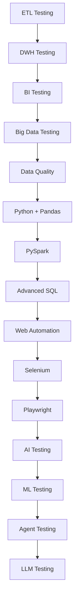

# Test Architect Interview Preparation

## Overview

This repository contains a comprehensive interview preparation system for senior test engineers, lead test engineers, test architects, and staff-level quality engineering roles. It is designed for candidates with 15+ years of experience targeting approximately ₹70 LPA (India) or $250K total annual compensation (USA).

The material covers 17 major technology areas in test engineering, from traditional ETL and data warehousing to modern AI/LLM/agent testing. Each file provides interview questions, architecture deep-dives, hands-on exercises, and production debugging scenarios.

## Candidate Target

- **Experience:** 15+ years
- **Roles:** Senior Test Engineer / Lead / Test Architect / Staff-level Quality Engineering / Data Quality Engineering
- **Expected Compensation:**
  - India: ₹70 LPA
  - USA: ~$250K annual total compensation
  - Other developed countries: comparable Senior/Staff/Architect-level packages

## Learning Path

## Files

| File | Technology | Focus |
|------|-----------|-------|
| 01-etl-testing.md | ETL Testing | Source-to-target validation, mapping specs, transformations, business rules, CDC, idempotency |
| 02-dwh-testing.md | DWH Testing | Star/snowflake schemas, SCDs, fact/dimension testing, conformed dimensions, lineage |
| 03-bi-testing.md | BI Testing | Dashboard validation, report validation, semantic models, measures, dimensions, KPIs, filters, slicers, drill-down, drill-through, calculated fields, DAX, Power Query, Tableau calculations, LOD, table calculations, row-level security, permissions, refresh, incremental refresh, stale data, extracts, DirectQuery, Import, dashboard performance, exports, Excel, PDF, visual validation, regression, Power BI, Tableau, Tableau Server/Cloud, Power BI Service, backend validation, BI automation |
| 04-big-data-testing.md | Big Data Testing | Hadoop, HDFS, Hive, Spark, PySpark, distributed processing, partitions, bucketing, shuffles, joins, broadcast joins, skew, serialization, Parquet, ORC, Avro, JSON, Delta Lake, schema evolution, batch, streaming, Kafka, exactly-once concepts, at-least-once concepts, checkpointing, watermarking, late data, deduplication, large-volume reconciliation, sampling, statistical validation, Spark UI, execution plans, cluster failures, cloud data lakes, Databricks, AWS, Azure, GCP |
| 05-data-testing-data-quality.md | Data Testing & Quality | Data-quality dimensions, completeness, accuracy, validity, uniqueness, consistency, timeliness, freshness, conformity, integrity, profiling, anomaly detection, schema validation, semantic validation, data contracts, lineage, metadata, data observability, data drift, schema drift, volume anomalies, distribution anomalies, null spikes, duplicates, outliers, quality gates, Great Expectations, Deequ, data observability concepts, SLAs, critical data elements, ownership, incident management, RCA, prevention, CI/CD, lakehouse quality, streaming data quality, ML input-data quality |
| 06-python-pandas-test-automation.md | Python + Pandas | Test automation, data validation, reconciliation, ETL validation, reusable libraries, PyTest, fixtures, parameterization, mocking, exception handling, logging, configuration, type hints, package structure, virtual environments, performance, memory, Pandas DataFrame operations, merge, join, concat, groupby, pivot, aggregation, missing values, duplicates, datatype validation, schema comparison, row comparison, CSV, Parquet, chunk processing, databases, APIs, reusable validators, CI/CD |
| 07-pyspark-test-automation.md | PySpark Test Automation | DataFrame testing, schema testing, transformations, joins, aggregations, windows, partitions, skew, null handling, duplicates, deterministic testing, local Spark, pytest, fixtures, SparkSession, temporary views, expected-vs-actual, golden datasets, row validation, aggregate validation, UDF testing, schema evolution, Delta Lake, streaming tests, watermarking, checkpoints, performance, execution plans, shuffle, caching, broadcast joins, CI/CD |
| 08-sql-senior-test-architect.md | Advanced SQL | Complex joins, self joins, anti joins, semi joins, CTE, recursive CTE, subqueries, correlated subqueries, window functions, ROW_NUMBER, RANK, DENSE_RANK, LEAD, LAG, running totals, rolling windows, gaps and islands, deduplication, latest-record logic, SCD2, source-target reconciliation, missing records, orphan records, duplicate detection, NULL, CASE, EXISTS, conditional aggregation, MERGE, transactions, isolation levels, locking, execution plans, indexes, partitioning, clustering, optimization, very large tables |
| 09-web-automation-testing.md | Web Automation Testing | Automation strategy, test pyramid, API/UI/component boundaries, E2E testing, Page Object Model, Screenplay, fixtures, test data, environment management, authentication, authorization, sessions, cookies, OAuth, API-assisted setup, network interception, SPAs, dynamic applications, asynchronous behavior, waits, flaky tests, retries, parallelization, sharding, cross-browser, responsive testing, accessibility, visual testing, performance considerations, CI/CD, Docker, Selenium Grid, cloud browsers, observability, screenshots, video, traces, failure diagnostics, maintainability, governance |
| 10-python-selenium.md | Python + Selenium | Selenium architecture, W3C WebDriver, Selenium 4, browsers, drivers, locators, XPath, CSS, dynamic elements, explicit waits, implicit waits, fluent waits, stale elements, frames, windows, tabs, alerts, cookies, JavaScript, uploads, downloads, authentication, Page Objects, utilities, pytest, fixtures, parameterization, parallel testing, Selenium Grid, remote execution, Docker, cloud execution, screenshots, logging, retries, flaky tests, CI/CD, framework architecture, test-data management, API/UI integration, WebDriver BiDi where relevant |
| 11-python-playwright.md | Python + Playwright | Playwright architecture, Browser, BrowserContext, Page, Locator, auto-waiting, locator strictness, role-based locators, test IDs, CSS/XPath, pytest-playwright, fixtures, sync API, async API, authentication state, storage state, network interception, route, fulfill, abort, API testing, contexts, parallelization, retries, sharding, traces, trace viewer, screenshots, video, debugging, downloads, uploads, popups, multiple pages, iframes, WebSockets, mocking, test data, POM, framework architecture, CI/CD, Docker, browsers, mobile emulation, visual testing, performance, flakiness, Selenium vs Playwright, AI-assisted testing / relevant current developments |
| 12-ai-testing.md | AI Testing | AI test strategy, deterministic vs probabilistic behavior, test oracles, evaluation datasets, golden datasets, property-based evaluation, statistical validation, robustness, hallucination, safety, bias/fairness, explainability, adversarial testing, prompt injection, sensitive data leakage, jailbreaks, AI regression, evaluation pipelines, human evaluation, LLM-as-a-judge, judge bias, evaluator reliability, AI-assisted test generation, self-healing automation, AI agents, production monitoring, telemetry, cost, latency, scalability, release gates, risk-based quality |
| 13-machine-learning-testing.md | ML Testing | Data testing, training data, labels, features, feature leakage, train/test leakage, validation strategy, cross-validation, reproducibility, accuracy, precision, recall, F1, ROC-AUC, PR-AUC, confusion matrix, threshold testing, calibration, imbalance, bias, fairness, robustness, adversarial testing, model drift, data drift, concept drift, label drift, feature drift, monitoring, retraining, rollback, shadow testing, A/B testing, canary deployment, offline vs online testing, model serving, feature stores, ML pipelines, MLOps, model versioning, data versioning, explainability, production incidents |
| 14-ai-agent-testing.md | AI Agent Testing | Agent architecture, planning, memory, tools, tool selection, tool arguments, tool failures, retries, loops, termination, state management, permissions, human-in-the-loop, guardrails, sandboxing, prompt injection, indirect prompt injection, goal hijacking, data exfiltration, unauthorized actions, trajectory evaluation, task success, partial success, tool-call accuracy, recovery, robustness, reliability, latency, cost, trace evaluation, synthetic scenarios, adversarial scenarios, offline evaluation, online evaluation, production telemetry, regression, release gates, multi-agent systems, agent-to-agent interaction, browser/computer-use agents, coding agents |
| 15-llm-testing.md | LLM Testing | LLM fundamentals relevant to testers, tokens, context windows, temperature, sampling, nondeterminism, prompt testing, prompt regression, structured output, JSON, tool calling, hallucination, factuality, faithfulness, relevance, completeness, groundedness, safety, toxicity, bias, prompt injection, jailbreaks, indirect prompt injection, system prompt leakage, sensitive data leakage, RAG, embeddings, chunking, retrieval, retrieval precision/recall, reranking, context quality, citation validation, RAG hallucination, evaluation datasets, golden sets, synthetic datasets, human evaluation, LLM-as-a-judge, judge calibration, position bias, verbosity bias, evaluator disagreement, pairwise evaluation, pointwise evaluation, regression, model upgrades, prompt versions, latency, cost, throughput, observability, production evaluation, release gates |

## Suggested Study Order

1. **Start with fundamentals:** 01-etl-testing.md, 02-dwh-testing.md, 03-bi-testing.md
2. **Move to data engineering:** 04-big-data-testing.md, 05-data-testing-data-quality.md
3. **Progress to automation:** 06-python-pandas-test-automation.md, 07-pyspark-test-automation.md
4. **SQL and web:** 08-sql-senior-test-architect.md, 09-web-automation-testing.md, 10-python-selenium.md, 11-python-playwright.md
5. **AI/ML frontier:** 12-ai-testing.md, 13-machine-learning-testing.md, 14-ai-agent-testing.md, 15-llm-testing.md

Study earlier files before later ones, as later topics build on concepts from earlier ones.

## Interview Preparation Strategy

### Study Phase
- Read each file actively — take notes on key concepts, trade-offs, and failure modes
- Create summary cards for each technology's core architecture and testing strategy
- Practice explaining concepts aloud without looking at the content

### Coding Phase
- Attempt all hands-on exercises in each file
- Write SQL queries from memory, refactor Python/PySpark code for clarity and performance
- Debug the provided scenarios, trace through root causes

### Practice Phase
- Whiteboard architecture diagrams from memory
- Explain trade-offs between competing approaches (e.g., Spark vs. Spark SQL, Selenium vs. Playwright)
- Conduct mock interviews with a peer, focusing on follow-up questions

### Review Phase
- Revisit weak areas using the "10 Questions That Expose Surface-Level Experience" sections
- Review the "Top 10 Must-Master Questions" and ensure you can answer each with enterprise depth
- Use the "One-Day Revision Plan" and "Night-Before-Interview Cheat Sheet" for final prep

## Final Readiness

Use the [Final Interview Readiness Checklist](tkk-TechLearn/Final-Interview-Readiness-Checklist.md) to self-assess across all competencies before facing interviews.

---

## How to Use This Repository

1. **Clone or download** the repository to your local machine
2. **Study each file** in the suggested order, or focus on areas relevant to your target role
3. **Complete hands-on exercises** to reinforce learning
4. **Practice whiteboarding** architecture diagrams and trade-off discussions
5. **Conduct mock interviews** using the question banks in each file
6. **Review the scorecard** and readiness checklist to identify gaps

---

**Last updated:** 2026-10-02

**Repository structure:** 16 markdown files covering ETL through LLM testing, plus supplementary materials