# Data Engineering — Top 35 Interview Questions & Answers

> **Target:** Senior / Lead / Staff-level Data Engineering interviews
> **Goal:** 70+ LPA product-based companies
> **How to use:** Learn the **Core Answer** first. Then learn the **Follow-ups**. In the actual interview, answer the Core Answer first and expand only when the interviewer probes deeper.

---

# 0. How to Answer Data Engineering Questions

For senior-level interviews, do not answer only with definitions.

Use this structure:

```text
1. Define the concept
        ↓
2. Explain why it matters
        ↓
3. Explain architecture / implementation
        ↓
4. Discuss scalability + performance
        ↓
5. Discuss reliability + failure handling
        ↓
6. Discuss security + governance
        ↓
7. Give a real project example
        ↓
8. Explain trade-offs
```

A strong answer sounds like:

> "It depends on the workload. I would first clarify the SLA, data volume, latency, source characteristics and consumption pattern. Then I would choose the architecture accordingly."

That sentence alone signals **senior engineering thinking**.

---

# 1. What is Data Engineering? What exactly does a Data Engineer do?

## Core Answer

* Data Engineering is the discipline of building systems that **ingest, store, transform, validate, govern, observe and serve data** reliably at scale.
* The main goal is not simply moving data.
* The goal is to make data:

  * **Available**
  * **Accurate**
  * **Consistent**
  * **Discoverable**
  * **Secure**
  * **Observable**
  * **Cost-efficient**
  * **Fit for analytics, ML and business applications**

### Typical lifecycle

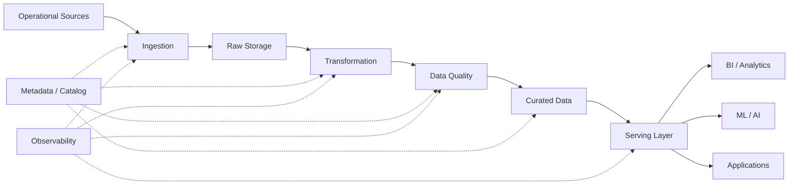

## Key responsibilities

* Design ingestion pipelines.
* Build batch and streaming pipelines.
* Design data models.
* Optimize SQL and distributed processing.
* Implement data quality.
* Implement lineage and metadata.
* Build monitoring and alerting.
* Handle schema evolution.
* Design disaster recovery and recovery mechanisms.
* Control cost.
* Secure sensitive data.
* Enable downstream analytics and AI workloads.

## Senior-level addition

> "I think of a Data Engineer as someone responsible for the **data supply chain**. The responsibility extends from source ingestion all the way to reliable, governed data consumption."

That is stronger than saying:

> "A Data Engineer writes ETL jobs."

## Your resume connection

Your experience directly maps to this broader definition:

* Metadata-driven data quality framework.
* File-to-table and table-to-table reconciliation.
* Schema governance.
* Data platform engineering.
* Multi-cloud data engineering.
* Migration.
* Observability.
* Automation.

## Follow-up Questions

### Q: How is a Data Engineer different from a Data Scientist?

* Data Engineer:

  * Builds and manages reliable data infrastructure.
  * Owns ingestion, transformation, storage, orchestration and serving.
* Data Scientist:

  * Uses data for statistical analysis, experimentation and predictive modeling.

### Q: How is Data Engineering different from ETL testing?

* ETL testing verifies correctness.
* Data Engineering builds the production system generating and serving the data.
* A strong Data Engineer should understand testing deeply because reliability is part of production engineering.

---

# 2. Design an end-to-end data platform for 1 TB/day of data.

## Core Answer

I would first clarify:

* Batch or streaming?
* Required latency?
* Number of sources?
* Data formats?
* Expected growth?
* Number of consumers?
* Compliance requirements?
* RPO/RTO?
* SLA?
* Query patterns?
* Retention?

Then design:

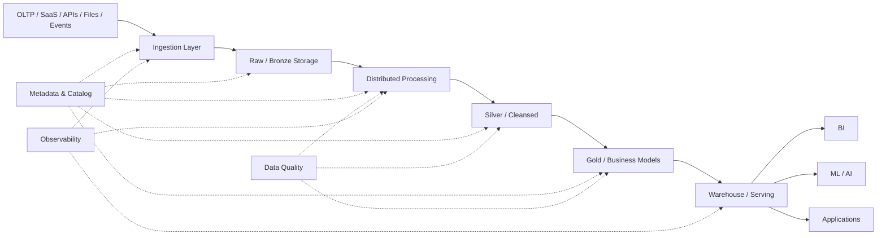

## Storage

Use object storage for large-scale raw data.

Examples:

* S3
* ADLS
* GCS

A data lake is particularly useful when datasets are large and heterogeneous because it can retain structured, semi-structured and unstructured data.

## Processing

Choose based on workload:

* Spark for distributed batch transformations.
* Flink / Spark Structured Streaming for streaming.
* SQL engine for warehouse-native ELT.

## Storage organization

A common layered design:

```text
Bronze
  ↓
Raw / minimally transformed

Silver
  ↓
Validated / cleaned / standardized

Gold
  ↓
Business-ready / aggregated
```

This layered approach is commonly called **medallion architecture**.

## Reliability

I would implement:

* Idempotent processing.
* Retry-safe tasks.
* Checkpointing where applicable.
* Dead-letter handling.
* Data quality gates.
* Schema validation.
* Reconciliation.
* Alerting.
* Audit metadata.

Airflow's current guidance explicitly recommends designing tasks so reruns produce the same outcome and avoiding patterns such as an uncontrolled `INSERT` that can duplicate data after retry.

## Performance

* Partition data according to access patterns.
* Prefer columnar formats such as Parquet for analytics.
* Avoid excessive small files.
* Use predicate pushdown.
* Use incremental processing.
* Optimize joins.
* Avoid unnecessary shuffles.
* Scale compute independently from storage where possible.

## Senior answer

> "I would not choose technologies first. I would define the workload characteristics and SLAs first, then select the storage, compute, orchestration and serving layers."

---

# 3. ETL vs ELT — Which one would you choose?

## Core Answer

### ETL

```text
Source
  ↓
Extract
  ↓
Transform
  ↓
Load
  ↓
Target
```

Transformation occurs before loading.

### ELT

```text
Source
  ↓
Extract
  ↓
Load
  ↓
Target
  ↓
Transform
```

Transformation happens inside the target platform.

Microsoft's architecture guidance describes the distinction primarily as **where transformation occurs** and notes that ELT is particularly attractive when the target system has strong scalable transformation capabilities.

## ETL makes sense when

* Target system has limited compute.
* Complex transformations need specialized processing.
* Sensitive data must be transformed before landing in the target.
* Compliance requires controlled staging.

## ELT makes sense when

* Warehouse/lakehouse has scalable compute.
* Raw data should be preserved.
* SQL transformation is efficient.
* Analytics workloads dominate.

## Example

```text
PostgreSQL
    ↓
ADF
    ↓
Snowflake
    ↓
SQL transformations
    ↓
Analytics tables
```

This is ELT.

Another architecture:

```text
PostgreSQL
    ↓
Spark
    ↓
Complex transformation
    ↓
Data Lake
```

This is closer to ETL.

## Important senior-level answer

> "ETL versus ELT is not a religious choice. I select based on compute location, data sensitivity, transformation complexity, latency, scale and operational cost."

## Follow-up

### Q: Is ELT always better for cloud?

No.

* Modern cloud warehouses make ELT very attractive.
* But very complex transformations may be cheaper or more controllable outside the warehouse.
* A hybrid architecture is common.

---

# 4. What is a Data Lake vs Data Warehouse vs Lakehouse?

## Data Lake

Stores large volumes of data, often in raw/native formats.

Characteristics:

* Flexible schema.
* Supports structured + semi-structured + unstructured data.
* Cheap scalable storage.
* Schema-on-read is common.

## Data Warehouse

Optimized primarily for:

* Structured analytical data.
* SQL analytics.
* BI/reporting.
* Governed business models.

Typical characteristics:

* Schema-on-write.
* Strong SQL performance.
* Curated data.

## Lakehouse

Attempts to combine:

* Data lake flexibility
* Warehouse-style reliability and analytics

Typical architecture:

```text
             DATA LAKEHOUSE

       ┌─────────────────────┐
       │       GOLD          │
       │ Business Data       │
       ├─────────────────────┤
       │       SILVER        │
       │ Clean / Validated   │
       ├─────────────────────┤
       │       BRONZE        │
       │ Raw / Ingested      │
       └─────────────────────┘
                │
        Object Storage
        S3 / ADLS / GCS
```

## Decision framework

| Requirement                       | Typical choice |
| --------------------------------- | -------------- |
| Raw heterogeneous storage         | Data Lake      |
| BI-heavy relational analytics     | Warehouse      |
| Data + AI + BI on shared platform | Lakehouse      |
| Massive historical raw retention  | Data Lake      |
| Highly governed SQL serving       | Warehouse      |

## Follow-up

### Q: Why not put everything in the warehouse?

Because:

* Raw retention may be expensive.
* Data can be heterogeneous.
* ML/AI workloads may require raw data.
* Some data is not relational.
* Object storage can decouple long-term storage from compute.

---

# 5. Explain Medallion Architecture.

## Core Answer

Medallion architecture progressively improves data quality across layers:

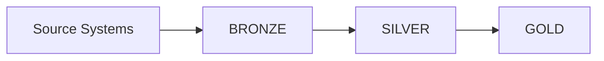

### Bronze

* Raw ingestion.
* Minimal transformation.
* Preserve source fidelity.
* Useful for replay/reprocessing.
* Add ingestion metadata.
* Maintain historical source data where required.

Databricks describes Bronze as raw, minimally validated data that acts as a source for downstream processing and enables auditing/reprocessing.

### Silver

* Cleaning.
* Validation.
* Deduplication.
* Type casting.
* Standardization.
* Join/enrichment.
* Schema enforcement.
* Late-arriving-data handling.

### Gold

* Business-level data.
* Aggregations.
* Dimensional models.
* KPIs.
* Consumer-specific datasets.

## Important point

Medallion layers are **logical quality boundaries**, not necessarily three physically separate technologies.

## Follow-up

### Q: Why not directly write source → Silver?

Because the raw layer gives you:

* Replayability.
* Auditability.
* Source preservation.
* Reprocessing capability.
* Protection from unexpected source changes.

Databricks explicitly cautions against direct ingestion-to-silver patterns when source changes or corrupt records could cause downstream problems.

---

# 6. How would you design a metadata-driven data pipeline?

## Core Answer

Instead of hardcoding every pipeline, create a metadata/configuration layer.

### Example metadata

```yaml
source: postgres
table: customer
target: silver.customer
load_type: incremental
watermark_column: updated_at
primary_key:
  - customer_id
quality_rules:
  null_check:
    - customer_id
  duplicate_check:
    - customer_id
partition_column: event_date
```

Then build a generic framework.

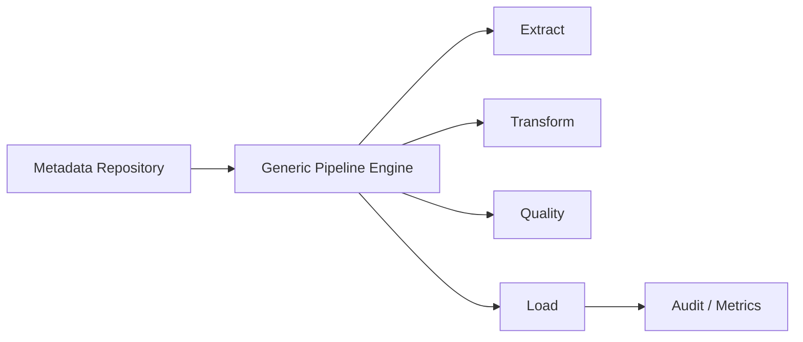

## Advantages

* Reusability.
* Standardization.
* Faster onboarding.
* Less duplicate code.
* Centralized governance.
* Easier configuration changes.
* Consistent quality controls.

## Challenges

* Over-abstraction.
* Complex debugging.
* Metadata itself becomes critical infrastructure.
* Exceptions may require custom processing.

## Interview-level answer

> "I would make the common path metadata-driven but keep an escape hatch for exceptional pipelines. I would avoid creating a framework where every workload becomes a complicated configuration problem."

## Your resume connection

This is directly aligned with the metadata-driven Data Quality and Observability framework you built using Python, Pandas, Redshift and YAML.

---

# 7. What does an idempotent data pipeline mean?

## Core Answer

An operation is idempotent when running it multiple times produces the **same final state** as running it once.

### Non-idempotent

```sql
INSERT INTO target
SELECT * FROM source;
```

Retry:

```text
Run 1 → 1M rows
Run 2 → +1M rows
Result → 2M rows ❌
```

### Idempotent approach

Use:

* MERGE/upsert.
* Deterministic keys.
* Partition overwrite.
* Atomic writes.
* Run identifiers.
* Deduplication.

```text
Run 1 → partition 2026-10-03
Run 2 → replace/reconcile same partition

Final state → same ✅
```

Airflow's best-practice documentation explicitly frames tasks as transaction-like units and recommends retry-safe/idempotent behavior.

## Example

```sql
MERGE INTO target t
USING staging s
ON t.id = s.id
WHEN MATCHED THEN
    UPDATE SET ...
WHEN NOT MATCHED THEN
    INSERT (...);
```

## Follow-up

### Q: Is idempotency the same as exactly-once processing?

No.

* Idempotency is a property of processing behavior.
* Exactly-once is a processing/delivery semantic.
* You can build an idempotent consumer even when the upstream system may deliver duplicates.

This distinction is important in distributed systems.

---

# 8. How do you handle failures and retries in a data pipeline?

## Core Answer

I divide failures into:

### 1. Transient failures

Examples:

* Network timeout.
* Temporary API failure.
* Temporary database connection issue.

Action:

* Retry with exponential backoff.
* Limit retry count.
* Add jitter where appropriate.

### 2. Data failures

Examples:

* Invalid schema.
* Null primary key.
* Invalid date.
* Duplicate business key.

Action:

* Do not blindly retry.
* Quarantine invalid data.
* Send to DLQ/error table.
* Alert.

### 3. Infrastructure failures

Examples:

* Worker failure.
* Cluster failure.
* Out-of-memory.

Action:

* Retry where safe.
* Increase resources.
* Optimize job.
* Use checkpointing/recovery.

### 4. Code failures

Examples:

* Bug.
* Incorrect SQL.
* Bad transformation.

Action:

* Stop pipeline.
* Investigate.
* Deploy fix.
* Backfill safely.

## Production design

```text
             Pipeline
                |
        ┌───────┴────────┐
        ↓                ↓
   Transient          Data Error
        ↓                ↓
 Retry/Backoff      Quarantine/DLQ
        ↓                ↓
    Continue          Alert
```

## Important

Never use retries as a substitute for correctness.

A retry mechanism can make a bad pipeline create **more bad data** if operations are not idempotent.

---

# 9. How do you handle schema evolution?

## Core Answer

Schema evolution means the source schema changes over time.

Examples:

```text
Before:
id
name
email

After:
id
name
email
phone
```

or:

```text
email → removed
```

or:

```text
customer_id: INTEGER → STRING
```

## Classify changes

### Backward-compatible

Usually easier:

* Adding nullable column.
* Adding optional field.

### Potentially breaking

* Renaming column.
* Removing column.
* Changing datatype.
* Changing semantic meaning.

## My approach

1. Detect schema change automatically.
2. Compare incoming schema with expected schema.
3. Classify change.
4. Apply approved evolution rules.
5. Alert on breaking changes.
6. Maintain schema versions.
7. Test downstream consumers.
8. Preserve raw data so reprocessing remains possible.

## Metadata example

```text
schema_version = 17
source_version = 17
ingestion_timestamp = ...
```

## Senior-level point

> "Schema evolution is not just a technical problem. It is a data contract problem."

A source team changing a field should have a clear contract with downstream consumers.

---

# 10. What is a Data Contract?

## Core Answer

A data contract is an explicit agreement between a producer and consumer covering expectations about the data.

Typical contract includes:

* Schema.
* Data types.
* Required fields.
* Nullability.
* Business meaning.
* Allowed values.
* Freshness.
* Quality expectations.
* Ownership.
* Change policy.

Example:

```yaml
dataset: customer
owner: crm-team

columns:
  customer_id:
    type: string
    nullable: false

  email:
    type: string
    nullable: true

sla:
  freshness: "30 minutes"

quality:
  customer_id_not_null: "100%"
```

## Why it matters

Without contracts:

```text
Producer changes data
       ↓
Pipeline may still run
       ↓
Consumer receives wrong data
       ↓
Business report becomes incorrect
```

With contracts:

```text
Producer change
       ↓
Contract validation
       ↓
Compatible → continue
Breaking → reject/alert
```

## Senior-level answer

> "A pipeline can be technically successful while the data is operationally wrong. Data contracts reduce this class of failure by making producer-consumer expectations explicit."

Modern enterprise architectures increasingly use contracts to drive metadata-driven ingestion and governance.

---

# 11. How would you build a Data Quality framework?

## Core Answer

I would classify rules into dimensions.

### Completeness

```text
Expected records = 1,000,000
Received records = 995,000

Completeness = 99.5%
```

### Uniqueness

Check duplicate primary/business keys.

### Validity

Example:

```text
age >= 0
country IN ('IN','US','AU')
```

### Accuracy

Compare against trusted source/reference.

### Consistency

Example:

```text
source_count = target_count
```

### Referential integrity

```text
Every order.customer_id
must exist in customer.customer_id
```

### Freshness

```text
current_time - latest_record_time < SLA
```

### Schema

* Datatype.
* Column existence.
* Nullable.
* Unexpected columns.

## Architecture

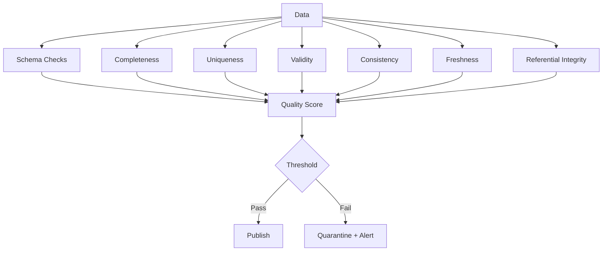

## Strong interview answer

> "I would separate quality-rule definition from execution. Rules should be metadata-driven so new datasets can be onboarded without rewriting framework code."

This directly matches your resume experience with YAML-based rule configuration and reusable Python/Pandas validation engines.

---

# 12. How would you design data reconciliation?

## Core Answer

Reconciliation answers:

> "Did the data arriving at the target preserve the expected source information?"

I use multiple levels.

### Level 1 — Record count

```text
Source = 10,000
Target = 10,000
```

### Level 2 — Aggregate reconciliation

```sql
SUM(amount)
COUNT(*)
MIN(date)
MAX(date)
```

### Level 3 — Key reconciliation

Compare keys:

```text
source IDs - target IDs
target IDs - source IDs
```

### Level 4 — Column-level reconciliation

Compare:

```text
customer_id
status
amount
date
```

### Level 5 — Hash/checksum comparison

Create deterministic row-level hashes.

```text
hash(col1 || col2 || col3)
```

Compare hash sets between systems.

## Your project example

Your resume specifically describes:

* File-to-table validation.
* Table-to-table validation.
* Cross-system validation.
* Null/duplicate/schema/mismatch checks.

## Follow-up

### Q: Why not compare every row?

Because at scale it can be expensive.

Use progressive validation:

```text
Count
 ↓
Aggregate
 ↓
Key comparison
 ↓
Sample/partition comparison
 ↓
Full row-level comparison where required
```

---

# 13. How do you design incremental ingestion?

## Core Answer

Incremental ingestion means processing only new or changed data rather than reprocessing everything.

Common strategies:

### 1. Timestamp watermark

```text
WHERE updated_at > last_successful_watermark
```

### 2. Increasing ID

```text
WHERE id > last_processed_id
```

### 3. CDC

Capture database changes directly.

### 4. File-based incremental ingestion

Track:

* File name.
* File size.
* ETag/checksum.
* Modification timestamp.
* Processed status.

## Watermark design

```text
               Metadata Table
               ┌───────────────┐
               │last_watermark │
               │2026-10-02...  │
               └───────┬───────┘
                       ↓
Source → Filter new records → Process → Validate
                                      ↓
                              Success?
                               /     \
                             Yes      No
                              ↓        ↓
                         Advance    Keep old
                         watermark  watermark
```

## Critical rule

Advance the watermark **only after successful processing**.

Otherwise:

```text
Read records
 ↓
Advance watermark
 ↓
Job fails
 ↓
Records are skipped
```

That is a classic production bug.

---

# 14. Batch vs Streaming — How do you decide?

## Batch

Data is processed periodically.

Examples:

* Daily financial report.
* Nightly customer refresh.
* Weekly aggregation.

Advantages:

* Simpler.
* Easier to operate.
* Lower infrastructure complexity.
* Often cheaper.

## Streaming

Data is processed continuously.

Examples:

* Fraud detection.
* Real-time monitoring.
* Live recommendation systems.
* Operational alerting.

Advantages:

* Lower latency.
* Continuous updates.

Disadvantages:

* More complex state management.
* Late-arriving events.
* Duplicates.
* Checkpointing.
* Ordering.
* Backpressure.

Microsoft's architecture guidance notes that streaming systems need to address issues such as checkpointing, idempotent transformations, late-arriving data and dead-letter handling.

## Decision matrix

| Requirement                   | Batch | Streaming |
| ----------------------------- | ----: | --------: |
| Daily report                  |     ✅ |         ❌ |
| 5-minute SLA                  | Maybe |         ✅ |
| Millisecond reaction          |     ❌ |         ✅ |
| Simplicity                    |     ✅ |         ❌ |
| Massive historical processing |     ✅ | Sometimes |

## Senior answer

> "I don't choose streaming because it sounds modern. I choose it only when the business latency requirement justifies the operational complexity."

---

# 15. Explain Lambda Architecture vs Kappa Architecture.

## Lambda

Uses:

```text
                 ┌→ Batch Layer
Data → Broker ───┤
                 └→ Speed Layer
                       ↓
                  Serving Layer
```

Advantages:

* Batch can provide correctness.
* Streaming provides low latency.

Problem:

* Two processing paths.
* Duplicate logic.
* Operational complexity.

## Kappa

Primarily uses streaming:

```text
Source
  ↓
Event Log
  ↓
Stream Processing
  ↓
Serving Layer
```

Historical data can be replayed from the log where the system supports this model.

## Interview answer

> "Lambda gives separate batch and speed paths, while Kappa attempts to simplify the architecture around a streaming log and replay model."

Do not say one is universally better.

The decision depends on:

* Replay capabilities.
* Retention.
* Latency.
* Processing complexity.
* Operational maturity.

---

# 16. What is CDC and why would you use it?

## Core Answer

CDC = **Change Data Capture**.

Instead of repeatedly extracting the entire source table, capture:

```text
INSERT
UPDATE
DELETE
```

events.

Typical architecture:

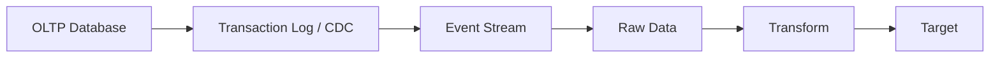

Benefits:

* Lower source load.
* Lower network traffic.
* Near-real-time synchronization.
* Captures deletes/updates.
* Efficient incremental pipelines.

Tools such as Debezium provide connectors for multiple relational and other database systems and emit standardized change events.

## Challenges

* Ordering.
* Duplicate events.
* Schema evolution.
* Deletes.
* Transaction boundaries.
* Exactly-once assumptions.
* Initial snapshot + subsequent changes.

## Follow-up

### Q: How would you perform initial migration + CDC?

```text
1. Snapshot source
2. Record CDC position
3. Load snapshot
4. Start consuming changes from recorded position
5. Apply CDC
6. Reconcile
7. Switch consumers
```

The exact implementation depends on the CDC technology.

---

# 17. What are late-arriving events?

## Core Answer

Suppose:

```text
Event time:
10:00 → received at 10:01
10:02 → received at 10:20
```

The second event is late.

Reasons:

* Network delay.
* Mobile connectivity.
* Source retries.
* Processing delays.
* Clock differences.

## Handling strategy

* Maintain **event time** separately from processing time.
* Use watermarks for streaming workloads.
* Allow a lateness window.
* Reprocess affected partitions/windows.
* Design aggregations to accept corrections.

Example:

```text
Event Time
    ↓
10:00 ────────────────┐
10:05 ────────┐       │
10:10 ────────┤       │
              ↓       ↓
          Watermark
              ↓
        Finalize window
```

## Senior point

Do not blindly use ingestion time for business-time analytics.

---

# 18. What are Partitioning and Bucketing? Why are they important?

## Partitioning

Physically/logically separates data based on a key.

Example:

```text
orders/
  year=2026/
    month=10/
      day=01/
      day=02/
      day=03/
```

If a query filters on date, the engine may avoid scanning unrelated partitions.

Cloud architecture guidance recommends partitioning around access patterns and processing boundaries; BigQuery also recommends partitioning large tables to reduce bytes scanned and cost.

## Good partition candidates

* Date.
* Region.
* Tenant, where cardinality is reasonable.

## Bad partitioning

```text
customer_id
```

if there are 100 million customers.

This can create enormous numbers of small partitions/files.

## Bucketing

Rows are assigned to buckets using a hash-like mechanism:

```text
hash(customer_id) % N
```

Useful for some join and distribution scenarios.

## Interview trap

Partitioning is not automatically good.

Too many partitions can create:

* Metadata overhead.
* Small-file problem.
* Slow listing.
* Poor scheduling.

---

# 19. Explain the Small Files Problem.

## Core Answer

Suppose a data lake receives:

```text
10 million files × 5 KB
```

instead of:

```text
10,000 files × 5 MB
```

Total data might be similar, but the first design can be operationally expensive.

Problems:

* Excessive metadata.
* More file-open operations.
* Poor scan efficiency.
* More task scheduling overhead.
* Increased object-store/API overhead.

## Solution

* Compact small files.
* Use appropriate batch sizes.
* Tune partitioning.
* Avoid over-partitioning.
* Optimize ingestion frequency.
* Use compaction/OPTIMIZE where supported.

## Important distinction

Do not confuse:

```text
Large number of records
```

with:

```text
Large number of files
```

A lake can have huge data volume without having a small-files problem.

---

# 20. How do you optimize a slow data pipeline?

## Core Answer

I follow a structured process.

### Step 1 — Measure first

Look at:

* Runtime.
* CPU.
* Memory.
* I/O.
* Network.
* Shuffle.
* Number of records.
* Stage-level timings.
* Query plan.

### Step 2 — Find bottleneck

```text
Source bottleneck?
Transformation?
Shuffle?
Join?
Storage?
Network?
Target?
```

### Step 3 — Optimize

Potential actions:

* Incremental processing.
* Partition pruning.
* Predicate pushdown.
* Column pruning.
* Better join strategy.
* Reduce shuffles.
* Broadcast small dimension data.
* Compaction.
* Correct file format.
* Parallelize independent workloads.
* Scale compute only after code-level optimization.

### Rule

> "First eliminate unnecessary work. Then optimize the work that remains."

That is much better than immediately adding more machines.

---

# 21. How do you design a reliable orchestration layer?

## Core Answer

An orchestrator should manage:

* Dependencies.
* Scheduling.
* Retries.
* Timeouts.
* Backfills.
* Alerts.
* Parameters.
* Task states.
* Observability.

Example:

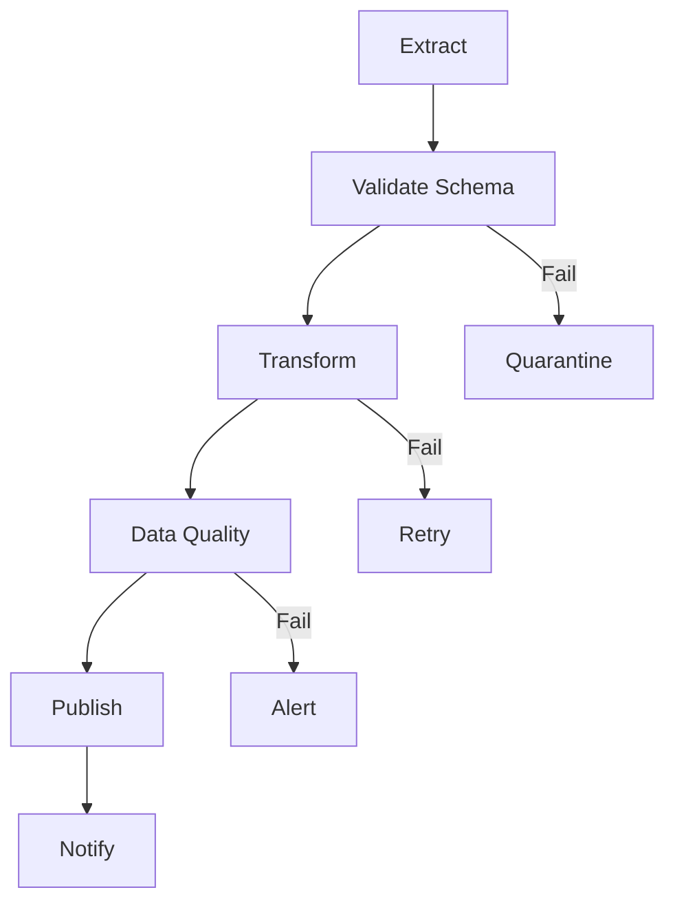

## Good DAG design

Keep tasks:

* Atomic.
* Idempotent.
* Observable.
* Retry-safe.
* Independent where possible.

Airflow's documentation explicitly recommends retry-safe task design and describes tasks as transaction-like units.

## Avoid

One giant task:

```text
Extract + Transform + Validate + Load + Notify
```

because:

* Difficult to retry.
* Hard to identify failure.
* Poor observability.
* Difficult recovery.

---

# 22. What is a backfill and how would you safely execute one?

## Core Answer

Backfill means processing historical dates that were missed or need recomputation.

Example:

```text
Pipeline works normally:

Oct 1 ✅
Oct 2 ✅
Oct 3 ❌
Oct 4 ✅

Need:
Oct 3 → backfill
```

Airflow provides explicit mechanisms for creating runs over past logical dates and includes concurrency/reprocessing controls for backfills.

## Safe backfill process

```text
Identify affected period
        ↓
Estimate volume/cost
        ↓
Check downstream dependencies
        ↓
Run in isolated/test scope
        ↓
Validate
        ↓
Publish atomically
        ↓
Reconcile
```

## Important

Backfill code should be:

* Deterministic.
* Idempotent.
* Parameterized by date.
* Safe to retry.

## Interview trap

Never blindly rerun the entire pipeline if only one partition is wrong.

---

# 23. What is Data Lineage and why is it important?

## Core Answer

Lineage tells us:

> Where did this data come from and where does it go?

Example:

```text
CRM.customer
      ↓
raw.customer
      ↓
silver.customer
      ↓
gold.customer_360
      ↓
Power BI Dashboard
```

## Uses

* Impact analysis.
* Root-cause analysis.
* Compliance.
* Audit.
* Data discovery.
* Incident investigation.
* Change management.

## Example

A source column is changed.

Without lineage:

```text
"What broke?"
```

With lineage:

```text
source column
   ↓
datasets
   ↓
transformations
   ↓
dashboards
   ↓
affected teams
```

## Senior-level answer

> "Lineage becomes especially valuable when the platform grows beyond a few pipelines. At enterprise scale, it turns debugging and impact analysis from tribal knowledge into an explicit system capability."

---

# 24. What is Data Observability?

## Core Answer

Monitoring asks:

> "Is the pipeline running?"

Observability asks:

> "Can I understand what is happening and why?"

Typical signals include:

* Metrics.
* Logs.
* Traces.

OpenTelemetry currently describes traces, metrics and logs as core observability signals.

## Data observability dimensions

### Freshness

Is data arriving on time?

### Volume

Did record volume unexpectedly drop/increase?

### Schema

Did columns/types change?

### Distribution

Did values change abnormally?

### Lineage

Which downstream datasets are affected?

### Pipeline health

Did processing succeed?

## Example

```text
Pipeline SUCCESS ✅
but

Rows today = 12,000
Rows normal = 1,000,000

Technical success ≠ Data success
```

That is one of the most important concepts for senior Data Engineers.

## Your resume connection

You describe a Data Quality & Observability framework covering quality KPIs, exception trends and monitoring dashboards.

---

# 25. How would you monitor a production data pipeline?

## Core Answer

I monitor at four levels.

### Pipeline-level

* Success/failure.
* Runtime.
* Retry count.
* Task duration.

### Data-level

* Row count.
* Null rate.
* Duplicate rate.
* Freshness.
* Schema changes.
* Distribution anomalies.

### Infrastructure-level

* CPU.
* Memory.
* Disk.
* Network.
* Cluster health.

### Business-level

* Orders per day.
* Revenue.
* Transaction count.
* Active customers.

## Dashboard

```text
PIPELINE HEALTH

Freshness       ✅
Success Rate    ✅
Schema          ✅
Row Count       ⚠
Null Rate       ✅
Business KPI    ❌
```

## Key insight

Business-level monitoring is critical.

A pipeline can be green while the business data is wrong.

---

# 26. How do you secure a data platform?

## Core Answer

I use defense in depth.

### Identity

* IAM/RBAC.
* Least privilege.
* Short-lived credentials where possible.
* Service identities.

### Data

* Encryption at rest.
* Encryption in transit.
* Sensitive-column protection.
* Tokenization/masking.

### Network

* Private connectivity.
* Network isolation.
* Security groups/firewalls.

### Governance

* Catalog.
* Audit logs.
* Access reviews.
* Data classification.

### Operational security

* Secrets in secret managers.
* No credentials hardcoded in code.
* CI/CD controls.
* Environment separation.

## Sensitive data

A principle I follow:

> "Classify sensitive data early and minimize unnecessary copies."

Azure's big-data guidance also recommends scrubbing sensitive data early in ingestion flows where appropriate.

---

# 27. How would you design a multi-tenant data platform?

## Core Answer

First determine the isolation requirement.

Three broad models:

### Shared storage + tenant column

```text
customer_id
tenant_id
event
```

Advantages:

* Cheap.
* Simple.

Risk:

* Cross-tenant leakage must be prevented.

### Separate schemas

```text
tenant_A.schema
tenant_B.schema
```

More isolation.

### Separate databases/storage

Strongest isolation.

More operational overhead.

## Decision depends on

* Compliance.
* Data size.
* Noisy-neighbor risk.
* Tenant isolation.
* Cost.
* Query patterns.
* Operational complexity.

## Important

Use tenant-aware:

* Authorization.
* Partitioning.
* Data quality.
* Observability.
* Encryption.
* Auditing.

---

# 28. Star Schema vs Snowflake Schema — Explain with an example.

## Star Schema

```text
             dim_customer
                  |
                  |
dim_date ---- fact_sales ---- dim_product
                  |
                  |
             dim_store
```

Fact:

```text
fact_sales
- date_key
- customer_key
- product_key
- store_key
- quantity
- amount
```

Dimensions:

```text
dim_customer
dim_product
dim_store
dim_date
```

## Snowflake Schema

Dimensions are normalized further.

Example:

```text
fact_sales
    |
dim_product
    |
dim_category
    |
dim_department
```

## Star schema advantages

* Fewer joins.
* Easier analytics.
* Easier BI consumption.
* Common dimensional design.

Microsoft's current dimensional-modeling guidance describes star schema as a mature approach using fact and dimension tables and notes its suitability for analytical querying.

## Snowflake schema advantages

* More normalized.
* Less dimension duplication.
* Potentially better maintainability for highly hierarchical dimensions.

## Interview answer

> "For most BI-serving models, I would start with a star schema unless there is a strong reason to normalize dimensions."

---

# 29. Explain Slowly Changing Dimensions: Type 1 vs Type 2.

## Type 1

Overwrite old value.

```text
Before:
Customer 101 → Bangalore

After:
Customer 101 → Chennai
```

History is lost.

## Type 2

Maintain historical versions.

```text
customer_sk | customer_id | city      | start_date | end_date   | current
------------|-------------|-----------|------------|------------|--------
1           | 101         | Bangalore | 2024-01-01 | 2026-08-01 | false
2           | 101         | Chennai   | 2026-08-02 | 9999-12-31 | true
```

Type 2 preserves historical state using versioned rows, usually with a surrogate key and validity dates/current indicator.

## Type 1 use case

* Correcting spelling.
* Latest contact information.
* Attributes where history is irrelevant.

## Type 2 use case

* Customer region history.
* Sales territory.
* Account ownership.
* Regulatory reporting.

## Follow-up

### Q: How do you implement Type 2?

1. Detect changed business key.
2. Expire current record.
3. Insert new version.
4. Generate surrogate key.
5. Set validity range/current flag.

---

# 30. How would you migrate an on-prem data platform to cloud?

## Core Answer

I would not start by copying tables.

I would first classify:

```text
Sources
Dependencies
Data volumes
SLAs
Consumers
Security
Compliance
Criticality
```

## Migration phases

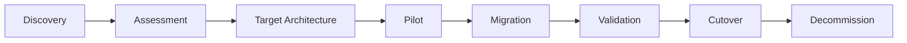

## Validation

Compare:

* Record counts.
* Aggregates.
* Keys.
* Hashes.
* Schema.
* Null rates.
* Business reports.

## Cutover strategies

### Big bang

Move everything at once.

### Phased

Move workloads gradually.

### Dual run

Old + new systems run simultaneously for a period.

## Senior answer

> "For critical platforms, I generally want a reconciliation checkpoint before cutover and a rollback strategy before production migration."

## Your resume connection

Your Forever New project explicitly involved cloud migration strategy, cutover validation and reconciliation checkpoints.

---

# 31. Design a source-to-target pipeline where the source is PostgreSQL and target is Snowflake.

## Core Answer

Example architecture:

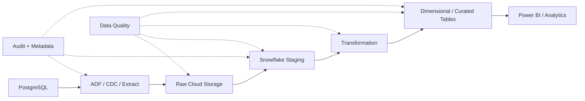

## Extraction

For full load:

```text
SELECT * FROM source
```

For incremental:

```text
WHERE updated_at > watermark
```

For high-frequency change:

* CDC.

## Snowflake layers

```text
RAW
 ↓
STAGING
 ↓
CORE
 ↓
MART
```

## Quality

Validate:

* Counts.
* Amount sums.
* Primary keys.
* Nullability.
* Duplicates.
* Schema.
* Freshness.

## Cost optimization

* Incremental loads.
* Warehouse sizing.
* Auto-suspend.
* Efficient transformations.
* Avoid unnecessary full-table scans.

Your resume describes PostgreSQL-to-Snowflake pipelines using Azure Data Factory for financial analytics and reporting.

---

# 32. How would you design a real-time transaction analytics platform?

## Requirement

Suppose:

```text
100K events/sec
Latency < 5 sec
```

Architecture:

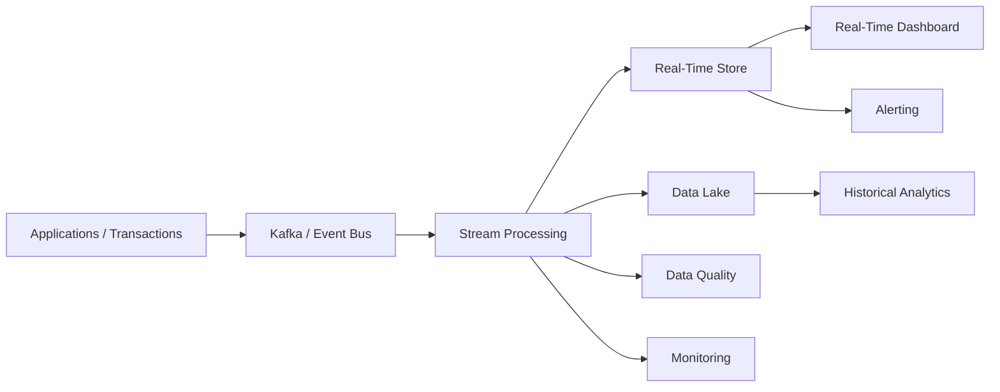

## Processing requirements

* Event-time processing.
* Partitioning.
* Consumer parallelism.
* Checkpointing.
* Deduplication.
* Watermarking.
* Late-event handling.
* Dead-letter handling.

## Capacity thinking

If:

```text
100K events/sec
```

then one key question is:

> "Can my partitioning and consumers scale horizontally enough to keep up with the producer rate?"

## Senior answer

Do not jump directly into technology names.

First establish:

* Event rate.
* Event size.
* Latency.
* Ordering requirements.
* Retention.
* Replay requirements.
* Exactly-once/idempotency requirements.

---

# 33. What is the difference between OLTP and OLAP?

## OLTP

Optimized for transactions.

Examples:

* Banking transactions.
* Orders.
* Payments.

Characteristics:

* Many small reads/writes.
* High concurrency.
* Transactional consistency.
* Usually normalized schemas.

## OLAP

Optimized for analytics.

Examples:

* Sales analysis.
* Customer analytics.
* Reporting.

Characteristics:

* Large scans.
* Aggregations.
* Complex joins.
* Analytical models.

## Architecture

```text
                APPLICATIONS
                     |
                     ↓
                   OLTP
                     |
              ETL / CDC / ELT
                     |
                     ↓
                   OLAP
                     |
              BI / Analytics
```

## Why separate them?

Analytical queries can be expensive:

```sql
SELECT
    region,
    month,
    SUM(revenue)
FROM orders
GROUP BY region, month;
```

Running this repeatedly on a transactional database can negatively affect operational workloads.

## Senior-level answer

> "The separation is not merely because the schemas look different. The workload characteristics, concurrency patterns, storage layout and optimization goals are different."

---

# 34. How do you control cloud data-platform cost?

## Core Answer

I optimize along four dimensions:

```text
                COST
                  |
      ┌───────────┼───────────┐
      ↓           ↓           ↓
   Storage      Compute     Queries
```

## Storage

* Lifecycle policies.
* Retention.
* Compression.
* Columnar formats.
* Remove unnecessary duplicates.
* Archive cold data.

## Compute

* Right-size clusters.
* Autoscaling where appropriate.
* Avoid idle resources.
* Schedule non-critical workloads.
* Separate workloads.

## Query

* Partition pruning.
* Clustering.
* Predicate pushdown.
* Avoid `SELECT *`.
* Incremental transformations.
* Materialize expensive reusable computations.

BigQuery's current storage guidance specifically recommends partitioning and clustering large tables to reduce data scanned and improve performance/cost efficiency.

## Operational cost

Track:

* Cost by team.
* Cost by pipeline.
* Cost by dataset.
* Cost per TB processed.
* Cost per successful pipeline run.

## Senior answer

> "The best cost optimization is usually eliminating unnecessary computation, not simply choosing a cheaper compute instance."

---

# 35. Design a production-grade Data Engineering platform. Walk me through it end to end.

> **This is the most important question in the chapter.**

This question combines almost everything.

---

## Step 1 — Clarify requirements

I would ask:

### Data

* What are the sources?
* Structured or unstructured?
* Data volume?
* Growth rate?
* Batch or streaming?

### Business

* What are the consumers?
* BI?
* ML?
* APIs?
* Operational applications?

### SLA

* Real-time?
* Minutes?
* Hourly?
* Daily?

### Reliability

* RPO?
* RTO?
* Availability?
* Reprocessing requirements?

### Governance

* PII?
* Compliance?
* Data retention?
* Audit?

---

# Target Architecture

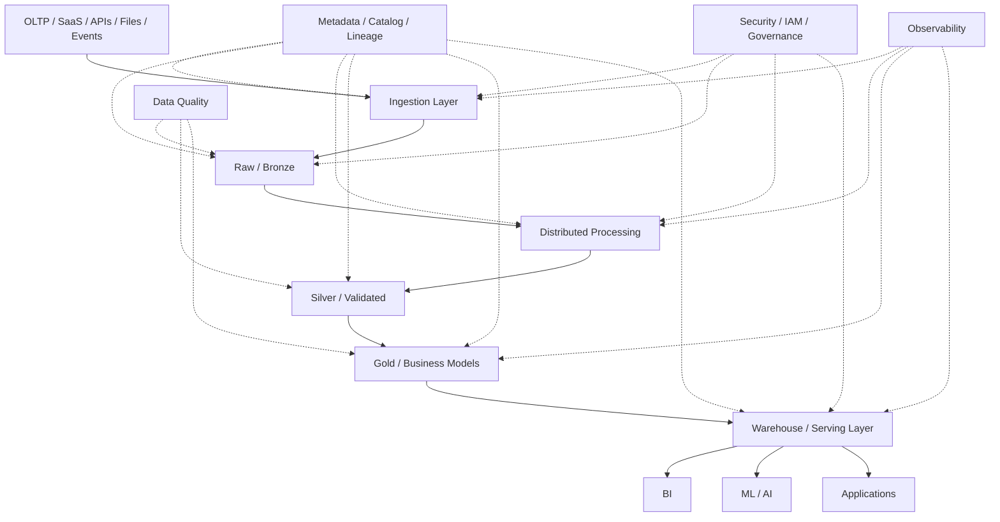

---

# Step 2 — Ingestion

Choose:

* Batch extraction for scheduled sources.
* CDC for databases.
* Event streaming for real-time events.
* File ingestion for file-based systems.
* API extraction for SaaS systems.

---

# Step 3 — Raw Storage

Land source data with minimal transformation.

Store metadata such as:

```text
source_system
source_table
ingestion_timestamp
file_name
batch_id
schema_version
```

The raw layer should support:

* Replay.
* Audit.
* Reprocessing.
* Investigation.

Databricks and Microsoft architecture guidance both describe raw/bronze layers as a foundation for downstream processing and reprocessing.

---

# Step 4 — Transformation

Use the appropriate compute:

* SQL.
* Spark.
* Streaming engine.
* Warehouse-native transformation.

Apply:

* Standardization.
* Deduplication.
* Business rules.
* Enrichment.
* Joins.
* Type conversion.

---

# Step 5 — Data Quality

At minimum:

```text
Schema
Completeness
Uniqueness
Validity
Consistency
Freshness
Referential Integrity
```

Pipeline should not automatically publish corrupt data.

---

# Step 6 — Data Modeling

Depending on consumers:

```text
Detailed analytical layer
        ↓
Facts + Dimensions
        ↓
Business marts
        ↓
BI / ML / Applications
```

Use star schema for common BI patterns.

---

# Step 7 — Orchestration

The scheduler should manage:

* Dependencies.
* Retries.
* Backfills.
* Timeouts.
* Alerts.
* Concurrency.

Tasks should be idempotent and independently observable.

---

# Step 8 — Observability

Monitor:

```text
Pipeline
Data
Infrastructure
Business
```

Example:

```text
Pipeline Success      ✅
Freshness             ✅
Schema                ✅
Row Count             ⚠
Revenue               ❌
```

This lets us detect the important scenario:

> Pipeline succeeded technically, but business data is wrong.

---

# Step 9 — Security

Implement:

* IAM/RBAC.
* Least privilege.
* Encryption.
* Secret management.
* Network isolation.
* Data masking.
* Audit logging.

---

# Step 10 — Disaster Recovery

Define:

```text
RPO = maximum acceptable data loss
RTO = maximum acceptable recovery time
```

Example:

```text
RPO = 15 minutes
RTO = 1 hour
```

Then design:

* Replication.
* Backup.
* Checkpoints.
* Replay.
* Multi-region/multi-zone strategy where justified.
* Tested recovery procedures.

---

# Step 11 — Cost Optimization

Monitor:

```text
Storage
Compute
Data Transfer
Query Scans
Pipeline Runtime
Idle Resources
```

Optimize the architecture instead of simply reducing infrastructure.

---

# Step 12 — Deployment

Use:

```text
Git
 ↓
Pull Request
 ↓
Code Review
 ↓
Automated Tests
 ↓
Build
 ↓
Deploy Dev
 ↓
Integration Tests
 ↓
Deploy QA
 ↓
Production
```

---

# Step 13 — Final Senior-Level Answer

A strong 60–90 second answer would be:

> "I would begin by clarifying the data volume, source characteristics, latency SLA, consumers, compliance requirements and recovery objectives. I would then separate ingestion, storage, transformation and serving concerns. Raw data would land in durable object storage, preserving source fidelity and enabling replay. I would process that data through validated and curated layers, typically following a bronze-silver-gold pattern. Incremental processing or CDC would be preferred where full reloads are unnecessary. I would make ingestion and quality rules metadata-driven so new datasets can be onboarded consistently. Every pipeline would be idempotent and retry-safe, with schema validation, reconciliation, data-quality checks and observability built into the workflow. For serving, I would use dimensional models or other workload-specific models depending on the consumer. Finally, I would address security, lineage, disaster recovery, CI/CD and cost as first-class architecture concerns rather than afterthoughts."

---

# Rapid-Fire Follow-Ups You Must Be Ready For

After Question 35, an interviewer may drill into any of these:

## Architecture

* Why data lake instead of warehouse?
* Why lakehouse?
* Why separate raw and curated layers?
* Why object storage?
* Why not process directly in the warehouse?

## Reliability

* What happens if task fails halfway?
* How do you prevent duplicate data?
* How do you recover from corrupted data?
* How do you backfill?
* How do you recover from a bad deployment?

## Performance

* Where is the bottleneck?
* How do you reduce shuffle?
* Why partition?
* What causes small files?
* How do you optimize joins?

## Data Quality

* What if source count and target count don't match?
* How do you detect silent corruption?
* How do you define a quality threshold?
* What happens when quality fails?
* How do you reconcile multiple systems?

## Streaming

* How do you handle duplicates?
* What is event time?
* What is processing time?
* What are watermarks?
* How do you handle late data?

## Data Modeling

* Star vs snowflake?
* Fact vs dimension?
* SCD1 vs SCD2?
* Surrogate key vs natural key?
* Snapshot vs transactional fact?

## Cloud

* Why S3/ADLS/GCS?
* Why Snowflake/BigQuery/Redshift?
* How do you control cost?
* How do you secure the data lake?
* How do you migrate on-prem to cloud?

---

# 10 Senior-Level Statements Worth Memorizing

Use these naturally during interviews.

### 1

> "I would start with the business SLA and workload characteristics before choosing the technology."

### 2

> "I would make the pipeline idempotent so retries don't create inconsistent results."

### 3

> "Technical pipeline success does not necessarily mean data success."

### 4

> "I prefer incremental processing over full reloads when the workload supports reliable change detection."

### 5

> "Raw data should be preserved when replay and auditability are important."

### 6

> "Data quality should be treated as part of the pipeline, not as a separate testing activity."

### 7

> "I would measure before optimizing."

### 8

> "Partitioning should follow access patterns; over-partitioning can be as harmful as under-partitioning."

### 9

> "Schema evolution should be governed through explicit compatibility rules or data contracts."

### 10

> "At enterprise scale, observability, lineage, governance and recovery are architecture capabilities, not operational add-ons."

---

# Your Resume → Interview Story Bank

You should connect theory to these real experiences during interviews.

| Interview Topic              | Your Relevant Experience                               |
| ---------------------------- | ------------------------------------------------------ |
| Metadata-driven architecture | Enterprise Data Quality & Observability Framework      |
| Data Quality                 | Python/Pandas validation framework                     |
| Reconciliation               | File-to-table, table-to-table, cross-system validation |
| Observability                | Tableau quality KPIs and exception monitoring          |
| Schema governance            | Redshift metadata/schema synchronization               |
| CI/CD for data               | Git-based database object promotion                    |
| Azure                        | ADF + Databricks + ADLS + PySpark                      |
| GCP                          | BigQuery + Dataflow + Dataproc + Composer              |
| Big Data                     | Hadoop + Hive + Spark + Scala + Sqoop                  |
| Snowflake                    | PostgreSQL → Snowflake pipelines                       |
| Cloud migration              | Forever New Azure migration                            |
| Automation                   | Python-based reusable engineering frameworks           |
| DataOps                      | Jira + Zephyr + AI-assisted automation                 |
| BI reliability               | Tableau regression automation                          |
| Validation accelerator       | PySpark file-vs-file validation                        |

These experiences are explicitly represented in your supplied resume.

---

# Final Revision Checklist

Before moving to the next topic, make sure you can answer these without looking at notes:

```text
□ What is Data Engineering?
□ Design a 1 TB/day pipeline
□ ETL vs ELT
□ Data Lake vs Warehouse vs Lakehouse
□ Medallion architecture
□ Metadata-driven framework
□ Idempotency
□ Failure/retry strategy
□ Schema evolution
□ Data contracts
□ Data quality framework
□ Data reconciliation
□ Incremental loading
□ Batch vs streaming
□ Lambda vs Kappa
□ CDC
□ Late-arriving events
□ Partitioning
□ Small-files problem
□ Pipeline optimization
□ Orchestration
□ Backfills
□ Lineage
□ Observability
□ Pipeline monitoring
□ Data security
□ Multi-tenancy
□ Star vs Snowflake schema
□ SCD Type 1 vs Type 2
□ Cloud migration
□ PostgreSQL → Snowflake design
□ Real-time analytics
□ OLTP vs OLAP
□ Cloud cost optimization
□ Production-grade platform design
```

# Golden Rule for 70+ LPA Interviews

Do not try to sound like someone who knows 100 tools.

Try to sound like someone who can take an ambiguous business problem and build a **reliable, scalable, observable, secure and cost-aware data system**.

That is the level at which your answers should increasingly move from:

```text
"What is X?"
```

to:

```text
"Why X?"
   ↓
"When X?"
   ↓
"What are the trade-offs?"
   ↓
"What breaks?"
   ↓
"How would you operate it in production?"
```

---

## Research Basis

Key architecture and engineering concepts in this chapter were cross-checked against current technical documentation from:

* Microsoft Azure Architecture Center — Data Lakes, ETL/ELT, Big Data Architecture.
* Databricks Documentation — Medallion Architecture, reliability and CDC patterns.
* Apache Airflow Documentation — idempotency, retries and backfills.
* OpenTelemetry Documentation — observability signals and concepts.
* Google Cloud BigQuery Documentation — partitioning and clustering.
* Amazon Redshift Documentation — distribution, sorting and analytical warehouse behavior.
* Microsoft Learn — dimensional modeling and SCD patterns.
* Debezium Documentation — CDC source connectors.
