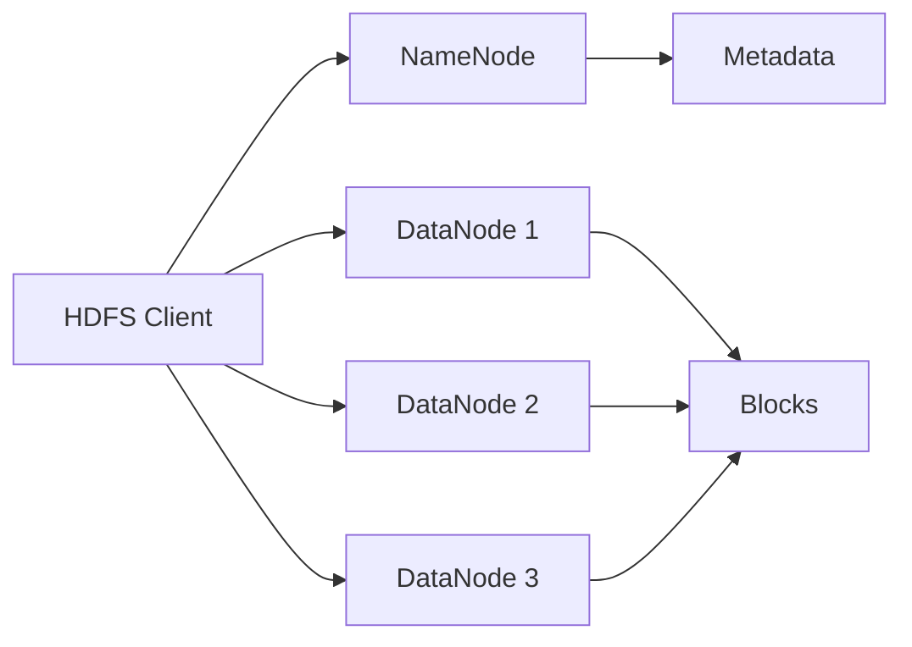
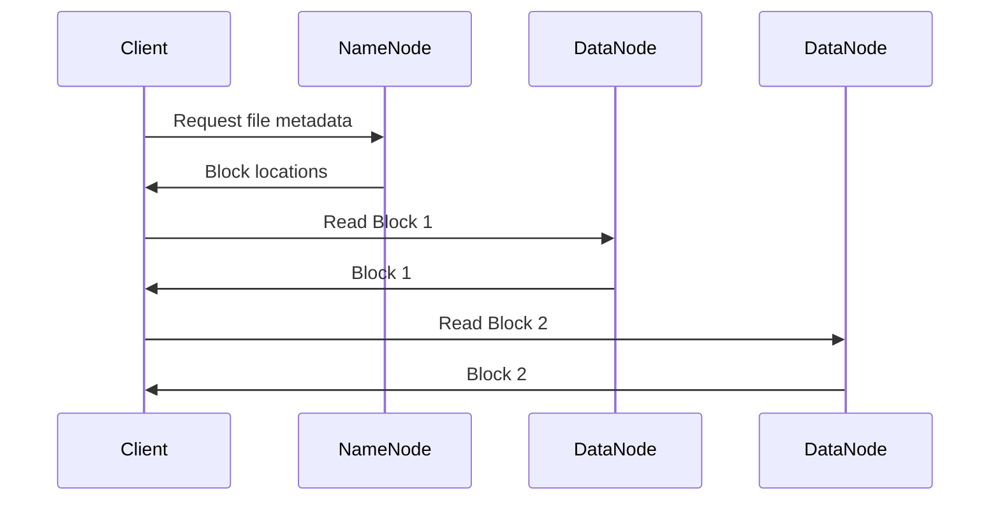
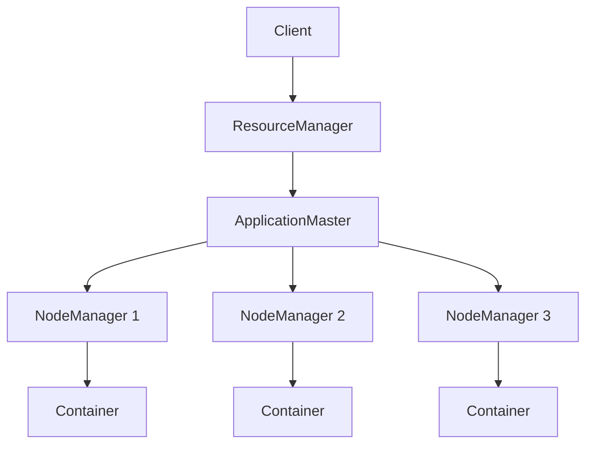
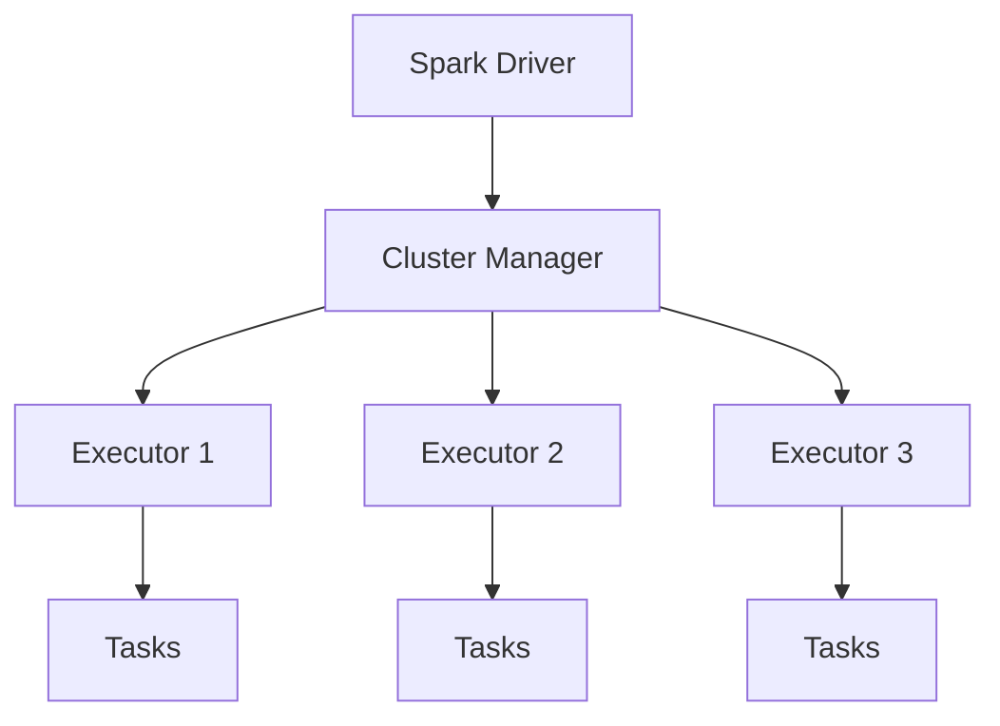
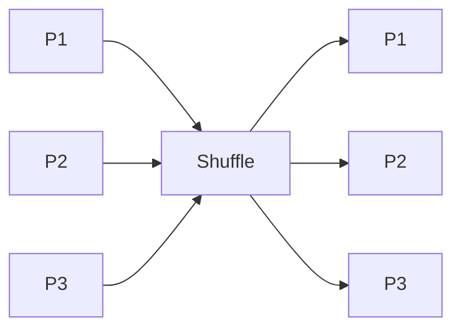
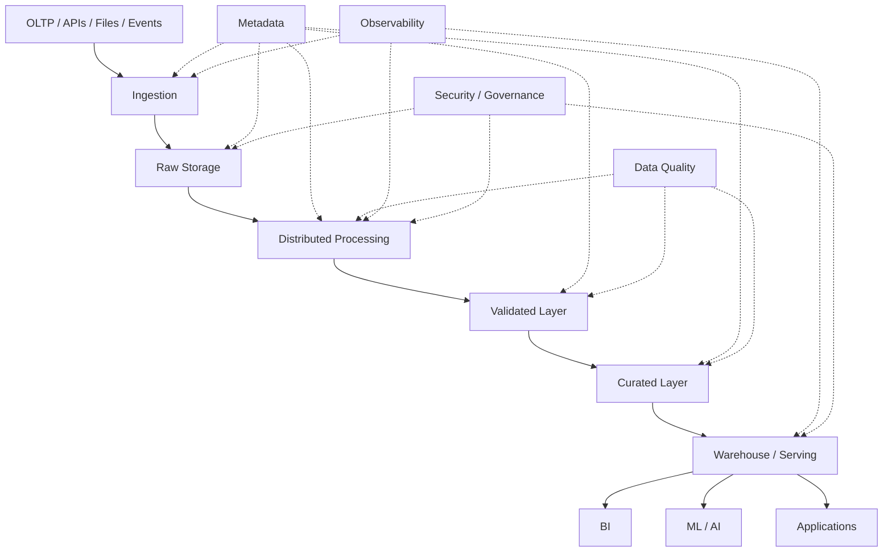

# Big Data Engineering — Top 35 Interview Questions & Answers

> **Target:** Senior / Lead / Staff Data Engineer
> **Goal:** 70+ LPA product-based companies
> **Focus:** Hadoop, HDFS, YARN, MapReduce, Hive, Spark, distributed processing, partitioning, shuffles, joins, skew, performance, fault tolerance, streaming and production architecture.
>
> **Study rule:** First memorize the **Core Answer**. Then understand the **Why**, **Trade-offs**, and **Follow-up Questions**.

---

# BIG DATA ENGINEERING — INTERVIEW FRAMEWORK

For almost every Big Data question, think in this order:

```text
DATA VOLUME
   ↓
DATA VELOCITY
   ↓
DATA FORMAT
   ↓
COMPUTE MODEL
   ↓
PARTITIONING
   ↓
NETWORK / SHUFFLE
   ↓
MEMORY
   ↓
FAULT TOLERANCE
   ↓
PERFORMANCE
   ↓
COST
   ↓
OPERABILITY
```

At senior level, interviewers are usually testing whether you understand:

* How data is distributed.
* Where data movement occurs.
* What causes bottlenecks.
* How failures are handled.
* How the system scales.
* How to debug production issues.
* Why one design is preferable to another.

---

# 1. What problem does Big Data Engineering solve?

## Core Answer

* Big Data Engineering deals with processing datasets that are too large, too fast, or too complex for a single-machine approach.
* The main idea is **distributed storage + distributed computation**.
* Instead of processing everything on one machine:

  * Split data.
  * Store data across machines.
  * Process partitions in parallel.
  * Aggregate results.

## Basic architecture


## Why distributed systems?

* Vertical scaling has limits.
* Large data may exceed RAM/disk/network capacity of one machine.
* Parallel processing reduces elapsed time.
* Fault tolerance is possible through replication and recomputation.

## Senior-level point

> "The value of distributed computing is not just storing more data. It is allowing storage and computation to scale horizontally while tolerating individual machine failures."

---

# 2. Explain the Hadoop ecosystem.

## Core Answer

Historically, Hadoop is a distributed data ecosystem built around several major components.

```text
                 HADOOP ECOSYSTEM

        ┌───────────────────────────┐
        │          HDFS             │
        │    Distributed Storage    │
        └─────────────┬─────────────┘
                      │
        ┌─────────────┴─────────────┐
        ↓                           ↓
    MapReduce                     Hive
 Distributed Compute        SQL Analytics
        │
        ↓
      YARN
 Resource Management
        │
        ↓
   Cluster Resources
```

## Key components

### HDFS

* Distributed filesystem.
* Stores blocks across DataNodes.
* Provides fault tolerance through replication.

### YARN

* Cluster resource management.
* Schedules and manages applications.

### MapReduce

* Distributed processing model.

### Hive

* SQL abstraction for distributed data processing.

### Sqoop

* Historically used for relational database ↔ Hadoop movement.

Your resume specifically includes:

* Hadoop
* Hive
* Spark
* Scala
* Sqoop

in your American Express big-data work.

---

# 3. Explain HDFS architecture.

## Core Answer

HDFS has:

* NameNode.
* DataNodes.
* Client.



## NameNode

Responsible for:

* Filesystem namespace.
* Directory structure.
* File-to-block mapping.
* Block-to-DataNode mapping.
* Metadata.

## DataNode

Responsible for:

* Actual block storage.
* Read/write operations.
* Block replication.

The Hadoop documentation describes the NameNode as maintaining the filesystem namespace and the DataNodes as storing and serving the actual data blocks.

## Important distinction

The NameNode does **not** normally carry the actual file contents during client I/O.

Instead:

```text
Client → NameNode → "Where are the blocks?"
Client → DataNodes → "Give me the blocks."
```

## Follow-up

### Q: What happens if a DataNode dies?

* NameNode detects missed heartbeats.
* Affected blocks may have fewer replicas.
* Replication is initiated to restore the desired replication level.

---

# 4. Why is data divided into blocks in HDFS?

## Core Answer

A large file is split into blocks so it can be:

* Distributed across machines.
* Read in parallel.
* Replicated.
* Processed close to where the data exists.

Example:

```text
10 TB File

Block 1 → Node A
Block 2 → Node B
Block 3 → Node C
Block 4 → Node D
...
```

Now multiple machines can participate in processing.

## Why not one giant file on one machine?

Because:

* One machine becomes bottleneck.
* Hardware capacity limits storage.
* Parallelism is lost.
* Failure of that machine becomes more severe.

HDFS was designed for very large files and distributes file blocks among DataNodes while replicating those blocks for fault tolerance.

---

# 5. What is replication in HDFS and why is it required?

## Core Answer

Replication means maintaining multiple copies of each block.

Conceptually:

```text
Block A
  ├── Replica 1 → Node 1
  ├── Replica 2 → Node 2
  └── Replica 3 → Node 3
```

If Node 1 fails:

```text
Node 1 ❌
Node 2 ✅
Node 3 ✅
```

The data is still available.

## Why?

Commodity infrastructure can experience:

* Disk failures.
* Machine failures.
* Network failures.
* Node failures.

The NameNode tracks replication and triggers re-replication when block replicas fall below the configured level.

## Interview trap

Replication provides **availability and fault tolerance**, but it consumes additional storage.

---

# 6. What happens when a client reads a file from HDFS?

## Core Answer

The process is roughly:

```text
1. Client asks NameNode for block locations
2. NameNode returns DataNode locations
3. Client selects appropriate DataNode
4. Client reads block directly
5. Repeat for remaining blocks
```



## Senior point

The NameNode is primarily a **metadata service**, while DataNodes handle data transfer.

---

# 7. Explain NameNode HA and why it matters.

## Core Answer

A single NameNode can become a critical failure point.

High Availability architecture uses multiple NameNode roles.

Conceptually:

```text
             HDFS HA

          ┌─────────────┐
          │ Active NN   │
          └──────┬──────┘
                 │
         Shared / Journal
                 │
          ┌──────┴──────┐
          │ Standby NN  │
          └─────────────┘
```

## Goal

If Active NameNode becomes unavailable:

* Standby can take over.
* Filesystem metadata remains available.
* Cluster availability improves.

## Important

HA is not the same thing as data replication.

```text
HDFS block replication
→ protects data blocks

NameNode HA
→ protects metadata service availability
```

---

# 8. What is YARN? Explain its architecture.

## Core Answer

YARN separates:

* Resource management.
* Application-specific execution/monitoring.

Major components:

### ResourceManager

* Global resource authority.
* Scheduler.
* Application management.

### NodeManager

* Runs on each machine.
* Manages containers.
* Monitors CPU/memory/disk/network usage.

### ApplicationMaster

* One per application.
* Negotiates resources.
* Coordinates execution.

Apache Hadoop's current YARN documentation describes the ResourceManager, NodeManager and per-application ApplicationMaster responsibilities this way.

## Architecture



---

# 9. What is the difference between HDFS and YARN?

## Core Answer

This is an extremely common question.

| Component | Responsibility                   |
| --------- | -------------------------------- |
| HDFS      | Distributed storage              |
| YARN      | Resource management              |
| MapReduce | Distributed processing           |
| Hive      | SQL/data warehousing abstraction |

Think:

```text
HDFS → Where is the data?

YARN → Where can the computation run?

Compute Engine → How is the computation performed?
```

## Senior answer

> "HDFS solves distributed storage, while YARN solves cluster resource allocation and application management."

---

# 10. Explain MapReduce.

## Core Answer

MapReduce processes data in two conceptual stages:

```text
INPUT
  ↓
MAP
  ↓
SHUFFLE / SORT
  ↓
REDUCE
  ↓
OUTPUT
```

## Example

Input:

```text
apple banana
apple orange
banana apple
```

Mapper emits:

```text
apple → 1
banana → 1
apple → 1
orange → 1
banana → 1
apple → 1
```

Shuffle groups:

```text
apple → [1,1,1]
banana → [1,1]
orange → [1]
```

Reducer:

```text
apple → 3
banana → 2
orange → 1
```

## Why is shuffle expensive?

Because data may have to move:

* Across partitions.
* Across machines.
* Across the network.

That makes network and disk I/O important bottlenecks.

---

# 11. What is the difference between MapReduce and Spark?

## Core Answer

### MapReduce

* Disk-heavy execution model.
* Map and Reduce phases.
* Intermediate results commonly written to disk.
* High latency for iterative workloads.

### Spark

* DAG-based execution.
* Can keep intermediate data in memory where useful.
* Supports SQL, batch, streaming and machine learning workloads.
* More flexible execution model.

## Comparison

```text
MapReduce

Map → Disk → Shuffle → Disk → Reduce


Spark

Transformations → DAG → Optimized stages
                         ↓
                  Memory / Disk
```

## Senior answer

> "Spark is not simply MapReduce in memory. Its execution engine builds a DAG, divides work into stages around shuffle boundaries, and optimizes execution using mechanisms such as Catalyst and AQE for Spark SQL."

---

# 12. What is an RDD?

## Core Answer

RDD = **Resilient Distributed Dataset**.

It is:

* Distributed.
* Partitioned.
* Fault-tolerant.
* Immutable.
* Lazily evaluated.

## Why "Resilient"?

Spark can recover lost partitions by recomputing them from lineage rather than necessarily replicating every intermediate result.

Spark's RDD documentation explains partitioned distributed datasets and the role of lineage in computation.

## Example

```python
rdd = sc.textFile("logs")
result = rdd.map(lambda x: x.split(","))
```

## Important

RDDs are lower-level than DataFrames.

---

# 13. RDD vs DataFrame vs Dataset — explain.

## Core Answer

### RDD

* Low-level abstraction.
* Full control over records/partitions.
* Less optimizer assistance.
* More manual work.

### DataFrame

* Structured data.
* Column-based API.
* Catalyst optimization.
* Tungsten execution improvements.
* Usually preferred for analytical transformations.

### Dataset

* Strongly typed abstraction in Scala/Java.
* Combines object-oriented typing with Spark SQL execution capabilities.

## General preference

```text
DataFrame
    ↓
Usually preferred for structured ETL

RDD
    ↓
Use when low-level control is actually needed
```

## Senior interview answer

> "For structured production ETL, I generally prefer DataFrames because Spark can optimize the logical and physical plan. I would use RDDs when I genuinely need lower-level control."

---

# 14. Explain Spark Driver, Executor and Cluster Manager.

## Core Answer

### Driver

Responsible for:

* Creating SparkSession/SparkContext.
* Building execution plan.
* Scheduling work.
* Coordinating application.

### Executors

Responsible for:

* Running tasks.
* Holding cached data.
* Reporting status back to driver.

### Cluster Manager

Allocates resources.

Examples:

* Kubernetes.
* YARN.
* Standalone.



---

# 15. What is a Spark Job, Stage and Task?

## Core Answer

### Job

Created when an action is invoked.

Examples:

```python
count()
collect()
write()
```

### Stage

A job is divided into stages around shuffle boundaries.

### Task

A unit of work executed for one partition.

Conceptually:

```text
Action
  ↓
Job
  ↓
Stages
  ↓
Tasks
  ↓
Executors
```

Spark's scheduler documentation explains that an action creates a job and that jobs are divided into stages composed of tasks.

## Example

```text
read
 ↓
filter
 ↓
groupBy
 ↓
write
```

Potentially:

```text
Stage 1
read + filter

       ↓ SHUFFLE

Stage 2
groupBy + aggregation + write
```

---

# 16. What is lazy evaluation in Spark?

## Core Answer

Transformations generally do not execute immediately.

Example:

```python
df2 = df.filter(df.age > 30)
```

Spark does not necessarily execute the filter immediately.

It builds a plan.

Actual execution occurs when an action is called:

```python
df2.count()
```

## Flow

```text
Transformation
     ↓
Logical Plan
     ↓
More transformations
     ↓
Optimized Plan
     ↓
Action
     ↓
Execution
```

## Why useful?

Spark can:

* Combine operations.
* Eliminate unnecessary work.
* Push filters.
* Prune columns.
* Choose better physical strategies.

---

# 17. Explain narrow vs wide transformations.

## Narrow transformation

Each output partition depends on a small number of input partitions.

Examples:

* `map`
* `filter`
* `select`

Conceptually:

```text
P1 → P1
P2 → P2
P3 → P3
```

No major redistribution required.

## Wide transformation

Output partitions require data from multiple input partitions.

Examples:

* `groupBy`
* `reduceByKey`
* Many joins
* `distinct`
* `orderBy`

```text
P1 ──┐
P2 ──┼→ Shuffle → New Partitions
P3 ──┘
```

## Why important?

Wide transformations introduce shuffle.

Shuffle often means:

* Network transfer.
* Serialization.
* Disk I/O.
* More stages.

---

# 18. What is shuffle in Spark?

## Core Answer

Shuffle is the redistribution of data across partitions so related records can be processed together.

Example:

```python
df.groupBy("customer_id").sum("amount")
```

Rows belonging to the same customer may be spread across different input partitions.

Spark must redistribute them.



## Why shuffle is expensive?

* Network transfer.
* Serialization/deserialization.
* Disk spill.
* CPU.
* Memory pressure.

Spark's current performance documentation identifies tuning partitions and shuffle-related strategies as major areas of query optimization.

## Senior answer

> "When optimizing Spark, I first look for unnecessary shuffle before increasing cluster size."

---

# 19. How do you identify and reduce expensive shuffle?

## Core Answer

First identify:

* Wide transformations.
* Large joins.
* GroupBy.
* Distinct.
* OrderBy.
* Repartition.
* Data skew.

## Reduction techniques

### 1. Filter earlier

```python
df.filter(...)
```

before expensive joins.

### 2. Select only required columns

```python
df.select("id", "amount")
```

### 3. Broadcast small dimension data

### 4. Avoid unnecessary repartition.

### 5. Use appropriate partition keys.

### 6. Handle skew.

### 7. Let AQE optimize runtime partitions where applicable.

Spark's current SQL tuning documentation specifically covers join strategy, partition tuning, AQE, post-shuffle coalescing and skew optimization.

---

# 20. What is data skew? How do you solve it?

## Core Answer

Data skew occurs when one or a few partitions contain much more data than others.

Example:

```text
Partition 1 → 10 MB
Partition 2 → 11 MB
Partition 3 → 9 MB
Partition 4 → 4 GB  ❌
```

Then:

```text
Most tasks finish quickly
        ↓
One task keeps running
        ↓
Stage waits
        ↓
Job becomes slow
```

## How to detect

Look at Spark UI:

* Task duration.
* Input size per task.
* Shuffle read/write.
* Partition distribution.

## Solutions

### 1. Broadcast join

When one side is small.

### 2. Salt the key

```text
customer_id
+
random/salt value
```

### 3. Pre-aggregate

Reduce data before shuffle.

### 4. AQE skew optimization

Spark AQE can dynamically split skewed shuffle partitions and mitigate skew in supported join scenarios.

## Senior answer

> "Before salting, I would establish whether the skew is actually the bottleneck and whether broadcast, pre-aggregation or AQE can solve it more simply."

---

# 21. Explain broadcast join.

## Core Answer

When one table is sufficiently small, Spark can send it to all executors.

```text
               Small Dimension
                     ↓
          ┌──────────┼──────────┐
          ↓          ↓          ↓
        Exec 1     Exec 2     Exec 3

              + Large Fact Data
```

Then workers join locally.

## Why useful?

Avoids shuffling the large table.

Example:

```python
from pyspark.sql.functions import broadcast

result = fact.join(
    broadcast(dim),
    "customer_id"
)
```

Spark SQL has an automatic broadcast threshold and supports broadcast join hints. The current Spark documentation lists a default automatic broadcast threshold of 10 MB, though actual suitability depends on the workload and configuration.

## Risk

If the "small" table is not actually small:

* Executor memory pressure.
* OOM.
* Poor performance.

## Senior answer

> "Broadcast joins are powerful, but I don't treat the configured threshold as the definition of 'safe'. I consider the actual runtime size and executor memory."

---

# 22. Sort-Merge Join vs Broadcast Hash Join.

## Broadcast Hash Join

Best when:

```text
One side is small
```

Avoids large shuffle.

## Sort-Merge Join

Generally suited to large distributed datasets.

Conceptually:

```text
Large A
  ↓
Shuffle
  ↓
Sort

Large B
  ↓
Shuffle
  ↓
Sort

     ↓
   Merge
```

## Comparison

| Join           | Strength             | Risk                |
| -------------- | -------------------- | ------------------- |
| Broadcast Hash | Avoids large shuffle | Memory pressure     |
| Sort-Merge     | Handles large tables | Shuffle + sort cost |

## Senior-level addition

Spark AQE can use runtime statistics to convert a sort-merge join into a broadcast join in situations where the runtime relation is small enough.

---

# 23. What is Adaptive Query Execution (AQE)?

## Core Answer

AQE means Spark can re-optimize query execution during runtime using actual statistics rather than relying entirely on compile-time estimates.

Spark's current documentation states that AQE is enabled by default and can re-optimize plans using runtime statistics.

## AQE can help with

* Coalescing post-shuffle partitions.
* Handling skew.
* Converting sort-merge joins to broadcast joins.
* Converting some joins to shuffled hash joins.

## Concept

```text
Initial Plan
     ↓
Run part of query
     ↓
Collect runtime statistics
     ↓
Re-optimize
     ↓
Continue execution
```

## Why powerful?

Because estimated statistics can be wrong.

Example:

```text
Optimizer expects:
Dimension = 500 MB

Actual:
Dimension = 5 MB
```

AQE can make a better runtime decision.

## Interview question

### Is AQE a replacement for tuning?

No.

You still need:

* Good data layout.
* Correct partitioning.
* Good join logic.
* Sensible configuration.

AQE is an additional runtime optimization layer.

---

# 24. `repartition()` vs `coalesce()`.

## `repartition()`

* Can increase or decrease partitions.
* Performs a shuffle.

```python
df.repartition(100)
```

## `coalesce()`

* Usually reduces the number of partitions.
* Attempts to avoid a full shuffle.

```python
df.coalesce(10)
```

## Simple rule

```text
Need redistribution?
→ repartition

Need fewer partitions after filtering?
→ coalesce
```

## Example

```text
Before filter:
100 partitions

After aggressive filter:
Only 5 GB remains

coalesce(20)
```

can be useful to avoid writing a huge number of tiny files.

---

# 25. How many Spark partitions should you use?

## Core Answer

There is no universal number.

Partition count depends on:

* Input size.
* File layout.
* Cluster cores.
* Transformation complexity.
* Shuffle volume.
* Desired task size.

Spark's current documentation exposes partition-related controls including `spark.sql.shuffle.partitions`, which defaults to 200, while AQE can coalesce post-shuffle partitions dynamically.

## Bad extremes

### Too few

```text
10 huge partitions
```

Problems:

* Low parallelism.
* Long-running tasks.
* Poor cluster utilization.

### Too many

```text
1 million tiny partitions
```

Problems:

* Scheduling overhead.
* Too many small tasks.
* Excessive output files.
* Metadata overhead.

## Senior answer

> "I size partitions based on data volume, cluster parallelism and workload characteristics, then verify the result using the Spark UI."

---

# 26. Explain Spark memory management and why OOM happens.

## Common reasons

### 1. Collecting too much data to driver

```python
df.collect()
```

Potentially dangerous.

### 2. Over-caching

Too much cached data.

### 3. Large broadcast relation

Broadcast table exceeds practical executor memory.

### 4. Data skew

One partition becomes enormous.

### 5. Huge aggregation state.

### 6. Python process memory pressure in PySpark workloads.

## Important distinction

```text
Driver OOM
≠
Executor OOM
```

## Driver OOM examples

* `collect()`
* huge `toPandas()`
* enormous query plan metadata
* driver-side aggregation

## Executor OOM examples

* skew.
* caching.
* joins.
* oversized partitions.
* broadcast data.

## Interview answer

> "Before increasing memory, I identify whether the OOM is on the driver or executor and what operation caused the memory concentration."

---

# 27. When should you use `cache()` or `persist()`?

## Core Answer

Use caching when:

* Same DataFrame is reused multiple times.
* Recomputing it is expensive.
* Memory/storage trade-off is justified.

Example:

```python
clean = (
    raw
    .filter(...)
    .join(...)
)

clean.persist()

clean.count()
clean.write(...)
clean.groupBy(...).count()
```

## Do not cache everything.

Caching can:

* Consume memory.
* Increase eviction/recomputation behavior.
* Cause GC pressure.

Spark's performance documentation explicitly notes that caching uses memory and provides controls such as `cache()` and `unpersist()`.

## Senior answer

> "I cache based on reuse and recomputation cost, not because caching sounds like a performance optimization."

---

# 28. Why is Parquet better than CSV for Big Data analytics?

## CSV

* Row-oriented text.
* Larger storage footprint.
* Weak type information.
* Expensive parsing.
* Poor analytical scan efficiency.

## Parquet

* Columnar.
* Typed schema.
* Compression.
* Predicate pushdown support.
* Column pruning.
* Better analytical performance.

Spark's current Parquet documentation notes partition discovery and the ability of file-based sources to infer partition information from directory layouts.

## Example

Query:

```sql
SELECT customer_id
FROM sales
WHERE country = 'IN';
```

With a columnar layout, the engine may only need:

```text
customer_id
country
```

rather than every column.

## Senior point

> "The advantage isn't merely that Parquet is compressed. Its columnar layout allows analytical engines to avoid reading unnecessary columns."

---

# 29. What is partition pruning?

## Core Answer

Suppose data is partitioned:

```text
sales/
  year=2025/
  year=2026/
```

Query:

```sql
SELECT *
FROM sales
WHERE year = 2026;
```

The engine can skip:

```text
year=2025
```

and read only:

```text
year=2026
```

## Concept

```text
10 TB total
      ↓
partition filter
      ↓
1 TB read
```

## Why important?

* Faster queries.
* Less I/O.
* Lower compute.
* Lower cost.

## Important

Partition pruning only helps if the query predicate aligns with the physical partitioning.

---

# 30. Partitioning vs Bucketing — explain clearly.

## Partitioning

Separates data into directories/partitions based on partition values.

Example:

```text
year=2026/month=10/day=03/
```

Hive documents partitioned tables as separate data directories for distinct partition-value combinations.

## Bucketing

Distributes rows into a fixed number of buckets based on a bucketing column.

Conceptually:

```text
hash(customer_id) % 100
```

→ bucket 0–99.

Hive supports bucketed tables and clustered/sorted layouts.

## Simple comparison

| Feature         | Partitioning           | Bucketing                          |
| --------------- | ---------------------- | ---------------------------------- |
| Primary purpose | Data pruning           | Controlled distribution            |
| Layout          | Directories/partitions | Buckets                            |
| Typical key     | Date                   | High-cardinality join key          |
| Main benefit    | Reduce scanned data    | Potentially improve joins/sampling |

## Important

Both can be misused.

---

# 31. Why is the small-files problem dangerous?

## Example

Instead of:

```text
10 GB
↓
100 files × 100 MB
```

imagine:

```text
10 GB
↓
1,000,000 files × ~10 KB
```

Potential problems:

* Metadata overhead.
* File listing overhead.
* More tasks.
* Scheduling overhead.
* Poor throughput.
* More object-store requests in cloud environments.

## Solutions

* Compact files.
* Batch writes appropriately.
* Avoid excessive partition cardinality.
* Tune output parallelism.
* Use table-format optimization/compaction where available.

## Important interview connection

Partitioning and file sizing must be designed together.

```text
Too many partitions
        +
Too many output tasks
        ↓
Small-file explosion
```

---

# 32. What is Hive? Why was it important?

## Core Answer

Hive provides a SQL-like interface for analytical processing over large distributed datasets.

It introduced concepts such as:

* Tables.
* Partitions.
* Buckets.
* SQL-style queries.
* Metastore.
* Query optimization.

Apache Hive's current language documentation includes support for partitioned tables, bucketing, ORC, joins, statistics and explain plans.

## Example

```sql
SELECT
    country,
    SUM(amount)
FROM sales
GROUP BY country;
```

The user writes SQL while the underlying execution happens through the distributed processing stack configured for the environment.

## Senior perspective

Hive helped abstract distributed data processing behind a familiar SQL interface and established important concepts still used in modern analytical platforms.

---

# 33. Why is ORC important in Hive?

## Core Answer

ORC = **Optimized Row Columnar**.

Benefits include:

* Columnar storage.
* Compression.
* Predicate filtering.
* Lightweight indexes.
* Efficient analytical reads.

The Apache Hive documentation specifically highlights ORC's columnar format, compression, lightweight indexes and predicate-based skipping.

## Concept

```text
Traditional row format

Row1: A B C D
Row2: A B C D
Row3: A B C D


Columnar

A: A A A
B: B B B
C: C C C
D: D D D
```

If a query only needs:

```text
A + C
```

a columnar format can avoid reading B and D.

## ORC vs Parquet

Both are columnar formats.

Choice depends on:

* Engine ecosystem.
* Existing platform.
* Interoperability.
* Compression.
* Query engine support.
* Table/storage technology.

---

# 34. Explain Sqoop incremental import.

## Core Answer

Sqoop historically supports incremental imports to avoid copying an entire relational table repeatedly.

Two documented modes are:

### Append

Used when new rows are added with an increasing column.

Example:

```text
id = 1001
id = 1002
id = 1003
```

Next run can start after:

```text
last_value = 1003
```

### Lastmodified

Used when records can be modified and a suitable modification column exists.

Sqoop's documentation identifies `append` and `lastmodified` incremental modes and uses a check column plus the last processed value.

## Concept

```text
RDBMS
  ↓
Check Column
  ↓
Only changed/new rows
  ↓
Hadoop
```

## Production concern

Incremental loading becomes tricky when:

* Updates happen.
* Deletes happen.
* Timestamps are unreliable.
* Records arrive out of order.
* The pipeline fails after extraction.

## Senior answer

> "For modern architectures, I would evaluate CDC when the business requires reliable change capture, rather than assuming a watermark-based Sqoop pattern is sufficient."

---

# 35. Design a production-grade Big Data platform for 10 TB/day.

> **THIS IS THE MOST IMPORTANT QUESTION IN THIS CHAPTER.**

---

## Step 1 — Clarify requirements

Ask:

### Volume

* 10 TB/day?
* Peak hourly volume?
* Expected growth?

### Velocity

* Batch?
* Near real-time?
* Real-time?

### Data

* Structured?
* Semi-structured?
* Unstructured?

### SLA

* 24 hours?
* 1 hour?
* 5 minutes?

### Consumers

* BI?
* ML?
* APIs?
* Operational analytics?

### Reliability

* RPO?
* RTO?
* Replay requirements?

---

# Architecture



---

## Storage layer

For a classic Hadoop architecture:

```text
HDFS
 ↓
Data blocks
 ↓
Replication
```

For modern cloud architecture:

```text
S3 / ADLS / GCS
```

The architectural principle remains:

> Durable distributed storage should be separated conceptually from compute so both can scale independently where the platform allows it.

---

# Processing layer

Choose based on workload:

### Batch

* Spark.

### Streaming

* Spark Structured Streaming.
* Flink or equivalent streaming technology where needed.

### SQL analytics

* Hive or modern SQL engines depending on platform.

---

# Partition strategy

Example:

```text
dataset/
  event_date=2026-10-01/
  event_date=2026-10-02/
  event_date=2026-10-03/
```

Do not blindly partition by extremely high-cardinality columns.

---

# File format

Prefer analytical columnar formats when appropriate:

```text
Parquet / ORC
```

rather than raw CSV for repeated analytical workloads.

Hive's ORC documentation highlights columnar processing, compression and indexes, while Spark supports partition discovery and efficient Parquet processing.

---

# Processing optimization

I would monitor:

```text
Input size
↓
Number of partitions
↓
Shuffle volume
↓
Task duration
↓
Spill
↓
Executor memory
↓
CPU utilization
↓
Output file count
```

---

# Join strategy

For:

```text
Fact = 5 TB
Dimension = 500 MB
```

I would evaluate:

* Broadcast feasibility.
* Sort-merge join.
* Partition alignment.
* AQE.
* Data distribution.

I would **not** blindly broadcast merely because the dimension is smaller.

---

# Skew

Suppose:

```text
customer_id = UNKNOWN
```

represents 30% of all records.

That creates a huge partition.

Potential solutions:

* Fix data model if possible.
* Pre-aggregate.
* Salt skewed keys.
* Broadcast smaller side.
* AQE skew handling.

Spark's current AQE implementation supports skew optimization for supported shuffle-join scenarios.

---

# Reliability

Every pipeline should consider:

```text
Retry
↓
Idempotency
↓
Checkpoint
↓
Reprocessing
↓
Backfill
↓
Reconciliation
```

---

# Data Quality

Validate:

```text
Schema
Count
Nulls
Duplicates
Keys
Ranges
Freshness
Business Rules
```

---

# Observability

Monitor:

### Infrastructure

* CPU.
* Memory.
* Disk.
* Network.

### Spark

* Stage duration.
* Task skew.
* Shuffle read/write.
* Spill.
* Executor failures.

### Data

* Volume.
* Freshness.
* Null rates.
* Duplicate rates.
* Distribution changes.

---

# Security

Use:

* IAM/RBAC.
* Encryption.
* Secret management.
* Network isolation.
* Access controls.
* Audit logs.
* Data masking where appropriate.

---

# Cost

Optimize:

```text
Storage
+
Compute
+
Network
+
Query cost
+
Operational overhead
```

Do not optimize only infrastructure cost.

A poorly designed pipeline that takes 8 hours instead of 45 minutes may have a much larger overall business cost.

---

# Final Senior-Level Answer

> "For a 10 TB/day workload, I would first establish the latency SLA, source characteristics, growth rate, retention, consumers and recovery requirements. I would use distributed durable storage for raw data and a distributed processing engine such as Spark for large-scale transformations. Data would be organized into logical raw, validated and curated layers. I would use incremental processing where possible, partition according to access patterns, use columnar formats, and aggressively minimize unnecessary shuffle. For joins, I would choose between broadcast and distributed joins based on runtime size and memory constraints. I would monitor the Spark UI for stage imbalance, skew, shuffle and spills rather than simply increasing the cluster size. The pipeline would be retry-safe and idempotent, with checkpointing where required, schema validation, reconciliation, data-quality gates, observability and backfill capability. Finally, I would design governance, security, disaster recovery and cost controls into the platform from the beginning."

---

# 15 HIGH-VALUE FOLLOW-UP QUESTIONS

These are the questions likely to come immediately after your architecture answer.

## Spark Internals

* What exactly causes a stage boundary?
* How does Spark decide the number of tasks?
* What happens during shuffle?
* Why does one task become a straggler?
* What is executor memory vs storage memory?

## Joins

* When would you broadcast?
* What happens when broadcast fails?
* How do you identify skew?
* When would you salt a key?
* Why can a sort-merge join be preferable?

## HDFS

* What happens when a DataNode fails?
* What happens when a NameNode fails?
* What is a block?
* What is replication?
* How does the client locate blocks?

---

# 20 MUST-KNOW BIG DATA COMMANDS / CONCEPTS

Before an interview, make sure you can explain all of these without hesitation:

```text
HDFS
NameNode
DataNode
Replication
Block
Heartbeat
Block Report
YARN
ResourceManager
NodeManager
ApplicationMaster
Container
MapReduce
Mapper
Reducer
Shuffle
RDD
DataFrame
Driver
Executor
Job
Stage
Task
Lazy Evaluation
Narrow Transformation
Wide Transformation
Partition
Repartition
Coalesce
Broadcast Join
Sort-Merge Join
Data Skew
Salting
AQE
Caching
Persistence
Parquet
ORC
Partition Pruning
Bucketing
Small Files
Hive
Metastore
Sqoop
Incremental Import
Fault Tolerance
Checkpointing
Backfill
```

---

# YOUR RESUME → BIG DATA INTERVIEW STORY BANK

Use your real experience rather than giving only textbook answers.

| Interview Question          | Resume Story                              |
| --------------------------- | ----------------------------------------- |
| Explain Hadoop architecture | American Express Big Data Engineering     |
| Explain Hive                | American Express                          |
| Explain Spark               | American Express                          |
| Explain Scala               | American Express                          |
| Explain distributed ETL     | American Express                          |
| Explain Sqoop               | American Express                          |
| Explain performance tuning  | American Express                          |
| Explain reconciliation      | American Express                          |
| Explain PySpark validation  | File-vs-File Validation Accelerator       |
| Explain scalable validation | Universal Validator                       |
| Explain automation          | DataOps Automation Platform               |
| Explain metadata            | Data Quality / Schema Governance projects |

Your American Express project specifically involved Hadoop, Hive, Spark, Scala and Sqoop, with Spark/Scala ETL, Hive analytical datasets, Sqoop ingestion and distributed-workload tuning.

Your file-validation accelerator also uses PySpark and supports CSV, JSON, Parquet and Excel datasets, which gives you another practical Big Data story.

---

# HOW TO ANSWER "I HAVE 10 TB AND IT IS SLOW"

Never immediately say:

```text
"Increase cluster size."
```

Instead say:

```text
1. Check Spark UI
        ↓
2. Identify slow stage
        ↓
3. Check input size
        ↓
4. Check partition distribution
        ↓
5. Check shuffle
        ↓
6. Check skew
        ↓
7. Check join strategy
        ↓
8. Check spills / memory
        ↓
9. Check file format/layout
        ↓
10. Optimize code/data layout
        ↓
11. Scale infrastructure if still required
```

This demonstrates engineering maturity.

---

# THE 10 GOLDEN BIG DATA STATEMENTS

Memorize these.

### 1

> "I first identify where the data is moving, because network movement is often more expensive than local computation."

### 2

> "A wide transformation introduces a redistribution requirement, which can create an expensive shuffle."

### 3

> "More executors do not automatically solve a bad partitioning strategy."

### 4

> "I distinguish driver failures from executor failures before deciding how to fix an OOM."

### 5

> "I use broadcast joins only when the smaller side is genuinely safe to distribute to executors."

### 6

> "Data skew can create a single straggler task that determines the runtime of the entire stage."

### 7

> "I use Spark UI and execution metrics to validate optimization instead of assuming a tuning change helped."

### 8

> "Partitioning should follow query and processing patterns, not simply the highest-cardinality business key."

### 9

> "File format and file size are part of query performance, not merely storage concerns."

### 10

> "At scale, the architecture must be designed for failure because individual machines are expected to fail."

---

# QUICK REVISION SHEET

```text
HDFS
├── NameNode → Metadata
├── DataNode → Actual blocks
├── Replication → Fault tolerance
└── Client → Metadata first, data directly from DataNodes

YARN
├── ResourceManager
├── NodeManager
└── ApplicationMaster

SPARK
├── Driver
├── Executors
├── Jobs
├── Stages
├── Tasks
└── Partitions

SPARK PERFORMANCE
├── Avoid unnecessary shuffle
├── Filter early
├── Select fewer columns
├── Broadcast small tables
├── Handle skew
├── Tune partitions
├── Use AQE
├── Avoid unnecessary cache
└── Fix small files

HIVE
├── Tables
├── Partitions
├── Buckets
├── Metastore
└── ORC

INGESTION
├── Full Load
├── Incremental
└── CDC

RELIABILITY
├── Retry
├── Idempotency
├── Checkpoint
├── Backfill
└── Reconciliation
```

---

# FINAL INTERVIEW TEST

You are ready to move on from this chapter when you can explain, without notes:

```text
□ HDFS architecture
□ NameNode vs DataNode
□ HDFS replication
□ HDFS failure recovery
□ NameNode HA
□ YARN architecture
□ ResourceManager vs NodeManager
□ ApplicationMaster
□ MapReduce
□ MapReduce vs Spark
□ RDD
□ DataFrame
□ Driver vs Executor
□ Job vs Stage vs Task
□ Lazy evaluation
□ Narrow vs Wide transformation
□ Shuffle
□ Shuffle optimization
□ Data skew
□ Salting
□ Broadcast Join
□ Sort-Merge Join
□ AQE
□ Repartition vs Coalesce
□ Partition sizing
□ Spark memory/OOM
□ Cache/Persist
□ Parquet
□ Partition pruning
□ Hive
□ Hive partitioning
□ Bucketing
□ ORC
□ Small-files problem
□ Sqoop incremental loading
□ Production Big Data architecture
```

---

# SOURCES USED FOR THIS CHAPTER

* Apache Spark 4.2.0 — Performance Tuning, AQE, joins, partitions and caching.
* Apache Spark 4.2.0 — RDD Programming Guide.
* Apache Spark 4.2.0 — Job Scheduling.
* Apache Spark 4.2.0 — Parquet and partition discovery.
* Apache Hadoop — HDFS Architecture and fault tolerance.
* Apache Hadoop — HDFS User Guide.
* Apache Hadoop YARN — current architecture/documentation.
* Apache Hive — Language Manual, partitions, buckets, joins and analytics.
* Apache Hive — ORC documentation.
* Apache Sqoop — incremental import documentation.

---

# END OF TOPIC 2

Next topics in your requested sequence:

```text
3. SQL — Practical + Programming
4. Python — Practical + Programming
5. PySpark — Practical + Programming
6. DevOps — Top 10
7. AI — Data Engineering Specific — Top 10
8. Databricks
9. Snowflake
10. AWS
11. Azure
12. GCP
```
