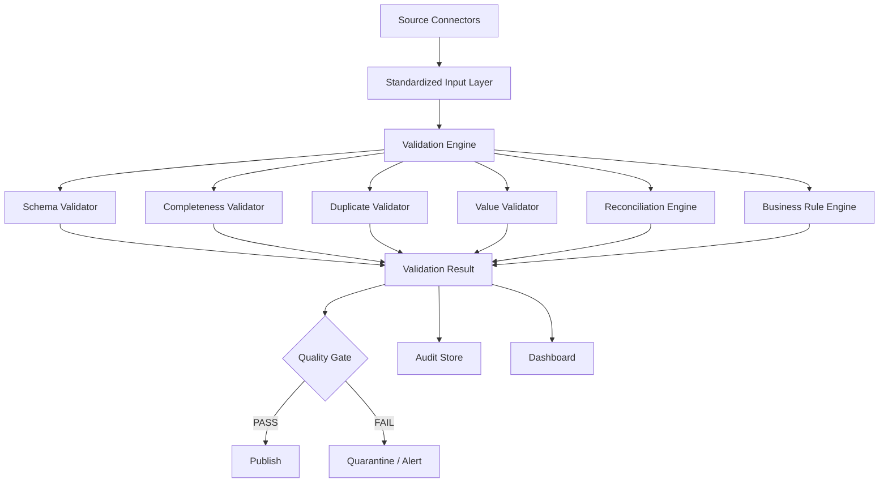

# Python — Top 35 Practical & Programming Interview Questions

> **Target:** Senior / Lead / Staff Data Engineer
> **Goal:** 70+ LPA product-based companies
> **Focus:** Python fundamentals, production coding, ETL automation, APIs, files, JSON, memory, generators, decorators, concurrency, error handling, testing, Pandas, performance and Data Engineering coding problems.
>
> **Study rule:** Don't memorize code line by line. Understand the **pattern**, the **trade-off**, and the **complexity**.

---

# 0. HOW TO APPROACH PYTHON INTERVIEW QUESTIONS

For a senior-level Python coding question:

```text id="3n8m6h"
1. Clarify input
        ↓
2. Clarify expected output
        ↓
3. Identify edge cases
        ↓
4. Choose data structure
        ↓
5. Write simple correct solution
        ↓
6. Analyze time complexity
        ↓
7. Analyze space complexity
        ↓
8. Optimize if required
        ↓
9. Discuss production concerns
```

For example, if asked:

> "Find duplicate customer IDs."

Don't immediately write code.

Think:

```text id="yn2xxm"
Input size?
Can fit in memory?
Need exact duplicates or approximate?
Case-sensitive?
Need all duplicates or only duplicate IDs?
Can data arrive as a stream?
```

That is the difference between:

```text
Python programmer
```

and:

```text
Senior Data Engineer who uses Python
```

---

# 1. What are the most important Python data structures and when would you use each?

## Core Answer

The primary built-in structures are:

```text
list
tuple
set
dict
```

## List

Use when:

* Order matters.
* Duplicates are allowed.
* Mutable collection is required.

```python id="1d5zfj"
numbers = [10, 20, 30, 20]
```

Typical operations:

* Append.
* Iterate.
* Index.
* Slice.

---

## Tuple

Use when:

* Collection is conceptually immutable.
* Fixed structure is useful.
* Can be used as a dictionary key if contents are hashable.

```python id="38frqk"
point = (10, 20)
```

---

## Set

Use when:

* Uniqueness matters.
* Fast membership checks are required.

```python id="r5d0frl"
customer_ids = {101, 102, 103}

if customer_id in customer_ids:
    ...
```

Average-case membership is O(1).

---

## Dictionary

Use for:

```textkey → value
```

Example:

```python id="sh22cv"
customer = {
    "id": 101,
    "name": "Krishna"
}
```

Very useful for:

* Lookup.
* Grouping.
* Counting.
* Joins.
* Metadata.
* Configuration.

---

## Senior Data Engineering example

If you need:

> "Count occurrences of 100 million records."

A dictionary can work for a bounded key cardinality, but I would first ask whether everything can fit into memory.

For large data:

```textraw file
   ↓
stream records
   ↓
aggregate in chunks
   ↓
persist partial results
```

---

# 2. What is the difference between `list`, `tuple`, `set`, and `dict` in terms of performance?

## Core Answer

Typical average-case behavior:

| Operation     |           List | Tuple |      Set |     Dict |
| ------------- | -------------: | ----: | -------: | -------: |
| Index access  |           O(1) |  O(1) |      N/A |      N/A |
| Membership    |           O(n) |  O(n) | O(1) avg | O(1) avg |
| Append        | O(1) amortized |   N/A | O(1) avg | O(1) avg |
| Lookup by key |            N/A |   N/A | O(1) avg | O(1) avg |

## Example

Bad:

```python id="0abj19"
if customer_id in customer_ids_list:
    ...
```

for millions of membership checks.

Potentially better:

```python id="qrjt5m"
customer_ids_set = set(customer_ids_list)

if customer_id in customer_ids_set:
    ...
```

## Senior point

Don't optimize based solely on Big-O.

Also consider:

* Actual data size.
* Memory.
* Hashing cost.
* Ordering requirements.
* Serialization.
* Distributed execution.

---

# 3. Explain mutable vs immutable objects.

## Immutable

Cannot be changed after creation.

Examples:

```text
int
float
str
tuple
frozenset
```

## Mutable

Can be modified.

Examples:

```text
list
dict
set
```

## Example

```python id="a6j7hl"
x = "hello"
x.upper()
```

The original string is not modified.

Instead, a new value is returned.

---

## Why does this matter?

Because references point to objects.

```python id="qri0vj"
a = [1, 2, 3]
b = a

b.append(4)
```

Now:

```text id="y2q6va"
a → [1, 2, 3, 4]
b → [1, 2, 3, 4]
```

Both names refer to the same mutable object.

---

# 4. Explain shallow copy vs deep copy.

## Shallow copy

Copies the outer container but nested objects may still be shared.

```python id="fqws36"
import copy

a = [[1, 2], [3, 4]]
b = copy.copy(a)

b[0].append(99)
```

The nested list is shared.

---

## Deep copy

Recursively copies nested objects.

```python id="axh5bc"
b = copy.deepcopy(a)
```

Now nested objects are independent.

```text id="sk3f8h"
Shallow:

A → [ ──→ nested object
      ──→ nested object ]

B → [ ──→ same nested object
      ──→ same nested object ]


Deep:

A → [ → nested A
      → nested A ]

B → [ → nested B
      → nested B ]
```

## Production consideration

Deep copying large DataFrames or nested structures can be very expensive.

Don't use `deepcopy()` as a default solution.

---

# 5. Why are mutable default arguments dangerous?

## Problem

This code:

```python id="9s8d4m"
def add_item(item, items=[]):
    items.append(item)
    return items
```

does not create a fresh list on every function call.

Example:

```python id="tbi5tg"
print(add_item(1))
print(add_item(2))
```

can produce:

```text
[1]
[1, 2]
```

## Correct solution

```python id="8jm8l6"
def add_item(item, items=None):
    if items is None:
        items = []

    items.append(item)
    return items
```

## Why?

Default argument expressions are evaluated when the function is defined, not every time the function is called.

## Senior follow-up

### Q: Does this apply only to lists?

No.

Any mutable object can cause the same issue:

```text
dict
set
custom mutable object
```

---

# 6. Explain `is` vs `==`.

## `==`

Checks value equality.

```python id="xk6r6o"
a = [1, 2]
b = [1, 2]

a == b
```

Result:

```text
True
```

## `is`

Checks object identity.

```python id="m1u7tq"
a is b
```

Result:

```text
False
```

because they are different list objects.

## Important rule

Use:

```python id="2qg5f7"
if x is None:
```

rather than:

```python id="g6v6t1"
if x == None:
```

---

# 7. Explain generators and why they are extremely important in Data Engineering.

## Core Answer

A generator produces values lazily instead of creating the complete result in memory.

Example:

```python id="aqf0qk"
def read_numbers():
    for i in range(10):
        yield i
```

Usage:

```python id="p8zi8u"
for n in read_numbers():
    print(n)
```

## Memory difference

List:

```python id="wuwt08"
numbers = [x for x in range(10_000_000)]
```

All values are materialized.

Generator:

```python id="1yw2cl"
numbers = (x for x in range(10_000_000))
```

Values are produced as needed.

## Data Engineering example

Processing a huge file:

```python id="w2u8iv"
def read_large_file(path):
    with open(path, "r") as f:
        for line in f:
            yield line
```

Then:

```python id="ny4v3r"
for line in read_large_file("transactions.csv"):
    process(line)
```

## Why important?

You can process datasets larger than available RAM.

The Python documentation defines generators as functions that use `yield` to produce a sequence of values lazily, with execution resumed between yielded values. ([docs.python.org](https://docs.python.org/3/reference/expressions.html?utm_source=chatgpt.com))

---

# 8. What is the difference between an iterator and an iterable?

## Iterable

An object that can be iterated over.

Examples:

```text
list
tuple
string
set
dict
```

## Iterator

An object that implements the iteration protocol:

```python id="a2c79z"
__iter__()
__next__()
```

Example:

```python id="70smzf"
numbers = iter([1, 2, 3])

next(numbers)
next(numbers)
next(numbers)
```

After the last value:

```text
StopIteration
```

## Mental model

```text id="s3qk8w"
Iterable
   ↓
iter()
   ↓
Iterator
   ↓
next()
   ↓
next()
   ↓
next()
```

## Follow-up

### Q: Are generators iterators?

Yes.

A generator object implements the iterator protocol.

---

# 9. Write a function to process a huge file without loading it into memory.

## Problem

Input:

```text
10 GB CSV
```

Do not do:

```python id="xqg4k0"
data = open("10gb.csv").read()
```

## Better

```python id="6u5vmu"
def process_file(path):
    with open(path, "r", encoding="utf-8") as f:
        for line in f:
            yield line.rstrip("\n")

for line in process_file("10gb.csv"):
    process(line)
```

## Why?

Memory usage remains approximately proportional to:

```text
one/few records
```

rather than:

```text
entire file
```

## Production additions

Handle:

* Encoding errors.
* Malformed lines.
* Logging.
* Retry strategy.
* File corruption.
* Partial processing.
* Checkpointing.

## Senior answer

> "For large files, I prefer streaming iteration and chunk-based processing. I avoid materializing the entire dataset unless I have a verified reason and sufficient memory."

---

# 10. How would you process a 100 GB CSV efficiently with Python?

## First question

> "Does it really need to be processed with pure Python?"

If the data is 100 GB:

```text
Python row-by-row
```

may be inefficient.

I'd evaluate:

```text
PySpark
Pandas chunking
Polars
SQL engine
Cloud warehouse
Distributed processing
```

depending on the workload.

## If Python/Pandas is required

Use chunks:

```python id="mu1pyo"
import pandas as pd

for chunk in pd.read_csv(
    "transactions.csv",
    chunksize=500_000
):
    process(chunk)
```

## Benefits

* Bounded memory.
* Incremental processing.
* Easier aggregation.

## Senior answer

> "The right solution depends on whether the transformation is single-machine or distributed. Python is the orchestration and automation language; it doesn't mean every 100 GB transformation should happen inside a Python process."

---

# 11. Explain `*args` and `**kwargs`.

## `*args`

Accepts variable positional arguments.

```python id="ku2n6i"
def add(*args):
    return sum(args)

add(1, 2, 3, 4)
```

## `**kwargs`

Accepts variable keyword arguments.

```python id="5spwq1"
def configure(**kwargs):
    print(kwargs)

configure(
    source="postgres",
    target="snowflake"
)
```

## Data Engineering use case

Framework configuration:

```python id="h8fwg1"
run_pipeline(
    source="postgres",
    table="customer",
    load_type="incremental",
    batch_size=100000
)
```

Can be captured with `**kwargs`.

## Senior warning

Do not overuse dynamic `**kwargs` in critical APIs.

Explicit parameters provide:

* Better readability.
* Better type checking.
* Better IDE support.
* Better maintainability.

---

# 12. What are decorators? Give a production Data Engineering example.

## Core Answer

A decorator wraps a function and modifies/adds behavior without changing the original function's core logic.

Example:

```python id="h1w2yp"
from functools import wraps
import time

def timing(func):
    @wraps(func)
    def wrapper(*args, **kwargs):
        start = time.perf_counter()

        result = func(*args, **kwargs)

        elapsed = time.perf_counter() - start
        print(f"{func.__name__}: {elapsed:.2f}s")

        return result

    return wrapper
```

Use:

```python id="zzc4et"
@timing
def transform_data():
    ...
```

## Data Engineering applications

Decorators can implement:

* Logging.
* Metrics.
* Timing.
* Retry behavior.
* Authorization.
* Validation.
* Tracing.

## Important

Use:

```python id="1nsdkc"
@wraps(func)
```

to preserve useful function metadata.

---

# 13. Write a retry decorator with exponential backoff.

## Solution

```python id="r0k6hr"
import time
from functools import wraps


def retry(max_attempts=3, base_delay=1):
    def decorator(func):

        @wraps(func)
        def wrapper(*args, **kwargs):
            attempt = 0

            while True:
                try:
                    return func(*args, **kwargs)

                except Exception:
                    attempt += 1

                    if attempt >= max_attempts:
                        raise

                    delay = base_delay * (2 ** (attempt - 1))
                    time.sleep(delay)

        return wrapper

    return decorator
```

Usage:

```python id="j7v6y5"
@retry(max_attempts=4)
def call_api():
    ...
```

## Retry schedule

```text id="pxih3l"
Attempt 1
   ↓
failure
   ↓
1 sec
   ↓
Attempt 2
   ↓
failure
   ↓
2 sec
   ↓
Attempt 3
   ↓
failure
   ↓
4 sec
```

## Production improvements

Add:

* Exponential backoff.
* Jitter.
* Exception-specific retries.
* Maximum delay.
* Logging.
* Metrics.
* Timeout.
* Idempotency.

## Critical point

Don't retry:

```text
invalid input
schema validation errors
authentication failures
known permanent errors
```

blindly.

---

# 14. Explain exception handling in production Python.

## Basic structure

```python id="6j0f6y"
try:
    result = process()
except ValueError as e:
    handle_data_error(e)
except ConnectionError as e:
    retry_or_alert(e)
finally:
    cleanup()
```

## Good practice

Catch the **most specific** exception you can handle.

Avoid:

```python id="2kh6v0"
except Exception:
    pass
```

This hides failures.

## Bad

```python id="4k9gwy"
try:
    process_pipeline()
except Exception:
    print("something failed")
```

The job may appear successful to an orchestrator.

## Better

```python id="v4v7pk"
try:
    process_pipeline()
except ValueError as exc:
    logger.error("Validation failed", exc_info=True)
    raise
```

## Senior answer

> "A production pipeline should make failures observable and actionable. Exception handling should not silently convert failures into successful runs."

---

# 15. Explain context managers and write one.

## Core Answer

Context managers manage setup and cleanup around a block of code.

Classic example:

```python id="7l0l4x"
with open("data.txt") as f:
    data = f.read()
```

The file is properly closed after the block.

## Why use them?

* Resource cleanup.
* Lock management.
* Database connections.
* Files.
* Transactions.
* Temporary resources.

## Custom example

```python id="b7k42o"
from contextlib import contextmanager


@contextmanager
def managed_resource():
    resource = acquire_resource()

    try:
        yield resource
    finally:
        release_resource(resource)
```

Usage:

```python id="w3uzot"
with managed_resource() as resource:
    process(resource)
```

## Production use

Useful for:

```text
database connection
transaction
temporary directory
distributed lock
API session
```

---

# 16. Explain Python memory management.

## Core Answer

CPython primarily manages objects using:

* Reference counting.
* Garbage collection for cyclic references.
* Allocator mechanisms.

Python's implementation also has specialized memory-management behavior beyond the simple "reference count = memory management" explanation.

## Concept

```text id="e5u7b8"
Variable
   ↓
Python Object
   ↓
Reference count
   ↓
No references?
   ↓
Object can be reclaimed
```

## Circular reference problem

```python id="m6d4jq"
a = []
a.append(a)
```

Now `a` refers to itself.

Reference counting alone cannot immediately reclaim that cycle.

The garbage collector can identify cyclic garbage.

## Production implication

For large Data Engineering jobs, memory issues may come from:

* Materializing huge lists.
* Large dictionaries.
* DataFrame copies.
* Accidental references.
* Caches.
* Driver-side collection.

---

# 17. What is the GIL? Does it still matter?

## Core Answer

The GIL = **Global Interpreter Lock** in CPython.

In the traditional GIL-enabled build, only one thread at a time executes Python bytecode while holding the GIL.

The GIL is released around some blocking I/O operations, so threads can still provide useful concurrency for I/O-bound workloads. ([docs.python.org](https://docs.python.org/3.14/c-api/threads.html?utm_source=chatgpt.com))

## Traditional model

```text id="bp0z8y"
Thread 1 ─┐
Thread 2 ─┼→ GIL → Python execution
Thread 3 ─┘
```

## For I/O-bound work

Threads can still help:

```text
API call
DB query
File I/O
Network request
```

because blocking operations can release the GIL.

## For CPU-bound pure Python

Threads traditionally do not provide true parallel execution of Python bytecode across cores under the GIL-enabled build.

Prefer:

```text
multiprocessing
ProcessPoolExecutor
native/vectorized libraries
distributed processing
```

depending on the workload.

## Important 2026 update

Python 3.13 introduced a free-threaded CPython build in which the GIL can be disabled, and Python 3.14 made free-threaded mode officially supported. However, compatibility and performance characteristics vary by library, and some extension modules can re-enable the GIL. ([docs.python.org](https://docs.python.org/3.14/howto/free-threading-python.html?utm_source=chatgpt.com))

## Senior answer

> "I don't treat 'Python has a GIL' as the complete answer anymore. For standard GIL-enabled CPython, threads are particularly useful for I/O-bound concurrency. Free-threaded CPython now exists as an optional supported mode, but I still evaluate the actual runtime and library ecosystem before designing around it."

---

# 18. Threading vs multiprocessing vs asyncio — when do you use each?

## Threading

Best fit:

```text
I/O-bound concurrent tasks
```

Examples:

* API calls.
* File operations.
* Network requests.

```text id="s6t6t9"
Thread 1 → API
Thread 2 → API
Thread 3 → API
```

---

## Multiprocessing

Useful for:

```text
CPU-heavy workloads
```

Each process has its own Python interpreter state.

Conceptually:

```text id="8m1w3r"
Process 1 → CPU core 1
Process 2 → CPU core 2
Process 3 → CPU core 3
```

---

## Asyncio

Useful for many concurrent I/O operations where async-compatible libraries are available.

```python id="4vh7xg"
async def fetch_data():
    ...
```

Python's asyncio documentation describes it as a library for concurrent code using `async`/`await`, particularly suited to I/O-bound and network-oriented work. ([docs.python.org](https://docs.python.org/3/library/asyncio.html?utm_source=chatgpt.com))

---

## Decision table

| Workload                            | Typical choice      |
| ----------------------------------- | ------------------- |
| Many API requests                   | asyncio / threads   |
| Network I/O                         | asyncio / threads   |
| CPU-heavy Python                    | multiprocessing     |
| Distributed transformations         | Spark               |
| Large-scale ETL                     | Spark / SQL engine  |
| Single-process vectorized analytics | Pandas/NumPy/Polars |

---

# 19. Write concurrent Python code to fetch data from multiple APIs.

## `asyncio` example

```python id="wxoh30"
import asyncio


async def fetch(session, url):
    async with session.get(url) as response:
        response.raise_for_status()
        return await response.json()


async def main(urls, session):
    tasks = [
        fetch(session, url)
        for url in urls
    ]

    return await asyncio.gather(*tasks)
```

## Concept

Sequential:

```text id="twn86f"
API 1 → 1 sec
API 2 → 1 sec
API 3 → 1 sec

Total ≈ 3 sec
```

Concurrent:

```text id="r9kr5g"
API 1 ─┐
API 2 ─┼→ concurrently
API 3 ─┘

Total ≈ 1 sec
```

Actual runtime depends on network and service behavior.

## Production concerns

Add:

* Timeout.
* Retry.
* Rate limiting.
* Concurrency limit.
* Authentication.
* Connection pooling.
* Error isolation.

## Important

Do not launch thousands of requests without respecting API rate limits.

---

# 20. Write a Python function to flatten a nested list.

## Input

```python id="7lzqlx"
[
    1,
    [2, 3],
    [4, [5, 6]],
    7
]
```

Expected:

```text
[1, 2, 3, 4, 5, 6, 7]
```

## Recursive solution

```python id="f4a5b7"
def flatten(data):
    result = []

    for item in data:
        if isinstance(item, list):
            result.extend(flatten(item))
        else:
            result.append(item)

    return result
```

## Complexity

For N total elements:

```text
Time ≈ O(N)
Space ≈ O(N)
```

plus recursion depth.

## Senior follow-up

### What if nesting is extremely deep?

Recursion can hit recursion limits.

Use an explicit stack:

```python id="q0a6az"
def flatten(data):
    result = []
    stack = list(reversed(data))

    while stack:
        item = stack.pop()

        if isinstance(item, list):
            stack.extend(reversed(item))
        else:
            result.append(item)

    return result
```

---

# 21. Find the first non-repeating character in a string.

## Solution

```python id="l1g20a"
from collections import Counter


def first_non_repeating(s):
    counts = Counter(s)

    for char in s:
        if counts[char] == 1:
            return char

    return None
```

## Complexity

```text
Time → O(n)
Space → O(k)
```

where `k` = number of distinct characters.

## Why not nested loops?

Nested loops:

```text
O(n²)
```

The frequency-map approach:

```text
count first
then scan
```

gives:

```text
O(n)
```

## Data Engineering connection

This same pattern applies to:

* Duplicate detection.
* Frequency analysis.
* Data profiling.
* Event counting.

---

# 22. Find duplicate values efficiently.

## Input

```python id="y5ejql"
[1, 2, 3, 2, 4, 3, 5]
```

Expected:

```text
[2, 3]
```

## Solution

```python id="j91lrl"
def find_duplicates(values):
    seen = set()
    duplicates = set()

    for value in values:
        if value in seen:
            duplicates.add(value)
        else:
            seen.add(value)

    return duplicates
```

## Complexity

```text
Time → O(n) average
Space → O(n)
```

## Production variation

If the input is too large for memory:

```text id="t4o2wq"
File
 ↓
Chunks
 ↓
Partial aggregation
 ↓
External storage / database
 ↓
Final aggregation
```

Do not assume every coding problem should be solved entirely in memory.

---

# 23. Find the top K frequent elements.

## Problem

Input:

```python id="ja2m6p"
[1,1,1,2,2,3]
```

K = 2

Output:

```text
[1, 2]
```

## Solution

```python id="ojkyr8"
from collections import Counter


def top_k_frequent(values, k):
    counts = Counter(values)
    return [item for item, _ in counts.most_common(k)]
```

## Complexity

The exact practical complexity depends on the implementation and K, but the important point is:

```text
frequency map
+
top-k selection
```

## Production thinking

For billions of records:

* Data may not fit in memory.
* Exact counting may require distributed aggregation.
* Approximate algorithms may be considered when exact results aren't required.

This is a common bridge from coding interview → Data Engineering system design.

---

# 24. Find the longest substring without repeating characters.

## Problem

Input:

```text
"abcabcbb"
```

Expected:

```text
3
```

because:

```text
"abc"
```

is the longest unique substring.

## Sliding-window solution

```python id="8zj7pv"
def longest_unique_substring(s):
    seen = set()
    left = 0
    max_len = 0

    for right, char in enumerate(s):

        while char in seen:
            seen.remove(s[left])
            left += 1

        seen.add(char)

        max_len = max(
            max_len,
            right - left + 1
        )

    return max_len
```

## Complexity

```text
Time → O(n)
Space → O(k)
```

## Pattern

```text id="b4bzrm"
left ────────────────→
     sliding window
            ←──────── right
```

The sliding-window pattern is worth memorizing.

---

# 25. Find the intersection of two datasets by key.

## Example

Dataset A:

```text
101
102
103
104
```

Dataset B:

```text
103
104
105
```

Expected:

```text
103
104
```

## Solution

```python id="8nd8if"
def intersection(a, b):
    b_set = set(b)

    return [
        value
        for value in a
        if value in b_set
    ]
```

## Complexity

Average:

```text
Time → O(n + m)
Space → O(m)
```

## Data Engineering connection

This same concept becomes:

```text
source keys ∩ target keys
```

for reconciliation.

---

# 26. Write a function to compare two datasets and identify missing keys.

## Example

```python id="o3m3ij"
source = [1, 2, 3, 4, 5]
target = [2, 3, 5, 6]
```

Need:

```text
source_only = [1, 4]
target_only = [6]
```

## Solution

```python id="b23wo3"
def compare_keys(source, target):
    source_set = set(source)
    target_set = set(target)

    source_only = source_set - target_set
    target_only = target_set - source_set

    return source_only, target_only
```

## This is directly useful for:

* Migration validation.
* ETL reconciliation.
* Source-target parity.
* Data-quality frameworks.

Your resume specifically describes reusable validation engines and cross-system reconciliation.

---

# 27. How would you process JSON data from an API safely?

## Basic structure

```python id="6i6i4j"
import requests


def fetch_data(url):
    response = requests.get(
        url,
        timeout=30
    )

    response.raise_for_status()

    return response.json()
```

## Production considerations

### Timeout

Always define one.

### Status code

Check with:

```python id="1gfe9v"
response.raise_for_status()
```

### Retry

Retry transient errors.

### Authentication

Use:

```text
environment / secret manager
```

not hardcoded secrets.

### Schema validation

Don't assume the API always returns the expected structure.

## Example

```python id="82sotg"
data = response.json()

records = data.get("records", [])

for record in records:
    customer_id = record.get("customer_id")
```

## Senior answer

> "An API call is an unreliable external dependency. I design for timeout, retry, rate limits, schema changes, authentication failures and partial responses."

---

# 28. How would you design a production Python ETL framework?

## Core Answer

I would separate concerns:


## Suggested modules

```text id="0mwtv6"
project/
│
├── config/
├── extract/
├── transform/
├── validation/
├── load/
├── monitoring/
├── utils/
├── tests/
└── main.py
```

## Configuration

Use metadata:

```yaml
source: postgres
table: customer
target: snowflake.customer
load_type: incremental
watermark_column: updated_at
```

## Framework responsibilities

* Extraction.
* Transformation.
* Validation.
* Error handling.
* Logging.
* Metrics.
* Retry.
* Audit.
* Configuration.
* Secrets.

## Senior design principle

> "I would make the framework metadata-driven for common pipelines, but avoid forcing unusual workloads into an over-generalized abstraction."

This aligns closely with your metadata-driven Data Quality, DataOps and validation frameworks.

---

# 29. How do you structure logging for a production Data Engineering application?

## Use `logging`, not `print()`.

```python id="6pgff7"
import logging

logger = logging.getLogger(__name__)

logger.info("Pipeline started")
logger.warning("Missing optional column")
logger.error("Pipeline failed")
```

## Log useful context

```text id="2a0azf"
run_id
pipeline_name
source
target
batch_id
record_count
duration
status
error
```

Example:

```python id="h5vb1v"
logger.info(
    "Load completed",
    extra={
        "run_id": run_id,
        "records": record_count
    }
)
```

## Don't log

* Passwords.
* Access tokens.
* Secrets.
* Sensitive personal data unnecessarily.

## Senior answer

> "Logs should help reconstruct what happened in production. I want correlation identifiers such as run ID and batch ID so one pipeline execution can be traced end to end."

---

# 30. How would you write unit tests for a Data Engineering transformation?

## Example function

```python id="x3j2bb"
def normalize_customer(record):
    return {
        "customer_id": record["customer_id"],
        "email": record["email"].strip().lower()
    }
```

## Test

```python id="4l0hqh"
def test_normalize_customer():
    record = {
        "customer_id": 101,
        "email": " USER@Example.COM "
    }

    result = normalize_customer(record)

    assert result["customer_id"] == 101
    assert result["email"] == "user@example.com"
```

## What should you test?

### Happy path

Valid input.

### Edge cases

* Empty string.
* NULL/None.
* Missing field.
* Invalid type.

### Boundary conditions

```text
0
1
maximum
minimum
```

### Business rules

Example:

```text
amount >= 0
```

## Senior testing layers

```text id="0c72p0"
Unit
 ↓
Component
 ↓
Integration
 ↓
Data-quality
 ↓
End-to-end
```

Don't test only the happy path.

---

# 31. How would you mock an external API in a unit test?

## Why mock?

A unit test should not depend on:

```text
real network
real API
real credentials
```

## Example concept

```python id="m2e0f8"
from unittest.mock import Mock


def load_customer(api):
    response = api.get_customer(101)
    return response["name"]
```

Test:

```python id="zx6ypf"
def test_load_customer():
    api = Mock()

    api.get_customer.return_value = {
        "name": "Krishna"
    }

    result = load_customer(api)

    assert result == "Krishna"
    api.get_customer.assert_called_once_with(101)
```

## Benefits

* Fast.
* Deterministic.
* No external dependency.
* Can simulate failures.

## Test failure scenarios

```text
timeout
500
404
malformed JSON
rate limit
```

---

# 32. Pandas: how do you process a large dataset efficiently?

Your resume specifically lists Pandas as a core skill and describes Python/Pandas validation engines.

## Rules

### 1. Read only required columns

```python id="4r5as4"
df = pd.read_csv(
    "data.csv",
    usecols=[
        "customer_id",
        "amount",
        "event_date"
    ]
)
```

### 2. Specify dtypes where useful

```python id="cm6v27"
df = pd.read_csv(
    "data.csv",
    dtype={
        "customer_id": "int64"
    }
)
```

### 3. Use chunks

```python id="yjcl1a"
for chunk in pd.read_csv(
    "data.csv",
    chunksize=500_000
):
    process(chunk)
```

### 4. Avoid row-by-row `apply()` where vectorized operations exist

Prefer:

```python id="3olgwv"
df["amount"] * 1.18
```

over:

```python id="fiw37z"
df["amount"].apply(lambda x: x * 1.18)
```

when a vectorized operation is available.

### 5. Use efficient dtypes

For low-cardinality strings:

```python id="j8nb1d"
df["country"] = df["country"].astype("category")
```

where appropriate.

## Senior answer

> "Pandas is a single-machine tool. I optimize it by reducing memory, reducing unnecessary columns, vectorizing operations and processing in chunks. Once the workload exceeds practical single-node limits, I move the transformation to a distributed engine such as Spark."

---

# 33. How do you find and remove duplicates in Pandas?

## Find duplicates

```python id="8p5y0y"
duplicates = df[
    df.duplicated(
        subset=["customer_id"],
        keep=False
    )
]
```

## Keep latest record

```python id="h7k9s8"
df = (
    df.sort_values("updated_at")
      .drop_duplicates(
          subset=["customer_id"],
          keep="last"
      )
)
```

## Important

If timestamps tie, define a deterministic ordering.

Example:

```python id="af5k9u"
df = df.sort_values(
    ["customer_id", "updated_at", "ingestion_id"]
)
```

## Production concern

Don't automatically drop duplicates.

First determine:

> What defines a duplicate?

Possible definitions:

```text
same customer_id
same transaction_id
same complete row
same business key + date
```

---

# 34. A Python ETL job processes 10 million records and is too slow. How do you optimize it?

## Step 1 — Measure

Profile:

```text id="1n7o5v"
I/O
CPU
Memory
Network
Serialization
Database operations
```

## Step 2 — Look for common anti-patterns

### Bad

```python id="k1rj1c"
for row in rows:
    database.execute(...)
```

This may create millions of database calls.

### Better

Batch writes:

```text id="3v9h8q"
10M rows
    ↓
chunks of 50K
    ↓
batch insert
```

---

## Bad

```python id="tv3ly5"
df.apply(custom_python_function)
```

when vectorized operations are possible.

---

## Bad

```python id="d4g7my"
data = huge_file.read()
```

---

## Better

```text id="wd3q5u"
Stream
+
Chunk
+
Batch
+
Vectorize
```

## Step 3 — Move computation to the right engine

Ask:

> "Should Python be doing this at all?"

Possibilities:

```text
SQL
Pandas
PySpark
Database
Warehouse
Distributed processing
```

## Senior-level answer

> "I first identify the bottleneck rather than automatically adding multiprocessing. If the bottleneck is database I/O, multiprocessing won't necessarily solve it. If it is CPU-bound pure Python, process-based parallelism may help. If the dataset itself exceeds one machine's practical capacity, I would move the computation to distributed processing."

---

# 35. Design a production-grade Python Data Quality & Validation framework.

> **THIS IS YOUR MOST IMPORTANT PYTHON SYSTEM-DESIGN QUESTION.**

This question maps directly to your Enterprise Data Quality & Observability Framework and your Universal Validator project.

---

# Requirement

Suppose we need to validate:

```text
CSV
JSON
Parquet
Database
API
```

against a target system.

We need:

```text
schema
null
duplicate
count
data mismatch
business rules
reconciliation
```

---

# Architecture



---

# Step 1 — Connector abstraction

Define a common interface:

```python id="t8nnr9"
class DataConnector:

    def read(self, config):
        raise NotImplementedError
```

Implement:

```text
CSVConnector
JSONConnector
ParquetConnector
PostgresConnector
SnowflakeConnector
S3Connector
```

---

# Step 2 — Metadata-driven configuration

Example:

```yaml
dataset: customer

source:
  type: postgres
  table: customer

target:
  type: snowflake
  table: customer

keys:
  - customer_id

rules:
  null_check:
    - customer_id

  duplicate_check:
    - customer_id

  numeric_range:
    amount:
      min: 0

  freshness:
    column: updated_at
    max_delay_minutes: 30
```

Now the validation engine does not need custom code for every dataset.

---

# Step 3 — Standard validation interface

```python id="er0xgm"
class ValidationRule:

    def validate(self, data):
        raise NotImplementedError
```

Examples:

```text
NullRule
DuplicateRule
SchemaRule
CountRule
RangeRule
FreshnessRule
ReconciliationRule
```

---

# Step 4 — Return structured results

Example:

```python id="59a5bk"
{
    "rule": "duplicate_check",
    "dataset": "customer",
    "status": "FAIL",
    "expected": 0,
    "actual": 124,
    "run_id": "20261003_001"
}
```

This is far more useful than:

```text
"Something failed."
```

---

# Step 5 — Reconciliation

```text id="s75hks"
Source
  ↓
Extract metrics
  ↓
Target
  ↓
Extract metrics
  ↓
Compare
```

Check:

```text
row count
distinct keys
sum
min/max
null counts
hashes
missing keys
extra keys
```

---

# Step 6 — Data-quality gate

```text id="b7x2e8"
               Validation
                   ↓
        ┌──────────┴──────────┐
        ↓                     ↓
      PASS                   FAIL
        ↓                     ↓
    Publish              Quarantine
                              ↓
                           Alert
```

---

# Step 7 — Observability

Track:

```text
run_id
dataset
rule
start_time
end_time
status
rows_processed
rows_failed
error_type
source
target
```

---

# Step 8 — Testing

Test:

```text
valid data
empty data
nulls
duplicates
schema changes
large volumes
malformed files
connection failures
partial failures
```

---

# Step 9 — Performance

For large datasets:

```text id="j45f4v"
Avoid:
collect everything
load everything into memory
nested row-by-row comparison
```

Prefer:

```text id="85w48s"
partition comparison
chunk processing
hash comparison
aggregate comparison
vectorized operations
distributed processing
```

---

# Step 10 — Production deployment

```text id="0m54p1"
Git
 ↓
Pull Request
 ↓
Unit Tests
 ↓
Integration Tests
 ↓
Build
 ↓
Deploy
 ↓
Run Validation
 ↓
Metrics
 ↓
Alert
```

---

# 60–90 SECOND INTERVIEW ANSWER

Memorize the structure, not every word:

> "I would design the validator as a metadata-driven framework with a common connector abstraction for different source and target systems. The configuration would define the dataset, keys and validation rules instead of hardcoding every dataset. I would separate extraction, normalization, validation and reporting into independent components. Validation rules would cover schema, completeness, uniqueness, nulls, business rules, freshness and source-to-target reconciliation. Each rule would return a structured result containing the rule, dataset, expected value, actual value, status and run ID. The framework would then apply a quality gate that either allows publication or quarantines the data and generates an alert. For large datasets, I would avoid loading everything into Python memory and would use chunking, vectorized operations, aggregate reconciliation or distributed processing where appropriate. Finally, I would add structured logging, metrics, auditability, configuration versioning and CI/CD so the framework is production-operable."

---

# YOUR RESUME → PYTHON INTERVIEW STORY BANK

Your resume gives you multiple strong real-world stories.

| Python Interview Area     | Your Experience                        |
| ------------------------- | -------------------------------------- |
| Python/Pandas             | Data Quality & Observability Framework |
| Metadata-driven framework | YAML-based validation                  |
| Reconciliation            | File-to-table / table-to-table         |
| Data validation           | Universal Validator                    |
| DataOps                   | Jira + Zephyr automation               |
| API/backend               | FastAPI                                |
| Automation                | AWS Data Query tooling                 |
| Schema automation         | Redshift DDL sync                      |
| Parallel processing       | DDL synchronization                    |
| BI automation             | Playwright + Python                    |
| Media automation          | Whisper + OpenCV + FFmpeg              |
| CLI engineering           | Video editing tool                     |
| CI/CD                     | Flutter / GitHub workflows             |

These projects are explicitly present in your supplied resume.

---

# 15 PYTHON CODING QUESTIONS YOU MUST SOLVE WITHOUT NOTES

After studying this chapter, open a blank Python file and solve:

```text id="4g4x1f"
1. Reverse a string without using reverse().

2. Find duplicate elements in a list.

3. Find the first non-repeating character.

4. Find the top K frequent elements.

5. Find the second-largest distinct number.

6. Merge two dictionaries.

7. Flatten a nested list.

8. Find intersection of two lists.

9. Implement a sliding-window maximum.

10. Find the longest substring without duplicates.

11. Group records by a key.

12. Remove duplicate dictionaries based on a key.

13. Process a 10 GB file without loading it into RAM.

14. Compare source and target keys.

15. Implement a retry decorator.
```

---

# 15 DATA-ENGINEERING PYTHON QUESTIONS

These are more important for your target than generic algorithm puzzles.

```text id="k5ff9k"
1. How would you process a 100 GB CSV?

2. How would you consume a paginated REST API?

3. How would you handle API rate limiting?

4. How would you make an API ingestion job retry-safe?

5. How would you process only changed records?

6. How would you implement checkpointing?

7. How would you design a metadata-driven pipeline?

8. How would you implement source-target reconciliation?

9. How would you detect schema drift?

10. How would you handle malformed input records?

11. How would you quarantine bad data?

12. How would you make a pipeline idempotent?

13. How would you parallelize 1,000 independent API requests?

14. How would you debug a Python job consuming too much memory?

15. When would you stop using Python and move the work to Spark/SQL?
```

---

# 15 PYTHON ANTI-PATTERNS YOU SHOULD RECOGNIZE

## 1. Loading huge files into memory

```python
data = file.read()
```

### Prefer

```text
iterator / chunks
```

---

## 2. Row-by-row database inserts

```python
for row in rows:
    cursor.execute(...)
```

### Prefer

```text
batch insert
bulk load
COPY
warehouse-specific bulk ingestion
```

---

## 3. Using `print()` for production logging

### Prefer

```python
logger.info(...)
logger.error(...)
```

---

## 4. Blanket exception swallowing

```python
except Exception:
    pass
```

### Result

Silent corruption/failure.

---

## 5. Excessive `deepcopy()`

Can create huge memory overhead.

---

## 6. Unnecessary Python loops over DataFrames

Prefer:

```text
vectorization
SQL
Spark
```

where appropriate.

---

## 7. Hardcoding credentials

Never:

```python
password = "MyPassword123"
```

Use secure secret management.

---

## 8. Infinite retries

Every retry policy should have:

```text
maximum attempts
maximum delay
timeout
failure handling
```

---

## 9. Unbounded concurrency

Don't create:

```text
50,000 simultaneous API requests
```

without rate and concurrency controls.

---

## 10. Using multiprocessing without understanding the bottleneck

Parallelism is not automatically optimization.

---

# PYTHON PERFORMANCE CHECKLIST

When a Python job is slow:

```text id="i6tqf4"
□ Is it CPU-bound?
□ Is it I/O-bound?
□ Is the database the bottleneck?
□ Is serialization expensive?
□ Is memory pressure causing slowdown?
□ Am I processing rows one by one?
□ Can I vectorize?
□ Can I batch?
□ Can I stream?
□ Can I use a generator?
□ Can I push work into SQL?
□ Should this be Spark?
□ Should this be asynchronous?
□ Should this be multiprocessing?
□ Have I actually profiled it?
```

---

# PYTHON MEMORY CHECKLIST

When the job crashes with OOM:

```text id="x3clz5"
□ Is a huge list being materialized?
□ Is a huge dict being built?
□ Did I call read() on a huge file?
□ Did I call list(generator)?
□ Did I call df.toPandas()?
□ Did I call collect() through an upstream API?
□ Are there unnecessary DataFrame copies?
□ Is a cache growing indefinitely?
□ Can I process in chunks?
□ Can I stream?
□ Can I use a distributed engine?
```

---

# PYTHON CONCURRENCY CHEAT SHEET

```text id="o7e2h1"
IO-BOUND
│
├── asyncio
└── threading

CPU-BOUND
│
├── multiprocessing
├── ProcessPoolExecutor
└── distributed compute

LARGE DATA
│
├── Spark
├── SQL
└── Warehouse/Lakehouse

SINGLE-MACHINE ANALYTICS
│
├── Pandas
├── NumPy
└── Polars
```

Remember that the precise choice depends on the workload and runtime environment. Traditional GIL-enabled CPython, free-threaded CPython, external libraries and distributed engines have different concurrency characteristics. ([docs.python.org](https://docs.python.org/3.14/howto/free-threading-python.html?utm_source=chatgpt.com))

---

# 10 PYTHON DESIGN PATTERNS WORTH KNOWING

```text id="x81f4r"
1. Factory
2. Strategy
3. Adapter
4. Repository
5. Dependency Injection
6. Decorator
7. Context Manager
8. Iterator
9. Pipeline
10. Command
```

For Data Engineering, especially understand:

### Factory

Useful for connectors:

```text id="q3mpsu"
CSV
JSON
Postgres
Snowflake
S3
   ↓
Connector Factory
```

### Strategy

Useful for validation rules:

```text id="vsx0py"
Validation strategy
├── Null
├── Duplicate
├── Schema
└── Reconciliation
```

### Adapter

Useful when multiple external systems expose different APIs.

---

# 10 PYTHON CONCEPTS INTERVIEWERS LOVE TO CROSS-QUESTION

```text id="h4w1s4"
List vs tuple
Mutable vs immutable
is vs ==
Shallow vs deep copy
Iterator vs iterable
Generator
yield
Decorator
Closure
Context manager
Exception hierarchy
GIL
Threading
Multiprocessing
Asyncio
Memory management
Garbage collection
Dataclasses
Type hints
Dependency injection
Unit testing
Mocking
Logging
Profiling
```

---

# CURRENT PYTHON VERSION TOPICS

For interviews, know the general language/runtime fundamentals first.

As of the current Python documentation, **Python 3.14 is the latest stable major release**, released in October 2025. Python 3.14 includes improvements to free-threaded execution, subinterpreters and `asyncio`, among other changes. ([docs.python.org](https://docs.python.org/3/whatsnew/3.14.html?utm_source=chatgpt.com))

You should therefore be able to answer a modern follow-up such as:

> "Is the GIL still relevant?"

without giving the outdated one-line answer:

> "Yes, Python cannot run threads in parallel."

The more accurate answer is:

```text id="s2l5dg"
Traditional GIL-enabled CPython
        ↓
Python bytecode execution is constrained by the GIL
        ↓
Threads are still useful for I/O-bound concurrency

Free-threaded CPython
        ↓
GIL can be disabled
        ↓
Threads can achieve true multi-core Python execution
        ↓
Library compatibility must be checked
```

Python's official free-threading documentation notes that free-threaded builds have been supported since Python 3.13 and that third-party extension modules may still re-enable the GIL. ([docs.python.org](https://docs.python.org/3.14/howto/free-threading-python.html?utm_source=chatgpt.com))

---

# THE 10 GOLDEN PYTHON STATEMENTS

### 1

> "Before optimizing Python, I identify whether the bottleneck is CPU, I/O, memory, database or serialization."

### 2

> "For large files, I prefer streaming or chunk-based processing instead of materializing the complete dataset."

### 3

> "Generators are useful when I need lazy, memory-efficient iteration."

### 4

> "For structured data at scale, I consider whether Python should perform the transformation or whether SQL or a distributed engine is the better execution layer."

### 5

> "I use threads or asyncio primarily for concurrent I/O, while CPU-heavy work may require processes or a different execution engine."

### 6

> "Retries should be selective and combined with timeouts, backoff and idempotent operations."

### 7

> "Production exceptions should be observable; swallowing an exception can turn a failed data job into a silent data-quality problem."

### 8

> "I don't use DISTINCT, deduplication or retries as a substitute for understanding the underlying data problem."

### 9

> "For Data Engineering frameworks, I prefer configuration-driven common paths while preserving flexibility for exceptional workloads."

### 10

> "The correct Python solution at scale is not always more Python."

---

# FINAL PYTHON REVISION SHEET

```text id="slx6uy"
PYTHON CORE
├── Data Types
├── List / Tuple / Set / Dict
├── Mutable / Immutable
├── Copying
├── Functions
├── *args / **kwargs
├── Scope
└── Exceptions

ITERATION
├── Iterable
├── Iterator
├── Generator
├── yield
└── Lazy Evaluation

PRODUCTION PYTHON
├── Logging
├── Configuration
├── Retry
├── Timeout
├── Error Handling
├── Context Manager
├── Testing
├── Mocking
└── Type Hints

CONCURRENCY
├── Threading
├── Multiprocessing
├── Asyncio
├── GIL
└── Free-threaded CPython

DATA ENGINEERING
├── File Processing
├── API Ingestion
├── JSON
├── CSV
├── Chunking
├── Streaming
├── ETL
├── Reconciliation
├── Data Quality
└── Metadata-driven Frameworks

PANDAS
├── Read Efficiently
├── usecols
├── dtype
├── chunksize
├── Vectorization
├── GroupBy
├── Merge
├── Deduplication
└── Memory Optimization

CODING
├── Hash Map
├── Set
├── Sliding Window
├── Two Pointer
├── Stack
├── Queue
├── Heap
├── Recursion
└── Time / Space Complexity
```

---

# PYTHON INTERVIEW SELF-TEST

You should be able to answer these without notes:

```text id="k1p7nt"
□ List vs tuple
□ Set vs dict
□ Mutable vs immutable
□ Shallow vs deep copy
□ is vs ==
□ Mutable default arguments
□ Iterator vs iterable
□ Generator
□ yield
□ Decorator
□ Retry decorator
□ Context manager
□ Exception handling
□ Memory management
□ Garbage collection
□ GIL
□ Threading
□ Multiprocessing
□ Asyncio
□ Large-file processing
□ 100 GB CSV processing
□ API ingestion
□ API retry
□ Rate limiting
□ Logging
□ Unit testing
□ Mocking
□ Pandas optimization
□ Pandas deduplication
□ Data reconciliation
□ Metadata-driven ETL framework
□ Flatten nested list
□ Duplicate detection
□ Top K
□ Sliding window
```

---

# MOST IMPORTANT CONNECTION TO YOUR PROFILE

Your strongest Python interview story is **not**:

> "I know Python."

Your strongest story is:

```text id="5ac6v4"
Python
  +
Pandas
  +
Data Validation
  +
Metadata
  +
ETL
  +
Reconciliation
  +
Automation
  +
Observability
  +
Cloud
```

That is already visible in your resume through the Enterprise Data Quality & Observability Framework, DataOps Automation Platform, Redshift schema-governance utilities, AWS data tooling and file-validation accelerator.

When an interviewer asks:

> "Give me an example of where you used Python."

Do not answer with a generic automation example.

Tell the story in this order:

```text id="2xw9al"
Business Problem
      ↓
Data Scale
      ↓
Python Architecture
      ↓
Validation / Transformation
      ↓
Performance Challenge
      ↓
How You Solved It
      ↓
Quality Controls
      ↓
Observability
      ↓
Business Impact
```

That converts your Python knowledge into **senior Data Engineering evidence**.

---

# RESEARCH BASIS

The current-runtime and concurrency portions of this chapter were checked against official Python documentation, including:

* Python 3.14 "What's New" documentation — current stable release and modern runtime changes. ([docs.python.org](https://docs.python.org/3/whatsnew/3.14.html?utm_source=chatgpt.com))
* Python free-threading documentation — free-threaded CPython and GIL considerations. ([docs.python.org](https://docs.python.org/3.14/howto/free-threading-python.html?utm_source=chatgpt.com))
* Python C API thread/GIL documentation — traditional GIL behavior and blocking I/O. ([docs.python.org](https://docs.python.org/3.14/c-api/threads.html?utm_source=chatgpt.com))
* Python `asyncio` documentation — asynchronous I/O and concurrency model. ([docs.python.org](https://docs.python.org/3/library/asyncio.html?utm_source=chatgpt.com))
* Python generator/iteration language documentation. ([docs.python.org](https://docs.python.org/3/reference/expressions.html?utm_source=chatgpt.com))

The Data Engineering emphasis is based on your supplied resume, particularly your Python/Pandas validation, metadata-driven quality, automation, reconciliation and cloud tooling work.

---

# END OF TOPIC 4

```text id="b3y4xj"
1. Data Engineering           ✅
2. Big Data Engineering       ✅
3. SQL                        ✅
4. Python                     ✅

NEXT
5. PySpark — Practical + Programming
6. DevOps — Top 10
7. AI — Data Engineering Specific — Top 10
8. Databricks
9. Snowflake
10. AWS
11. Azure
12. GCP
```
