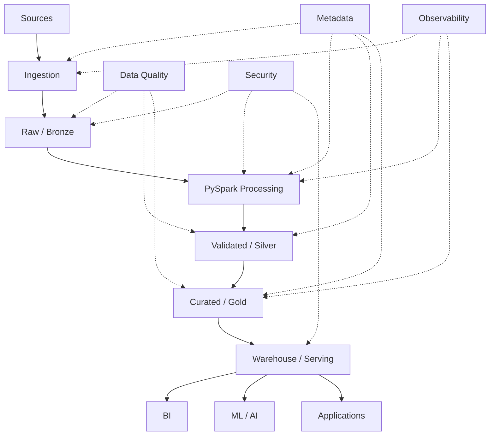

# PySpark — Top 35 Practical & Programming Interview Questions

> **Target:** Senior / Lead / Staff Data Engineer
> **Goal:** 70+ LPA product-based companies
> **Focus:** PySpark coding, Spark internals, DataFrames, joins, windows, partitioning, shuffle, skew, AQE, UDFs, performance tuning, data-quality pipelines, incremental processing and Structured Streaming.
>
> **Resume alignment:** Your experience includes PySpark/Scala ETL on Azure Databricks, large-scale Spark pipelines, data-quality/reconciliation frameworks and a PySpark file-validation accelerator.

---

# 0. THE PYSPARK INTERVIEW MINDSET

At senior level, don't answer:

> "I know `groupBy`, `join`, `filter` and `withColumn`."

The interviewer wants to know whether you understand:

```text
Logical Transformation
        ↓
Logical Plan
        ↓
Catalyst Optimization
        ↓
Physical Plan
        ↓
Stages
        ↓
Tasks
        ↓
Executors
        ↓
Shuffle / I/O / CPU / Memory
        ↓
Final Output
```

For almost every PySpark question, ask yourself:

```text
1. What is the data volume?
2. What is the grain?
3. How is the data partitioned?
4. Does this operation cause a shuffle?
5. Is there data skew?
6. Can Spark optimize this?
7. Am I moving data unnecessarily?
8. Am I bringing data to the driver?
9. Can I use native Spark functions?
10. How will this behave in production?
```

Spark 4.2's current documentation continues to emphasize partition tuning, join strategy, caching, statistics and Adaptive Query Execution as major performance areas.

---

# 1. What is PySpark and how is it different from Python?

## Core Answer

* PySpark is the Python API for Apache Spark.
* Python is a general-purpose programming language.
* PySpark lets Python code describe distributed data-processing operations that execute on a Spark cluster.
* The computation is distributed across executors rather than being performed entirely by the Python process running the driver.

```text
                 PySpark Application

                 Python Driver
                      │
                      ↓
               Spark Execution
                      │
          ┌───────────┼───────────┐
          ↓           ↓           ↓
      Executor 1  Executor 2  Executor 3
          ↓           ↓           ↓
        Tasks       Tasks       Tasks
```

## Why PySpark?

* Data larger than one machine can handle comfortably.
* Parallel processing.
* Fault tolerance.
* Distributed joins/aggregations.
* SQL/DataFrame processing.
* Batch + streaming.

## Senior answer

> "PySpark is not simply Python running on multiple machines. Python is primarily the interface I use to express the computation; Spark's distributed execution engine performs the actual data processing across the cluster."

---

# 2. Explain SparkSession, SparkContext and SQLContext.

## SparkSession

Modern entry point for Spark SQL/DataFrame functionality.

```python
from pyspark.sql import SparkSession

spark = (
    SparkSession.builder
    .appName("CustomerPipeline")
    .getOrCreate()
)
```

Use it for:

* DataFrames.
* SQL.
* Catalog.
* Configuration.
* Reading/writing data.

## SparkContext

Lower-level entry point to Spark's core functionality and RDD execution.

```python
sc = spark.sparkContext
```

## SQLContext

Historically used for Spark SQL.

Modern Spark applications generally use `SparkSession`, which provides the unified entry point.

## Interview answer

```text
SparkSession
    ↓
Modern application entry point

SparkContext
    ↓
Core Spark / RDD context

SQLContext
    ↓
Older Spark SQL abstraction
```

---

# 3. RDD vs DataFrame vs Dataset — which would you choose?

## RDD

RDD = Resilient Distributed Dataset.

Characteristics:

* Distributed.
* Immutable.
* Partitioned.
* Fault tolerant.
* Low-level API.

Spark documents RDDs as partitioned collections that can be operated on in parallel and recovered through lineage after failures.

## DataFrame

* Structured rows/columns.
* Schema-aware.
* Spark SQL optimizer can reason about the query.
* Generally preferred for structured ETL.

## Dataset

* Strongly typed API available in Scala/Java.
* Not a first-class Python Dataset abstraction in the same sense.

## Typical choice

```text
Structured ETL
      ↓
DataFrame

Need low-level control
      ↓
RDD

Scala type-safe application
      ↓
Dataset
```

## Senior answer

> "For structured Data Engineering workloads, I default to DataFrames because Spark can optimize the logical and physical plan. I use RDDs only when lower-level control is genuinely required."

---

# 4. Explain lazy evaluation in Spark.

## Core Answer

Transformations do not execute immediately.

Example:

```python
filtered = (
    df
    .filter("amount > 1000")
    .select("customer_id", "amount")
)
```

At this point Spark primarily builds a plan.

Actual execution occurs when an action is called:

```python
filtered.count()
```

## Flow

```text
filter()
   ↓
select()
   ↓
join()
   ↓
groupBy()
   ↓
Logical Plan
   ↓
ACTION
   ↓
Execution
```

Spark's RDD programming guide explicitly describes transformations as lazy and notes that execution begins when an action requires a result.

## Why is this useful?

Spark can optimize the complete plan instead of blindly executing every transformation independently.

## Follow-up

### Is `withColumn()` executed immediately?

No.

It constructs a new DataFrame expression; execution occurs when an action requires the result.

---

# 5. What is the difference between transformation and action?

## Transformation

Creates another distributed dataset.

Examples:

```python
df.select(...)
df.filter(...)
df.withColumn(...)
df.join(...)
df.groupBy(...)
```

## Action

Triggers execution.

Examples:

```python
df.count()
df.collect()
df.show()
df.first()
df.write.parquet(...)
```

## Mental model

```text
Transformations
      ↓
Build plan
      ↓
Action
      ↓
Execute
```

## Important trap

```python
df.show()
df.count()
df.collect()
```

These are separate actions and may result in separate jobs unless the relevant data is cached/reused.

Spark's documentation distinguishes transformations from actions and notes that actions trigger execution.

---

# 6. Explain Driver, Executor, Job, Stage and Task.

## Driver

Responsible for:

* Application coordination.
* Building execution plans.
* Scheduling work.
* Maintaining application state.

## Executor

Runs tasks and can cache/persist data.

## Job

Usually created by an action.

## Stage

A set of tasks that can execute without crossing a shuffle boundary.

## Task

Unit of work applied to one partition.

```text
Application
    ↓
Driver
    ↓
Job
    ↓
Stages
    ↓
Tasks
    ↓
Executors
```

Example:

```text
read
 ↓
filter
 ↓
groupBy
 ↓
write

Potentially:

Stage 1
read + filter

       ↓ SHUFFLE

Stage 2
groupBy + write
```

---

# 7. What is a narrow transformation vs a wide transformation?

## Narrow

Data required by an output partition comes from a limited corresponding set of input partitions.

Examples:

```python
filter()
select()
map()
```

Conceptually:

```text
P1 → P1
P2 → P2
P3 → P3
```

## Wide

Data must be redistributed across partitions.

Examples:

```python
groupBy()
distinct()
orderBy()
join()
repartition()
```

Conceptually:

```text
P1 ──┐
P2 ──┼──→ SHUFFLE ──→ P1/P2/P3
P3 ──┘
```

## Why important?

Wide transformations can produce:

* Network transfer.
* Serialization.
* Disk spill.
* Additional stages.
* Memory pressure.

## Senior statement

> "When debugging Spark performance, I pay special attention to operations that cause redistribution because unnecessary shuffle can dominate runtime."

---

# 8. What exactly happens during a shuffle?

Suppose:

```python
df.groupBy("customer_id").sum("amount")
```

Data for the same customer may exist across multiple partitions.

Spark must reorganize the data so records with the same grouping key meet.

```text
Before

P1: A B C
P2: A C D
P3: B D E


        ↓

     SHUFFLE


After

P1: A A
P2: B B
P3: C C D D E
```

## Why shuffle is expensive?

* Network I/O.
* Serialization/deserialization.
* Disk spill if memory isn't sufficient.
* CPU.
* Additional stage boundaries.

Spark's current performance guide identifies partition tuning, join strategy and AQE as core optimization areas around these costs.

## How to reduce it

* Filter early.
* Select only required columns.
* Avoid unnecessary repartitioning.
* Use appropriate join strategy.
* Broadcast small dimensions.
* Handle skew.
* Aggregate before a large join where valid.

---

# 9. Explain `repartition()` vs `coalesce()`.

## `repartition()`

Can increase or decrease partitions.

Usually causes a shuffle.

```python
df = df.repartition(200)
```

Or partition by a key:

```python
df = df.repartition("customer_id")
```

## `coalesce()`

Primarily used to reduce partitions while avoiding a full shuffle.

```python
df = df.coalesce(20)
```

## Example

```text
100 partitions
      ↓
filter removes most rows
      ↓
20 useful output partitions
      ↓
coalesce(20)
```

## Rule

```text
Need redistribution
→ repartition()

Need fewer partitions
→ coalesce()
```

Spark's current SQL documentation also exposes partitioning controls including `COALESCE`, `REPARTITION`, `REPARTITION_BY_RANGE` and `REBALANCE` hints.

## Follow-up

### Is `coalesce()` always better than `repartition()`?

No.

If the data is badly distributed and you require balanced partitions, avoiding shuffle can leave you with poor distribution.

---

# 10. How do you decide the number of Spark partitions?

## Core Answer

There is no single correct number.

Consider:

* Input data size.
* Number of executor cores.
* Transformation complexity.
* Shuffle size.
* File count.
* Data distribution.
* Target task size.

## Too few

```text
4 partitions
+
100 executors
```

→ poor parallelism.

## Too many

```text
10 million tiny partitions
```

→ task-scheduling overhead and potentially huge numbers of output files.

## What I would do

```text
Initial estimate
      ↓
Run job
      ↓
Spark UI
      ↓
Inspect task distribution
      ↓
Adjust
      ↓
Measure again
```

Do not say:

> "I always use 200 partitions."

Spark's `spark.sql.shuffle.partitions` currently defaults to 200, but that is a default configuration—not a universal tuning recommendation. AQE can also coalesce post-shuffle partitions dynamically.

---

# 11. Explain Broadcast Join.

## Core Answer

If one side of a join is sufficiently small, Spark can distribute that relation to executors.

```text
               Small Dimension
                    │
        ┌───────────┼───────────┐
        ↓           ↓           ↓
      Exec 1      Exec 2      Exec 3
        +           +           +
      Fact        Fact        Fact
```

Example:

```python
from pyspark.sql.functions import broadcast

result = fact.join(
    broadcast(customer_dim),
    "customer_id"
)
```

## Why?

It can avoid shuffling the large fact dataset.

## Important

Do not broadcast blindly.

Potential problems:

* Executor memory pressure.
* Broadcast timeout.
* OOM.

Spark's current documentation lists `spark.sql.autoBroadcastJoinThreshold` as 10 MB by default and supports explicit broadcast hints, while noting that join hints are preferences and are not guaranteed to apply to every join type.

## Senior answer

> "I use broadcast when the smaller side is genuinely safe to distribute, based on actual size and executor resources—not just because it is smaller than the other table."

---

# 12. Sort-Merge Join vs Broadcast Hash Join.

## Broadcast Hash Join

Useful when one side is small.

```text
Small table
   ↓
Broadcast
   ↓
Executors
   ↓
Local join
```

## Sort-Merge Join

Useful for large distributed datasets.

```text
Large A
  ↓
Shuffle
  ↓
Sort

Large B
  ↓
Shuffle
  ↓
Sort

      ↓
    Merge
```

## Comparison

| Join           | Good for                 | Main concern     |
| -------------- | ------------------------ | ---------------- |
| Broadcast Hash | Small dimension          | Memory           |
| Sort-Merge     | Large distributed tables | Shuffle + sort   |
| Shuffled Hash  | Certain distributions    | Memory / shuffle |

Spark's join hints include `BROADCAST`, `MERGE`, `SHUFFLE_HASH` and `SHUFFLE_REPLICATE_NL`.

---

# 13. What is data skew in Spark?

## Core Answer

Data skew occurs when records are highly unevenly distributed across partitions.

Example:

```text
Partition 1 → 100 MB
Partition 2 → 110 MB
Partition 3 → 95 MB
Partition 4 → 8 GB  ❌
```

The first three tasks finish quickly.

The fourth task becomes a straggler.

```text
Task 1 ───── ✅
Task 2 ───── ✅
Task 3 ───── ✅
Task 4 ──────────────────────── ❌

                 Stage waits
```

## How to detect

Use Spark UI:

* Task duration.
* Shuffle read.
* Shuffle write.
* Input size.
* Spill.
* Partition distribution.

## Solutions

* Broadcast a small table.
* Pre-aggregate.
* Salt keys.
* Split extreme keys.
* Use AQE skew optimization.
* Fix problematic source/data design.

Spark's current AQE documentation specifically supports splitting skewed shuffle partitions for supported workloads.

---

# 14. Explain salting for a skewed join.

Suppose:

```text
customer_id = UNKNOWN
```

accounts for 40% of the data.

A normal join creates one enormous partition for `UNKNOWN`.

## Salting approach

Add:

```text
salt = hash/random value
```

Example:

```text
UNKNOWN_0
UNKNOWN_1
UNKNOWN_2
...
UNKNOWN_9
```

Replicate the corresponding dimension rows across those salts.

```text
Skewed key
   ↓
Salt
   ↓
UNKNOWN_0
UNKNOWN_1
...
UNKNOWN_9
   ↓
More balanced partitions
```

## Important

Salting increases data volume.

Therefore:

> "I use salting only when the skew is material and simpler strategies such as broadcast, pre-aggregation or AQE aren't sufficient."

---

# 15. What is Adaptive Query Execution?

## Core Answer

AQE allows Spark to use runtime statistics to improve execution decisions.

Conceptually:

```text
Initial Plan
     ↓
Execute stage
     ↓
Observe actual statistics
     ↓
Re-optimize
     ↓
Continue
```

Spark's current documentation identifies three major AQE capabilities:

* Coalescing post-shuffle partitions.
* Converting some sort-merge joins to broadcast joins.
* Splitting skewed shuffle partitions.

## Why useful?

Optimizer estimates may differ from runtime reality.

Example:

```text
Estimated dimension = 500 MB
Actual dimension    = 5 MB
```

AQE can potentially choose a better strategy.

## Senior answer

> "AQE reduces the dependence on perfect compile-time statistics, but it doesn't eliminate the need for good data layout and sensible query design."

---

# 16. `cache()` vs `persist()` — when would you use them?

## Core Answer

Use caching when an expensive DataFrame/RDD is reused.

Example:

```python
clean = (
    raw
    .filter(...)
    .join(...)
)

clean.cache()

clean.count()
clean.write.parquet(...)
clean.groupBy(...).count()
```

Without caching, Spark may recompute the lineage for independent actions.

## `cache()`

Uses a default persistence level.

## `persist()`

Lets you choose a storage level.

```python
from pyspark import StorageLevel

df.persist(StorageLevel.MEMORY_AND_DISK)
```

## Important

Don't cache everything.

Caching can cause:

* Memory pressure.
* Eviction.
* GC overhead.
* Unnecessary resource usage.

Spark's current documentation states that DataFrames can be cached and later uncached/unpersisted, with in-memory columnar caching used for Spark SQL workloads.

---

# 17. Why is `collect()` dangerous?

## Core Answer

`collect()` brings all rows to the driver.

```python
data = df.collect()
```

If:

```text
DataFrame = 500 GB
```

you cannot reasonably collect it to a driver with 16 GB RAM.

Potential result:

```text
Executor data
     ↓
Driver
     ↓
OOM ❌
```

Spark explicitly documents `collect()` as returning all elements to the driver and recommends it only when the resulting dataset is sufficiently small.

## Better alternatives

Depending on the requirement:

```python
df.limit(100).collect()
```

or:

```python
df.take(10)
```

or process the data distributedly without collecting it.

## Similar danger

```python
df.toPandas()
```

can also move a large distributed dataset into one Python process.

---

# 18. Explain `withColumn()` and its common performance issue.

## Basic use

```python
from pyspark.sql.functions import col

df = df.withColumn(
    "total",
    col("price") * col("quantity")
)
```

## Common problem

Repeatedly building large chains of `withColumn()` can make the logical plan unnecessarily complicated.

Bad pattern:

```python
for column in columns:
    df = df.withColumn(
        f"{column}_clean",
        ...
    )
```

for very large numbers of derived columns.

## Better

Group expressions where practical:

```python
df = df.select(
    "*",
    (col("price") * col("quantity")).alias("total"),
    ...
)
```

## Senior answer

> "`withColumn()` itself is not inherently slow. The concern is how much logical-plan complexity and expression duplication we create."

Always verify with:

```python
df.explain("formatted")
```

---

# 19. Why should you prefer built-in Spark functions over Python UDFs?

## Built-in functions

Example:

```python
from pyspark.sql.functions import upper

df = df.withColumn(
    "name_upper",
    upper("name")
)
```

Spark can understand and optimize native expressions.

## Python UDF

```python
from pyspark.sql.functions import udf
```

Python execution introduces a boundary between Spark's JVM execution and Python.

Historically, standard Python UDFs involved serialization/deserialization overhead.

Modern Spark also supports Arrow-optimized Python UDFs, but native Spark expressions remain preferable when they can express the logic. Spark 4.2 documents scalar Python UDFs, Pandas UDFs and Arrow UDFs as distinct mechanisms.

## Senior rule

```text
Built-in function available?
        ↓
YES → use it

NO
 ↓
Consider UDF
 ↓
Evaluate Pandas/Arrow UDF
 ↓
Measure
```

---

# 20. Python UDF vs Pandas UDF vs Arrow UDF.

## Scalar Python UDF

Typically operates on individual values/rows through Python.

```python
@udf("string")
def normalize(value):
    return value.strip().lower()
```

## Pandas UDF

Uses Pandas and Arrow for vectorized processing.

```python
from pyspark.sql.functions import pandas_udf

@pandas_udf("double")
def multiply(s):
    return s * 1.18
```

Pandas UDFs use Arrow to transfer data between JVM and Python and operate vectorized over batches.

## Arrow UDF

Uses Arrow data directly.

Spark 4.2 documents Arrow UDFs as a distinct UDF category and supports Arrow-based execution through the PySpark API.

## Practical preference

```text
Native Spark expression
        ↓
Best starting point

Need custom Python
        ↓
Evaluate Pandas / Arrow approach

Only then
        ↓
Standard Python UDF if appropriate
```

## Important interview point

> "Vectorization reduces Python/JVM serialization overhead, but it does not magically make every custom function fast."

---

# 21. Write a PySpark program to find the top 3 salaries per department.

## Input

```text
employee_id
name
department
salary
```

## Solution

```python
from pyspark.sql import Window
from pyspark.sql.functions import dense_rank

window_spec = Window.partitionBy(
    "department"
).orderBy(
    col("salary").desc()
)

result = (
    df
    .withColumn(
        "rank",
        dense_rank().over(window_spec)
    )
    .filter(col("rank") <= 3)
)
```

## Why `dense_rank()`?

Because tied salaries should share a rank.

If exactly 3 rows are required:

```python
from pyspark.sql.functions import row_number
```

and use `row_number()`.

## Pattern

```text
Window
  ↓
PARTITION BY department
  ↓
ORDER BY salary DESC
  ↓
Rank
  ↓
Filter
```

---

# 22. Write PySpark code to keep the latest record per business key.

## Requirement

Columns:

```text
customer_id
status
updated_at
ingestion_id
```

## Solution

```python
from pyspark.sql import Window
from pyspark.sql.functions import row_number

window_spec = (
    Window
    .partitionBy("customer_id")
    .orderBy(
        col("updated_at").desc(),
        col("ingestion_id").desc()
    )
)

latest = (
    df
    .withColumn("rn", row_number().over(window_spec))
    .filter(col("rn") == 1)
    .drop("rn")
)
```

## Why the second ordering column?

Suppose:

```text
customer_id = 101

updated_at
2026-10-03 10:00
2026-10-03 10:00
```

Without a deterministic tie-breaker, "latest" is ambiguous.

## Senior answer

> "When deduplicating production data, I always define a deterministic tie-breaker."

---

# 23. Write PySpark code to remove duplicates.

## Exact duplicate rows

```python
deduped = df.dropDuplicates()
```

## Duplicates based on key

```python
deduped = df.dropDuplicates(
    ["customer_id"]
)
```

PySpark's current `dropDuplicates()` supports both full-row and subset-based duplicate removal.

## But important:

`dropDuplicates(["customer_id"])` does **not** mean:

> "Keep the latest customer record."

It means remove duplicate rows based on those columns without expressing which record should win.

For deterministic latest-record logic, use:

```text
Window
+
ROW_NUMBER
+
ORDER BY timestamp
```

---

# 24. Find nulls, duplicates and invalid values in a PySpark DataFrame.

## Null count

```python
from pyspark.sql.functions import (
    col,
    sum
)

null_counts = df.select([
    sum(
        col(c).isNull().cast("int")
    ).alias(c)
    for c in df.columns
])
```

## Duplicate business keys

```python
duplicate_keys = (
    df.groupBy("customer_id")
      .count()
      .filter(col("count") > 1)
)
```

## Invalid values

```python
invalid = df.filter(
    (col("amount") < 0) |
    (col("status").isNull())
)
```

## Quality architecture

```text
Data
 ↓
Schema
 ↓
Null
 ↓
Duplicate
 ↓
Business Rules
 ↓
Completeness
 ↓
Reconciliation
 ↓
Quality Result
```

This directly connects with your metadata-driven validation and reconciliation experience.

---

# 25. Write PySpark code to compare source and target datasets.

## Requirement

Compare on:

```text
customer_id
```

## Source-only

```python
source_only = source.join(
    target,
    on="customer_id",
    how="left_anti"
)
```

## Target-only

```python
target_only = target.join(
    source,
    on="customer_id",
    how="left_anti"
)
```

## Common records

```python
common = source.join(
    target,
    on="customer_id",
    how="inner"
)
```

## Why `left_anti`?

It directly represents:

```text
A - B
```

This is highly useful for migration and reconciliation workloads.

## Your resume connection

Your validation accelerator specifically includes mismatch and reconciliation checks for ETL verification.

---

# 26. How do you compare rows between source and target efficiently?

Don't immediately compare every column individually on billions of rows.

Use progressive validation.

## Level 1

```python
source.count()
target.count()
```

## Level 2

Compare:

```text
distinct keys
sum(amount)
min(date)
max(date)
```

## Level 3

Find missing/extra keys:

```python
left_anti
```

## Level 4

Compare row fingerprints/hashes where appropriate.

Concept:

```python
from pyspark.sql.functions import sha2, concat_ws

df = df.withColumn(
    "row_hash",
    sha2(
        concat_ws(
            "||",
            "customer_id",
            "status",
            "amount"
        ),
        256
    )
)
```

## Level 5

Perform detailed comparison only on mismatched keys.

## Senior answer

> "At scale, I use layered reconciliation. I don't start with a full row-by-row comparison if counts, aggregates and key-level comparisons can quickly narrow the problem."

---

# 27. How do you read a CSV/JSON/Parquet file correctly in PySpark?

## CSV

```python
df = (
    spark.read
    .option("header", True)
    .option("inferSchema", False)
    .schema(schema)
    .csv(path)
)
```

## JSON

```python
df = (
    spark.read
    .schema(schema)
    .json(path)
)
```

## Parquet

```python
df = spark.read.parquet(path)
```

## Production rule

For important production pipelines, prefer explicit schemas.

Why?

* Better type control.
* Faster startup than repeatedly inferring.
* More predictable behavior.
* Easier schema governance.
* Better detection of unexpected changes.

## Don't blindly use

```python
.inferSchema
```

on every large production pipeline.

---

# 28. How do you handle schema evolution in PySpark?

## Problem

Source schema:

```text
id
name
email
```

becomes:

```text
id
name
email
phone
```

or:

```text
email → removed
```

## Approach

```text
Incoming Schema
      ↓
Expected Schema
      ↓
Compare
      ↓
Classify
      ↓
Compatible?
   /       \
 Yes       No
  ↓         ↓
Continue  Reject/Alert
```

## Actions

* Explicit schema definitions.
* Schema validation.
* Version metadata.
* Backward-compatible changes.
* Quarantine unexpected data.
* Contract testing.
* Controlled schema migration.

## Senior answer

> "Schema evolution must be governed, not silently accepted. Adding a nullable field might be compatible; changing semantics or removing a required field can be breaking."

---

# 29. Write a PySpark incremental pipeline using a watermark.

## Requirement

Process only records after the previous successful timestamp.

Suppose metadata stores:

```text
2026-10-02 23:59:59
```

## Concept

```python
last_watermark = get_watermark()

incremental = source.filter(
    col("updated_at") > lit(last_watermark)
)
```

Process:

```python
result = transform(incremental)

write(result)

update_watermark(
    max_timestamp(result)
)
```

## Critical rule

Only update watermark **after successful target commit**.

Bad:

```text
Read
 ↓
Update watermark
 ↓
Transform
 ↓
FAIL ❌
```

Result:

```text
Records skipped
```

Correct:

```text
Read
 ↓
Transform
 ↓
Validate
 ↓
Write successfully
 ↓
Update watermark
```

---

# 30. How do you implement SCD Type 2 in PySpark?

## Target

```text
customer_id
name
city
start_date
end_date
is_current
```

## Logic

```text
Incoming record
      ↓
Find current target
      ↓
Compare tracked attributes
      ↓
No change ─────────→ Nothing
      │
      └── Change ──→ Expire old
                          ↓
                     Insert new
```

## PySpark pattern

```python
from pyspark.sql.functions import (
    current_date,
    lit
)

current_target = target.filter(
    col("is_current") == True
)

changed = (
    source.alias("s")
    .join(
        current_target.alias("t"),
        "customer_id",
        "inner"
    )
    .filter(
        col("s.city") != col("t.city")
    )
)
```

Then:

```text
1. Expire changed target records
2. Insert new versions
3. Insert previously unseen keys
4. Preserve historical versions
```

## Production considerations

* Null-safe comparisons.
* Duplicate source records.
* Idempotency.
* Effective dates.
* Late-arriving changes.
* Multiple changes within one batch.

---

# 31. Explain `map()`, `mapPartitions()` and `foreachPartition()`.

## `map()`

Processes elements individually.

Conceptually:

```python
rdd.map(function)
```

## `mapPartitions()`

Runs function once per partition.

```python
rdd.mapPartitions(function)
```

Useful when initialization is expensive.

Example:

```text
Partition
  ↓
Open DB connection once
  ↓
Process all rows
  ↓
Close connection
```

instead of:

```text
Row 1 → open connection → close
Row 2 → open connection → close
Row 3 → open connection → close
```

## `foreachPartition()`

Useful for side-effect operations such as partition-wise external writes.

Example concept:

```python
def write_partition(rows):
    connection = create_connection()

    for row in rows:
        write(row)

    connection.close()

df.foreachPartition(write_partition)
```

## Critical production warning

Do not create one external connection per row.

Spark's current DataFrame API exposes both `foreach()` and `foreachPartition()` specifically for partition-oriented execution.

---

# 32. What are window functions in PySpark? Give practical examples.

## Example

```python
from pyspark.sql import Window
from pyspark.sql.functions import (
    row_number,
    lag,
    sum
)

w = (
    Window
    .partitionBy("customer_id")
    .orderBy("event_time")
)
```

## Latest record

```python
df.withColumn(
    "rn",
    row_number().over(
        w.orderBy(col("event_time").desc())
    )
)
```

## Previous event

```python
df.withColumn(
    "previous_event",
    lag("event_time").over(w)
)
```

## Running total

```python
running = (
    Window
    .partitionBy("customer_id")
    .orderBy("event_time")
    .rowsBetween(
        Window.unboundedPreceding,
        Window.currentRow
    )
)

df.withColumn(
    "running_amount",
    sum("amount").over(running)
)
```

## Common patterns

```text
Top N
Latest record
Deduplication
Running totals
Previous/next event
Sessionization
Change detection
```

---

# 33. Explain Structured Streaming in PySpark.

## Core Answer

Structured Streaming treats a live stream as an incrementally updated table.

Conceptually:

```text
               UNBOUNDED INPUT TABLE

Events → Events → Events → Events → ...

                    ↓

             Streaming Query

                    ↓

              Result Table

                    ↓

                 Sink
```

Spark's current Structured Streaming documentation describes the model as an incremental query over an unbounded input table and supports append, update and complete output modes depending on the query.

## Example

```python
stream_df = (
    spark.readStream
    .format("kafka")
    .option("subscribe", "orders")
    .load()
)

result = (
    stream_df
    .selectExpr(
        "CAST(value AS STRING) AS value"
    )
)
```

Then:

```python
query = (
    result.writeStream
    .format("parquet")
    .option("checkpointLocation", checkpoint)
    .start(output_path)
)
```

---

# 34. Explain watermarking, checkpointing and exactly-once semantics in Structured Streaming.

## Watermark

Controls how late event-time data can be while allowing Spark to clean old state.

Example:

```python
events = (
    stream
    .withWatermark(
        "event_time",
        "10 minutes"
    )
)
```

Conceptually:

```text
Latest event time = 10:30

Watermark
    ↓
10:20

Events older than allowed lateness
can eventually be removed from state.
```

Spark documents watermarks as a mechanism for managing late data and cleaning old state.

---

## Checkpoint

Stores progress/state needed to recover a streaming query.

It can include:

* Source offsets.
* Commit information.
* Stateful operator state.

## Exactly-once

Be precise.

Spark Structured Streaming is designed for end-to-end exactly-once processing under the documented guarantees when the source is replayable and the sink can handle the required semantics; Spark uses checkpointing and source offsets, and the sink must support the appropriate idempotent/transactional behavior.

## Senior answer

> "I never say 'Spark guarantees exactly once everywhere' without qualification. End-to-end semantics depend on the source, query execution and sink behavior."

---

# 35. Design and implement a production-grade PySpark pipeline processing 5 TB/day.

> **THIS IS THE MOST IMPORTANT PYSPARK INTERVIEW QUESTION.**

---

# Requirement Clarification

Before designing, ask:

```text
1. Batch or streaming?
2. 5 TB/day or 5 TB per batch?
3. Peak volume?
4. Latency SLA?
5. Number of sources?
6. File formats?
7. Consumer requirements?
8. Data retention?
9. PII/compliance?
10. RPO/RTO?
11. Replay/backfill requirement?
```

---

# Architecture



---

# Step 1 — Ingestion

Use:

* CDC for relational changes.
* Batch for periodic extraction.
* Streaming for event workloads.
* File ingestion for object storage.

Preserve:

```text
source_system
batch_id
ingestion_time
schema_version
source_file
```

---

# Step 2 — Raw Data

Use durable distributed storage.

Example:

```text
raw/
  source=crm/
  year=2026/
  month=10/
  day=03/
```

Keep the raw layer suitable for:

* Replay.
* Audit.
* Backfill.
* Root-cause analysis.

---

# Step 3 — PySpark Transformation

Use DataFrames.

Example:

```python
result = (
    orders
    .filter(col("status") == "COMPLETED")
    .select(
        "order_id",
        "customer_id",
        "amount",
        "event_time"
    )
)
```

## Principle

Reduce data early:

```text
Filter early
+
Select required columns
+
Aggregate before expensive operations where valid
```

---

# Step 4 — Join Strategy

Suppose:

```text
orders = 5 TB
customer = 100 MB
```

Evaluate:

```text
Broadcast?
```

based on actual runtime size and executor memory.

Otherwise:

```text
Sort-Merge Join
```

may be more appropriate.

Use Spark UI + execution plan to validate.

---

# Step 5 — Partitioning

Partition based on:

* Query pattern.
* Data distribution.
* Processing boundary.
* Lifecycle requirements.

Potentially:

```text
event_date
```

Avoid blindly using:

```text
customer_id
```

if cardinality is extremely high.

---

# Step 6 — Avoid Small Files

Monitor:

```text
input files
output files
average file size
partition count
```

Avoid:

```text
Millions of tiny Parquet files
```

Use:

```text
appropriate partitioning
+
controlled output parallelism
+
compaction where supported
```

---

# Step 7 — Handle Skew

Use Spark UI to identify:

```text
One task = 2 hours
Other tasks = 5 minutes
```

Then investigate:

```text
skewed key
partition imbalance
join strategy
```

Potential fixes:

```text
Broadcast
Pre-aggregation
Salting
AQE
Data model correction
```

---

# Step 8 — Data Quality

At minimum:

```text
Schema
Nulls
Duplicates
Completeness
Uniqueness
Validity
Freshness
Referential Integrity
Source/Target Reconciliation
```

Your existing Data Quality and validation projects provide a very strong real-world example here.

---

# Step 9 — Incremental Processing

Avoid:

```text
5 TB
↓
Reprocess 5 TB every day
```

Prefer:

```text
5 TB historical
+
today's changed data
        ↓
incremental transformation
```

Use:

* Watermarks.
* CDC.
* Partition-based processing.
* Change-data logic.

---

# Step 10 — Reliability

Design for:

```text
Failure
 ↓
Retry
 ↓
Idempotent processing
 ↓
Checkpoint / state
 ↓
Reconciliation
 ↓
Backfill
```

---

# Step 11 — Caching

Only cache data when:

```text
expensive computation
+
multiple downstream actions
```

Otherwise avoid unnecessary persistence.

---

# Step 12 — Monitoring

Monitor Spark metrics:

```text
Job duration
Stage duration
Task duration
Shuffle read
Shuffle write
Spill
Executor memory
GC
Input size
Output size
Failed tasks
```

And data metrics:

```text
Rows
Null rate
Duplicate rate
Freshness
Schema
Business metrics
```

---

# Step 13 — Troubleshooting a 5 TB PySpark Job

Suppose:

```text
Expected runtime = 30 minutes
Actual runtime   = 4 hours
```

I would investigate:

```text
Spark UI
   ↓
Slow Stage
   ↓
Task distribution
   ↓
Shuffle
   ↓
Skew
   ↓
Join strategy
   ↓
Partition count
   ↓
Spill
   ↓
Input/output file layout
   ↓
UDF usage
   ↓
Execution plan
```

Use:

```python
df.explain("formatted")
```

and Spark SQL UI/runtime statistics.

Spark's current performance documentation explicitly recommends inspecting plans and runtime statistics when tuning queries.

---

# 5-TB JOB — STRONG 90-SECOND INTERVIEW ANSWER

> "For a 5 TB/day workload, I would first establish the SLA, source characteristics, growth rate, data distribution and consumer requirements. I would use durable distributed storage for the raw layer and PySpark DataFrames for large-scale transformation. I would prefer incremental processing where possible instead of repeatedly scanning the entire historical dataset. I would partition based on access and processing patterns, use columnar formats, prune columns and predicates early, and minimize unnecessary shuffle. For joins, I would evaluate broadcast versus distributed joins based on actual relation size and memory constraints. I would specifically monitor for skew because a single oversized partition can dominate stage runtime. I would use AQE where appropriate and validate optimization using Spark UI and execution plans. For reliability, pipelines would be idempotent, retry-safe and backfillable, with data-quality gates, schema validation, reconciliation and observability. Finally, I would address small files, security, lineage, cost and disaster recovery as part of the production design."

---

# PYSPARK CODING QUESTIONS YOU MUST SOLVE FROM A BLANK EDITOR

Do these without looking at the answers.

```text
1. Create a DataFrame from a list of Python tuples.

2. Read a CSV with an explicit schema.

3. Filter customers with amount > 10,000.

4. Add a derived column.

5. Rename multiple columns.

6. Remove duplicate rows.

7. Keep the latest row per customer.

8. Find the top 3 salaries by department.

9. Find employees above department average.

10. Calculate running customer revenue.

11. Calculate previous event using LAG.

12. Find consecutive events.

13. Find duplicate business keys.

14. Find null counts for every column.

15. Find missing keys between source and target.

16. Find target-only keys.

17. Compare source/target aggregates.

18. Join fact and dimension tables.

19. Broadcast a dimension table.

20. Handle a skewed join.

21. Repartition by date.

22. Reduce partitions after filtering.

23. Read nested JSON.

24. Flatten an array column.

25. Explode an array column.

26. Parse a timestamp.

27. Convert string to date.

28. Implement incremental loading.

29. Build an SCD Type 2 pipeline.

30. Write a Structured Streaming job.
```

---

# PYSPARK FUNCTIONS YOU SHOULD KNOW COLD

## Column functions

```text
col
lit
when
otherwise
coalesce
expr
```

## String functions

```text
trim
lower
upper
regexp_replace
substring
split
concat
concat_ws
```

## Date functions

```text
to_date
to_timestamp
date_format
datediff
date_add
date_sub
year
month
day
```

## Aggregations

```text
count
countDistinct
sum
avg
min
max
stddev
first
last
```

## Window

```text
row_number
rank
dense_rank
lag
lead
ntile
sum over
avg over
```

## Array / Struct

```text
explode
posexplode
flatten
array
array_distinct
size
element_at
struct
```

## DataFrame operations

```text
select
selectExpr
filter
where
join
groupBy
agg
drop
dropDuplicates
withColumn
withColumnRenamed
orderBy
repartition
coalesce
cache
persist
unpersist
```

The current PySpark DataFrame API includes these core operations along with newer APIs such as `dropDuplicatesWithinWatermark`, `mapInPandas`, `mapInArrow`, `observe`, and `exists`.

---

# 15 PYSPARK PERFORMANCE ANTI-PATTERNS

## 1. `collect()` on a huge DataFrame

```python
df.collect()
```

### Problem

Driver OOM.

---

## 2. `toPandas()` on huge data

```python
df.toPandas()
```

### Problem

Everything moves toward one Python process.

---

## 3. Python UDF when Spark has a native function

```python
@udf(...)
```

### Better

Use:

```text
built-in Spark expression
```

when possible.

---

## 4. Blind `repartition()`

Every repartition should have a reason.

---

## 5. Too many output partitions

Can create:

```text
millions of tiny files
```

---

## 6. Broadcast of a large table

Can trigger executor memory problems.

---

## 7. Ignoring skew

One straggler task can dominate runtime.

---

## 8. Caching everything

Memory is a resource.

---

## 9. Repeated actions

```python
df.count()
df.show()
df.collect()
df.write(...)
```

may execute the lineage multiple times without appropriate reuse.

---

## 10. Full reload instead of incremental processing

```text
5 TB daily
↓
scan everything
```

is often unnecessary.

---

# THE PYSPARK PERFORMANCE DECISION TREE

```text
Job is slow
     ↓
Check Spark UI
     ↓
Slow stage?
     ↓
 ┌───┴────┐
YES       NO
 │         │
 ↓         ↓
Shuffle?  Input?
 │         │
 ↓         ↓
Skew?    File layout?
 │         │
 ↓         ↓
Join?    Partition?
 │
 ↓
UDF?
 │
 ↓
Memory / Spill?
 │
 ↓
Fix bottleneck
 │
 ↓
Measure again
```

---

# SPARK UI — WHAT YOU SHOULD LOOK AT

## Jobs tab

Look at:

```text
job duration
stages
failed stages
```

## Stages tab

Look at:

```text
input
output
shuffle read
shuffle write
task duration
```

## Executors tab

Look at:

```text
memory
GC
active tasks
failed tasks
```

## SQL tab

Look at:

```text
physical plan
operator metrics
runtime statistics
```

---

# HIGH-VALUE PYSPARK FOLLOW-UP QUESTIONS

After almost any PySpark answer, expect questions like:

```text
Why did this cause a shuffle?

How many partitions will this create?

What happens if one key has 50% of all rows?

Why did broadcast make the job slower?

What happens if the broadcast table doesn't fit in memory?

Why is one task much slower than the others?

What happens when an executor dies?

What happens when the driver dies?

How does Spark recover lost partitions?

Why is cache not helping?

Why did adding an action increase runtime?

Why does my job create 1 million files?

Why is collect dangerous?

Why is the UDF slow?

Would a Pandas UDF help?

How would you prove your optimization worked?

What does AQE change?

What is stored in a checkpoint?

How would you backfill 6 months of data?

How would you make the pipeline idempotent?
```

---

# PYSPARK SYSTEM-DESIGN QUESTIONS TO PRACTICE

These are particularly relevant for your 70+ LPA target.

```text
1. Design a 10 TB/day batch pipeline.

2. Design a 100K events/sec streaming pipeline.

3. Design a source-to-target reconciliation framework.

4. Design a metadata-driven PySpark framework.

5. Design a CDC-to-lakehouse pipeline.

6. Design a customer 360 pipeline.

7. Design an SCD Type 2 pipeline for 5 TB of historical data.

8. Design a real-time fraud pipeline.

9. Design a migration validation framework.

10. Design a multi-tenant PySpark data platform.
```

---

# YOUR RESUME → PYSPARK STORY BANK

Your real projects should be used whenever possible.

| Interview Area             | Your Story                         |
| -------------------------- | ---------------------------------- |
| PySpark ETL                | Azure Data Platform                |
| Spark performance          | Azure + American Express           |
| Scala + Spark              | American Express                   |
| Data Quality               | Enterprise Data Quality Framework  |
| Reconciliation             | File/table/cross-system validation |
| PySpark validation         | File-vs-File Validator             |
| Data migration             | Forever New                        |
| Databricks                 | Azure Data Platform + migration    |
| Metadata-driven processing | YAML validation framework          |
| DataOps                    | Python automation platform         |

Your Azure project includes ADF, Databricks, ADLS, PySpark and Scala, while your American Express project includes Spark/Scala ETL and distributed workload tuning.

---

# THE 15 PYSPARK STATEMENTS TO MEMORIZE

### 1

> "I first determine whether the operation causes a shuffle."

### 2

> "For structured ETL, I prefer DataFrames because Spark can optimize the logical and physical plan."

### 3

> "I avoid bringing distributed data to the driver unless the result is known to be small."

### 4

> "Broadcast is a memory optimization, not simply a 'small table' optimization."

### 5

> "Data skew can make one partition dominate the runtime of an otherwise parallel job."

### 6

> "I use Spark UI to identify the actual bottleneck before changing configuration."

### 7

> "AQE allows Spark to use runtime statistics to improve execution decisions."

### 8

> "I don't cache unless the computation is expensive and the result is reused."

### 9

> "I prefer native Spark expressions over Python UDFs whenever possible."

### 10

> "Partition count should be driven by data volume, parallelism and workload behavior."

### 11

> "Repartition redistributes data; coalesce primarily reduces the number of partitions."

### 12

> "A technically successful Spark job can still produce incorrect data, so data-quality checks belong in the pipeline."

### 13

> "Incremental processing is usually more scalable than repeatedly rebuilding the full historical dataset."

### 14

> "For reconciliation at scale, I start with counts, aggregates and key differences before doing detailed row comparisons."

### 15

> "For production Spark, performance, correctness, failure recovery and operability have to be designed together."

---

# PYSPARK CHEAT SHEET

```text
SPARK APPLICATION
│
├── Driver
│
├── Cluster Manager
│
└── Executors
     │
     └── Tasks

EXECUTION
│
├── Transformation
│    └── Lazy
│
└── Action
     └── Job

JOB
│
└── Stages
      │
      └── Tasks
            │
            └── Partitions

TRANSFORMATIONS
│
├── Narrow
│    ├── filter
│    ├── select
│    └── map
│
└── Wide
     ├── groupBy
     ├── join
     ├── distinct
     ├── orderBy
     └── repartition

PERFORMANCE
│
├── Predicate Pushdown
├── Column Pruning
├── Partition Pruning
├── Broadcast Join
├── AQE
├── Skew Handling
├── Caching
├── Correct Partition Count
└── Small File Control

PYTHON
│
├── Native Spark Functions
│
├── Pandas UDF
├── Arrow UDF
└── Python UDF

RELIABILITY
│
├── Idempotency
├── Checkpoint
├── Retry
├── Backfill
├── Reconciliation
└── Data Quality

STREAMING
│
├── readStream
├── writeStream
├── Watermark
├── Checkpoint
├── Output Mode
├── State
└── Trigger
```

---

# FINAL 35-QUESTION REVISION CHECKLIST

```text
□ 1. PySpark vs Python
□ 2. SparkSession / SparkContext / SQLContext
□ 3. RDD vs DataFrame vs Dataset
□ 4. Lazy evaluation
□ 5. Transformation vs action
□ 6. Driver / Executor / Job / Stage / Task
□ 7. Narrow vs Wide transformation
□ 8. Shuffle
□ 9. Repartition vs Coalesce
□ 10. Partition sizing
□ 11. Broadcast join
□ 12. Sort-Merge vs Broadcast
□ 13. Data skew
□ 14. Salting
□ 15. AQE
□ 16. Cache vs Persist
□ 17. Collect / Driver OOM
□ 18. withColumn
□ 19. Native function vs Python UDF
□ 20. Python vs Pandas vs Arrow UDF
□ 21. Top 3 per department
□ 22. Latest row per key
□ 23. Deduplication
□ 24. Data quality checks
□ 25. Source-target reconciliation
□ 26. Row comparison
□ 27. File reading/schema
□ 28. Schema evolution
□ 29. Incremental processing
□ 30. SCD Type 2
□ 31. map/mapPartitions/foreachPartition
□ 32. Window functions
□ 33. Structured Streaming
□ 34. Watermark/checkpoint/exactly-once
□ 35. 5 TB/day production architecture
```

---

# MOST IMPORTANT PYSPARK CODING PATTERNS

Before moving to the next topic, be able to write these without Google:

```text
1. Read Parquet
2. Read CSV with schema
3. Filter
4. Select
5. withColumn
6. when/otherwise
7. GroupBy/Agg
8. Join
9. Broadcast Join
10. Window
11. Row Number
12. Rank
13. Dense Rank
14. Lag
15. Deduplicate
16. Latest record
17. Anti Join
18. Repartition
19. Coalesce
20. Cache
21. Explain
22. Explode
23. Array/Struct transformation
24. JSON parsing
25. Incremental load
26. SCD2
27. Data reconciliation
28. Structured Streaming
29. Watermark
30. Checkpoint
```

---

# 70+ LPA PYSPARK INTERVIEW RULE

When given a coding question, don't just write:

```python
df.groupBy(...).agg(...)
```

Explain what happens underneath:

```text
Logical operation
      ↓
Potential shuffle
      ↓
Partition distribution
      ↓
Execution strategy
      ↓
Memory / network cost
      ↓
Failure behavior
```

When given a performance problem, don't immediately say:

```text
"Increase cluster size."
```

Say:

```text
Measure
 ↓
Find bottleneck
 ↓
Reduce unnecessary work
 ↓
Fix partitioning / joins / skew / I/O
 ↓
Use AQE where appropriate
 ↓
Scale infrastructure if still necessary
 ↓
Measure again
```

That is the difference between knowing **PySpark syntax** and demonstrating **senior Spark engineering judgment**.

---

# RESEARCH BASIS

This chapter was cross-checked primarily against the current Apache Spark 4.2.0 documentation:

* Spark SQL Performance Tuning — partition tuning, caching, join strategies, AQE and runtime statistics.
* Spark RDD Programming Guide — driver, RDDs, transformations, actions, lazy evaluation and persistence.
* Current PySpark DataFrame API — joins, grouping, deduplication, repartitioning, `explain`, `mapInPandas` and related APIs.
* Current `dropDuplicates` semantics, including streaming behavior with watermarks.
* Apache Arrow in PySpark — Arrow, Pandas UDFs and Python UDF execution.
* PySpark UDF/UDTF guide — Python UDF, Pandas UDF and Arrow UDF categories.
* Structured Streaming programming model, output modes, watermarking and fault-tolerance semantics.

---

# END OF TOPIC 5

```text
1. Data Engineering           ✅
2. Big Data Engineering       ✅
3. SQL                        ✅
4. Python                     ✅
5. PySpark                    ✅

NEXT
6. DevOps — Top 10
7. AI — Data Engineering Specific — Top 10
8. Databricks
9. Snowflake
10. AWS
11. Azure
12. GCP
```
