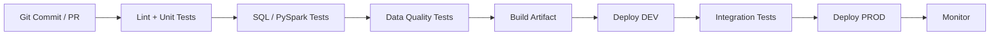
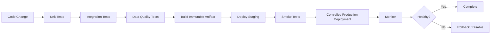
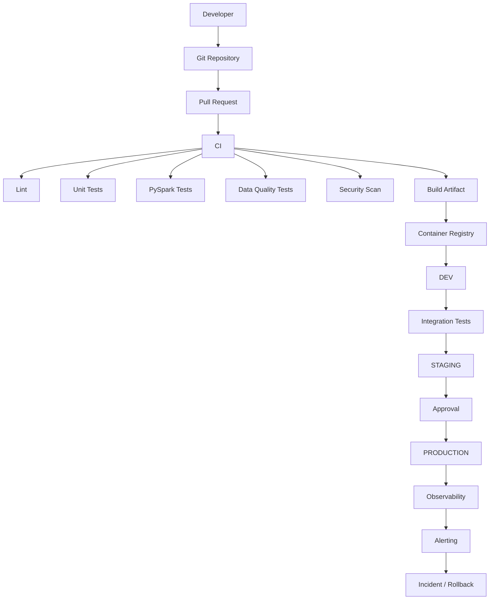

# DevOps — Top 10 Senior Data Engineering Interview Questions & Answers

> **Target:** Senior / Lead / Staff Data Engineer
> **Goal:** 70+ LPA product-based companies
> **Focus:** Git, CI/CD, GitHub Actions, Docker, Kubernetes, Terraform/IaC, secrets, deployments, rollback, observability and production Data Engineering workflows.
>
> **Important:** For Data Engineering interviews, you do not need to sound like a dedicated SRE. You need to demonstrate that you can **build, deploy, secure, observe, troubleshoot and safely operate data systems**.

---

# 0. DevOps Mindset for a Senior Data Engineer

A junior answer:

> "DevOps means CI/CD and automation."

A senior answer:

```text id="wz7wr9"
Code
 ↓
Version Control
 ↓
Automated Validation
 ↓
Build
 ↓
Artifact
 ↓
Security Checks
 ↓
Deploy
 ↓
Observe
 ↓
Detect Failure
 ↓
Rollback / Recover
 ↓
Learn
```

For Data Engineering, add:

```text id="g6zjop"
Pipeline Code
+
SQL
+
PySpark
+
Config
+
Schemas
+
Infrastructure
+
Data Quality Rules
```

Everything should be treated as something that can be **versioned, tested and promoted safely**.

AWS's current Well-Architected guidance explicitly recommends version control, automated testing/validation, multiple environments, frequent small reversible changes and automated integration/deployment.

---

# 1. What is CI/CD? Explain it using a Data Engineering example.

## Core Answer

### CI = Continuous Integration

Automatically:

* Build.
* Test.
* Validate.

when code changes are committed.

Microsoft describes CI as automatically building and testing code when team members commit changes to version control.

### CD = Continuous Delivery / Deployment

Automatically move validated changes toward environments such as:

```text id="1d9w5n"
DEV
 ↓
QA / TEST
 ↓
STAGING
 ↓
PRODUCTION
```

## Data Engineering CI/CD

Suppose I modify:

```text id="h84zp1"
PySpark transformation
```

Pipeline:



## What should be validated?

### Python

* Formatting.
* Linting.
* Unit tests.
* Type checks where used.

### SQL

* Syntax.
* Unit/data tests.
* Migration scripts.

### PySpark

* Transformation tests.
* Schema checks.
* Data-quality checks.

### Infrastructure

* Terraform validation.
* Terraform plan review.

### Security

* Secret scanning.
* Dependency scanning.
* Container/image scanning.

## Senior answer

> "For Data Engineering, CI/CD shouldn't stop at code compilation. I want the pipeline to validate transformation logic, schemas, data-quality contracts, infrastructure changes and deployment safety."

---

# 2. Explain Git branching strategy for a production Data Engineering team.

## Core Answer

A practical strategy could be:

```text id="w0v6o8"
main
 │
 ├── feature/customer-pipeline
 ├── feature/schema-update
 └── bugfix/reconciliation
```

Developer workflow:

```text id="ps0jqn"
Create branch
     ↓
Implement
     ↓
Unit tests
     ↓
Pull Request
     ↓
Code review
     ↓
CI checks
     ↓
Merge
     ↓
Deploy
```

## What should be protected?

`main` / production branches should generally have:

* Pull request review.
* Automated checks.
* No direct casual pushes.
* Required status checks.

## Data Engineering code in Git

Version:

```text id="9bk7ql"
Python
SQL
PySpark
YAML
Terraform
Dockerfile
Pipeline definitions
Schema definitions
Data-quality rules
Deployment configuration
```

## Do NOT commit

```text id="v5xwc1"
Passwords
API keys
Cloud credentials
Private keys
Sensitive production data
Terraform state
```

Terraform's current documentation specifically warns against committing `terraform.tfstate`, saved plan files and sensitive `.tfvars`; it recommends committing the dependency lock file instead.

## Senior follow-up

### Q: Why use short-lived branches?

* Smaller change sets.
* Easier review.
* Lower merge conflict risk.
* Faster feedback.
* Smaller deployment blast radius.

---

# 3. Explain a production GitHub Actions CI/CD pipeline for a PySpark project.

GitHub Actions workflows are YAML-defined automated processes made up of jobs and steps, and jobs can run sequentially or in parallel.

## Architecture



```mermaid id="r2v0jh"
flowchart LR
    A[Git Push / PR]
    --> B[Checkout]

    B --> C[Install Dependencies]

    C --> D[Lint]

    D --> E[Unit Tests]

    E --> F[PySpark Tests]

    F --> G[Security Checks]

    G --> H[Build Artifact / Image]

    H --> I[Deploy DEV]

    I --> J[Integration Tests]

    J --> K[Approval / Environment Gate]

    K --> L[Deploy PROD]

    L --> M[Smoke Test]

    M --> N[Monitoring]
```

## Example workflow

```yaml id="6hh3b7"
name: data-pipeline-ci

on:
  pull_request:
  push:
    branches:
      - main

jobs:
  test:
    runs-on: ubuntu-latest

    steps:
      - uses: actions/checkout@v4

      - name: Install Python
        uses: actions/setup-python@v5
        with:
          python-version: "3.12"

      - name: Install dependencies
        run: pip install -r requirements.txt

      - name: Lint
        run: ruff check .

      - name: Unit tests
        run: pytest tests/unit

      - name: PySpark tests
        run: pytest tests/spark

  build:
    needs: test
    runs-on: ubuntu-latest

    steps:
      - uses: actions/checkout@v4

      - name: Build Docker image
        run: docker build -t data-pipeline:${{ github.sha }} .

  deploy:
    needs: build
    runs-on: ubuntu-latest

    steps:
      - name: Deploy
        run: ./deploy.sh
```

## Senior additions

I would also consider:

```text id="us4spm"
Dependency caching
Artifact versioning
Container scanning
Secret scanning
Infrastructure plan
Environment protection
Deployment approvals
Smoke tests
Rollback
```

GitHub Actions supports environments, deployment protection rules, environment secrets and reusable workflows; reusable workflows can centralize deterministic CI/CD logic across repositories.

---

# 4. Why Docker? Explain image vs container.

## Core Answer

Docker packages an application and its dependencies into an isolated container environment.

Docker's documentation describes an **image** as a read-only template used to create containers, while a **container** is a runnable instance of an image.

## Image

```text id="r7pl7y"
Docker Image
├── Python
├── Dependencies
├── Application Code
├── Configuration defaults
└── Runtime
```

## Container

```text id="ruy6oj"
Image
  ↓
Container
  ↓
Running process
```

## Why useful for Data Engineering?

Imagine:

```text id="tliuvy"
Developer laptop
Python 3.12
PySpark version X

Production
Python 3.10
PySpark version Y
```

Potential:

```text id="b8q9ci"
"It worked on my machine."
```

Containerization reduces environment differences by packaging the application environment consistently. Docker describes containers as lightweight, isolated runnable environments that contain what the application needs.

## Example Dockerfile

```dockerfile id="g9jk6v"
FROM python:3.12-slim

WORKDIR /app

COPY requirements.txt .

RUN pip install --no-cache-dir -r requirements.txt

COPY src/ ./src/

CMD ["python", "src/main.py"]
```

Docker builds images from Dockerfiles, whose instructions such as `FROM`, `RUN`, `WORKDIR` and `COPY` define how the image is assembled.

## Senior follow-up

### Why use multi-stage Docker builds?

To keep final images smaller by separating build dependencies from runtime dependencies.

---

# 5. What is Kubernetes and why would a Data Engineer care about it?

## Core Answer

Kubernetes orchestrates containerized workloads.

It can manage:

* Scheduling.
* Scaling.
* Networking.
* Configuration.
* Secrets.
* Health checks.
* Rollouts.
* Recovery.

## Architecture

```text id="1qz8tf"
Kubernetes Cluster
│
├── Control Plane
│
└── Worker Nodes
     │
     ├── Pod
     │    └── Container
     │
     ├── Pod
     │    └── Container
     │
     └── Pod
          └── Container
```

## Data Engineering uses

Kubernetes can host:

* Airflow-related services.
* Data APIs.
* Metadata services.
* Validation services.
* Streaming components.
* Data processing services.
* Internal platform tools.

## Deployment

```yaml id="jfn4a7"
apiVersion: apps/v1
kind: Deployment

metadata:
  name: data-validator

spec:
  replicas: 3

  selector:
    matchLabels:
      app: data-validator

  template:
    metadata:
      labels:
        app: data-validator

    spec:
      containers:
        - name: validator
          image: data-validator:1.0
          ports:
            - containerPort: 8080
```

## Important

Kubernetes is not a Data Engineering engine.

It is an infrastructure/orchestration platform.

For example:

```text id="5vau2o"
Kubernetes
    ↓
Runs service

Spark
    ↓
Performs distributed computation
```

---

# 6. Explain Kubernetes readiness, liveness and startup probes.

This is an excellent senior-level follow-up.

## Liveness

Answers:

> "Is this container healthy enough to keep running?"

If it fails repeatedly, Kubernetes can restart the container.

## Readiness

Answers:

> "Can this container receive traffic right now?"

If readiness fails, Kubernetes stops routing normal Service traffic to that Pod.

## Startup

Answers:

> "Has the application finished starting?"

It is useful for slow-starting applications.

Kubernetes officially distinguishes these three probes and notes that startup probes can delay liveness/readiness checks until initialization succeeds. Readiness removes an unready Pod from normal Service traffic, while liveness can trigger container restart.

## Diagram

```text id="4z2q31"
Container starts
      ↓
Startup Probe
      ↓
   success
      ↓
┌─────┴──────┐
↓            ↓
Liveness   Readiness
↓            ↓
Restart?   Receive traffic?
```

## Critical interview point

Do not make liveness too aggressive.

Kubernetes warns that incorrect liveness probes can cause cascading failures by repeatedly restarting containers under load.

## Strong answer

> "I use readiness to control traffic eligibility, liveness to detect genuine unrecoverable application failure, and startup probes for slow initialization. I keep health checks cheap and avoid making liveness dependent on every downstream service."

---

# 7. What is Infrastructure as Code? Explain Terraform.

## Core Answer

Infrastructure as Code means infrastructure is defined using version-controlled configuration rather than manually clicking through cloud consoles.

Example:

```text id="rq1xbs"
Terraform
   ↓
VPC
   ↓
Storage
   ↓
IAM
   ↓
Compute
   ↓
Data Platform
```

## Terraform workflow

```text id="hu2s8f"
terraform init
       ↓
terraform plan
       ↓
Review
       ↓
terraform apply
```

HashiCorp documents this as the core Terraform workflow: `init` prepares the workspace, `plan` previews changes and `apply` executes the plan.

## Why use Terraform?

* Reproducibility.
* Version control.
* Reviewable changes.
* Environment consistency.
* Automation.
* Reduced manual configuration.

## Example

```hcl id="nqbz0x"
resource "aws_s3_bucket" "data_lake" {
  bucket = "company-data-lake"
}
```

## Senior point

Terraform is not just "writing YAML."

It maintains state representing its relationship between configured resources and real infrastructure. HashiCorp recommends remote state for teams and warns against storing state in version control because state may contain sensitive information.

---

# 8. Explain Terraform state, locking and modules.

## Terraform state

Terraform uses state to:

* Map configuration resources to real infrastructure.
* Track metadata.
* Determine required changes.

HashiCorp describes state as the binding between configured resources and real-world objects and recommends secure remote state for collaborative environments.

## Why locking?

Suppose:

```text id="9s4w52"
Engineer A → terraform apply
Engineer B → terraform apply
```

Without coordination, they might modify the same infrastructure concurrently.

Terraform backends that support state locking can prevent multiple writers from corrupting or conflicting over state.

## Modules

Modules package reusable infrastructure.

Example:

```text id="4g5fqe"
modules/
├── vpc/
├── data_lake/
├── iam/
└── spark_cluster/
```

Then:

```hcl id="tbg1f9"
module "data_lake" {
  source = "./modules/data_lake"

  environment = "prod"
}
```

HashiCorp describes modules as reusable collections of managed resources and recommends them for repeated infrastructure patterns.

## Senior follow-ups

### Should you use Terraform workspaces for every environment?

Not automatically.

Terraform's current documentation specifically cautions that CLI workspaces are not appropriate for system decomposition or deployments requiring separate credentials and access controls.

### What if `terraform apply` fails halfway?

Terraform does not automatically roll back all changes; infrastructure may be partially changed and a subsequent apply is often needed after resolving the error.

This is a very important senior-level point.

---

# 9. How do you manage secrets and cloud credentials securely in CI/CD?

## Never do this

```yaml id="p6z7b1"
env:
  AWS_ACCESS_KEY_ID: AKIA....
  AWS_SECRET_ACCESS_KEY: ....
```

or:

```python id="2j5gtx"
password = "ProductionPassword"
```

## Better

Use:

```text id="nmx3gu"
Secret Manager
+
GitHub Secrets / Environment Secrets
+
Short-lived identity
+
OIDC
```

GitHub Actions supports organization, repository and environment secrets, and environment secrets can be protected with required reviewers.

## Best modern approach for cloud deployment

Use GitHub Actions OIDC where supported.

```text id="w25fbg"
GitHub Actions
       ↓
OIDC Token
       ↓
Cloud Identity Provider
       ↓
Short-lived Cloud Credentials
       ↓
Deploy
```

GitHub documents OIDC specifically as a way for workflows to authenticate with cloud providers without storing long-lived cloud credentials as GitHub secrets.

## Why better?

Traditional:

```text id="t3wpkf"
Long-lived credential
     ↓
Store somewhere
     ↓
Rotate
     ↓
Risk exposure
```

OIDC:

```text id="k1qzbc"
Workflow
  ↓
Federated identity
  ↓
Temporary credentials
```

## Senior answer

> "I prefer workload identity/federation such as OIDC over long-lived access keys wherever the platform supports it. The CI system should receive only the permissions required for that deployment."

---

# 10. How would you design a safe deployment and rollback strategy for a production Data Engineering platform?

> **This is the most important DevOps question for your target level.**

Suppose you are deploying:

```text id="32t3d7"
New PySpark pipeline version
```

## Never do

```text id="6uovcz"
Code change
 ↓
Production
```

## Better



## Safe deployment principles

### 1. Small changes

Smaller changes reduce blast radius.

AWS explicitly recommends frequent, small, reversible changes as an operational-excellence principle.

### 2. Immutable artifacts

Build once:

```text id="7rpxk0"
image/data-pipeline:abc123
```

Promote the same artifact across environments.

Don't rebuild different code for production.

### 3. Automated testing

Include:

* Unit tests.
* Integration tests.
* Schema tests.
* Data-quality checks.
* Smoke tests.

### 4. Controlled rollout

For services:

* Rolling deployment.
* Canary.
* Blue/green.

Kubernetes Deployments support rolling updates, which progressively replace old Pods with new Pods; Kubernetes also documents rollback support for previous revisions.

### 5. Data-specific rollback

This is where Data Engineering differs from ordinary application deployment.

Suppose:

```text id="0s9bw6"
Pipeline v1
   ↓
writes correct data

Deploy v2
   ↓
incorrect transformation
   ↓
bad data written
```

Application rollback:

```text id="q6isx2"
v2 → v1
```

does **not automatically repair the bad data**.

You may also need:

```text id="27pq3w"
1. Stop bad pipeline
2. Identify affected partitions
3. Restore/recompute correct data
4. Reconcile
5. Restart pipeline
```

## Data deployment checklist

```text id="7jhskd"
Code
 ↓
Tests
 ↓
Schema compatibility
 ↓
Data contract validation
 ↓
Deployment
 ↓
Smoke test
 ↓
Freshness check
 ↓
Row-count check
 ↓
Business KPI check
 ↓
Monitor
```

## Senior answer

> "For Data Engineering, rollback has two dimensions: rollback the software and recover the data state. Reverting a pipeline version does not necessarily undo incorrect data already published."

This distinction is extremely valuable in senior interviews.

---

# DEVOPS ARCHITECTURE FOR A DATA ENGINEERING PLATFORM

You should be able to draw this on a whiteboard.



---

# YOUR RESUME → DEVOPS INTERVIEW STORY BANK

Your resume already contains several strong DevOps talking points.

| DevOps Area            | Your Experience                       |
| ---------------------- | ------------------------------------- |
| CI/CD                  | GitHub Actions / CI/CD workflows      |
| Docker                 | Docker listed in technical stack      |
| Git                    | Git-based schema/version management   |
| AWS automation         | AWS SSM                               |
| Cloud deployment       | AWS / Azure / GCP                     |
| Schema deployment      | Redshift object promotion             |
| Environment automation | Dev/Test/Production promotion         |
| DataOps                | Jira / Zephyr / AI-assisted workflows |
| Validation gates       | Data-quality and reconciliation       |
| Enterprise automation  | Reusable automation frameworks        |

Your resume explicitly lists Docker, GitHub Actions and CI/CD workflows, while the Redshift governance project includes Git-based versioning, SSM automation and promotion across development, test and production environments.

---

# TOP DEVOPS FOLLOW-UP QUESTIONS

After the 10 primary questions, be ready for:

```text id="4r3pl1"
What happens when a deployment fails?

How do you rollback?

What is blue/green deployment?

What is canary deployment?

What is rolling deployment?

How do you prevent secrets from leaking?

How does OIDC work?

What is Docker layer caching?

How do you reduce Docker image size?

What is Kubernetes Service?

What is a Deployment?

What is a Pod?

What happens when a Pod crashes?

What is readiness vs liveness?

What is Terraform state?

What is state locking?

What is drift?

What is terraform plan?

What happens when terraform apply fails?

How do you handle infrastructure drift?

How do you monitor a deployment?

How do you deploy database schema changes safely?

How do you rollback a bad data pipeline?

How do you handle an emergency production fix?
```

---

# BLUE/GREEN vs CANARY vs ROLLING

Know this table.

| Strategy   | Concept                         | Main Advantage        | Main Concern                |
| ---------- | ------------------------------- | --------------------- | --------------------------- |
| Rolling    | Gradually replace old instances | Simple, efficient     | Mixed versions temporarily  |
| Blue/Green | Old + new environments          | Fast cutover/rollback | Extra infrastructure        |
| Canary     | Small traffic subset first      | Limits blast radius   | More operational complexity |

Kubernetes Deployments use rolling updates by default, while other rollout patterns can be implemented through surrounding deployment architecture. Kubernetes documents rolling update parameters such as `maxUnavailable` and `maxSurge`.

---

# DEVOPS INCIDENT SCENARIO YOU MUST PRACTICE

## Interviewer:

> "You deployed a new PySpark pipeline at 2 PM. At 2:30 PM, downstream dashboards show incorrect revenue. What do you do?"

## Strong answer

```text id="2a6zd8"
1. Stop / disable further bad processing
            ↓
2. Establish incident timeline
            ↓
3. Identify affected pipeline version
            ↓
4. Identify affected partitions / batches
            ↓
5. Check data-quality + reconciliation metrics
            ↓
6. Restore/recompute correct data
            ↓
7. Roll back pipeline software if necessary
            ↓
8. Validate source-target parity
            ↓
9. Validate business metrics
            ↓
10. Resume processing
            ↓
11. Root-cause analysis
            ↓
12. Add preventive automated test/guardrail
```

## Senior-level insight

The final step should not simply be:

> "Fix the code."

It should be:

> "What control would have detected this before production?"

AWS's operational-excellence guidance emphasizes actionable observability, safe automation and learning/improving operational processes.

---

# DEVOPS SECURITY CHEAT SHEET

```text id="2tufsp"
SOURCE CONTROL
├── Branch protection
├── PR review
└── Signed/reviewed changes

SECRETS
├── Secret Manager
├── GitHub Secrets
├── Environment protection
└── OIDC / workload identity

CONTAINERS
├── Minimal base image
├── Dependency scanning
├── Image scanning
└── Non-root where appropriate

CI/CD
├── Least privilege
├── Reproducible builds
├── Artifact immutability
└── Deployment approvals

INFRASTRUCTURE
├── IaC
├── Terraform state protection
├── State locking
└── Drift detection

PRODUCTION
├── Observability
├── Alerts
├── Rollback
├── Audit
└── Incident response
```

---

# 10 GOLDEN DEVOPS STATEMENTS

### 1

> "CI/CD for Data Engineering must validate both code correctness and data correctness."

### 2

> "I prefer small, reversible changes because they reduce deployment blast radius."

### 3

> "For production deployments, I want the same immutable artifact promoted through environments."

### 4

> "Rollback of code is not necessarily rollback of data."

### 5

> "I use readiness to control traffic and liveness to recover genuinely unhealthy containers."

### 6

> "I don't put long-lived cloud credentials into CI/CD when federated identity is available."

### 7

> "Terraform state is part of the infrastructure control plane and must be protected and coordinated."

### 8

> "I prefer measuring deployment health through both technical and business-level signals."

### 9

> "A retry or automatic restart should not hide an underlying correctness problem."

### 10

> "The goal of DevOps is not simply faster deployment; it is faster, safer and more observable delivery."

---

# SENIOR DATA ENGINEER DEVOPS CHEAT SHEET

```text
GIT
 ↓
Pull Request
 ↓
CI
 ├── Python tests
 ├── SQL tests
 ├── PySpark tests
 ├── Data-quality checks
 ├── Security
 └── Terraform validation
 ↓
Artifact
 ↓
Container Registry
 ↓
DEV
 ↓
Integration Tests
 ↓
STAGING
 ↓
Approval
 ↓
PRODUCTION
 ↓
Observability
 ↓
Smoke / Data Validation
 ↓
Healthy?
 ├── YES → Continue
 └── NO  → Rollback + Data Recovery
```

---

# FINAL DEVOPS INTERVIEW CHECKLIST

```text id="k1a9w2"
□ Explain CI/CD
□ Design a Data Engineering CI/CD pipeline
□ Explain Git branching
□ Explain Docker
□ Image vs Container
□ Write a Dockerfile
□ Explain Kubernetes
□ Pod vs Deployment vs Service
□ Readiness vs Liveness vs Startup
□ Explain Infrastructure as Code
□ Explain Terraform
□ Terraform init / plan / apply
□ Terraform state
□ State locking
□ Terraform modules
□ Secret management
□ GitHub Secrets
□ OIDC
□ Rolling deployment
□ Blue/Green
□ Canary
□ Rollback
□ Data rollback vs code rollback
□ Production incident response
□ Observability
□ Deployment health checks
□ Infrastructure drift
□ Artifact immutability
```

---

# FINAL 60-SECOND DEVOPS ANSWER

When an interviewer asks:

> **"How do you approach DevOps as a Data Engineer?"**

Use:

> "I treat the entire data platform as a software system that needs version control, automated validation, reproducible deployment and production observability. My CI/CD pipeline would validate Python, SQL and PySpark code along with schema and data-quality checks, then build an immutable artifact and promote it across environments. For infrastructure, I prefer Infrastructure as Code such as Terraform so changes are reviewable and reproducible. For containerized services, I use Docker and, where required, Kubernetes with appropriate health probes and controlled rollouts. I keep credentials out of source code and prefer short-lived federated identity such as OIDC for cloud deployments where supported. For production, I monitor both technical metrics and data/business signals. Most importantly for Data Engineering, I distinguish software rollback from data recovery because reverting a pipeline version does not automatically repair incorrect data that was already published."

---

# RESEARCH BASIS

Current official documentation used for this chapter includes:

* **GitHub Actions:** workflows, jobs, environments, reusable workflows and deployment/security capabilities.
* **GitHub Actions Secrets:** organization, repository and environment secrets and protection mechanisms.
* **GitHub Actions OIDC:** federated authentication with AWS, Azure, GCP and other providers without storing long-lived cloud credentials as workflow secrets.
* **Docker:** image/container architecture and Dockerfile behavior.
* **Kubernetes:** Deployment rolling updates and liveness/readiness/startup probes.
* **Terraform:** plan/apply workflow, state, locking, workspaces and modules.
* **AWS Well-Architected:** automated deployment, observability, small reversible changes, safe automation and deployment-risk mitigation.

---

# END OF TOPIC 6

```text id="7ok4eg"
1. Data Engineering           ✅
2. Big Data Engineering       ✅
3. SQL                        ✅
4. Python                     ✅
5. PySpark                    ✅
6. DevOps                     ✅

NEXT
7. AI — Data Engineering Specific — Top 10
8. Databricks
9. Snowflake
10. AWS
11. Azure
12. GCP
```
