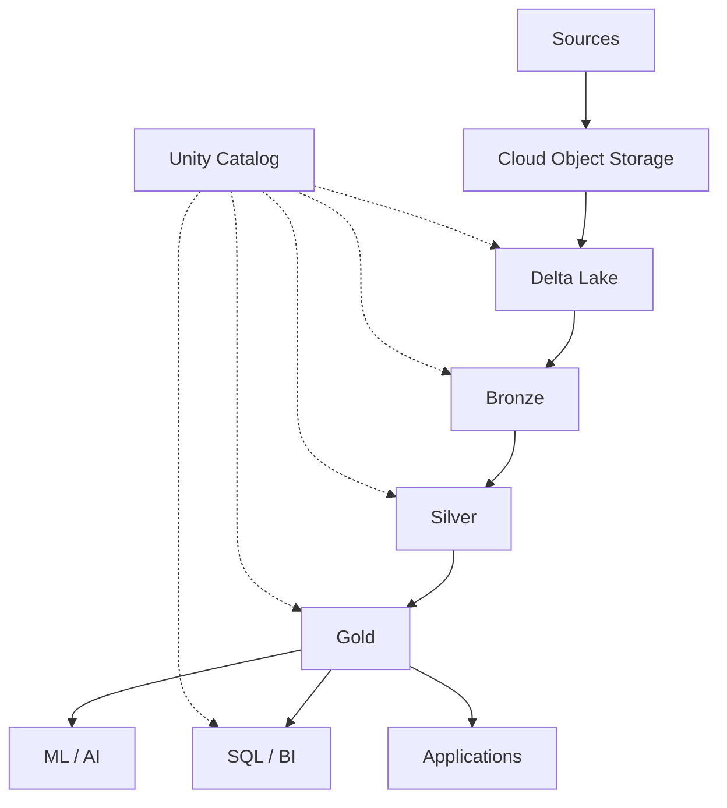
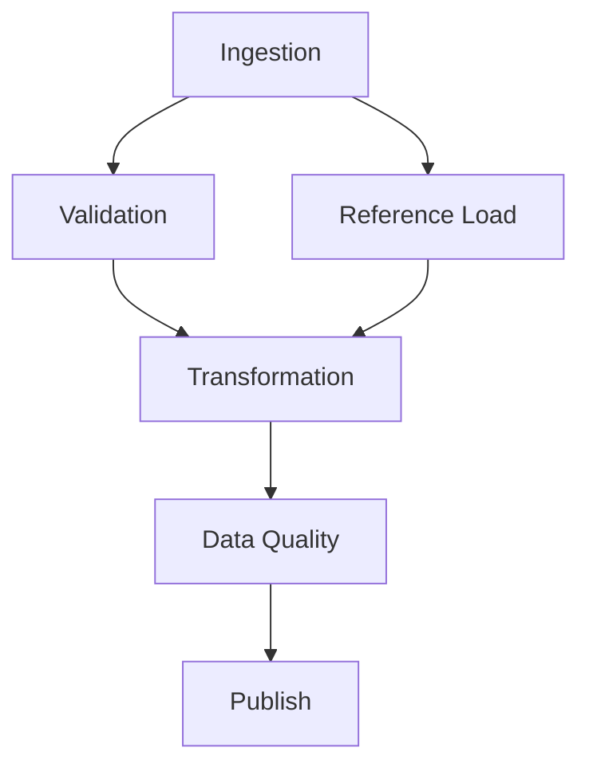
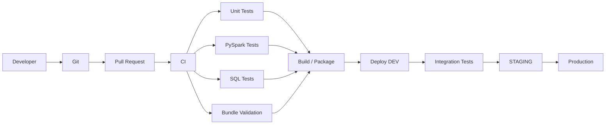
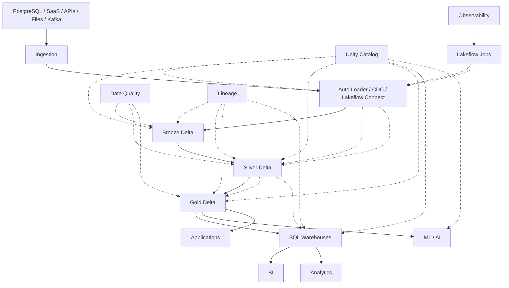

# Databricks — Top 35 Senior/Product Company Interview Questions & Answers

> **Target:** Senior / Lead / Staff Data Engineer
> **Goal:** 70+ LPA product-based companies
> **Focus:** Databricks Lakehouse, Delta Lake, Unity Catalog, Auto Loader, Lakeflow, Spark, Photon, SQL Warehouses, liquid clustering, predictive optimization, CDC/CDF, governance, security, performance, CI/CD and production architecture.

---

# 0. Databricks Mental Model

Before memorizing individual features, understand the overall platform:

```text
                    DATABRICKS LAKEHOUSE

                 ┌──────────────────────┐
                 │      AI / BI / ML    │
                 └──────────┬───────────┘
                            │
                 ┌──────────▼───────────┐
                 │ Serving / SQL / APIs │
                 └──────────┬───────────┘
                            │
                 ┌──────────▼───────────┐
                 │ Gold / Curated Data  │
                 ├──────────────────────┤
                 │ Silver / Validated   │
                 ├──────────────────────┤
                 │ Bronze / Raw         │
                 └──────────┬───────────┘
                            │
                 ┌──────────▼───────────┐
                 │      Delta Lake      │
                 │ ACID + Transactions  │
                 └──────────┬───────────┘
                            │
                 ┌──────────▼───────────┐
                 │ Object Storage       │
                 │ S3 / ADLS / GCS      │
                 └──────────────────────┘

      Governance / Security / Lineage
               ↓ Unity Catalog

      Compute / SQL / Jobs / Pipelines
               ↓
          Databricks Runtime
```

Databricks currently describes Delta Lake as the storage layer underlying the lakehouse, while Unity Catalog provides centralized governance across data and AI assets.

---

# 1. What is Databricks? Why would you choose it for Data Engineering?

## Core Answer

* Databricks is a cloud data and AI platform built around Apache Spark and lakehouse architecture.
* It combines:

  * Distributed data processing.
  * Lake storage.
  * SQL analytics.
  * Data engineering pipelines.
  * Data governance.
  * Machine learning / AI capabilities.
* A major architectural idea is to use scalable cloud object storage with transactional table formats and shared governance instead of maintaining completely separate copies for every workload.

## Major components

```text
Databricks
│
├── Compute
│   ├── Serverless
│   ├── Classic compute
│   └── SQL Warehouses
│
├── Storage / Tables
│   └── Delta Lake
│
├── Governance
│   └── Unity Catalog
│
├── Ingestion
│   ├── Auto Loader
│   └── Lakeflow Connect
│
├── Pipelines
│   └── Lakeflow Declarative Pipelines
│
├── Orchestration
│   └── Lakeflow Jobs
│
└── Development / Deployment
    ├── Git folders
    └── Declarative Automation Bundles
```

Databricks currently offers serverless compute, classic compute and SQL warehouses as major compute categories.

## Senior answer

> "I would choose Databricks when I need a unified platform for large-scale Spark processing, SQL analytics, transactional lakehouse tables, governed data access and increasingly AI workloads."

## Follow-up

### Databricks vs plain Spark?

* Spark = distributed compute engine.
* Databricks = managed platform around Spark plus storage, governance, orchestration, SQL, deployment and other services.

---

# 2. Explain the Databricks Lakehouse architecture.

## Core Answer

A lakehouse attempts to combine:

```text
Data Lake
+
Data Warehouse capabilities
```

Architecture:



## Benefits

* One data platform.
* Durable object storage.
* ACID transactions.
* Batch + streaming.
* SQL analytics.
* Central governance.
* Lineage.

## Senior point

Don't say:

> "Lakehouse means replacing a warehouse."

Say:

> "Lakehouse architecture provides warehouse-like transactional and analytical capabilities directly over scalable lake storage."

Delta Lake provides ACID transactions and scalable metadata on top of Parquet data files.

---

# 3. What is Delta Lake?

## Core Answer

Delta Lake is a storage layer that extends Parquet with a transaction log.

Conceptually:

```text
          DELTA TABLE

       Parquet Files
      /      |       \
   part1   part2    part3
       \      |      /
        \     |     /
        Transaction Log
               ↓
        Current Table State
```

Databricks describes Delta Lake as an open-source storage layer that extends Parquet with a file-based transaction log providing ACID transactions and scalable metadata handling.

## What does Delta add?

* ACID transactions.
* Schema enforcement/evolution capabilities.
* Time travel.
* Concurrent read/write semantics.
* `MERGE`.
* Change data feed.
* Transaction history.
* Data-quality/reliability patterns.

## Why is this important?

Without transactional coordination:

```text
Writer 1 → files
Writer 2 → files
Reader   → incomplete/inconsistent state
```

Delta maintains an atomic table state through its transaction protocol.

---

# 4. Explain how Delta Lake provides ACID transactions.

## Core Answer

### Atomicity

A transaction commits as one logical unit.

```text
Write 10 files
+
Update transaction log
```

If the transaction does not commit successfully, readers should not see a partially committed table state.

### Consistency

Table metadata/schema and transaction rules are maintained.

### Isolation

Readers can operate against a consistent table snapshot even while another operation is modifying the table.

### Durability

Committed table state is persisted in durable cloud storage.

## Snapshot idea

```text
Version 10
   ↓
Reader A sees Version 10

Writer
   ↓
Version 11 committed

Reader A
   ↓
continues seeing Version 10

New Reader
   ↓
sees Version 11
```

Delta's documentation describes snapshot isolation for reads and transactional history across table versions.

## Senior answer

> "The transaction log is the coordination mechanism that lets multiple operations reason about a consistent table state rather than simply treating Parquet files as an unmanaged folder."

---

# 5. What is the Delta transaction log?

## Core Answer

The Delta transaction log records table changes and provides the information needed to reconstruct a table version.

Conceptually:

```text
_delta_log/

000000.json
000001.json
000002.json
...
```

The log tracks changes such as:

* Added files.
* Removed files.
* Table metadata.
* Schema.
* Protocol information.
* Transaction information.

## Why important?

It enables:

```text
ACID
Time Travel
History
Rollback/Restore
Incremental processing
```

## Example

```text
Version 1
   ↓
+ file A

Version 2
   ↓
+ file B

Version 3
   ↓
remove file A
+ file C
```

Current table state is derived from the valid files recorded by the transaction history.

## Senior interview point

> "Delta is not a database storing rows inside the transaction log. The log is metadata about table state; the actual data remains in the underlying data files."

---

# 6. What is Delta Lake time travel?

## Core Answer

Time travel lets you query a previous table version.

Conceptually:

```sql
SELECT *
FROM customer VERSION AS OF 100;
```

or timestamp-based historical access where supported.

## Why useful?

* Debugging.
* Auditing.
* Reproducing historical results.
* Investigating accidental changes.
* Comparing versions.

Databricks documents table history and time travel as ways to inspect previous table versions and audit modifications.

## Example

```text
Current
Customer 101 → Chennai

Previous
Customer 101 → Bangalore
```

You can compare the two states.

## Important limitation

Time travel is **not the same as long-term backup**.

Databricks explicitly warns against using table history/time travel as a long-term archival strategy unless data/log retention has been deliberately configured.

---

# 7. What is VACUUM? Why can it be dangerous?

## Core Answer

`VACUUM` removes old/unreferenced data files that are no longer needed according to retention settings.

Example:

```text
Version 1
 └── file A

Version 2
 └── file B
     file A no longer current
```

Eventually:

```text
VACUUM
 ↓
delete old file A
```

## Why?

* Reduce storage cost.
* Remove obsolete files.
* Clean up historical data.

Databricks documents `VACUUM` as the mechanism for cleaning up unused data files and notes the relationship between retention and time-travel availability.

## Why dangerous?

If you remove old files too aggressively:

```text
Old data files deleted
        ↓
Older time-travel versions unavailable
```

## Senior answer

> "I never treat VACUUM as a routine delete command. I first understand the required time-travel window, recovery requirements and any downstream consumers that may depend on older table versions."

---

# 8. What is `MERGE INTO` in Delta Lake?

## Core Answer

`MERGE` supports:

* Updates.
* Inserts.
* Deletes.

based on source-target matching conditions.

Example:

```sql
MERGE INTO target t
USING source s
ON t.customer_id = s.customer_id

WHEN MATCHED THEN
  UPDATE SET *

WHEN NOT MATCHED THEN
  INSERT *;
```

Databricks documents `MERGE` as supporting update, insertion and deletion operations and as a common mechanism for upserts, deduplication and SCD patterns.

## Architecture

```text
Source Updates
     ↓
Business Key Match
     ↓
┌─────────────┐
│   MATCHED   │ → UPDATE / DELETE
└─────────────┘

┌─────────────┐
│ NOT MATCHED │ → INSERT
└─────────────┘
```

## Common uses

* CDC ingestion.
* SCD Type 1.
* SCD Type 2.
* Deduplication.
* Upsert.

## Critical follow-up

### What if the source contains duplicate keys?

The source must be deduplicated appropriately before merge when the merge semantics require a single source row per target row. Databricks explicitly notes this requirement in its merge guidance.

---

# 9. What is Change Data Feed (CDF) in Delta Lake?

## Core Answer

CDF captures row-level changes between table versions.

Conceptually:

```text
Source Delta Table

INSERT
UPDATE
DELETE
   ↓
Change Data Feed
   ↓
Downstream Pipeline
```

A CDF record can identify the type of change and carry the changed row information.

## Why use it?

Instead of:

```text
10 TB table
 ↓
reprocess everything
```

process:

```text
today's changed rows
```

## Use cases

* Incremental ETL.
* Audit.
* Replication.
* Synchronizing downstream tables.
* CDC pipelines.

Databricks currently recommends processing Delta CDF when downstream consumers need inserts, updates and deletes rather than simply ignoring table-change commits.

## Senior answer

> "CDF turns table changes into an explicit downstream data contract, which is much cleaner than repeatedly diffing entire snapshots."

---

# 10. What is Auto Loader?

## Core Answer

Auto Loader is Databricks' incremental file-ingestion mechanism for cloud object storage.

Conceptually:

```text
S3 / ADLS / GCS
      ↓
 new files
      ↓
 Auto Loader
      ↓
 Spark Structured Streaming
      ↓
 Delta Table
```

Databricks exposes Auto Loader as the `cloudFiles` Structured Streaming source and describes it as an incremental mechanism for processing new cloud-storage files as they arrive.

## Why use it?

* Incremental ingestion.
* Schema inference/evolution.
* Large numbers of files.
* File-arrival processing.
* Streaming-style ingestion.

## Example

```python
df = (
    spark.readStream
    .format("cloudFiles")
    .option("cloudFiles.format", "json")
    .load("/mnt/source")
)
```

## Senior answer

> "Auto Loader solves the file-discovery and incremental-ingestion problem; it is not itself the complete transformation or governance layer."

---

# 11. Auto Loader: directory listing vs file events?

## Core Answer

Auto Loader needs an efficient mechanism to discover new files.

A modern approach is:

```text
Cloud Storage
      ↓
File Event Notification
      ↓
Databricks File Events
      ↓
Auto Loader
```

Databricks currently supports managed file events for efficient discovery and recommends file-event-based ingestion where appropriate.

## Why file events?

Instead of repeatedly scanning a huge directory:

```text
List millions of files
      ↓
find new files
```

you can react to:

```text
new-file event
```

## Interview answer

> "For large-scale production ingestion, I would evaluate file events because discovery itself can become a bottleneck."

---

# 12. How does Auto Loader handle schema evolution?

## Core Answer

Auto Loader can:

* Infer schema.
* Track schema evolution.
* Add new columns depending on configuration.
* Rescue unexpected data.
* Apply schema hints.

Current supported modes include:

```text
addNewColumns
addNewColumnsWithTypeWidening
rescue
failOnNewColumns
none
```

## Example

```python
(
    spark.readStream
    .format("cloudFiles")
    .option("cloudFiles.format", "json")
    .option(
        "cloudFiles.schemaLocation",
        "/schemas/customer"
    )
    .option(
        "cloudFiles.schemaEvolutionMode",
        "addNewColumns"
    )
    .load("/raw/customer")
)
```

## Important production behavior

With `addNewColumns`, Databricks documents that Auto Loader updates the schema and the stream can fail with `UnknownFieldException`; restarting the stream then processes using the evolved schema. Databricks recommends using Lakeflow Jobs to automate the restart behavior.

## Senior point

> "Schema evolution should be deliberate. For contract-driven pipelines, I may prefer an explicit schema or `failOnNewColumns` rather than silently accepting every source change."

---

# 13. `COPY INTO` vs Auto Loader — what is the difference?

## `COPY INTO`

SQL-oriented.

```sql
COPY INTO target
FROM '/landing'
FILEFORMAT = JSON;
```

Databricks documents `COPY INTO` as retryable and idempotent: files already loaded are skipped on later executions.

## Auto Loader

Streaming/incremental ingestion framework:

```text
cloudFiles
+
Structured Streaming
```

## Simple decision

| Requirement                             | Choice      |
| --------------------------------------- | ----------- |
| SQL-oriented bulk/incremental ingestion | `COPY INTO` |
| Continuous incremental ingestion        | Auto Loader |
| Very large/high-growth file ingestion   | Auto Loader |
| Need schema evolution                   | Auto Loader |
| Simple batch file ingestion             | `COPY INTO` |

Databricks currently recommends streaming tables/Lakeflow-style managed ingestion for more scalable and robust production ingestion scenarios, while `COPY INTO` remains useful for incremental and bulk SQL loading.

---

# 14. What are Lakeflow Declarative Pipelines?

## Core Answer

Lakeflow Declarative Pipelines are Databricks' declarative pipeline framework for building production data pipelines.

The emphasis is:

```text
Define WHAT data should look like
        ↓
Databricks manages execution/orchestration details
```

The pipeline ecosystem supports concepts such as:

* Streaming tables.
* Materialized views.
* Data quality expectations.
* Schema evolution.
* Monitoring.
* Autoscaling.

Databricks currently recommends Lakeflow pipelines for many production ingestion workloads and describes them as extending Structured Streaming with autoscaling, expectations, schema-evolution handling and event-log monitoring.

## Why "declarative"?

Instead of building every operational detail manually:

```text
read
checkpoint
restart
monitor
quality
schema
```

you define:

```text
dataset
transformation
quality expectations
dependencies
```

and the platform manages more of the operational behavior.

---

# 15. What are data-quality expectations in Lakeflow pipelines?

## Core Answer

An expectation defines a data-quality condition.

Conceptually:

```text
Incoming Data
     ↓
Expectation
     ↓
Pass ─────→ Continue
     │
     └──────→ Fail Action
```

Example:

```text
customer_id IS NOT NULL
```

Possible behaviors include:

* Warn/measure.
* Drop invalid records.
* Fail the pipeline.

## Why useful?

Quality rules become part of the production pipeline rather than an external afterthought.

## Example

```python
@dp.expect(
    "valid_amount",
    "amount >= 0"
)
```

## Senior point

The exact action should depend on the rule.

For example:

```text
Optional attribute missing
→ warning

Invalid financial transaction
→ potentially fail/quarantine
```

Do not treat every quality violation equally.

---

# 16. Streaming table vs materialized view — explain the difference.

## Streaming table

Designed for incremental processing of changing/arriving data.

Conceptually:

```text
New data
   ↓
Incremental processing
   ↓
Updated table
```

## Materialized view

Represents a derived query result that Databricks can maintain/recompute based on upstream data changes.

Databricks currently documents materialized views as an alternative for workloads where automatic change propagation is useful, while streaming tables are aimed at incremental streaming-style processing.

## Decision

Use a streaming-style table when:

* Continuous/incremental ingestion is central.
* Event/file streams are involved.
* Stateful incremental transformations are required.

Use a materialized view when:

* The output is naturally a derived query.
* Automatic refresh/change propagation is useful.
* Higher latency is acceptable.

---

# 17. Explain Lakeflow Jobs.

## Core Answer

Lakeflow Jobs provides Databricks workflow orchestration.

A job can contain:

```text
Task A
   ↓
Task B
   ↓
Task C
```

and tasks can run in parallel when dependencies permit.

Databricks currently requires jobs to specify tasks and compute, while schedules are optional for manually triggered jobs; failed/canceled runs can be repaired and rerun.

## Example



## Capabilities

* Scheduling.
* Dependencies.
* Retries.
* Conditional execution.
* Parameters.
* Notifications.
* Repair/rerun.
* Serverless compute.

---

# 18. How would you design retries and failure handling in Lakeflow Jobs?

## Core Answer

Classify failures.

### Transient

```text
network timeout
temporary service failure
```

→ Retry.

### Data-quality

```text
invalid schema
negative amount
duplicate key
```

→ Fail/quarantine.

### Code

```text
logic bug
```

→ Stop and fix.

## Job design

```text
Task A
 ↓
Task B
 ↓
Task C
```

If B fails:

```text
Don't rerun everything blindly.
```

Use targeted repair/re-execution where the pipeline is designed for it.

Databricks currently supports repairing and rerunning failed/canceled job runs and provides task-level dependency/control-flow behavior.

## Senior answer

> "Retries should be attached to failure semantics. A transient infrastructure failure is retryable; a deterministic data or code error usually isn't."

---

# 19. What is Photon?

## Core Answer

Photon is Databricks' native execution engine designed to accelerate Spark/SQL workloads.

It is particularly relevant for:

* SQL.
* DataFrame operations.
* Parquet processing.
* Aggregations.
* Joins.
* Some streaming workloads.

Databricks currently states that Photon accelerates Spark SQL and DataFrame workloads and is enabled on serverless compute, SQL warehouses and serverless Lakeflow pipelines; it is also enabled by default for several classic compute types.

## Concept

```text
Spark API / SQL
      ↓
Optimized Execution
      ↓
Photon
      ↓
Native execution
      ↓
Faster analytical workloads
```

## Important

Photon doesn't fix:

```text
bad joins
bad partitioning
data skew
unnecessary data movement
```

## Senior answer

> "Photon can improve execution efficiency, but it is not a substitute for good query/data engineering. I still start with workload and execution-plan analysis."

---

# 20. Explain Databricks compute options.

Databricks currently describes three broad categories:

```text
Compute
│
├── Serverless
│
├── Classic compute
│
└── SQL Warehouses
```

## Serverless

* Databricks-managed.
* Automatically provisioned/scaled.
* Less infrastructure management.

## Classic compute

* More explicit infrastructure control.
* Useful where customization is required.

## SQL Warehouse

Optimized for SQL analytics.

## Decision

```text
Interactive engineering
→ notebook compute

Batch pipeline
→ jobs compute / serverless jobs

BI / SQL analytics
→ SQL warehouse

Strict infrastructure customization
→ classic compute
```

## Senior point

Choose compute based on:

* Workload.
* Startup latency.
* Cost.
* Security/network requirements.
* Custom libraries.
* Governance.
* Runtime behavior.

---

# 21. What is Unity Catalog?

## Core Answer

Unity Catalog is Databricks' centralized governance layer for:

* Tables.
* Schemas.
* Catalogs.
* Volumes.
* Models.
* Functions.
* Permissions.
* Lineage.
* Auditing.

Databricks currently describes Unity Catalog as the unified governance layer for data and AI assets.

## Hierarchy

```text
Metastore
   │
   ├── Catalog
   │     │
   │     ├── Schema
   │     │      ├── Table
   │     │      ├── View
   │     │      └── Volume
   │     │
   │     └── Schema
   │
   └── Catalog
```

## Why useful?

Without centralized governance:

```text
Workspace A
Workspace B
Workspace C
       ↓
Different permissions
Different metadata
Different lineage
```

Unity Catalog centralizes governance across attached workspaces/metastore scope.

---

# 22. Managed table vs external table in Unity Catalog.

## Managed table

Unity Catalog controls:

* Governance.
* Storage location.
* Data lifecycle.

Databricks currently recommends managed tables for most new use cases.

## External table

Unity Catalog controls:

* Metadata.
* Access/governance.

But:

```text
You control underlying files
```

Databricks describes external tables as useful when existing data must remain in its current cloud-storage location or when external systems need direct file interaction.

## Comparison

|                               | Managed       | External       |
| ----------------------------- | ------------- | -------------- |
| Metadata governance           | UC            | UC             |
| File lifecycle                | UC            | You            |
| Storage location              | UC-managed    | User-defined   |
| Best for new tables           | Generally     | Specific cases |
| External system direct access | Less suitable | Useful         |

## Senior answer

> "I default to managed tables unless there is a specific requirement to retain external storage ownership or external-file interoperability."

---

# 23. What are storage credentials, external locations and volumes?

This is a very common Unity Catalog interview question.

## Storage credential

Represents cloud credentials securely.

```text
Cloud identity
     ↓
Storage Credential
```

## External location

Combines:

```text
Storage credential
+
Cloud storage path
```

Databricks documents an external location as a securable object associating a cloud storage URI with a storage credential.

## Volume

A governed file-oriented object inside Unity Catalog.

Useful for:

* Unstructured files.
* PDFs.
* Images.
* Landing/staging areas.
* Non-tabular data.

## Architecture

```text
Cloud Storage
      ↓
External Location
      ↓
Volume / External Table
      ↓
Unity Catalog Governance
```

## Security principle

Avoid giving ordinary users broad direct bucket access that bypasses Unity Catalog governance.

Databricks explicitly recommends limiting direct cloud-storage access to preserve Unity Catalog access control, auditing and lineage.

---

# 24. How does Unity Catalog provide lineage?

## Core Answer

Unity Catalog automatically captures lineage for Databricks workloads.

Current Databricks documentation states that lineage can be captured automatically down to the column level for queries run on Databricks, including relationships among tables, jobs, notebooks and dashboards.

## Example

```text
Salesforce
   ↓
raw.customer
   ↓
silver.customer
   ↓
gold.customer_360
   ↓
Power BI
```

## Why important?

* Impact analysis.
* Root-cause analysis.
* Compliance.
* Sensitive-data tracking.
* Ownership/dependency discovery.

## External lineage

Databricks can also represent external sources and consumers such as:

```text
MySQL
Salesforce
Tableau
Power BI
```

in lineage graphs.

This is particularly relevant to your migration and BI work.

---

# 25. Explain Unity Catalog RBAC vs ABAC.

## RBAC

Role/group-oriented:

```text
Data Analyst
     ↓
GRANT SELECT
```

## ABAC

Attribute-oriented:

```text
Data tagged:
classification = confidential
        ↓
Policy
        ↓
Mask / filter / grant
```

Unity Catalog currently supports ABAC using governed tags and dynamically evaluated policies. ABAC can operate at metastore/catalog/schema/table scopes and supports row filtering and column masking.

## Why ABAC?

Suppose:

```text
100 tables
+
PII columns
```

Instead of manually creating:

```text
100 separate masking configurations
```

you can use governed metadata/tags to drive policy.

## Senior answer

> "RBAC is useful for coarse object access; ABAC becomes powerful when access rules depend on data attributes such as sensitivity, geography or classification."

---

# 26. Explain row-level security and column masking in Unity Catalog.

## Row filter

Controls which rows a user can see.

Example:

```text
User = India Analyst

Table:
IN records
US records
EU records

Result:
IN records only
```

## Column mask

Controls what values a user sees.

Example:

```text
SSN = 123456789

Privileged user:
123456789

Other user:
XXXXXX789
```

Databricks currently provides table-level row filters and column masks, while recommending ABAC for consistent protection across many datasets.

## Critical point

The filter/mask does not itself grant access.

Base table privileges still have to be granted separately.

---

# 27. How does Databricks optimize large tables?

Think in layers.

```text
Query
 ↓
Column pruning
 ↓
Predicate pushdown
 ↓
Data skipping
 ↓
Clustering / layout
 ↓
Efficient execution
 ↓
Photon
```

## Data skipping

Databricks collects file-level statistics such as:

```text
min
max
null count
record count
```

to skip files that cannot satisfy a filter.

Example:

```text
Query:
WHERE customer_id = 100

File 1:
min=1
max=50
→ skip

File 2:
min=90
max=150
→ read
```

## Senior point

> "The objective is not merely faster compute. The first optimization is reducing how much data the engine needs to read."

---

# 28. What is liquid clustering? How is it different from traditional partitioning and Z-ORDER?

> **Very important for current Databricks interviews.**

## Traditional partitioning

```text
year=2026
month=10
day=03
```

Fixed partition boundaries.

## Z-ORDER

Historically used to colocate related data for multidimensional skipping on Delta tables.

## Liquid clustering

Uses flexible multidimensional clustering.

Databricks currently recommends liquid clustering for table layout and describes it as a replacement for static partitioning/Z-ORDER in recommended modern table-layout patterns.

## Why liquid clustering?

* Handles changing access patterns.
* Works with high-cardinality keys.
* Avoids fixed partition boundaries.
* Incrementally reorganizes data.
* Can change clustering columns without a full table rewrite.

Databricks currently supports automatic liquid clustering with `CLUSTER BY AUTO` and recommends it for managed tables in conjunction with predictive optimization.

## Mental model

```text
Traditional:

Data
 ↓
Fixed partitions
 ↓
Potential skew
 ↓
Rigid layout


Liquid clustering:

Data
 ↓
Usage patterns
 ↓
Clustering
 ↓
Adaptive layout
```

---

# 29. When should you partition a Databricks table?

## Core Answer

Don't automatically partition everything.

Current Databricks guidance states that most tables under roughly 100 TB do not need manual partitioning and recommends liquid clustering for managed tables; custom partitioning should be justified by workload-specific benefits.

## Good candidate

A very large fact table frequently filtered by:

```text
event_date
```

might benefit from an appropriate layout.

## Bad candidate

```text
customer_id
```

with hundreds of millions of distinct values.

Potential result:

```text
Too many partitions
        ↓
Small files
        ↓
Poor performance
```

## Senior answer

> "I don't partition because the table is large. I partition only when the partition key materially improves data skipping and access patterns without creating excessive fragmentation."

---

# 30. What is predictive optimization?

## Core Answer

Predictive optimization automates table maintenance/optimization for Unity Catalog managed tables.

Current Databricks documentation describes it as automatically optimizing data layout and recommends enabling it for managed tables to reduce maintenance work and storage/compute costs.

It can automate operations such as:

```text
OPTIMIZE
ANALYZE
VACUUM
```

when the platform determines they are appropriate, depending on the feature/runtime/workload.

## Why useful?

Without automation:

```text
Engineer
 ↓
decides when to OPTIMIZE
 ↓
decides when to VACUUM
 ↓
decides statistics strategy
```

With predictive optimization:

```text
Databricks
 ↓
observes workload/table
 ↓
performs maintenance when useful
```

## Senior answer

> "Predictive optimization reduces operational tuning, but I still monitor cost and workload behavior. Automation should reduce toil, not eliminate engineering visibility."

---

# 31. What does `OPTIMIZE` do?

## Core Answer

`OPTIMIZE` rewrites data files to improve physical data layout.

Databricks currently documents it as a file-layout optimization for Delta and Iceberg tables and notes that for liquid-clustered tables it groups data by clustering keys.

## Main purpose

```text
Many small files
      ↓
OPTIMIZE
      ↓
Better-sized / better-organized files
```

## Why?

* Reduce small-file problem.
* Improve scanning.
* Improve data skipping.
* Improve layout.

## Cost consideration

`OPTIMIZE` itself consumes compute.

Therefore:

```text
More frequent optimization
→ potentially better query performance
→ higher maintenance cost
```

Databricks explicitly documents this performance-vs-cost trade-off.

---

# 32. Explain the Databricks small-files problem.

Suppose:

```text
1 TB data

Option A:
10,000 × 100 MB files

Option B:
100 million × 10 KB files
```

Option B creates serious operational overhead.

## Problems

* File metadata overhead.
* More tasks.
* More file opens.
* Slower scans.
* Greater storage/API overhead.

## Causes

* Excessive partitioning.
* Too much parallel output.
* Frequent tiny streaming micro-batches.
* Poor ingestion design.

## Solutions

* Correct table layout.
* Appropriate partitioning/clustering.
* Compaction/`OPTIMIZE`.
* Auto compaction.
* Predictive optimization.
* Better ingestion batch sizing.

Databricks currently recommends liquid clustering and predictive optimization for modern managed-table layouts, with `OPTIMIZE` handling file-layout rewrites.

---

# 33. Explain Delta schema enforcement vs schema evolution.

## Schema enforcement

Protects the table against incompatible writes.

Example:

```text
Target:
amount DECIMAL

Incoming:
amount STRING
```

Don't blindly accept it.

## Schema evolution

Allows supported schema changes such as adding columns, where explicitly configured.

Databricks documents Delta schema evolution capabilities and distinguishes them from automatic schema handling in Auto Loader.

## Example

```text
Current:
id
name

Incoming:
id
name
phone
```

Potentially:

```text
schema evolution
→ add phone
```

## Senior answer

> "Schema enforcement answers 'should this write be allowed?' Schema evolution answers 'which schema changes should we deliberately accept?' They are related but not the same."

---

# 34. How would you implement CI/CD for a Databricks project?

> **Very important for your profile because you already list GitHub Actions and CI/CD.**

## Current Databricks approach

Databricks currently recommends **Declarative Automation Bundles** for packaging and deploying CI/CD workflows; they were formerly called **Databricks Asset Bundles**.

## Architecture



## Bundle lifecycle

```text
Create
 ↓
Develop locally
 ↓
Validate
 ↓
Deploy
 ↓
Run
```

Databricks documents validation and deployment of jobs/pipelines/resources using Declarative Automation Bundles.

## Git folders vs Bundles

### Git folders

Good for:

* Interactive development.
* Notebook/code collaboration.

### Declarative Automation Bundles

Preferred for:

* CI/CD.
* Production deployment.
* Versioned resource definitions.
* Jobs/pipelines as code.

Databricks explicitly recommends Git folders for interactive development and Declarative Automation Bundles for CI/CD/production deployment.

---

# 35. Design a production-grade Databricks Data Engineering platform.

> **THIS IS THE MOST IMPORTANT DATABRICKS QUESTION.**

Suppose:

```text
Sources:
PostgreSQL
APIs
Files
Kafka

Volume:
5 TB/day

Consumers:
BI
ML
AI
Applications
```

---

# Requirements

Clarify:

```text
Latency?
Growth?
Retention?
RPO/RTO?
PII?
Number of sources?
Streaming?
Batch?
Consumer SLAs?
Cost target?
```

---

# Architecture



---

# Layer 1 — Ingestion

Use the appropriate mechanism:

```text
Database CDC
→ CDC / managed ingestion

Cloud files
→ Auto Loader

Managed SaaS sources
→ Lakeflow Connect where suitable

Existing static files
→ COPY INTO

Events
→ streaming/event source
```

Databricks currently provides Auto Loader, Lakeflow Connect and file-ingestion options for these different patterns.

---

# Layer 2 — Bronze

Store:

```text
Raw source data
+
ingestion metadata
```

Example:

```text
source_system
ingestion_timestamp
file_name
batch_id
schema_version
```

Purpose:

* Replay.
* Audit.
* Troubleshooting.

---

# Layer 3 — Silver

Apply:

```text
Deduplication
Schema normalization
Data-quality validation
Business standardization
Enrichment
CDC handling
```

---

# Layer 4 — Gold

Build:

```text
Facts
Dimensions
Aggregates
Business marts
Consumer-specific datasets
```

---

# Layer 5 — Governance

Use Unity Catalog for:

```text
Permissions
Lineage
Auditing
Classification
Row filters
Column masking
ABAC
```

Unity Catalog currently governs data and AI objects and captures lineage for Databricks workloads.

---

# Layer 6 — Performance

Use:

```text
Column pruning
Predicate filtering
Data skipping
Liquid clustering
Predictive optimization
Photon
Appropriate compute
```

Do not automatically create:

```text
hundreds of partitions
```

for every dataset.

Current Databricks guidance favors liquid clustering and predictive optimization for modern managed tables.

---

# Layer 7 — Orchestration

Use Lakeflow Jobs for:

```text
Dependencies
Retries
Schedules
Triggers
Parameters
Conditional logic
Repair/rerun
Notifications
```

Lakeflow Jobs currently supports time-based schedules, table-update triggers, file-arrival triggers and other trigger types.

---

# Layer 8 — Reliability

Design for:

```text
Idempotency
Checkpointing
Retries
CDC
CDF
Backfill
Reconciliation
Schema evolution
```

---

# Layer 9 — Observability

Monitor:

## Pipeline

```text
success/failure
duration
retries
```

## Data

```text
freshness
row count
null rate
duplicates
schema
```

## Spark

```text
shuffle
spill
skew
task duration
executor health
```

## Databricks

```text
cluster/warehouse utilization
job failures
query latency
cost
```

---

# Layer 10 — CI/CD

Use:

```text
Git
 ↓
PR
 ↓
Tests
 ↓
Bundle validation
 ↓
Deploy DEV
 ↓
Integration
 ↓
STAGING
 ↓
Production
```

Production Databricks resources should be managed as deployable source-controlled artifacts rather than manually edited in production. Databricks currently recommends Declarative Automation Bundles for this workflow.

---

# Layer 11 — Security

Use:

```text
Unity Catalog
+
IAM
+
RBAC / ABAC
+
Managed identities / service principals
+
Secret management
+
Network controls
```

Avoid:

```text
User
 ↓
Direct bucket access
```

where this bypasses centralized governance.

Databricks specifically warns that external direct access to managed storage can compromise Unity Catalog access control, auditing and lineage.

---

# 90-SECOND PRODUCTION ANSWER

> "For a production Databricks platform, I would first define the workload SLA, volume, source types, retention, consumers and governance requirements. I would use Auto Loader or managed ingestion for incremental file/source ingestion and CDC where relational changes need to be captured. Raw data would land in Bronze Delta tables, then move through Silver validation and standardization into Gold business models. Unity Catalog would provide centralized access control, lineage, auditing and data governance. For table performance, I would use appropriate data layout, data skipping, liquid clustering and predictive optimization rather than blindly partitioning large tables. For compute, I would choose serverless, jobs compute or SQL warehouses based on workload characteristics and cost requirements, with Photon where appropriate. Lakeflow Jobs would orchestrate dependencies, retries, triggers and repair runs, while Lakeflow pipelines could provide managed incremental transformations and expectations. I would make pipelines idempotent and backfillable, use Delta CDF or other CDC mechanisms for incremental downstream propagation, and build data quality and observability into every layer. Finally, I would manage Databricks resources through Git and Declarative Automation Bundles with automated tests and environment promotion."

---

# YOUR RESUME → DATABRICKS INTERVIEW STORY BANK

Your resume gives you several stories that should be used instead of purely hypothetical answers.

| Interview Area               | Your Story                         |
| ---------------------------- | ---------------------------------- |
| Databricks                   | Azure Data Platform                |
| PySpark                      | Azure ETL                          |
| Scala + Spark                | Azure + American Express           |
| Azure migration              | Forever New                        |
| Data Quality                 | Enterprise DQ Framework            |
| Reconciliation               | File/table/cross-system validation |
| Schema governance            | Redshift governance platform       |
| CI/CD                        | Git + environment promotion        |
| Metadata-driven architecture | YAML validation framework          |
| BI consumption               | Power BI / Tableau                 |
| Validation tooling           | PySpark file-vs-file accelerator   |

Your Azure project explicitly lists ADF, Databricks, ADLS, PySpark, Scala, SQL Server and Power BI, while your migration project uses Azure Data Lake, Databricks and validation/reconciliation checkpoints.

---

# HIGH-VALUE DATABRICKS FOLLOW-UP QUESTIONS

Be ready for these after the 35 questions:

```text
What is the difference between Delta and Parquet?

Why does Delta need a transaction log?

What happens during a Delta MERGE?

How do you prevent duplicate MERGE matches?

What is Delta time travel?

How does VACUUM affect time travel?

What is CDF?

How do you build an incremental pipeline with CDF?

Auto Loader vs COPY INTO?

How does Auto Loader discover files?

What happens when Auto Loader detects a new column?

What is schema rescue?

Why would an Auto Loader stream stop after schema evolution?

What are Lakeflow pipelines?

What is an expectation?

Streaming table vs materialized view?

What is Lakeflow Jobs?

How do task dependencies work?

How do you repair a failed job?

Photon vs standard Spark execution?

Job cluster vs all-purpose cluster?

Serverless vs classic compute?

SQL Warehouse vs Spark compute?

What is Unity Catalog?

Metastore vs catalog vs schema?

Managed vs external table?

What is an external location?

What is a storage credential?

What is a volume?

What is Unity Catalog lineage?

RBAC vs ABAC?

What is row-level security?

What is column masking?

What is data skipping?

What is liquid clustering?

Liquid clustering vs partitioning?

Liquid clustering vs Z-ORDER?

What is predictive optimization?

What does OPTIMIZE do?

How do you solve small files?

How do you deploy Databricks jobs through GitHub Actions?

What are Declarative Automation Bundles?

How do you design a multi-environment Databricks platform?
```

---

# DATABRICKS PERFORMANCE DECISION TREE

When an interviewer says:

> "This Databricks job is slow."

Think:

```text
                 JOB SLOW
                    ↓
             Check Spark UI
                    ↓
       ┌────────────┼─────────────┐
       ↓            ↓             ↓
   Data Scan      Shuffle        Compute
       ↓            ↓             ↓
 Partition?       Join?        UDF?
 Skipping?        Skew?        CPU?
 Clustering?      Repartition? Photon?
 Files?           Aggregation?  Memory?
       └────────────┼─────────────┘
                    ↓
             Fix bottleneck
                    ↓
               Measure again
```

Never begin with:

```text
"Increase cluster size."
```

---

# DATABRICKS TABLE-DESIGN DECISION TREE

```text
New Table
   ↓
Managed or External?
   ↓
Managed preferred for most new UC tables
   ↓
What is workload?
   ↓
Large analytical table?
   ↓
Do I actually need manual partitioning?
   ↓
Usually consider liquid clustering first
   ↓
Need incremental updates?
   ↓
MERGE / CDF / streaming
   ↓
Many small files?
   ↓
Compaction / OPTIMIZE / predictive optimization
```

Databricks currently recommends managed tables, predictive optimization and liquid clustering as the modern default direction for many Unity Catalog managed-table workloads.

---

# DATABRICKS INGESTION CHEAT SHEET

```text
STATIC FILES
   ↓
COPY INTO
```

```text
CONTINUOUS FILE INGESTION
   ↓
AUTO LOADER
```

```text
MANAGED CONNECTOR
   ↓
LAKEFLOW CONNECT
```

```text
DATABASE CHANGES
   ↓
CDC / CDF
```

```text
PRODUCTION TRANSFORMATION PIPELINE
   ↓
LAKEFLOW DECLARATIVE PIPELINES
```

---

# DATABRICKS GOVERNANCE CHEAT SHEET

```text
UNITY CATALOG
│
├── Access Control
│   ├── GRANT
│   ├── RBAC
│   └── ABAC
│
├── Fine-Grained Security
│   ├── Row Filters
│   └── Column Masks
│
├── Metadata
│   ├── Catalog
│   ├── Schema
│   ├── Tables
│   ├── Volumes
│   └── Functions
│
├── Governance
│   ├── Auditing
│   ├── Lineage
│   └── Classification
│
└── Cloud Storage
    ├── Storage Credentials
    ├── External Locations
    ├── Managed Tables
    └── External Tables
```

---

# DATABRICKS DELTA CHEAT SHEET

```text
DELTA LAKE
│
├── Parquet Data Files
│
├── Transaction Log
│
├── ACID
│
├── Time Travel
│
├── MERGE
│
├── Schema Enforcement
│
├── Schema Evolution
│
├── Change Data Feed
│
├── OPTIMIZE
│
├── VACUUM
│
├── Data Skipping
│
├── Liquid Clustering
│
└── Predictive Optimization
```

---

# DATABRICKS INTERVIEW TRAPS

## Trap 1

> "Delta is a database."

### Better

> "Delta Lake is a transactional storage layer/table format built on data files and a transaction log."

---

## Trap 2

> "More partitions mean better performance."

### Better

> "Appropriate partitioning can reduce scanning, but over-partitioning can create small files and metadata overhead."

---

## Trap 3

> "Auto Loader is just a file reader."

### Better

> "Auto Loader is an incremental file-ingestion mechanism built on Structured Streaming with schema-management and file-discovery capabilities."

---

## Trap 4

> "VACUUM deletes old records."

### Better

> "`VACUUM` cleans up unused physical data files; it is not the normal logical mechanism for deleting business records."

---

## Trap 5

> "Rollback Delta means restore backup."

### Better

> "Delta history/time travel/restore can recover a previous table state, but long-term backup and archival requirements need separate retention/backup planning."

---

## Trap 6

> "Unity Catalog gives access to the data."

### Better

> "Unity Catalog governs and controls access, but users still need appropriate object privileges."

Databricks explicitly notes that ABAC row/column policies add restrictions on top of base object-level access.

---

## Trap 7

> "Z-ORDER is the modern default."

### Better

> "For current Databricks table-layout guidance, liquid clustering is the recommended direction for modern managed-table workloads; Z-ORDER remains relevant for appropriate non-liquid-clustered Delta tables."

---

# 15 DATABRICKS COMMANDS YOU SHOULD KNOW

## Tables

```sql
CREATE TABLE
CREATE OR REPLACE TABLE
ALTER TABLE
DESCRIBE TABLE
DESCRIBE DETAIL
DESCRIBE HISTORY
```

## Delta

```sql
MERGE INTO
OPTIMIZE
VACUUM
RESTORE TABLE
```

## Storage

```sql
CREATE VOLUME
CREATE EXTERNAL LOCATION
CREATE STORAGE CREDENTIAL
```

## Governance

```sql
GRANT
REVOKE
```

## Clustering

```sql
CLUSTER BY
```

## Ingestion

```sql
COPY INTO
```

---

# 15 PYTHON/PYSPARK DATABRICKS PATTERNS TO KNOW

```python
spark.read.format("delta")

spark.readStream.format("cloudFiles")

df.write.format("delta")

df.writeStream.format("delta")

df.repartition(...)

df.dropDuplicates(...)

df.withWatermark(...)

df.explain("formatted")

DeltaTable.forName(...)

delta_table.merge(...)

spark.sql("OPTIMIZE ...")

spark.sql("DESCRIBE HISTORY ...")

spark.sql("VACUUM ...")

spark.sql("RESTORE TABLE ...")

spark.sql("CREATE TABLE ...")

spark.sql("CREATE OR REPLACE TABLE ...")
```

---

# 15 SENIOR DATABRICKS STATEMENTS TO MEMORIZE

### 1

> "Delta Lake gives the lakehouse transactional semantics over cloud object storage."

### 2

> "The Delta transaction log represents table state; it is not the primary store for the actual business records."

### 3

> "I use MERGE for controlled upsert/CDC patterns, but the incoming source must have well-defined key semantics."

### 4

> "CDF is valuable when downstream consumers need explicit row-level change propagation."

### 5

> "Auto Loader solves scalable incremental file discovery and ingestion."

### 6

> "Schema evolution should be governed rather than automatically accepting every source change."

### 7

> "Unity Catalog is the central governance layer for Databricks data and AI assets."

### 8

> "Managed tables are my default starting point for new Unity Catalog tables unless there is a concrete reason to use external storage management."

### 9

> "Liquid clustering should be considered before introducing rigid high-cardinality partition strategies."

### 10

> "Data skipping reduces the amount of data scanned; compute scaling should not be the first optimization."

### 11

> "Photon can accelerate execution, but it cannot compensate for poor data layout or inefficient transformations."

### 12

> "VACUUM is a physical-file cleanup mechanism and must be aligned with retention requirements."

### 13

> "A pipeline can succeed technically while producing incorrect data, so expectations and reconciliation remain important."

### 14

> "Production Databricks resources should be version-controlled and deployed through a controlled CI/CD process."

### 15

> "A good Databricks architecture separates storage, compute, governance, orchestration and business logic while allowing them to work together."

---

# FINAL DATABRICKS REVISION CHECKLIST

```text
□ Databricks architecture
□ Lakehouse
□ Delta Lake
□ Delta transaction log
□ ACID
□ Snapshot isolation
□ Time travel
□ DESCRIBE HISTORY
□ VACUUM
□ MERGE
□ MERGE duplicate handling
□ Change Data Feed
□ Auto Loader
□ File events
□ Auto Loader schema evolution
□ COPY INTO
□ Lakeflow Declarative Pipelines
□ Expectations
□ Streaming tables
□ Materialized views
□ Lakeflow Jobs
□ Job dependencies
□ Job retries
□ Job repair/rerun
□ Photon
□ Serverless compute
□ Classic compute
□ SQL Warehouse
□ Unity Catalog
□ Metastore/catalog/schema
□ Managed tables
□ External tables
□ Storage credentials
□ External locations
□ Volumes
□ Lineage
□ RBAC
□ ABAC
□ Row filters
□ Column masks
□ Data skipping
□ Liquid clustering
□ Partitioning
□ Z-ORDER
□ Predictive optimization
□ OPTIMIZE
□ Small files
□ Schema enforcement
□ Schema evolution
□ Declarative Automation Bundles
□ Databricks CI/CD
□ Production architecture
```

---

# MOST IMPORTANT DATABRICKS WHITEBOARD

Learn this diagram until you can reproduce it from memory:

```text
                         USERS
                           │
              ┌────────────┼────────────┐
              ↓            ↓            ↓
             BI           ML           AI
              │            │            │
              └────────────┼────────────┘
                           ↓
                    SQL / Serving
                           │
                  ┌────────▼────────┐
                  │  UNITY CATALOG  │
                  │ Governance      │
                  │ Security        │
                  │ Lineage         │
                  └────────┬────────┘
                           │
              ┌────────────▼────────────┐
              │       GOLD DELTA        │
              └────────────┬────────────┘
                           │
              ┌────────────▼────────────┐
              │      SILVER DELTA       │
              └────────────┬────────────┘
                           │
              ┌────────────▼────────────┐
              │      BRONZE DELTA       │
              └────────────┬────────────┘
                           │
            ┌──────────────▼───────────────┐
            │       CLOUD STORAGE          │
            │      S3 / ADLS / GCS         │
            └──────────────────────────────┘

       INGESTION
       ├── Auto Loader
       ├── Lakeflow Connect
       ├── CDC / CDF
       └── COPY INTO

       PROCESSING
       ├── Spark
       ├── PySpark
       └── Photon

       ORCHESTRATION
       ├── Lakeflow Jobs
       └── Lakeflow Pipelines

       DEPLOYMENT
       ├── Git
       └── Declarative Automation Bundles
```

---

# THE DATABRICKS INTERVIEW STANDARD

When asked:

> **"How would you optimize this Databricks platform?"**

Answer in this order:

```text
1. Understand workload
        ↓
2. Understand data layout
        ↓
3. Reduce data scanned
        ↓
4. Reduce data shuffled
        ↓
5. Fix skew
        ↓
6. Optimize joins
        ↓
7. Optimize file layout
        ↓
8. Use liquid clustering where appropriate
        ↓
9. Use Photon / appropriate compute
        ↓
10. Measure cost + performance
```

When asked:

> **"How would you make it production-ready?"**

Think:

```text
Reliability
+
Data Quality
+
Schema Evolution
+
Governance
+
Security
+
Lineage
+
Observability
+
CI/CD
+
Backfill
+
Disaster Recovery
+
Cost
```

When asked:

> **"Why Databricks?"**

Think:

```text
Spark
+
Delta
+
Lakehouse
+
Unity Catalog
+
SQL
+
Streaming
+
Governance
+
AI
+
Managed Operations
```

---

# RESEARCH BASIS

This chapter was researched against current Databricks documentation, including:

* Delta Lake architecture, transactions and lakehouse storage.
* Delta `MERGE`, upserts, deduplication and CDC patterns.
* Delta Change Data Feed.
* Delta history, time travel, `VACUUM` and restore concepts.
* Auto Loader, file events, schema evolution and production ingestion.
* Lakeflow Jobs, task dependencies and triggers.
* Photon and Databricks compute.
* Unity Catalog governance, managed/external assets and lineage.
* Unity Catalog external locations, storage credentials and volumes.
* Unity Catalog ABAC, row filters and column masks.
* Databricks data skipping, liquid clustering, partitioning and predictive optimization.
* Current Declarative Automation Bundles terminology and CI/CD guidance.

---

# END OF TOPIC 8

```text
1. Data Engineering           ✅
2. Big Data Engineering       ✅
3. SQL                        ✅
4. Python                     ✅
5. PySpark                    ✅
6. DevOps                     ✅
7. AI — Data Engineering      ✅
8. Databricks                 ✅

NEXT
9. Snowflake
10. AWS
11. Azure
12. GCP
```
