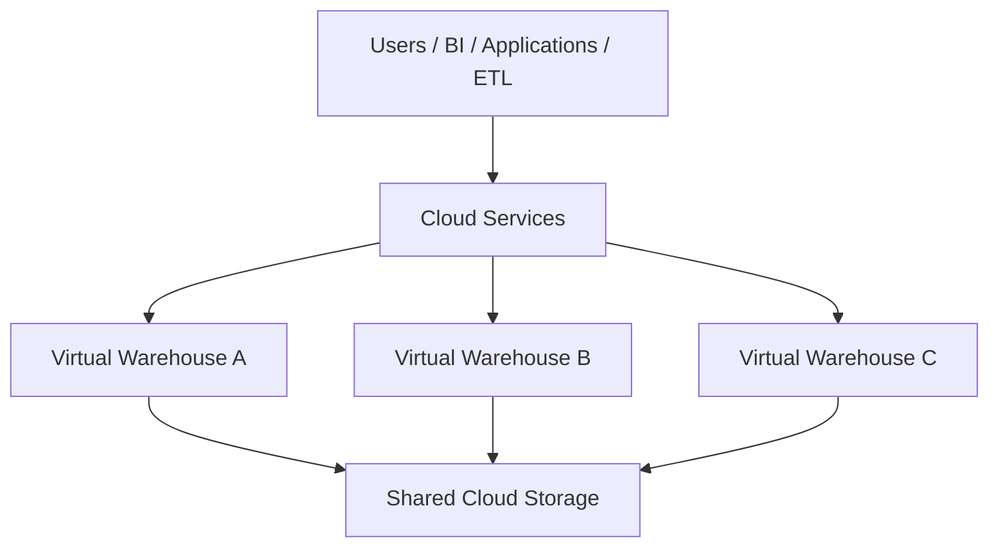
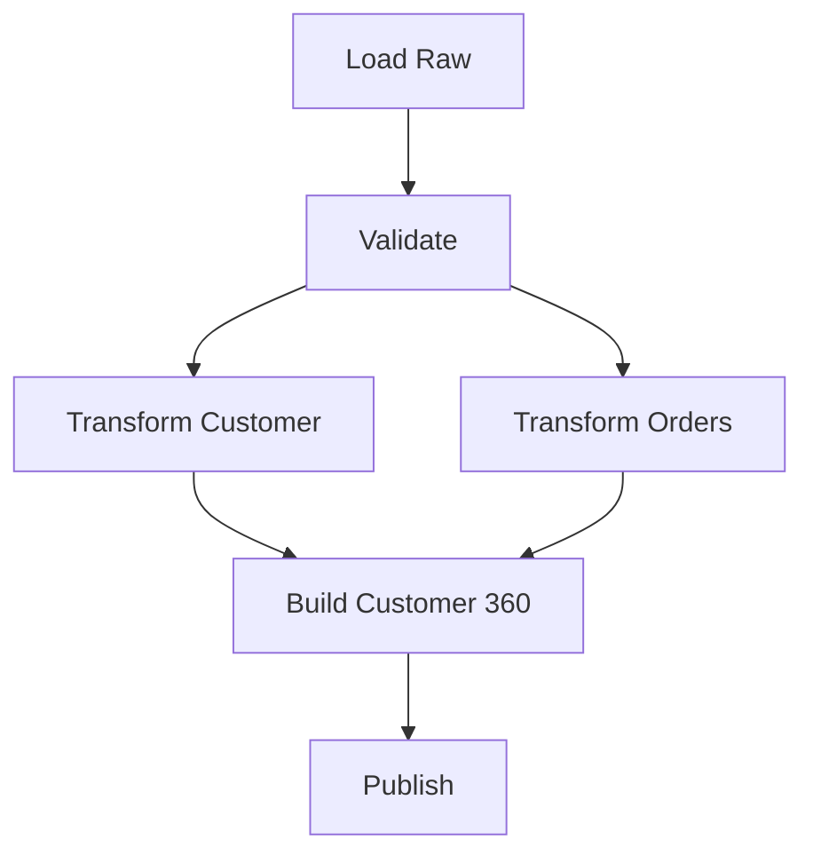
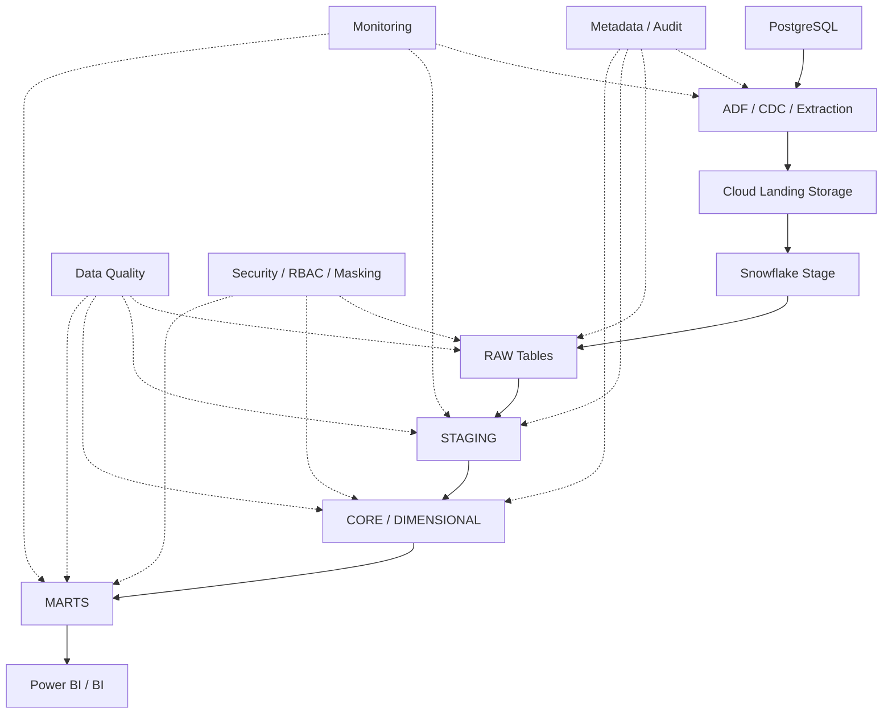

# Snowflake — Top 35 Senior/Product Company Interview Questions & Answers

> **Target:** Senior / Lead / Staff Data Engineer
> **Goal:** 70+ LPA product-based companies
> **Focus:** Snowflake architecture, virtual warehouses, micro-partitions, pruning, clustering, caching, COPY INTO, Snowpipe, Snowpipe Streaming, Streams, Tasks, Dynamic Tables, `MERGE`, Time Travel, Fail-safe, zero-copy cloning, transient/temporary tables, semi-structured data, `VARIANT`, `FLATTEN`, RBAC, masking, row access, data sharing, Snowpark, performance, cost optimization and production architecture.
>
> **Resume alignment:** Your resume includes PostgreSQL → Snowflake pipelines using Azure Data Factory, financial analytics/reporting, reconciliation, validation, and Snowflake warehouse/query optimization.

---

# 0. HOW TO THINK ABOUT SNOWFLAKE

Don't memorize Snowflake as a collection of commands.

Think:

```text
                    SNOWFLAKE

        ┌────────────────────────────┐
        │       CLOUD SERVICES       │
        │ Auth / Metadata / Optimizer│
        └─────────────┬──────────────┘
                      │
        ┌─────────────▼──────────────┐
        │          COMPUTE           │
        │     Virtual Warehouses     │
        └─────────────┬──────────────┘
                      │
        ┌─────────────▼──────────────┐
        │           STORAGE          │
        │ Micro-partitions / Tables  │
        └────────────────────────────┘
```

Snowflake's current architecture has three major layers: **database storage, compute and cloud services**. Storage and compute are separated, and virtual warehouses are independent compute clusters.

The senior-level questions are therefore:

```text
Where is data stored?
        ↓
How is it physically organized?
        ↓
How is data scanned?
        ↓
Where does compute run?
        ↓
How does Snowflake scale?
        ↓
How do I make it incremental?
        ↓
How do I secure it?
        ↓
How do I control cost?
```

---

# 1. What is Snowflake? Explain its architecture.

## Core Answer

Snowflake is a cloud-native data platform with separate:

* Storage.
* Compute.
* Cloud-services layers.

### Storage

Snowflake stores table data in an optimized, compressed, columnar representation in cloud storage.

### Compute

Virtual warehouses execute:

* SQL.
* Data transformations.
* Snowpark workloads.

### Cloud Services

Handles capabilities such as:

* Authentication.
* Authorization.
* Metadata.
* Query parsing.
* Query optimization.
* Infrastructure coordination.

Snowflake's architecture documentation explicitly describes these three layers and the separation of storage and compute.

## Architecture



## Why is storage-compute separation important?

Suppose:

```text
ETL workload → heavy compute
BI workload  → interactive queries
```

They can use separate warehouses.

```text
ETL Warehouse
      ↓
Shared Storage
      ↑
BI Warehouse
```

Increasing ETL compute does not have to consume the BI warehouse's compute resources.

## Senior answer

> "The important Snowflake architectural idea is that storage and compute are independently scalable resources. Multiple virtual warehouses can access the same persisted data without sharing their compute resources."

---

# 2. What is a Virtual Warehouse?

## Core Answer

A virtual warehouse is a Snowflake compute cluster used to execute workloads.

Examples:

```text
TRANSFORM_WH
BI_WH
REPORTING_WH
DATA_SCIENCE_WH
```

Each warehouse is an independent compute cluster.

## Why multiple warehouses?

```text
                    STORAGE
                       │
       ┌───────────────┼───────────────┐
       ↓               ↓               ↓
    ETL WH           BI WH          DS WH
       ↓               ↓               ↓
   ETL queries      Dashboards      ML work
```

Advantages:

* Workload isolation.
* Independent sizing.
* Independent concurrency management.
* Reduced noisy-neighbor effects.

## Senior answer

> "I usually separate warehouses by workload characteristics rather than putting ETL, dashboards and ad hoc analytics on one warehouse."

---

# 3. How does resizing a Snowflake warehouse help?

Suppose:

```text
Warehouse = SMALL
Query = 20 minutes
```

Increase:

```text
SMALL → MEDIUM → LARGE
```

You provide more compute resources to the workload.

Snowflake credits are primarily influenced by warehouse size and runtime.

## But don't say:

> "Larger warehouse always means proportionally faster query."

Because performance also depends on:

* Query plan.
* Data volume.
* Join strategy.
* Data layout.
* Skew.
* Concurrency.
* Query shape.
* Cache.

## Senior troubleshooting order

```text
Slow query
   ↓
Query Profile
   ↓
Is it scanning too much?
   ↓
Is join expensive?
   ↓
Is pruning poor?
   ↓
Is queueing happening?
   ↓
Only then consider scaling compute
```

---

# 4. Explain multi-cluster warehouses.

## Core Answer

A multi-cluster warehouse allows Snowflake to use multiple compute clusters to handle concurrency.

Conceptually:

```text
                 BI_WAREHOUSE
                      │
          ┌───────────┴───────────┐
          ↓                       ↓
      Cluster 1               Cluster 2
          ↓                       ↓
      Queries                 Queries
```

Useful when:

* Many concurrent users.
* Dashboard workload.
* Peak/off-peak concurrency varies.
* Queries are waiting for compute.

Snowflake documents multi-cluster warehouses as a mechanism for scaling compute to meet changing concurrency demands.

## Important distinction

### Scale up

```text
MEDIUM → LARGE
```

More resources per cluster.

### Scale out

```text
1 cluster → 2+ clusters
```

More concurrent query capacity.

## Interview answer

> "Scale-up primarily addresses the resource requirements of individual workloads; multi-cluster scale-out primarily addresses concurrency."

---

# 5. What are auto-suspend and auto-resume?

## Auto-suspend

Automatically stops a warehouse after a configured period of inactivity.

Example:

```sql
ALTER WAREHOUSE ETL_WH
SET AUTO_SUSPEND = 300;
```

## Auto-resume

Automatically starts it when a query arrives.

```sql
ALTER WAREHOUSE ETL_WH
SET AUTO_RESUME = TRUE;
```

Snowflake recommends choosing the setting based on workload gaps; because warehouse usage is billed in small time increments, a low auto-suspend period can reduce idle consumption, but excessively short settings can cause repeated suspend/resume cycles.

## Decision

### Intermittent ETL

```text
auto-suspend → useful
auto-resume  → useful
```

### Constant workload

Keeping the warehouse running may be reasonable.

## Senior answer

> "I don't use a universal five-minute setting. I look at workload gaps, startup behavior and cost."

---

# 6. Explain Snowflake micro-partitions.

## Core Answer

Snowflake automatically organizes table data into micro-partitions.

You don't normally define these physical storage units manually.

Snowflake stores data in optimized columnar form within micro-partitions and maintains metadata used for pruning and other optimizations.

## Concept

```text
Logical Table

Rows / Columns
      ↓
Snowflake Storage Layer
      ↓
┌──────────┐
│ Micro P1 │
├──────────┤
│ Micro P2 │
├──────────┤
│ Micro P3 │
├──────────┤
│ Micro P4 │
└──────────┘
```

## Why important?

Snowflake can use micro-partition metadata to determine:

> "Which partitions could possibly contain the requested data?"

and skip others.

---

# 7. What is micro-partition pruning?

## Core Answer

Suppose a table contains:

```text
2024
2025
2026
```

and a query asks:

```sql
SELECT *
FROM sales
WHERE order_date >= '2026-01-01';
```

If Snowflake's metadata shows certain micro-partitions only contain earlier dates, those partitions can be skipped.

## Concept

```text
1000 micro-partitions
       ↓
Predicate
       ↓
Only 70 relevant
       ↓
Scan 70
Skip 930
```

## Why valuable?

Less:

* I/O.
* Compute.
* Data scanning.

Snowflake's micro-partition architecture is designed so metadata about partitioned data can support pruning.

## Senior answer

> "My first performance question for a very large Snowflake table is often not 'How do I add compute?' but 'How much data is Snowflake actually scanning?'"

---

# 8. What causes poor micro-partition pruning?

## Common causes

### 1. Poorly correlated data

Rows matching common filters are scattered across many micro-partitions.

### 2. Functions around filter expressions

For example:

```sql
WHERE DATE(order_timestamp) = '2026-10-03'
```

can be less pruning-friendly than an appropriate range predicate depending on the physical layout.

### 3. Predicates that don't align with data organization.

### 4. Random ingestion patterns.

### 5. Columns with weak clustering/correlation for the workload.

## Better predicate

```sql
WHERE order_timestamp >= '2026-10-03 00:00:00'
  AND order_timestamp <  '2026-10-04 00:00:00'
```

## Senior point

Query semantics and physical data organization should work together.

---

# 9. What is clustering in Snowflake?

## Core Answer

Clustering describes how well related rows are organized across micro-partitions.

For very large tables, explicit clustering keys can help align physical organization with important filter patterns.

Snowflake documents clustering keys as primarily relevant to large tables where improved pruning can justify the maintenance cost.

## Example

Suppose queries frequently use:

```sql
WHERE customer_id = ?
```

or:

```sql
WHERE order_date BETWEEN ...
```

Clustering can potentially improve micro-partition pruning for those access patterns.

## Important

Don't create a clustering key on every table.

Why?

* Maintenance cost.
* Additional compute.
* Poorly chosen keys may not help.
* Smaller tables may not need them.

## Senior answer

> "Clustering is a workload-driven optimization, not a mandatory table-design step."

---

# 10. How would you choose a Snowflake clustering key?

## Core Answer

Look at:

```text
1. Query predicates
2. Table size
3. Data distribution
4. Cardinality
5. Query frequency
6. Expected pruning benefit
7. Reclustering/maintenance cost
```

Example:

```text
Huge FACT_SALES table

Common queries:
WHERE order_date ...
WHERE region ...
WHERE customer_id ...
```

I'd benchmark candidate keys.

## Don't assume

```text
customer_id
```

is automatically better because it is selective.

Very high-cardinality or frequently changing access patterns can have maintenance implications.

## Senior approach

```text
Candidate key
   ↓
Measure clustering/pruning
   ↓
Measure query improvement
   ↓
Measure maintenance cost
   ↓
Choose
```

---

# 11. Explain Snowflake caching.

There are multiple caching concepts you should distinguish.

## 1. Persisted query results

Snowflake can return previously computed results when the same query can safely reuse them.

Snowflake documents persisted query results as cached for up to 24 hours, subject to the conditions for result reuse.

## 2. Warehouse data cache

A running warehouse can cache table data it has read.

Repeated queries may benefit from data being available in the warehouse cache.

## Mental model

```text
Query
  ↓
Can persisted result be reused?
  ↓
YES → return result

NO
 ↓
Execute query
 ↓
Can warehouse cache help?
 ↓
Read cached data where possible
```

## Important

Do not confuse:

```text
query result cache
```

with:

```text
warehouse local data cache
```

They solve different problems.

---

# 12. Why might the same query become slower after warehouse suspension?

## Core Answer

One reason is cache loss.

A warehouse can have data cached while running. When the warehouse is suspended, that cache isn't available in the same active state when it resumes.

Snowflake documents warehouse data caching as a performance optimization associated with running warehouses.

## Important

Result-cache reuse may still work independently when its conditions are satisfied.

Therefore:

```text
Warehouse suspended
≠
All Snowflake caching disappears in exactly the same way
```

You need to distinguish the cache involved.

---

# 13. Explain Search Optimization Service.

## Core Answer

Search Optimization Service maintains an additional access path that can improve certain selective lookup/analytical queries.

Snowflake describes it as creating and maintaining a persistent search access path that helps identify micro-partitions containing relevant values.

## Good use case

Very selective lookup:

```sql
SELECT *
FROM customers
WHERE customer_id = 'C123456789';
```

on a huge table.

## Architecture

```text
Huge Table
   ↓
Micro-partitions
   ↓
Search Access Path
   ↓
Identify relevant partitions
   ↓
Scan fewer partitions
```

## Trade-off

It requires background maintenance.

Therefore:

```text
Faster selective query
+
Additional maintenance/storage
```

## Senior answer

> "I would evaluate search optimization for highly selective access patterns after understanding normal micro-partition pruning and clustering."

---

# 14. Explain `COPY INTO`.

## Core Answer

`COPY INTO` loads staged files into Snowflake tables.

```text
Cloud Storage
      ↓
Stage
      ↓
COPY INTO
      ↓
Snowflake Table
```

Snowflake supports loading from internal stages and cloud storage such as Amazon S3, Azure storage and Google Cloud Storage.

## Example

```sql
COPY INTO sales
FROM @sales_stage
FILE_FORMAT = (
    TYPE = CSV
    FIELD_OPTIONALLY_ENCLOSED_BY = '"'
    SKIP_HEADER = 1
);
```

## Common controls

* File format.
* Pattern.
* Files.
* Error handling.
* Validation.
* Transformations.
* Purge.

Snowflake supports selecting staged files by path/prefix, explicit files and patterns.

---

# 15. How do you load JSON into Snowflake?

## Core Answer

Use semi-structured support.

A common pattern is:

```sql
CREATE TABLE raw_events (
    payload VARIANT
);
```

Then:

```sql
COPY INTO raw_events
FROM @events_stage
FILE_FORMAT = (
    TYPE = JSON
);
```

## Query

```sql
SELECT
    payload:customer_id::STRING AS customer_id,
    payload:amount::NUMBER AS amount
FROM raw_events;
```

## Why `VARIANT`?

It allows semi-structured data to be stored without forcing the entire structure into a rigid relational schema immediately.

Snowflake supports JSON, Avro, ORC and Parquet among its semi-structured load formats.

---

# 16. What is `VARIANT`? How would you query nested JSON?

## Core Answer

`VARIANT` is a Snowflake type designed for semi-structured data.

Example:

```json
{
  "customer": {
    "id": "C101",
    "name": "Krishna"
  },
  "orders": [
    {"id": 1, "amount": 100},
    {"id": 2, "amount": 200}
  ]
}
```

Query nested field:

```sql
SELECT
    payload:customer.id::STRING AS customer_id,
    payload:customer.name::STRING AS customer_name
FROM events;
```

## Array handling

Use `FLATTEN`.

```sql
SELECT
    payload:customer.id::STRING AS customer_id,
    f.value:id::NUMBER AS order_id,
    f.value:amount::NUMBER AS amount
FROM events,
LATERAL FLATTEN(
    INPUT => payload:orders
) f;
```

## Mental model

```text
VARIANT
  ↓
Path extraction
  ↓
Nested object

VARIANT
  ↓
FLATTEN
  ↓
Array elements
```

---

# 17. What is `FLATTEN` in Snowflake?

## Core Answer

`FLATTEN` converts nested arrays/objects into rows.

Input:

```json
{
  "orders": [
    {"id": 1},
    {"id": 2},
    {"id": 3}
  ]
}
```

Output concept:

```text
id
1
2
3
```

Example:

```sql
SELECT
    f.value:id::NUMBER AS order_id
FROM raw_events,
LATERAL FLATTEN(
    INPUT => payload:orders
) f;
```

## Senior considerations

Repeated flattening can:

* Increase row count dramatically.
* Increase compute.
* Create accidental many-to-many effects.

Always understand the resulting grain.

---

# 18. Explain Snowpipe.

## Core Answer

Snowpipe provides continuous or near-real-time file ingestion by loading files as they become available in a stage, typically through micro-batches.

Snowflake describes Snowpipe as loading staged files as they arrive, generally making data available within minutes rather than waiting for scheduled large batches.

## Architecture

```text
Cloud Storage
    ↓
New File
    ↓
Event Notification
    ↓
Snowpipe
    ↓
COPY logic
    ↓
Snowflake Table
```

## When to use?

* Continuous file arrivals.
* Low-latency file ingestion.
* Event-driven loading.

## Difference from scheduled `COPY INTO`

```text
COPY INTO
→ explicitly run load

Snowpipe
→ continuously ingest arriving files
```

---

# 19. Snowpipe vs Snowpipe Streaming.

## Snowpipe

Input:

```text
Files
```

Pattern:

```text
File → Stage → Snowpipe → Table
```

## Snowpipe Streaming

Designed to ingest rows/events directly without first staging files in the traditional way.

Conceptually:

```text
Application / Kafka
       ↓
Snowpipe Streaming
       ↓
Snowflake
```

Snowflake's current Snowpipe Streaming documentation supports offset-based exactly-once delivery mechanisms for channels.

## When would I choose?

### File-based ecosystem

```text
Snowpipe
```

### Event/row-oriented streaming

```text
Snowpipe Streaming
```

## Senior answer

> "The distinction starts with the ingestion unit: Snowpipe is file-oriented; Snowpipe Streaming is designed for direct row/event ingestion."

---

# 20. What are Streams in Snowflake?

## Core Answer

A Snowflake Stream captures changes to a source object.

Changes can include:

```text
INSERT
UPDATE
DELETE
```

Snowflake describes streams as change tables that expose row-level changes between transactional points for CDC processing.

## Architecture

```text
Source Table
     ↓
   Stream
     ↓
Changed Rows
     ↓
Transformation
     ↓
Target
```

## Example

```sql
CREATE STREAM customer_stream
ON TABLE customers;
```

Then:

```sql
SELECT *
FROM customer_stream;
```

## Metadata

Streams expose change metadata such as:

```text
METADATA$ACTION
METADATA$ISUPDATE
METADATA$ROW_ID
```

The exact available metadata depends on stream type.

---

# 21. How do Streams + Tasks implement CDC?

## Core Answer

Classic Snowflake CDC pattern:

```text
Source Table
     ↓
   Stream
     ↓
   Task
     ↓
  MERGE
     ↓
Target Table
```

## Example

```sql
CREATE STREAM customer_stream
ON TABLE customers;
```

Task:

```sql
CREATE TASK process_customer_changes
WAREHOUSE = ETL_WH
WHEN SYSTEM$STREAM_HAS_DATA('customer_stream')
AS
MERGE INTO customer_dim t
USING customer_stream s
ON t.customer_id = s.customer_id
WHEN MATCHED THEN
    UPDATE SET ...
WHEN NOT MATCHED THEN
    INSERT (...);
```

Triggered tasks can execute when a stream contains changes, avoiding unnecessary polling when no new data has arrived.

## Senior point

The pattern is powerful because:

```text
Stream
→ captures change

Task
→ schedules/orchestrates work

MERGE
→ applies change
```

Each solves a different problem.

---

# 22. What are Tasks and Task Graphs?

## Core Answer

Tasks automate SQL or stored-procedure execution.

They can be:

* Scheduled.
* Triggered.
* Chained.
* Run in parallel where dependency structure allows.

Snowflake currently supports task graphs for complex workflows with tasks executing sequentially or in parallel.

## Example



## Task types

### Scheduled

```sql
SCHEDULE = 'USING CRON ...'
```

### Triggered

```sql
WHEN SYSTEM$STREAM_HAS_DATA(...)
```

### Child tasks

```text
ROOT
 ├── A
 ├── B
 └── C
```

---

# 23. Dynamic Tables vs Streams + Tasks.

> **Extremely important for current Snowflake interviews.**

## Streams + Tasks

Imperative:

```text
Read changes
 ↓
Run MERGE
 ↓
Run next task
 ↓
Run procedure
```

You explicitly define operational logic.

## Dynamic Tables

Declarative:

```sql
CREATE DYNAMIC TABLE customer_summary
TARGET_LAG = '10 minutes'
AS
SELECT ...
```

You define:

> "What result should exist?"

Snowflake maintains it.

Snowflake's current documentation explicitly describes dynamic tables as a declarative replacement for imperative streams/tasks pipelines in many use cases.

## Comparison

|                          | Streams + Tasks | Dynamic Tables                           |
| ------------------------ | --------------- | ---------------------------------------- |
| Style                    | Imperative      | Declarative                              |
| CDC/change tracking      | Explicit stream | Built into pipeline semantics            |
| Orchestration            | Explicit tasks  | Refresh managed by Snowflake             |
| Complex procedural logic | ✅               | More limited                             |
| Simple derived datasets  | Possible        | ✅                                        |
| External side effects    | ✅               | Use streams/tasks around DT where needed |

## Senior answer

> "I would choose dynamic tables when the problem is naturally declarative data transformation and freshness management. I would keep streams/tasks for workflows that require procedural logic, side effects, conditional behavior or targets that dynamic tables cannot directly handle."

---

# 24. What is `TARGET_LAG` in a Dynamic Table?

## Core Answer

`TARGET_LAG` is a **freshness/staleness target**, not a fixed refresh interval.

Example:

```sql
TARGET_LAG = '10 minutes'
```

means Snowflake tries to keep the derived data within that freshness target.

Snowflake explicitly states that target lag is best-effort and actual lag can exceed it based on workload, refresh duration, compute capacity and pipeline depth.

## Important distinction

Don't say:

> "The table refreshes every 10 minutes."

Better:

> "Snowflake uses the 10-minute target to schedule refreshes so that it attempts to maintain freshness within that target."

## `DOWNSTREAM`

A dynamic table can also use:

```sql
TARGET_LAG = DOWNSTREAM
```

meaning its refresh is driven by downstream dynamic-table needs.

## Senior follow-up

### Why does this matter for cost?

A target lag that is unnecessarily aggressive can cause more frequent refreshes and higher compute use. Snowflake's current guidance explicitly recommends setting freshness goals based on actual business requirements rather than arbitrarily choosing very short lags.

---

# 25. Explain Dynamic Table refresh modes.

Current Snowflake documentation describes several refresh modes:

```text
AUTO
INCREMENTAL
FULL
ADAPTIVE
CUSTOM_INCREMENTAL
```

Snowflake currently recommends explicit refresh-mode choices for predictable production behavior, and its documentation describes `ADAPTIVE` as using incremental refresh by default while reinitializing when a full rebuild becomes materially cheaper.

## Incremental

Processes changes rather than rebuilding everything.

Good when:

```text
Small changes
+
Large table
```

## Full

Rebuilds the result.

May be appropriate when:

```text
Small dataset
or
Incrementalization is inefficient
```

## Adaptive

Can use incremental processing and reinitialize when a rebuild becomes more economical.

## Senior answer

> "The refresh mode should be chosen based on data-change volume and query complexity. Incremental isn't automatically cheaper if the changed region is large."

---

# 26. Explain `MERGE` in Snowflake.

## Core Answer

`MERGE` combines conditional:

* INSERT.
* UPDATE.
* DELETE.

logic.

Example:

```sql
MERGE INTO target t
USING source s
ON t.customer_id = s.customer_id

WHEN MATCHED THEN
    UPDATE SET
        t.name = s.name,
        t.city = s.city

WHEN NOT MATCHED THEN
    INSERT (
        customer_id,
        name,
        city
    )
    VALUES (
        s.customer_id,
        s.name,
        s.city
    );
```

## Typical uses

* CDC.
* Upserts.
* SCD Type 1.
* SCD Type 2 patterns.
* Incremental pipelines.

## Critical interview question

> "What happens if the source contains multiple matching rows for one target row?"

Your first answer should be:

> "I would ensure source uniqueness on the merge key before executing the merge, because ambiguous multiple matches can produce incorrect or failing behavior depending on the merge conditions."

## Production pattern

```text
Raw CDC
  ↓
Deduplicate
  ↓
Validate keys
  ↓
MERGE
```

---

# 27. Explain Time Travel vs Fail-safe.

## Time Travel

Used to access historical data/table states within the configured retention period.

Uses include:

* Query historical data.
* Restore.
* Clone.
* Investigate accidental changes.

Snowflake documents Time Travel retention as configurable within supported edition limits.

## Fail-safe

A separate disaster-recovery mechanism after the Time Travel period.

Snowflake documents a standard **7-day Fail-safe period for permanent tables**, while temporary and transient tables have no Fail-safe period.

## Mental model

```text
Current Data
     ↓
Time Travel
     ↓
Historical / restore capability
     ↓
Fail-safe
     ↓
Snowflake disaster recovery
```

## Critical distinction

Fail-safe is not:

```text
"User-accessible backup."
```

## Senior answer

> "Time Travel is an operational historical-data feature; Fail-safe is a separate disaster-recovery mechanism. I wouldn't design normal recovery procedures around Fail-safe."

---

# 28. Permanent vs Transient vs Temporary tables.

## Permanent

* Persistent.
* Time Travel.
* Fail-safe.

## Transient

* Persistent until dropped.
* Time Travel available within supported limits.
* No Fail-safe.

## Temporary

* Exists only for the session.
* Not visible after session ends.
* No Fail-safe.

Snowflake's current comparison documents these differences explicitly.

## Decision

```text
Business-critical permanent data
→ Permanent

Rebuildable intermediate data
→ Transient

Session-only temporary processing
→ Temporary
```

## Cost reasoning

Transient tables can reduce storage-related recovery overhead because they do not enter Fail-safe, but the data isn't recoverable after the Time Travel period expires.

---

# 29. What is zero-copy cloning?

## Core Answer

Zero-copy cloning creates a new logical object that initially shares underlying micro-partitions with the source.

Conceptually:

```text
Original Table
     │
     ├──────────┐
     ↓          ↓
   Clone A    Clone B
     │
shared data
```

No full physical copy is required initially.

When data diverges:

```text
Original ── shared micro-partitions
Clone
   ↓
New changes
   ↓
New micro-partitions
```

Snowflake documents zero-copy cloning using shared micro-partitions, with new micro-partitions created as cloned data is modified.

## Use cases

* Dev/test environments.
* Experimentation.
* Data recovery.
* Safe transformation testing.

## Senior point

> "Zero-copy doesn't mean the cloned environment is free forever. Once it diverges, additional storage is created."

---

# 30. How would you clone production data for testing safely?

## Core Answer

I would consider:

```text
Production
   ↓
Zero-copy clone
   ↓
Test environment
```

But cloning alone doesn't solve security.

If production contains:

```text
PII
salary
financial information
```

the test copy may still expose it.

## Therefore:

```text
Clone
 ↓
Mask/tokenize sensitive fields where required
 ↓
Apply roles
 ↓
Restrict access
 ↓
Test
```

## Senior answer

> "Zero-copy cloning solves physical-copy efficiency, not data-governance requirements."

---

# 31. Explain Snowflake RBAC.

## Core Answer

Snowflake uses role-based access control as a major part of its authorization model.

Conceptually:

```text
User
 ↓
Role
 ↓
Privileges
 ↓
Database
 ↓
Schema
 ↓
Table / View
```

Example:

```sql
GRANT USAGE
ON DATABASE ANALYTICS
TO ROLE DATA_ANALYST;

GRANT USAGE
ON SCHEMA ANALYTICS.MART
TO ROLE DATA_ANALYST;

GRANT SELECT
ON TABLE ANALYTICS.MART.SALES
TO ROLE DATA_ANALYST;
```

Snowflake's access-control framework combines DAC, RBAC and user-level privileges, with RBAC usually forming the primary operational model. Roles can inherit privileges through role hierarchies.

## Senior design

Prefer role hierarchy:

```text
REPORTING_ROLE
      ↑
DATA_ANALYST
      ↑
POWER_USER
```

rather than granting permissions directly to individual users wherever possible.

---

# 32. How do masking policies and row access policies work?

## Column masking

Determines what value a user sees.

Example:

```text
SSN
123456789
```

Unprivileged user:

```text
XXXXXX789
```

Snowflake's Dynamic Data Masking applies policies at query time rather than physically changing the underlying stored value.

## Row access

Determines which rows are visible.

Example:

```text
employee
--------
US
IN
AU
```

An India analyst may receive:

```text
IN
```

only, depending on the policy.

## Architecture

```text
User
 ↓
SQL Query
 ↓
Authorization
 ↓
Row Policy
 ↓
Column Mask
 ↓
Result
```

## Senior point

Security policies should be centrally governed and tested.

---

# 33. Explain Secure Data Sharing in Snowflake.

## Core Answer

Snowflake can share data without the traditional pattern of:

```text
Export
 ↓
CSV
 ↓
Transfer
 ↓
Consumer load
```

Instead:

```text
Provider
   ↓
Share
   ↓
Consumer
```

Snowflake describes secure sharing as a way to share governed data assets with other Snowflake consumers without traditional copying/ETL duplication.

## Why useful?

* Avoid unnecessary copies.
* Reduce ETL.
* Keep provider-controlled data.
* Share live data.
* Simplify partner analytics.

## Secure views

For sensitive shared data, Snowflake strongly recommends secure views/UDFs rather than directly exposing underlying tables in applicable sharing scenarios.

---

# 34. What is Snowpark? When would you use Snowpark Python?

## Core Answer

Snowpark lets developers use:

* Python.
* Java.
* Scala.

to work with data directly in Snowflake's execution environment.

Snowflake's current documentation describes Snowpark DataFrames as allowing transformations to run directly on Snowflake's engine without moving the data back to the client application.

## Example

```python
from snowflake.snowpark import Session
from snowflake.snowpark.functions import col

df = session.table("CUSTOMERS")

result = (
    df
    .filter(col("COUNTRY") == "IN")
    .select("CUSTOMER_ID", "NAME")
)
```

## Why Snowpark?

Useful when:

* Transformation logic is easier in Python.
* You need custom functions.
* You want Python close to the data.
* You need Snowflake-native procedural/data-processing logic.

## Snowpark vs external Pandas

External Pandas:

```text
Snowflake
 ↓
Move data
 ↓
Python
 ↓
Process
```

Snowpark:

```text
Python logic
 ↓
Snowflake execution
 ↓
Data stays closer to Snowflake
```

## Senior answer

> "The value of Snowpark is not simply 'Python instead of SQL'; it lets me express procedural or DataFrame-oriented logic while keeping execution close to the data."

---

# 35. Design a production-grade PostgreSQL → Snowflake Data Platform.

> **THIS IS THE MOST IMPORTANT SNOWFLAKE QUESTION FOR YOU.**

Your resume explicitly describes PostgreSQL-to-Snowflake pipelines using Azure Data Factory for financial reporting/analytics, together with reconciliation, validation and Snowflake performance optimization.

---

# Requirement Clarification

Ask:

```text
1. Full load or incremental?
2. Source table size?
3. Change rate?
4. Updates?
5. Deletes?
6. Required latency?
7. Historical retention?
8. PII?
9. Reporting SLA?
10. RPO/RTO?
```

---

# Architecture



---

# Step 1 — Initial Load

For a new source:

```text
PostgreSQL
     ↓
Extract
     ↓
Landing
     ↓
Snowflake Stage
     ↓
COPY INTO
     ↓
RAW
```

Use bulk-oriented loading rather than one-row-at-a-time inserts.

Snowflake supports parallel loading patterns and file selection controls through `COPY INTO`.

---

# Step 2 — Incremental Loading

If PostgreSQL has:

```text
updated_at
```

use a watermark.

```text
last_successful_watermark
          ↓
PostgreSQL
          ↓
updated_at > watermark
          ↓
Landing
          ↓
Snowflake
```

For reliable changes including updates/deletes, evaluate CDC instead of relying solely on timestamps.

---

# Step 3 — Raw Layer

Keep:

```text
source_system
source_table
load_timestamp
batch_id
source_operation
source_updated_at
```

This supports:

* Audit.
* Replay.
* Reconciliation.
* Debugging.

---

# Step 4 — Deduplication

Suppose:

```text
customer_id = 101
```

arrives three times.

Use:

```sql
ROW_NUMBER() OVER (
    PARTITION BY customer_id
    ORDER BY updated_at DESC, ingestion_id DESC
)
```

and retain the latest deterministic version.

---

# Step 5 — Merge

```text
Incoming changes
      ↓
Deduplicate
      ↓
Validate
      ↓
MERGE
      ↓
CORE
```

---

# Step 6 — Data Modeling

Typical:

```text
FACT_SALES

DIM_CUSTOMER
DIM_PRODUCT
DIM_DATE
DIM_STORE
```

Then:

```text
CORE
 ↓
MART
 ↓
BI
```

---

# Step 7 — Reconciliation

Your answer should include this because it is one of your strongest resume areas.

Validate:

```text
Source count
Target count

Source distinct keys
Target distinct keys

SUM(amount)
SUM(amount)

MIN(date)
MIN(date)

MAX(date)
MAX(date)
```

Then:

```text
Source-only keys
Target-only keys
Changed records
```

Your resume specifically describes automated reconciliation, validation and quality controls for the PostgreSQL → Snowflake financial-data platform.

---

# Step 8 — Performance

For very large tables:

```text
Query
 ↓
Check Query Profile
 ↓
Bytes scanned
 ↓
Partition pruning
 ↓
Join behavior
 ↓
Warehouse utilization
 ↓
Clustering if justified
 ↓
Search optimization if justified
```

Snowflake provides warehouse-load and query-monitoring information, while Search Optimization and clustering can target specific workload patterns.

---

# Step 9 — Cost Optimization

Use:

```text
Auto Suspend
Auto Resume
Separate Warehouses
Right Size
Multi-cluster only when concurrency needs it
Resource Monitors
Efficient SQL
Incremental Processing
```

Snowflake resource monitors can track credit consumption for warehouses and trigger notifications or suspension actions at configured thresholds. They do not control all serverless/AI usage.

---

# Step 10 — Security

Use:

```text
RBAC
+
Least Privilege
+
Masking
+
Row Access
+
Secure Views
+
Audit
```

Snowflake's current access-control model supports role inheritance, fine-grained privileges and policy-based column protection.

---

# Step 11 — Orchestration

Possible pattern:

```text
ADF
 ↓
Extract PostgreSQL
 ↓
Land files
 ↓
Snowflake load
 ↓
Data Quality
 ↓
MERGE
 ↓
Reconciliation
 ↓
Publish
```

or, for transformations native to Snowflake:

```text
Snowflake
 ↓
Streams / Tasks
or
Dynamic Tables
```

---

# Step 12 — Failure Handling

Suppose:

```text
Load succeeded
MERGE failed
```

Do not advance the watermark prematurely.

Use:

```text
Source extraction
       ↓
Target load
       ↓
Validation
       ↓
MERGE
       ↓
Success
       ↓
Advance watermark
```

---

# Step 13 — Idempotency

The same batch should not produce duplicate business records when replayed.

Use:

* Deterministic keys.
* Load IDs.
* `MERGE`.
* Duplicate detection.
* Batch metadata.

---

# FINAL 90-SECOND SNOWFLAKE ANSWER

> "For a PostgreSQL-to-Snowflake platform, I would first clarify the source volume, change rate, latency, update/delete behavior, retention and compliance requirements. I would use ADF or a CDC mechanism to extract changes into cloud storage or an appropriate ingestion path, then bulk-load the raw data into Snowflake rather than performing row-level inserts. I would preserve source and ingestion metadata for auditability and replay. For incremental processing, I would use a reliable watermark or CDC position and advance it only after downstream processing succeeds. I would deduplicate the incoming change set and use MERGE to apply updates and inserts to the core tables. For analytical serving, I would build governed dimensional or business-mart tables. I would implement source-to-target reconciliation using counts, distinct keys, aggregates and detailed mismatch checks. For performance, I would first inspect the Query Profile and data scanned, then address pruning, joins, clustering or search optimization where justified before simply increasing warehouse size. I would isolate ETL and BI workloads with separate warehouses, configure auto-suspend where appropriate, and use resource monitors for credit governance. Security would use RBAC, least privilege, masking and row-level controls where required. Finally, I would orchestrate the workflow through ADF or Snowflake Tasks/Dynamic Tables depending on whether the transformation pattern is imperative or declarative."

---

# SNOWFLAKE vs TRADITIONAL DATA WAREHOUSE

Know this comparison.

| Concept              | Traditional warehouse              | Snowflake                           |
| -------------------- | ---------------------------------- | ----------------------------------- |
| Compute/storage      | Often tightly coupled              | Separated                           |
| Scaling              | Often infrastructure-heavy         | Virtual warehouse scaling           |
| Concurrency          | Often requires workload management | Separate warehouses / multi-cluster |
| Storage layout       | Database-managed                   | Micro-partition architecture        |
| Semi-structured data | Often additional tooling           | Native support                      |
| Time Travel          | Product-dependent                  | Native                              |
| Zero-copy clone      | Product-dependent                  | Native                              |
| Data sharing         | Often ETL/export                   | Native sharing features             |
| Cloud operations     | More infrastructure management     | Managed service                     |

Snowflake's cloud-native architecture explicitly separates storage, compute and cloud services.

---

# SNOWFLAKE PERFORMANCE DECISION TREE

```text
                 QUERY SLOW
                      ↓
               Query Profile
                      ↓
       ┌──────────────┼──────────────┐
       ↓              ↓              ↓
   Data Scan        Queueing       Compute
       ↓              ↓              ↓
   Pruning?        Concurrency?    Warehouse?
   Clustering?     Multi-cluster?  Size?
   Search Opt?                     QAS?
       ↓
      Joins
       ↓
   Large join?
   Skew?
       ↓
    SQL shape
       ↓
  Unnecessary work?
       ↓
   Optimize
       ↓
    Measure
```

---

# 10 SNOWFLAKE PERFORMANCE LEVERS

## 1. Reduce data scanned

```text
Better predicates
+
Pruning
+
Good table organization
```

## 2. Reduce unnecessary columns

Avoid:

```sql
SELECT *
```

when you need three columns.

## 3. Optimize joins

Check:

* Cardinality.
* Join keys.
* Intermediate result sizes.

## 4. Separate workloads

```text
ETL_WH
BI_WH
ADHOC_WH
```

## 5. Scale appropriately

Scale up for compute-heavy work.

Scale out for concurrency-heavy work.

## 6. Clustering

Only where justified.

## 7. Search Optimization

For suitable selective queries.

## 8. Result cache

Understand whether the query qualifies for persisted-result reuse.

## 9. Warehouse cache

Take advantage of repeated access where appropriate.

## 10. Query Acceleration Service

Snowflake's Query Acceleration Service can offload portions of certain queries to serverless compute and is intended especially for workloads containing resource-heavy/outlier queries.

---

# SNOWFLAKE COST OPTIMIZATION CHEAT SHEET

```text
COST
│
├── Warehouse
│   ├── Right-size
│   ├── Auto Suspend
│   ├── Auto Resume
│   └── Multi-cluster only when needed
│
├── Query
│   ├── Scan less
│   ├── Prune better
│   ├── Avoid SELECT *
│   └── Optimize expensive joins
│
├── Storage
│   ├── Retention
│   ├── Transient tables where appropriate
│   └── Avoid unnecessary copies
│
├── Ingestion
│   ├── Batch efficiently
│   ├── Avoid tiny inefficient loads
│   └── Incremental processing
│
└── Governance
    ├── Resource Monitors
    ├── Query monitoring
    └── Cost attribution
```

Snowflake documents resource monitors as a mechanism to control warehouse credit consumption, but notes that serverless features and AI services require other cost-management mechanisms such as budgets.

---

# SNOWFLAKE INGESTION CHEAT SHEET

```text
BATCH FILE
   ↓
COPY INTO
```

```text
CONTINUOUS FILE
   ↓
SNOWPIPE
```

```text
DIRECT EVENT / ROW STREAM
   ↓
SNOWPIPE STREAMING
```

```text
DATABASE CHANGE
   ↓
CDC
   ↓
SNOWFLAKE
```

---

# SNOWFLAKE CDC CHEAT SHEET

```text
OPTION 1
Source CDC
    ↓
Snowflake
    ↓
MERGE
```

```text
OPTION 2
Snowflake Table
    ↓
STREAM
    ↓
TASK
    ↓
MERGE
```

```text
OPTION 3
Base Tables
    ↓
DYNAMIC TABLE
    ↓
Fresh derived result
```

Snowflake's current documentation explicitly positions dynamic tables as a declarative alternative to many imperative streams/tasks pipelines, while streams can also be placed on dynamic tables when downstream procedural processing is required.

---

# DYNAMIC TABLE INTERVIEW TRAPS

## Trap 1

> "`TARGET_LAG = 10 minutes` means the table runs every 10 minutes."

### Correct

> "It is a freshness target, not a fixed refresh interval."

---

## Trap 2

> "Incremental refresh is always cheaper."

### Correct

> "Incremental refresh is advantageous when change volumes and supported query patterns make incremental computation cheaper than rebuilding."

Snowflake's current adaptive-refresh guidance explicitly accounts for cases where a full reinitialization can become cheaper.

---

# TIME TRAVEL / FAIL-SAFE CHEAT SHEET

```text
CURRENT TABLE
     ↓
TIME TRAVEL
     ↓
User-accessible historical recovery
     ↓
FAIL-SAFE
     ↓
Snowflake disaster-recovery mechanism
```

Remember:

```text
TIME TRAVEL ≠ FAIL-SAFE
```

---

# SNOWFLAKE SECURITY CHEAT SHEET

```text
                   SECURITY
                       │
          ┌────────────┼────────────┐
          ↓            ↓            ↓
         RBAC       ROW ACCESS    MASKING
          ↓            ↓            ↓
      Object ACL     Rows          Columns
          │            │            │
          └────────────┼────────────┘
                       ↓
                  Secure Views
                       ↓
                    Sharing
```

Snowflake's current security documentation supports role hierarchy, masking policies, row-level policies and secure objects for controlled access and data sharing.

---

# 20 SNOWFLAKE COMMANDS YOU SHOULD KNOW COLD

```sql
CREATE DATABASE
CREATE SCHEMA
CREATE TABLE
CREATE VIEW
CREATE SECURE VIEW

CREATE STAGE
CREATE FILE FORMAT

COPY INTO
LIST
REMOVE
VALIDATE

CREATE PIPE

CREATE STREAM
CREATE TASK

CREATE DYNAMIC TABLE

MERGE INTO

CLONE

UNDROP

SELECT ... AT (...)
SELECT ... BEFORE (...)

DESCRIBE
SHOW

GRANT
REVOKE

ALTER WAREHOUSE
```

---

# 15 SNOWFLAKE SQL PATTERNS YOU SHOULD PRACTICE

```text
1. Latest record per business key
2. Deduplication
3. MERGE/upsert
4. SCD Type 1
5. SCD Type 2
6. Stream-based CDC
7. Task orchestration
8. Dynamic Table
9. JSON extraction
10. FLATTEN
11. Source-target reconciliation
12. Row-level masking
13. Row access filtering
14. Secure view
15. Zero-copy clone for testing
```

---

# 15 SCENARIO QUESTIONS TO PRACTICE

These are especially important for your target interviews.

```text
1. A 20 TB Snowflake query is slow. How do you troubleshoot?

2. Your warehouse cost doubled this month. What do you investigate?

3. BI dashboards are slow during ETL windows. What architecture change would you make?

4. A PostgreSQL source changed its schema unexpectedly. What happens?

5. A CDC pipeline duplicated records. How do you fix it?

6. A MERGE suddenly processes 10× more rows. What do you investigate?

7. Snowpipe is receiving thousands of tiny files. What would you change?

8. A Dynamic Table isn't meeting its target lag. How do you diagnose it?

9. A source stream has duplicate business keys. How do you process it?

10. An analyst needs access to customer data but not PII. How do you implement it?

11. A production table was accidentally updated. How do you recover it?

12. You need a safe copy of 50 TB for testing. What would you use?

13. A partner needs read-only access to selected data. How would you share it?

14. A dashboard performs highly selective point lookups over a huge table. What Snowflake optimization might you consider?

15. Your Snowflake transformation is easier to implement in Python than SQL. What architecture would you evaluate?
```

---

# YOUR RESUME → SNOWFLAKE STORY BANK

Your actual experience should be your primary evidence.

| Snowflake Interview Area | Your Experience             |
| ------------------------ | --------------------------- |
| PostgreSQL → Snowflake   | Glorifi Bank                |
| ADF ingestion            | Glorifi Bank                |
| Financial analytics      | Glorifi Bank                |
| ETL/ELT                  | Glorifi Bank                |
| Reconciliation           | Glorifi Bank                |
| Data-quality checks      | Glorifi Bank                |
| Snowflake optimization   | Glorifi Bank                |
| Auditable reporting      | Glorifi Bank                |
| Python validation        | Enterprise DQ Framework     |
| Schema governance        | Redshift governance project |

Your Snowflake project explicitly includes PostgreSQL, Power BI and Azure Data Factory, with automated reconciliation/validation and warehouse/query optimization for financial reporting.

---

# YOUR 60-SECOND "HOW MUCH SNOWFLAKE EXPERIENCE DO YOU HAVE?" ANSWER

> "I've worked with Snowflake in data-platform and financial-reporting workloads, including PostgreSQL-to-Snowflake pipelines using Azure Data Factory. My work has included ETL workflows, reconciliation, validation, data-quality controls and performance optimization. From an architecture perspective, I understand Snowflake's separation of storage and compute, virtual warehouses, micro-partitions, incremental ingestion, MERGE-based processing and Snowflake's native governance capabilities. My focus is not just loading data into Snowflake; it's making the platform reliable, auditable, performant and cost-aware."

This is consistent with the Snowflake project information in your supplied resume.

---

# THE 15 GOLDEN SNOWFLAKE STATEMENTS

### 1

> "Snowflake separates storage from compute, so I can isolate workloads using independent virtual warehouses."

### 2

> "I distinguish scaling up for compute from scaling out for concurrency."

### 3

> "For performance, I first ask how much data is actually being scanned."

### 4

> "Micro-partition pruning is one of the most important mechanisms for reducing unnecessary scans."

### 5

> "Clustering should be driven by query patterns and table scale, not applied blindly."

### 6

> "Search Optimization Service is particularly interesting for highly selective lookup workloads."

### 7

> "Result-cache reuse and warehouse data cache are different mechanisms."

### 8

> "`COPY INTO` is a bulk/file-loading mechanism; Snowpipe provides continuous file ingestion."

### 9

> "Streams capture row-level changes; Tasks orchestrate processing."

### 10

> "Dynamic Tables are a declarative alternative to many imperative Streams-and-Tasks transformations."

### 11

> "`TARGET_LAG` is a freshness target, not a fixed refresh interval."

### 12

> "Time Travel is for historical access and operational recovery; Fail-safe is a separate disaster-recovery mechanism."

### 13

> "Zero-copy cloning avoids an immediate full physical copy, but divergent writes create additional storage."

### 14

> "RBAC, masking and row access policies solve different layers of the security problem."

### 15

> "A good Snowflake architecture optimizes correctness, performance, concurrency, governance and cost together."

---

# FINAL SNOWFLAKE REVISION SHEET

```text
SNOWFLAKE ARCHITECTURE
├── Cloud Services
├── Compute
└── Storage

COMPUTE
├── Virtual Warehouse
├── Resize
├── Auto Suspend
├── Auto Resume
├── Multi-cluster
└── Query Acceleration

STORAGE
├── Micro-partitions
├── Metadata
├── Pruning
├── Clustering
└── Search Optimization

INGESTION
├── COPY INTO
├── Stages
├── Snowpipe
├── Snowpipe Streaming
└── CDC

PIPELINES
├── Streams
├── Tasks
├── Task Graphs
├── Dynamic Tables
└── MERGE

RECOVERY
├── Time Travel
├── Fail-safe
├── UNDROP
└── Zero-copy Clone

SEMI-STRUCTURED
├── VARIANT
├── OBJECT
├── ARRAY
├── JSON path
└── FLATTEN

SECURITY
├── RBAC
├── Roles
├── Grants
├── Masking Policies
├── Row Access Policies
└── Secure Views

DATA SHARING
├── Shares
├── Listings
├── Reader Accounts
└── Secure Objects

DEVELOPMENT
├── Snowpark Python
├── Snowpark Java
├── Snowpark Scala
└── UDF / Stored Procedures
```

---

# FINAL 35-QUESTION CHECKLIST

```text
□ 1. Snowflake architecture
□ 2. Virtual warehouses
□ 3. Warehouse resizing
□ 4. Multi-cluster warehouses
□ 5. Auto-suspend / auto-resume
□ 6. Micro-partitions
□ 7. Micro-partition pruning
□ 8. Poor pruning
□ 9. Clustering
□ 10. Choosing clustering keys
□ 11. Snowflake caching
□ 12. Warehouse suspension and cache
□ 13. Search Optimization Service
□ 14. COPY INTO
□ 15. JSON / VARIANT loading
□ 16. VARIANT
□ 17. FLATTEN
□ 18. Snowpipe
□ 19. Snowpipe vs Snowpipe Streaming
□ 20. Streams
□ 21. Streams + Tasks CDC
□ 22. Tasks / Task Graphs
□ 23. Dynamic Tables vs Streams/Tasks
□ 24. TARGET_LAG
□ 25. Dynamic Table refresh modes
□ 26. MERGE
□ 27. Time Travel vs Fail-safe
□ 28. Permanent/Transient/Temporary
□ 29. Zero-copy cloning
□ 30. Secure test environments
□ 31. RBAC
□ 32. Masking / Row Access
□ 33. Secure Data Sharing
□ 34. Snowpark
□ 35. Production PostgreSQL → Snowflake architecture
```

---

# MOST IMPORTANT SNOWFLAKE WHITEBOARD

Be able to draw this from memory:

```text
                         USERS
                           │
          ┌────────────────┼────────────────┐
          ↓                ↓                ↓
         BI              ETL              APPS
          │                │                │
          ↓                ↓                ↓
       BI_WH          TRANSFORM_WH      APP_WH
          │                │                │
          └────────────────┼────────────────┘
                           ↓
                    CLOUD SERVICES
                ┌──────────────────────┐
                │ Auth / Metadata      │
                │ Optimizer / Control  │
                └──────────┬───────────┘
                           ↓
                 ┌────────────────────┐
                 │  SNOWFLAKE TABLES  │
                 │ Micro-partitions   │
                 └─────────┬──────────┘
                           ↓
                    CLOUD STORAGE
```

Then add:

```text
INGESTION
├── COPY INTO
├── Snowpipe
├── Snowpipe Streaming
└── CDC

TRANSFORMATION
├── SQL
├── MERGE
├── Streams + Tasks
├── Dynamic Tables
└── Snowpark

GOVERNANCE
├── RBAC
├── Masking
├── Row Access
├── Secure Views
└── Sharing

PERFORMANCE
├── Pruning
├── Clustering
├── Search Optimization
├── Cache
├── Warehouse Sizing
└── Query Acceleration
```

---

# THE 70+ LPA SNOWFLAKE INTERVIEW STANDARD

When asked:

> **"Why is Snowflake query X slow?"**

Don't say:

```text
"Increase warehouse size."
```

Say:

```text
Query Profile
     ↓
Bytes scanned
     ↓
Micro-partition pruning
     ↓
Join behavior
     ↓
Aggregation / sort
     ↓
Warehouse queueing
     ↓
Cache
     ↓
Clustering / search optimization
     ↓
Warehouse scaling
```

When asked:

> **"How would you build an incremental Snowflake pipeline?"**

Think:

```text
Source CDC / Watermark
        ↓
Raw
        ↓
Deduplicate
        ↓
Validate
        ↓
MERGE
        ↓
Reconcile
        ↓
Publish
        ↓
Advance checkpoint
```

When asked:

> **"Streams or Dynamic Tables?"**

Think:

```text
Need declarative derived data?
        ↓
Dynamic Table

Need procedural logic?
Need side effects?
Need custom orchestration?
Need external target?
        ↓
Streams + Tasks
```

When asked:

> **"How would you reduce Snowflake cost?"**

Think:

```text
Scan less
+
Compute less
+
Avoid idle warehouses
+
Isolate workloads
+
Use incremental processing
+
Right-size
+
Control concurrency
+
Monitor credits
```

---

# RESEARCH BASIS

This chapter was researched against current Snowflake documentation, including:

* **Snowflake Architecture:** storage, compute and cloud-services layers; virtual warehouses; table storage.
* **Virtual Warehouses:** sizing, multi-cluster behavior and workload management.
* **Warehouse Cost/Activity:** auto-suspend, auto-resume and workload considerations.
* **Micro-partitions and clustering:** physical table organization and pruning.
* **Search Optimization:** selective lookup optimization and search access paths.
* **Caching:** persisted query results and warehouse data cache.
* **Data loading:** `COPY INTO`, file formats, staging and load optimization.
* **Snowpipe:** continuous file ingestion.
* **Snowpipe Streaming:** offset-based exactly-once delivery mechanisms.
* **Streams/Tasks:** CDC, triggered tasks and task graphs.
* **Dynamic Tables:** declarative pipelines, target lag and refresh modes.
* **Time Travel / Fail-safe / table types:** recovery semantics and permanent/transient/temporary table behavior.
* **Zero-copy cloning:** shared micro-partitions and clone divergence.
* **Access control:** RBAC, privilege inheritance and object-level permissions.
* **Column security:** dynamic masking and policy-based protection.
* **Secure sharing:** shares, secure objects and reader accounts.
* **Snowpark:** Python/Java/Scala processing close to Snowflake data.
* **Resource monitors:** warehouse credit monitoring and suspension controls.
* **Query Acceleration Service:** serverless acceleration for eligible workloads.

---

# END OF TOPIC 9

```text
1. Data Engineering           ✅
2. Big Data Engineering       ✅
3. SQL                        ✅
4. Python                     ✅
5. PySpark                    ✅
6. DevOps                     ✅
7. AI — Data Engineering      ✅
8. Databricks                 ✅
9. Snowflake                  ✅

NEXT
10. AWS
11. Azure
12. GCP
```
