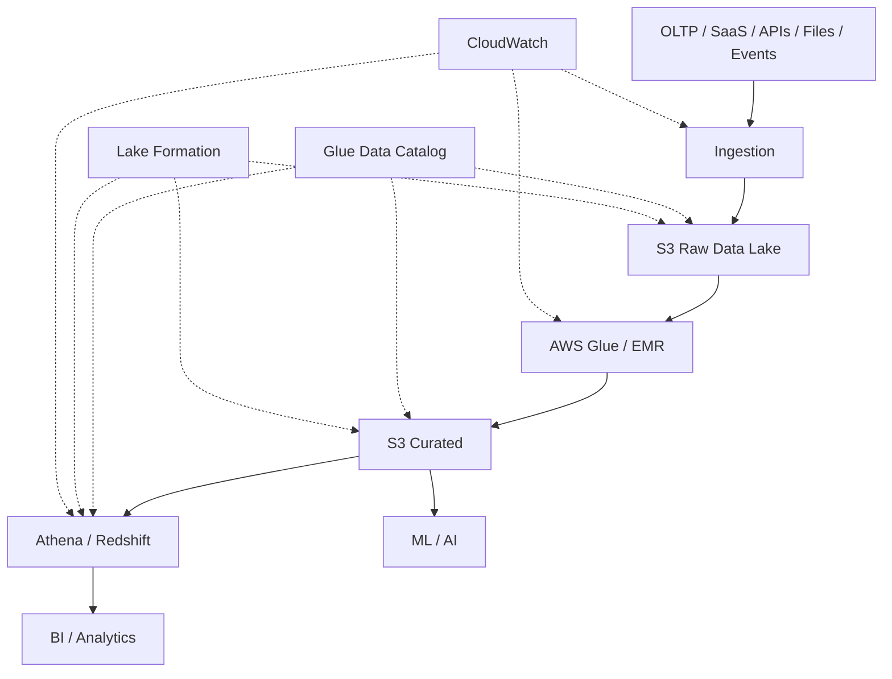
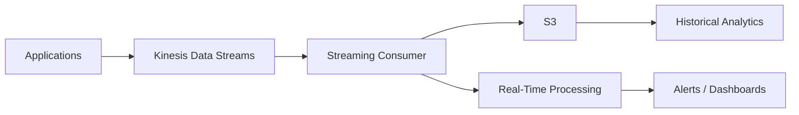
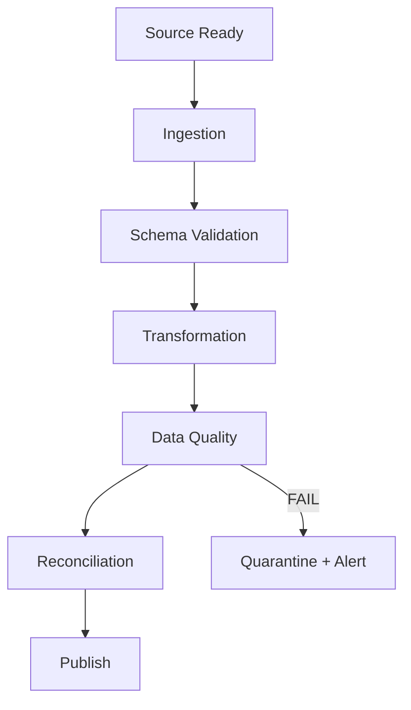

# AWS for Data Engineering — Top 35 Senior/Product Company Interview Questions & Answers

> **Target:** Senior / Lead / Staff Data Engineer
> **Goal:** 70+ LPA product-based companies
> **Focus:** S3, IAM, Glue, Glue Data Catalog, Athena, Redshift, EMR, Kinesis, Lambda, Step Functions, EventBridge, Lake Formation, CloudWatch, VPC/networking, security, HA/DR, cost optimization and production data-platform architecture.
>
> **Resume alignment:** Your profile already includes AWS, Redshift, S3, AWS SSO, AWS SSM, Python-based AWS data tooling, Redshift schema automation and cloud data-platform engineering.

---

# 0. HOW TO THINK ABOUT AWS DATA ENGINEERING

Do not approach an AWS interview as:

```text id="l83a5j"
"What AWS services do you know?"
```

Approach it as:

```text id="8m4g7q"
Business Requirement
        ↓
Latency / Volume / SLA
        ↓
Storage
        ↓
Ingestion
        ↓
Processing
        ↓
Serving
        ↓
Governance
        ↓
Security
        ↓
Observability
        ↓
Reliability / DR
        ↓
Cost
```

The AWS Well-Architected Framework evaluates workloads across:

```text id="vh9scs"
Operational Excellence
Security
Reliability
Performance Efficiency
Cost Optimization
Sustainability
```

AWS explicitly describes these six pillars as the foundation for evaluating cloud architectures and making architectural trade-offs.

For Data Engineering, AWS's Data Analytics Lens additionally emphasizes monitoring analytics workload health, modern deployment, governance, access control, resilience, metadata changes, compute/storage/file-format selection and cost management.

---

# 1. Design an end-to-end AWS data platform.

> **This is one of the most important AWS interview questions.**

## Core Answer

I would first clarify:

### Data

* Volume per day.
* Peak volume.
* Batch vs streaming.
* Structured vs semi-structured vs unstructured.
* Source systems.

### Business

* BI?
* ML?
* AI?
* APIs?
* Operational analytics?

### SLA

* Real time?
* Minutes?
* Hourly?
* Daily?

### Reliability

* RPO.
* RTO.
* Availability.

### Security

* PII?
* Regulatory requirements?
* Cross-account access?

---

# Reference architecture



## Typical service choices

```text id="akz5oa"
Object storage
→ S3

Metadata
→ Glue Data Catalog

Serverless SQL on S3
→ Athena

ETL
→ Glue

Large-scale Spark
→ EMR / EMR Serverless

Warehouse
→ Redshift

Streaming
→ Kinesis

Orchestration
→ Step Functions / Glue Workflows / EventBridge

Governance
→ Lake Formation + Glue Catalog

Monitoring
→ CloudWatch / CloudTrail
```

AWS's Data Analytics Lens recommends selecting compute, storage and file format/partitioning based on the workload rather than adopting a single architecture for every analytics system.

## Senior answer

> "I would not start by choosing AWS services. I would first establish workload characteristics and SLAs, then choose managed services that minimize operational burden while meeting performance, security and cost requirements."

---

# 2. Why is Amazon S3 so important in modern Data Engineering?

## Core Answer

S3 provides highly scalable object storage and is commonly used as the foundation of AWS data lakes.

Typical layers:

```text id="q4w6o4"
S3
│
├── raw/
├── bronze/
├── silver/
├── gold/
├── archive/
└── checkpoints/
```

## Why S3?

* Durable object storage.
* Large-scale capacity.
* Decoupling of storage and compute.
* Multiple engines can access the same data.
* Supports structured and semi-structured datasets.
* Integrates with Glue, Athena, EMR, Redshift Spectrum and Lake Formation.

Athena can query structured, semi-structured and unstructured data stored in S3, including CSV, JSON, Parquet and Avro, and integrates with Glue Data Catalog and Lake Formation.

## Architecture

```text id="x6p57q"
             S3
              │
       ┌──────┼─────────┐
       ↓      ↓         ↓
     Glue   Athena     EMR
       ↓      ↓         ↓
    ETL     SQL      Spark
```

## Senior point

> "S3 should be treated as durable storage, not as a database. Data layout, partitioning, file format and metadata determine how efficiently analytical engines can use it."

---

# 3. Explain S3 prefixes, partitioning and performance.

## Core Answer

S3 uses object keys rather than traditional filesystem directories.

For Data Engineering, we often organize object keys like:

```text id="2xzx4g"
s3://company-data/orders/
year=2026/
month=10/
day=03/
```

This creates logical prefixes.

S3 automatically scales to high request rates. AWS currently documents at least 3,500 PUT/COPY/POST/DELETE and 5,500 GET/HEAD requests per second per partitioned S3 prefix, with performance scaling based on workload and parallelization.

## Important modern point

Older advice said:

> "You must randomize S3 prefixes to avoid hot partitions."

That is no longer a good blanket rule because S3 now automatically scales to high request rates.

## But partitioning still matters for analytics.

Example:

```text id="l3j4q3"
orders/
  year=2026/
    month=10/
      day=01/
      day=02/
      day=03/
```

Athena can scan only the requested partition when the partition column is used in the filter.

## Senior answer

> "S3 request scaling and analytical partition pruning are separate concerns. I don't create partitions merely to solve S3 throughput; I design data partitions primarily around workload access patterns and query pruning."

---

# 4. How would you design an S3 data lake?

## Core Answer

I would organize it by:

```text id="i0cf10"
Environment
Source
Dataset
Layer
Date
```

Example:

```text id="m1vj6a"
s3://company-data/

raw/
  crm/
    customer/
      year=2026/
      month=10/
      day=03/

silver/
  customer/

gold/
  customer_360/
```

## Layer responsibilities

### Raw

* Source fidelity.
* Replay.
* Audit.

### Silver

* Validated.
* Cleaned.
* Standardized.

### Gold

* Business-ready.
* Aggregated.
* Consumer-oriented.

## File format

Prefer:

```text id="p1sm41"
Parquet / ORC
```

for repeated analytics rather than CSV where possible.

## Metadata

Use Glue Data Catalog.

Glue's Data Catalog is a centralized metadata repository containing dataset locations, schemas and related metadata; crawlers can discover and create/update table definitions.

## Security

Use:

* IAM.
* Lake Formation.
* Encryption.
* Bucket policies.
* KMS.

---

# 5. What is AWS Glue?

## Core Answer

AWS Glue is a serverless data-integration service for:

* Data discovery.
* Metadata cataloging.
* ETL.
* Job orchestration.
* Data preparation.

AWS currently describes Glue as a scalable serverless data integration service and maintains the Glue Data Catalog as its persistent metadata store.

## Main components

```text id="2x1nyq"
AWS Glue
│
├── Data Catalog
├── Crawlers
├── ETL Jobs
├── Triggers
├── Workflows
├── Connections
└── Data Quality / Integration features
```

## Typical architecture

```text id="nbs3g2"
S3
 ↓
Glue Crawler
 ↓
Glue Data Catalog
 ↓
Glue ETL Job
 ↓
S3 / Redshift
```

---

# 6. What is the AWS Glue Data Catalog?

## Core Answer

The Glue Data Catalog is a centralized metadata repository.

It stores information such as:

```text id="12jp2t"
database
table
columns
data types
location
partitions
schema
statistics/metadata
```

AWS documents the Catalog as an index of data location, schema and runtime metadata.

## Why important?

It separates:

```text id="t3ugv3"
Physical data
```

from:

```text id="uwxgqq"
Metadata describing that data
```

Then services can use the same catalog.

```text id="5y8wh9"
             Glue Catalog
                  │
        ┌─────────┼──────────┐
        ↓         ↓          ↓
     Athena      Glue       EMR
```

## Senior answer

> "The Catalog becomes a metadata control plane for the data lake, allowing multiple analytics engines to work from a common schema and location definition."

---

# 7. Glue Crawler vs manually defining tables.

## Crawler

Automatically scans data sources and infers metadata.

AWS describes Crawlers as a primary method for populating the Glue Data Catalog and notes that they can create or update databases/tables based on discovered data.

## Advantages

* Easy initial discovery.
* Automatic schema detection.
* Useful for diverse datasets.

## Disadvantages

* Can be slower at huge scale.
* Schema inference may not match business intent.
* Schema changes can surprise downstream systems.
* Frequent crawling can add operational overhead.

## Manual Catalog definition

You explicitly define:

* Schema.
* Location.
* Partition structure.

## Senior answer

> "I use crawlers where automated discovery provides value. For critical production contracts, I may prefer explicitly managed schemas because inferred schemas are not always the business contract."

---

# 8. What is the difference between Glue DynamicFrame and Spark DataFrame?

## DynamicFrame

AWS Glue's abstraction designed for semi-structured/ETL scenarios.

Historically useful for:

* Schema inconsistencies.
* Nested data.
* ETL transformations.

## DataFrame

Native Spark SQL abstraction.

Advantages:

* Strong Spark ecosystem.
* Catalyst optimization.
* Familiar PySpark APIs.
* Good interoperability.

## Practical pattern

```text id="bxgb6s"
Glue Job
   ↓
DynamicFrame
   ↓
Resolve schema / ETL-specific processing
   ↓
DataFrame
   ↓
Spark transformations
   ↓
Write
```

## Senior answer

> "I don't choose DynamicFrame because it is 'more AWS' or DataFrame because it is 'more Spark.' I choose based on schema handling, transformation requirements and interoperability with native Spark APIs."

---

# 9. How would you optimize an AWS Glue ETL job?

## Core Answer

First profile the workload.

Look at:

```text id="8yc7z1"
Input size
Partition count
CPU
Memory
Shuffle
Skew
I/O
Spill
Runtime
```

Then:

### 1. Reduce input

* Incremental processing.
* Partition pruning.
* Read only required columns.

### 2. Optimize transformations

* Avoid unnecessary shuffles.
* Broadcast small dimensions where appropriate.
* Handle skew.

### 3. Optimize files

* Parquet/ORC.
* Avoid tiny files.
* Compact outputs.

### 4. Tune Spark

* Executors.
* Partitions.
* Memory.
* Shuffle.

### 5. Right-size Glue workers

Only after reducing unnecessary computation.

## Senior answer

> "I treat Glue as Spark running as a managed service. The same distributed-computing principles apply: reduce scanned data, reduce shuffle, fix skew and choose worker capacity based on measured workload behavior."

---

# 10. When would you use EMR instead of AWS Glue?

## Core Answer

Both can execute distributed workloads, but the operational model differs.

## Glue

Prefer when:

* Serverless ETL.
* Less infrastructure management.
* Standardized data integration.
* Event/batch pipeline.
* Tight AWS integration.

## EMR

Prefer when:

* Need more control over Spark/Hadoop runtime.
* Custom configurations.
* Long-running clusters.
* Complex open-source ecosystem.
* Specialized workload requirements.

AWS EMR supports Spark and Hive workloads, and EMR Serverless provides a managed runtime where AWS handles cluster infrastructure for those frameworks.

## Simple comparison

| Requirement                     | Glue |            EMR |
| ------------------------------- | ---: | -------------: |
| Minimal infrastructure ops      |    ✅ |                |
| Serverless ETL                  |    ✅ | EMR Serverless |
| Deep cluster control            |      |              ✅ |
| Specialized Spark configuration |      |              ✅ |
| Standard AWS ETL                |    ✅ |                |
| Broad Hadoop ecosystem control  |      |              ✅ |

## Senior answer

> "My default isn't 'Glue is newer than EMR.' I choose Glue when managed/serverless integration is more valuable and EMR when runtime or infrastructure control is the stronger requirement."

---

# 11. Explain EMR architecture.

## Classic EMR

Conceptually:

```text id="6z5m0q"
EMR Cluster
│
├── Primary Node
│
├── Core Nodes
│
└── Task Nodes
```

The primary coordinates the cluster, core nodes provide storage/compute functions depending on the architecture, and task nodes are compute-focused.

## Modern perspective

EMR can run:

* Spark.
* Hive.
* Presto/Trino-related workloads depending on configuration.
* Other Hadoop ecosystem components.

## EMR Serverless

```text id="4e9yk2"
Submit Spark Job
      ↓
EMR Serverless
      ↓
AWS provisions runtime
      ↓
Driver + Executors
      ↓
S3
```

AWS currently describes EMR Serverless as a serverless runtime for Apache Spark/Hive where you don't have to manage clusters yourself.

---

# 12. Explain Athena and when you would use it.

## Core Answer

Athena is a serverless query service for analyzing data in S3 using SQL.

AWS documents Athena as a serverless query service for structured, semi-structured and unstructured S3 data and supports formats such as CSV, JSON, Parquet and Avro.

## Use Athena for

* Ad hoc analytics.
* Data-lake queries.
* Exploration.
* One-off analysis.
* Lightweight serverless SQL workloads.

## Architecture

```text id="c41gni"
S3
 ↓
Glue Data Catalog
 ↓
Athena
 ↓
SQL
 ↓
Results in S3
```

## Not ideal for

A workload requiring:

* Extremely high concurrent BI usage.
* Highly complex warehouse workloads.
* Extensive relational serving.

In such cases, evaluate Redshift or another serving engine.

---

# 13. How do you optimize Athena queries?

## Core Answer

Athena cost/performance is heavily influenced by the amount of data scanned.

Therefore:

### 1. Use columnar formats

```text id="w8nvai"
Parquet / ORC
```

### 2. Partition data

```text id="w9b1hy"
year
month
day
region
```

where appropriate.

### 3. Filter partitions

```sql id="3i8te1"
WHERE year = 2026
  AND month = 10
```

Athena documents that queries filtering on a partition column scan only the relevant partition data.

### 4. Avoid `SELECT *`

### 5. Compact small files

### 6. Use partition projection when appropriate

Partition projection lets Athena derive partition values from configured ranges/patterns instead of requiring explicit catalog partition metadata for every partition.

## Senior answer

> "For Athena, I optimize the amount of data scanned before I optimize the SQL syntax itself."

---

# 14. What is partition projection in Athena?

## Core Answer

Suppose:

```text id="pwpzjx"
10 million date/hour partitions
```

Managing every partition as explicit Glue metadata can become cumbersome.

Partition projection lets Athena calculate partition locations based on configured rules/ranges.

Example concept:

```text id="yqr7tl"
year = 2020 → 2030
month = 1 → 12
day = 1 → 31
```

Athena can use this metadata to derive locations.

AWS documents partition projection as a two-step configuration involving partition ranges/patterns and enabling projection for the table.

## Important

Partition projection is not automatically faster.

It helps when:

* There are many partitions.
* Partition values follow predictable patterns.
* Metadata management itself becomes a problem.

---

# 15. Explain Amazon Redshift architecture.

## Core Answer

Redshift is AWS's managed cloud data warehouse.

Conceptually:

```text id="58qai9"
                 Redshift
                    │
           ┌────────┴────────┐
           ↓                 ↓
      Compute/Query       Storage
           │
        Nodes / Managed architecture
```

Modern Redshift has evolved considerably, so in interviews focus on current deployment options plus the underlying MPP architecture.

## Key concepts

```text id="c0u4je"
MPP
Distribution
Sort
Compression
Columnar storage
Workload management
Redshift Serverless
RA3
Spectrum
COPY
UNLOAD
MERGE
```

## Senior answer

> "Redshift is best thought of as an analytical MPP warehouse, whereas S3 is object storage and Athena is serverless SQL over lake data."

---

# 16. Explain Redshift distribution styles.

## Core Answer

In classic Redshift provisioned designs, distribution controls where rows are stored across compute nodes.

Conceptually:

```text id="g7v2m0"
FACT TABLE
    ↓
Distribution Key
    ↓
Node 1 / Node 2 / Node 3
```

Traditional styles include:

```text id="ycif2z"
KEY
EVEN
ALL
AUTO
```

## Why important?

Join performance can improve when frequently joined data is co-located appropriately.

Bad distribution can cause:

```text id="ra0fmc"
Node 1 → 100 GB
Node 2 → 100 GB
Node 3 → 10 TB ❌
```

This is data skew.

## Senior answer

> "Distribution is essentially a data-placement decision. I choose it based on joins, cardinality and distribution balance rather than picking the obvious business key blindly."

---

# 17. Explain Redshift sort keys and why they matter.

## Core Answer

Sort keys influence how table data is physically organized and can help Redshift skip blocks for suitable predicates and improve certain query patterns.

Example:

```sql id="7mpsrt"
ORDER BY event_date
```

Conceptually:

```text id="byv3wq"
Block 1 → Jan
Block 2 → Feb
Block 3 → Mar
Block 4 → Apr
```

Query:

```sql id="qsxj7d"
WHERE event_date >= '2026-04-01'
```

may avoid scanning earlier blocks.

## Important

Sort keys are not equivalent to conventional B-tree indexes.

## Senior point

> "I choose sort keys from real filter/join patterns and verify the resulting scan reduction rather than assuming any timestamp column should always be the sort key."

---

# 18. Redshift `COPY` vs `INSERT`.

## `COPY`

Designed for bulk loading data from:

* S3.
* Other supported sources.

Typical:

```sql id="agw8sz"
COPY sales
FROM 's3://company-bucket/sales/'
IAM_ROLE '...'
FORMAT AS PARQUET;
```

## Why better?

Bulk loading can use parallelism efficiently.

## Avoid

```text id="iimz0t"
Python loop
  ↓
INSERT row
  ↓
INSERT row
  ↓
INSERT row
```

for millions of records.

## Senior answer

> "For large-scale Redshift ingestion, I prefer bulk loading patterns such as COPY instead of row-by-row inserts."

---

# 19. Explain Redshift Spectrum.

## Core Answer

Redshift Spectrum lets Redshift query external data in S3 without first loading all of it into Redshift-managed tables.

Conceptually:

```text id="xsocgi"
Redshift
   ↓
Spectrum
   ↓
Glue Catalog
   ↓
S3
```

## Use cases

* Query lake data.
* Join warehouse data with S3 data.
* Avoid duplicating some datasets into Redshift.

## Example

```text id="5gfu6d"
Customer Master
→ Redshift

Raw Events
→ S3

Query
→ Join both
```

## Trade-off

External scans can have very different performance/cost characteristics from querying optimized Redshift-local tables.

## Senior answer

> "Spectrum is particularly useful when S3 remains the system of record for large lake datasets and I don't want to duplicate everything into the warehouse."

---

# 20. Redshift provisioned vs Redshift Serverless.

## Provisioned

You manage/configure:

```text id="3n0txc"
warehouse capacity
nodes
workload characteristics
```

## Serverless

AWS manages compute capacity more dynamically.

Use cases:

* Variable workloads.
* Less infrastructure management.
* Exploratory analytics.
* Intermittent warehouse workloads.

## Decision

```text id="7y1jcg"
Stable predictable workload
→ provisioned may make sense

Highly variable/intermittent
→ serverless may make sense
```

## Senior answer

> "The decision should be based on workload stability, control requirements, utilization and cost—not simply serverless versus non-serverless preference."

---

# 21. What is Amazon Kinesis Data Streams?

## Core Answer

Kinesis Data Streams is a real-time streaming service.

Conceptually:

```text id="h6n8rs"
Applications
    ↓
Kinesis Data Streams
    ↓
Consumers
 ├── Lambda
 ├── Glue Streaming
 ├── EMR
 └── Custom Consumers
```

## Key concepts

* Stream.
* Shard.
* Partition key.
* Sequence number.
* Consumer.
* Retention.
* Replay.

## Why?

* Real-time ingestion.
* Event pipelines.
* Logs.
* IoT.
* Transaction events.

---

# 22. Explain Kinesis shard partitioning.

## Core Answer

A partition key determines which shard receives a record.

Conceptually:

```text id="x3d8kj"
partition_key
     ↓
hash
     ↓
shard
```

Example:

```text id="h7kn8m"
customer_101 → hash → Shard 1
customer_102 → hash → Shard 3
customer_103 → hash → Shard 2
```

## Critical issue

If one key dominates:

```text id="54t2gq"
customer_UNKNOWN
```

many events may go to the same shard.

Result:

```text id="3kn4z1"
Shard 1 → overloaded
Shard 2 → underutilized
Shard 3 → underutilized
```

## Senior answer

> "Streaming partition-key design is both a correctness and scalability decision. I need to balance ordering requirements against even distribution."

---

# 23. What is Kinesis enhanced fan-out?

## Core Answer

Enhanced fan-out provides dedicated consumer throughput.

AWS currently documents up to **2 MB/sec per shard per enhanced-fan-out consumer**, with dedicated throughput rather than consumers contending for shared read throughput.

Conceptually:

```text id="x7q3c1"
                 Kinesis Shard
                      │
          ┌───────────┼────────────┐
          ↓           ↓            ↓
     Consumer A   Consumer B   Consumer C
       2 MB/s       2 MB/s        2 MB/s
```

## Why useful?

When many consumers need the same stream.

## Trade-off

Additional service cost/complexity.

## Senior answer

> "I consider enhanced fan-out when multiple consumers need predictable dedicated throughput from the same stream."

---

# 24. Kinesis Data Streams vs SQS.

## Kinesis

Designed primarily for:

* Ordered event streams.
* Replayable streaming.
* Multiple consumers.
* Partitioned event processing.
* High-throughput streaming.

## SQS

Designed primarily for:

* Durable message queues.
* Decoupling producers/consumers.
* Work distribution.
* Asynchronous task processing.

## Mental model

```text id="xw8fr0"
Kinesis
→ event log / stream

SQS
→ work queue
```

## Interview example

### Process each uploaded image exactly once-ish as a task

```text id="j4zq7e"
SQS
```

### Retain transaction events for multiple consumers and replay

```text id="56e6m9"
Kinesis
```

## Important

Don't state absolute "exactly once" guarantees without considering consumers, retries and idempotency.

---

# 25. Lambda vs Glue vs EMR — when would you use each?

## Lambda

Good for:

* Lightweight event-driven logic.
* Small transformations.
* Triggering workflows.
* API/event processing.

Not ideal for massive distributed ETL.

## Glue

Good for:

* Managed ETL.
* Data integration.
* S3-to-warehouse pipelines.
* Standard Spark-based transformations.

## EMR

Good for:

* Large/custom Spark workloads.
* Advanced runtime control.
* Hadoop ecosystem workloads.
* Long-running or specialized processing.

## Decision tree

```text id="z57u7u"
Small event-driven operation
        ↓
Lambda

Serverless ETL
        ↓
Glue

Large/custom distributed compute
        ↓
EMR / EMR Serverless
```

## Senior answer

> "I avoid using Lambda as a substitute for Spark. Lambda is excellent for orchestration and lightweight transformations, while distributed data-processing engines are designed for large datasets."

---

# 26. How would you orchestrate a complex AWS Data Engineering workflow?

## Core Answer

A workflow might be:

```text id="z0ryv2"
Extract
  ↓
Validate
  ↓
Transform
  ↓
Quality
  ↓
Load
  ↓
Reconcile
  ↓
Publish
```

I can use:

* AWS Step Functions.
* Glue Workflows/triggers.
* EventBridge.
* Airflow/MWAA where organization-wide orchestration is required.

AWS Glue supports triggers and workflows for chaining jobs and crawlers, and AWS currently recommends Glue Workflows for complex multi-job ETL operations over simple triggers.

Step Functions provides managed workflow orchestration and native integrations with AWS services.

---

# 27. Step Functions vs EventBridge.

## Step Functions

Think:

```text id="4m6wbr"
"Execute this workflow."
```

Example:

```text id="6g6g7g"
Extract
 ↓
Validate
 ↓
Transform
 ↓
If quality fails
 → stop
```

It manages workflow state and transitions.

## EventBridge

Think:

```text id="gk5djb"
"Something happened."
```

Examples:

```text id="8egum2"
S3 file arrived
Glue job finished
Step Functions execution failed
Scheduled event
```

Then route the event to:

```text id="z6u8nq"
Lambda
Step Functions
SNS
SQS
etc.
```

AWS describes EventBridge as a serverless event-bus service for loosely coupled event-driven architectures, including routing Step Functions state-change events to downstream services.

## Senior answer

> "Step Functions models stateful workflow orchestration; EventBridge models event routing. They often work together."

---

# 28. Explain IAM and least privilege.

## Core Answer

IAM controls who/what can perform which actions on which AWS resources.

Think:

```text id="j5f3l7"
Principal
   ↓
Policy
   ↓
Action
   ↓
Resource
   ↓
Condition
```

Example:

```text id="q53tok"
Glue Job Role
   ↓
s3:GetObject
   ↓
bucket/raw/customer/*
```

## Least privilege

Give only the permissions needed.

Bad:

```text id="hpgtks"
Glue Role
→ AdministratorAccess
```

Better:

```text id="5tlncs"
Glue Role
→ Read raw path
→ Write silver path
→ Read required KMS key
→ Write logs
```

## Senior security architecture

Use:

* IAM roles.
* Role assumption.
* Temporary credentials.
* Resource policies where applicable.
* KMS.
* SCPs in organizations.
* CloudTrail.

AWS treats cloud security as a shared responsibility: AWS is responsible for security of the cloud, while customers are responsible for security in the cloud according to the service.

---

# 29. IAM policy vs bucket policy — what's the difference?

## IAM identity policy

Attached to:

```text id="ot44gi"
user
role
group
```

It says what that identity may do.

## S3 bucket policy

Resource-based policy attached to:

```text id="x0gz9n"
S3 bucket
```

It says which principals can access the bucket and under what conditions.

## Concept

```text id="h6n5mc"
                 Request
                    ↓
           ┌────────┴────────┐
           ↓                 ↓
      Identity Policy   Bucket Policy
           │                 │
           └────────┬────────┘
                    ↓
                 Decision
```

## Senior answer

> "In S3 access design, I evaluate identity-based and resource-based policies together rather than treating bucket policy as a replacement for IAM."

---

# 30. How would you secure an S3-based data lake?

## Core Answer

I would implement multiple layers.

### Access

* IAM roles.
* Least privilege.
* Lake Formation permissions.
* Bucket policies.

### Encryption

* SSE-S3 or SSE-KMS according to requirements.
* KMS key policies and rotation practices.

### Network

* VPC endpoints where appropriate.
* Restrict access paths.

### Data protection

* Versioning.
* Object lock where appropriate.
* Lifecycle policies.
* Access logging/auditing.

### Governance

* Glue Data Catalog.
* Lake Formation.
* Classification.
* Data lineage.

Lake Formation provides centralized governance and fine-grained data permissions over S3-based data lakes and Glue Data Catalog metadata, including column-, row- and cell-level controls for integrated AWS analytics services.

## Senior answer

> "I want both storage-level protection and data-level governance. Encryption doesn't replace authorization, and IAM doesn't replace data-classification controls."

---

# 31. Lake Formation vs IAM — why do we need both?

## Core Answer

IAM answers:

> "Can this principal call this AWS service/API/resource?"

Lake Formation answers more granular data-access questions for supported data lakes and analytics services.

Example:

```text id="dgt0h3"
IAM
→ Can Alice use Athena?

Lake Formation
→ Which tables/columns/rows may Alice query?
```

Lake Formation provides fine-grained permissions beyond IAM for S3-based data lakes and their Glue Catalog metadata.

## Architecture

```text id="qxw7oh"
User
 ↓
IAM
 ↓
Can call Athena?
 ↓
Lake Formation
 ↓
Which data?
 ↓
S3
```

## Senior answer

> "IAM is the broader AWS authorization layer; Lake Formation provides data-lake-specific governance and fine-grained access controls."

---

# 32. How do you monitor AWS data pipelines?

## Core Answer

I monitor four layers.

### 1. Pipeline

```text id="io8ey0"
success/failure
duration
retry count
dependency status
```

### 2. Data

```text id="tqf3xk"
row count
freshness
null rate
duplicates
schema changes
business KPIs
```

### 3. Infrastructure

```text id="nx7mll"
CPU
memory
network
disk
```

### 4. AWS service metrics

Examples:

```text id="4r49gd"
Glue job metrics
Lambda errors/duration/throttling
Redshift query/workload metrics
Kinesis iterator/throughput metrics
Athena query statistics
```

CloudWatch is the primary AWS service for collecting and monitoring operational metrics/logs/alarms.

## Audit

Use CloudTrail to answer:

> "Who did what to which AWS resource?"

## Senior answer

> "Operational monitoring tells me whether the system is healthy; data observability tells me whether the output is trustworthy."

AWS's Data Analytics Lens explicitly recommends monitoring the health of analytics workloads and securing audit logs that record data or resource access.

---

# 33. How would you design HA, backup and disaster recovery for an AWS data platform?

## Core Answer

Start with:

```text id="7pz2vo"
RPO
+
RTO
```

Example:

```text id="ua0gn1"
RPO = 15 minutes
RTO = 1 hour
```

Then design accordingly.

## S3

Use appropriate:

* Cross-Region Replication where required.
* Versioning.
* Lifecycle.
* Object protection.

## Database/Warehouse

Use platform-native backup/restore and replication features based on the service.

## Pipelines

Store:

```text id="q9f4sk"
source data
checkpoints
metadata
code
configuration
```

in recoverable/version-controlled locations.

## Reprocessing

The architecture should allow:

```text id="j4f8m0"
raw data
 ↓
recompute
 ↓
curated state
```

## AWS Well-Architected perspective

AWS's reliability guidance emphasizes designing resilience into analytics workloads and governing data/metadata changes throughout the workload lifecycle.

## Senior answer

> "DR starts with business recovery objectives. I don't choose cross-region replication before knowing what data loss and recovery time the business can tolerate."

---

# 34. How would you reduce AWS Data Engineering costs?

## Core Answer

Break cost into:

```text id="kqfjt7"
Storage
Compute
Queries
Data transfer
Operations
```

---

## S3

Optimize:

* Storage classes.
* Lifecycle rules.
* Retention.
* Compression.
* File size.
* Duplicate data.

## Glue

* Right-size workers.
* Reduce unnecessary scans.
* Incremental loads.
* Efficient partitioning.
* Avoid excessive job runs.

## Athena

* Parquet/ORC.
* Partitioning.
* Predicate filtering.
* Avoid `SELECT *`.
* Partition projection where appropriate.

## Redshift

* Right-size warehouses/clusters.
* Use Serverless where workload economics justify it.
* Workload isolation.
* Query tuning.
* Avoid unnecessary data copies.

## EMR

* Ephemeral clusters / serverless where appropriate.
* Spot capacity where workloads tolerate interruption.
* Right-size instances.
* Optimize Spark jobs before scaling.

## Kinesis

* Right-size throughput/shards.
* Use on-demand/provisioned based on workload characteristics.
* Optimize consumers.

AWS's Data Analytics Lens recommends evaluating cost by individual processing step/branch and choosing compute/storage and pricing models based on actual usage patterns rather than treating cost as an afterthought.

## Senior answer

> "I optimize cost by reducing unnecessary computation and data movement first; only after that do I tune instance or service size."

---

# 35. Design a production-grade AWS Data Engineering platform for 5 TB/day.

> **THIS IS THE MOST IMPORTANT AWS ARCHITECTURE QUESTION.**

Let's assume:

```text id="l7v9qf"
5 TB/day
Batch + streaming
BI + ML
PII
99.9% pipeline availability
15-minute freshness for critical datasets
```

---

# Step 1 — Sources

```text id="0y5xke"
PostgreSQL
CRM
SaaS APIs
Files
Application Events
```

---

# Step 2 — Ingestion

Choose according to source:

```text id="12bfmj"
PostgreSQL CDC
       ↓
stream/event ingestion

Files
       ↓
S3

APIs
       ↓
Lambda / Glue / containerized extraction

Events
       ↓
Kinesis
```

---

# Step 3 — S3 Data Lake

```text id="0gk5ky"
s3://company-data/

raw/
silver/
gold/
```

Example:

```text id="w1s0em"
raw/
  source=crm/
  entity=customer/
  year=2026/
  month=10/
  day=03/
```

Use Parquet/columnar formats for analytical layers.

Athena's current guidance recommends partitioning and efficient file organization to reduce scanned data.

---

# Step 4 — Metadata

```text id="v3f60b"
Glue Data Catalog
       ↓
Database
       ↓
Tables
       ↓
Partitions
       ↓
Schemas
```

Glue's Data Catalog provides centralized metadata and can be populated by crawlers or explicit table definitions.

---

# Step 5 — Processing

### Standard ETL

```text id="iqhgcv"
Glue
```

### Large/custom Spark workload

```text id="xvqz4r"
EMR / EMR Serverless
```

### Serverless SQL

```text id="mmjb4g"
Athena
```

### Warehouse transformations

```text id="d3p8ad"
Redshift
```

---

# Step 6 — Curated Layer

```text id="smw3z5"
S3 Raw
 ↓
Glue / EMR
 ↓
S3 Silver
 ↓
Business Transformations
 ↓
S3 Gold
```

---

# Step 7 — Serving

Use different engines for different workloads:

```text id="z6juzm"
S3
├── Athena → lake analytics
│
└── Redshift → high-performance warehouse/BI
```

Don't force every workload into one engine.

---

# Step 8 — Streaming



Use partition keys that preserve required ordering while distributing load.

Enhanced fan-out can provide dedicated consumer throughput where several consumers need predictable access to the same stream.

---

# Step 9 — Orchestration



Use:

```text id="h5cf76"
Step Functions
+
EventBridge
```

or:

```text id="rq7g3y"
Glue Workflows
```

based on orchestration requirements.

Step Functions provides stateful workflow orchestration, while EventBridge provides event-driven routing.

---

# Step 10 — Data Quality

At every important boundary:

```text id="68uc6m"
Schema
Count
Nulls
Duplicates
Freshness
Validity
Business Rules
Reconciliation
```

Example:

```text id="r2zi78"
Source count = 10,000,000
Target count = 9,998,500
             ↓
FAIL
```

Then:

```text id="p1e4z4"
Quarantine
+
Investigate
+
Alert
```

---

# Step 11 — Governance

Use:

```text id="d1tb2w"
Glue Catalog
+
Lake Formation
+
IAM
+
KMS
+
CloudTrail
```

Lake Formation supports fine-grained controls over tables, columns, rows and cells for integrated AWS analytics services.

---

# Step 12 — Security

```text id="6gpz0y"
Developer
 ↓
IAM Role
 ↓
Least Privilege
 ↓
Service
 ↓
Resource Policy / Lake Formation
 ↓
Encrypted Data
```

Use temporary credentials/roles rather than embedding access keys in code.

---

# Step 13 — Observability

Track:

### Pipeline

```text id="rxdg5m"
success
failure
duration
retry
```

### Data

```text id="u9g6g2"
row count
freshness
quality
schema
business KPI
```

### Platform

```text id="xn1fln"
CPU
memory
throughput
errors
throttling
```

---

# Step 14 — Reliability

Every pipeline should be:

```text id="5qk2jb"
Idempotent
Retry-safe
Backfillable
Recoverable
Observable
```

---

# Step 15 — Cost

Create cost visibility by:

```text id="brwdql"
team
dataset
pipeline
environment
service
```

AWS's Data Analytics Lens specifically recommends understanding analytics-workflow cost at the individual processing-step or branch level.

---

# FINAL 90-SECOND AWS ARCHITECTURE ANSWER

> "For a 5 TB/day platform, I would first establish the batch and streaming SLAs, source characteristics, growth rate, retention, consumers, security classification and RPO/RTO. I would use S3 as the durable lake-storage layer, organized into raw, validated and curated zones. Glue Data Catalog would provide centralized metadata, while Lake Formation and IAM would provide data and infrastructure access controls. For ingestion, I would use CDC or managed ingestion for databases, S3 for file-based ingestion, and Kinesis for event streams. Glue would handle standard serverless ETL, while EMR or EMR Serverless would be considered for specialized or heavily customized Spark workloads. Athena would support serverless lake queries, while Redshift would serve workloads requiring warehouse-style analytical performance and concurrency. I would orchestrate dependencies using Step Functions/EventBridge or Glue Workflows depending on the workflow requirements. Every production pipeline would have schema validation, reconciliation, data-quality checks, idempotent processing, retry handling, backfill capability and CloudWatch-based observability. For security I'd use least-privilege IAM roles, KMS encryption, Lake Formation fine-grained permissions and CloudTrail auditing. Finally, I would optimize cost by reducing unnecessary scanned data and compute first, then right-sizing services and choosing pricing models based on actual workload patterns."

---

# YOUR RESUME → AWS INTERVIEW STORY BANK

This is where you should use your actual experience instead of giving only hypothetical AWS answers.

| AWS Topic           | Your Resume Story                   |
| ------------------- | ----------------------------------- |
| S3                  | AWS Data Query Toolkit              |
| Redshift            | Enterprise Data Quality Framework   |
| AWS SSO             | AWS Data Query Toolkit              |
| AWS SSM             | Redshift schema-governance platform |
| Python + AWS        | Data query / schema automation      |
| Metadata            | Redshift metadata extraction        |
| Schema governance   | DDL synchronization                 |
| Parallel processing | DDL synchronization                 |
| CI/CD               | Database-object promotion           |
| Data quality        | Enterprise DQ framework             |
| Reconciliation      | File/table/cross-system validation  |
| Cloud architecture  | AWS/Azure/GCP experience            |

Your AWS-focused data-query toolkit uses Python, AWS SSO, AWS SSM, Amazon Redshift and S3, while your schema-governance project automates Redshift metadata extraction, DDL synchronization and multi-environment promotion.

---

# YOUR AWS PROJECT STORY — 60 SECOND VERSION

When asked:

> **"Tell me about a real AWS Data Engineering project."**

Use your AWS Data Query Toolkit:

> "I built an AWS-focused data-query toolkit to make developer and analyst workflows more efficient for Redshift and S3 investigation. The tool used Python and integrated AWS SSO and SSM for secure environment-aware execution rather than embedding credentials. It supported executing Redshift SQL and inspecting S3 datasets across environments. The design focused on standardizing repetitive investigation and verification workflows while reducing credential-management risk. The larger architectural lesson was that developer tooling around a data platform also needs security, environment awareness and operational consistency."

This aligns with the AWS project information in your resume.

---

# AWS SERVICE DECISION TREE

```text id="6grd3m"
                    DATA WORKLOAD
                         │
        ┌────────────────┼──────────────────┐
        ↓                ↓                  ↓
      FILES            EVENTS             DB
        │                │                  │
        ↓                ↓                  ↓
       S3             Kinesis             CDC
        │
        ↓
   ┌────┼──────────────┐
   ↓    ↓              ↓
 Glue Athena          EMR
   │    │              │
   └────┼──────────────┘
        ↓
       S3 / Redshift
        ↓
    BI / ML / AI
```

---

# S3 vs Redshift vs Athena

| Requirement                  | S3 |   Athena | Redshift |
| ---------------------------- | -: | -------: | -------: |
| Durable raw storage          |  ✅ |          |          |
| Data lake                    |  ✅ |          |          |
| Serverless SQL               |    |        ✅ |          |
| High-performance warehouse   |    |          |        ✅ |
| BI concurrency               |    | Possible |        ✅ |
| Long-term raw retention      |  ✅ |          |          |
| Transactional application DB |    |          |        ❌ |

---

# GLUE vs EMR vs EMR SERVERLESS

| Requirement                       |    Glue | EMR | EMR Serverless |
| --------------------------------- | ------: | --: | -------------: |
| Serverless ETL                    |       ✅ |     |              ✅ |
| Full cluster control              |         |   ✅ |                |
| Spark                             |       ✅ |   ✅ |              ✅ |
| Hive                              |         |   ✅ |              ✅ |
| Minimal infrastructure operations |       ✅ |     |              ✅ |
| Custom runtime/control            | Limited |   ✅ |   More limited |
| Specialized Hadoop workloads      |         |   ✅ |           Some |

AWS currently positions EMR Serverless as a managed Spark/Hive runtime without cluster operations.

---

# KINESIS vs SQS vs EVENTBRIDGE

```text id="r59n0u"
EVENT STREAM
    ↓
Kinesis

WORK QUEUE
    ↓
SQS

EVENT ROUTING
    ↓
EventBridge
```

### Kinesis

```text id="8l84ef"
Ordered event streams
Replay
Partitioning
Multiple consumers
```

### SQS

```text id="bx4x8u"
Queue
Work distribution
Decoupling
Retry/DLQ
```

### EventBridge

```text id="xq2x5t"
Event bus
Routing
Rules
Loose coupling
```

EventBridge is designed for event-driven, loosely coupled architectures and can route events into Step Functions, Lambda, SNS and other services.

---

# LAMBDA vs GLUE vs EMR

```text id="a1z3sm"
              COMPUTATION
                  │
       ┌──────────┼──────────┐
       ↓          ↓          ↓
     Small      ETL       Massive/
   Event Work   Data      Custom Spark
       │          │          │
       ↓          ↓          ↓
    Lambda      Glue        EMR
```

---

# 15 AWS DATA ENGINEERING SCENARIOS YOU MUST PRACTICE

```text id="s4k1ae"
1. Design a 5 TB/day S3 data lake.

2. Design PostgreSQL CDC → S3 → Redshift.

3. Design a real-time Kinesis transaction pipeline.

4. Design a Glue ETL platform for 1,000 datasets.

5. Design an Athena-based data discovery platform.

6. Design a cross-account enterprise data lake.

7. Design Lake Formation permissions for PII.

8. Design a multi-region data platform.

9. Design a replayable streaming pipeline.

10. Design a cost-optimized S3 lake.

11. Design S3 → Glue → Redshift ingestion.

12. Design an event-driven ETL system with EventBridge.

13. Design Step Functions for a complex ETL workflow.

14. Optimize a Glue job that suddenly became 5× slower.

15. Troubleshoot a Kinesis stream with one overloaded shard.
```

---

# 15 AWS TROUBLESHOOTING QUESTIONS

## 1

> Athena query scans 10 TB for a 5 GB result. Why?

Think:

```text id="ep6w31"
Partitioning
+
file format
+
predicate
+
projection
```

---

## 2

> Glue job suddenly takes 4 hours instead of 40 minutes.

Think:

```text id="zev8po"
Data volume
+
partition count
+
skew
+
shuffle
+
small files
+
worker resources
```

---

## 3

> Kinesis consumer falls behind.

Think:

```text id="6ra0cm"
Producer rate
+
shard capacity
+
consumer processing time
+
hot partition key
+
consumer concurrency
```

---

## 4

> Redshift query becomes slow.

Think:

```text id="t8vfk7"
Distribution
+
sort
+
scan
+
join
+
table maintenance
+
workload/concurrency
```

---

## 5

> S3 data is suddenly inaccessible.

Think:

```text id="m7tgj5"
IAM
+
bucket policy
+
KMS
+
Lake Formation
+
VPC/network path
```

---

# 10 AWS DATA ENGINEERING GOLDEN STATEMENTS

### 1

> "I choose the AWS service based on workload characteristics, not because one service is newer or more popular."

### 2

> "S3 is the durable storage layer; the analytical engine is a separate concern."

### 3

> "For Athena, reducing data scanned is usually one of the highest-impact optimizations."

### 4

> "Glue gives me managed Spark-based data integration with a centralized Data Catalog."

### 5

> "EMR is useful when I need greater control over the Spark/Hadoop runtime or workload."

### 6

> "Kinesis partition-key design determines both ordering behavior and scalability."

### 7

> "Step Functions orchestrates stateful workflows; EventBridge routes events."

### 8

> "IAM secures AWS resources, while Lake Formation adds fine-grained data-lake authorization for supported analytics workloads."

### 9

> "A technically successful pipeline does not guarantee correct data."

### 10

> "I optimize cloud cost by eliminating unnecessary data movement and computation before simply downsizing infrastructure."

---

# AWS SECURITY CHEAT SHEET

```text id="83y9qr"
                         AWS SECURITY
                              │
             ┌────────────────┼────────────────┐
             ↓                ↓                ↓
            IAM             KMS        Lake Formation
             │                │                │
        Resource Access   Encryption       Data Access
             │                │                │
             └────────────────┼────────────────┘
                              ↓
                         CloudTrail
                              ↓
                           Audit
```

---

# AWS DATA LAKE SECURITY FLOW

```text id="r2qoxj"
User
 ↓
IAM Role
 ↓
Lake Formation
 ↓
Glue Catalog
 ↓
Table / Column / Row Permission
 ↓
S3
 ↓
KMS Decryption
 ↓
Query Engine
```

Lake Formation's current architecture supports centralized data-lake governance and fine-grained permissions integrated with Glue, Athena, EMR and Redshift Spectrum.

---

# AWS COST OPTIMIZATION FLOW

```text id="qol4w5"
                 COST
                   ↓
          ┌────────┼─────────┐
          ↓        ↓         ↓
       Storage   Compute   Query
          ↓        ↓         ↓
       S3 Tier    Glue      Athena
       Lifecycle  EMR       Redshift
       Retention Workers    Scans
          │        │         │
          └────────┼─────────┘
                   ↓
              Measurement
                   ↓
                Optimize
```

AWS's Analytics Lens explicitly recommends measuring cost at individual workflow steps and choosing cost-effective compute/storage based on workload usage patterns.

---

# AWS INTERVIEW TRAPS

## Trap 1

> "S3 directories are real directories."

### Better

> "S3 is an object store; prefixes are part of object keys and provide logical organization."

---

## Trap 2

> "You need random S3 prefixes for high throughput."

### Better

> "S3 automatically scales to high request rates; prefix layout is primarily driven by data organization and workload/query patterns, although parallelism still matters."

---

## Trap 3

> "Glue Crawler should scan everything every day."

### Better

> "Crawlers are useful for discovery, but I would avoid unnecessary crawling when schemas and partitions can be managed more deterministically."

---

## Trap 4

> "Athena is just a database."

### Better

> "Athena is a serverless query service that executes SQL against data sources such as S3."

---

## Trap 5

> "Lambda can process any size dataset."

### Better

> "Lambda is excellent for event-driven lightweight processing; large distributed transformations belong in engines such as Glue or EMR."

---

## Trap 6

> "IAM is enough for an AWS data lake."

### Better

> "IAM is foundational, but fine-grained data permissions may require Lake Formation for supported analytics workflows."

---

## Trap 7

> "More Kinesis shards always solve lag."

### Better

> "I first investigate producer rate, partition-key skew, consumer throughput and processing latency."

---

## Trap 8

> "Just make the Glue job use more workers."

### Better

> "First determine whether the bottleneck is data scan, shuffle, skew, small files, external I/O or actual compute capacity."

---

# AWS WHITEBOARD ARCHITECTURE

Learn to draw this without notes:

```text id="u5tz8s"
                 DATA SOURCES
                      │
       ┌──────────────┼───────────────┐
       ↓              ↓               ↓
     Database        Files          Events
       │              │               │
       ↓              ↓               ↓
      CDC             S3          Kinesis
       │              │               │
       └──────────────┼───────────────┘
                      ↓
                  S3 RAW
                      ↓
             Glue Data Catalog
                      ↓
              ┌───────┴───────┐
              ↓               ↓
            Glue             EMR
              │               │
              └───────┬───────┘
                      ↓
                  S3 SILVER
                      ↓
                  S3 GOLD
                      │
              ┌───────┴───────┐
              ↓               ↓
           Athena          Redshift
              │               │
              ↓               ↓
           Analytics          BI

          GOVERNANCE
              ↓
       Lake Formation
              +
             IAM
              +
             KMS
              +
         CloudTrail

         ORCHESTRATION
              ↓
     Step Functions / EventBridge

         OBSERVABILITY
              ↓
          CloudWatch
```

---

# FINAL 35-QUESTION AWS CHECKLIST

```text id="1h7z5t"
□ 1. End-to-end AWS Data Platform
□ 2. Why S3?
□ 3. S3 prefixes/partitioning/performance
□ 4. S3 data lake design
□ 5. AWS Glue
□ 6. Glue Data Catalog
□ 7. Crawler vs manual metadata
□ 8. DynamicFrame vs DataFrame
□ 9. Glue ETL optimization
□ 10. Glue vs EMR
□ 11. EMR architecture
□ 12. Athena
□ 13. Athena optimization
□ 14. Athena partition projection
□ 15. Redshift architecture
□ 16. Redshift distribution
□ 17. Redshift sort keys
□ 18. Redshift COPY
□ 19. Redshift Spectrum
□ 20. Redshift Serverless
□ 21. Kinesis Data Streams
□ 22. Kinesis partition keys/shards
□ 23. Kinesis enhanced fan-out
□ 24. Kinesis vs SQS
□ 25. Lambda vs Glue vs EMR
□ 26. Orchestration
□ 27. Step Functions vs EventBridge
□ 28. IAM/least privilege
□ 29. IAM policy vs bucket policy
□ 30. S3 data-lake security
□ 31. Lake Formation vs IAM
□ 32. Monitoring/CloudWatch/CloudTrail
□ 33. HA/DR/RPO/RTO
□ 34. AWS cost optimization
□ 35. 5 TB/day production architecture
```

---

# 30 AWS CONCEPTS YOU SHOULD KNOW COLD

```text id="w11bcm"
S3
S3 Prefix
S3 Partitioning
S3 Lifecycle
S3 Versioning
S3 Encryption
KMS
IAM
IAM Role
IAM Policy
Bucket Policy
Glue
Glue Crawler
Glue Data Catalog
Glue Job
Glue Trigger
Glue Workflow
DynamicFrame
Athena
Partition Projection
Redshift
RA3
Distribution
Sort Key
Spectrum
COPY
MERGE
Kinesis
Shard
Partition Key
Enhanced Fan-Out
Lambda
Step Functions
EventBridge
Lake Formation
CloudWatch
CloudTrail
VPC
RPO
RTO
```

---

# THE 70+ LPA AWS INTERVIEW STANDARD

When asked:

> **"Why S3?"**

Don't stop at:

> "It's scalable object storage."

Continue:

```text id="2m1gqu"
Durable storage
+
Compute/storage separation
+
Multiple consumers
+
Data-lake foundation
+
Lifecycle management
+
Security
+
Governance
+
Cost
```

When asked:

> **"Why Glue?"**

Think:

```text id="txxv9u"
Serverless
+
Spark
+
Data Catalog
+
ETL
+
AWS integration
```

When asked:

> **"Why Athena instead of Redshift?"**

Think:

```text id="mk4p7f"
S3 data lake
+
Ad hoc SQL
+
Variable/intermittent workload
+
No warehouse management
```

When asked:

> **"Why Redshift?"**

Think:

```text id="1h9s7k"
Warehouse workload
+
Complex analytical SQL
+
BI
+
Concurrency
+
Optimized serving
```

When asked:

> **"How do you optimize AWS data-platform cost?"**

Think:

```text id="fj8g9m"
Reduce data scanned
        ↓
Reduce data moved
        ↓
Reduce data recomputed
        ↓
Optimize file format/layout
        ↓
Right-size compute
        ↓
Choose correct pricing model
        ↓
Monitor continuously
```

---

# FINAL AWS INTERVIEW ANSWER

When the interviewer asks:

> **"How strong are you in AWS?"**

Use an architecture-focused answer:

> "My AWS experience is centered around data platforms rather than isolated services. I've worked with S3 and Redshift for data storage and analytics, Python-based AWS automation, AWS SSO and SSM for secure operational workflows, and metadata/schema automation around Redshift. Architecturally, I think in terms of separating storage, compute, ingestion, processing, serving, governance and observability. For a modern AWS data platform, I would evaluate S3 as the lake foundation, Glue and EMR for distributed ETL, Athena for serverless lake analytics, Redshift for warehouse serving, Kinesis for real-time ingestion, Step Functions and EventBridge for orchestration, and Lake Formation plus IAM for governance and access control. I also focus heavily on partitioning, file format, incremental processing, reconciliation, reliability and cost because those determine whether the platform actually works well in production."

This is consistent with the AWS and Redshift/S3 projects documented in your supplied resume.

---

# RESEARCH BASIS

This chapter was researched against current AWS documentation, including:

* **AWS Well-Architected Framework:** six pillars and cloud architecture trade-offs.
* **AWS Well-Architected Data Analytics Lens:** analytics-specific guidance for workload monitoring, governance, resilience, performance, partitioning and cost.
* **Amazon S3 performance:** current request-rate scaling and prefix/parallelization guidance.
* **AWS Glue:** current Glue service capabilities, Data Catalog, Crawlers, ETL jobs, workflows and metadata.
* **Amazon Athena:** S3 querying, Glue Catalog integration, partitioning and partition projection.
* **Amazon EMR / EMR Serverless:** current managed Spark/Hive runtime and serverless architecture.
* **Amazon Kinesis Data Streams:** enhanced fan-out and dedicated consumer throughput.
* **AWS Step Functions / EventBridge:** workflow orchestration and event-driven integration.
* **AWS Lake Formation:** centralized governance and fine-grained data access integrated with Glue, Athena, EMR and Redshift Spectrum.
* **AWS Security:** shared-responsibility model and security design principles.

---

# END OF TOPIC 10

```text id="v5plz4"
1. Data Engineering           ✅
2. Big Data Engineering       ✅
3. SQL                        ✅
4. Python                     ✅
5. PySpark                    ✅
6. DevOps                     ✅
7. AI — Data Engineering      ✅
8. Databricks                 ✅
9. Snowflake                  ✅
10. AWS                       ✅

NEXT
11. Azure
12. GCP
```
