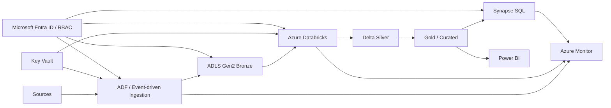
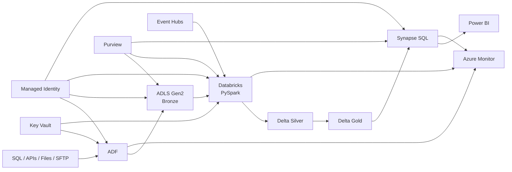

# Azure Data Engineering — Top 35 Senior Data Engineer Interview Questions & Answers

> **Target:** Senior Data Engineer / Data Engineering Lead / Cloud Data Engineer
> **Interview level:** Senior → Staff-style architecture
> **Cloud:** Microsoft Azure
> **Primary stack:** ADF + ADLS Gen2 + Databricks + PySpark + SQL Server + Synapse + Power BI
> **Resume alignment:** Azure Data Platform + Azure Cloud Migration experience

---

# 0. How to Think About Azure Data Engineering

For a 70+ LPA interview, do not answer Azure questions as a list of services.

Think in this sequence:

```text
SOURCE
  │
  ├── SQL / Oracle / SaaS
  ├── APIs
  ├── Files / SFTP
  └── Streaming
       │
       ▼
┌─────────────────┐
│ Azure Data      │
│ Factory         │
│ Orchestration   │
└────────┬────────┘
         │
         ▼
┌─────────────────┐
│ ADLS Gen2       │
│ Raw / Bronze    │
└────────┬────────┘
         │
         ▼
┌─────────────────┐
│ Databricks      │
│ PySpark / Scala │
│ Transform       │
└────────┬────────┘
         │
         ▼
┌─────────────────┐
│ Delta / Silver  │
│ Gold / Curated  │
└────────┬────────┘
         │
         ├──────────────► Synapse / SQL
         │
         └──────────────► Power BI
```

The key senior-level concepts are:

* **Orchestration**
* **Storage**
* **Compute**
* **Transformation**
* **Data modeling**
* **Security**
* **Observability**
* **Reliability**
* **Cost**
* **CI/CD**
* **Data quality**
* **Idempotency**

Azure Data Factory is Microsoft's cloud data-integration service for orchestrating data movement and transformation, and it can invoke compute such as Azure Databricks.

---

# 1. Design an End-to-End Azure Data Engineering Platform

### Best answer

I would separate the platform into ingestion, storage, transformation, serving, orchestration, governance, and monitoring.

### Architecture



### Senior answer points

* **ADF** → orchestration and ingestion.
* **ADLS Gen2** → scalable lake storage.
* **Databricks** → distributed transformation using Spark.
* **Delta Lake** → reliable lakehouse tables.
* **Synapse** → SQL analytics / serving where required.
* **Power BI** → reporting.
* **Key Vault + Managed Identity** → secrets and authentication.
* **Azure Monitor / Log Analytics** → operational visibility.
* **Purview** → catalog, governance and lineage.
* Use **metadata-driven pipelines** instead of hard-coded pipelines.
* Design every pipeline for **restartability and idempotency**.

### Follow-up

**Why not put everything in Synapse?**

* Data lake is better for flexible raw/semi-structured storage.
* Databricks is well suited to large-scale distributed transformation.
* Synapse SQL can serve structured analytical workloads.
* The architecture should be workload-driven rather than service-driven.

Azure Synapse SQL separates storage and compute and uses distributed processing; serverless SQL can query lake data directly.

---

# 2. Explain Azure Data Factory Architecture

### Best answer

ADF is primarily an **orchestration and integration layer**.

Core concepts:

```text
ADF
│
├── Pipelines
├── Activities
├── Datasets
├── Linked Services
├── Integration Runtime
├── Triggers
└── Parameters / Variables
```

ADF can move data, orchestrate workflows, execute transformations, call external compute and monitor pipeline executions.

### Pointer answer

* Pipeline → workflow container.
* Activity → individual operation.
* Linked Service → connection definition.
* Dataset → logical representation of data.
* Integration Runtime → execution/connectivity infrastructure.
* Trigger → determines when pipeline runs.
* Parameters → make pipelines reusable.
* Variables → runtime state within pipeline execution.

### Follow-up

**Is ADF itself a Spark engine?**

No.

ADF can execute Mapping Data Flows on ADF-managed Spark compute or orchestrate external services such as Azure Databricks.

---

# 3. What Is Integration Runtime?

### Best answer

Integration Runtime, or IR, is the compute/connectivity infrastructure used by ADF for data integration workloads.

ADF uses IR for:

* Data movement
* Data Flow execution
* Connectivity to different network environments
* SSIS execution
* Dispatching work to external compute

Microsoft documents Azure IR, self-hosted IR and Azure-SSIS IR as the main models used for these scenarios.

### When I choose each

**Azure IR**

* Cloud-to-cloud
* Public Azure-accessible endpoints
* Managed execution

**Self-hosted IR**

* On-premises sources
* Private network
* Custom network connectivity

**Azure-SSIS IR**

* Existing SSIS workloads requiring Azure hosting.

### Interview trap

Do not say:

> "Self-hosted IR is required for every secure Azure-to-Azure connection."

It is not.

The decision depends on connectivity and network architecture.

---

# 4. Pipeline vs Dataset vs Linked Service

### Easy interview answer

```text
Linked Service
     ↓
Connection

Dataset
     ↓
Data structure / location

Pipeline
     ↓
Execution logic
```

### Example

For SQL Server → ADLS:

```text
Linked Service
   SQL Server connection

Dataset
   customer table

Pipeline
   Lookup → Copy → Validation → Audit
```

### Senior point

Keep connection information separate from pipeline logic so that:

* environments can change,
* pipelines remain reusable,
* secrets are centralized,
* deployment is easier.

---

# 5. Mapping Data Flow vs Azure Databricks

### Best answer

ADF Mapping Data Flow is a visual transformation framework executed on scaled-out Spark clusters managed by ADF.

Azure Databricks provides a more code-centric Spark environment with broader engineering flexibility.

| Requirement                     | Mapping Data Flow | Databricks |
| ------------------------------- | ----------------- | ---------- |
| Low-code ETL                    | Excellent         | Moderate   |
| Complex PySpark                 | Limited           | Excellent  |
| Custom Spark logic              | Limited           | Excellent  |
| Advanced optimization           | Moderate          | Excellent  |
| Data science                    | Limited           | Strong     |
| Reusable libraries              | Moderate          | Strong     |
| Team already using Python/Scala | Less ideal        | Strong     |

### My decision

Use Mapping Data Flow when:

* transformation is relatively straightforward,
* low-code development is valuable,
* ADF-native transformation is sufficient.

Use Databricks when:

* transformations are complex,
* Spark optimization matters,
* reusable Python/Scala code is required,
* lakehouse processing is central.

---

# 6. Explain ADF Triggers

ADF supports three major trigger categories:

```text
Schedule
Tumbling Window
Event-based
```

### Schedule trigger

Runs based on wall-clock scheduling.

Example:

```text
Every day at 2 AM
```

### Tumbling Window

* Fixed
* Non-overlapping
* Contiguous windows
* Maintains state
* Useful for time-windowed processing
* Supports backfill scenarios

### Event-based

Pipeline starts because an event occurs.

Example:

```text
File arrives
     ↓
Event
     ↓
ADF Pipeline
```

Microsoft documents schedule, tumbling-window and event-based trigger types for ADF.

### Follow-up

**Which trigger would you consider for reliable interval processing?**

Tumbling window is useful when the processing window itself is part of the stateful workload and backfill/reliability matter.

---

# 7. How Would You Build a Metadata-Driven ADF Framework?

### This is a high-value question for you.

Your resume emphasizes reusable/configuration-driven data validation frameworks and Azure data-platform automation.

### Architecture

```text
Metadata Table / YAML / JSON
          │
          ▼
     ADF Lookup
          │
          ▼
   ForEach Pipeline
          │
    ┌─────┴─────┐
    ▼           ▼
 Source       Target
 Config       Config
    │           │
    └─────┬─────┘
          ▼
       Copy / ETL
          │
          ▼
     Validation
          │
          ▼
        Audit
```

### Metadata example

```json
{
  "source": "sqlserver",
  "source_table": "customer",
  "target": "adls",
  "target_path": "silver/customer",
  "load_type": "incremental",
  "watermark_column": "updated_at"
}
```

### Senior benefits

* Add new tables without creating new pipelines.
* Centralized configuration.
* Environment-independent deployment.
* Standardized error handling.
* Easier governance.
* Easier onboarding.

### Golden statement

> "I prefer metadata-driven orchestration because pipeline logic should remain stable while table-specific behavior belongs in configuration."

---

# 8. How Do You Implement Incremental Load in ADF?

### Common watermark pattern

```text
Last Successful Watermark
          │
          ▼
     Source Query
WHERE updated_at > last_watermark
          │
          ▼
       Extract
          │
          ▼
       Validate
          │
          ▼
       Load
          │
          ▼
Update Watermark
```

### Example

```sql
SELECT *
FROM customer
WHERE updated_at > :last_watermark
  AND updated_at <= :current_watermark;
```

### Why use two boundaries?

Because it gives a deterministic batch window:

```text
(last_watermark, current_watermark]
```

### Senior considerations

* Maintain watermark in metadata/audit storage.
* Update watermark only after successful processing.
* Make target writes idempotent.
* Handle late-arriving data.
* Consider source clock accuracy.
* Handle deletes separately.
* Never advance watermark after partial failure.

---

# 9. How Would You Implement CDC?

### Options

Depending on source technology:

* Source-native CDC.
* Change tracking.
* Timestamp-based incremental extraction.
* Log-based replication.
* Event-driven architecture.

### Conceptual pattern

```text
SOURCE
  │
  │ changes
  ▼
CDC / Incremental Extract
  │
  ▼
ADLS Bronze
  │
  ▼
Databricks
  │
  ▼
MERGE
  │
  ▼
Delta / Curated
```

### Important distinction

Watermarking asks:

> "What changed after timestamp X?"

CDC asks:

> "What insert/update/delete operations happened?"

For production systems with deletes and strict change semantics, source-native CDC can be preferable to a simple timestamp filter.

---

# 10. How Do You Make ADF Pipelines Reliable?

### Best answer

I design for:

```text
Retry
+
Timeout
+
Idempotency
+
Checkpointing
+
Audit
+
Alerting
```

### Retry

Useful for:

* transient network errors,
* throttling,
* temporary service failures.

### Idempotency

Suppose a pipeline fails after writing data.

Retrying should not create duplicates.

Example:

```text
Batch ID = 2026-10-03-01

Retry

NOT

2026-10-03-01
2026-10-03-01
duplicate
```

### Better design

* Write to staging.
* Validate.
* Commit/publish only once.
* Track batch ID.
* Use MERGE/upsert where appropriate.

### Golden statement

> "Retry handles transient failure; idempotency handles the business consequence of retry."

---

# 11. What Is ADLS Gen2?

Azure Data Lake Storage Gen2 combines Azure Storage capabilities with a hierarchical namespace for lake-oriented workloads.

To enable Data Lake Storage capabilities, the storage account uses **hierarchical namespace (HNS)**.

### Mental model

```text
Storage Account
   │
   └── Container / File System
          │
          ├── bronze
          ├── silver
          └── gold
```

### Why useful?

* Large-scale analytical storage.
* Hierarchical directories.
* Fine-grained access control.
* Integration with Azure analytics services.
* Lakehouse architectures.

---

# 12. ADLS Gen2 vs Traditional Blob Storage

### Interview answer

Both are based on Azure Storage, but ADLS Gen2 adds hierarchical namespace capabilities designed for analytics workloads.

```text
Blob Storage
    ↓
Object-oriented storage

ADLS Gen2
    ↓
Object storage
+
Hierarchical namespace
+
Data-lake-oriented access model
```

ADLS capabilities require an account with hierarchical namespace enabled.

### Senior point

Do not think:

> "ADLS is a completely different physical storage service."

Think:

> "ADLS Gen2 is Azure Storage configured with data-lake capabilities, including hierarchical namespace."

---

# 13. How Would You Organize ADLS Partitions?

### Example

```text
/raw/
   orders/
      year=2026/
         month=10/
            day=03/

/silver/
   orders/

/gold/
   daily_sales/
```

### Partition principles

Choose fields commonly used for:

* filtering,
* incremental processing,
* retention,
* data lifecycle,
* parallel processing.

### Avoid

Over-partitioning:

```text
year/month/day/hour/minute/second
```

for datasets that do not require that granularity.

### Small-files problem

Millions of tiny files can hurt:

* listing overhead,
* task scheduling,
* query planning,
* Spark performance.

### Senior answer

> "I design partitions around query and processing patterns, not simply around every available timestamp attribute."

---

# 14. Explain ADLS RBAC vs ACL

There are two important layers:

```text
Azure RBAC
     +
ADLS ACL
```

ADLS Gen2 supports ACLs on files/directories when hierarchical namespace is enabled.

### RBAC

Used for Azure resource/data-plane role assignment depending on the role.

Example concept:

```text
Managed Identity
       ↓
Storage Blob Data Contributor
```

### ACL

Used for more granular path/file permissions.

Example:

```text
/raw/customer
   ├── team-A → read
   └── team-B → read/write
```

### Senior point

Use Azure RBAC as the broader authorization mechanism and ACLs where filesystem/path-level granularity is required.

---

# 15. Key Vault + Managed Identity

### Never hard-code secrets

Bad:

```python
password = "MyPassword123"
```

Better:

```text
ADF / Databricks
       │
       ▼
Managed Identity
       │
       ▼
Microsoft Entra ID
       │
       ▼
Azure Key Vault
       │
       ▼
Secret
```

Azure Key Vault is used to securely store secrets, keys and certificates.

Managed identities let Azure resources obtain Microsoft Entra tokens without developers managing credentials.

### System-assigned identity

* Tied to resource lifecycle.

### User-assigned identity

* Separate identity resource.
* Can be reused across resources.

### Golden statement

> "For machine-to-machine authentication, I prefer managed identity over static credentials whenever the service supports it."

---

# 16. Explain Private Endpoint and VNet Security

A private endpoint creates a network interface with a **private IP address inside the VNet** and connects privately to an Azure Private Link resource.

### Architecture

```text
                 Azure VNet
┌─────────────────────────────────────┐
│                                     │
│   ADF / Databricks                  │
│          │                          │
│          ▼                          │
│   Private Endpoint                  │
│          │                          │
└──────────┼──────────────────────────┘
           │
           ▼
      ADLS / SQL / PaaS
```

### Why?

* Reduce public exposure.
* Private network path.
* Better enterprise security posture.

### Senior follow-ups

Discuss:

* Private DNS.
* Network Security Groups.
* VNet integration.
* Firewall rules.
* Managed VNet where supported.
* Egress control.

Private Link traffic stays on Microsoft's backbone rather than requiring public internet exposure.

---

# 17. Explain Azure Synapse Architecture

Synapse SQL uses a distributed architecture with:

```text
Client
  │
  ▼
Control Node
  │
  ▼
Distributed Query Processing
  │
  ├── Compute Node
  ├── Compute Node
  └── Compute Node
```

For dedicated SQL pools, data is distributed across multiple distributions and Data Movement Service handles movement between compute nodes when required.

### Synapse has multiple analytics patterns

* Dedicated SQL pool.
* Serverless SQL pool.
* Spark-based capabilities.
* Integration with lake storage and other Azure services.

### Senior answer

> "I would choose Synapse based on whether I need provisioned warehouse compute, serverless querying over lake data, Spark processing, or another Azure analytics pattern."

---

# 18. Serverless SQL Pool vs Dedicated SQL Pool

| Feature           | Serverless SQL                        | Dedicated SQL                   |
| ----------------- | ------------------------------------- | ------------------------------- |
| Compute           | Automatically managed                 | Provisioned                     |
| Storage           | Data remains externally/lake-oriented | Warehouse architecture          |
| Best for          | Ad-hoc lake querying                  | Predictable warehouse workloads |
| Idle compute cost | No provisioned warehouse compute      | Can pause                       |
| Performance model | Consumption/query based               | Provisioned capacity            |
| Scaling           | Automatic                             | User-controlled                 |

Every Synapse workspace includes a serverless SQL endpoint that can query data in Azure Data Lake and other supported sources.

Dedicated SQL pools separate compute from storage and can be scaled or paused.

### Golden statement

> "Serverless is attractive when I want to query lake data without maintaining a continuously provisioned warehouse; dedicated SQL is more appropriate when I need controlled, predictable warehouse compute."

---

# 19. Synapse Distribution Strategy

Dedicated SQL pools use distributions for parallel processing.

Main patterns:

```text
HASH
ROUND_ROBIN
REPLICATE
```

### HASH

Use when:

* large tables,
* joins/aggregations,
* good distribution key exists.

### ROUND_ROBIN

Good default/staging option when distribution key is uncertain.

### REPLICATE

Useful for smaller dimension-like tables.

### Main risk

**Data skew**

Example:

```text
Distribution 1 → 10 TB
Distribution 2 → 200 GB
Distribution 3 → 180 GB
```

One node becomes the bottleneck.

### Interview answer

> "I choose a hash key based on cardinality, skew, join patterns and workload—not simply because the column is unique."

Synapse documents hash, round-robin and replicated distribution strategies and specifically highlights skew and query patterns when selecting a distribution column.

---

# 20. COPY vs PolyBase in Synapse

For dedicated SQL pools, Azure Synapse supports both `COPY` and PolyBase loading methods.

### Concept

```text
ADLS
  │
  ▼
COPY / PolyBase
  │
  ▼
Synapse staging
  │
  ▼
Transformation
  │
  ▼
Target warehouse
```

### PolyBase

Historically important for large-scale external data loading.

### COPY

Simple T-SQL-based loading approach.

### Interview answer

> "For Synapse dedicated SQL pool, I would choose the supported bulk-loading method based on source format, credentials, operational requirements and workload; I would not treat row-by-row inserts as the default for large-volume ingestion."

Microsoft describes PolyBase as a highly scalable loading technology for dedicated SQL pools.

---

# 21. Explain Azure Event Hubs

Event Hubs is an event-streaming service built around partitions and consumer groups.

```text
Producers
   │
   ▼
┌────────────────────┐
│ Event Hubs         │
│                    │
│ P0 │ P1 │ P2 │ P3 │
└─┬────┬────┬────┬──┘
  │    │    │    │
  ▼    ▼    ▼    ▼
Consumers
```

Events are assigned to partitions, and consumer groups provide independent logical views of the same event stream.

### Why partitions matter

Partitions provide:

* parallelism,
* ordering within a partition,
* scalable ingestion.

### Important

Ordering is generally partition-scoped, not globally ordered across all partitions.

---

# 22. Event Hubs vs Service Bus

### Event Hubs

Think:

> **High-throughput event streaming**

Use for:

* telemetry,
* logs,
* clickstream,
* IoT,
* streaming analytics.

### Service Bus

Think:

> **Enterprise messaging / commands**

Use for:

* queues,
* commands,
* workflows,
* transactional messaging,
* business messages.

### Memory trick

```text
STREAM → Event Hubs

MESSAGE / COMMAND → Service Bus
```

---

# 23. Azure Databricks Architecture

Azure Databricks provides the Spark-based data engineering environment in your Azure ecosystem.

### Typical architecture

```text
ADF
 │
 ▼
Databricks Job
 │
 ▼
Spark
 │
 ├── Read ADLS
 ├── Transform
 ├── Validate
 └── Write Delta
 │
 ▼
ADLS
```

Your resume explicitly includes Azure Databricks with PySpark and Scala, including automated validation and Azure cloud migration workflows.

### Senior integration points

* ADLS Gen2 storage.
* Microsoft Entra ID.
* Managed identities.
* Azure networking.
* Key Vault.
* ADF orchestration.
* Power BI / SQL serving layers.
* Azure monitoring.

Azure Databricks documentation describes network and private connectivity architectures for Azure deployments.

---

# 24. ADF vs Databricks

This is one of the most common architecture questions.

### ADF

```text
Orchestration
Integration
Scheduling
Dependency management
Monitoring
```

### Databricks

```text
Distributed computation
Spark
PySpark
Scala
Complex transformations
Lakehouse processing
```

### Strong answer

> "ADF tells the system **when and in what sequence** to execute work; Databricks performs the **distributed data processing**."

### Example

```text
ADF
 │
 ├── ingest source
 │
 ├── call Databricks
 │
 ├── validate
 │
 └── notify
          │
          ▼
   Databricks
      Spark
       │
       ▼
   Transform
```

---

# 25. When Would You Use Databricks Instead of Synapse?

### Use Databricks when

* Spark is central.
* PySpark/Scala transformations are complex.
* Large-scale file processing is required.
* Lakehouse architecture is central.
* Data engineering + ML workloads overlap.

### Use Synapse SQL when

* SQL analytics is dominant.
* BI workloads need a warehouse-style serving layer.
* Dedicated SQL workload characteristics justify provisioned warehouse compute.

### Architecture can use both

```text
ADLS
  │
  ▼
Databricks
  │
  ▼
Curated Data
  │
  ▼
Synapse SQL
  │
  ▼
Power BI
```

Do not frame them as mutually exclusive.

---

# 26. Why Delta Lake in Azure Data Engineering?

### Problem

Plain Parquet files do not by themselves provide a full transactional table-management layer.

Delta Lake adds lakehouse table capabilities.

### Mental model

```text
ADLS
 │
 ├── Parquet data
 │
 └── Delta transaction log
```

### Benefits

* ACID-style transactional behavior.
* Schema management.
* Version/history capabilities.
* MERGE/upsert patterns.
* Better reliability for concurrent data workflows.

### Typical architecture

```text
Bronze
  ↓
Delta
  ↓
Silver
  ↓
Delta
  ↓
Gold
  ↓
SQL / BI
```

### Resume connection

Your Azure migration work includes Databricks/PySpark transformation and reconciliation across migrated datasets.

---

# 27. How Would You Handle Real-Time Data on Azure?

### Architecture

```text
Applications / Devices
          │
          ▼
     Event Hubs
          │
          ▼
 Databricks Streaming /
 Stream Processing
          │
          ▼
      ADLS / Delta
          │
          ▼
   Serving / Analytics
```

Event Hubs provides durable, partitioned event ingestion and supports consumer groups for independent processing applications.

### Senior considerations

Discuss:

* partition-key design,
* consumer parallelism,
* checkpointing,
* late-arriving events,
* replay,
* idempotency,
* schema evolution,
* dead-letter/error handling,
* monitoring.

---

# 28. What Is Microsoft Purview Used For?

Think:

```text
DISCOVER
   +
GOVERN
   +
LINEAGE
```

Purview can represent lineage between data systems and transformations and is useful for troubleshooting, data-quality analysis, compliance and impact analysis.

### Typical enterprise flow

```text
ADF ───────┐
           │
Databricks ├──► Purview
           │
ADLS ──────┤
           │
Power BI ──┘
```

### What I want from governance

* Who owns this dataset?
* Where did it originate?
* What transformed it?
* Who consumes it?
* What breaks if I change it?
* Is sensitive data present?

### Interview distinction

Purview is not your ETL engine.

It is primarily part of the **governance/catalog/lineage** layer.

---

# 29. Azure Monitor + Log Analytics

### Observability architecture

```text
ADF
Databricks
Synapse
Storage
Functions
   │
   ▼
Azure Monitor
   │
   ▼
Log Analytics
   │
   ├── Queries
   ├── Alerts
   ├── Dashboards
   └── Incident analysis
```

Log Analytics provides the query interface over Azure Monitor Logs and supports KQL for advanced analysis.

### Pipeline observability should track

* success/failure,
* duration,
* throughput,
* input/output rows,
* retries,
* error categories,
* freshness,
* SLA status,
* data-quality failures.

### Senior answer

> "Monitoring tells me that a pipeline failed; good observability should help me identify why, what data was affected, and whether downstream consumers are impacted."

---

# 30. Azure Functions in Data Engineering

Azure Functions is a serverless platform for event-driven code and supports triggers and bindings to connect with other services.

### Good DE use cases

* Lightweight event processing.
* File arrival logic.
* Calling APIs.
* Validation hooks.
* Metadata updates.
* Notification logic.
* Custom control-plane automation.

### Avoid

Using Functions for:

```text
Huge distributed ETL
Massive Spark transformations
Long-running heavy batch processing
```

For that, use Databricks or another appropriate compute platform.

---

# 31. Event Grid vs Event Hubs

### Event Grid

Think:

> **Event notification / event routing**

Example:

```text
Blob Created
    ↓
Event Grid
    ↓
Function / ADF / subscriber
```

### Event Hubs

Think:

> **High-throughput event streaming**

```text
Millions of events
       ↓
 Event Hubs
       ↓
Partitions
       ↓
Consumers
```

Event Grid supports event-driven architectures and multiple event delivery patterns, while Event Hubs is designed around high-throughput partitioned event streaming.

### Memory trick

```text
"Something happened"
      → Event Grid

"Here is a stream of events"
      → Event Hubs
```

---

# 32. How Do You Implement CI/CD for ADF?

### Dev → Test → Prod

```text
Developer
   │
   ▼
Git Repository
   │
   ▼
Pull Request
   │
   ▼
CI Validation
   │
   ▼
Build / ARM artifacts
   │
   ▼
TEST
   │
   ▼
Approval
   │
   ▼
PROD
```

ADF supports CI/CD workflows using Azure DevOps and GitHub. Microsoft documents deployment of ADF resources through Resource Manager-based deployment patterns.

### Good practice

Environment-specific values should not be hard-coded.

Example:

```text
DEV_STORAGE
TEST_STORAGE
PROD_STORAGE
```

These should be injected through deployment configuration/parameters.

### Senior points

* PR review.
* Automated validation.
* Deployment artifacts.
* Environment parameterization.
* Secrets outside source control.
* Approval gates.
* Rollback strategy.
* Smoke test after deployment.

---

# 33. Design Secure Azure Data Architecture

### Security layers

```text
Identity
   ↓
Microsoft Entra ID
   ↓
RBAC
   ↓
Managed Identity
   ↓
Key Vault
   ↓
Private Endpoints
   ↓
Network Controls
   ↓
ADLS ACL
   ↓
Data Governance
```

### Senior checklist

**Identity**

* Managed Identity.
* Microsoft Entra ID.
* Least privilege.

**Storage**

* RBAC.
* ACLs.
* Encryption.
* Data classification.

**Network**

* VNet.
* Private Endpoint.
* Private DNS.
* Firewall/network controls.

**Secrets**

* Key Vault.
* No passwords in code.

**Governance**

* Purview.
* Lineage.
* Ownership.
* Auditability.

Azure's Well-Architected Framework organizes architecture around reliability, security, cost optimization, operational excellence and performance efficiency.

---

# 34. How Do You Optimize Azure Data Engineering Cost?

### Think in this order

```text
Reduce unnecessary data
        ↓
Reduce unnecessary compute
        ↓
Improve workload efficiency
        ↓
Schedule / pause when appropriate
        ↓
Monitor actual utilization
```

### ADF

* Avoid unnecessary pipeline activity.
* Use metadata-driven frameworks.
* Batch operations.
* Avoid excessive orchestration overhead.

### ADLS

* Manage data lifecycle.
* Use suitable formats.
* Avoid millions of tiny files.
* Partition appropriately.

### Databricks

* Right-size clusters.
* Avoid idle compute.
* Optimize Spark jobs.
* Control shuffle and data movement.
* Use appropriate cluster/job architecture.

### Synapse

* Scale dedicated compute according to workload.
* Pause dedicated compute when not needed.
* Use suitable distribution and loading strategy.

Dedicated Synapse SQL pools can be paused to stop compute billing while retaining storage.

### Senior answer

> "I don't optimize cloud cost by simply choosing the cheapest SKU. I optimize the entire data lifecycle—storage, compute, data movement, query patterns, scheduling and utilization."

---

# 35. Design a Production Azure Data Platform for 5 TB/day

This is the **must-practice architecture question**.

### Requirement

```text
5 TB/day
Batch + Incremental
Enterprise security
Analytics + Power BI
High reliability
Data quality
Observability
```

### Architecture



## My design

### 1. Ingestion

ADF handles:

* batch ingestion,
* incremental extraction,
* metadata-driven execution,
* dependencies,
* retries.

For event streams:

* Event Hubs.

### 2. Storage

ADLS Gen2:

```text
/raw
/bronze
/silver
/gold
```

Use Parquet/Delta-oriented storage.

### 3. Transformation

Databricks:

* PySpark.
* Scala where required.
* Distributed transformation.
* Data-quality checks.
* Reconciliation.
* Incremental processing.

### 4. Data quality

Implement:

```text
Row Count
Column Count
Schema
Data Types
Nulls
Duplicates
Business Rules
Data Reconciliation
Freshness
```

This directly aligns with the validation framework experience in your resume, which includes row-count, schema, null, duplicate, empty-string and value-comparison checks.

### 5. Serving

Use:

* Synapse SQL for warehouse-style analytical consumption where justified.
* Power BI for reporting.

### 6. Security

* Managed identities.
* Key Vault.
* RBAC.
* ADLS ACLs where necessary.
* Private Endpoints.
* Network isolation.

### 7. Observability

Monitor:

```text
Pipeline status
Job status
Latency
Rows
Throughput
Data quality
Freshness
SLA
Failures
Cost
```

### 8. Reliability

Every processing unit should have:

```text
Batch ID
Watermark
Audit Record
Retry
Idempotency
Error Handling
Replay Strategy
```

### 9. CI/CD

```text
GitHub / Azure DevOps
       ↓
ADF CI/CD
       ↓
DEV
       ↓
TEST
       ↓
PROD
```

ADF supports Git-based CI/CD patterns and Azure Resource Manager deployment workflows.

---

# Azure Interview Follow-Up Questions You Must Be Ready For

After you answer the 35 questions, an interviewer may immediately ask:

### ADF

* How do you pass dynamic parameters?
* How does `ForEach` affect concurrency?
* How do you implement dependency handling?
* What happens when a copy activity fails halfway?
* How do you restart only the failed portion?
* Schedule vs tumbling window?
* How do you implement metadata-driven ingestion?
* How do you maintain pipeline audit history?

### ADLS

* Why Parquet?
* Why Delta?
* How do you solve small files?
* How do you choose partitions?
* RBAC vs ACL?
* How do you secure a storage account?
* How do you handle schema evolution?

### Databricks

* Why Spark?
* How do you optimize a slow PySpark job?
* What causes shuffle?
* How do you solve data skew?
* How do you handle incremental Delta loads?
* How do you implement MERGE?
* How do you design Bronze/Silver/Gold?

### Synapse

* Round-robin vs hash distribution?
* What is data movement?
* What causes skew?
* Dedicated vs serverless?
* How do you bulk-load?
* How do you tune a slow query?

### Security

* Managed identity vs service principal?
* Key Vault vs environment variables?
* RBAC vs ACL?
* Private Endpoint vs public endpoint?
* How do you secure production data?

### Production

* What is your RPO/RTO?
* How do you replay failed data?
* How do you detect missing data?
* How do you prove zero data loss?
* How do you handle duplicate files?
* How do you monitor SLA?

---

# Your Azure Resume Story Bank

Your resume gives you several strong stories to use instead of generic interview examples.

## Story 1 — Azure Data Platform

**Client:** Zee Media
**Stack:** ADF + Databricks + ADLS + SQL Server + PySpark + Scala + Power BI

Your documented work includes:

* Azure cloud data platform validation.
* ADF pipeline validation.
* Databricks automation.
* PySpark/Scala.
* ADLS.
* SQL Server.
* Power BI.
* Collaboration with architecture and DevOps teams.

### Interview narrative

```text
Source
 ↓
ADF
 ↓
ADLS
 ↓
Databricks
 ↓
Transformation
 ↓
SQL / BI
 ↓
Data validation
 ↓
Power BI
```

---

# Story 2 — Azure Cloud Migration

**Client:** Forever New

Your resume documents:

* On-prem → Azure migration.
* Azure Data Lake.
* Databricks.
* MS SQL.
* Power BI.
* PySpark-based validation.
* Reconciliation.
* Migration test architecture.
* Migration sign-off.

### Best interview opening

> "In one of my Azure migration programs, my responsibility went beyond validating individual ETL jobs. I looked at the source-to-target migration as an end-to-end data reconciliation problem, including transformation correctness and downstream reporting accuracy."

That is a much stronger senior answer than:

> "I tested ADF pipelines."

---

# Story 3 — Data Quality as an Engineering Capability

Your resume documents a reusable framework covering:

```text
File → Table
Table → Table
File → File
Tableau → Tableau
Tableau → Redshift
```

with checks including:

```text
Record Count
Column Count
Metadata Types
Duplicates
Nulls
Empty Strings
Data Values
```

### Connect this to Azure

Say:

> "My approach to Azure data engineering is not to treat ingestion and transformation as sufficient. I also establish automated reconciliation and quality gates so that downstream analytical datasets are trusted."

---

# Azure Service Decision Tree

```text
Need orchestration?
       │
       └── ADF

Need lake storage?
       │
       └── ADLS Gen2

Need Spark transformation?
       │
       └── Databricks

Need SQL analytics?
       │
       ├── Serverless Synapse
       └── Dedicated Synapse SQL

Need event streaming?
       │
       └── Event Hubs

Need event notification?
       │
       └── Event Grid

Need secrets?
       │
       └── Key Vault

Need workload identity?
       │
       └── Managed Identity

Need private connectivity?
       │
       └── Private Endpoint / Private Link

Need data governance?
       │
       └── Purview

Need logs / observability?
       │
       └── Azure Monitor + Log Analytics

Need lightweight event-driven code?
       │
       └── Azure Functions
```

---

# 10 Golden Azure Interview Statements

Memorize these.

### 1

> **"ADF is primarily my orchestration and integration layer; Databricks is my distributed processing engine."**

### 2

> **"I design pipelines to be metadata-driven, parameterized, idempotent and restartable."**

### 3

> **"I choose partitioning based on access patterns and workload characteristics, not merely on timestamp availability."**

### 4

> **"Retry handles transient failures; idempotency prevents retry from becoming a data-quality problem."**

### 5

> **"Managed Identity removes the need to manage long-lived application credentials."**

### 6

> **"Private Endpoint gives a private IP-based connection from the VNet to a Private Link-enabled service."**

### 7

> **"Serverless Synapse is useful for querying lake data without provisioning a dedicated warehouse compute pool."**

### 8

> **"For distributed warehouses, distribution-key selection must consider skew, cardinality and join patterns."**

### 9

> **"Observability should tell me not just that a job failed, but why it failed, what data was affected and whether downstream SLAs are at risk."**

### 10

> **"For enterprise data platforms, I optimize the combination of correctness, reliability, performance, security and cost rather than optimizing one service in isolation."**

Azure's Well-Architected guidance explicitly frames these cross-cutting decisions around reliability, security, cost optimization, operational excellence and performance efficiency.

---

# Final Azure Whiteboard

Before an interview, practice drawing this from memory in under 3 minutes:

```text
                    ┌───────────────────┐
                    │     SOURCES       │
                    │ SQL/API/File/SFTP │
                    └─────────┬─────────┘
                              │
                              ▼
                    ┌───────────────────┐
                    │       ADF         │
                    │ Orchestration     │
                    │ Incremental/CDC   │
                    └─────────┬─────────┘
                              │
                              ▼
                    ┌───────────────────┐
                    │    ADLS Gen2      │
                    │ Bronze / Raw      │
                    └─────────┬─────────┘
                              │
                              ▼
                    ┌───────────────────┐
                    │    DATABRICKS     │
                    │ PySpark / Scala   │
                    │ Transformations   │
                    └─────────┬─────────┘
                              │
                              ▼
                    ┌───────────────────┐
                    │ Delta Silver/Gold │
                    └─────────┬─────────┘
                              │
                     ┌────────┴────────┐
                     ▼                 ▼
              ┌─────────────┐   ┌─────────────┐
              │   SYNAPSE   │   │  Analytics  │
              │ SQL Serving │   │ / Other BI  │
              └──────┬──────┘   └─────────────┘
                     │
                     ▼
                ┌───────────┐
                │ Power BI  │
                └───────────┘


Security:
Managed Identity + RBAC + ACL + Key Vault
+ Private Endpoint + Network Controls

Governance:
Purview

Observability:
Azure Monitor + Log Analytics

Deployment:
GitHub / Azure DevOps + CI/CD
```

## What a 70+ LPA interviewer is really testing

They are usually not checking whether you can simply define ADF, ADLS or Databricks.

They are testing whether you can reason about:

```text
Scale
Reliability
Correctness
Failure recovery
Data quality
Security
Performance
Cost
Architecture trade-offs
Production operations
```

Your Azure experience gives you particularly strong interview stories around **ADF + ADLS + Databricks + PySpark + migration + reconciliation + BI validation**, so those should be the center of your answers rather than trying to present yourself as having deep production experience with every Azure service.
