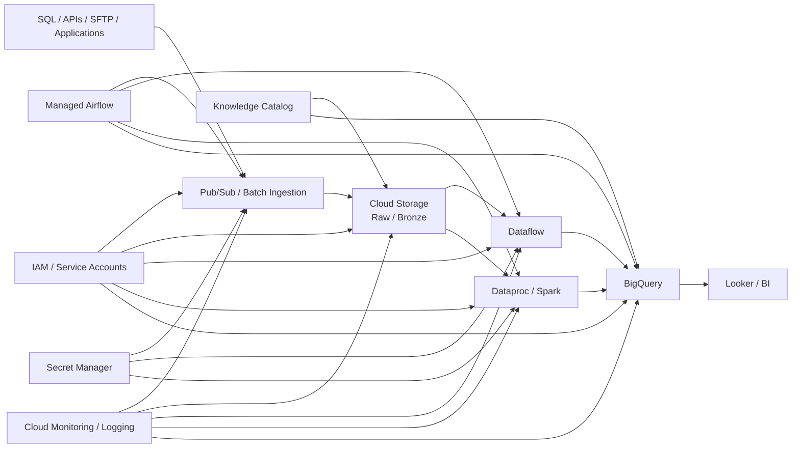
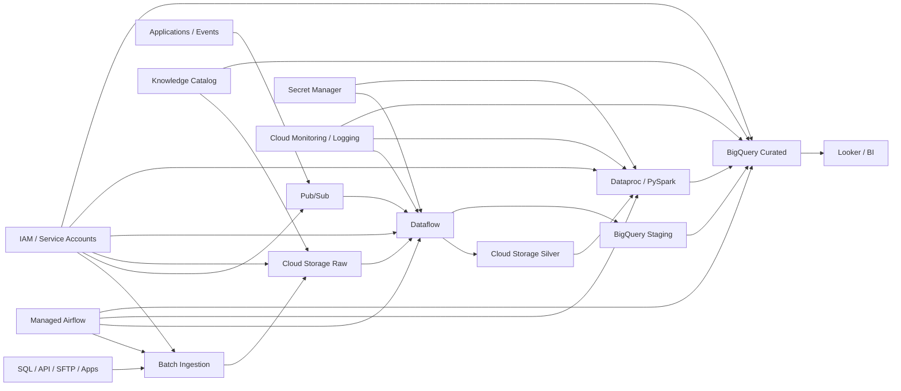

# GCP Data Engineering — Top 35 Senior Data Engineer Interview Questions & Answers

> **Target:** Senior Data Engineer / Data Engineering Lead / Cloud Data Engineer
> **Interview level:** Senior → Staff-style architecture
> **Cloud:** Google Cloud Platform
> **Primary stack:** Cloud Storage + BigQuery + Dataflow + Dataproc + Managed Service for Apache Airflow + Pub/Sub
> **Resume alignment:** GCS + BigQuery + Dataflow + Composer + Dataproc + PySpark + Looker + migration/data-quality engineering

Your resume specifically documents GCP work across **GCS, BigQuery, Dataflow, Cloud Composer, Dataproc, Python, PySpark and Looker**, including ETL validation, reconciliation, API/SFTP ingestion and analytics/reporting validation.

---

# 0. How to Think About GCP Data Engineering

Don't memorize GCP services independently.

Think in layers:

```text
                    ┌─────────────────────────┐
                    │        SOURCES          │
                    │ DB / API / SFTP / Apps  │
                    └────────────┬────────────┘
                                 │
                         ┌───────▼───────┐
                         │    Pub/Sub    │
                         │  Streaming    │
                         └───────┬───────┘
                                 │
                  ┌──────────────┴──────────────┐
                  │                             │
           ┌──────▼──────┐               ┌──────▼──────┐
           │   Dataflow  │               │ Batch Load  │
           │ Beam / ETL  │               │ / Transfer  │
           └──────┬──────┘               └──────┬──────┘
                  │                             │
                  └──────────────┬──────────────┘
                                 ▼
                       ┌─────────────────┐
                       │ Cloud Storage   │
                       │ Data Lake       │
                       └────────┬────────┘
                                │
                  ┌─────────────┴─────────────┐
                  ▼                           ▼
          ┌───────────────┐           ┌──────────────┐
          │   Dataproc    │           │   BigQuery   │
          │ Spark/PySpark │           │ Data Warehouse│
          └───────┬───────┘           └───────┬──────┘
                  │                           │
                  └─────────────┬─────────────┘
                                ▼
                       ┌─────────────────┐
                       │ Looker / BI     │
                       └─────────────────┘

Orchestration:
Managed Service for Apache Airflow

Security:
IAM + Service Accounts + Workload Identity
+ Secret Manager + VPC / Private connectivity

Governance:
Knowledge Catalog

Observability:
Cloud Monitoring + Cloud Logging
```

BigQuery is a fully managed, serverless analytical data platform with columnar storage and separated compute/storage concerns.

---

# 1. Design an End-to-End GCP Data Platform

### Best answer

I would separate the architecture into:

* **Ingestion**
* **Storage**
* **Processing**
* **Warehouse/Serving**
* **Orchestration**
* **Governance**
* **Security**
* **Observability**

### Architecture



### Senior answer

* Cloud Storage → durable lake/object storage.
* Pub/Sub → asynchronous event ingestion.
* Dataflow → streaming/batch transformation.
* Dataproc → Spark/PySpark workloads.
* BigQuery → analytical warehouse.
* Managed Airflow → orchestration.
* Looker → analytics.
* IAM/service accounts → authorization.
* Secret Manager → secrets.
* Knowledge Catalog → governance and lineage.
* Cloud Monitoring/Logging → observability.

### Golden statement

> "I choose the GCP service based on the workload rather than forcing every workload into one processing engine."

---

# 2. Explain BigQuery Architecture

### Best answer

BigQuery is a fully managed serverless analytical platform.

Its architecture is designed around:

```text
Storage
   +
Distributed Compute
   +
SQL Analytics
```

BigQuery stores data in a columnar format optimized for analytical workloads, while its serverless model removes the need to provision traditional warehouse infrastructure.

### Query flow

```text
SQL
 │
 ▼
BigQuery Query Engine
 │
 ▼
Execution Plan
 │
 ├── Stage 1
 ├── Stage 2
 ├── Stage 3
 └── Stage N
 │
 ▼
Result
```

BigQuery generates an execution tree with stages and parallelizes query execution.

### Why this matters

As an engineer I focus on:

* bytes scanned,
* partition pruning,
* clustering,
* join strategy,
* data volume,
* slot/capacity utilization,
* repeated aggregations.

---

# 3. What Is Cloud Storage and How Does It Fit Into a Data Lake?

Cloud Storage is Google Cloud's managed object storage service. Data is stored as objects inside buckets.

### Data lake pattern

```text
gs://enterprise-data/
│
├── raw/
│
├── bronze/
│
├── silver/
│
├── gold/
│
├── quarantine/
└── archive/
```

### Typical responsibilities

**Raw**

* Preserve source data.
* Minimal transformation.

**Bronze**

* Standardized ingestion.
* Metadata/audit information.

**Silver**

* Cleansed data.
* Validated and normalized.

**Gold**

* Business-ready curated datasets.

### Senior point

Treat the raw zone as an auditable landing layer instead of immediately overwriting source data with transformed outputs.

---

# 4. How Would You Design a Cloud Storage Data Lake?

### Example

```text
gs://company-data/
    │
    ├── raw/
    │   └── customer/
    │       └── year=2026/
    │           └── month=10/
    │
    ├── silver/
    │   └── customer/
    │
    └── gold/
        └── customer_analytics/
```

### Principles

* Organize by business/domain.
* Separate lifecycle zones.
* Partition large datasets where access patterns justify it.
* Prefer analytics-friendly formats such as Parquet.
* Avoid excessive small files.
* Keep raw data immutable where practical.
* Establish retention/lifecycle policies.
* Store bad records separately.

Cloud Storage supports lifecycle rules and multiple storage classes, allowing storage strategy to reflect access patterns.

---

# 5. What Is Hierarchical Namespace in Cloud Storage?

Cloud Storage now supports **hierarchical namespace**, which provides filesystem-like folder semantics and atomic folder operations. It must be enabled when the bucket is created and cannot subsequently be changed on that bucket.

### Why interviewers care

Traditional object names can look like:

```text
customer/year=2026/month=10/file.parquet
```

Hierarchical namespace adds stronger directory semantics.

### Senior answer

> "I would enable hierarchical namespace when the workload benefits from filesystem-like directory operations and data-intensive analytics behavior; I wouldn't enable it simply because folders look cleaner."

---

# 6. BigQuery Partitioning vs Clustering

This is a **must-know** question.

## Partitioning

Splits a table into partitions.

Example:

```sql
CREATE TABLE sales
PARTITION BY DATE(order_timestamp)
AS
SELECT * FROM source_sales;
```

A query filtering the partition column can scan only matching partitions, reducing data read and potentially improving cost and performance.

## Clustering

Organizes data within the table based on selected columns.

Example:

```sql
CREATE TABLE sales
PARTITION BY DATE(order_timestamp)
CLUSTER BY customer_id, product_id
AS
SELECT * FROM source_sales;
```

BigQuery recommends partitioning large tables and clustering frequently filtered data to reduce data scanned.

### Memory trick

```text
PARTITION
→ Large-scale pruning

CLUSTER
→ Better block-level organization
```

### Best design

Often:

```text
Partition by date
+
Cluster by frequently filtered/joined columns
```

---

# 7. How Do You Optimize a Slow BigQuery Query?

### My approach

I don't immediately increase capacity.

First:

```text
1. Inspect query plan
2. Check bytes scanned
3. Check partition pruning
4. Check clustering
5. Check joins
6. Check repeated transformations
7. Check materialization opportunities
8. Check slot contention
```

### Typical optimization

```sql
-- Bad
SELECT *
FROM huge_table;

-- Better
SELECT customer_id, order_amount
FROM huge_table
WHERE order_date >= '2026-10-01';
```

### Additional techniques

* Select only required columns.
* Filter early.
* Partition appropriately.
* Cluster appropriately.
* Avoid unnecessary cross joins.
* Pre-aggregate where appropriate.
* Use materialized views for repeated predictable aggregations.
* Consider BI Engine for interactive BI workloads.

BigQuery recommends query-computation optimization techniques including materialized views, BI Engine, search indexes and reducing unnecessary data processed.

---

# 8. How Do You Load Data Into BigQuery?

Major patterns include:

```text
Batch
Streaming
External Query
Transformation-based ELT
```

### Batch

```text
Cloud Storage
     ↓
Load Job
     ↓
BigQuery
```

For large batch loads, BigQuery supports load jobs and Google Cloud documents BigQuery Data Transfer Service for automating loading from supported sources.

### Streaming

```text
Pub/Sub
   ↓
Dataflow
   ↓
BigQuery
```

### Direct streaming

BigQuery Storage Write API supports streaming records into BigQuery. Google recommends the gRPC Storage Write API for new workloads; it supports stronger streaming capabilities including exactly-once semantics.

---

# 9. Explain BigQuery External Tables

An external table lets BigQuery query data that remains outside BigQuery.

Example:

```text
Cloud Storage
     │
     │
     ▼
External Table
     │
     ▼
BigQuery SQL
```

BigQuery supports external tables over sources including Cloud Storage. Querying an external table requires permissions for both the table and the external data source.

### Why use it?

* Data doesn't need to be fully loaded into BigQuery.
* Useful for exploratory workloads.
* Useful when data remains in the lake.
* Useful in lakehouse-style architectures.

### Trade-off

For heavily queried analytical data, materializing into optimized BigQuery tables can provide better workload characteristics.

---

# 10. Explain BigQuery Slots and Capacity

### What is a slot?

Think of a slot as a unit of BigQuery compute capacity used to execute query work.

For capacity-based workloads:

```text
Reservation
     │
     ├── Production
     ├── Development
     └── BI
          │
          ▼
        Slots
```

BigQuery reservations let organizations allocate processing capacity and isolate workloads. Reservations can use baseline and/or autoscaling capacity depending on configuration.

### Why isolate production?

Suppose:

```text
Production queries
+
Developer ad-hoc queries
+
Large ETL jobs
```

all compete for resources.

I can use workload reservations to create clearer resource boundaries.

### Senior answer

> "Capacity management is a workload-management problem, not simply a query-optimization problem."

---

# 11. Dataflow vs Dataproc

### Dataflow

Think:

> Managed data processing with Apache Beam.

Dataflow supports unified batch and streaming processing and automatically manages worker infrastructure.

### Dataproc

Think:

> Managed Spark/Hadoop ecosystem.

Dataproc supports Spark, PySpark, Spark SQL, Hadoop and related technologies.

### Decision table

| Requirement                | Dataflow  | Dataproc  |
| -------------------------- | --------- | --------- |
| Apache Beam                | Excellent | No        |
| Streaming pipelines        | Excellent | Possible  |
| Spark/PySpark              | No        | Excellent |
| Existing Hadoop/Spark code | Limited   | Excellent |
| Managed workers            | Yes       | Yes       |
| Custom Spark ecosystem     | No        | Yes       |

### Golden statement

> "If my processing model is Apache Beam and I want managed batch/stream processing, I consider Dataflow; if my workload is Spark/PySpark/Hadoop-oriented, Dataproc is the natural fit."

---

# 12. Explain Apache Beam Concepts in Dataflow

Dataflow is based on Apache Beam, which provides a unified programming model for batch and streaming pipelines.

### Core concepts

```text
Pipeline
   ↓
PCollection
   ↓
Transform
   ↓
PCollection
```

### Example

```text
Read Pub/Sub
      ↓
Parse
      ↓
Validate
      ↓
Transform
      ↓
Window
      ↓
Aggregate
      ↓
Write BigQuery
```

### Important streaming concepts

* Windowing.
* Watermarks.
* Triggers.
* Late data.
* State.
* Timers.

### Interview distinction

A batch transformation asks:

> "Process the complete dataset."

A streaming transformation asks:

> "Process an unbounded dataset over time."

---

# 13. Explain Windowing and Watermarks

### Why windowing?

Streaming data never ends.

So we create logical windows.

```text
10:00 ───── 10:05
10:05 ───── 10:10
10:10 ───── 10:15
```

### Watermark

A watermark estimates how complete the system believes the event-time stream is.

### Example

```text
Event times:
10:01
10:02
10:07
10:03   ← late
```

If I process based on event time, I need a strategy for late events.

### Senior answer

> "For real-time analytics, I separate event time from processing time and design windowing, watermark and late-data behavior explicitly."

---

# 14. Why Choose Dataflow for Streaming?

### Architecture

```text
Applications
     │
     ▼
Pub/Sub
     │
     ▼
Dataflow
     │
 ┌───┴────┐
 ▼        ▼
BQ       GCS
```

Dataflow provides managed workers, parallel processing and autoscaling for supported workloads. Google documents exactly-once processing as the default for Dataflow streaming pipelines, while at-least-once mode can be enabled when duplicate tolerance is acceptable.

### Senior concerns

* event-time correctness,
* backpressure,
* hot keys,
* late data,
* checkpoint/state behavior,
* dead-letter handling,
* autoscaling,
* downstream write semantics.

---

# 15. Dataproc vs Serverless for Apache Spark

Traditional Dataproc:

```text
Cluster
 ├── Master
 ├── Worker
 └── Worker
```

You manage cluster lifecycle more explicitly.

Serverless for Apache Spark:

```text
Submit PySpark
      ↓
Managed Spark
      ↓
Autoscaled execution
      ↓
Job complete
```

Google Cloud's Serverless for Apache Spark runs batch and interactive Spark workloads without requiring you to provision and manage your own Dataproc cluster.

### Use serverless when

* workloads are batch-oriented,
* ephemeral execution is suitable,
* cluster management should be minimized.

### Use clusters when

* specialized configuration is needed,
* persistent environments are justified,
* workload characteristics require more direct cluster control.

---

# 16. How Would You Optimize a Dataproc Spark Job?

### First diagnose

```text
Is the bottleneck:
│
├── CPU?
├── Memory?
├── Shuffle?
├── Network?
├── Disk?
├── Skew?
└── Data layout?
```

### Spark-level techniques

* Avoid unnecessary shuffles.
* Filter early.
* Select only required columns.
* Broadcast small dimensions when appropriate.
* Repartition intentionally.
* Handle data skew.
* Use appropriate file formats.
* Control partition count.
* Avoid excessive `collect()`.
* Cache only when reuse justifies memory.
* Analyze Spark UI.

### Example

Bad:

```python
df.collect()
```

Better:

```python
df.filter(...).select(...)
```

and keep distributed processing distributed.

---

# 17. How Does Managed Airflow / Cloud Composer Fit Into GCP?

Google's current product terminology is **Managed Service for Apache Airflow**, formerly Cloud Composer. It is a managed Airflow service for creating, scheduling, monitoring and managing workflows.

### Architecture

```text
Managed Airflow
      │
      ├── DAG
      │
      ├── Task
      │
      ├── Sensors
      │
      └── Operators
            │
     ┌──────┼─────────┐
     ▼      ▼         ▼
 Dataflow Dataproc BigQuery
```

### What Airflow should do

* orchestration,
* dependency management,
* retries,
* scheduling,
* workflow state.

### What it should not do

Airflow should not become your giant transformation engine.

Don't put:

```text
10 TB Spark-like processing
```

inside Python operators.

Instead:

```text
Airflow → submit job
```

---

# 18. How Would You Design an Idempotent Airflow DAG?

### Bad

```text
Run DAG
   ↓
INSERT everything
```

Retry may duplicate records.

### Better

```text
DAG
 │
 ├── Identify batch
 │
 ├── Extract
 │
 ├── Stage
 │
 ├── Validate
 │
 ├── MERGE / publish
 │
 └── Audit
```

### Each run has

```text
execution_id
batch_id
source_window
status
start_time
end_time
row_count
error_details
```

### Golden statement

> "An Airflow retry should repeat the workflow safely, not create another copy of the business data."

---

# 19. Explain Pub/Sub Architecture

Pub/Sub is an asynchronous messaging service that decouples publishers from subscribers.

```text
Publisher
   │
   ▼
 Topic
   │
   ├────────────► Subscription A → Dataflow
   │
   ├────────────► Subscription B → BigQuery
   │
   └────────────► Subscription C → Archive
```

### Key concepts

* Publisher.
* Topic.
* Message.
* Subscription.
* Subscriber.
* Acknowledgment.
* Ordering.
* Delivery semantics.

### Important distinction

One topic can support multiple subscriptions, enabling independent consumers.

---

# 20. Pub/Sub Ordering and Exactly-Once Delivery

By default, Pub/Sub provides at-least-once delivery without ordering guarantees. Ordering can be configured using ordering keys, and Pub/Sub also supports exactly-once delivery subscriptions.

### Ordering

Suppose:

```text
customer_id = 101

Event 1
Event 2
Event 3
```

Use the same ordering key when strict ordering is required for that entity.

### Exactly-once

Exactly-once delivery provides semantics where successful acknowledgment prevents redelivery under the documented conditions.

### Senior point

Exactly-once messaging does **not** mean your entire end-to-end business pipeline automatically becomes exactly-once.

You still need:

* idempotent transformations,
* deterministic writes,
* deduplication where necessary,
* correct downstream transaction semantics.

---

# 21. Pub/Sub vs Dataflow vs BigQuery

Interviewers sometimes mix these concepts.

```text
Pub/Sub
→ Transport / event ingestion

Dataflow
→ Processing

BigQuery
→ Analytics / warehouse
```

### Example

```text
Application
    │
    ▼
 Pub/Sub
    │
    ▼
Dataflow
    │
 ┌──┴───┐
 ▼      ▼
BQ     GCS
```

### Golden statement

> "Pub/Sub moves events; Dataflow processes events; BigQuery analyzes resulting datasets."

---

# 22. How Would You Implement CDC on GCP?

### Generic architecture

```text
Source DB
    │
    ▼
CDC mechanism
    │
    ▼
Pub/Sub / landing
    │
    ▼
Dataflow
    │
    ▼
BigQuery
```

### CDC record

```json
{
  "operation": "UPDATE",
  "primary_key": 101,
  "event_time": "2026-10-03T12:10:00",
  "data": {
    "name": "Krishna"
  }
}
```

### Target strategy

```text
INSERT → INSERT
UPDATE → MERGE
DELETE → DELETE / soft-delete
```

### Senior concerns

* ordering,
* duplicate events,
* late events,
* delete propagation,
* replay,
* schema evolution,
* source offsets,
* idempotency.

---

# 23. How Do You Implement Incremental Processing in BigQuery?

### Watermark model

```text
Last Successful Watermark
          │
          ▼
     Extract Window
          │
          ▼
     Transform
          │
          ▼
     Validate
          │
          ▼
       MERGE
          │
          ▼
Update Watermark
```

### Example

```sql
MERGE target t
USING staging s
ON t.customer_id = s.customer_id

WHEN MATCHED THEN
  UPDATE SET
    customer_name = s.customer_name,
    updated_at = s.updated_at

WHEN NOT MATCHED THEN
  INSERT (
    customer_id,
    customer_name,
    updated_at
  )
  VALUES (
    s.customer_id,
    s.customer_name,
    s.updated_at
  );
```

### Important

Advance watermark only after:

```text
Extraction succeeded
+
Transformation succeeded
+
Validation succeeded
+
Target publication succeeded
```

---

# 24. How Would You Handle Schema Evolution?

### Possible changes

```text
ADD COLUMN
RENAME COLUMN
CHANGE TYPE
REMOVE COLUMN
NESTED STRUCTURE CHANGE
```

### My approach

Separate:

```text
Compatible changes
vs
Breaking changes
```

### Example

Adding nullable column:

```text
Usually manageable
```

Changing:

```text
INT → incompatible STRING semantics
```

may require migration.

### Production strategy

* Schema registry / contracts where applicable.
* Version input schemas.
* Validate schema before transformation.
* Quarantine incompatible records.
* Maintain backward compatibility when possible.
* Communicate breaking changes to consumers.

### Data-quality gate

```text
Incoming Schema
       │
       ▼
Expected Schema
       │
   ┌───┴────┐
   │        │
 match    mismatch
   │        │
   ▼        ▼
Process   Quarantine
```

---

# 25. How Do You Build Data Quality on GCP?

This is particularly important for your profile.

Your resume documents reusable validation frameworks covering record counts, metadata/schema checks, nulls, duplicates, API/SFTP ingestion validation and downstream reporting.

### GCP quality framework

```text
Source
  ↓
Ingestion
  ↓
Schema Validation
  ↓
Transformation
  ↓
Business Rules
  ↓
Reconciliation
  ↓
BigQuery
  ↓
BI Validation
```

### Checks

```text
Row Count
Column Count
Data Types
Nulls
Duplicates
Referential Integrity
Business Rules
Value Reconciliation
Freshness
Completeness
```

### Reconciliation example

```text
Source Count = 10,000
Target Count = 10,000
        ↓
PASS
```

Then go beyond row count:

```text
SUM(amount)
MIN(date)
MAX(date)
Distinct IDs
Hash checks
```

### Senior answer

> "Row-count reconciliation is necessary but not sufficient; I use control totals and business-level reconciliation for high-value datasets."

---

# 26. Explain IAM and Service Accounts

GCP IAM controls who can access what.

### Human identity

```text
User / Group
```

### Workload identity

```text
Service Account
```

Example:

```text
Dataflow
   ↓
Service Account
   ↓
BigQuery / GCS
```

### Principle

Give only the permissions required.

Bad:

```text
Editor everywhere
```

Better:

```text
Dataflow SA
 ├── BigQuery job access
 ├── Specific dataset access
 └── Storage access
```

### Senior answer

> "I treat service accounts as workload identities and scope their roles to the minimum resources required by the workload."

---

# 27. Service Account Keys vs Workload Identity Federation

Service account keys are long-lived credentials and can create security and maintenance risk.

Workload Identity Federation allows workloads outside Google Cloud—including AWS, Azure, on-premises systems and CI/CD systems—to authenticate using federated identities rather than service-account keys.

### Example

```text
GitHub Actions
       │
       ▼
OIDC Federation
       │
       ▼
Google Cloud IAM
       │
       ▼
GCP Resource
```

### Golden statement

> "For external CI/CD or multi-cloud workloads, I prefer federation over distributing long-lived service-account keys."

---

# 28. What Is Secret Manager?

Secret Manager stores sensitive information such as:

* API keys.
* Passwords.
* Certificates.
* Credentials.

It supports secret versions and IAM-based access control.

### Architecture

```text
Application
    │
    ▼
Service Account
    │
    ▼
Secret Manager
    │
    ▼
Secret Version
```

### Never

```python
password = "prod-password"
```

### Prefer

```text
Application
    ↓
Authenticated API call
    ↓
Secret Manager
```

---

# 29. Private Service Connect vs VPC Service Controls

These solve different problems.

## Private Service Connect

Network connectivity.

```text
VPC
 │
 ▼
Private Service Connect
 │
 ▼
Google-managed service
```

Private Service Connect lets consumers access supported managed services privately using internal IP addresses, without traffic leaving Google Cloud.

## VPC Service Controls

Data-exfiltration protection.

```text
┌─────────────────────────────┐
│       Service Perimeter     │
│                             │
│   BigQuery + Cloud Storage  │
│                             │
└─────────────────────────────┘
```

VPC Service Controls creates service perimeters and controls access across those security boundaries to mitigate data exfiltration risk.

### Memory trick

```text
PSC
→ "How do I privately connect?"

VPC-SC
→ "How do I reduce data exfiltration risk?"
```

---

# 30. How Would You Secure a Production GCP Data Platform?

### Security architecture

```text
                 ┌──────────────────────┐
                 │   Identity / IAM     │
                 └──────────┬───────────┘
                            │
         ┌──────────────────┼───────────────────┐
         ▼                  ▼                   ▼
Service Accounts      Workload Identity   Human Groups
         │
         ▼
   Least Privilege
         │
 ┌───────┼───────────┐
 ▼       ▼           ▼
GCS   BigQuery   Dataflow/Dataproc
 │       │
 └───────┴─────────────┐
                       ▼
                VPC Service Controls
                       +
                Private Connectivity
                       +
                 Secret Manager
```

### Checklist

**Identity**

* IAM.
* Groups.
* Service accounts.
* Workload identity.

**Storage**

* IAM.
* Retention.
* Lifecycle policies.
* Encryption.

**Network**

* VPC.
* Private Service Connect where appropriate.
* Firewall controls.

**Data exfiltration**

* VPC Service Controls.

**Secrets**

* Secret Manager.

---

# 31. Explain Knowledge Catalog / Dataplex Universal Catalog

### Important 2026 terminology

Google Cloud documentation now refers to **Knowledge Catalog**, formerly known as **Dataplex Universal Catalog**.

### What it provides

```text
Discovery
   +
Metadata
   +
Governance
   +
Data Quality
   +
Lineage
```

Google describes Knowledge Catalog as a governance and catalog capability spanning data discovery, metadata, lineage and data-quality controls.

### Example

```text
GCS
 │
 ├── Dataset metadata
 │
BigQuery
 │
 ├── Table metadata
 │
Data Pipelines
 │
 └── Lineage
        │
        ▼
Knowledge Catalog
```

### Business questions

* Who owns this table?
* Where did this field originate?
* Which report consumes it?
* What happens if I change it?
* Is this data trustworthy?

---

# 32. Cloud Monitoring and Cloud Logging

Cloud Monitoring provides metrics, dashboards and alerting for application and Google Cloud service health/performance.

### Monitoring architecture

```text
Dataflow
Dataproc
BigQuery
Composer
GCS
   │
   ▼
Cloud Monitoring
   │
   ├── Metrics
   ├── Dashboards
   └── Alerts

Cloud Logging
   │
   └── Logs / troubleshooting
```

### Data engineering metrics

```text
Pipeline Success %
Pipeline Duration
Data Freshness
Input Rows
Output Rows
Throughput
Error Count
Retry Count
Consumer Lag
BigQuery Bytes Processed
SLA Breaches
```

### Senior statement

> "I define business and technical SLIs rather than relying only on infrastructure CPU and memory metrics."

---

# 33. How Would You Implement CI/CD on GCP?

### Typical flow

```text
Developer
   │
   ▼
GitHub / GitLab
   │
   ▼
Pull Request
   │
   ▼
Cloud Build
   │
   ├── Unit Test
   ├── Static Validation
   ├── Build
   └── Package
   │
   ▼
DEV
   │
   ▼
TEST
   │
   ▼
PROD
```

Cloud Build can execute build steps, run tests/static analysis and use repository-triggered builds for CI/CD workflows.

### Infrastructure

Prefer Infrastructure as Code:

```text
Terraform
    ↓
GCP Resources
```

### Data pipeline code

```text
Git
 │
 ├── Dataflow pipeline
 ├── PySpark code
 ├── Airflow DAGs
 ├── SQL
 └── Terraform
```

### Production practices

* PR review.
* Automated tests.
* Environment parameterization.
* No credentials in source.
* Automated deployment.
* Approval gates for production.
* Rollback/version strategy.

---

# 34. BigQuery ELT with Dataform — When Would You Use It?

This is increasingly relevant for senior GCP interviews.

Dataform is a Google Cloud service for developing, testing, version-controlling and scheduling SQL-based transformations in BigQuery. It supports dependencies, assertions, incremental tables, views and materialized views.

### Architecture

```text
Raw BigQuery Tables
        │
        ▼
     Dataform
        │
        ├── Staging
        ├── Dimensions
        ├── Facts
        ├── Assertions
        └── Documentation
        │
        ▼
Curated BigQuery
        │
        ▼
      Looker
```

### When I use Dataform

* SQL-first transformations.
* BigQuery-native ELT.
* Dependency management.
* Data quality assertions.
* Version-controlled SQL transformations.

### Dataform vs Dataflow

```text
SQL ELT in BigQuery
       → Dataform

Large-scale stream/batch processing
       → Dataflow

Spark/PySpark workload
       → Dataproc
```

---

# 35. Design a Production GCP Architecture for 5 TB/day

This is your **must-practice final architecture question**.

### Requirement

```text
5 TB/day
Batch + Streaming
Data quality
Analytics
Power BI / Looker
High reliability
Security
Observability
Cost control
```

### Architecture



## Layer 1 — Ingestion

### Batch

Use:

* batch loads,
* transfer mechanisms,
* Dataflow,
* appropriate source-specific extraction.

### Streaming

```text
Application
   ↓
Pub/Sub
   ↓
Dataflow
```

Pub/Sub is designed to decouple event producers and consumers, and Google documents Dataflow as a common streaming-processing integration.

---

## Layer 2 — Lake

Cloud Storage:

```text
/raw
/bronze
/silver
/quarantine
/archive
```

Use suitable file formats and lifecycle policies.

Cloud Storage supports lifecycle management and multiple storage classes for different access patterns.

---

## Layer 3 — Processing

### Dataflow

Use for:

* streaming,
* Apache Beam,
* large-scale managed ETL.

### Dataproc

Use for:

* PySpark,
* Spark SQL,
* existing Spark ecosystem,
* complex Spark transformations.

Dataproc is a managed Spark/Hadoop platform, while Serverless for Apache Spark can execute Spark workloads without provisioning a persistent cluster.

---

## Layer 4 — Warehouse

BigQuery:

```text
Raw/Staging
     ↓
Validated
     ↓
Curated
     ↓
Dimensional / Semantic
```

Use:

* partitioning,
* clustering,
* incremental processing,
* materialized views where justified.

Partitioning can reduce bytes read through partition pruning, while clustering can improve block pruning for frequently filtered columns.

---

## Layer 5 — Orchestration

Managed Airflow:

```text
DAG
 │
 ├── Extract
 ├── Validate
 ├── Dataflow
 ├── Dataproc
 ├── BigQuery
 └── Audit
```

Managed Airflow provides scheduling, workflow orchestration, monitoring and management of Airflow workflows.

---

## Layer 6 — Data Quality

Your strongest differentiator should appear here.

```text
                  DATA QUALITY
                       │
        ┌──────────────┼──────────────┐
        ▼              ▼              ▼
   Completeness     Accuracy       Consistency
        │              │              │
        ▼              ▼              ▼
    Row Count      Business Rules  Reconciliation
    Null Checks    Amount checks   Source ↔ Target
    Duplicates     Range checks    Hash/control totals
```

### Example control totals

```text
Source:
Rows       = 50,000
SUM(amount)= 12,400,000

Target:
Rows       = 50,000
SUM(amount)= 12,400,000

Result = PASS
```

---

## Layer 7 — Security

```text
IAM
 │
Service Accounts
 │
Workload Identity
 │
Secret Manager
 │
Private Connectivity
 │
VPC Service Controls
```

VPC Service Controls is particularly relevant when data-exfiltration risk is a core requirement.

---

## Layer 8 — Observability

```text
                 OBSERVABILITY
                      │
      ┌───────────────┼────────────────┐
      ▼               ▼                ▼
   Pipeline         Data             Infra
   Metrics          Quality          Metrics
      │               │                │
      └───────────────┼────────────────┘
                      ▼
             Monitoring / Logging
                      │
                      ▼
                   Alerts
```

---

# GCP Architecture Decision Tree

```text
Need object storage?
        │
        └── Cloud Storage

Need SQL analytics?
        │
        └── BigQuery

Need Apache Beam?
        │
        └── Dataflow

Need Spark / PySpark?
        │
        └── Dataproc

Need Spark without cluster management?
        │
        └── Serverless for Apache Spark

Need orchestration?
        │
        └── Managed Service for Apache Airflow

Need event ingestion?
        │
        └── Pub/Sub

Need secrets?
        │
        └── Secret Manager

Need external workload authentication?
        │
        └── Workload Identity Federation

Need private service connectivity?
        │
        └── Private Service Connect

Need data-exfiltration controls?
        │
        └── VPC Service Controls

Need data governance / lineage?
        │
        └── Knowledge Catalog

Need metrics / alerts?
        │
        └── Cloud Monitoring

Need SQL transformation framework?
        │
        └── Dataform
```

---

# GCP Interview Follow-Up Questions You Must Be Ready For

## BigQuery

* Why partition instead of cluster?
* Can you use both?
* How do you detect partition pruning?
* What causes a query to scan too much data?
* What are slots?
* On-demand vs capacity pricing?
* How do you isolate production workloads?
* When would you use materialized views?
* BigQuery vs Cloud SQL?
* External table vs native BigQuery table?
* How do you implement incremental MERGE?
* How do you handle late-arriving records?

## Dataflow

* Dataflow vs Spark?
* Beam vs Dataflow?
* What is a PCollection?
* What is a watermark?
* What is a window?
* What is a trigger?
* How do you handle late data?
* What causes a hot key?
* Exactly-once vs at-least-once?
* How do you monitor a streaming pipeline?

## Dataproc

* Dataproc vs Dataflow?
* Dataproc vs Serverless Spark?
* How do you handle Spark skew?
* How do you reduce shuffle?
* How do you optimize executors?
* How do you choose partition count?
* How do you manage cluster lifecycle?
* How do you debug a slow Spark stage?

## Pub/Sub

* Topic vs subscription?
* Why multiple subscriptions?
* Ordering key?
* Exactly-once delivery?
* Ack deadline?
* Retry?
* Dead-letter handling?
* How would you replay events?
* Pub/Sub vs Kafka?

## Airflow

* DAG vs task?
* Retry?
* Backfill?
* Catchup?
* Sensors?
* Idempotency?
* XCom?
* How do you prevent duplicate processing?
* How do you handle task dependencies?

## Security

* Service account vs user?
* IAM roles?
* Custom role?
* Secret Manager?
* Workload Identity Federation?
* VPC Service Controls?
* Private Service Connect?
* How do you prevent data exfiltration?

---

# Your GCP Resume Story Bank

## Story 1 — GCP Data Platform

Your resume documents GCP cloud data-platform work using:

```text
GCS
BigQuery
Dataflow
Cloud Composer
Dataproc
Python
PySpark
Looker
```

with reusable QA automation and validation across ingestion, transformation and reporting.

### Interview opening

> "I worked across the GCP data platform from ingestion through analytics validation, using GCS for storage, BigQuery for analytical datasets, Dataflow and Dataproc for processing, Composer for orchestration and Looker for reporting validation."

---

# Story 2 — GCP Data Quality

Your resume specifically mentions:

* ETL/data-quality automation.
* Python.
* Pandas.
* PySpark.
* Reconciliation.
* Validation of API/SFTP ingestion.
* BigQuery datasets.
* Analytics/reporting outputs.

### Strong answer

> "My focus was not limited to validating whether a pipeline completed successfully. I validated whether the data transferred correctly, whether transformation rules were preserved, whether reconciliation matched expectations, and whether downstream reporting remained accurate."

---

# Story 3 — Build a Reusable Framework

This is one of your strongest senior themes.

Instead of:

> "I wrote test cases for one pipeline."

Say:

> "I designed reusable validation components that could be configured for multiple sources, targets and data domains."

### Architecture

```text
                CONFIGURATION
                     │
                     ▼
              Validation Engine
                     │
       ┌─────────────┼─────────────┐
       ▼             ▼             ▼
    GCS/Files    BigQuery       APIs/SFTP
       │             │             │
       └─────────────┼─────────────┘
                     ▼
               Reconciliation
                     │
                     ▼
                HTML / Excel
                  Reports
```

---

# 10 Golden GCP Interview Statements

### 1

> **"Pub/Sub transports events; Dataflow processes them; BigQuery analyzes them."**

### 2

> **"BigQuery performance is strongly influenced by how much data I make the engine read, not just by the SQL syntax."**

### 3

> **"Partitioning helps prune large sections of a table; clustering improves data organization within the table."**

### 4

> **"Dataflow gives me a unified Beam model for batch and streaming processing."**

### 5

> **"Dataproc is my natural choice when the workload is Spark/PySpark-oriented."**

### 6

> **"Exactly-once delivery at the messaging or processing layer does not automatically make every downstream business operation exactly-once."**

### 7

> **"Airflow should orchestrate compute; it should not become the compute engine."**

### 8

> **"I prefer workload identity and short-lived/federated authentication over distributing long-lived service-account keys."**

### 9

> **"Private Service Connect addresses private connectivity, while VPC Service Controls addresses data-exfiltration risk."**

### 10

> **"For data platforms, correctness is a first-class engineering requirement: successful execution does not necessarily mean successful data delivery."**

---

# Final 3-Minute GCP Whiteboard

Memorize this architecture:

```text
                       SOURCES
          ┌──────────────┼───────────────┐
          │              │               │
         SQL            API             SFTP
          │              │               │
          └──────────────┼───────────────┘
                         │
                         ▼
                  ┌─────────────┐
                  │   Pub/Sub   │
                  └──────┬──────┘
                         │
              ┌──────────┴──────────┐
              ▼                     ▼
        ┌────────────┐        ┌─────────────┐
        │  Dataflow  │        │ Batch Load  │
        │ Beam       │        │             │
        └─────┬──────┘        └──────┬──────┘
              │                      │
              └──────────┬───────────┘
                         ▼
                 ┌──────────────┐
                 │ Cloud Storage│
                 │ Raw/Bronze   │
                 └──────┬───────┘
                        │
                 ┌──────┴──────┐
                 ▼             ▼
          ┌────────────┐ ┌──────────────┐
          │  Dataproc  │ │   BigQuery   │
          │  PySpark   │ │   Warehouse  │
          └─────┬──────┘ └───────┬──────┘
                │                │
                └───────┬────────┘
                        ▼
                 Curated Analytics
                        │
                        ▼
                  Looker / BI
```

Around the architecture, draw:

```text
ORCHESTRATION
Managed Airflow

SECURITY
IAM
Service Accounts
Workload Identity
Secret Manager
Private Connectivity
VPC Service Controls

GOVERNANCE
Knowledge Catalog

OBSERVABILITY
Cloud Monitoring
Cloud Logging

QUALITY
Schema
Completeness
Duplicates
Reconciliation
Freshness
Business Rules
```

---

# The Mindset Expected at Senior GCP Interviews

For every architecture question, mentally run this checklist:

```text
1. What is the data volume?
2. Batch or streaming?
3. Latency requirement?
4. Source characteristics?
5. Target characteristics?
6. Processing engine?
7. Data-quality requirements?
8. Failure/retry behavior?
9. Idempotency?
10. Security?
11. Observability?
12. Cost?
13. Scalability?
14. Recovery / replay?
15. Operational ownership?
```

The strongest GCP answer is therefore not:

> "I know BigQuery, Dataflow and Dataproc."

It is:

> "Given the workload, I can explain why I choose each service, how data moves between them, how failures are recovered, how quality is measured, how access is secured, how the workload scales, and how I know the platform is operating correctly."

That is the level of reasoning to practice for senior product-company Data Engineering interviews.
