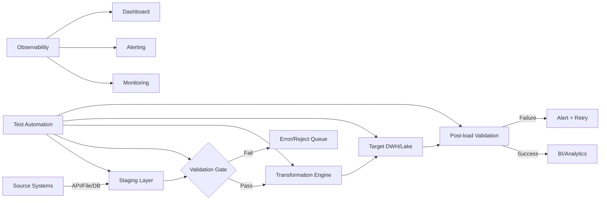
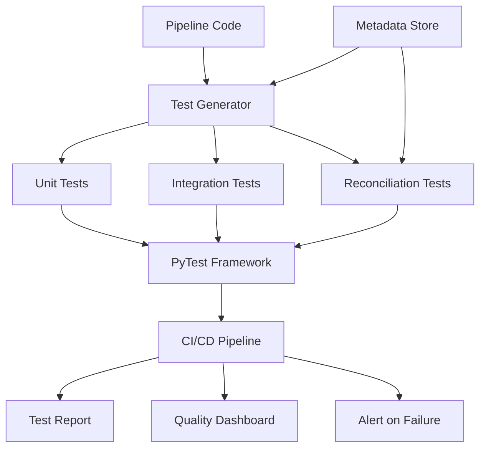

# ETL Testing — Senior Test Engineer / Test Architect Interview Guide

## 1. Interview Expectations at 15+ Years

**What interviewers expect from a 15+ year candidate:**

- Can design end-to-end ETL test strategy for enterprise data pipelines
- Understands batch vs streaming ETL, CDC, idempotency, restartability
- Can debug production data failures with minimal hand-holding
- Knows when to automate vs when to manually test
- Can articulate trade-offs between testing depth, speed, and cost
- Has owned production data quality incidents end-to-end
- Understands the difference between "pipeline succeeded" and "data is correct"

1. **Senior Engineer:** Can write test cases, execute reconciliation, debug failures
2. **Lead:** Can design framework, standardize approach across teams, mentor
3. **Test Architect:** Designs overall test architecture, chooses automation tools, defines quality gates for all pipelines
4. **Staff/Principal:** Influences data strategy across org, defines data quality policy, architects observability

## 2. Technology Overview

ETL (Extract, Transform, Load) and ELT (Extract, Load, Transform) are patterns for moving data between systems. From a testing perspective:

- **What it is:** A pipeline that moves data from source systems to target systems (DWH, lake, analytics)
- **How it works:** Data is extracted from sources (APIs, files, DBs), transformed (business rules, joins, aggregations), loaded into targets
- **Where it used:** Data warehousing, analytics, reporting, ML feature pipelines
- **How it fails:** Silent data corruption, missing records, transformation logic bugs, duplicate loads, schema drift, late data
- **How it should be tested:** Source-to-target reconciliation, business rule validation, completeness checks, idempotency tests, performance tests
- **How it should be automated:** Python/PySpark test frameworks, SQL validation queries, CI/CD integration, data quality gates

## 3. Core Concepts

### ETL vs ELT

- **What:** ETL transforms before loading; ELT loads raw data first, transforms in target
- **Why:** ELT leverages target compute (Snowflake, BigQuery); ETL controls data before entry
- **How:** ETL uses staging layer; ELT uses raw + transformed layers
- **Testing:** ETL — test transformed output; ELT — test raw ingestion + transformation separately
- **Failure Modes:** ETL — transform failure; ELT — raw data corruption propagates
- **Production:** ELT requires stricter raw data governance; ETL may lose source fidelity

### Source-to-Target Validation

- **What:** Comparing source data against target after ETL
- **Why:** Ensures no data loss, corruption, or logic errors
- **How:** Record counts, checksums, hash validation, aggregate comparison, row-level comparison
- **Testing:** Design validation queries for each mapping spec
- **Failure Modes:** Network failures, partial loads, schema changes, encoding issues
- **Production:** Automate daily reconciliation; alert on variance > threshold

### CDC (Change Data Capture)

- **What:** Capturing only changed data since last load
- **Why:** Reduces volume, enables near-real-time pipelines
- **How:** Log-based (Debezium), query-based, trigger-based
- **Testing:** Verify all changes captured, no duplicates, correct watermark
- **Failure Modes:** Missed changes, duplicate CDC entries, watermark reset
- **Production:** Monitor CDC lag; test with snapshot + CDC combined loads

### Idempotency

- **What:** Running pipeline multiple times produces same result
- **Why:** Essential for restartability, retries, backfills
- **How:** Upsert logic, deduplication, deterministic transformations
- **Testing:** Run pipeline twice, compare source and target
- **Failure Modes:** Non-idempotent transformations, auto-increment IDs, timestamps
- **Production:** Critical for large-scale data recovery

### SCD (Slowly Changing Dimensions)

- **What:** Handling historical changes in dimension tables
- **Why:** Business needs historical accuracy
- **How:** SCD1 (overwrite), SCD2 (add row), SCD3 (add column), SCD4/6 variants
- **Testing:** Verify historical records preserved, current flags correct, effective dates valid
- **Failure Modes:** Missing history, duplicate current records, incorrect effective dating
- **Production:** SCD2 most common; test with overlapping effective dates

## 4. ARCHITECTURE



**Components:**
- Source connectors (API, file, DB)
- Staging area (raw landing)
- Validation gates (pre/post transformation)
- Transformation engine (business logic)
- Target system (DWH, lake)
- Error/rejection handling
- Observability layer

**Test points:**
- Ingestion completeness
- Schema conformance
- Business rule correctness
- Target reconciliation
- Idempotency

**Failure points:**
- Source unavailable
- Schema drift
- Duplicate records
- Late-arriving data
- Transformation logic bugs
- Target write failures

**Scalability:** Pipeline must handle 10× volume without breaking idempotency or completeness checks

## 5. TOP 50 INTERVIEW QUESTIONS

## Q1. What is the difference between ETL and ELT testing?

**Difficulty:** Medium
**Interview Stage:** Recruiter / Technical Screen

### What the interviewer is testing
Understanding of modern data architectures and how testing shifts.

### Strong Senior-Level Answer
ETL tests transformed output; ELT tests raw ingestion separately from transformation. In ELT, raw data lands first, so you must validate raw schema, volume, and completeness before transformation runs. In ETL, validation happens before load. ELT pushes validation logic into the target (BigQuery, Snowflake), allowing SQL-based testing on raw data.

### Architect-Level Answer
ELT changes where quality gates sit. Raw layer becomes a trust boundary — you need schema validation, volume checks, and PII detection before transformation. In ETL, bad data is rejected early; in ELT, bad data enters the lake and must be quarantined. Test automation differs: ETL uses staging validation; ELT uses raw layer + transformed layer checks.

### Real-World Enterprise Scenario
A bank migrated from ETL to ELT on Snowflake. Without raw-layer validation, corrupted API data entered the lake and flowed to reports for 3 days before detection.

### Likely Follow-Up Questions
- How do you validate raw data in ELT?
- Where do you place quality gates?
- What happens if raw data contains PII?

### Common Weak Answer
"ELT is just loading first, then transforming."

### Interviewer Probe
"Where do you validate schema conformance in ELT?"

### Hands-On Exercise
Write SQL to compare raw layer record count vs source API count.

---

## Q2. Source has 500 million rows; target has 498 million. How do you locate missing data efficiently?

**Difficulty:** Hard
**Interview Stage:** Technical Deep Dive

### What the interviewer is testing
Ability to handle large-scale reconciliation with performance constraints.

### Strong Senior-Level Answer
Do not row-by-row comparison. Use hashing: generate row hashes on source and target, compare hash sets. Use database-side hashing (MD5/SHA) on key columns. First compare counts, then aggregate checksums by partition, then isolate partitions with mismatch, then drill down.

### Architect-Level Answer
For 500M rows, use distributed hashing (Spark) or database-native functions. Partition by date/key range, compute hash per partition, compare. If target is missing 2M rows, identify the partition, then extract the specific keys missing using anti-join. Use probabilistic data structures (HyperLogLog) for approximate counts first, exact hash for verification.

### Real-World Enterprise Scenario
E-commerce platform nightly load: 500M orders, missing 2M. Hash-based reconciliation isolated to a single partition — a staging table truncate failure.

### Likely Follow-Up Questions
- What if hashes collide?
- How do you handle late-arriving data?
- Can you do this in real-time?

### Common Weak Answer
"Compare row by row" or "Use EXCEPT."

### Interviewer Probe
"Your hash comparison shows a match but business says revenue is wrong. What next?"

### Hands-On Exercise
Write PySpark code to hash-join source and target and find missing records.

---

## Q3. Explain source-to-target mapping specification and how you test against it.

**Difficulty:** Medium
**Interview Stage:** Technical Screen

### What the interviewer is testing
Understanding of requirements traceability in data pipelines.

### Strong Senior-Level Answer
A mapping spec defines source column → transformation logic → target column. Testing involves: 1) Verifying each mapping is implemented, 2) Validating transformation logic matches spec, 3) Checking edge cases (NULL, empty, boundary), 4) Confirming data types and constraints. Trace each target column back to source.

### Architect-Level Answer
Mapping specs are living documents. Automate traceability: parse mapping spec into test cases. Generate SQL/Python tests that validate each mapping rule. Use metadata-driven testing: read mapping spec from config, auto-generate validation queries. Map business rules to technical tests.

### Real-World Enterprise Scenario
Healthcare ETL: mapping spec had 400+ mappings. Manual testing missed 12. Automated traceability caught 9 during CI.

### Likely Follow-Up Questions
- How do you keep mapping spec in sync with code?
- What if spec is ambiguous?
- How do you automate traceability?

### Common Weak Answer
"Read the spec and test manually."

### Interviewer Probe
"How do you handle a mapping spec that conflicts with source data?"

### Hands-On Exercise
Generate test cases from a mapping spec table with 10 columns.

---

## Q4. How do you test transformation business rules?

**Difficulty:** Medium
**Interview Stage:** Coding / Technical Deep Dive

### What the interviewer is testing
Ability to translate business requirements into testable conditions.

### Strong Senior-Level Answer
Identify each business rule, define expected output for known inputs, test boundary conditions, test invalid inputs, test combinations. Use equivalence partitioning and boundary value analysis. Automate with parameterized tests. Validate against historical known-good data.

### Architect-Level Answer
Business rules should be codified as executable specifications. Use a rules engine or declarative config. Each rule gets: input schema, transformation logic, expected output schema, validation query. Rules are versioned, tested in isolation, and composed into end-to-end scenarios.

### Real-World Enterprise Scenario
Insurance premium calculation: 15 business rules. Each rule tested independently, then integration tested with combined rules.

### Likely Follow-Up Questions
- What if business rules conflict?
- How do you test rule combinations?
- How do you handle rule changes?

### Common Weak Answer
"Test with sample data."

### Interviewer Probe
"How do you ensure all business rules are covered?"

### Hands-On Exercise
Write SQL/Python to test a business rule: "Discount = 10% if amount > 1000 and customer tier = premium."

---

## Q5. How do you handle NULL values in ETL testing?

**Difficulty:** Medium
**Interview Stage:** Technical Screen

### What the interviewer is testing
Understanding of data quality edge cases.

### Strong Senior-Level Answer
Define NULL handling rules per column: NULL allowed or not, default value, coalesce logic. Test: source NULLs propagate correctly, transformation handles NULLs (not errors), target NULLs match expectation. Check for unexpected NULLs after transformation. Document NULL behavior in mapping spec.

### Architect-Level Answer
NULLs are a data quality signal. Track NULL rates over time — sudden spikes indicate source issues. Use nullable constraints, COALESCE defaults, sentinel values where appropriate. Separate tests for NULL propagation, NULL transformation, and NULL in joins/aggregations.

### Real-World Enterprise Scenario
A financial ETL treated NULL as zero in a balance field, causing incorrect totals until anomaly detection caught it.

### Likely Follow-Up Questions
- How do you decide if NULL is allowed?
- What is the difference between NULL and empty string?
- How do you test NULL in joins?

### Common Weak Answer
"Replace NULLs with zeros."

### Interviewer Probe
"What happens when a key column has NULLs?"

### Hands-On Exercise
Write SQL to identify columns where NULL rate exceeds threshold.

---

## Q6. Explain incremental load testing.

**Difficulty:** Medium
**Interview Stage:** Technical Screen

### What the interviewer is testing
Understanding of delta processing and watermark logic.

### Strong Senior-Level Answer
Incremental load processes only changed data since last run. Testing: verify watermark tracking (max timestamp/ID), test idempotency of re-runs, verify no duplicates, test late-arriving data before watermark, verify deleted records handled, test partition boundaries.

### Architect-Level Answer
Watermark must be reliable and consistent. Use transactional watermark updates. Test watermark reset scenarios. Handle schema changes in incremental loads. Validate that full reload produces same result as incremental + catch-up.

### Real-World Enterprise Scenario
Incremental load missed records because source timestamp had duplicates with same value.

### Likely Follow-Up Questions
- How do you track watermark?
- What if watermark is corrupted?
- How do you test backfill?

### Common Weak Answer
"Use timestamp column."

### Interviewer Probe
"Timestamps are not unique. How do you handle duplicates?"

### Hands-On Exercise
Write SQL to identify records with duplicate timestamps.

---

## Q7. How do you test SCD Type 2?

**Difficulty:** Hard
**Interview Stage:** Technical Deep Dive

### What the interviewer is testing
Understanding of historical dimension management.

### Strong Senior-Level Answer
Test: existing records get end_date/current_flag updated, new records inserted with correct effective dates, overlapping dates prevented, surrogate keys unique, natural key preserved, current record only one per natural key. Test with updates, inserts, deletes.

### Architect-Level Answer
SCD2 requires transactional correctness. Test with concurrent updates. Validate effective date ranges do not overlap. Use merge/upsert logic. Handle late-arriving facts with missing dimension keys. Track SCD2 metadata (source system, load timestamp).

### Real-World Enterprise Scenario
SCD2 implementation created overlapping effective dates due to timezone mismatch.

### Likely Follow-Up Questions
- How do you handle updates to current record?
- What if effective date is in future?
- How do you test with millions of dimension updates?

### Common Weak Answer
"Insert new row and update old row."

### Interviewer Probe
"Two updates arrive simultaneously. How do you prevent race conditions?"

### Hands-On Exercise
Write SQL merge statement for SCD2 with effective dating.

---

## Q8. What is reconciliation in ETL testing?

**Difficulty:** Medium
**Interview Stage:** Technical Screen

### What the interviewer is testing
Understanding of data consistency across systems.

### Strong Senior-Level Answer
Reconciliation verifies source and target data match. Types: record count reconciliation, aggregate reconciliation, checksum/hash reconciliation, row-level reconciliation. Performed at each pipeline stage: post-extraction, post-transformation, post-load. Automated daily.

### Architect-Level Answer
Reconciliation is a multi-layer process: row count → aggregate sums → checksums → row-level comparison. Use tiered approach for performance. Define acceptable variance thresholds. Automate with alerts. Track reconciliation trends over time.

### Real-World Enterprise Scenario
Monthly reconciliation found 0.01% variance due to rounding in aggregations — required precision-aware comparison.

### Likely Follow-Up Questions
- What tolerance do you accept?
- How do you reconcile at 1B+ rows?
- What if reconciliation fails?

### Common Weak Answer
"Compare counts."

### Interviewer Probe
"Counts match but amounts differ. How do you find the difference?"

### Hands-On Exercise
Write SQL to reconcile source and target aggregates with variance %.

---

## Q9. How do you test CDC-based pipelines?

**Difficulty:** Hard
**Interview Stage:** Technical Deep Dive

### What the interviewer is testing
Understanding of change capture mechanisms.

### Strong Senior-Level Answer
CDC tests: all changes captured (inserts/updates/deletes), no duplicates, watermark advances correctly, initial load + CDC merge produces same result as full refresh, handling of schema changes in CDC stream, order independence of CDC events.

### Architect-Level Answer
CDC requires idempotent consumer logic. Test with out-of-order events, duplicate events, schema evolution in CDC topic. Use exactly-once semantics where possible. Validate that CDC lag does not cause backlog. Monitor CDC failure scenarios.

### Real-World Enterprise Scenario
CDC pipeline duplicated records because consumer offset was committed before processing.

### Likely Follow-Up Questions
- How do you handle duplicate CDC events?
- What if CDC stream is delayed?
- How do you test with large CDC volumes?

### Common Weak Answer
"Read the log and apply changes."

### Interviewer Probe
"CDC events arrive out of order. How do you ensure correctness?"

### Hands-On Exercise
Design test for CDC idempotency with duplicate events.

---

## Q10. How do you test ETL performance?

**Difficulty:** Medium
**Interview Stage:** Technical Screen

### What the interviewer is testing
Understanding of performance testing in data pipelines.

### Strong Senior-Level Answer
Measure: extract time, transform time, load time, total runtime. Test with production-like volume. Identify bottlenecks (I/O, network, compute). Test incremental vs full load performance. Monitor memory/CPU usage. Set SLA thresholds.

### Architect-Level Answer
Performance testing must be part of CI/CD. Baseline with known dataset, measure regression. Test with 10× volume to find scaling limits. Profile transformation logic for expensive operations. Monitor shuffle, sort, join performance in distributed systems.

### Real-World Enterprise Scenario
ETL runtime doubled after adding a join — profiling revealed missing partition key.

### Likely Follow-Up Questions
- What metrics do you track?
- How do you baseline performance?
- What causes performance degradation?

### Common Weak Answer
"Run it and see if it's fast."

### Interviewer Probe
"How do you detect performance regression in CI?"

### Hands-On Exercise
Write a performance test that measures ETL runtime and alerts on regression > 20%.

---

## Q11. Your ETL pipeline reports SUCCESS but business says revenue is wrong. Walk me through your investigation.

**Difficulty:** Hard
**Interview Stage:** Production Debugging

### What the interviewer is testing
Production debugging skills, systematic investigation approach.

### Strong Senior-Level Answer
1) Confirm business calculation methodology, 2) Isolate data scope (time period, filters), 3) Check source data for that period, 4) Compare source vs staging vs target counts/aggregates, 5) Identify last successful reconciliation point, 6) Trace data flow through pipeline, 7) Check transformation logic for that period, 8) Look for schema changes or late data.

### Architect-Level Answer
Implement circuit-breaker: if revenue variance > threshold, halt downstream. Investigate with data lineage: which pipeline fed the metric? Check raw data first — pipeline SUCCESS doesn't mean data correct. Use canary queries: pre-defined checks that run post-load. Audit log shows each step's output counts.

### Real-World Enterprise Scenario
Revenue discrepancy traced to currency conversion rate applied incorrectly for one country in ETL.

### Likely Follow-Up Questions
- How do you isolate the faulty pipeline?
- What data do you check first?
- How do you prevent this?

### Common Weak Answer
"Check the ETL logs."

### Interviewer Probe
"Multiple pipelines feed revenue. How do you find which one?"

### Hands-On Exercise
Write SQL to trace revenue metric back through ETL layers to source.

---

## Q12. How do you test schema evolution in ETL?

**Difficulty:** Hard
**Interview Stage:** Architecture

### What the interviewer is testing
Handling of source schema changes.

### Strong Senior-Level Answer
Detect schema changes via schema registry or metadata comparison. Test: new columns handled gracefully, dropped columns don't break pipeline, type changes handled (string→int fails), default values for new columns, backward compatibility. Automate schema validation pre-load.

### Architect-Level Answer
Schema evolution requires governance. Use schema registry (Confluent, Glue). Test schema compatibility (backward/forward/full). Version schemas. Implement schema change alerts. Test with schema evolution in CI. Validate downstream consumers handle new schema.

### Real-World Enterprise Scenario
Source added a column; ETL failed because target table had NOT NULL constraint without default.

### Likely Follow-Up Questions
- How do you handle breaking changes?
- How do you notify downstream consumers?
- What is schema registry?

### Common Weak Answer
"Update the target table."

### Interviewer Probe
"Source removes a column. What happens to existing data?"

### Hands-On Exercise
Write Python script to detect schema drift between source and target.

---

## Q13. Explain data migration testing.

**Difficulty:** Medium
**Interview Stage:** Technical Screen

### What the interviewer is testing
Understanding of migration-specific challenges.

### Strong Senior-Level Answer
Data migration testing validates data moved correctly from old system to new. Types: full migration, incremental migration, cutover testing. Test: completeness, accuracy, transformations, referential integrity, business rules, performance. Run parallel: old vs new system, compare outputs.

### Architect-Level Answer
Migration testing requires pre-migration profiling, migration dry-run, post-migration validation, and rollback plan. Use reconciliation at each step. Test with production-like volume. Validate reports work on new system. Plan for rollback data restore.

### Real-World Enterprise Scenario
Migration failed because encoding differences corrupted text fields in new system.

### Likely Follow-Up Questions
- How do you handle migration failures?
- How do you validate without downtime?
- What is parallel run?

### Common Weak Answer
"Compare counts."

### Interviewer Probe
"Migration is 80% complete. How do you decide to cutover?"

### Hands-On Exercise
Design migration validation plan for a 10-table system.

---

## Q14. How do you test data quality at scale?

**Difficulty:** Hard
**Interview Stage:** Architecture

### What the interviewer is testing
Scalable data quality strategy.

### Strong Senior-Level Answer
Tier validation: pre-ingestion (schema, format), post-load (completeness, uniqueness), post-transformation (business rules). Use sampling for large volumes. Implement data quality metrics dashboard. Automate with Great Expectations or Deequ. Define quality SLAs per dataset.

### Architect-Level Answer
Data quality is a platform concern. Build reusable validation framework. Define critical data elements (CDEs). Implement quality gates at pipeline stages. Track quality trends. Use statistical profiling for anomaly detection. Integrate quality checks into CI/CD.

### Real-World Enterprise Scenario
Data quality framework for 5,000 pipelines: tiered checks, SLA-based alerting, quality dashboard for all stakeholders.

### Likely Follow-Up Questions
- How do you prioritize quality checks?
- What is a CDE?
- How do you measure quality ROI?

### Common Weak Answer
"Validate everything."

### Interviewer Probe
"Validating everything is too slow. What do you validate?"

### Hands-On Exercise
Design data quality framework for 100 pipelines with limited compute.

---

## Q15. How do you test late-arriving data?

**Difficulty:** Hard
**Interview Stage:** Technical Deep Dive

### What the interviewer is testing
Understanding of temporal data challenges.

### Strong Senior-Level Answer
Late data arrives after expected window. Test: does pipeline accept late data, does it update existing records correctly, does it trigger recomputation of aggregates, does it maintain idempotency. Implement late-data handling policy: reject, accept with flag, or merge.

### Architect-Level Answer
Late data requires watermarks and allowed lateness. Test with data arriving hours/days late. Validate that aggregations are recomputed correctly. Use windowing with allowed lateness. Monitor late-data rate. Alert on excessive lateness.

### Real-World Enterprise Scenario
Late-arriving sales data caused daily revenue report to change after close — broke downstream schedules.

### Likely Follow-Up Questions
- How late is too late?
- How do you recompute aggregates?
- What if late data changes historical reports?

### Common Weak Answer
"Reject late data."

### Interviewer Probe
"Business needs late data but downstream reports are already sent. What do you do?"

### Hands-On Exercise
Write PySpark logic to handle late-arriving data with watermark.

---

## Q16. Explain restartability in ETL pipelines.

**Difficulty:** Medium
**Interview Stage:** Technical Screen

### What the interviewer is testing
Understanding of pipeline resilience.

### Strong Senior-Level Answer
Restartability means pipeline can resume from failure point without reprocessing all data. Implement: checkpointing, idempotent writes, transactional commits. Test: simulate failure mid-run, restart, verify no duplicates or missing data.

### Architect-Level Answer
Restartability requires careful state management. Use exactly-once processing semantics. Design for failure: what if target is unavailable? What if network drops? Test restart scenarios: partial failure, full failure, crash recovery.

### Real-World Enterprise Scenario
Pipeline failed after processing 80%; restart reprocessed all — duplicate records loaded.

### Likely Follow-Up Questions
- How do you track progress?
- What if checkpoint is lost?
- How do you test restart?

### Common Weak Answer
"Just rerun the whole pipeline."

### Interviewer Probe
"Rerunning causes duplicates. How do you prevent?"

### Hands-On Exercise
Design idempotent load strategy for a pipeline processing 100M records.

---

## Q17. How do you test ETL error handling?

**Difficulty:** Medium
**Interview Stage:** Technical Screen

### What the interviewer is testing
Understanding of failure modes and recovery.

### Strong Senior-Level Answer
Test: invalid records routed to dead-letter queue, error notifications sent, pipeline continues for valid records, error records can be reprocessed after fix. Verify: no silent failures, errors are logged with context, retry logic works, max retries configured.

### Architect-Level Answer
Error handling must be observable. Implement structured error logging: record ID, error type, timestamp, pipeline step. Use DLQ with alerting. Design retry with backoff. Test partial failure scenarios: some records fail, pipeline continues.

### Real-World Enterprise Scenario
ETL silently dropped 5% records due to unhandled NULL in join — discovered by downstream anomaly detection.

### Likely Follow-Up Questions
- How do you monitor DLQ?
- What is max retry policy?
- How do you alert on errors?

### Common Weak Answer
"Log the error and continue."

### Interviewer Probe
"Errors are being logged but nobody is looking. How do you ensure action?"

### Hands-On Exercise
Write error handling logic with DLQ and alerting.

---

## Q18. How do you test parallel processing in ETL?

**Difficulty:** Hard
**Interview Stage:** Architecture

### What the interviewer is testing
Understanding of distributed processing challenges.

### Strong Senior-Level Answer
Parallel processing splits data across workers. Test: data partitioning correctness, no duplicate processing, no lost records, race conditions, deadlocks. Use deterministic partitioning (hash/range). Test with varying worker counts. Verify final merge correctness.

### Architect-Level Answer
Parallelism requires partition key design. Test skew scenarios: uneven partitions cause stragglers. Monitor worker utilization. Use consistent hashing. Test with 10× volume. Validate ordering where required.

### Real-World Enterprise Scenario
Parallel ETL produced incorrect totals because partition key caused data skew — one worker processed 80% of data.

### Likely Follow-Up Questions
- How do you choose partition key?
- What causes data skew?
- How do you handle ordered data?

### Common Weak Answer
"Split the data evenly."

### Interviewer Probe
"Partition key is a country column. India has 80% of records. What happens?"

### Hands-On Exercise
Write PySpark code to test parallel processing correctness with skewed data.

---

## Q19. How do you test API sources in ETL?

**Difficulty:** Medium
**Interview Stage:** Technical Screen

### What the interviewer is testing
Handling external data sources.

### Strong Senior-Level Answer
Test API connectivity, authentication, rate limits, pagination, response schema, data format, error responses, timeout handling. Mock API responses for testing. Validate response data against expected schema. Test with API changes.

### Architect-Level Answer
API sources are fragile dependencies. Implement: retry with backoff, circuit breaker, schema validation, response caching for tests. Monitor API availability and latency. Handle API versioning. Test with API downtime scenarios.

### Real-World Enterprise Scenario
API changed response format silently; ETL broke for 2 days before detection.

### Likely Follow-Up Questions
- How do you handle API rate limits?
- What if API response is huge?
- How do you test without live API?

### Common Weak Answer
"Call the API and check response."

### Interviewer Probe
"API returns 200 but data is wrong. How do you catch?"

### Hands-On Exercise
Write Python code to mock API testing with schema validation.

---

## Q20. How do you test file-based ETL sources?

**Difficulty:** Medium
**Interview Stage:** Technical Screen

### What the interviewer is testing
Handling flat file sources.

### Strong Senior-Level Answer
Test file format (CSV/JSON/Parquet), encoding, delimiters, headers, file naming conventions, file arrival timing, file size, compression. Validate schema, data types, NULL handling. Test with corrupted files, incomplete files, empty files.

### Architect-Level Answer
File sources need landing zone validation. Implement: file schema validation, row count verification, checksum validation, quarantine for invalid files. Monitor file arrival SLA. Handle file format evolution.

### Real-World Enterprise Scenario
CSV file arrived with Windows line endings; Unix parser failed silently, losing 30% records.

### Likely Follow-Up Questions
- How do you handle file format changes?
- What if file is corrupted?
- How do you monitor file arrival?

### Common Weak Answer
"Read the file and load."

### Interviewer Probe
"File arrives late. Pipeline expects it at 2 AM. What happens?"

### Hands-On Exercise
Write Python code to validate incoming file schema and row count.

---

## Q21. Explain data lineage and its role in testing.

**Difficulty:** Hard
**Interview Stage:** Architecture

### What the interviewer is testing
Understanding of data provenance.

### Strong Senior-Level Answer
Data lineage tracks data flow from source to target. In testing: identify impact of source changes, trace errors to source, validate transformations. Use lineage for root cause analysis: which source field affects which target metric?

### Architect-Level Answer
Lineage is essential for data governance. Implement automated lineage extraction from pipeline code. Test lineage accuracy: does it reflect actual data flow? Use lineage for impact analysis before schema changes. Integrate with data catalog.

### Real-World Enterprise Scenario
Lineage revealed that a deprecated source field was still used in a report — prevented a defect.

### Likely Follow-Up Questions
- How do you capture lineage?
- What if lineage is incomplete?
- How does lineage help testing?

### Common Weak Answer
"Lineage is for governance, not testing."

### Interviewer Probe
"Source field is deprecated. How does lineage help?"

### Hands-On Exercise
Design lineage tracking for a 10-pipeline ETL system.

---

## Q22. How do you test ETL with multiple source systems?

**Difficulty:** Hard
**Interview Stage:** Technical Deep Dive

### What the interviewer is testing
Complex multi-source integration testing.

### Strong Senior-Level Answer
Test each source independently, then integration. Validate: source synchronization, timestamp alignment, duplicate handling across sources, conflict resolution. Test with sources out of sync. Verify join logic across heterogeneous sources.

### Architect-Level Answer
Multiple sources increase complexity exponentially. Implement source-level validation first. Use source watermark alignment. Test with source unavailability. Implement circuit breakers for source failures. Monitor cross-source consistency.

### Real-World Enterprise Scenario
Two source systems had conflicting customer IDs; ETL created duplicate customer records.

### Likely Follow-Up Questions
- How do you resolve conflicts?
- What if sources have different timestamps?
- How do you test source unavailability?

### Common Weak Answer
"Join the sources and test."

### Interviewer Probe
"Sources have different customer IDs for same customer. How do you handle?"

### Hands-On Exercise
Design test strategy for ETL with 5 source systems.

---

## Q23. How do you test reruns and backfills?

**Difficulty:** Hard
**Interview Stage:** Technical Deep Dive

### What the interviewer is testing
Handling of historical data reprocessing.

### Strong Senior-Level Answer
Rerun: pipeline runs again from beginning. Backfill: pipeline runs for specific historical period. Test: idempotency (rerun produces same result), backfill correctness (data for period is correct), no duplicates, watermark handling, downstream impact.

### Architect-Level Answer
Reruns and backfills must be safe. Implement idempotent writes. Test with partial backfill. Verify downstream can handle reprocessed data. Use date partitioning to isolate backfill impact. Monitor for downstream duplicates.

### Real-World Enterprise Scenario
Backfill created duplicates because downstream pipeline did not handle reprocessed data.

### Likely Follow-Up Questions
- How do you prevent downstream duplicates?
- What if backfill changes historical aggregates?
- How do you test backfill scope?

### Common Weak Answer
"Just rerun the pipeline."

### Interviewer Probe
"Backfill changes last 3 months of data. Downstream reports are already sent. What do you do?"

### Hands-On Exercise
Write idempotent backfill strategy with downstream notification.

---

## Q24. How do you test ETL with streaming sources?

**Difficulty:** Very Hard
**Interview Stage:** Architecture

### What the interviewer is testing
Stream processing testing challenges.

### Strong Senior-Level Answer
Streaming sources require different testing: event ordering, out-of-order events, windowing, watermarks, exactly-once semantics. Test with micro-batches. Validate stream-table consistency. Use golden datasets for stream processing. Test with late-arriving events.

### Architect-Level Answer
Streaming testing is complex. Implement: event time vs processing time tests, watermark validation, window correctness, state management testing, checkpoint recovery testing. Use Kafka testing tools. Simulate high-volume streams.

### Real-World Enterprise Scenario
Streaming ETL produced out-of-order results because event time was not used for windowing.

### Likely Follow-Up Questions
- How do you test event ordering?
- What is exactly-once in streaming?
- How do you handle late events?

### Common Weak Answer
"Test like batch."

### Interviewer Probe
"Events arrive out of order. Window is 5 minutes. How do you ensure correctness?"

### Hands-On Exercise
Design stream testing strategy with Kafka and watermark validation.

---

## Q25. How do you test ETL security and data privacy?

**Difficulty:** Hard
**Interview Stage:** Architecture

### What the interviewer is testing
Security and compliance in data pipelines.

### Strong Senior-Level Answer
Test: PII masking, encryption in transit/at rest, access controls, audit logging, data retention compliance. Validate that sensitive data is not exposed in logs, reports, or staging. Test with PII-containing data in non-production environments.

### Architect-Level Answer
Security is a first-class test concern. Implement: data classification, PII detection in pipeline, automated masking validation, encryption verification, access audit. Comply with GDPR/CCPA/HIPAA. Test for data leakage at each pipeline stage.

### Real-World Enterprise Scenario
PII appeared in logs due to debug mode left enabled — compliance violation.

### Likely Follow-Up Questions
- How do you detect PII?
- What if PII appears in error logs?
- How do you test masking?

### Common Weak Answer
"Restrict access."

### Interviewer Probe
"Masking is applied but a column was missed. How do you catch?"

### Hands-On Exercise
Write Python code to detect PII in data and validate masking.

---

## Q26. How do you test ETL with cloud data platforms?

**Difficulty:** Hard
**Interview Stage:** Architecture

### What the interviewer is testing
Cloud-native ETL testing.

### Strong Senior-Level Answer
Cloud platforms (Snowflake, BigQuery, Redshift) have specific testing considerations: cost of queries, distributed compute behavior, storage/compute separation, auto-scaling. Test with cloud-specific features: clustering, partitioning, materialized views. Monitor query costs.

### Architect-Level Answer
Cloud ETL changes testing economics. Use serverless test environments. Implement query cost controls. Test with cloud-native formats (Parquet, Iceberg). Leverage cloud storage for test data. Use cloud monitoring (CloudWatch, Stackdriver).

### Real-World Enterprise Scenario
ETL test queries on Snowflake cost $10K/month because of unoptimized queries.

### Likely Follow-Up Questions
- How do you control test costs?
- What cloud-specific tests are needed?
- How do you test failover?

### Common Weak Answer
"Test like on-prem."

### Interviewer Probe
"Snowflake warehouse size affects test results. How do you ensure consistency?"

### Hands-On Exercise
Design cloud ETL test strategy with cost controls.

---

## Q27. Explain data contract testing in ETL.

**Difficulty:** Hard
**Interview Stage:** Architecture

### What the interviewer is testing
Understanding of contract-based testing for data.

### Strong Senior-Level Answer
Data contracts define expectations between data producers and consumers: schema, quality SLAs, ownership, freshness. Test: producer adheres to contract, consumer validates contract, breaking changes detected. Implement contract tests in CI.

### Architect-Level Answer
Data contracts prevent breaking changes. Use schema registry with compatibility checks. Implement contract tests per dataset. Version contracts. Alert on contract violations. Integrate with data catalog.

### Real-World Enterprise Scenario
Data contract prevented a breaking schema change from reaching production — caught in PR.

### Likely Follow-Up Questions
- What happens if contract is violated?
- How do you version contracts?
- Who owns contracts?

### Common Weak Answer
"Just test the data."

### Interviewer Probe
"Producer changes schema. Consumer not ready. How do you handle?"

### Hands-On Exercise
Design data contract for a customer dataset with 5 consumers.

---

## Q28. How do you test ETL dependency failures?

**Difficulty:** Hard
**Interview Stage:** Technical Deep Dive

### What the interviewer is testing
Handling of upstream/downstream failures.

### Strong Senior-Level Answer
Test: upstream source unavailable, downstream target unavailable, intermediate service down. Implement retry, circuit breaker, fallback. Test partial pipeline failures. Verify error propagation and alerting.

### Architect-Level Answer
Dependencies are failure points. Map all dependencies. Test dependency failure scenarios. Implement graceful degradation. Monitor dependency health. Use bulkheads to isolate failures.

### Real-World Enterprise Scenario
Downstream database was slow; ETL timed out but partially loaded data — caused inconsistency.

### Likely Follow-Up Questions
- How do you test dependency failures?
- What is circuit breaker?
- How do you handle partial failures?

### Common Weak Answer
"Retry until success."

### Interviewer Probe
"Retry causes duplicate data. How do you prevent?"

### Hands-On Exercise
Design ETL with dependency failure handling and circuit breakers.

---

## Q29. How do you test ETL data type conversions?

**Difficulty:** Medium
**Interview Stage:** Technical Screen

### What the interviewer is testing
Understanding of type safety in data pipelines.

### Strong Senior-Level Answer
Test: implicit conversions (string to int), overflow (large int to small int), precision loss (float to int), date format conversions, timezone conversions. Validate target column types match expected. Test with boundary values.

### Architect-Level Answer
Type conversions are silent failure points. Implement strict type validation. Use schema enforcement. Test with production-like data types. Monitor for type mismatches in logs. Use typed DataFrames in Spark.

### Real-World Enterprise Scenario
String "N/A" in numeric field caused ETL to fail silently — rows were skipped without error.

### Likely Follow-Up Questions
- What happens on overflow?
- How do you handle invalid strings?
- What about timezone conversions?

### Common Weak Answer
"Let the database handle it."

### Interviewer Probe
"Source has string '123abc' in numeric column. What happens?"

### Hands-On Exercise
Write Python to test type conversion edge cases.

---

## Q30. How do you test ETL with multiple target systems?

**Difficulty:** Hard
**Interview Stage:** Architecture

### What the interviewer is testing
Multi-target consistency and synchronization.

### Strong Senior-Level Answer
Test: each target receives correct data, targets are consistent with each other, data synchronization between targets, failure handling per target. Test with one target down. Verify all targets have same logical data.

### Architect-Level Answer
Multiple targets increase complexity. Implement fan-out testing. Use change data capture for target sync. Monitor target lag. Test with target-specific transformations. Validate cross-target consistency.

### Real-World Enterprise Scenario
ETL loaded data to DWH and lake; lake was 1 hour behind — reports showed different numbers.

### Likely Follow-Up Questions
- How do you ensure consistency?
- What if one target fails?
- How do you monitor sync?

### Common Weak Answer
"Load to each target separately."

### Interviewer Probe
"One target is down during load. What happens to others?"

### Hands-On Exercise
Design fan-out ETL test with 3 targets and failure scenarios.

---

## Q31. Your PySpark ETL job fails with OOM error on 2 billion rows. Diagnose and fix.

**Difficulty:** Very Hard
**Interview Stage:** Production Debugging

### What the interviewer is testing
Spark performance tuning and debugging.

### Strong Senior-Level Answer
Check: data skew, unnecessary shuffles, broadcast join eligibility, partition count, serialization format, caching strategy, UDF performance. Check Spark UI for stage times, shuffle read/write, GC time. Fix: repartition, use broadcast join for small tables, optimize UDFs, increase executor memory, use off-heap memory.

### Architect-Level Answer
OOM indicates resource misconfiguration or data skew. Implement: adaptive query execution, dynamic partition pruning, cost-based optimization. Monitor Spark metrics continuously. Set memory overhead. Use columnar formats (Parquet/ORC). Test with production data volumes.

### Real-World Enterprise Scenario
OOM on 2B rows was caused by a non-broadcastable 500MB table — switched to broadcast after verifying size threshold.

### Likely Follow-Up Questions
- How do you identify the stage causing OOM?
- What if broadcast join is not possible?
- How do you prevent OOM in CI?

### Common Weak Answer
"Increase memory."

### Interviewer Probe
"Increasing memory doesn't help. What else?"

### Hands-On Exercise
Write PySpark optimization for OOM scenario with 2B rows.

---

## Q32. How do you test ETL with encrypted data?

**Difficulty:** Hard
**Interview Stage:** Technical Deep Dive

### What the interviewer is testing
Encryption-aware testing.

### Strong Senior-Level Answer
Test: encryption in transit (TLS), encryption at rest (AES), key management, decryption correctness. Validate encrypted data cannot be read without key. Test key rotation. Verify encrypted data integrity. Test with encrypted sources/targets.

### Architect-Level Answer
Encryption complicates testing. Implement: encryption validation tests, key rotation testing, encrypted data reconciliation, performance impact testing. Use envelope encryption. Test decryption failure scenarios.

### Real-World Enterprise Scenario
ETL failed after key rotation because old key was not retained for decryption.

### Likely Follow-Up Questions
- How do you test with encrypted data?
- What if key is lost?
- How do you validate encryption?

### Common Weak Answer
"Just test the pipeline."

### Interviewer Probe
"Data is encrypted but pipeline cannot decrypt. What happens?"

### Hands-On Exercise
Design ETL test with encrypted source and target.

---

## Q33. How do you test ETL with time-series data?

**Difficulty:** Hard
**Interview Stage:** Technical Deep Dive

### What the interviewer is testing
Temporal data handling.

### Strong Senior-Level Answer
Test: time zone handling, daylight saving transitions, timestamp precision, out-of-order events, gaps in time series, duplicate timestamps, late data. Validate time-based windows, aggregations over time, time travel queries.

### Architect-Level Answer
Time-series requires temporal correctness. Use event time, not processing time. Handle late data with watermarks. Test with DST transitions. Validate time zone conversions. Monitor time gaps.

### Real-World Enterprise Scenario
DST transition caused duplicate hourly aggregations — reports doubled for affected hour.

### Likely Follow-Up Questions
- How do you handle DST?
- What is event time vs processing time?
- How do you handle missing timestamps?

### Common Weak Answer
"Use UTC timestamps."

### Interviewer Probe
"Source uses local time with DST. How do you handle?"

### Hands-On Exercise
Write PySpark logic to handle time-series with DST transitions.

---

## Q34. How do you test ETL for regulatory compliance?

**Difficulty:** Hard
**Interview Stage:** Architecture

### What the interviewer is testing
Compliance-aware testing.

### Strong Senior-Level Answer
Test: data retention policies, audit trails, access logs, data masking, PII handling, consent tracking. Validate compliance reports. Test with regulatory scenarios: GDPR right-to-erasure, CCPA data access. Implement compliance checks in pipeline.

### Architect-Level Answer
Compliance is non-negotiable. Implement automated compliance validation. Audit all data changes. Track data lineage for compliance proofs. Test with regulatory edge cases. Maintain compliance evidence.

### Real-World Enterprise Scenario
Regulatory audit found no audit trail for data changes — compliance violation.

### Likely Follow-Up Questions
- What regulations apply?
- How do you prove compliance?
- What if data is subject to erasure request?

### Common Weak Answer
"Compliance is a legal issue."

### Interviewer Probe
"User requests data erasure. How do you find all copies?"

### Hands-On Exercise
Design ETL compliance test for GDPR right-to-erasure.

---

## Q35. How do you test ETL with Slowly Changing Dimensions in real-time?

**Difficulty:** Very Hard
**Interview Stage:** Architecture

### What the interviewer is testing
Real-time dimension management challenges.

### Strong Senior-Level Answer
Real-time SCD2 requires stream processing with upsert logic. Test: dimension updates in stream, versioning, effective dating, current flag maintenance. Handle out-of-order dimension updates. Test with late dimension changes affecting fact data.

### Architect-Level Answer
Real-time SCD2 needs stateful stream processing. Use keyed state with TTL. Test with high-velocity dimension changes. Handle late-arriving dimension updates. Validate that fact data uses correct dimension version.

### Real-World Enterprise Scenario
Real-time SCD2 created version 5 when version 3 was still current — effective date logic was wrong.

### Likely Follow-Up Questions
- How do you handle late dimension updates?
- What if dimension update arrives after fact?
- How do you maintain version history in stream?

### Common Weak Answer
"Use batch SCD2 logic."

### Interviewer Probe
"Dimension update arrives after fact load. How do you handle historical facts?"

### Hands-On Exercise
Design stream processing for real-time SCD2 with versioning.

---

## Q36. How do you test ETL with semi-structured data?

**Difficulty:** Hard
**Interview Stage:** Technical Deep Dive

### What the interviewer is testing
Handling nested/variable schemas.

### Strong Senior-Level Answer
Test: JSON/XML/Avro parsing, nested field validation, schema evolution in semi-structured data, missing fields, type changes in nested objects. Flatten nested structures correctly. Validate nested array handling.

### Architect-Level Answer
Semi-structured data requires flexible validation. Use schema-on-read with validation. Handle schema evolution in nested fields. Test with malformed JSON. Validate nested array sizes and contents.

### Real-World Enterprise Scenario
JSON field structure changed from object to array; ETL failed silently — data was lost.

### Likely Follow-Up Questions
- How do you handle schema evolution in JSON?
- What if nested field is missing?
- How do you validate nested arrays?

### Common Weak Answer
"Parse and load."

### Interviewer Probe
"JSON field changes from object to array. How do you detect?"

### Hands-On Exercise
Write PySpark code to validate nested JSON schema evolution.

---

## Q37. How do you test ETL with data masking?

**Difficulty:** Hard
**Interview Stage:** Technical Deep Dive

### What the interviewer is testing
Data masking implementation and verification.

### Strong Senior-Level Answer
Test: PII is masked in non-prod, masking is reversible only with key, masking preserves format, masking is applied consistently, masking does not break transformations. Validate masked data cannot be reversed without authorization.

### Architect-Level Answer
Data masking requires policy enforcement. Implement format-preserving masking, tokenization, encryption. Test masking rules per data classification. Audit masking application. Test with masking in transforms and joins.

### Real-World Enterprise Scenario
Masking was applied but a log file captured unmasked PII — compliance breach.

### Likely Follow-Up Questions
- How do you verify masking?
- What if masking breaks analytics?
- How do you handle re-identification?

### Common Weak Answer
"Replace with XXX."

### Interviewer Probe
"Masking preserves format but changes distribution. How does it affect analytics?"

### Hands-On Exercise
Design data masking test strategy for a customer table.

---

## Q38. How do you test ETL with graph data relationships?

**Difficulty:** Very Hard
**Interview Stage:** Architecture

### What the interviewer is testing
Graph data integrity in ETL.

### Strong Senior-Level Answer
Test: graph relationships preserved (edges/nodes), referential integrity across graph, cycles handled correctly, graph traversal correctness. Validate that node IDs are consistent. Test with disconnected components.

### Architect-Level Answer
Graph ETL requires relationship validation. Implement graph integrity checks: orphan nodes, dangling edges, cycle detection. Use graph-specific validation queries. Test with graph mutation scenarios.

### Real-World Enterprise Scenario
ETL broke graph relationships — customer referral edges pointed to non-existent nodes.

### Likely Follow-Up Questions
- How do you test graph integrity?
- What if nodes are deleted?
- How do you handle graph versions?

### Common Weak Answer
"Test nodes and edges separately."

### Interviewer Probe
"Edge references a node that doesn't exist. Is that allowed?"

### Hands-On Exercise
Design graph ETL validation with referential integrity checks.

---

## Q39. How do you test ETL with multi-language/Unicode data?

**Difficulty:** Hard
**Interview Stage:** Technical Deep Dive

### What the interviewer is testing
Internationalization in data pipelines.

### Strong Senior-Level Answer
Test: Unicode character handling, encoding (UTF-8/16), collation, sorting, string length differences, right-to-left scripts, emoji, special characters. Validate encoding consistency across pipeline. Test with multilingual data.

### Architect-Level Answer
Unicode issues are silent data corruptions. Implement encoding validation at each stage. Use UTF-8 everywhere. Normalize Unicode (NFC/NFD). Test with edge-case characters. Monitor encoding errors.

### Real-World Enterprise Scenario
UTF-8 source loaded into Latin1 target — Chinese characters became garbled.

### Likely Follow-Up Questions
- What encoding issues arise?
- How do you validate encoding?
- What about string comparisons?

### Common Weak Answer
"Use UTF-8."

### Interviewer Probe
"Source is UTF-8 but target database default is Latin1. What happens?"

### Hands-On Exercise
Write SQL/Python to detect encoding mismatches in ETL.

---

## Q40. How do you test ETL with probabilistic data?

**Difficulty:** Very Hard
**Interview Stage:** Architect

### What the interviewer is testing
Handling uncertainty in data pipelines.

### Strong Senior-Level Answer
Probabilistic data (HyperLogLog, Bloom filters, sketches) requires specialized testing. Test: approximation accuracy, error bounds, merge correctness, state consistency. Validate against exact counts for small datasets. Monitor error rates.

### Architect-Level Answer
Probabilistic structures trade accuracy for performance. Define acceptable error margins. Test with known datasets for calibration. Implement accuracy monitoring. Use exact methods for small data, probabilistic for large.

### Real-World Enterprise Scenario
HyperLogLog estimate was 10% off — acceptable for dashboard but not for billing.

### Likely Follow-Up Questions
- What error margin is acceptable?
- How do you calibrate probabilistic structures?
- When to use exact vs probabilistic?

### Common Weak Answer
"Test for exact accuracy."

### Interviewer Probe
"Probabilistic count is 10% off. Is the pipeline broken?"

### Hands-On Exercise
Design test for HyperLogLog accuracy with acceptable error bounds.

---

## Q41. Explain data quality SLA and how you test it.

**Difficulty:** Medium
**Interview Stage:** Technical Screen

### What the interviewer is testing
Service level agreement implementation for data.

### Strong Senior-Level Answer
Data quality SLA defines: completeness %, accuracy %, freshness, latency. Test: measure actual vs SLA, alert on breach, track SLA compliance over time. Implement automated SLA checks. Report SLA status to stakeholders.

### Architect-Level Answer
SLAs require measurable metrics. Define SLAs per dataset. Implement SLA monitoring dashboards. Alert on breach. Track SLA trends. Use SLA for pipeline prioritization. Test SLA under load.

### Real-World Enterprise Scenario
Data freshness SLA was 4 hours but pipeline took 6 hours — breach went unnoticed for a week.

### Likely Follow-Up Questions
- How do you measure SLA compliance?
- What if SLA is breached?
- How do you define SLA thresholds?

### Common Weak Answer
"Data should be fresh."

### Interviewer Probe
"SLA says 99% completeness. 98.5% is a breach. What do you do?"

### Hands-On Exercise
Write SQL to measure data quality SLA compliance.

---

## Q42. How do you test ETL with temporal validity (effective dating)?

**Difficulty:** Hard
**Interview Stage:** Technical Deep Dive

### What the interviewer is testing
Temporal data correctness.

### Strong Senior-Level Answer
Test: effective dates are correct, current flags accurate, no overlapping effective periods, proper handling of future-dated records, historical queries return correct version. Validate with time-travel queries.

### Architect-Level Answer
Temporal validity requires rigorous dating. Implement effective dating constraints. Test with overlapping dates, timezone issues, leap years. Use temporal tables where supported. Validate time-travel queries.

### Real-World Enterprise Scenario
Effective date overlap caused two records to be "current" — downstream reports showed doubled values.

### Likely Follow-Up Questions
- How do you prevent date overlaps?
- What if effective date is in future?
- How do you query historical state?

### Common Weak Answer
"Use start and end dates."

### Interviewer Probe
"Start date is 2023-01-01, end date is 2023-01-01. Is that valid?"

### Hands-On Exercise
Write SQL to detect overlapping effective date ranges.

---

## Q43. How do you test ETL with slowly changing facts?

**Difficulty:** Very Hard
**Interview Stage:** Architect

### What the interviewer is testing
Fact table historical accuracy.

### Strong Senior-Level Answer
SCD for facts requires tracking fact changes over time. Test: historical fact values preserved, current fact correct, update strategy (overwrite vs add-version). Handle accumulating snapshot updates. Validate fact grain consistency.

### Architect-Level Answer
Fact SCDs are rare but necessary. Implement versioned facts. Track change reasons. Test with concurrent fact updates. Use fact versioning tables. Validate reporting against correct version.

### Real-World Enterprise Scenario
Sales fact was updated after month-close — prior month report changed, breaking financial close.

### Likely Follow-Up Questions
- How do you handle fact updates after close?
- What is fact grain?
- How do you track fact changes?

### Common Weak Answer
"Facts don't change."

### Interviewer Probe
"Fact is corrected after reporting. How do you handle history?"

### Hands-On Exercise
Design SCD strategy for fact table with versioning.

---

## Q44. How do you test ETL with bridge tables?

**Difficulty:** Hard
**Interview Stage:** Technical Deep Dive

### What the interviewer is testing
Complex dimension modeling.

### Strong Senior-Level Answer
Bridge tables resolve many-to-many relationships. Test: bridge table completeness, correct hierarchy links, no orphan bridges, proper hierarchy traversal. Validate with recursive queries. Test with changing hierarchies.

### Architect-Level Answer
Bridge tables require integrity checks. Implement hierarchy validation. Test with multiple hierarchy levels. Handle hierarchical changes. Validate recursive traversal. Monitor bridge table growth.

### Real-World Enterprise Scenario
Bridge table had missing links for child categories — revenue rolled up incorrectly.

### Likely Follow-Up Questions
- How do you test hierarchy traversal?
- What if bridge has gaps?
- How do you handle hierarchy changes?

### Common Weak Answer
"Test the joins."

### Interviewer Probe
"Bridge table is missing a link. How does it affect rollups?"

### Hands-On Exercise
Write SQL to validate bridge table integrity for hierarchical dimensions.

---

## Q45. How do you test ETL with junk dimensions?

**Difficulty:** Medium
**Interview Stage:** Technical Screen

### What the interviewer is testing
Dimension modeling with flags/attributes.

### Strong Senior-Level Answer
Junk dimensions combine low-cardinality flags into single dimension. Test: all flag combinations present, correct mapping from source flags, junk dimension size controlled, query performance acceptable. Validate flag combinations are meaningful.

### Architect-Level Answer
Junk dimensions require careful design. Test flag combinations. Monitor junk dimension growth. Ensure flags are truly independent. Test with new flag values. Validate query performance with junk dimension.

### Real-World Enterprise Scenario
Junk dimension grew to 10,000 rows due to correlated flags — query performance degraded.

### Likely Follow-Up Questions
- How do you control junk dimension size?
- What if flags are correlated?
- How do you handle new flags?

### Common Weak Answer
"Combine all flags."

### Interviewer Probe
"Two flags are correlated. What happens to junk dimension?"

### Hands-On Exercise
Design junk dimension with flag combination validation.

---

## Q46. How do you test ETL with snapshot facts?

**Difficulty:** Hard
**Interview Stage:** Technical Deep Dive

### What the interviewer is testing
Snapshot fact accuracy.

### Strong Senior-Level Answer
Snapshot facts capture state at points in time. Test: snapshots at correct intervals, state captured accurately, gap detection (missing snapshots), duplicate snapshots. Validate with time-series analysis. Test with irregular intervals.

### Architect-Level Answer
Snapshot facts require temporal precision. Implement snapshot scheduling validation. Test with missing intervals. Handle late snapshots. Validate snapshot consistency with dimension state.

### Real-World Enterprise Scenario
Daily snapshot missed weekends — weekly aggregation was wrong.

### Likely Follow-Up Questions
- How do you detect missing snapshots?
- What if snapshot is late?
- How do you handle irregular intervals?

### Common Weak Answer
"Take snapshots daily."

### Interviewer Probe
"Snapshot is late by 2 hours. Is the data valid?"

### Hands-On Exercise
Write SQL to detect missing snapshot records in a time series.

---

## Q47. How do you test ETL with conformed dimensions?

**Difficulty:** Hard
**Interview Stage:** Architecture

### What the interviewer is testing
Dimensional consistency across business areas.

### Strong Senior-Level Answer
Conformed dimensions ensure same dimension used across facts. Test: dimension consistency across facts, shared attributes match, conformance rules enforced, no conflicting definitions. Validate with cross-fact queries.

### Architect-Level Answer
Conformed dimensions require governance. Implement conformance validation tests. Monitor for dimension drift. Use master data management. Test with dimension updates across facts. Validate reporting consistency.

### Real-World Enterprise Scenario
Customer dimension had different definitions in sales and marketing — cross-team reports disagreed.

### Likely Follow-Up Questions
- How do you enforce conformance?
- What if two facts need different attributes?
- How do you handle dimension conflicts?

### Common Weak Answer
"Use same dimension table."

### Interviewer Probe
"Two teams need different customer attributes. How do you handle?"

### Hands-On Exercise
Design conformed dimension validation for multi-fact DWH.

---

## Q48. How do you test ETL with degenerate dimensions?

**Difficulty:** Medium
**Interview Stage:** Technical Screen

### What the interviewer is testing
Understanding of degenerate dimension handling.

### Strong Senior-Level Answer
Degenerate dimensions are business keys stored in fact table without dimension table. Test: business key correctly captured, key uniqueness in fact, key mapping to dimension when available, handling of unknown keys. Validate key consistency.

### Architect-Level Answer
Degenerate dimensions need mapping strategy. Test key lookup logic. Handle unknown keys gracefully. Monitor key growth. Validate key resolution for reporting.

### Real-World Enterprise Scenario
Degenerate dimension order number was duplicated — fact table had wrong grain.

### Likely Follow-Up Questions
- How do you handle unknown keys?
- What if key is not unique?
- How do you map to dimension later?

### Common Weak Answer
"Store the key."

### Interviewer Probe
"Degenerate dimension key has duplicates in source. What happens?"

### Hands-On Exercise
Write SQL to validate degenerate dimension keys in fact table.

---

## Q49. How do you test ETL with aggregates and materialized views?

**Difficulty:** Hard
**Interview Stage:** Technical Deep Dive

### What the interviewer is testing
Precomputed aggregation correctness.

### Strong Senior-Level Answer
Test: aggregate values match base data, aggregation logic correct (sum, count, avg), granularity correct, refresh correctness, incremental refresh accuracy. Validate with base data queries. Test with partial refreshes.

### Architect-Level Answer
Aggregates require refresh validation. Implement incremental refresh testing. Validate materialized view freshness. Test with concurrent updates. Monitor refresh failures. Use query comparison for validation.

### Real-World Enterprise Scenario
Materialized view refresh failed silently — stale aggregates served for 3 days.

### Likely Follow-Up Questions
- How do you test incremental refresh?
- What if refresh fails?
- How do you ensure freshness?

### Common Weak Answer
"Compare with source."

### Interviewer Probe
"Aggregate is wrong. Is it the ETL or the refresh?"

### Hands-On Exercise
Design test for materialized view refresh correctness.

---

## Q50. Architect the test strategy for a greenfield enterprise data platform with 100+ ETL pipelines.

**Difficulty:** Architect
**Interview Stage:** Director / Architect Round

### What the interviewer is testing
Enterprise test architecture design.

### Strong Senior-Level Answer
Design layered test strategy: 1) Unit tests for transformations, 2) Integration tests for pipelines, 3) Reconciliation tests for source-target, 4) Data quality gates, 5) Performance tests, 6) Compliance tests. Automate with PyTest + SQL + CI/CD. Implement data observability dashboard. Define quality SLAs.

### Architect-Level Answer
Platform requires test automation at scale. Build reusable test framework: metadata-driven tests, data contract validation, lineage-aware testing. Implement quality gates per pipeline. Use Great Expectations/Deequ. Monitor data quality trends. Establish data quality ownership. Implement canary testing for pipeline changes.

### Real-World Enterprise Scenario
100+ pipelines with varying criticality — tiered testing approach: full tests for critical, sampled tests for low-risk.

### Likely Follow-Up Questions
- How do you prioritize testing?
- What is the testing pyramid for data?
- How do you measure testing ROI?

### Common Weak Answer
"Test everything manually."

### Interviewer Probe
"You have 100 pipelines but only 2 testers. How do you scale?"

### Hands-On Exercise
Design test automation architecture for 100+ ETL pipelines with CI/CD integration.

---

## Scenario-Based Interview Questions

## S1. Production incident: Revenue report shows 0 for today. ETL pipeline reports SUCCESS.

**Problem:** Revenue metric is 0, but ETL succeeded.
**Assumptions:** Single pipeline feeds revenue report; source is transactional DB.
**Investigation:** Check source data volume, staging row count, transformation logic, target load, report query.
**Root Cause:** Source table was truncated by another process; ETL loaded 0 rows but reported success.
**Solution:** Add source row count validation; alert on 0-row loads.
**Trade-offs:** Validation adds latency; but prevents silent failures.
**Automation:** Automated source count check pre-load.
**Follow-ups:**
- How do you detect source truncation?
- What if source is empty legitimately?
- How do you alert stakeholders?

## S2. Dashboard shows different revenue than DWH query.

**Problem:** BI dashboard and DWH query disagree.
**Assumptions:** Dashboard reads from DWH; semantic model used.
**Investigation:** Check semantic model logic, DWH query, filter context, time zone, currency conversion.
**Root Cause:** Dashboard applied currency conversion; DWH query did not.
**Solution:** Align semantic model with DWH logic; add reconciliation checks.
**Trade-offs:** Real-time conversion vs batch; complexity vs accuracy.
**Automation:** Automated reconciliation between dashboard and DWH.
**Follow-ups:**
- How do you prevent semantic drift?
- What if DWH and dashboard use different engines?

## S3. ETL pipeline runs fine for 6 months, then starts failing.

**Problem:** Gradual pipeline degradation.
**Assumptions:** No code changes; data volume growing.
**Investigation:** Check data volume growth, partition saturation, index fragmentation, statistics staleness, memory pressure.
**Root Cause:** Table partition exceeded max size; queries slowed then timed out.
**Solution:** Implement partition rotation; add volume monitoring; auto-scale.
**Trade-offs:** Partition management complexity vs performance.
**Automation:** Volume alerts; auto-partitioning.
**Follow-ups:**
- How do you predict partition saturation?
- What is the rollback plan?

## S4. Duplicate records appear in target after pipeline rerun.

**Problem:** Rerun caused duplicates.
**Assumptions:** Pipeline is not idempotent.
**Investigation:** Check load strategy (insert vs upsert), watermark logic, dedup logic, target constraints.
**Root Cause:** Pipeline uses INSERT without dedup; watermark not updated on failure.
**Solution:** Implement upsert with MERGE; transactional watermark update.
**Trade-offs:** Upsert complexity vs insert simplicity.
**Automation:** Idempotency tests in CI.
**Follow-ups:**
- How do you ensure idempotency?
- What if MERGE fails mid-way?

## S5. Data quality drops silently over 2 weeks.

**Problem:** Gradual quality degradation.
**Assumptions:** No immediate failures; quality metrics drifting.
**Investigation:** Check data profiles over time, null rates, distribution shifts, source changes.
**Root Cause:** Source system deployed new app version; data format changed slightly.
**Solution:** Implement statistical profiling; alert on distribution shifts.
**Trade-offs:** Alert noise vs detection speed.
**Automation:** Data observability with anomaly detection.
**Follow-ups:**
- How do you detect distribution shifts?
- What threshold triggers alert?

## S6. CDC pipeline processes same records twice.

**Problem:** Duplicate CDC processing.
**Assumptions:** Consumer offset management issue.
**Investigation:** Check offset commit timing, retry logic, consumer group rebalance, dead letter queue.
**Root Cause:** Offset committed before processing; consumer rebalanced and reprocessed.
**Solution:** Implement exactly-once semantics; commit offset after processing.
**Trade-offs:** Throughput vs exactly-once guarantee.
**Automation:** Duplicate detection in target.
**Follow-ups:**
- What is exactly-once vs at-least-once?
- How do you test CDC exactly-once?

## S7. ETL performance degrades 10× after source schema change.

**Problem:** Performance regression after schema change.
**Assumptions:** New column added; execution plan changed.
**Investigation:** Check execution plan, new column indexing, statistics, data type changes.
**Root Cause:** New column added without statistics; optimizer chose bad plan.
**Solution:** Update statistics; add appropriate indexes; monitor execution plans.
**Trade-offs:** Index maintenance overhead vs query speed.
**Automation:** Execution plan regression detection.
**Follow-ups:**
- How do you detect plan regression?
- What if index build fails?

## S8. Two ETL pipelines write to same target table.

**Problem:** Data conflict between pipelines.
**Assumptions:** Both pipelines write to same table; no coordination.
**Investigation:** Check write patterns, partitioning, merge logic, timing.
**Root Cause:** Pipeline A overwrites Pipeline B's data due to overlapping partition keys.
**Solution:** Implement partitioned writes with pipeline-specific prefixes; add coordination layer.
**Trade-offs:** Coordination complexity vs data isolation.
**Automation:** Partition conflict detection.
**Follow-ups:**
- How do you coordinate pipelines?
- What if both pipelines write simultaneously?

## S9. Data latency increases from 1 hour to 6 hours.

**Problem:** Pipeline latency degradation.
**Assumptions:** No infrastructure changes.
**Investigation:** Check data volume, transformation complexity, resource utilization, queue depths.
**Root Cause:** Data volume grew 5×; transformation not optimized for larger data.
**Solution:** Optimize transformations; increase parallelism; add resource scaling.
**Trade-offs:** Cost vs latency.
**Automation:** Latency SLA monitoring.
**Follow-ups:**
- How do you predict latency at 10× volume?
- What is the scaling strategy?

## S10. Production data quality dashboard shows all green but business finds errors.

**Problem:** Quality checks passed but data was wrong.
**Assumptions:** Quality checks incomplete; not covering all business rules.
**Investigation:** Review quality checks against business requirements; check for missing rules.
**Root Cause:** Quality framework tested schema and completeness but not business logic.
**Solution:** Add business rule validation; involve business stakeholders in defining checks.
**Trade-offs:** Comprehensive checks vs performance overhead.
**Automation:** Business rule test generation from requirements.
**Follow-ups:**
- How do you identify missing business rules?
- What is the role of business stakeholders?

---

## System Design / Test Architecture

## Design a test framework for 500 ETL pipelines

**Problem:** Enterprise has 500 ETL pipelines; manual testing is impossible.
**Requirements:** Automated testing, CI/CD integration, scalable, maintainable.
**Assumptions:** Pipelines written in Python/SQL; run on Airflow; targets Snowflake.

**Proposed Architecture:**


**Test Strategy:**
- Unit tests for transformation logic
- Integration tests for pipeline execution
- Reconciliation tests for source-target
- Performance tests for large volumes
- Data quality checks post-load

**Automation Strategy:**
- Metadata-driven test generation
- Parameterized test fixtures
- GitOps-based test deployment
- Parallel test execution

**Scalability:**
- Shard tests by pipeline
- Distributed test execution
- Incremental test selection

**Performance:**
- Test with sampled data
- Parallelize test runs
- Cache test data

**Reliability:**
- Retry flaky tests
- Isolate test failures
- Alert on systemic failures

**Failure Handling:**
- Test infrastructure failure
- Data source unavailability
- Network issues

**Observability:**
- Test coverage dashboard
- Failure rate tracking
- Performance trend analysis

**Security:**
- Test data masking
- Access controls
- Audit logging

**Cost Considerations:**
- Test environment sizing
- Compute cost optimization
- Storage for test artifacts

**Trade-offs:**
- Comprehensive testing vs speed
- Exact validation vs sampling
- Automation cost vs manual effort

**Alternative Designs:**
- Schema-validation-only framework
- Sampling-based framework
- Full reconciliation framework

**Interviewer Follow-Ups:**
- How do you handle pipeline changes?
- What is the test maintenance strategy?
- How do you measure test effectiveness?

---

## Hands-On Exercises

## H1. Write SQL to reconcile source and target row counts

**Problem:** Source table has 100M rows; target has 99.5M. Find missing records.

**Input:**
- Source: `source_table` (id, amount, date)
- Target: `target_table` (id, amount, date)

**Expected Output:** List of missing IDs and their source values.

**Solution:**
```sql
-- Method 1: Anti-join (best for indexed keys)
SELECT s.id, s.amount, s.date
FROM source_table s
LEFT JOIN target_table t ON s.id = t.id
WHERE t.id IS NULL;

-- Method 2: NOT EXISTS (better for large datasets)
SELECT s.id, s.amount, s.date
FROM source_table s
WHERE NOT EXISTS (
    SELECT 1 FROM target_table t WHERE t.id = s.id
);

-- Method 3: EXCEPT (simplest, may be slow on large data)
SELECT id, amount, date FROM source_table
EXCEPT
SELECT id, amount, date FROM target_table;
```

**Explanation:** Anti-join with proper indexing performs best at scale. NOT EXISTS often optimizes better than LEFT JOIN in modern query engines.

**Complexity:** O(n) with index; O(n*m) without.

**Production Considerations:**
- Run during off-peak hours
- Use sampled reconciliation for large tables
- Track reconciliation over time

---

## H2. Write Python to validate ETL output

**Problem:** Validate that ETL output matches business expectations.

**Input:** PySpark DataFrame `df` with columns: `order_id`, `amount`, `customer_id`, `order_date`

**Expected Output:** Validation report with pass/fail per rule.

**Solution:**
```python
from pyspark.sql import functions as F
from pyspark.sql.types import StructType, StructField, StringType, DoubleType, DateType

def validate_etl_output(df):
    validation_results = []
    
    # Rule 1: No null order_ids
    null_count = df.filter(F.col("order_id").isNull()).count()
    validation_results.append({
        "rule": "no_null_order_ids",
        "passed": null_count == 0,
        "details": f"Found {null_count} null order_ids"
    })
    
    # Rule 2: Amount must be positive
    negative_amounts = df.filter(F.col("amount") <= 0).count()
    validation_results.append({
        "rule": "amount_positive",
        "passed": negative_amounts == 0,
        "details": f"Found {negative_amounts} non-positive amounts"
    })
    
    # Rule 3: No duplicate order_ids
    duplicate_count = df.groupBy("order_id").count().filter(F.col("count") > 1).count()
    validation_results.append({
        "rule": "no_duplicate_order_ids",
        "passed": duplicate_count == 0,
        "details": f"Found {duplicate_count} duplicate order_ids"
    })
    
    # Rule 4: Date within expected range
    invalid_dates = df.filter(
        (F.col("order_date") < F.lit("2020-01-01")) | 
        (F.col("order_date") > F.lit("2025-12-31"))
    ).count()
    validation_results.append({
        "rule": "date_in_range",
        "passed": invalid_dates == 0,
        "details": f"Found {invalid_dates} dates out of range"
    })
    
    return validation_results
```

**Explanation:** Each rule checks a specific data quality dimension. Results can be aggregated into a quality report.

**Complexity:** O(n) per rule; can be combined into single pass.

**Production Considerations:**
- Run as post-load validation
- Alert on failures
- Track trends over time

---

## H3. Write PySpark to handle CDC deduplication

**Problem:** CDC stream has duplicate events; deduplicate before loading to target.

**Input:** DataFrame `cdc_df` with columns: `event_id`, `record_id`, `operation`, `timestamp`, `data`

**Expected Output:** Deduplicated DataFrame with latest event per record.

**Solution:**
```python
from pyspark.sql import Window

# Deduplicate: keep latest event per record
window = Window.partitionBy("record_id").orderBy(F.col("timestamp").desc())

deduplicated = (
    cdc_df
    .withColumn("row_num", F.row_number().over(window))
    .filter(F.col("row_num") == 1)
    .drop("row_num")
)
```

**Explanation:** Window function partitions by record and orders by timestamp descending, keeping only the latest event per record.

**Complexity:** O(n log n) due to sorting within partitions.

**Production Considerations:**
- Ensure timestamp is reliable
- Handle late-arriving events with watermark
- Monitor dedup effectiveness

---

## Production Debugging Incidents

## P1. ETL reports success but target has 0 rows

**Symptom:** Pipeline SUCCESS, target empty.
**Investigation:** Check extraction query, staging load, transformation, target write.
**Hypotheses:** Source empty, WHERE clause too restrictive, INSERT failed silently.
**Evidence:** Source count = 0; extraction query returned no rows.
**Root Cause:** Source table was archived by another process; ETL did not validate source data presence.
**Fix:** Add source count validation; fail pipeline if source count = 0.
**Prevention:** Source data presence check as first pipeline step.
**Monitoring:** Source row count metric; alert on 0.

## P2. Target has duplicates after incremental load

**Symptom:** Target row count increased unexpectedly; duplicates found.
**Investigation:** Check watermark, merge logic, target constraints.
**Hypotheses:** Watermark not updated, merge condition incorrect, concurrent load.
**Evidence:** Duplicate records share same watermark value; merge used INSERT only.
**Root Cause:** Watermark column had NULLs; records with NULL watermark all treated as new.
**Fix:** Use COALESCE for watermark; implement proper upsert.
**Prevention:** Test watermark with NULLs; add unique constraint.
**Monitoring:** Duplicate detection query post-load.

## P3. Aggregates wrong after SCD2 update

**Symptom:** Daily revenue report changed after ETL rerun.
**Investigation:** Check SCD2 logic, fact-dimension join, aggregation query.
**Hypotheses:** Dimension update affected fact join, aggregation used wrong version.
**Evidence:** Fact table had incorrect dimension key after SCD2 update.
**Root Cause:** SCD2 update changed dimension key for existing records; facts not re-pointed.
**Fix:** Implement SCD2 with surrogate key stability; re-point facts if needed.
**Prevention:** Test SCD2 with fact table impact analysis.
**Monitoring:** Fact-dimension referential integrity check.

## P4. ETL fails with encoding error on specific file

**Symptom:** Pipeline fails on one file; others process fine.
**Investigation:** Check file encoding, schema, row content.
**Hypotheses:** File has different encoding, special characters, corrupted data.
**Evidence:** File contained Windows-1252 encoded text; pipeline expected UTF-8.
**Root Cause:** Source system exported file with different encoding; no validation.
**Fix:** Add encoding detection and conversion; quarantine invalid files.
**Prevention:** Encoding validation pre-load; file format contract.
**Monitoring:** Encoding error metric; file quarantine alert.

## P5. Data drift causes reconciliation failure

**Symptom:** Reconciliation variance exceeded threshold.
**Investigation:** Check source data, transformation logic, target data.
**Hypotheses:** Source data changed, logic bug, target write issue.
**Evidence:** Source distribution shifted; new category added with different values.
**Root Cause:** Source system added new product category with higher average value.
**Fix:** Update reconciliation thresholds; add category-level validation.
**Prevention:** Statistical profiling; anomaly detection on source data.
**Monitoring:** Distribution drift metric; category-level reconciliation.

---

## Architect-Level Trade-offs

| Decision | Option A | Option B | When to Choose A | When to Choose B | Trade-offs |
|----------|----------|----------|------------------|------------------|------------|
| Reconciliation method | Row-level hash | Aggregate checksum | Small datasets, need row detail | Large datasets, speed critical | Hash is precise but slow; checksum is fast but may miss some errors |
| Test automation level | Full automation | Manual + spot checks | High-volume pipelines | Low-volume, high-criticality | Automation scales; manual catches edge cases |
| Data quality gates | Pre-load only | Post-load only | Source is trusted | Source is untrusted | Pre-load prevents bad data; post-load catches logic errors |
| Idempotency strategy | Upsert with MERGE | Insert with dedup | Target supports MERGE | Target does not support MERGE | MERGE is cleaner; dedup is more portable |
| Error handling | Fail fast | Continue with DLQ | Data integrity critical | Availability critical | Fail fast ensures correctness; DLQ ensures availability |
| Validation frequency | Every run | Daily | Real-time requirements | Batch requirements | More frequent = more overhead |
| Reconciliation depth | Full | Sampled | Financial data | Non-critical data | Full is accurate; sampled is scalable |

---

## 10 Questions That Expose Surface-Level 15+ Year Experience

1. What was the largest dataset you actually validated end-to-end? How long did it take?
2. What was your most difficult data-quality incident? Walk me through root cause analysis.
3. What bottleneck did your ETL test framework have at scale?
4. Tell me about a production defect your test strategy failed to catch.
5. What did you deliberately decide NOT to automate? Why?
6. What architecture decision did you reverse later, and why?
7. How did you prove your test framework scaled to 100+ pipelines?
8. How did you handle a source schema change that broke 50 downstream pipelines?
9. What was your most difficult reconciliation scenario with 1B+ rows?
10. How did you measure the impact of your test automation on data quality?

---

## Top 10 Must-Master Questions

1. **Reconciliation at scale** — Source 500M, target 498M. Locate missing data efficiently.
2. **Production debugging** — ETL SUCCESS but business says data wrong.
3. **SCD2 testing** — Historical dimension changes with effective dating.
4. **CDC testing** — Change capture with exactly-once semantics.
5. **Data quality framework** — Design for 5,000 pipelines.
6. **Schema evolution** — Source changes; pipeline must adapt.
7. **Late-arriving data** — Watermark and windowing strategy.
8. **Idempotency** — Pipeline restart without duplicates.
9. **Streaming testing** — Event time, watermarks, out-of-order events.
10. **Greenfield test architecture** — 100+ pipeline test strategy.

---

## One-Day Revision Plan

| Time Block | Focus | Activity |
|-----------|-------|----------|
| 08:00-09:30 | Fundamentals | Review ETL vs ELT, SCD types, reconciliation methods |
| 09:30-11:00 | Architecture | Review data pipeline architecture, quality gates, observability |
| 11:00-12:30 | SQL Practice | Write reconciliation queries, SCD2 merge, window functions |
| 12:30-13:30 | Lunch | — |
| 13:30-15:00 | Python/PySpark | Practice validation code, PySpark transformations |
| 15:00-16:30 | Scenario Practice | Solve 3 production debugging scenarios |
| 16:30-17:30 | Review | Review Top 10 Must-Master questions |
| 17:30-18:00 | Final Revision | Review cheat sheet, key concepts, trade-offs |

---

## Night-Before-Interview Cheat Sheet

**Key Concepts:**
- ETL vs ELT: transform before/after load
- SCD1/2/3: overwrite/add row/add column
- CDC: change capture, watermark, idempotent
- Idempotency: same result on rerun
- Reconciliation: source vs target validation

**SQL Patterns:**
- Anti-join for missing records
- MERGE for upsert/SCD2
- Window functions for dedup
- CTE for complex reconciliation

**Python Patterns:**
- PySpark: DataFrame API, Window functions
- PyTest: fixtures, parameterization
- Data validation: Great Expectations, Deequ

**Common Failure Modes:**
- Silent data corruption
- Schema drift
- Watermark issues
- Duplicate processing
- Late-arriving data

**Common Interviewer Traps:**
- "Pipeline succeeded" ≠ "Data is correct"
- "Counts match" ≠ "Data is correct"
- "Tested manually" ≠ "Tested thoroughly"

**Must-Remember Trade-offs:**
- Automation coverage vs maintenance cost
- Validation depth vs pipeline latency
- Exact reconciliation vs sampling
- Fail-fast vs continue-with-DLQ

**High-Frequency Questions:**
- Reconciliation with missing records
- SCD2 testing
- Production debugging
- Data quality framework design

---

## Interview Cheat Sheet

| Concept | Key Point | Common Trap |
|---------|-----------|-------------|
| Reconciliation | Hash-based for large data | Row-by-row comparison |
| SCD2 | Surrogate key + effective dates | Overlapping effective dates |
| CDC | Watermark + exactly-once | Duplicate processing |
| Idempotency | Same result on rerun | Non-deterministic transforms |
| Data Quality | Tiered validation | Testing everything |
| Schema Evolution | Schema registry + compatibility | Breaking changes undetected |
| Late Data | Watermark + allowed lateness | Dropping late data |
| Parallel Processing | Partition key design | Data skew |
| Error Handling | DLQ + alerting | Silent failures |
| Performance | Profile before optimizing | Guessing bottlenecks |

---

## Senior vs Lead vs Test Architect

| Capability | Senior Engineer | Lead | Test Architect |
|-----------|----------------|------|----------------|
| Technical Depth | Deep in one area | Broad across areas | Strategic across domains |
| Coding | Writes test code | Reviews test code | Designs test frameworks |
| Testing | Executes tests | Defines test strategy | Defines quality standards |
| Automation | Automates tests | Builds automation framework | Architects automation platform |
| Architecture | Understands pipeline | Designs pipeline test strategy | Designs test architecture |
| Data | Validates data | Defines data quality rules | Defines data quality policy |
| Debugging | Debugs failures | Leads incident response | Designs observability |
| Performance | Optimizes tests | Sets performance SLAs | Architectures for scale |
| Scalability | Tests at scale | Plans for growth | Designs for 100× scale |
| CI/CD | Integrates tests | Sets CI/CD standards | Architects CI/CD for testing |
| Leadership | Technical contributor | Mentors team | Sets technical direction |
| Communication | Clear explanations | Stakeholder communication | Executive communication |
| Strategy | Implements strategy | Defines team strategy | Defines org strategy |
| Governance | Follows standards | Enforces standards | Defines standards |

**Interviewer Expectation:**
- Senior: "How do you test this?"
- Lead: "How do you standardize testing across team?"
- Architect: "How do you design quality for the enterprise?"

---

## Interviewer Scorecard

| Competency | Rating 1-5 | Notes |
|-----------|------------|-------|
| Fundamentals | | ETL concepts, data quality |
| Hands-on Ability | | SQL, Python, PySpark coding |
| Testing Expertise | | Test design, validation strategies |
| Automation | | Framework design, CI/CD |
| SQL | | Complex queries, reconciliation |
| Programming | | Python, PySpark, testing code |
| Architecture | | Pipeline architecture, test architecture |
| Data | | Data quality, governance |
| Debugging | | Production incident investigation |
| Performance | | Tuning, scalability |
| Scalability | | Large-volume testing |
| Reliability | | Idempotency, fault tolerance |
| Observability | | Monitoring, alerting |
| Security | | PII, compliance |
| CI/CD | | Pipeline integration |
| Communication | | Clear, structured answers |
| Trade-off Reasoning | | Architecture decisions |
| Technical Leadership | | Mentoring, strategy |

---

## Final Interview Readiness Checklist

- [ ] Can explain ETL vs ELT architecture
- [ ] Can write SQL reconciliation queries
- [ ] Can write Python/PySpark validation code
- [ ] Can debug production data failures
- [ ] Can design test framework for 100+ pipelines
- [ ] Can explain SCD types and testing
- [ ] Can explain CDC and idempotency
- [ ] Can discuss data quality at scale
- [ ] Can defend testing trade-offs
- [ ] Can whiteboard ETL test architecture
- [ ] Can answer follow-up questions
- [ ] Can explain real-world production incidents
- [ ] Can design data quality SLA framework
- [ ] Can explain data lineage in testing
- [ ] Can design observability for data pipelines

---

## Sources & Further Reading

1. **Data Testing Fundamentals** — Martin Fowler, "Evolutionary Database Design"
2. **Great Expectations** — https://greatexpectations.io/ (official docs)
3. **Deequ** — https://github.com/awslabs/deequ (AWS data quality library)
4. **CDC with Debezium** — https://debezium.io/documentation/ (official docs)
5. **SCD Patterns** — Kimball Group, "Slowly Changing Dimensions"
6. **Data Quality Framework** — Thomas Redman, "Data Quality for the Modern Enterprise"
7. **ETL Testing** — IBM Data Architecture patterns
8. **Reconciliation at Scale** — Netflix Tech Blog, "Data Reconciliation at Scale"
9. **Data Observability** — Monte Carlo, "Data Observability" documentation
10. **Data Contracts** — ThoughtWorks, "Data Contracts" article

*Last updated: 2026-10-02*