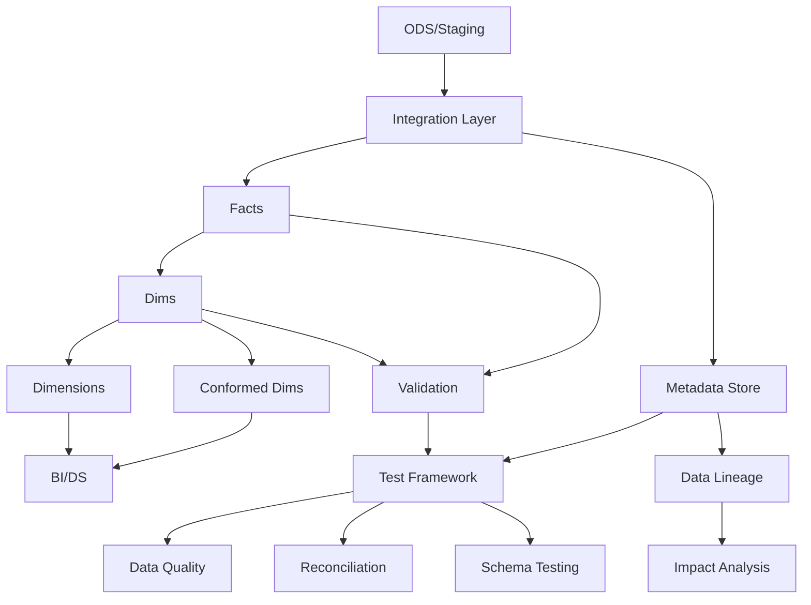

# DWH Testing — Senior Test Engineer / Test Architect Interview Guide

## 1. Interview Expectations at 15+ Years

**What interviewers expect from a 15+ year candidate:**

- Master of dimensional modeling patterns (star, snowflake, galaxy)
- Deep understanding of facts vs dimensions, grain, conformed dimensions
- Experience with SCD variants and their testing complexities
- Can design data lineage and impact analysis for enterprise DWH
- Understands partitioning, clustering, distribution strategies in Snowflake/Redshift/BigQuery
- Has debugged multi-billion row fact tables with correctness issues
- Understands late-arriving dimensions/facts, orphan detection, referential integrity

**Senior Engineer:** Tests star schema joins, validates fact counts
**Lead:** Designs dimensional models, defines testing standards
**Test Architect:** Architects enterprise DWH testing, defines conformed standards
**Staff/Principal:** Influences data architecture across org, owns data governance

## 2. Technology Overview

### What it is
Data Warehouse (DWH) is a centralized repository for integrated data from multiple sources, optimized for analytics and reporting. From testing perspective, it involves validating dimensional models, fact accuracy, dimension history, and referential integrity.

### How it works
Data flows: Source → Staging → ODS → Integration → Presentation (star schemas). Facts store measures; dimensions store attributes. SCD tracks historical changes. Partitioning enables large-scale querying.

### Where it is used
Enterprise reporting, analytics dashboards, BI tools, ML feature stores, compliance reporting.

### How it fails
- Wrong grain in facts
- Missing SCD history
- Late-arriving dimensions missing
- Orphan facts
- Conformed dimension inconsistencies
- Partitioning issues at scale

### How it should be tested
Row count validation, grain validation, SCD history validation, referential integrity, conformed dimension consistency, partition-level reconciliation.

### How it should be automated
SQL-based validation frameworks, metadata-driven test generation, data lineage integration, CI/CD for schema changes.

## 3. Core Concepts

### Star Schema

- **What:** Fact table surrounded by dimension tables, minimizing joins.
- **Why:** Query performance, simplicity, clear grain definition.
- **How:** One-to-many relationship from dimensions to fact; no snowflakes.
- **Testing:** Validate cardinality, fact grain consistency, foreign key constraints.
- **Failure Modes:** Fact grain ambiguity, missing dimensions, snowflake complexity.
- **Production:** Monitor for snowflake creep; enforce star schema standards.

### Snowflake Schema

- **What:** Normalized dimensions with multiple tables.
- **Why:** Dimension storage optimization, reduced redundancy.
- **How:** Dimension tables related through foreign keys.
- **Testing:** Complex join validation, referential integrity across snowflake.
- **Failure Modes:** Query complexity, performance degradation, join validation.
- **Production:** Use sparingly; prefer star for query performance.

### Grain

- **What:** Lowest level of detail in a fact table.
- **Why:** Defines fact table purpose, enables correct aggregation.
- **How:** Clearly specify "an order line", "an order", "daily sales" in spec.
- **Testing:** Verify grain matches requirement; test aggregations at grain level.
- **Failure Modes:** Ambiguous grain leads to wrong aggregations.
- **Production:** Document grain explicitly; auto-validate grain in tests.

### Metrics Type

- **What:** Additive, semi-additive, non-additive measures.
- **Why:** Determines valid aggregation levels.
- **How:** Additive → all dimensions, Semi-additive (time only) → exclude time, Non-additive → no aggregation.
- **Testing:** Validate aggregations at each granularity.
- **Failure Modes:** Adding non-additive measures, improper time aggregation.
- **Production:** Tag measures with aggregation rules; validate in ETL.

### SCD Types

#### SCD0
- **What:** Static dimension, never changes.
- **Why:** Rare; use constant dimension.
- **How:** Load once, no updates.
- **Testing:** Verify no updates occur.
- **Failure Modes:** Changes in source break SCD0.
- **Production:** Avoid; use SCD2 for audit trail.

#### SCD1
- **What:** Overwrite previous values.
- **Why:** Keep latest version; no history needed.
- **How:** UPDATE dimension record on change.
- **Testing:** Verify only latest value stored.
- **Failure Modes:** Historical analysis impossible.
- **Production:** Use for non-historical attributes.

#### SCD2
- **What:** Add new row with new surrogate key.
- **Why:** Full history, audit trail, point-in-time analysis.
- **How:** New row with effective dates, current flag, surrogate key.
- **Testing:** Verify effective dates non-overlapping, current flag correct.
- **Failure Modes:** Overlapping dates, multiple current records.
- **Production:** Most common; requires careful date handling.

#### SCD3
- **What:** Add columns for limited history.
- **Why:** Track only specific changes without full row duplication.
- **How:** Previous_value_1, current_value_1, etc.
- **Testing:** Verify previous columns populated correctly.
- **Failure Modes:** Limited history scope; column explosion.
- **Production:** Rare; use only when only need 1-2 historical versions.

#### SCD4/SCD6
- **What:** Hybrid of SCD1/SCD2; historical table + current table.
- **Why:** Balance storage and history.
- **How:** Current table + history table with SNOWFLAKE_ID.
- **Testing:** Verify sync between current and history.
- **Failure Modes:** Sync issues between tables.
- **Production:** Complex; use SCD2 instead unless justified.

### Surrogate Key vs Natural Key

- **What:** Surrogate (system-generated), Natural (business key).
- **Why:** Surrogate ensures uniqueness; Natural business-meaning.
- **How:** Surrogate = PK for joins; Natural used for business logic.
- **Testing:** Verify surrogate uniqueness; natural key consistency.
- **Failure Modes:** Invalid natural keys in source.
- **Production:** Always use surrogate for joins.

### Conformed Dimensions

- **What:** Same dimension appears in multiple fact tables.
- **Why:** Enables consistent reporting across facts.
- **How:** Same dimension key definition, same attribute values.
- **Testing:** Cross-fact dimension consistency, shared key validation.
- **Failure Modes:** Dimension drift, different definitions.
- **Production:** Enforce via data contracts; automated conformance testing.

### Fact Types

#### Transactional Fact
- **What:** Records each business event.
- **Why:** Detailed analysis, drill-down capability.
- **How:** One row per transaction (sale, order line).
- **Testing:** Count matches transactions; measures sum correctly.
- **Failure Modes:** Missing transaction records.
- **Production:** High volume; require partitioning.

#### Snapshot Fact
- **What:** Captures state at specific time.
- **Why:** Historical state, trend analysis.
- **How:** Periodic row capture (daily balance).
- **Testing:** Correct timestamp; state matches source.
- **Failure Modes:** Missing snapshots; incorrect state.
- **Production:** Schedule critical; monitor gaps.

#### Accumulating Snapshot
- **What:** Tracks multi-stage process.
- **Why:** Process cycle time, stage duration analysis.
- **Testing:** All stage timestamps populated; duration calculations.
- **Failure Modes:** Missing stage; incorrect order.
- **Production:** Critical for SLA monitoring.

### Additive Measures

- **What:** Can be summed across any dimension.
- **Why:** Quantity, revenue, cost.
- **Testing:** SUM over any dimension equals total.
- **Production:** Tag as additive; validate aggregation.

### Semi-additive Measures

- **What:** Summable over some dimensions only.
- **Why:** Balance, inventory (not over time).
- **Testing:** Validate correct aggregation rules.
- **Production:** Time-based summarization excludes time dimension.

### Non-additive Measures

- **What:** Cannot be summed.
- **Why:** Ratio, price, count of distinct.
- **Testing:** Validate correct calculation.
- **Production:** Use appropriate aggregation (AVG, MAX, COUNT DISTINCT).

## 4. ARCHITECTURE

**Key Components:**
- Staging layer (raw data landing)
- ODS (operational data store)
- Integration layer (conformed data)
- Fact tables (measures)
- Dimension tables (attributes)
- Conformed dimensions (shared across facts)
- Validation layer (reconciliation, quality)

**Test Points:**
- Row count from staging to fact
- Dimension conformance across facts
- SCD history validity
- Fact-grain correctness
- Referential integrity

**Scalability:**
- Partitioning by date/business key
- Clustering on query columns
- Distribution keys for join performance
- Materialized views for aggregates

## 5. TOP 50 INTERVIEW QUESTIONS

## Q1. What is the grain of a fact table and why is it critical?

**Difficulty:** Medium
**Interview Stage:** Recruiter / Technical Screen

### What the interviewer is testing
Understanding of dimensional modeling fundamentals.

### Strong Senior-Level Answer
Grain defines "what event is recorded" — one row per order item, one row per daily sales, one row per customer login. It's critical because all queries must aggregate back to grain. If grain is wrong, all queries return incorrect results.

### Architect-Level Answer
Grain determines fact table structure, partitioning strategy, and query performance. Define grain explicitly in spec. Test that grain is consistently applied. Grain should match business event definition. Document grain as first requirement.

### Real-World Enterprise Scenario
E-commerce DWH had fact table grain "one row per order" but business needed "one row per line item" — all revenue reports were understated by line count factor.

### Likely Follow-Up Questions
- How do you document grain?
- What if grain is ambiguous?
- How do you test grain?

### Common Weak Answer
"Fact table has all the data."

### Interviewer Probe
"If grain is 'one row per customer' but you need daily counts, what happens?"

### Hands-On Exercise
Write SQL to verify fact table grain matches requirement.

---

## Q2. Compare SCD Type 1 vs Type 2 testing approaches.

**Difficulty:** Medium
**Interview Stage:** Technical Screen

### What the interviewer is testing
Deep understanding of SCD variants.

### Strong Senior-Level Answer
SCD1: Only latest value stored. Test verifies no historical tracking. SCD2: Full history with effective dates. Test verifies effective date non-overlap, single current record, proper versioning.

### Architect-Level Answer
SCD1 simpler but loses audit trail. SCD2 provides full history but complex. Test SCD1 by verifying no history table. Test SCD2 with date validation, current flag, no overlaps, surrogate key uniqueness.

### Real-World Enterprise Scenario
Customer address: SCD1 overwrites; marketing needed to know when address changed.

### Likely Follow-Up Questions
- When to choose SCD1 vs SCD2?
- How do you handle SCD2 date overlaps?
- What about SCD3?

### Common Weak Answer
"SCD2 is better because it tracks history."

### Interviewer Probe
"Business says they never need history. Why SCD2 anyway?"

### Hands-On Exercise
Write SQL test for SCD2 effective date overlaps.

---

## Q3. How do you test a conformed dimension across multiple fact tables?

**Difficulty:** Hard
**Interview Stage:** Technical Deep Dive

### What the interviewer is testing
Cross-table consistency testing.

### Strong Senior-Level Answer
Verify dimension keys are consistent: same customer_id maps to same customer_name in sales_fact and returns_fact. Use shared key validation, cross-fact reconciliation, conformed dimension assertions.

### Architect-Level Answer
Conformed dimensions require governance. Implement: 1) Shared dimension key validation tests, 2) Cross-fact consistency checks, 3) Impact analysis on dimension changes, 4) Data contracts for dimension evolution.

### Real-World Enterprise Scenario
Sales and Marketing customer dimensions diverged; marketing reports showed different customers than sales.

### Likely Follow-Up Questions
- How do you enforce conformance?
- What if dimensions need different attributes?
- How do you handle dimension changes?

### Common Weak Answer
"Use the same table for both."

### Interviewer Probe
"Sales needs join date, Marketing needs acquisition channel. Same dimension?"

### Hands-On Exercise
Write SQL to validate conformed dimension consistency across two facts.

---

## Q4. A fact table has foreign keys to dimensions, but some FK values have no matching dimension key. These are orphan records. How do you detect and handle them?

**Difficulty:** Hard
**Interview Stage:** Technical Deep Dive

### What the interviewer is testing
Data integrity and error handling.

### Strong Senior-Level Answer
Detect: LEFT JOIN dim WHERE dim.key IS NULL. Handle: Quarantine orphans, investigate source, fix ETL logic, add constraints. Test: nightly orphan detection, alert on new orphans.

### Architect-Level Answer
Orphans indicate ETL or source issues. Implement: 1) Orphan detection in post-load, 2) Alerting on new orphans, 3) Orphan quarantine table, 4) Root cause analysis automation, 5) Preventive FK constraints where possible.

### Real-World Enterprise Scenario
Sales fact had 50K orphan customer_ids; source system had archived customers not in dimension.

### Likely Follow-Up Questions
- How do you fix orphans?
- What if orphans are legitimate?
- How do you prevent orphans?

### Common Weak Answer
"Delete them from fact table."

### Interviewer Probe
"Orphan is legitimate new customer with no dimension record yet. What happens?"

### Hands-On Exercise
Write SQL to detect and report orphan records.

---

## Q5. Explain how you would test slowly changing dimension Type 2 with overlapping effective dates.

**Difficulty:** Very Hard
**Interview Stage:** Architect Round

### What the interviewer is testing
Complex SCD2 edge case handling.

### Strong Senior-Level Answer
Overlapping dates indicate SCD2 bug. Write SQL to detect: WHERE effective_date < next_rows.effective_date AND end_date > next_rows.start_date. Root cause: concurrent updates, timezone issues. Fix: transactional SCD2, proper date overlap resolution.

### Architect-Level Answer
SCD2 overlaps corrupt historical analysis. Implement: 1) Transaction isolation for SCD2 updates, 2) Overlap detection tests, 3) Conflict resolution strategy (keep earliest? newest?), 4) Manual review for overlaps. Use MERGE with date validation.

### Real-World Enterprise Scenario
SCD2 overlaps occurred during batch window with concurrent ETL jobs.

### Likely Follow-Up Questions
- How do you prevent overlaps?
- What if multiple jobs update same key?
- How do you recover from overlaps?

### Common Weak Answer
"Update the next record's start date."

### Interviewer Probe
"Two jobs run simultaneously on same customer. No transaction isolation. What happens?"

### Hands-On Exercise
Write SQL to detect SCD2 overlapping effective dates.

---

## Q6. How do you test if a fact table has the correct grain?

**Difficulty:** Hard
**Interview Stage:** Technical Deep Dive

### What the interviewer is testing
Grain validation at scale.

### Strong Senior-Level Answer
Define grain in requirements (e.g., "one row per order_line"). Test: 1) Count distinct keys matches grain definition, 2) Aggregation test at grain level produces expected result, 3) No duplicate keys violating grain.

### Architect-Level Answer
Grain validation is critical governance. Implement: 1) Grain definition as metadata, 2) Automated grain tests, 3) Anomaly detection on grain violations, 4) Regression tests on grain changes. Use data profiling to detect grain drift.

### Real-World Enterprise Scenario
Fact grain was supposed to be "order_line" but was "order_header" — revenue totals were QTY times actual.

### Likely Follow-Up Questions
- How do you measure grain uniqueness?
- What if grain is ambiguous?
- How do you test grain changes?

### Common Weak Answer
"Check row count matches source."

### Interviewer Probe
"Source has 1M orders, 5M lines. Fact has 1M rows. Is grain correct?"

### Hands-On Exercise
Write SQL to verify fact table grain is at order_line level.

---

## Q7. Explain the difference between a transactional fact and a snapshot fact. How do you test each?

**Difficulty:** Medium
**Interview Stage:** Technical Screen

### What the interviewer is testing
Understanding of fact types.

### Strong Senior-Level Answer
Transactional: One row per business event (sale, order). Snapshot: One row per time period capturing state (daily balance). Test transactional: count matches events, measures are additive. Test snapshot: timestamp correct, state matches source, no gaps.

### Architect-Level Answer
Transactional facts enable drill-down; snapshots enable trend analysis. Test transactional with event matching. Test snapshots with time-series validation, gap detection, state consistency. Both need referential integrity to dimensions.

### Real-World Enterprise Scenario
Account balance snapshot failed for weekends; trend showed 5-day cycle instead of business day cycle.

### Likely Follow-Up Questions
- How do you handle missing snapshots?
- What about accumulating snapshots?
- How do you test state accuracy?

### Common Weak Answer
"Transactional facts have more rows."

### Interviewer Probe
"Balance snapshot for customer is wrong. How do you trace back?"

### Hands-On Exercise
Write SQL to validate daily revenue snapshot matches transactional sums.

---

## Q8. How would you test late-arriving dimensions in your ETL pipeline?

**Difficulty:** Hard
**Interview Stage:** Technical Deep Dive

### What the interviewer is testing
Understanding of time-varying data challenges.

### Strong Senior-Level Answer
Late arrivals cause orphan facts or failed joins. Test: 1) Facts load before dimension arrive, 2) Late dimension handling (flag, quarantine, update existing facts), 3) Late dimension impact on reports. Implement: allowed lateness, late-arrival queues, dimension backfill strategy.

### Architect-Level Answer
Late arrivals are inevitable. Design: 1) Stale data handling policy, 2) Late dimension detection, 3) Fact dimension reconciliation, 4) Report impact analysis. Test with delayed dimension data. Monitor late-arrival rates for process improvement.

### Real-World Enterprise Scenario
Dimension arrived 24 hours late; daily fact processed without it, requiring day-after reprocessing.

### Likely Follow-Up Questions
- How do you handle late dimensions in real-time?
- What if dimension never arrives?
- How do you notify downstream?

### Common Weak Answer
"Fail the job until dimension arrives."

### Interviewer Probe
"Dimension is 48 hours late. Marketing report already sent. What do you do?"

### Hands-On Exercise
Write PySpark logic to handle late-arriving dimensions with grace period.

---

## Q9. Your team needs to design a data warehouse test strategy for 100 business users. What components would you include?

**Difficulty:** Hard
**Interview Stage:** Architecture

### What the interviewer is testing
Enterprise test architecture design.

### Strong Senior-Level Answer
1) Unit tests for ETL transformations, 2) Integration tests for pipeline end-to-end, 3) Data quality tests (completeness, accuracy, uniqueness), 4) Reconciliation tests (source-target, cross-tables), 5) Performance tests, 6) Regression tests on schema changes, 7) Data profiling baseline, 8) Business rule validation.

### Architect-Level Answer
Enterprise strategy requires governance. Components: 1) Test framework (PyTest + SQL), 2) Metadata-driven test generation, 3) Data quality gates in CI/CD, 4) Automated reconciliation dashboards, 5) Impact analysis for changes, 6) User acceptance test templates, 7) Test data management, 8) Test coverage metrics.

### Real-World Enterprise Scenario
100 users with different report requirements; unified test platform reduced support tickets by 60%.

### Likely Follow-Up Questions
- How do you handle user-specific tests?
- What is test coverage target?
- How do you prioritize testing?

### Common Weak Answer
"Test all queries."

### Interviewer Probe
"You have 100 users and limited testing resources. How do you ensure quality?"

### Hands-On Exercise
Design test framework for multi-user DWH with business rule validation.

---

## Q10. How do you test a fact table with semi-additive measures like balance or inventory?

**Difficulty:** Medium
**Interview Stage:** Technical Screen

### What the interviewer is testing
Understanding of measure types.

### Strong Senior-Level Answer
Semi-additive measures can be summed over some dimensions (product, region) but not time. Test: validate SUM over product yields total, SUM over time gives incorrect result. Document aggregation rules per measure.

### Architect-Level Answer
Semi-additive requires special handling. Implement: 1) Measure tagging (additive/semi/non), 2) Aggregation rule validation, 3) BI semantic model validation, 4) Time series correctness tests. Alert on invalid aggregations.

### Real-World Enterprise Scenario
Inventory summed over time gave 10x actual; proper aggregation required latest time slice.

### Likely Follow-Up Questions
- How do you tag measures?
- What's the difference between inventory and balance?
- How do you test averages?

### Common Weak Answer
"Sum everything."

### Interviewer Probe
"Average price is semi-additive. How do you test correctly?"

### Hands-On Exercise
Write SQL to validate inventory measure aggregation rules.

---

## Q11. Explain the star schema vs snowflake schema trade-offs in testing.

**Difficulty:** Medium
**Interview Stage:** Technical Screen

### What the interviewer is testing
Schema design impact on testing.

### Strong Senior-Level Answer
Star: simpler joins, better performance, easier testing. Snowflake: normalized dimensions, smaller storage, more complex joins harder to test. For testing, star is easier to traverse, validate, reconcile.

### Architect-Level Answer
Trade-offs affect testability. Star: simpler test queries, faster validation, clearer failure isolation. Snowflake: more join tables, complex FK constraints, harder to diagnose. Recommend star for query performance; use snowflake sparingly.

### Real-World Enterprise Scenario
Snowflake schema caused 15 join validation tests; star schema simplified to 3 tests with same coverage.

### Likely Follow-Up Questions
- When do you use snowflake?
- How do you test deep snowflakes?
- What about galaxy schemas?

### Common Weak Answer
"Snowflake saves space."

### Interviewer Probe
"Star schema uses 2x storage. Is it worth it?"

### Hands-On Exercise
Write join validation SQL for star vs snowflake schema.

---

## Q12. How do you test data consistency across partitioned fact tables?

**Difficulty:** Hard
**Interview Stage:** Technical Deep Dive

### What the interviewer is testing
Large-scale data validation.

### Strong Senior-Level Answer
Partitions can drift apart. Test: 1) Record count across all partitions, 2) Aggregate validation per partition, 3) Cross-partition completeness, 4) No duplicates across partitions. Use partition-level reconciliation.

### Architect-Level Answer
Partition consistency requires systematic testing. Implement: 1) Per-partition validation with roll-up, 2) Cross-partition duplicate detection, 3) Partition boundary validation, 4) Automated partition health dashboard. Test with partition skew scenarios.

### Real-World Enterprise Scenario
Partition '202401' had 10% fewer rows than adjacent partitions due to late data handling bug.

### Likely Follow-Up Questions
- How do you handle partition skew?
- What if partition metadata is wrong?
- How do you test partition pruning?

### Common Weak Answer
"Test each partition separately."

### Interviewer Probe
"One partition is 10% short. How do you find which data?"

### Hands-On Exercise
Write SQL to compare partition-level aggregates across all partitions.

---

## Q13. Explain your approach to testing accumulating snapshots.

**Difficulty:** Hard
**Interview Stage:** Technical Deep Dive

### What the interviewer is testing
Complex fact type understanding.

### Strong Senior-Level Answer
Accumulating snapshots track multi-stage processes. Test: 1) All stage timestamps populated for completed, 2) Partial records for in-progress, 3) Stage order validation (can't have later stage without earlier), 4) Duration calculation accuracy.

### Architect-Level Answer
Accumulating snapshots model business processes. Implement: 1) Stage sequence validation, 2) Duration calculation tests, 3) Completion criteria validation, 4) Process SLA testing. Use state machine pattern in testing.

### Real-World Enterprise Scenario
Order fulfillment snapshot had delivery_date before shipped_date - bug in ETL update sequence.

### Likely Follow-Up Questions
- How do you test partial processes?
- What if stages are skipped?
- How do you handle stage timeouts?

### Common Weak Answer
"Just check all dates are set."

### Interviewer Probe
"Order is marked complete but shipped_date is null. What happened?"

### Hands-On Exercise
Write SQL to validate accumulating snapshot stage sequence and dates.

---

## Q14. How do you test bridge tables in a DWH?

**Difficulty:** Very Hard
**Interview Stage:** Architecture

### What the interviewer is testing
Complex dimensional modeling testing.

### Strong Senior-Level Answer
Bridge tables resolve many-to-many relationships. Test: 1) Bridge table completeness (all valid relationships), 2) No orphan bridges, 3) Correct hierarchy traversal (child to root), 4) No circular references. Validate with recursive queries.

### Architect-Level Answer
Bridge table testing is complex. Implement: 1) Bridge completeness tests, 2) Hierarchy validation queries, 3) Recursive integrity checks, 4) Performance tests for deep hierarchies. Use graph databases for complex bridges.

### Real-World Enterprise Scenario
Category-product bridge had missing links; sales by category rollup was wrong.

### Likely Follow-Up Questions
- How do you test deep hierarchies?
- What about circular references?
- How do you handle bridge growth?

### Common Weak Answer
"Test the joins work."

### Interviewer Probe
"Bridge has a circular reference. What happens?"

### Hands-On Exercise
Write SQL to detect circular references in bridge table.

---

## Q15. What is a junk dimension and how do you test it?

**Difficulty:** Medium
**Interview Stage:** Technical Screen

### What the interviewer is testing
Dimension modeling understanding.

### Strong Senior-Level Answer
Junk dimension combines low-cardinality flags/attributes. Test: 1) All flag combinations present, 2) Correct mapping from source flags, 3) No unnecessary combinations, 4) Query performance acceptable.

### Architect-Level Answer
Junk dimensions require careful design. Implement: 1) Flag combination validation, 2) Size monitoring, 3) Correlation analysis between flags, 4) Performance testing. Consider normalizing high-correlation flags.

### Real-World Enterprise Scenario
Junk dimension grew to 10K rows because flags were correlated; should have been split.

### Likely Follow-Up Questions
- How do you detect flag correlation?
- What if new flags added?
- How do you test query performance?

### Common Weak Answer
"Combine all flags into one table."

### Interviewer Probe
"Two flags are always present together. Impact on junk dimension?"

### Hands-On Exercise
Write SQL to validate junk dimension flag combinations.

---

## Q16. How do you test data quality at the enterprise DWH level?

**Difficulty:** Hard
**Interview Stage:** Architecture

### What the interviewer is testing
Data quality governance.

### Strong Senior-Level Answer
Enterprise data quality: 1) Completeness tests (row counts, null rates), 2) Accuracy tests (business rule validation), 3) Consistency tests (cross-table), 4) Timeliness tests (latency), 5) Uniqueness tests (duplicates), 6) Validity tests (data types, constraints).

### Architect-Level Answer
Enterprise quality requires platform. Implement: 1) Data quality framework (Great Expectations/Deequ), 2) Quality gates in CI/CD, 3) Quality dashboard, 4) SLA-based alerting, 5) Quality ownership model, 6) Automated remediation where possible.

### Real-World Enterprise Scenario
Data quality dashboard reduced defect escape rate by 70% through proactive monitoring.

### Likely Follow-Up Questions
- How do you prioritize quality issues?
- What is acceptable quality threshold?
- How do you handle quality degradation?

### Common Weak Answer
"Just test everything."

### Interviewer Probe
"You have 100 tables, severe performance issues. How do you balance quality testing?"

### Hands-On Exercise
Design data quality test suite for 10 critical DWH tables.

---

## Q17. Your DWH has 50 fact tables. How do you ensure referential integrity across all of them?

**Difficulty:** Very Hard
**Interview Stage:** Architecture

### What the interviewer is testing
Cross-table data integrity.

### Strong Senior-Level Answer
Implement: 1) Foreign key constraints in target, 2) Post-load validation queries, 3) Conformed dimension validation, 4) Automated RI reports, 5) Quarantine for orphans. Test nightly.

### Architect-Level Answer
Enterprise RI requires systematic approach. Develop: 1) Metadata-driven RI test generator, 2) Cross-fact consistency dashboard, 3) Impact analysis for FK changes, 4) Automated orphan detection, 5) RI SLA monitoring. Use data lineage for root cause.

### Real-World Enterprise Scenario
Customer dimension change broke 12 fact tables with customer FK.

### Likely Follow-Up Questions
- How do you handle FK constraint checking at scale?
- What if RI check takes too long?
- How do you alert on RI violations?

### Common Weak Answer
"Enable FK constraints in database."

### Interviewer Probe
"50 fact tables, RI check takes 4 hours. What do you do?"

### Hands-On Exercise
Write SQL to generate referential integrity validation for all fact-dimension relationships.

---

## Q18. How do you test slowly changing dimensions Type 2 with high update frequency?

**Difficulty:** Very Hard
**Interview Stage:** Architecture

### What the interviewer is testing
Performance and correctness of high-volume SCD2.

### Strong Senior-Level Answer
High frequency SCD2 requires: 1) Batch window management, 2) Update isolation, 3) Surrogate key generation strategy, 4) Effective date boundary testing, 5) Performance optimization. Test with concurrent updates.

### Architect-Level Answer
High-frequency SCD2 at enterprise scale needs: 1) Transactional updates with proper isolation, 2) Overlap detection and resolution, 3) Partition-based testing, 4) Performance benchmark testing, 5) CDC-based SCD2 for real-time. Use merge-upsert with date validation.

### Real-World Enterprise Scenario
Customer updates every minute; SCD2 processing lag caused current flag issues.

### Likely Follow-Up Questions
- How do you handle concurrent updates?
- What if effective dates conflict?
- How do you test at scale?

### Common Weak Answer
"Run updates in batch at night."

### Interviewer Probe
"Updates every minute, timezone issues. How do you ensure no overlaps?"

### Hands-On Exercise
Write PySpark merge logic for high-frequency SCD2 with overlap prevention.

---

## Q19. Explain how you would test a galaxy schema (snowflake with multiple fact tables).

**Difficulty:** Very Hard
**Interview Stage:** Architecture

### What the interviewer is testing
Complex multi-fact testing.

### Strong Senior-Level Answer
Galaxy schema has multiple fact tables sharing dimensions. Test: 1) Conformed dimension validation, 2) Star schema integrity per fact, 3) Cross-fact ratio validation (e.g., sales vs returns), 4) Common dimension quality tests, 5) Multi-fact joins for reporting.

### Architect-Level Answer
Galaxy testing is multiply complex. Design: 1) Per-fact test suites, 2) Shared dimension test catalog, 3) Cross-fact consistency tests, 4) Impact analysis for dimension changes, 5) Business scenario tests (revenue = sales - returns). Use data modeling tools for visualization.

### Real-World Enterprise Scenario
Galaxy schema had 8 fact tables, 25 dimensions; test maintenance was nightmare until automated.

### Likely Follow-Up Questions
- How do you coordinate tests?
- What about dimension drift?
- How do you test with many facts?

### Common Weak Answer
"Test each fact table separately."

### Interviewer Probe
"Sales and returns share 8 dimensions. How do you avoid duplicate tests?"

### Hands-On Exercise
Design test framework for galaxy schema with shared dimension tests.

---

## Q20. How do you test slowly changing dimensions Type 3?

**Difficulty:** Medium
**Interview Stage:** Technical Screen

### What the interviewer is testing
Rare SCD variant understanding.

### Strong Senior-Level Answer
SCD3 adds columns for limited history (current and previous value). Test: 1) Previous value populated on change, 2) Current value updated correctly, 3) History limited to configured versions, 4) No data loss in transition.

### Architect-Level Answer
SCD3 is niche. Use only when: 1) Only need 1-2 historical versions, 2) Storage concern with SCD2, 3) Specific business query needs. Test with version transitions, verify history columns populated correctly.

### Real-World Enterprise Scenario
Product category SCD3 tracked current and previous category for analysis.

### Likely Follow-Up Questions
- When to choose SCD3 over SCD2?
- What if you need more than 2 versions?
- How do you test transitions?

### Common Weak Answer
"SCD3 keeps everything in history."

### Interviewer Probe
"Business now needs 3 months of history. SCD3 still works?"

### Hands-On Exercise
Write SQL to validate SCD3 version transitions.

---

## Q21. How do you test data partitioning in large fact tables?

**Difficulty:** Hard
**Interview Stage:** Technical Deep Dive

### What the interviewer is testing
Partitioning strategy validation.

### Strong Senior-Level Answer
Test: 1) Data distribution across partitions, 2) Query pruning effectiveness, 3) Partition boundaries correct (no gaps, no overlaps), 4) Partition elimination in queries, 5) Statistics accuracy for each partition.

### Architect-Level Answer
Partitioning testing prevents performance issues. Implement: 1) Partition row count validation, 2) Query plan analysis for partition pruning, 3) Boundary validation (start_date <= data < end_date), 4) Skew detection, 5) Partition-level reconciliation.

### Real-World Enterprise Scenario
Partition '202401' was empty; queries returned wrong counts for January.

### Likely Follow-Up Questions
- How do you test partition pruning?
- What if partitions are skewed?
- How do you validate partition boundaries?

### Common Weak Answer
"Check data is spread across partitions."

### Interviewer Probe
"Query uses partition with low cardinality. What happens to performance?"

### Hands-On Exercise
Write SQL to validate partition boundaries and data distribution.

---

## Q22. Your DWH load shows SUCCESS but daily report shows wrong numbers. Walk through your investigation.

**Difficulty:** Hard
**Interview Stage:** Production Debugging

### What the interviewer is testing
Systematic debugging approach.

### Strong Senior-Level Answer
1) Verify source data counts and aggregates, 2) Check staging layer data matches source, 3) Validate dimension data (lookups), 4) Verify transformation logic output, 5) Check target fact row counts, 6) Validate measure aggregations, 7) Check report query logic.

### Architect-Level Answer
Debug systematically with dimensional drill-down. Trace from report to source: 1) Report validation, 2) DWH fact validation, 3) Transformation validation, 4) Source validation. Use data lineage for faster root cause. Check for data type issues, null handling, aggregation differences.

### Real-World Enterprise Scenario
Report used different currency conversion; ETL loaded original USD, report converted at report time.

### Likely Follow-Up Questions
- How do you trace data lineage?
- What if transformation is correct but numbers wrong?
- How do you prevent similar issues?

### Common Weak Answer
"Rerun the ETL."

### Interviewer Probe
"ETL ran 3 times. Report still wrong. What else?"

### Hands-On Exercise
Write SQL to trace metric from report through ETL layers to source.

---

## Q23. How do you test conformed dimensions for schema drift?

**Difficulty:** Hard
**Interview Stage:** Technical Deep Dive

### What the interviewer is testing
Schema evolution handling.

### Strong Senior-Level Answer
Schema drift breaks conformed dimensions. Test: 1) Column presence/verification, 2) Data type changes, 3) New columns added, 4) Deprecated columns handled. Use schema registry; test with previous schema versions.

### Architect-Level Answer
Conformed dimensions require schema governance. Implement: 1) Schema compatibility checks, 2) Automated conformed dimension testing across facts, 3) Impact analysis for changes, 4) Versioned schemas. Use data contracts between teams.

### Real-World Enterprise Scenario
Sales team added column to customer dimension; Marketing reports broke.

### Likely Follow-Up Questions
- How do you detect schema drift?
- What if not all facts need new column?
- How do you coordinate changes?

### Common Weak Answer
"Update all facts when dimension changes."

### Interviewer Probe
"Sales needs new column, Marketing doesn't. How do you handle?"

### Hands-On Exercise
Write Python script to detect conformed dimension schema drift.

---

## Q24. Explain how you would validate surrogate keys in a large dimensional model.

**Difficulty:** Hard
**Interview Stage:** Technical Deep Dive

### What the interviewer is testing
Key management at scale.

### Strong Senior-Level Answer
Surrogate key validation: 1) Uniqueness per dimension, 2) Never updated after insert, 3) Consistent key for same business key (SCD2), 4) No gaps or duplicates from parallel loads. Test with production-like volume.

### Architect-Level Answer
Surrogate key integrity is foundational. Implement: 1) Uniqueness constraints, 2) Transactional key generation, 3) Key collision detection, 4) Parallel load coordination. Use deterministic key generation where possible.

### Real-World Enterprise Scenario
Parallel ETL jobs generated duplicate surrogate keys, causing data corruption.

### Likely Follow-Up Questions
- How do you generate keys in parallel?
- What if key uniqueness fails?
- How do you handle key gaps?

### Common Weak Answer
"Use auto-incrementing integers."

### Interviewer Probe
"Auto-increment but parallel loads. What happens?"

### Hands-On Exercise
Write SQL to validate surrogate key uniqueness and integrity.

---

## Q25. How do you test fact table partitions for data skew?

**Difficulty:** Hard
**Interview Stage:** Technical Deep Dive

### What the interviewer is testing
Performance optimization awareness.

### Strong Senior-Level Answer
Skew causes uneven processing. Test: 1) Row count per partition, 2) Data size per partition, 3) Predicate selectivity per partition, 4) Query performance variation. Use statistical analysis to detect skew.

### Architect-Level Answer
Skew detection is proactive performance testing. Implement: 1) Partition size monitoring, 2) Row count variance alerts, 3) Query performance by partition analysis, 4) Re-partitioning strategy. Test queries on skewed data.

### Real-World Enterprise Scenario
Date partition '20240229' had 10x data due to leap year bug.

### Likely Follow-Up Questions
- How do you define acceptable skew?
- What if skew cannot be avoided?
- How do you test query performance on skewed data?

### Common Weak Answer
"Partitions should be equal size."

### Interviewer Probe
"Category partition has 80% of data. Query performance?"

### Hands-On Exercise
Write SQL to compare partition sizes and detect skew.

---

## Q26. Your DWH has a fact table with 10 billion rows. How do you approach reconciliation testing?

**Difficulty:** Very Hard
**Interview Stage:** Architecture

### What the interviewer is testing
Large-scale data validation.

### Strong Senior-Level Answer
10B rows require sampling + statistical validation: 1) Row count at partition level, 2) Aggregate checksums per partition, 3) Hash verification of random samples, 4) Anomaly detection on aggregates. Not full scan.

### Architect-Level Answer
Billion-row reconciliation uses tiered approach: 1) Partition-level validation, 2) Statistical sampling for accuracy, 3) Hash-based reconciliation for integrity, 4) Row-level for discrepancies only. Use distributed processing (Spark) for scale.

### Real-World Enterprise Scenario
10B row fact took 4 hours to reconcile; reduced to 15 minutes with partition-level first, then sampling.

### Likely Follow-Up Questions
- How do you select samples?
- What confidence level is acceptable?
- How do you handle partition failures?

### Common Weak Answer
"Compare all 10 billion rows."

### Interviewer Probe
"Reconciliation finds discrepancy. How do you locate the data?"

### Hands-On Exercise
Design tiered reconciliation for 1B row fact table.

---

## Q27. How do you test data quality rules in a dimensional model?

**Difficulty:** Medium
**Interview Stage:** Technical Screen

### What the interviewer is testing
Data quality integration.

### Strong Senior-Level Answer
DWH data quality: 1) Completeness (no nulls in required columns), 2) Accuracy (business rule validation), 3) Consistency (cross-table), 4) Timeliness (latency), 5) Uniqueness (duplicates). Implement in ETL and post-load.

### Architect-Level Answer
Data quality is data contract enforcement. Design: 1) Quality rules as metadata, 2) Automated quality gates, 3) Quality dashboards, 4) SLA-based alerting. Use Great Expectations/Deequ for implementation.

### Real-World Enterprise Scenario
Data quality rules caught PII in customer dimension before masking.

### Likely Follow-Up Questions
- How do you define quality rules?
- What if quality check is slow?
- How do you enforce quality?

### Common Weak Answer
"Just check for nulls."

### Interviewer Probe
"Quality check takes 2 hours. Business needs data now."

### Hands-On Exercise
Write SQL for data quality validation with business rules.

---

## Q28. Explain how you test bridge tables in a galaxy schema.

**Difficulty:** Very Hard
**Interview Stage:** Architecture

### What the interviewer is testing
Complex multi-fact bridge testing.

### Strong Senior-Level Answer
Bridge tables in galaxy connect facts to dimensions. Test: 1) Bridge completeness per fact, 2) No orphan bridges, 3) Correct many-to-many resolution, 4) Performance with large bridges.

### Architect-Level Answer
Galaxy bridge testing is complex. Implement: 1) Per-fact bridge validation, 2) Bridge size monitoring, 3) Performance testing for bridge joins, 4) Anomaly detection on bridge patterns. Use bridge table statistics.

### Real-World Enterprise Scenario
Category-product bridge grew to 50M rows; queries became slow.

### Likely Follow-Up Questions
- How do you optimize bridge tables?
- What if bridge grows too large?
- How do you test bridge performance?

### Common Weak Answer
"Test bridge join works."

### Interviewer Probe
"Bridge has 50M rows and 10K facts joining. Performance issue."

### Hands-On Exercise
Write SQL to validate bridge table integrity and performance.

---

## Q29. How do you test slowly changing dimensions with temporal validity (effective dating)?

**Difficulty:** Hard
**Interview Stage:** Technical Deep Dive

### What the interviewer is testing
Temporal correctness in dimensions.

### Strong Senior-Level Answer
Temporal validity: effective_start_date, effective_end_date must be correct. Test: 1) Dates non-overlapping, 2) Correct time travel queries, 3) Historical point-in-time access, 4) Timezone handling. Use strict type for dates.

### Architect-Level Answer
Temporal testing ensures historical accuracy. Implement: 1) Temporal validation rules, 2) Point-in-time query tests, 3) Effective date range validation, 4) Timezone consistency checks. Test with timezone transitions (DST).

### Real-World Enterprise Scenario
Effective dates overlapped due to timezone mismatch; historical queries returned wrong records.

### Likely Follow-Up Questions
- How do you handle timezones?
- What if effective dates are ambiguous?
- How do you test time travel?

### Common Weak Answer
"Just check dates exist."

### Interviewer Probe
"Two records have overlapping dates. Business says it's intentional for transition period."

### Hands-On Exercise
Write SQL to validate temporal validity with overlap detection.

---

## Q30. How do you test a multi-language DWH model?

**Difficulty:** Hard
**Interview Stage:** Architecture

### What the interviewer is testing
Internationalization in data modeling.

### Strong Senior-Level Answer
Multi-language DWH stores translations. Test: 1) All languages have translations, 2) Translation keys consistent, 3) Missing translation handling, 4) Language fallback logic. Validate character encodings.

### Architect-Level Answer
Internationalization testing prevents data loss. Implement: 1) Translation completeness metrics, 2) Key-value validation per language, 3) Encoding consistency checks, 4) Fallback testing. Use language metadata.

### Real-World Enterprise Scenario
Product name missing in Spanish; report showed key instead of translation.

### Likely Follow-Up Questions
- How do you handle partial translations?
- What if a language is added later?
- How do you test language fallback?

### Common Weak Answer
"Just check translations exist."

### Interviewer Probe
"French translation is empty. What should happen?"

### Hands-On Exercise
Write SQL to validate translation completeness across languages.

---

## Q31. Your BI report shows wrong numbers. ETL validation passed. How do you investigate?

**Difficulty:** Hard
**Interview Stage:** Production Debugging

### What the interviewer is testing
End-to-end data flow investigation.

### Strong Senior-Level Answer
1) Verify report query logic, 2) Check bi semantic model calculations, 3) Validate report filters, 4) Compare to DWH raw query, 5) Check data source for report, 6) Validate report parameters. ETL validation may miss semantic errors.

### Architect-Level Answer
Report issues often stem from semantic layer. Trace: 1) Report query execution, 2) BI tool calculation, 3) DWH query, 4) ETL output. Test report query directly in DWH. Check for semantic model differences from ETL expectations.

### Real-World Enterprise Scenario
Report used average balance; ETL calculated sum. Both "correct" but different business question.

### Likely Follow-Up Questions
- How do you test BI semantic models?
- What if multiple reports disagree?
- How do you prevent semantic drift?

### Common Weak Answer
"Rerun the ETL."

### Interviewer Probe
"ETL passed validation. Report query on same DWH table. Still wrong."

### Hands-On Exercise
Write SQL to compare BI semantic query against ETL source logic.

---

## Q32. How do you test Slowly Changing Dimensions with effective dating and late arrivals?

**Difficulty:** Very Hard
**Interview Stage:** Architect

### What the interviewer is testing
Complex temporal SCD handling.

### Strong Senior-Level Answer
Late arrivals with effective dating: 1) Accept late dimensions within grace period, 2) Flag late arrivals, 3) Adjust historical records if needed, 4) Test with timezone variations. Implement watermark for effective dates.

### Architect-Level Answer
Late effective dating requires temporal consistency. Design: 1) Grace period configuration, 2) Late arrival detection, 3) Historical adjustment strategy, 4) Timezone-aware effective dating. Test with late arrivals for different dates.

### Real-World Enterprise Scenario
Dimension arrival 2 days late with future effective date; required backfill of 50K facts.

### Likely Follow-Up Questions
- How long should grace period be?
- What if late update affects many facts?
- How do you handle timezone in effective dates?

### Common Weak Answer
"Reject late dimensions."

### Interviewer Probe
"Late dimension has earlier effective date. How do you handle?"

### Hands-On Exercise
Design late arrival handling with temporal SCD2 and effective dating.

---

## Q33. How do you test data lineage in a large DWH with hundreds of tables?

**Difficulty:** Hard
**Interview Stage:** Architecture

### What the interviewer is testing
Enterprise-scale lineage management.

### Strong Senior-Level Answer
Automate lineage extraction: 1) Parse ETL code for source-target mapping, 2) Metadata repository, 3) Lineage visualization, 4) Impact analysis. Test lineage accuracy by comparing to actual runs.

### Architect-Level Answer
Lineage is governance infrastructure at scale. Implement: 1) Automated code parsing, 2) Lineage graph database, 3) Impact analysis automation, 4) Lineage validation tests, 5) Lineage quality metrics. Test with lineage-breaking changes.

### Real-World Enterprise Scenario
Lineage tool missed a dynamic SQL transformation; impact analysis showed wrong scope.

### Likely Follow-Up Questions
- How do you handle dynamic SQL?
- What if lineage is incomplete?
- How do you validate lineage accuracy?

### Common Weak Answer
"Trace manually."

### Interviewer Probe
"Lineage shows Table A->Table B->Table C. But C also reads Table D. How do you handle multiple sources?"

### Hands-On Exercise
Write script to extract and validate ETL lineage.

---

## Q34. Your team must design a test strategy for a DWH migration from on-prem to cloud.

**Difficulty:** Hard
**Interview Stage:** Architecture

### What the interviewer is testing
Migration testing complexity.

### Strong Senior-Level Answer
Migration testing: 1) Data completeness (source = target counts), 2) Data accuracy (reconciliation), 3) Schema validation, 4) Performance comparison, 5) Business rule validation, 6) End-to-end report testing. Implement parallel run before cutover.

### Architect-Level Answer
Migration is risky. Design: 1) Migration validation framework, 2) Pre-migration profiling, 3) Post-migration reconciliation, 4) Performance benchmarking, 5) Business validation, 6) Rollback testing. Use canary migrations.

### Real-World Enterprise Scenario
Migration failed because cloud storage had different encoding; data corruption appeared after cutover.

### Likely Follow-Up Questions
- How do you handle cutover?
- What if post-migration data differs?
- How do you rollback?

### Common Weak Answer
"Lift and shift; then test."

### Interviewer Probe
"Target has 100 rows more than source. Is migration successful?"

### Hands-On Exercise
Design migration validation strategy with reconciliation and performance testing.

---

## Q35. How do you test a DWH with circular dependencies?

**Difficulty:** Very Hard
**Interview Stage:** Architecture

### What the interviewer is testing
Complex dependency handling.

### Strong Senior-Level Answer
Circular dependencies cause ETL failures. Detect: 1) Circular reference detection in DAG, 2) Dependency cycle analysis, 3) Refactor to break cycles. Test: run DAG validation, assert no cycles before execution.

### Architect-Level Answer
Circularity breaks data flow principles. Handle: 1) Dependency cycle detection, 2) Temporary tables for cycle breaking, 3) Staged loads, 4) Orchestration-level cycle handling. Test with cycle detection tools.

### Real-World Enterprise Scenario
Fact table A reads Dim, Dim reads Fact; ETL failed with dependency error.

### Likely Follow-Up Questions
- How do you detect cycles early?
- What if fixing breaks other dependencies?
- How do you test cycle handling?

### Common Weak Answer
"Just run it and see."

### Interviewer Probe
"Cycle detected. Fact needs Dim, Dim needs Fact. How do you fix?"

### Hands-On Exercise
Write SQL to detect circular dependencies in data model.

---

## Q36. How do you test aggregate tables in a DWH?

**Difficulty:** Medium
**Interview Stage:** Technical Screen

### What the interviewer is testing
Aggregate validation.

### Strong Senior-Level Answer
Aggregate tables store pre-computed summaries. Test: 1) Aggregate values correct, 2) Granularity matches definition, 3) Refresh correctness, 4) No stale data. Validate against detail tables.

### Architect-Level Answer
Aggregates need special validation. Implement: 1) Aggregate-detail reconciliation, 2) Refresh trigger validation, 3) Granularity enforcement, 4) Stale data detection. Test with incremental refreshes.

### Real-World Enterprise Scenario
Daily aggregate missed overnight transactions; report was 2% low.

### Likely Follow-Up Questions
- How do you handle partial refreshes?
- What if aggregate calculation is wrong?
- How do you validate granularity?

### Common Weak Answer
"Just check totals match."

### Interviewer Probe
"Aggregate matches transactional sum but missing some detail rows. Valid?"

### Hands-On Exercise
Write SQL to validate aggregate table against detail table.

---

## Q37. How do you test Slowly Changing Dimensions with both Type 1 and Type 2 attributes?

**Difficulty:** Hard
**Interview Stage:** Technical Deep Dive

### What the interviewer is testing
Complex SCD implementation.

### Strong Senior-Level Answer
Hybrid SCD mixes Type 1 (overwrite) and Type 2 (version) in same dimension. Test: 1) Type 1 attributes overwritten, 2) Type 2 attributes versioned, 3) Surrogate key handling, 4) Mixed change scenarios. Implement attribute-level tracking.

### Architect-Level Answer
Hybrid SCD requires attribute-level metadata. Design: 1) Column-level SCD type specification, 2) Mixed update logic, 3) Version tracking per attribute, 4) Mixed change testing. Use metadata-driven approach.

### Real-World Enterprise Scenario
Customer dimension: name (Type 1), address (Type 2); ETL treated both as Type 2.

### Likely Follow-Up Questions
- How do you document which attributes are which type?
- What if type changes over time?
- How do you test mixed scenarios?

### Common Weak Answer
"Use one SCD type."

### Interviewer Probe
"Address changes but also name changes. How do you handle?"

### Hands-On Exercise
Write PySpark logic for hybrid Type 1/Type 2 SCD update.

---

## Q38. How do you test data warehouse performance with complex star schemas?

**Difficulty:** Hard
**Interview Stage:** Technical Deep Dive

### What the interviewer is testing
Performance testing skills.

### Strong Senior-Level Answer
Complex star schemas need: 1) Query execution time testing, 2) Join cardinality analysis, 3) Index effectiveness, 4) Partition pruning, 5) Serialization/Deserialization costs. Use production-like data volumes.

### Architect-Level Answer
Performance testing validates architecture choices. Implement: 1) Query benchmark suite, 2) Execution plan analysis, 3) Index coverage validation, 4) Partition strategy testing, 5) Resource consumption monitoring. Test with concurrent queries.

### Real-World Enterprise Scenario
Star schema query took 30 min; added indexes reduced to 2 min.

### Likely Follow-Up Questions
- How do you simulate production load?
- What if indexes slow down writes?
- How do you test concurrent queries?

### Common Weak Answer
"Run queries and time them."

### Interviewer Probe
"Query is fast with small data. What about production data?"

### Hands-On Exercise
Design query performance benchmark suite for star schema.

---

## Q39. How do you test Slowly Changing Dimensions with multi-table joins?

**Difficulty:** Very Hard
**Interview Stage:** Architecture

### What the interviewer is testing
Complex SCD with relationships.

### Strong Senior-Level Answer
When dimension joins to other tables, SCD changes affect joins. Test: 1) Referential integrity post-update, 2) Join correctness with new version, 3) Fact re-pointing to correct dimension version, 4) Historical fact accuracy.

### Architect-Level Answer
Multi-table joins complicate SCD. Implement: 1) Transactional SCD updates across tables, 2) Join validation post-SCD, 3) Fact dimension consistency, 4) Historical join verification. Use surrogate keys consistently.

### Real-World Enterprise Scenario
Order dimension updated; order_item fact still pointed to old customer dimension.

### Likely Follow-Up Questions
- How do you handle fact re-pointing?
- What if join table also has SCD?
- How do you test historical joins?

### Common Weak Answer
"Just update the dimension."

### Interviewer Probe
"Dimension updated but join table not. Facts now show wrong customer."

### Hands-On Exercise
Write SQL to validate SCD joins across related tables.

---

## Q40. How do you test data warehouse with mixed granularities?

**Difficulty:** Hard
**Interview Stage:** Technical Deep Dive

### What the interviewer is testing
Granularity handling.

### Strong Senior-Level Answer
Mixed granularities (transactional + aggregate) in same model. Test: 1) Grain consistency per table, 2) No grain mixing within queries, 3) Aggregate vs detail validation, 4) Grain boundaries clear in documentation.

### Architect-Level Answer
Mixed granularities require clear separation. Implement: 1) Grain metadata per table, 2) Grain validation tests, 3) Query grain checking, 4) Aggregated/detail reconciliation. Use quality gates to prevent grain mixing.

### Real-World Enterprise Scenario
API accepted both detail and aggregate params; returned wrong data.

### Likely Follow-Up Questions
- How do you enforce grain separation?
- What if query mixes granularities?
- How do you document grains?

### Common Weak Answer
"Just document each table."

### Interviewer Probe
"Query joins detail and aggregate. How do you handle?"

### Hands-On Exercise
Write SQL to detect grain mixing in multi-table queries.

---

## Q41. How do you test Slowly Changing Dimensions with versioning strategy?

**Difficulty:** Medium
**Interview Stage:** Technical Screen

### What the interviewer is testing
Version control concepts.

### Strong Senior-Level Answer
Versioning strategy for SCD2: 1) Surrogate key strategy, 2) Version numbering, 3) Effective date strategy, 4) Current flag strategy. Test all elements work together correctly.

### Architect-Level Answer
Versioning requires systematic approach. Design: 1) Version metadata tracking, 2) Version history queries, 3) Version rollback capability, 4) Version compatibility testing. Use version numbers alongside effective dates.

### Real-World Enterprise Scenario
Version history showed overlapping records; business analysis produced wrong conclusions.

### Likely Follow-Up Questions
- How do you query version history?
- What if version timestamps overlap?
- How do you handle rollbacks?

### Common Weak Answer
"Just use dates."

### Interviewer Probe
"Version 1, 2, 3 with overlapping dates. What's your confidence?"

### Hands-On Exercise
Write SQL to query SCD version history with validation.

---

## Q42. How do you test data warehouse with late-arriving facts?

**Difficulty:** Hard
**Interview Stage:** Technical Deep Dive

### What the interviewer is testing
Late fact handling.

### Strong Senior-Level Answer
Late-arriving facts arrive after cutoff. Handle: 1) Accept within grace period, 2) Late fact queues, 3) Fact reprocessing, 4) Report reconciliation. Test with delayed fact scenarios.

### Architect-Level Answer
Late facts are data latency management. Implement: 1) Grace period configuration, 2) Late fact detection, 3) Impact analysis, 4) Reporting with late facts. Use watermark for fact arrival time.

### Real-World Enterprise Scenario
Sales facts arrived 6 hours late; daily report was low by $500K.

### Likely Follow-Up Questions
- How long is grace period?
- What if late facts break reports?
- How do you alert on late facts?

### Common Weak Answer
"Just include late facts."

### Interviewer Probe
"Late facts affect previous day's report. How do you handle?"

### Hands-On Exercise
Design late fact handling with grace period and alerting.

---

## Q43. How do you test data warehouse with overlapping dimensions?

**Difficulty:** Very Hard
**Interview Stage:** Architecture

### What the interviewer is testing
Complex timing scenarios.

### Strong Senior-Level Answer
Overlapping dimensions create ambiguity. Detect: 1) Overlap analysis, 2) Overlap resolution strategy, 3) Business rule for overlap handling, 4) Testing with overlapping records.

### Architect-Level Answer
Overlaps require business decisions. Implement: 1) Overlap detection algorithms, 2) Resolution rules (first wins, last wins, aggregate), 3) Overlap metrics dashboard, 4) Testing with overlap scenarios. Document overlap handling.

### Real-World Enterprise Scenario
Two customer records for same natural key with overlapping dates; reports showed customer twice.

### Likely Follow-Up Questions
- How do you define overlapping rules?
- What if overlaps are frequent?
- How do you alert on overlaps?

### Common Weak Answer
"Just let it happen."

### Interviewer Probe
"Overlaps are common in business. Your option?"

### Hands-On Exercise
Write SQL to detect and report dimension overlaps.

---

## Q44. How do you test Slowly Changing Dimensions with effective date gaps?

**Difficulty:** Hard
**Interview Stage:** Technical Deep Dive

### What the interviewer is testing
Temporal data integrity.

### Strong Senior-Level Answer
Gaps create missing periods in history. Check: 1) No gaps between records, 2) Continuous date coverage, 3) Gap detection and alerting, 4) Gap filling strategy if acceptable.

### Architect-Level Answer
Gaps break temporal analysis. Implement: 1) Gap detection queries, 2) Gap metrics dashboard, 3) Alerting on uncovered periods, 4) Gap remediation process. Test with production-like update patterns.

### Real-World Enterprise Scenario
Customer address gap of 3 days; loyalty program showed 0 days as address change.

### Likely Follow-Up Questions
- Are gaps acceptable?
- How do you fill gaps?
- How do you prevent gaps?

### Common Weak Answer
"Don't worry about gaps."

### Interviewer Probe
"Gap exists. Business needs complete history. Fix?"

### Hands-On Exercise
Write SQL to detect and report dimension date gaps.

---

## Q45. How do you test Slowly Changing Dimensions with multiple effective date columns?

**Difficulty:** Hard
**Interview Stage:** Technical Deep Dive

### What the interviewer is testing
Complex temporal scenarios.

### Strong Senior-Level Answer
Multiple effective dates (address effective, phone effective, etc.) in same dimension. Test: 1) Each date handled independently, 2) No cross-interference, 3) Combined history correct, 4) Query uses correct effective date.

### Architect-Level Answer
Multiple dates require careful design. Implement: 1) Per-attribute effective columns, 2) Effective date validation per attribute, 3) Combined history testing, 4) Query guidance documentation. Consider separate dimensions.

### Real-World Enterprise Scenario
Multi-effective dates caused queries to use wrong date; customer address looked old.

### Likely Follow-Up Questions
- How do you handle queries with multiple dates?
- What if dates conflict?
- How do you test combined history?

### Common Weak Answer
"Use main effective date."

### Interviewer Probe
"Address effective date is Jan 1. Phone effective date is Jan 10. Query as of Jan 5. What address?"

### Hands-On Exercise
Write SQL to validate multi-effective date dimension.

---

## Q46. How do you test Slowly Changing Dimensions with date partitioning?

**Difficulty:** Hard
**Interview Stage:** Technical Deep Dive

### What the interviewer is testing
Storage optimization validation.

### Strong Senior-Level Answer
When SCD2 partitioned by effective date, test: 1) Each partition has correct date range, 2) No overlapping partitions, 3) Cross-partition queries correct, 4) Partition pruning works for time travel.

### Architect-Level Answer
Partitioned SCD2 needs partition-level validation. Implement: 1) Partition date range validation, 2) Partition boundary testing, 3) Cross-partition join testing, 4) Partition pruning verification. Test with large data.

### Real-World Enterprise Scenario
Partition overlap caused duplicate customer records; query returned 2x history.

### Likely Follow-Up Questions
- How do you validate partition boundaries?
- What if partitions are wrong?
- How does query performance change?

### Common Weak Answer
"Partitions look correct."

### Interviewer Probe
"Two partitions overlap by 1 day. How does query handle?"

### Hands-On Exercise
Write SQL to validate partition boundaries in SCD2 table.

---

## Q47. How do you test Slowly Changing Dimensions with surrogate key collisions?

**Difficulty:** Hard
**Interview Stage:** Architecture

### What the interviewer is testing
Key generation robustness.

### Strong Senior-Level Answer
Surrogate key collisions cause wrong data. Detect: 1) Duplicate surrogate keys, 2) Collision detection process, 3) Collision resolution strategy, 4) Prevention mechanisms. Test with parallel loads.

### Architect-Level Answer
Collisions break data integrity. Implement: 1) Surrogate key uniqueness constraint, 2) Collision detection monitoring, 3) Collision resolution process, 4) Transaction isolation for key generation. Test with failover scenarios.

### Real-World Enterprise Scenario
Auto-increment key collision after server restart; old key reused.

### Likely Follow-Up Questions
- How do you prevent collisions?
- What if collision detected late?
- How do you generate keys in distributed environment?

### Common Weak Answer
"Add unique constraint."

### Interviewer Probe
"Unique constraint fails during load. What happens?"

### Hands-On Exercise
Write SQL to detect and report surrogate key collisions.

---

## Q48. How do you test Slowly Changing Dimensions with timezone handling?

**Difficulty:** Hard
**Interview Stage:** Technical Deep Dive

### What the interviewer is testing
Global data handling.

### Strong Senior-Level Answer
Timezones affect effective dates. Test: 1) Timezone conversion correctness, 2) DST handling, 3) Effective date alignment, 4) Cross-timezone consistency. Use UTC internally.

### Architect-Level Answer
Timezone testing is critical for global business. Implement: 1) Timezone-aware effective dates, 2) DST transition testing, 3) Timezone conversion validation, 4) Cross-timezone date consistency. Test with global data.

### Real-World Enterprise Scenario
DST caused SCD records to appear 1 hour early; sales by hour reporting was wrong.

### Likely Follow-Up Questions
- How do you store effective dates?
- What about DST changes?
- How do you test cross-timezone scenarios?

### Common Weak Answer
"Ignore timezones."

### Interviewer Probe
"Effective date stored as local time. Two timezones have DST change. What happens?"

### Hands-On Exercise
Write SQL to validate timezone handling in SCD effective dates.

---

## Q49. How do you test Slowly Changing Dimensions with late-arriving changes?

**Difficulty:** Hard
**Interview Stage:** Technical Deep Dive

### What the interviewer is testing
Late change handling.

### Strong Senior-Level Answer
Late changes need backdating. Handle: 1) Grace period for late changes, 2) Backfill strategy, 3) Historical adjustment, 4) Alerting on late changes. Test with late change scenarios.

### Architect-Level Answer
Late changes require temporal consistency. Implement: 1) Late change detection, 2) Historical adjustment process, 3) Backfill testing, 4) Impact analysis on facts. Test with late arrivals.

### Real-World Enterprise Scenario
Customer address change arrived 2 days late; backfill missed 500 orders.

### Likely Follow-Up Questions
- How long is backfill window?
- What if backfill fails?
- How do you handle historical adjustments?

### Common Weak Answer
"Just process late."

### Interviewer Probe
"Late change affects 2 days of history. Both need adjustment. How?"

### Hands-On Exercise
Design late change handling with backfill and historical adjustment.

---

## Q50. Architect a test strategy for a global DWH with multi-currency, multi-language, and multiple timezones.

**Difficulty:** Architect
**Interview Stage:** Architect Round

### What the interviewer is testing
Enterprise-scale test architecture.

### Strong Senior-Level Answer
Global DWH testing: 1) Currency conversion validation, 2) Multi-language translation completeness, 3) Timezone handling and consistency, 4) Cross-region data consistency, 5) Localization testing, 6) Performance by region.

### Architect-Level Answer
Global testing requires comprehensive coverage. Design: 1) Multi-currency validation framework, 2) Translation quality gates, 3) Timezone-aware testing, 4) Regional data consistency checks, 5) Localization quality metrics, 6) Global SLA testing. Use data contracts per region.

### Real-World Enterprise Scenario
Currency conversion missing for one region; reports showed wrong amounts for 3 months.

### Likely Follow-Up Questions
- How do you test currency rates?
- What if translations are incomplete?
- How do you handle regional differences?

### Common Weak Answer
"Test everything for each region."

### Interviewer Probe
"50 currencies, 20 languages, 10 timezones. Test coverage impossible."

### Hands-On Exercise
Design global DWH test strategy with data contracts and regional validation.