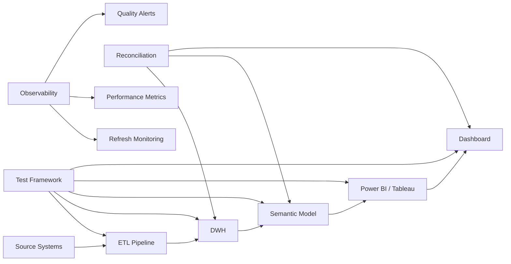
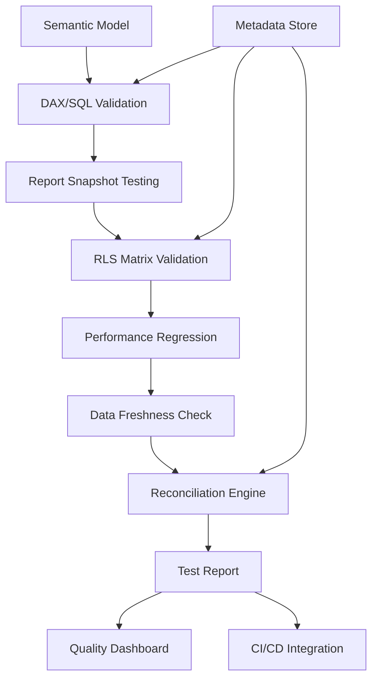

# BI Testing — Senior Test Engineer / Test Architect Interview Guide

## 1. Interview Expectations at 15+ Years

**What interviewers expect from a 15+ year candidate:**

- Can validate BI dashboards end-to-end (source → DWH → BI tool)
- Understands DAX, Power Query, Tableau calculations deeply
- Can identify semantic model vs source data discrepancies
- Has tested report accuracy with complex business logic
- Knows how to test row-level security, permissions, filters, slicers
- Can design automation for BI regression testing
- Understands refresh strategies, DirectQuery vs Import, stale data issues

**Senior Engineer:** Validates reports, tests DAX measures
**Lead:** Designs BI test strategy, standardizes validation approach
**Test Architect:** Architects BI quality platform, defines semantic model standards
**Staff/Principal:** Influences BI governance across org, defines data dictionary

## 2. Technology Overview

### What it is
BI testing validates business intelligence dashboards, reports, and analytics against source data and business requirements.

### How it works
Source → ETL → DWH → Semantic Model → BI Tool → Dashboard. Each layer can introduce errors.

### Where it is used
Power BI, Tableau, Qlik, Looker, Excel, custom reports.

### How it fails
- Semantic model logic differs from DWH logic
- Filter context changes results
- Stale data in extracts
- Permission-based data masking errors
- Calculation errors in DAX/calculated fields
- Dashboard-vs-DWH discrepancies

### How it should be tested
- Source-to-report reconciliation
- Measure validation
- Filter/slicer testing
- Row-level security validation
- Refresh testing
- Performance testing
- Visual regression

### How it should be automated
- Automated DAX validation
- Report snapshot comparison
- Semantic model testing
- Scheduled reconciliation jobs

## 3. Core Concepts

### Semantic Models

- **What:** Business logic layer between DWH and BI tool.
- **Why:** Simplifies complex logic for business users.
- **How:** Measures, dimensions, calculated columns defined in semantic model.
- **Testing:** Validate semantic model matches DWH logic.
- **Failure Modes:** Semantic drift, calculation errors.
- **Production:** Monitor semantic model changes.

### DAX (Data Analysis Expressions)

- **What:** Formula language for Power BI, Analysis Services, Power Pivot.
- **Why:** Business logic in semantic model.
- **How:** CALCULATE, FILTER, ALL, context transitions.
- **Testing:** Validate DAX outputs match SQL equivalents.
- **Failure Modes:** Context transition bugs, filter context errors.
- **Production:** DAX unit tests.

### Power Query / Tableau Prep

- **What:** Data transformation in BI tool before loading to model.
- **Why:** Lightweight transformations at report level.
- **How:** M language (Power Query), Tableau prep flows.
- **Testing:** Validate transformations, test with edge cases.
- **Failure Modes:** Data type changes, missing rows, logic errors.
- **Production:** Version control for M scripts.

### Row-Level Security (RLS)

- **What:** Row filtering based on user identity.
- **Why:** Data access control, compliance.
- **How:** DAX filters, Tableau user filters.
- **Testing:** Test all user roles, edge cases, inheritance.
- **Failure Modes:** Over-permission, under-permission, role conflicts.
- **Production:** Validate RLS per user.

### Dashboard Performance

- **What:** Query speed, render time, memory usage.
- **Why:** User experience, scalability.
- **How:** Query diagnostics, rendering metrics.
- **Testing:** Load testing, concurrent user testing.
- **Failure Modes:** Slow queries, memory exhaustion, timeout.
- **Production:** Performance monitoring, optimization.

### Extracts vs DirectQuery

- **What:** Extracts cache data locally; DirectQuery queries source live.
- **Why:** Performance vs freshness trade-off.
- **How:** Extract refresh schedule; DirectQuery live connection.
- **Testing:** Test refresh correctness, staleness, data consistency.
- **Failure Modes:** Stale extract, DirectQuery performance.
- **Production:** Monitor refresh status, query performance.

### Calculated Fields / Measures

- **What:** Business calculations defined in BI tool.
- **Why:** Business-specific metrics not in DWH.
- **How:** DAX formulas, Tableau calculated fields.
- **Testing:** Validate calculation logic against DWH.
- **Failure Modes:** Logic errors, context issues.
- **Production:** Version control, peer review.

### Drill-Down / Drill-Through

- **What:** Navigate from summary to detail.
- **Why:** Root cause analysis, detailed investigation.
- **How:** Hierarchies, detail pages.
- **Testing:** Validate drill accuracy, data consistency.
- **Failure Modes:** Wrong level, missing data, slow performance.
- **Production:** Test drill paths with real data.

## 4. ARCHITECTURE



**Components:**
- Source systems
- ETL pipeline
- DWH
- Semantic model (DAX/Power BI Tableau)
- BI tool (Power BI Tableau Looker)
- Dashboard/reports

**Test Points:**
- Source-to-DWH reconciliation
- DWH-to-semantic model validation
- Semantic model-to-report validation
- Report-to-DWH end-to-end reconciliation

**Scalability:**
- Dashboard performance at scale
- Concurrent user testing
- Large dataset handling

**Reliability:**
- Refresh reliability
- Data freshness monitoring
- Stale data detection

## 5. TOP 50 INTERVIEW QUESTIONS

## Q1. Explain BI testing strategy.

**Difficulty:** Medium
**Interview Stage:** Technical Screen

### What the interviewer is testing
Understanding of BI test approach.

### Strong Senior-Level Answer
BI testing: 1) Validate source-to-DWH data, 2) Validate DWH-to-semantic model logic, 3) Validate semantic model-to-report calculations, 4) End-to-end reconciliation source-to-report. Include: measure validation, filter context testing, RLS testing, refresh validation, performance testing.

### Architect-Level Answer
BI testing strategy covers full pipeline. Design: 1) Automated source-to-DWH reconciliation, 2) Semantic model validation framework, 3) Report-level snapshot testing, 4) Performance regression suite, 5) RLS validation matrix. Integrate into CI/CD. Monitor refresh SLAs.

### Real-World Enterprise Scenario
BI platform with 200 dashboards; automated reconciliation reduced report defects by 80%.

### Likely Follow-Up Questions
- How do you test semantic model changes?
- What is report snapshot testing?
- How do you handle refresh failures?

### Common Weak Answer
"Test dashboards manually."

### Interviewer Probe
"Dashboard shows wrong number. Is it DWH, semantic model, or report?"

### Hands-On Exercise
Design BI test plan for 50-dashboard environment.

---

## Q2. Dashboard shows different revenue than DWH query. How do you investigate?

**Difficulty:** Hard
**Interview Stage:** Production Debugging

### What the interviewer is testing
End-to-end BI debugging skills.

### Strong Senior-Level Answer
1) Compare DWH query vs report query logic, 2) Check filter context in report, 3) Check DAX formula vs SQL logic, 4) Check semantic model measures, 5) Check data freshness (stale extract), 6) Check currency/timezone/format differences.

### Architect-Level Answer
Systematic BI debugging: 1) Query-level comparison, 2) DAX formula analysis, 3) Filter context analysis, 4) Semantic model version check, 5) DWH data check. Use query diagnostics in BI tool. Implement automated reconciliation.

### Real-World Enterprise Scenario
Revenue difference was currency conversion — DWH stored USD, report converted at report time.

### Likely Follow-Up Questions
- How do you compare DAX vs SQL?
- What if both queries are same but results differ?
- How do you handle time zone differences?

### Common Weak Answer
"Check the DWH query."

### Interviewer Probe
"DWH query and report query both return 1000 rows. But numbers differ."

### Hands-On Exercise
Write SQL to reconcile DWH query vs Power BI DAX measure.

---

## Q3. How do you test DAX measures?

**Difficulty:** Medium
**Interview Stage:** Technical Screen

### What the interviewer is testing
DAX validation skills.

### Strong Senior-Level Answer
Test DAX measures by: 1) Comparing DAX output to SQL equivalent, 2) Testing with known inputs, 3) Testing edge cases (empty, null, zero), 4) Testing context transitions (row vs filter context), 5) Testing with different filter contexts.

### Architect-Level Answer
DAX testing requires systematic approach. Implement: 1) DAX unit test framework, 2) SQL-DAX comparison framework, 3) Context transition tests, 4) Regression tests on DAX changes, 5) Performance testing for complex measures. Use tools like DAX Studio.

### Real-World Enterprise Scenario
CALCULATE with wrong filter context produced wrong revenue by 30%.

### Likely Follow-Up Questions
- How do you test CALCULATE?
- What is context transition?
- How do you test ALL vs ALLEXCEPT?

### Common Weak Answer
"Test in Power BI desktop."

### Interviewer Probe
"DAX passes in desktop but fails in service. Why?"

### Hands-On Exercise
Write DAX measure and equivalent SQL for validation.

---

## Q4. How do you test Power BI refresh?

**Difficulty:** Medium
**Interview Stage:** Technical Screen

### What the interviewer is testing
Refresh testing skills.

### Strong Senior-Level Answer
Test refresh: 1) Scheduled refresh completes, 2) Data freshness within SLA, 3) Incremental refresh correctness, 4) Refresh failure handling, 5) Dataset size growth monitoring, 6) Capacity utilization.

### Architect-Level Answer
Refresh testing requires monitoring. Implement: 1) Refresh SLA monitoring, 2) Data freshness alerts, 3) Incremental refresh validation, 4) Refresh history analysis, 5) Capacity planning. Automate refresh verification.

### Real-World Enterprise Scenario
Incremental refresh missed new data; report showed stale data for 3 days.

### Likely Follow-Up Questions
- How do you validate incremental refresh?
- What if refresh fails silently?
- How do you measure data freshness?

### Common Weak Answer
"Check refresh status."

### Interviewer Probe
"Refresh shows success but data is 2 days old. What happened?"

### Hands-On Exercise
Write Power Query logic to validate incremental refresh correctness.

---

## Q5. How do you test row-level security in BI?

**Difficulty:** Hard
**Interview Stage:** Technical Deep Dive

### What the interviewer is testing
Security validation in BI.

### Strong Senior-Level Answer
Test RLS: 1) All user roles tested, 2) Each role sees only authorized rows, 3) Role inheritance tested, 4) Multiple roles combined, 5) Edge cases (no access, all access). Use test accounts for each role.

### Architect-Level Answer
RLS testing requires matrix. Implement: 1) Role-permission matrix, 2) Automated RLS validation per role, 3) RLS regression testing, 4) Audit logging for access, 5) Permission change impact analysis.

### Real-World Enterprise Scenario
RLS allowed US users to see EU data — compliance violation.

### Likely Follow-Up Questions
- How do you test all roles?
- What if roles conflict?
- How do you audit RLS?

### Common Weak Answer
"Test with one admin account."

### Interviewer Probe
"User has two roles. Which data do they see?"

### Hands-On Exercise
Design RLS test matrix for 5 roles and 10 data segments.

---

## Q6. Explain Power BI DirectQuery vs Import mode testing.

**Difficulty:** Medium
**Interview Stage:** Technical Screen

### What the interviewer is testing
Understanding of BI data modes.

### Strong Senior-Level Answer
Import: data cached locally; test refresh correctness, staleness. DirectQuery: live queries; test query performance, source availability, real-time correctness. Different test strategies for each.

### Architect-Level Answer
Mode selection affects testing. Design: 1) Import: refresh validation, data freshness tests, 2) DirectQuery: query performance, source dependency tests, 3) Hybrid: test both paths. Monitor mode-specific SLAs.

### Real-World Enterprise Scenario
DirectQuery reports slow during peak hours; Import mode needed.

### Likely Follow-Up Questions
- When to use each mode?
- How do you test DirectQuery performance?
- What if source is unavailable?

### Common Weak Answer
"Import is faster."

### Interviewer Probe
"Import mode data is 1 day stale. Business needs real-time. What mode?"

### Hands-On Exercise
Compare DirectQuery vs Import performance with test queries.

---

## Q7. How do you test Tableau calculated fields?

**Difficulty:** Medium
**Interview Stage:** Technical Screen

### What the interviewer is testing
Tableau calculation validation.

### Strong Senior-Level Answer
Test calculated fields: 1) Compare Tableau output to SQL/Python equivalent, 2) Test edge cases, 3) Test level of detail (LOD) expressions, 4) Test table calculations, 5) Test parameter interactions.

### Architect-Level Answer
Tableau calculation testing: 1) LOD validation framework, 2) Table calculation boundary tests, 3) Parameter-driven calculation tests, 4) Regression tests for calculation changes, 5) Performance testing for complex LODs.

### Real-World Enterprise Scenario
LOD expression excluded nulls, producing wrong customer counts.

### Likely Follow-Up Questions
- How do you test LOD?
- What is table calculation vs LOD?
- How do you handle nulls in calculations?

### Common Weak Answer
"Test visually in Tableau."

### Interviewer Probe
"Tableau calculation works for one view but wrong for another. Why?"

### Hands-On Exercise
Write equivalent SQL for Tableau calculated field and compare.

---

## Q8. How do you test Tableau LOD expressions?

**Difficulty:** Hard
**Interview Stage:** Technical Deep Dive

### What the interviewer is testing
LOD-specific testing.

### Strong Senior-Level Answer
LOD expressions compute at different granularity. Test: 1) EXCLUDE, INCLUDE, FIXED behaviors, 2) LOD vs regular aggregation differences, 3) LOD with filters, 4) LOD with context filters, 5) LOD performance. Compare to SQL window functions.

### Architect-Level Answer
LOD testing is complex. Implement: 1) LOD-to-SQL mapping tests, 2) LOD with filter context tests, 3) LOD performance benchmarks, 4) LOD regression suite. Use Tableau's query performance tools.

### Real-World Enterprise Scenario
FIXED LOD ignored dimension filters; report showed company total instead of category.

### Likely Follow-Up Questions
- How do you test INCLUDE vs EXCLUDE?
- What if LOD conflicts with filter?
- How do you optimize LOD performance?

### Common Weak Answer
"LOD is like GROUP BY."

### Interviewer Probe
"FIXED LOD and INCLUDE LOD with same field. Difference?"

### Hands-On Exercise
Write SQL equivalent for Tableau LOD expressions.

---

## Q9. Your BI report shows stale data. How do you investigate?

**Difficulty:** Hard
**Interview Stage:** Production Debugging

### What the interviewer is testing
Stale data debugging.

### Strong Senior-Level Answer
1) Check refresh status, 2) Check last refresh time, 3) Check incremental refresh configuration, 4) Check data source freshness, 5) Check cache validity, 6) Check DirectQuery latency. Identify if problem is refresh or source.

### Architect-Level Answer
Stale data requires systematic investigation. Implement: 1) Refresh monitoring dashboard, 2) Data freshness SLA alerts, 3) Stale data detection automation, 4) Root cause analysis for refresh failures, 5) Cache invalidation strategy.

### Real-World Enterprise Scenario
Incremental refresh misconfigured; report showed data from 30 days ago.

### Likely Follow-Up Questions
- How do you monitor refresh?
- What causes refresh failures?
- How do you alert on stale data?

### Common Weak Answer
"Refresh the dataset."

### Interviewer Probe
"Refresh shows success but data is still stale. What next?"

### Hands-On Exercise
Write Power Query logic to validate data freshness post-refresh.

---

## Q10. How do you test dashboard performance?

**Difficulty:** Medium
**Interview Stage:** Technical Screen

### What the interviewer is testing
Performance testing skills.

### Strong Senior-Level Answer
Test: 1) Dashboard load time, 2) Visual render time, 3) Query execution time, 4) Memory usage, 5) Concurrent user performance, 6) Large dataset handling. Use profiling tools (Performance Analyzer in Power BI, Tableau Performance Recorder).

### Architect-Level Answer
Performance testing at scale. Implement: 1) Load testing with concurrent users, 2) Query performance regression suite, 3) Dataset size growth monitoring, 4) DirectQuery vs Import performance comparison, 5) Capacity planning based on metrics.

### Real-World Enterprise Scenario
Dashboard load time 30 seconds after data grew 5x; optimized to 3 seconds.

### Likely Follow-Up Questions
- How do you measure dashboard performance?
- What causes slow dashboards?
- How do you optimize?

### Common Weak Answer
"Make visuals simpler."

### Interviewer Probe
"Dashboard is fast with 100K rows but slow with 10M rows. Why?"

### Hands-On Exercise
Design dashboard performance test suite.

---

## Q11. How do you test Power BI paginated reports?

**Difficulty:** Hard
**Interview Stage:** Technical Deep Dive

### What the interviewer is testing
Paginated report testing.

### Strong Senior-Level Answer
Paginated reports: 1) Test page layout with different data volumes, 2) Test pagination logic, 3) Test export (PDF/Excel) correctness, 4) Test parameter-driven reports, 5) Test with large datasets. Validate pagination accuracy, total correctness.

### Architect-Level Answer
Paginated report testing requires special handling. Implement: 1) Data volume pagination tests, 2) Export format validation, 3) Parameter coverage tests, 4) Print layout testing, 5) Performance with large datasets. Use automated rendering tests.

### Real-World Enterprise Scenario
Paginated report showed 50 rows per page but last page had 5; totals were wrong.

### Likely Follow-Up Questions
- How do you test pagination?
- What if export format differs?
- How do you test with large data?

### Common Weak Answer
"Export to PDF and check."

### Interviewer Probe
"PDF shows different totals than dashboard. Why?"

### Hands-On Exercise
Design paginated report test strategy with validation steps.

---

## Q12. How do you test Excel exports from BI tools?

**Difficulty:** Medium
**Interview Stage:** Technical Screen

### What the interviewer is testing
Export validation skills.

### Strong Senior-Level Answer
Test Excel exports: 1) Row count matches dashboard, 2) Data types preserved, 3) Formatting correct, 4) Pagination correct, 5) All columns included, 6) No truncation. Compare export to source data.

### Architect-Level Answer
Excel export validation: 1) Automated export comparison, 2) Data type preservation tests, 3) Formatting validation, 4) Large export handling, 5) Excel-specific bugs (date formats, scientific notation). Use automated comparison scripts.

### Real-World Enterprise Scenario
Excel export showed dates as serial numbers; users couldn't interpret.

### Likely Follow-Up Questions
- How do you validate Excel exports?
- What if data is truncated?
- How do you handle large exports?

### Common Weak Answer
"Check visually."

### Interviewer Probe
"Excel export has 1M rows. File size?"

### Hands-On Exercise
Write Python script to validate Excel export against source data.

---

## Q13. How do you test dashboard filters and slicers?

**Difficulty:** Medium
**Interview Stage:** Technical Screen

### What the interviewer is testing
Filter context validation.

### Strong Senior-Level Answer
Test filters: 1) Single filter application, 2) Multi-filter interaction, 3) Filter persistence, 4) Default filter values, 5) Filter with null values, 6) Cross-filter impact. Validate each filter changes data correctly.

### Architect-Level Answer
Filter testing requires matrix. Implement: 1) Filter interaction matrix, 2) Automated filter state tests, 3) Filter performance testing, 4) Filter usability testing, 5) Filter regression suite. Test all filter combinations.

### Real-World Enterprise Scenario
Date filter not applied; dashboard showed all time data despite user selection.

### Likely Follow-Up Questions
- How do you test filter interactions?
- What if filter has many values?
- How do you test default filters?

### Common Weak Answer
"Apply filters manually."

### Interviewer Probe
"Two filters applied together. Result different than expected. Why?"

### Hands-On Exercise
Design filter interaction test matrix for 5 filters.

---

## Q14. How do you test drill-down in BI dashboards?

**Difficulty:** Medium
**Interview Stage:** Technical Screen

### What the interviewer is testing
Drill-down validation.

### Strong Senior-Level Answer
Test drill-down: 1) Each level shows correct data, 2) Drill path is correct, 3) No data loss during drill, 4) Performance acceptable, 5) Drill-through passes correct filters. Validate each hierarchy level.

### Architect-Level Answer
Drill-down testing requires hierarchy validation. Implement: 1) Hierarchy completeness tests, 2) Drill path validation, 3) Data consistency across levels, 4) Performance per level, 5) Drill-through parameter passing.

### Real-World Enterprise Scenario
Drill-down from Year → Quarter → Month showed wrong month data.

### Likely Follow-Up Questions
- How do you validate drill paths?
- What if hierarchy is incomplete?
- How do you test drill-through?

### Common Weak Answer
"Click and see if data changes."

### Interviewer Probe
"Drill-down shows 0 records at lowest level. What happened?"

### Hands-On Exercise
Design drill-down validation test for time hierarchy.

---

## Q15. How do you test calculated fields with parameters?

**Difficulty:** Hard
**Interview Stage:** Technical Deep Dive

### What the interviewer is testing
Parameter-driven calculation testing.

### Strong Senior-Level Answer
Test calculated fields with parameters: 1) All parameter values tested, 2) Parameter interactions, 3) Default parameter values, 4) Parameter edge cases, 5) Calculation changes with parameter. Validate each parameter combination.

### Architect-Level Answer
Parameter testing requires combinatorial coverage. Implement: 1) Parameter value matrix, 2) Automated parameter tests, 3) Regression on parameter changes, 4) Parameter performance testing, 5) Parameter documentation.

### Real-World Enterprise Scenario
Parameter default changed; all reports showed different numbers.

### Likely Follow-Up Questions
- How do you test parameter combinations?
- What if parameter is deprecated?
- How do you handle parameter changes?

### Common Weak Answer
"Test with one parameter value."

### Interviewer Probe
"Parameter has 10 values. How many tests?"

### Hands-On Exercise
Write test plan for parameter-driven calculated field with 5 parameter values.

---

## Q16. Your Power BI report shows different numbers for different users. Why?

**Difficulty:** Hard
**Interview Stage:** Production Debugging

### What the interviewer is testing
RLS and filter context debugging.

### Strong Senior-Level Answer
Possible causes: 1) RLS applied differently, 2) Filter context differs (slicers, bookmarks), 3) Parameter values differ, 4) Dataset refresh state differs, 5) Data model differences (composite models). Check each user's effective permissions and filter state.

### Architect-Level Answer
Multi-user variance requires investigation framework. Implement: 1) User-specific reconciliation, 2) RLS audit logging, 3) Filter state capture, 4) Dataset version tracking, 5) User session analysis. Use Power BI audit logs.

### Real-World Enterprise Scenario
Different users saw different revenue because RLS filter was user-dependent.

### Likely Follow-Up Questions
- How do you identify which user sees what?
- What if RLS is correct but numbers differ?
- How do you debug composite models?

### Common Weak Answer
"RLS issue."

### Interviewer Probe
"Two users with same role see different data. Why?"

### Hands-On Exercise
Write SQL to simulate different user RLS filters and compare outputs.

---

## Q17. How do you test Power BI Composite Models?

**Difficulty:** Very Hard
**Interview Stage:** Architecture

### What the interviewer is testing
Composite model complexity.

### Strong Senior-Level Answer
Composite models combine Import and DirectQuery. Test: 1) Import data freshness, 2) DirectQuery performance, 3) Join behavior between modes, 4) Query plan analysis, 5) Data consistency across modes. Validate that combined results are correct.

### Architect-Level Answer
Composite models require special testing. Implement: 1) Import vs DirectQuery consistency tests, 2) Join behavior validation, 3) Query performance by mode, 4) Failure mode testing (DirectQuery down), 5) Hybrid scenario coverage.

### Real-World Enterprise Scenario
Composite model join failed silently; Import table had no matching DirectQuery rows.

### Likely Follow-Up Questions
- How do you test joins across modes?
- What if DirectQuery is slow?
- How do you handle DirectQuery failures?

### Common Weak Answer
"Test each model separately."

### Interviewer Probe
"Import and DirectQuery both work alone but fail joined. Why?"

### Hands-On Exercise
Design composite model test strategy with mode validation.

---

## Q18. How do you test Tableau extracts?

**Difficulty:** Medium
**Interview Stage:** Technical Screen

### What the interviewer is testing
Tableau extract testing.

### Strong Senior-Level Answer
Test Tableau extracts: 1) Extract refresh completes, 2) Data matches source, 3) Extract size monitored, 4) Extract performance tested, 5) Incremental extract correctness. Validate extract vs live connection consistency.

### Architect-Level Answer
Extract testing requires validation framework. Implement: 1) Extract refresh monitoring, 2) Data comparison (extract vs source), 3) Extract size alerts, 4) Incremental extract logic testing, 5) Extract versioning. Use Tableau Server API for monitoring.

### Real-World Enterprise Scenario
Tableau extract refresh failed; dashboard showed 2-week old data.

### Likely Follow-Up Questions
- How do you monitor extract refresh?
- What if extract is corrupted?
- How do you test incremental refresh?

### Common Weak Answer
"Check extract status."

### Interviewer Probe
"Extract refresh shows success but data is old. Why?"

### Hands-On Exercise
Write script to validate Tableau extract data against source.

---

## Q19. How do you test Tableau parameters and sets?

**Difficulty:** Hard
**Interview Stage:** Technical Deep Dive

### What the interviewer is testing
Tableau-specific feature testing.

### Strong Senior-Level Answer
Test parameters: 1) All values tested, 2) Dynamic parameters, 3) Parameter dependencies, 4) Default values. Test sets: 1) Set membership correct, 2) Set-based calculations, 3) Set interactions, 4) Dynamic set logic. Validate each parameter/set combination.

### Architect-Level Answer
Tableau parameters/sets require systematic testing. Implement: 1) Parameter value matrix, 2) Set membership validation, 3) Parameter/set interaction tests, 4) Regression suite, 5) Performance testing for set operations.

### Real-World Enterprise Scenario
Dynamic set logic changed; customer segmentation was wrong.

### Likely Follow-Up Questions
- How do you test dynamic sets?
- What if parameter is invalid?
- How do you handle set performance?

### Common Weak Answer
"Test visually."

### Interviewer Probe
"Parameter value not in list. What happens?"

### Hands-On Exercise
Write test cases for Tableau parameter with 5 values and 3 dependent sets.

---

## Q20. How do you test dashboard exports to PDF?

**Difficulty:** Medium
**Interview Stage:** Technical Screen

### What the interviewer is testing
Export validation.

### Strong Senior-Level Answer
Test PDF exports: 1) Layout matches dashboard, 2) Data correct, 3) Pagination correct, 4) No cut-off content, 5) Fonts/icons render, 6) Page numbers correct, 7) Date/time stamps correct. Compare PDF content to source data.

### Architect-Level Answer
PDF export testing requires automation. Implement: 1) Automated PDF content extraction, 2) Data validation against source, 3) Layout consistency checks, 4) Pagination tests, 5) Font rendering tests. Use PDF parsing libraries.

### Real-World Enterprise Scenario
PDF export cut off right-side visuals; executives received incomplete reports.

### Likely Follow-Up Questions
- How do you validate PDF content?
- What if PDF layout differs?
- How do you handle large dashboards?

### Common Weak Answer
"Print to PDF and check."

### Interviewer Probe
"PDF has wrong page count. What happened?"

### Hands-On Exercise
Write Python script to validate PDF export against dashboard data.

---

## Q21. Your dashboard shows 0 records. ETL pipeline reports SUCCESS. What do you do?

**Difficulty:** Hard
**Interview Stage:** Production Debugging

### What the interviewer is testing
Systematic dashboard debugging.

### Strong Senior-Level Answer
1) Check DWH data for period, 2) Check semantic model data, 3) Check report filters, 4) Check RLS settings, 5) Check DAX measures, 6) Check data freshness. ETL success doesn't guarantee data.

### Architect-Level Answer
Dashboard shows 0 records is common issue. Debug: 1) Data presence check, 2) Filter validation, 3) RLS check, 4) Measure validation, 5) Data freshness check. Implement automated dashboard health checks.

### Real-World Enterprise Scenario
Dashboard filter set to "Last 7 days" but data was 8 days old; showed 0.

### Likely Follow-Up Questions
- How do you check data freshness?
- What if RLS blocks all data?
- How do you automate dashboard checks?

### Common Weak Answer
"Check ETL logs."

### Interviewer Probe
"ETL SUCCESS. DWH has data. Dashboard still 0. What next?"

### Hands-On Exercise
Write SQL to check each layer (source, DWH, semantic model) for dashboard data.

---

## Q22. How do you test KPI calculations in BI?

**Difficulty:** Medium
**Interview Stage:** Technical Screen

### What the interviewer is testing
KPI validation.

### Strong Senior-Level Answer
Test KPIs: 1) Calculate KPI manually for sample data, 2) Compare to BI output, 3) Test edge cases (zero, null, negative), 4) Test time-based KPIs (MoM, YoY), 5) Test with different filter contexts. Validate KPI logic against business definition.

### Architect-Level Answer
KPI testing requires business alignment. Implement: 1) KPI definition registry, 2) Automated KPI validation, 3) KPI regression tests, 4) KPI performance testing, 5) KPI documentation. Use business stakeholders for validation.

### Real-World Enterprise Scenario
KPI formula used SUM instead of AVERAGE; reported 10x actual.

### Likely Follow-Up Questions
- How do you validate KPI formula?
- What if KPI definition changes?
- How do you test time-based KPIs?

### Common Weak Answer
"Check KPI manually."

### Interviewer Probe
"KPI shows 100. Business says 120. How do you find discrepancy?"

### Hands-On Exercise
Write SQL to calculate KPI and compare with Power BI DAX measure.

---

## Q23. How do you test slicer interactions in BI?

**Difficulty:** Medium
**Interview Stage:** Technical Screen

### What the interviewer is testing
Slicer interaction testing.

### Strong Senior-Level Answer
Test slicers: 1) Single slicer filters correctly, 2) Multi-slicer interaction (AND/OR), 3) Slicer cross-report impact, 4) Slicer default state, 5) Slicer with null values, 6) Slicer performance. Validate each slicer configuration.

### Architect-Level Answer
Slicer testing requires interaction matrix. Implement: 1) Slicer interaction matrix, 2) Automated slicer state tests, 3) Slicer performance tests, 4) Slicer regression suite. Test with realistic filter combinations.

### Real-World Enterprise Scenario
Slicer used OR logic instead of AND; showed too much data.

### Likely Follow-Up Questions
- How do you test slicer logic?
- What if slicer has 1000 values?
- How do you handle slicer state?

### Common Weak Answer
"Test slicer visually."

### Interviewer Probe
"Two slicers applied. Result shows OR instead of AND. Why?"

### Hands-On Exercise
Design slicer interaction test matrix for 4 slicers with AND/OR logic.

---

## Q24. How do you test BI tool upgrade (e.g., Power BI Desktop version)?

**Difficulty:** Hard
**Interview Stage:** Technical Deep Dive

### What the interviewer is testing
Upgrade testing.

### Strong Senior-Level Answer
Test upgrade: 1) All reports render correctly, 2) DAX measures still work, 3) Data model intact, 4) Performance same or better, 5) No breaking changes, 6) RLS still works. Run regression suite against new version.

### Architect-Level Answer
Upgrade testing requires comprehensive regression. Implement: 1) Automated report rendering tests, 2) DAX validation suite, 3) Performance benchmark, 4) RLS validation, 5) Data model compatibility check. Use upgrade in staging first.

### Real-World Enterprise Scenario
Power BI upgrade changed DAX behavior; 30 reports broke.

### Likely Follow-Up Questions
- How do you test upgrade impact?
- What if reports break?
- How do you roll back?

### Common Weak Answer
"Upgrade and test manually."

### Interviewer Probe
"Upgrade broke 10 reports. How do you prioritize fixes?"

### Hands-On Exercise
Design upgrade test strategy for 100-report Power BI environment.

---

## Q25. How do you test BI accessibility (WCAG compliance)?

**Difficulty:** Hard
**Interview Stage:** Architecture

### What the interviewer is testing
Accessibility testing.

### Strong Senior-Level Answer
Test accessibility: 1) Screen reader compatibility, 2) Color contrast, 3) Keyboard navigation, 4) Alt text for visuals, 5) Accessible data tables. Use accessibility audit tools.

### Architect-Level Answer
Accessibility is compliance requirement. Implement: 1) WCAG audit per dashboard, 2) Automated accessibility checks, 3) Screen reader testing, 4) Keyboard navigation tests, 5) Color contrast validation. Track accessibility debt.

### Real-World Enterprise Scenario
Dashboard failed WCAG audit; color contrast insufficient for color-blind users.

### Likely Follow-Up Questions
- How do you test screen readers?
- What are WCAG requirements?
- How do you handle color palettes?

### Common Weak Answer
"Check with a user."

### Interviewer Probe
"Dashboard passes WCAG but screen reader says wrong thing. Why?"

### Hands-On Exercise
Design accessibility test checklist for BI dashboards.

---

## Q26. How do you test mobile BI dashboards?

**Difficulty:** Medium
**Interview Stage:** Technical Screen

### What the interviewer is testing
Mobile-specific testing.

### Strong Senior-Level Answer
Test mobile: 1) Layout adapts to screen size, 2) Touch interactions work, 3) Performance on mobile, 4) Data readability on small screens, 5) Mobile-specific features (offline, push). Test on actual devices.

### Architect-Level Answer
Mobile testing requires device matrix. Implement: 1) Device-specific testing, 2) Responsive layout validation, 3) Touch interaction tests, 4) Mobile performance benchmarks, 5) Offline mode testing. Use device farms.

### Real-World Enterprise Scenario
Mobile dashboard showed truncated text; key metrics unreadable.

### Likely Follow-Up Questions
- How do you test on multiple devices?
- What if mobile layout breaks?
- How do you test offline mode?

### Common Weak Answer
"Test on one phone."

### Interviewer Probe
"Mobile dashboard slow on 3G. How do you optimize?"

### Hands-On Exercise
Design mobile BI test matrix for 5 device sizes.

---

## Q27. How do you test embedded BI (iframe / API)?

**Difficulty:** Hard
**Interview Stage:** Technical Deep Dive

### What the interviewer is testing
Embedded BI complexity.

### Strong Senior-Level Answer
Test embedded BI: 1) Embed authentication works, 2) Report renders correctly in iframe, 3) SSO integration, 4) Cross-domain issues, 5) Responsive in embed container, 6) API-driven reports. Validate embedding scenarios.

### Architect-Level Answer
Embedded BI requires integration testing. Implement: 1) Authentication flow tests, 2) Embed rendering validation, 3) SSO integration tests, 4) API report generation tests, 5) Cross-browser embed testing. Use automated embed testing.

### Real-World Enterprise Scenario
Embedded report failed in Safari due to iframe cookie restrictions.

### Likely Follow-Up Questions
- How do you test SSO?
- What if iframe blocks cookies?
- How do you test different embed containers?

### Common Weak Answer
"Test in one browser."

### Interviewer Probe
"Report embeds in Salesforce but not in custom app. Why?"

### Hands-On Exercise
Design embedded BI test strategy with authentication and rendering validation.

---

## Q28. How do you test BI with connected data sources (Live connection)?

**Difficulty:** Hard
**Interview Stage:** Technical Deep Dive

### What the interviewer is testing
Live connection testing.

### Strong Senior-Level Answer
Test live connections: 1) Connection reliability, 2) Query performance, 3) Source availability impact, 4) Real-time data correctness, 5) Error handling when source down, 6) Connection pooling. Validate live connection vs extract consistency.

### Architect-Level Answer
Live connection testing requires source monitoring. Implement: 1) Connection health checks, 2) Query performance monitoring, 3) Source availability SLA, 4) Failover testing, 5) Data consistency validation between live and cached.

### Real-World Enterprise Scenario
Live connection to source DB slow during peak; dashboard timed out.

### Likely Follow-Up Questions
- How do you handle source downtime?
- What if live query is slow?
- How do you cache results?

### Common Weak Answer
"Use import mode."

### Interviewer Probe
"Business needs real-time data. Live connection slow. Options?"

### Hands-On Exercise
Design live connection test strategy with performance and failover validation.

---

## Q29. How do you test BI with custom visual extensions?

**Difficulty:** Very Hard
**Interview Stage:** Architecture

### What the interviewer is testing
Custom visual testing.

### Strong Senior-Level Answer
Test custom visuals: 1) Visual renders correctly, 2) Data binding works, 3) Interactions with other visuals, 4) Performance with large data, 5) Mobile rendering, 6) Accessibility. Validate custom visual independently and in dashboard context.

### Architect-Level Answer
Custom visuals require special testing. Implement: 1) Visual unit tests, 2) Data binding validation, 3) Interaction tests, 4) Performance benchmarks, 5) Cross-browser testing, 6) Accessibility audit. Use visual regression testing.

### Real-World Enterprise Scenario
Custom visual broke after Power BI update; custom JavaScript incompatible.

### Likely Follow-Up Questions
- How do you test visual regression?
- What if custom visual fails?
- How do you version custom visuals?

### Common Weak Answer
"Test manually."

### Interviewer Probe
"Custom visual works in Desktop but fails in Service. Why?"

### Hands-On Exercise
Design custom visual test strategy with regression and compatibility testing.

---

## Q30. How do you test data category and format in BI?

**Difficulty:** Medium
**Interview Stage:** Technical Screen

### What the interviewer is testing
Data type handling in BI.

### Strong Senior-Level Answer
Test data categories: 1) Date/time formatting, 2) Number formatting (currency, percentage), 3) Text sorting, 4) Geographic mapping, 5) Image URLs. Validate correct display and sorting.

### Architect-Level Answer
Data category testing prevents display errors. Implement: 1) Data category validation suite, 2) Format consistency checks, 3) Locale-specific testing, 4) Sorting validation, 5) Geographic mapping tests.

### Real-World Enterprise Scenario
Date column treated as text; sorted alphabetically (2023 before 2024).

### Likely Follow-Up Questions
- How do you test date formatting?
- What if locale differs?
- How do you handle mixed types?

### Common Weak Answer
"Check display."

### Interviewer Probe
"Date sorted as text shows 2023, 2024, 2025 but wrong month order."

### Hands-On Exercise
Write test cases for data category validation in Power BI.

---

## Q31. How do you test BI tool clustering and distribution strategies?

**Difficulty:** Hard
**Interview Stage:** Architecture

### What the interviewer is testing
Understanding of BI infrastructure.

### Strong Senior-Level Answer
BI clustering: 1) Capacity planning, 2) Node health monitoring, 3) Load balancing, 4) Failover testing, 5) Scale-out testing. Test with concurrent user simulation.

### Architect-Level Answer
BI clustering requires infrastructure testing. Implement: 1) Load testing with virtual users, 2) Failover testing, 3) Capacity monitoring, 4) Auto-scale testing, 5) Performance benchmarks per node. Use load testing tools.

### Real-World Enterprise Scenario
Power BI capacity exhausted during month-end; reports failed.

### Likely Follow-Up Questions
- How do you monitor capacity?
- What if cluster fails?
- How do you size capacity?

### Common Weak Answer
"Add more nodes."

### Interviewer Probe
"Cluster has 5 nodes. One fails. What happens?"

### Hands-On Exercise
Design BI clustering test plan with failover and load testing.

---

## Q32. How do you test BI gateway connectivity?

**Difficulty:** Hard
**Interview Stage:** Technical Deep Dive

### What the interviewer is testing
Gateway infrastructure testing.

### Strong Senior-Level Answer
Test gateway: 1) Data source connectivity, 2) Authentication passthrough, 3) Refresh scheduling, 4) Gateway clustering, 5) Network latency, 6) Firewall rules. Validate gateway is reliable and performant.

### Architect-Level Answer
Gateway testing requires connectivity validation. Implement: 1) Connectivity health checks, 2) Authentication test matrix, 3) Refresh SLA monitoring, 4) Gateway performance tests, 5) Network configuration validation.

### Real-World Enterprise Scenario
Gateway authentication changed; all scheduled refreshes failed silently.

### Likely Follow-Up Questions
- How do you test gateway connectivity?
- What if gateway is down?
- How do you monitor gateway health?

### Common Weak Answer
"Check gateway status."

### Interviewer Probe
"Gateway shows online but data sources can't connect. Why?"

### Hands-On Exercise
Design gateway connectivity test matrix for 10 data sources.

---

## Q33. How do you test BI with row-level security at scale (1000+ users)?

**Difficulty:** Very Hard
**Interview Stage:** Architect

### What the interviewer is testing
RLS at enterprise scale.

### Strong Senior-Level Answer
RLS at scale: 1) Test representative sample of roles, 2) Automated RLS validation per role, 3) Role membership audit, 4) Permission inheritance testing, 5) Performance impact of RLS. Use role-based test accounts.

### Architect-Level Answer
Enterprise RLS requires automation. Implement: 1) Role-permission matrix, 2) Automated RLS test suite, 3) RLS performance benchmarks, 4) Role change impact analysis, 5) RLS audit dashboard. Use Azure AD groups for role management.

### Real-World Enterprise Scenario
RLS tested with 10 roles but 500 roles in production; undetected permission issues.

### Likely Follow-Up Questions
- How do you test all roles efficiently?
- What if roles are dynamic?
- How do you audit RLS at scale?

### Common Weak Answer
"Test each role manually."

### Interviewer Probe
"500 roles, 1000 users. How do you validate RLS?"

### Hands-On Exercise
Design automated RLS validation for 500-role enterprise BI system.

---

## Q34. Your Power BI dataset refresh fails for 3 days. What do you do?

**Difficulty:** Hard
**Interview Stage:** Production Debugging

### What the interviewer is testing
Refresh failure investigation.

### Strong Senior-Level Answer
1) Check gateway status, 2) Check data source availability, 3) Check dataset size, 4) Check capacity, 5) Check refresh history, 6) Check error messages. Escalate if needed. Notify stakeholders of stale data.

### Architect-Level Answer
Refresh failures need incident management. Implement: 1) Refresh monitoring with alerts, 2) Automated failure diagnosis, 3) Stakeholder notification, 4) Fallback to previous dataset, 5) Root cause analysis. Use Power BI REST API for monitoring.

### Real-World Enterprise Scenario
Gateway authentication expired; 3 days of refresh failures unnoticed.

### Likely Follow-Up Questions
- How do you monitor refresh?
- What if data source is down?
- How do you notify users?

### Common Weak Answer
"Fix the gateway."

### Interviewer Probe
"Gateway works but refresh still fails. What else?"

### Hands-On Exercise
Write Power BI refresh monitoring script with alerting.

---

## Q35. How do you test BI with dynamic parameters (M queries)?

**Difficulty:** Hard
**Interview Stage:** Technical Deep Dive

### What the interviewer is testing
Power Query dynamic logic testing.

### Strong Senior-Level Answer
Test dynamic M queries: 1) All parameter combinations, 2) Dynamic source connection, 3) Query folding validation, 4) Error handling, 5) Performance with dynamic logic. Validate M script produces expected results.

### Architect-Level Answer
Dynamic M queries need systematic testing. Implement: 1) Parameter-driven test framework, 2) Query folding detection, 3) Error scenario testing, 4) Performance regression suite, 5) M script version control.

### Real-World Enterprise Scenario
Dynamic M query changed source table; report broke silently.

### Likely Follow-Up Questions
- How do you validate query folding?
- What if parameter is invalid?
- How do you test M script changes?

### Common Weak Answer
"Test in Power BI Desktop."

### Interviewer Probe
"M query works in Desktop but fails in Service. Why?"

### Hands-On Exercise
Write M query test cases with parameter variations.

---

## Q36. How do you test BI tool performance under concurrent user load?

**Difficulty:** Very Hard
**Interview Stage:** Architecture

### What the interviewer is testing
Load testing for BI.

### Strong Senior-Level Answer
Test concurrent users: 1) Simulate realistic user behavior, 2) Measure response times, 3) Monitor resource utilization, 4) Identify bottlenecks, 5) Capacity planning. Use load testing tools (JMeter, k6).

### Architect-Level Answer
BI load testing requires realistic scenarios. Implement: 1) User behavior simulation, 2) Performance benchmarks, 3) Resource monitoring, 4) Capacity planning, 5) Auto-scale testing. Test with production-like data volumes.

### Real-World Enterprise Scenario
500 concurrent users during month-end crashed Power BI capacity.

### Likely Follow-Up Questions
- How do you simulate user load?
- What metrics do you monitor?
- How do you scale capacity?

### Common Weak Answer
"Test with 10 users."

### Interviewer Probe
"1000 users expected but only tested with 100. What happens?"

### Hands-On Exercise
Design load test plan for 1000 concurrent BI users.

---

## Q37. How do you test BI with multiple data sources (live + import)?

**Difficulty:** Hard
**Interview Stage:** Technical Deep Dive

### What the interviewer is testing
Multi-source BI complexity.

### Strong Senior-Level Answer
Test multi-source: 1) Each source data correct, 2) Joins across sources correct, 3) Refresh scheduling per source, 4) Performance impact, 5) Data consistency across sources. Validate each source independently and joined.

### Architect-Level Answer
Multi-source BI requires coordination. Implement: 1) Per-source validation, 2) Cross-source consistency checks, 3) Refresh dependency management, 4) Performance optimization, 5) Failure isolation. Use data lineage for traceability.

### Real-World Enterprise Scenario
Live source updated during import refresh; dashboard showed inconsistent data.

### Likely Follow-Up Questions
- How do you handle source latency?
- What if one source is down?
- How do you ensure consistency?

### Common Weak Answer
"Test each source separately."

### Interviewer Probe
"Live source delayed by 1 hour. Import shows current data. Which is correct?"

### Hands-On Exercise
Design multi-source BI test strategy with consistency validation.

---

## Q38. How do you test BI report versioning and change management?

**Difficulty:** Hard
**Interview Stage:** Architecture

### What the interviewer is testing
Change management in BI.

### Strong Senior-Level Answer
Test versioning: 1) Report version tracked, 2) Changes documented, 3) Rollback capability, 4) Impact analysis, 5) User notification. Implement CI/CD for BI content.

### Architect-Level Answer
BI versioning requires governance. Implement: 1) Version control for report files, 2) Change approval workflow, 3) Automated deployment, 4) Rollback procedures, 5) Impact analysis automation. Use Git-based BI asset management.

### Real-World Enterprise Scenario
Report change broke 20 dashboards; no version control made rollback impossible.

### Likely Follow-Up Questions
- How do you track report changes?
- What if change breaks reports?
- How do you implement CI/CD for BI?

### Common Weak Answer
"Save a copy before changes."

### Interviewer Probe
"100 reports changed in one sprint. How do you validate?"

### Hands-On Exercise
Design BI version control and change management framework.

---

## Q39. How do you test BI data lineage for report accuracy?

**Difficulty:** Hard
**Interview Stage:** Technical Deep Dive

### What the interviewer is testing
Lineage-based validation.

### Strong Senior-Level Answer
Test lineage: 1) Report → Semantic Model → DWH → Source traceability, 2) Impact analysis for source changes, 3) Data flow validation, 4) Transformation verification. Use lineage tools for automated tracing.

### Architect-Level Answer
Lineage is accuracy foundation. Implement: 1) Automated lineage extraction, 2) Impact analysis for changes, 3) Lineage accuracy validation, 4) Data flow testing, 5) Lineage dashboard. Integrate with data catalog.

### Real-World Enterprise Scenario
Lineage missed a calculated column; impact analysis incomplete.

### Likely Follow-Up Questions
- How do you extract lineage?
- What if lineage is incomplete?
- How do you validate lineage accuracy?

### Common Weak Answer
"Trace manually."

### Interviewer Probe
"Lineage shows A→B→C. But report uses D. How?"

### Hands-On Exercise
Write script to validate BI report lineage from source to dashboard.

---

## Q40. How do you test BI tool with gateway cluster failover?

**Difficulty:** Very Hard
**Interview Stage:** Architecture

### What the interviewer is testing
Gateway resilience testing.

### Strong Senior-Level Answer
Test gateway failover: 1) Primary gateway down, 2) Secondary gateway takes over, 3) Refresh continuity, 4) Data source reconnection, 5) No data loss. Simulate gateway failure scenarios.

### Architect-Level Answer
Gateway failover requires testing. Implement: 1) Failover simulation tests, 2) Gateway health monitoring, 3) Automatic failover validation, 4) Data source reconnection tests, 5) Recovery time objectives. Test with realistic failure scenarios.

### Real-World Enterprise Scenario
Gateway cluster failover failed; 2 hours of refresh delay.

### Likely Follow-Up Questions
- How do you simulate gateway failure?
- What if all gateways fail?
- How do you monitor gateway health?

### Common Weak Answer
"Configure gateway cluster."

### Interviewer Probe
"Primary gateway fails but secondary doesn't take over. Why?"

### Hands-On Exercise
Design gateway failover test plan with recovery time validation.

---

## Q41. How do you test BI with paginated reports and parameters?

**Difficulty:** Hard
**Interview Stage:** Technical Deep Dive

### What the interviewer is testing
Paginated report parameter testing.

### Strong Senior-Level Answer
Test parameters: 1) All parameter values tested, 2) Parameter dependencies, 3) Default values, 4) Parameter validation, 5) Output correctness per parameter set. Validate each parameter combination.

### Architect-Level Answer
Paginated report parameters require systematic testing. Implement: 1) Parameter value matrix, 2) Output validation per combination, 3) Parameter dependency tests, 4) Regression suite, 5) Performance testing. Use automated parameter testing.

### Real-World Enterprise Scenario
Parameter dependency not validated; report showed wrong data subset.

### Likely Follow-Up Questions
- How do you test parameter dependencies?
- What if parameter value is invalid?
- How do you handle cascading parameters?

### Common Weak Answer
"Test with one parameter set."

### Interviewer Probe
"Parameter A depends on Parameter B. Both have 10 values. How many tests?"

### Hands-On Exercise
Design parameter test matrix for paginated report with 3 cascading parameters.

---

## Q42. Your DWH query is fast but dashboard is slow. Diagnose.

**Difficulty:** Hard
**Interview Stage:** Production Debugging

### What the interviewer is testing
BI performance debugging.

### Strong Senior-Level Answer
1) Check DAX query performance, 2) Check semantic model complexity, 3) Check filter context size, 4) Check visual complexity, 5) Check data model size, 6) Check concurrent users. Use Performance Analyzer in Power BI.

### Architect-Level Answer
Dashboard slowness despite fast DWH requires BI-specific diagnosis. Implement: 1) DAX query profiling, 2) Semantic model optimization, 3) Visual simplification, 4) Aggregation tables, 5) Performance monitoring dashboard. Use DAX Studio.

### Real-World Enterprise Scenario
DAX measure used CALCULATE over entire table; dashboard loaded 30 seconds.

### Likely Follow-Up Questions
- How do you profile DAX queries?
- What if semantic model is large?
- How do you optimize visuals?

### Common Weak Answer
"Optimize DWH query."

### Interviewer Probe
"DWH query 1 second. Dashboard 30 seconds. Where is time spent?"

### Hands-On Exercise
Write DAX query optimization plan for slow dashboard.

---

## Q43. How do you test BI with data alerts and subscriptions?

**Difficulty:** Medium
**Interview Stage:** Technical Screen

### What the interviewer is testing
Alert testing.

### Strong Senior-Level Answer
Test alerts: 1) Alert triggers at correct threshold, 2) Alert delivery works, 3) Alert content correct, 4) Alert frequency correct, 5) Subscription delivery, 6) Alert dismissal. Validate alert logic with test data.

### Architect-Level Answer
Alert testing requires validation framework. Implement: 1) Alert threshold tests, 2) Delivery channel tests, 3) Alert content validation, 4) Frequency testing, 5) Subscription management tests. Use automated alert simulation.

### Real-World Enterprise Scenario
Alert threshold set to >100 but triggered at >1000 due to data type mismatch.

### Likely Follow-Up Questions
- How do you test alert thresholds?
- What if alert floods users?
- How do you test subscription delivery?

### Common Weak Answer
"Set alert and wait."

### Interviewer Probe
"Alert triggers every minute. How do you prevent alert fatigue?"

### Hands-On Exercise
Design alert testing strategy with threshold validation and delivery tests.

---

## Q44. How do you test BI with natural language queries (Q&A)?

**Difficulty:** Very Hard
**Interview Stage:** Architecture

### What the interviewer is testing
AI-assisted BI testing.

### Strong Senior-Level Answer
Test Q&A: 1) Natural language interpretation accuracy, 2) Query correctness, 3) Result accuracy, 4) Ambiguous query handling, 5) Performance. Validate Q&A against manual queries.

### Architect-Level Answer
Q&A testing requires linguistic coverage. Implement: 1) Query interpretation tests, 2) Result validation, 3) Ambiguity handling, 4) Performance benchmarks, 5) User feedback integration. Use synthetic query generation.

### Real-World Enterprise Scenario
Q&A misinterpreted "revenue" as "cost" due to ambiguous phrasing.

### Likely Follow-Up Questions
- How do you test query interpretation?
- What if query is ambiguous?
- How do you improve Q&A accuracy?

### Common Weak Answer
"Test with sample questions."

### Interviewer Probe
"Q&A returns wrong answer 20% of time. Acceptable?"

### Hands-On Exercise
Design Q&A test framework with 100 sample queries and validation criteria.

---

## Q45. How do you test BI with composite models and live connections?

**Difficulty:** Very Hard
**Interview Stage:** Architecture

### What the interviewer is testing
Composite model + live connection complexity.

### Strong Senior-Level Answer
Test composite + live: 1) Import data freshness, 2) Live connection correctness, 3) Join behavior between import and live, 4) Refresh handling, 5) Performance impact. Validate combined results are consistent.

### Architect-Level Answer
Composite + live requires comprehensive testing. Implement: 1) Import-live consistency tests, 2) Join validation, 3) Refresh coordination, 4) Performance benchmarks, 5) Failure scenario testing. Monitor both data paths.

### Real-World Enterprise Scenario
Composite model join between import and live produced inconsistent results due to timing.

### Likely Follow-Up Questions
- How do you test import-live joins?
- What if live source is slow?
- How do you ensure consistency?

### Common Weak Answer
"Test separately."

### Interviewer Probe
"Import shows 1000 rows, live shows 1200. Joined result?"

### Hands-On Exercise
Design composite model + live connection test strategy with consistency validation.

---

## Q46. How do you test BI security (RLS, object-level security)?

**Difficulty:** Hard
**Interview Stage:** Architecture

### What the interviewer is testing
Comprehensive BI security testing.

### Strong Senior-Level Answer
Test security: 1) RLS per role, 2) Object-level security (table/column access), 3) Row-level security inheritance, 4) Permission combinations, 5) Security regression. Validate all security configurations.

### Architect-Level Answer
BI security requires thorough testing. Implement: 1) Security matrix validation, 2) Automated RLS tests, 3) Object-level access tests, 4) Permission change impact analysis, 5) Security audit logging. Test with least-privilege principle.

### Real-World Enterprise Scenario
Object-level security misconfigured; user accessed restricted financial data.

### Likely Follow-Up Questions
- How do you test object-level security?
- What if roles overlap?
- How do you audit security?

### Common Weak Answer
"Test RLS only."

### Interviewer Probe
"User has two roles with different permissions. Which applies?"

### Hands-On Exercise
Design BI security test matrix for 5 roles with RLS and object-level security.

---

## Q47. How do you test BI with dataflows (Power BI dataflows)?

**Difficulty:** Hard
**Interview Stage:** Technical Deep Dive

### What the interviewer is testing
Dataflow testing in BI ecosystem.

### Strong Senior-Level Answer
Test dataflows: 1) Dataflow refresh completes, 2) Entity transformations correct, 3) Dataflow output matches expectations, 4) Dataflow dependencies, 5) Error handling. Validate each entity transformation.

### Architect-Level Answer
Dataflow testing requires transformation validation. Implement: 1) Entity-level validation, 2) Dataflow dependency mapping, 3) Refresh monitoring, 4) Error handling tests, 5) Dataflow versioning. Use dataflow diagnostics.

### Real-World Enterprise Scenario
Dataflow entity transformation introduced NULLs; downstream reports affected.

### Likely Follow-Up Questions
- How do you test entity transformations?
- What if dataflow fails?
- How do you monitor dataflows?

### Common Weak Answer
"Test dataflow output."

### Interviewer Probe
"Dataflow entity A depends on B. B changes. How do you test?"

### Hands-On Exercise
Design dataflow test strategy with transformation validation.

---

## Q48. How do you test BI with paginated reports and subscriptions?

**Difficulty:** Hard
**Interview Stage:** Technical Deep Dive

### What the interviewer is testing
Paginated report subscription testing.

### Strong Senior-Level Answer
Test subscriptions: 1) Subscription delivery works, 2) Report data correct per subscription, 3) Delivery format correct (PDF/Excel), 4) Schedule accuracy, 5) Recipient list correct, 6) Subscription parameters correct. Validate each subscription configuration.

### Architect-Level Answer
Subscription testing requires validation framework. Implement: 1) Subscription configuration tests, 2) Delivery channel tests, 3) Schedule accuracy tests, 4) Parameter validation, 5) Recipient management tests. Automate subscription validation.

### Real-World Enterprise Scenario
Subscription sent wrong parameter values; 100 users received incorrect reports.

### Likely Follow-Up Questions
- How do you test subscription parameters?
- What if subscription fails?
- How do you validate recipients?

### Common Weak Answer
"Set up subscription and check email."

### Interviewer Probe
"Subscription sends daily but data is weekly. Why?"

### Hands-On Exercise
Design subscription testing strategy with parameter and delivery validation.

---

## Q49. How do you test BI with mobile layout and responsive design?

**Difficulty:** Medium
**Interview Stage:** Technical Screen

### What the interviewer is testing
Responsive BI testing.

### Strong Senior-Level Answer
Test mobile layout: 1) Layout adapts to screen size, 2) Visuals resize correctly, 3) Touch interactions work, 4) Readability on small screens, 5) Performance on mobile. Test on actual mobile devices.

### Architect-Level Answer
Mobile testing requires device matrix. Implement: 1) Device-specific testing, 2) Responsive layout validation, 3) Touch interaction tests, 4) Mobile performance benchmarks, 5) Offline capability tests. Use device farms for testing.

### Real-World Enterprise Scenario
Mobile dashboard showed tiny charts; users couldn't interpret data.

### Likely Follow-Up Questions
- How do you test on multiple devices?
- What if layout breaks on portrait?
- How do you test touch interactions?

### Common Weak Answer
"Check on phone."

### Interviewer Probe
"Dashboard works on iPhone but not Android. Why?"

### Hands-On Exercise
Design mobile BI test matrix for 5 screen sizes and orientations.

---

## Q50. Architect a BI test automation platform for 500 dashboards across Power BI and Tableau.

**Difficulty:** Architect
**Interview Stage:** Architect Round

### What the interviewer is testing
Enterprise BI test architecture.

### Strong Senior-Level Answer
Platform for 500 dashboards: 1) Automated reconciliation framework, 2) Semantic model validation suite, 3) Report snapshot testing, 4) RLS validation matrix, 5) Performance regression suite, 6) Refresh monitoring dashboard, 7) CI/CD for BI content. Integrate with data catalog.

### Architect-Level Answer
Enterprise BI test platform requires comprehensive design. Implement: 1) Metadata-driven test generation, 2) Automated reconciliation per dashboard, 3) DAX/SQL comparison framework, 4) Performance benchmark suite, 5) RLS automated validation, 6) Data freshness monitoring, 7) Change impact analysis. Use cloud infrastructure for scale.

### Real-World Enterprise Scenario
500 dashboards tested manually; 30% defect escape rate. Automated platform reduced to 5%.

### Likely Follow-Up Questions
- How do you prioritize test coverage?
- What is the testing pyramid for BI?
- How do you measure test effectiveness?

### Common Weak Answer
"Test all dashboards manually."

### Interviewer Probe
"500 dashboards, 2 BI engineers. How do you scale testing?"

### Hands-On Exercise
Design BI test automation platform architecture for 500 dashboards with CI/CD integration.

---

## Scenario-Based Interview Questions

## S1. Dashboard shows wrong revenue. DWH query is correct. BI tool shows different.

**Problem:** BI vs DWH discrepancy.
**Assumptions:** Semantic model may have different logic.
**Investigation:** Compare DAX to SQL, check filter context, check measures, check semantic model version.
**Root Cause:** DAX measure used SUMX instead of SUM for revenue.
**Solution:** Fix DAX measure; add reconciliation check.
**Trade-offs:** DAX flexibility vs correctness.
**Automation:** Automated DAX-SQL comparison in CI/CD.
**Follow-ups:**
- How do you prevent DAX errors?
- What if both are correct but differ?

## S2. Report shows stale data after refresh configured correctly.

**Problem:** Refresh success but data stale.
**Assumptions:** Incremental refresh misconfigured.
**Investigation:** Check refresh history, incremental refresh settings, data source freshness, gateway connectivity.
**Root Cause:** Incremental refresh range not updated; only first refresh worked.
**Solution:** Fix incremental refresh configuration; add data freshness check.
**Trade-offs:** Incremental refresh complexity vs full refresh cost.
**Automation:** Data freshness monitoring with alerts.
**Follow-ups:**
- How do you detect stale data automatically?
- What if source data is delayed?

## S3. RLS shows different data for same role on different dashboards.

**Problem:** RLS inconsistent.
**Assumptions:** Role definition differs per dataset.
**Investigation:** Check RLS DAX per dataset, check role membership, check dataset refresh state, check user effective permissions.
**Root Cause:** Two datasets had different RLS DAX for same role name.
**Solution:** Centralize RLS definitions; audit role consistency.
**Trade-offs:** Centralized RLS vs dataset-specific needs.
**Automation:** RLS consistency checker across datasets.
**Follow-ups:**
- How do you enforce RLS consistency?
- What if business needs different RLS per report?

## S4. Paginated report PDF export shows wrong totals.

**Problem:** Export totals incorrect.
**Assumptions:** Paginated report has different aggregation logic.
**Investigation:** Check report query, check grouping, check totals calculation, check parameter values, check page breaks.
**Root Cause:** Report used running total instead of grand total; page breaks affected aggregation.
**Solution:** Fix total calculation; add validation against source.
**Trade-offs:** Running total vs grand total in paginated reports.
**Automation:** Export validation against source data.
**Follow-ups:**
- How do you test paginated report totals?
- What if page count changes?

## S5. Dashboard load time increased 10× after data model change.

**Problem:** Performance regression.
**Assumptions:** Data model change affected query performance.
**Investigation:** Check data model changes, check DAX query plan, check relationship changes, check column cardinality, check refresh state.
**Root Cause:** New many-to-many relationship increased query complexity.
**Solution:** Optimize relationships; use bridge table; add aggregation table.
**Trade-offs:** Model simplicity vs relationship flexibility.
**Automation:** Performance regression detection in CI/CD.
**Follow-ups:**
- How do you detect performance regression?
- What if optimization breaks other reports?

## S6. Report shows correct data locally but wrong in published service.

**Problem:** Environment discrepancy.
**Assumptions:** Different data sources or parameters.
**Investigation:** Compare Desktop vs Service data source, check parameters, check refresh state, check dataset mode (Import vs DirectQuery).
**Root Cause:** Service dataset used different data source (staging instead of production).
**Solution:** Standardize data source configuration; add environment validation.
**Trade-offs:** Environment isolation vs consistency.
**Automation:** Environment validation checks post-deployment.
**Follow-ups:**
- How do you prevent environment misconfiguration?
- What if parameters differ?

## S7. DAX measure returns BLANK for some filters but not others.

**Problem:** DAX context issue.
**Assumptions:** Filter context missing data.
**Investigation:** Check DAX formula for context dependencies, check relationship direction, check filter propagation, check blank handling.
**Root Cause:** Many-to-one relationship filtering direction prevented data flow.
**Solution:** Adjust relationship cross-filter direction; use CROSSFILTER.
**Trade-offs:** Filter direction vs performance.
**Automation:** DAX context testing in CI/CD.
**Follow-ups:**
- How do you test DAX context?
- What if cross-filter breaks performance?

## S8. BI dashboard slow during month-end. Normal other times.

**Problem:** Periodic performance issue.
**Assumptions:** Month-end data volume spike.
**Investigation:** Check data volume at month-end, check query patterns, check resource utilization, check concurrent users, check aggregation coverage.
**Root Cause:** Month-end data 10x normal; no aggregation table for large queries.
**Solution:** Add aggregation tables; optimize queries; scale capacity temporarily.
**Trade-offs:** Aggregation maintenance vs query performance.
**Automation:** Performance monitoring with month-end alerts.
**Follow-ups:**
- How do you predict month-end load?
- What if aggregation fails?

## S9. Power BI gateway fails; all scheduled refreshes stop.

**Problem:** Gateway failure.
**Assumptions:** Single point of failure.
**Investigation:** Check gateway status, check data source connectivity, check authentication, check cluster health, check network.
**Root Cause:** Gateway service crashed; no cluster redundancy.
**Solution:** Implement gateway cluster; add health monitoring; configure alerts.
**Trade-offs:** Gateway redundancy vs complexity.
**Automation:** Gateway health monitoring with auto-failover.
**Follow-ups:**
- How do you detect gateway failure?
- What if all gateways fail?

## S10. Report numbers differ between two similar dashboards.

**Problem:** Inconsistent reports.
**Assumptions:** Different semantic models or filters.
**Investigation:** Compare DAX measures, compare data sources, compare filters, compare parameters, compare dataset versions.
**Root Cause:** Two dashboards used different semantic models with different DAX logic for same measure.
**Solution:** Standardize semantic model; implement measure governance.
**Trade-offs:** Consistency vs flexibility.
**Automation:** Measure consistency validation across dashboards.
**Follow-ups:**
- How do you enforce measure consistency?
- What if business needs different calculations?

---

## System Design / Test Architecture

## Design BI test framework for 200 dashboards

**Problem:** Enterprise has 200 dashboards; manual testing impossible.
**Requirements:** Automated testing, semantic model validation, RLS testing, performance testing, CI/CD integration.
**Assumptions:** Power BI + Tableau; data in Snowflake DWH.

**Proposed Architecture:**


**Test Strategy:**
- Semantic model validation (DAX vs SQL)
- Report snapshot comparison
- RLS validation per role
- Performance regression suite
- Data freshness monitoring
- End-to-end reconciliation

**Automation Strategy:**
- Metadata-driven test generation
- Parameterized test fixtures
- GitOps-based deployment
- Parallel test execution

**Scalability:**
- Shard tests by dashboard
- Distributed test execution
- Incremental test selection

**Performance:**
- Test with sampled data
- Parallelize test runs
- Cache test data

**Reliability:**
- Retry flaky tests
- Isolate test failures
- Alert on systemic failures

**Failure Handling:**
- Test infrastructure failure
- Data source unavailability
- Network issues

**Observability:**
- Test coverage dashboard
- Failure rate tracking
- Performance trend analysis

**Security:**
- Test data masking
- Access controls
- Audit logging

**Cost Considerations:**
- Test environment sizing
- Compute cost optimization
- Storage for test artifacts

**Trade-offs:**
- Comprehensive testing vs speed
- Exact validation vs sampling
- Automation cost vs manual effort

**Alternative Designs:**
- DAX-only validation framework
- Sampling-based framework
- Full reconciliation framework

**Interviewer Follow-Ups:**
- How do you handle dashboard changes?
- What is the test maintenance strategy?
- How do you measure testing ROI?

---

## Hands-On Exercises

## H1. Write DAX to calculate revenue vs SQL equivalent

**Problem:** Validate DAX revenue measure matches SQL revenue calculation.

**Input:** DAX measure: `Revenue = SUM(Sales[Amount])`
SQL: `SELECT SUM(amount) FROM sales`

**Expected Output:** DAX and SQL return same value.

**Solution:**
```dax
Revenue = SUM(Sales[Amount])
```

```sql
SELECT SUM(amount) AS revenue FROM sales;
```

**Explanation:** Simple SUM measure; validate by comparing DAX output to SQL output for same filter context.

**Complexity:** O(n) for SUM scan.

**Production Considerations:**
- Test with empty table
- Test with all NULLs
- Test with negative values

---

## H2. Write SQL to validate BI semantic model measures

**Problem:** Validate 5 semantic model measures against DWH queries.

**Input:** Semantic model measures and DWH tables.

**Expected Output:** Validation results per measure.

**Solution:**
```sql
-- Measure 1: Total Revenue
SELECT 
    dwh_sum = (SELECT SUM(amount) FROM sales),
    bi_value = {bi_revenue_value}
FROM sales
WHERE 1=0;

-- Measure 2: Distinct Customers
SELECT 
    dwh_count = (SELECT COUNT(DISTINCT customer_id) FROM sales),
    bi_value = {bi_customer_count}
FROM sales
WHERE 1=0;
```

**Explanation:** Compare DWH calculation to BI reported value for each measure.

**Complexity:** Depends on measure complexity.

**Production Considerations:**
- Run during off-peak
- Compare with tolerance for rounding

---

## H3. Write Python to validate Power BI dataset refresh

**Problem:** Validate that Power BI dataset refresh produced expected data.

**Input:** Dataset name, expected row count, expected freshness.

**Expected Output:** Validation pass/fail.

**Solution:**
```python
import requests
from datetime import datetime, timedelta

def validate_powerbi_refresh(dataset_name, expected_rows, max_stale_hours=2):
    # Check dataset refresh status
    refresh_url = f"https://api.powerbi.com/v1.0/myorg/datasets/{dataset_name}/refreshes"
    response = requests.get(refresh_url, headers=get_access_token())
    refreshes = response.json().get('value', [])
    
    if not refreshes:
        return {"status": "FAIL", "reason": "No refresh history"}
    
    last_refresh = refreshes[0]
    status = last_refresh.get('status')
    refresh_time = last_refresh.get('refreshTime')
    
    # Check freshness
    refresh_dt = datetime.fromisoformat(refresh_time.replace('Z', '+00:00'))
    stale_hours = (datetime.utcnow() - refresh_dt).total_seconds() / 3600
    
    if status != 'Completed':
        return {"status": "FAIL", "reason": f"Refresh status: {status}"}
    
    if stale_hours > max_stale_hours:
        return {"status": "FAIL", "reason": f"Data stale by {stale_hours:.1f} hours"}
    
    return {"status": "PASS", "refresh_time": refresh_time, "stale_hours": stale_hours}
```

**Explanation:** Validates refresh status and data freshness via Power BI REST API.

**Complexity:** O(1) API calls.

**Production Considerations:**
- Handle API rate limits
- Retry on transient failures
- Alert on failures

---

## Production Debugging Incidents

## P1. Dashboard shows 0 for all KPIs

**Symptom:** All KPIs 0.
**Investigation:** Check DWH data, semantic model, report filters, RLS, data freshness.
**Hypotheses:** Filter applied incorrectly, RLS blocks all data, data missing.
**Evidence:** RLS DAX returns FALSE for all users.
**Root Cause:** RLS DAX expression syntax error; no data visible.
**Fix:** Correct RLS DAX; validate per role.
**Prevention:** RLS validation test suite; role-based testing.
**Monitoring:** RLS audit logging; data access metrics.

## P2. Revenue KPI wrong by 10x

**Symptom:** KPI 10x expected.
**Investigation:** Check DAX formula, filter context, data model relationships, measure definition.
**Hypotheses:** Double counting, wrong aggregation, filter context issue.
**Evidence:** DAX measure used SUMX over joined table causing duplication.
**Root Cause:** Many-to-many relationship caused row duplication in SUMX.
**Fix:** Use SUM with proper filter context; review relationships.
**Prevention:** DAX formula review; relationship validation.
**Monitoring:** KPI variance alerts; reconciliation checks.

## P3. Dashboard slow after data model change

**Symptom:** Dashboard load time 30s (was 3s).
**Investigation:** Check data model changes, DAX query plan, relationship changes, column cardinality.
**Hypotheses:** New relationship, high cardinality column, complex DAX.
**Evidence:** New many-to-many relationship increased query complexity.
**Root Cause:** Many-to-many relationship without proper filter direction.
**Fix:** Add aggregation table; optimize DAX; set filter direction.
**Prevention:** Performance regression tests on model changes.
**Monitoring:** Dashboard load time metrics; query plan analysis.

## P4. Power BI dataset refresh failed for 3 days

**Symptom:** Dataset refresh failed; dashboard stale.
**Investigation:** Check gateway, data source, dataset size, capacity, error logs.
**Hypotheses:** Gateway auth expired, data source down, dataset too large.
**Evidence:** Gateway authentication token expired; no renewal configured.
**Root Cause:** Gateway service principal token expired; not renewed automatically.
**Fix:** Configure token auto-renewal; add gateway monitoring.
**Prevention:** Gateway health monitoring; token expiry alerts.
**Monitoring:** Gateway status; refresh failure alerts.

## P5. RLS shows wrong data for user

**Symptom:** User sees data from other department.
**Investigation:** Check RLS DAX, user roles, role membership, dataset refresh, user identity.
**Hypotheses:** RLS DAX bug, role assignment error, dataset stale.
**Evidence:** User in two departments; RLS DAX used OR instead of AND.
**Root Cause:** RLS DAX logic error allowed cross-department access.
**Fix:** Correct RLS DAX; add RLS test suite.
**Prevention:** RLS validation per role; automated RLS testing.
**Monitoring:** RLS audit logs; access anomaly detection.

---

## Architect-Level Trade-offs

| Decision | Option A | Option B | When to Choose A | When to Choose B | Trade-offs |
|----------|----------|----------|------------------|------------------|------------|
| Data mode | Import | DirectQuery | Performance critical | Real-time data needed | Import: fast, stale; DirectQuery: live, slow |
| Semantic model | Single model | Multiple models | Consistent KPIs | Different business needs | Single: simpler; Multiple: flexible but complex |
| RLS implementation | DAX-based | Tableau native | Power BI standard | Tableau standard | DAX powerful; Tableau simpler for basic needs |
| Refresh strategy | Scheduled | Near real-time | Business can tolerate delay | Real-time decisions | Scheduled: cost-effective; Near real-time: expensive |
| Test approach | Automated | Manual + sample | Many dashboards | Few critical dashboards | Automated scales; manual catches edge cases |
| Export format | PDF | Excel | Print-friendly | Analysis needed | PDF: fixed layout; Excel: manipulable |
| Mobile strategy | Responsive | Native app | Budget limited | Mobile-first | Responsive: cost-effective; Native: better UX |

---

## 10 Questions That Expose Surface-Level 15+ Year Experience

1. What is the most complex DAX measure you've tested? What was wrong with it?
2. How did you handle a semantic model that differed from DWH logic?
3. What was your largest BI reconciliation challenge?
4. Tell me about a production BI defect your test strategy missed.
5. How did you validate RLS across 100+ roles?
6. What did you do when Power BI Desktop and Service gave different results?
7. How did you measure BI test coverage?
8. What was your most difficult dashboard performance issue?
9. How did you handle a BI tool upgrade that broke 30 reports?
10. What BI testing automation have you built? What was the ROI?

---

## Top 10 Must-Master Questions

1. **Dashboard vs DWH discrepancy** — Systematic investigation approach
2. **DAX measure validation** — DAX vs SQL comparison
3. **RLS testing** — Role-based security validation
4. **Refresh testing** — Data freshness and reliability
5. **BI performance debugging** — Dashboard load time investigation
6. **Semantic model testing** — Business logic validation
7. **Stale data detection** — Refresh failure investigation
8. **Paginated report testing** — Parameter and output validation
9. **Composite model testing** — Import + Live consistency
10. **BI test automation platform** — Enterprise-scale framework design

---

## One-Day Revision Plan

| Time Block | Focus | Activity |
|-----------|-------|----------|
| 08:00-09:30 | Fundamentals | Review BI testing strategy, semantic model concepts |
| 09:30-11:00 | DAX & Power Query | Practice DAX validation, Power Query testing |
| 11:00-12:30 | RLS & Security | Review RLS testing, permission matrices |
| 12:30-13:30 | Lunch | — |
| 13:30-15:00 | Performance & Debugging | Practice dashboard debugging, performance analysis |
| 15:00-16:30 | Scenario Practice | Solve 3 BI debugging scenarios |
| 16:30-17:30 | Review | Review Top 10 Must-Master questions |
| 17:30-18:00 | Final Revision | Review cheat sheet, key concepts, trade-offs |

---

## Night-Before-Interview Cheat Sheet

**Key Concepts:**
- BI testing: Source → DWH → Semantic Model → Report
- DAX: CALCULATE, FILTER, context transitions
- RLS: Row-level security per user/role
- Refresh: Scheduled, incremental, DirectQuery
- Semantic model: Business logic layer

**SQL Patterns:**
- Reconciliation queries
- Semantic model validation
- DAX-to-SQL comparison
- RLS simulation

**Common Failure Modes:**
- Semantic drift
- RLS misconfiguration
- Stale data in extracts
- DAX context errors
- Dashboard performance

**Common Interviewer Traps:**
- "DWH query correct" ≠ "Report correct"
- "RLS configured" ≠ "RLS correct"
- "Refresh success" ≠ "Data fresh"

**Must-Remember Trade-offs:**
- Import vs DirectQuery
- Centralized vs per-report semantic models
- Automated vs manual BI testing
- RLS complexity vs usability

**High-Frequency Questions:**
- Dashboard vs DWH discrepancy
- DAX measure validation
- RLS testing at scale
- Refresh failure investigation

---

## Interview Cheat Sheet

| Concept | Key Point | Common Trap |
|---------|-----------|-------------|
| DAX Validation | Compare to SQL equivalent | Assuming DAX is correct |
| RLS Testing | Test per role, not just admin | Testing one role only |
| Refresh Testing | Check data freshness | Checking status only |
| Performance | Profile DAX queries | Blaming DWH |
| Semantic Model | Validate logic per measure | Assuming model correct |
| Stale Data | Monitor data freshness | Ignoring extract staleness |
| Composite Models | Test import + live paths | Testing separately |
| Drill-Down | Validate each hierarchy level | Testing only top level |
| Export | Validate PDF/Excel output | Visual check only |
| Alerts | Test threshold + delivery | Testing only trigger |

---

## Senior vs Lead vs Test Architect

| Capability | Senior Engineer | Lead | Test Architect |
|-----------|----------------|------|----------------|
| Technical Depth | DAX, measures | Semantic models, RLS | BI platform architecture |
| Coding | DAX formulas | Test frameworks | Automation frameworks |
| Testing | Report validation | Test strategy | Enterprise BI quality |
| Automation | Report checks | CI/CD for BI | BI test platform |
| Architecture | Dashboard design | BI governance | BI test architecture |
| Data | DWH validation | Semantic model standards | Data quality policy |
| Debugging | BI issues | Incident response | Root cause analysis |
| Performance | Dashboard speed | Performance SLAs | BI performance architecture |
| Scalability | Concurrent users | Capacity planning | BI scalability design |
| CI/CD | Basic deployment | BI deployment pipeline | BI CI/CD architecture |
| Leadership | Individual contributor | Team standards | BI quality governance |
| Communication | Report issues | Stakeholder communication | Executive reporting |
| Strategy | Test individual dashboards | BI test strategy | Enterprise BI quality strategy |
| Governance | Follow BI standards | Enforce standards | Define BI standards |

**Interviewer Expectation:**
- Senior: "How do you test this dashboard?"
- Lead: "How do you standardize BI testing?"
- Architect: "How do you design BI quality for the enterprise?"

---

## Interviewer Scorecard

| Competency | Rating 1-5 | Notes |
|-----------|------------|-------|
| Fundamentals | | BI concepts, DAX, semantic models |
| Hands-on Ability | | DAX writing, SQL validation |
| Testing Expertise | | Report validation, RLS testing |
| Automation | | BI test framework design |
| SQL | | DWH query validation |
| Programming | | DAX, M queries |
| Architecture | | BI platform architecture |
| Data | | Semantic model quality |
| Debugging | | BI issue investigation |
| Performance | | Dashboard performance analysis |
| Scalability | | Concurrent user testing |
| Reliability | | Refresh reliability |
| Observability | | BI monitoring |
| Security | | RLS, object-level security |
| CI/CD | | BI deployment pipeline |
| Communication | | Clear, structured answers |
| Trade-off Reasoning | | Architecture decisions |
| Technical Leadership | | Mentoring, strategy |

---

## Final Interview Readiness Checklist

- [ ] Can explain BI testing strategy
- [ ] Can validate DAX measures
- [ ] Can test RLS for all roles
- [ ] Can debug dashboard discrepancies
- [ ] Can design BI test framework for 200 dashboards
- [ ] Can explain semantic model testing
- [ ] Can handle refresh failures
- [ ] Can discuss BI performance optimization
- [ ] Can defend BI testing trade-offs
- [ ] Can whiteboard BI test architecture
- [ ] Can answer follow-up questions
- [ ] Can explain real-world production incidents
- [ ] Can design automated reconciliation for dashboards
- [ ] Can explain data freshness monitoring
- [ ] Can discuss BI governance and standards

---

## Sources & Further Reading

1. **Power BI Documentation** — https://docs.microsoft.com/en-us/power-bi/ (official docs)
2. **Tableau Documentation** — https://help.tableau.com/ (official docs)
3. **DAX Guide** — https://dax.guide/ (comprehensive DAX reference)
4. **Power BI Performance Optimization** — Microsoft Learn, "Optimize Power BI performance"
5. **Tableau Performance** — Tableau documentation, "Performance tuning"
6. **BI Testing** — Modern BI testing practices
7. **Row-Level Security** — Microsoft Learn, "Row-level security in Power BI"
8. **Dataflows** — Microsoft Learn, "Power BI dataflows"
9. **Composite Models** — Microsoft Learn, "Composite models in Power BI"
10. **Paginated Reports** — Microsoft Learn, "Paginated reports in Power BI"

*Last updated: 2026-10-02*