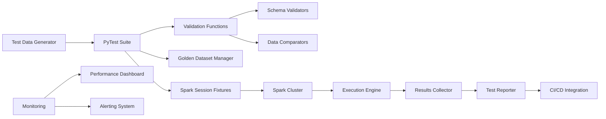

# PySpark Test Automation — Senior Test Engineer / Test Architect Interview Guide

## 1. Interview Expectations at 15+ Years

**What interviewers expect from a 15+ year candidate:**

- Expertise in Spark testing at scale (petabyte-level)
- Deep knowledge of Spark internals (DAG, shuffle, serialization)
- Experience building reusable PySpark test frameworks
- Ability to test complex transformations (window functions, joins, UDFs)
- Understanding of performance tuning and memory optimization
- Experience with Delta Lake, streaming, and schema evolution testing
- Can design CI/CD pipelines for Spark applications

**Senior Engineer:** Writes Spark test cases, executes validation
**Lead:** Designs test frameworks, sets testing standards
**Test Architect:** Architects enterprise test platform for Spark workloads
**Staff/Principal:** Influences Spark strategy across organization

## 2. Technology Overview

### What it is
PySpark test automation uses Spark's Python API to test data processing pipelines, transformations, and distributed computations at scale.

### How it works
Load test data → Execute Spark transformations → Validate results using DataFrame assertions → Report test outcomes.

### Where it is used
ETL/ELT pipelines, data warehouse loading, feature engineering, analytics processing, streaming applications.

### How it fails
- Memory exhaustion (OOM errors) on large data
- Serialization/deserialization errors
- Shuffle performance issues
- Data skew causing stragglers
- Incorrect handling of nulls/empty values
- Schema evolution compatibility issues
- Streaming state management problems
- Exactly-once semantics violations

### How it should be tested
Unit tests for transformations, integration tests for pipelines, end-to-end validation with golden datasets, performance testing.

### How it should be automated
PyTest with Spark fixtures, parameterized tests, CI/CD integration, golden dataset validation.

## 3. Core Concepts

### Spark Session Management
**What:** Entry point for Spark functionality.
**Why:** Controls cluster resources and configuration.
**How:** SparkSession.builder.appName().getOrCreate()
**Testing:** Isolate sessions per test, proper cleanup.
**Failure Modes:** Resource leaks, configuration conflicts.
**Production:** Configure for appropriate resource allocation.

### DataFrame Operations
**What:** Spark's structured API for distributed data processing.
**Why:** Optimized execution via Catalyst optimizer.
**How:** Immutable distributed collections with schema.
**Testing:** Validate schema, transformations, actions.
**Failure Modes:** Schema mismatch, optimization bugs.
**Production:** Use DataFrame API over RDD when possible.

### Test Data Generation
**What:** Creating representative test datasets.
**Why:** Ensures test reliability and reproducibility.
**How:** Synthetic data, sampling production data, edge cases.
**Testing:** Validate data quality and representativeness.
**Failure Modes:** Biased samples, insufficient edge cases.
**Production:** Use production-like data distributions.

### Golden Datasets
**What:** Pre-validated expected outputs for comparison.
**Why:** Provides ground truth for validation.
**How:** Stored test data with expected results.
**Testing:** Compare actual output to golden dataset.
**Failure Modes:** Stale golden datasets, version drift.
**Production:** Automate golden dataset updates.

### Schema Validation
**What:** Verifying DataFrame schema matches expectations.
**Why:** Prevents runtime errors from schema changes.
**How:** Compare actual vs expected StructType.
**Testing:** Test schema evolution compatibility.
**Failure Modes:** Silent data corruption from schema drift.
**Production:** Enforce schema contracts in CI/CD.

### Performance Testing
**What:** Measuring execution time, resource usage, scalability.
**Why:** Ensures efficient cluster utilization.
**How:** Monitor Spark UI metrics, execution plans.
**Testing:** Benchmark with production-like data volumes.
**Failure Modes:** Performance regressions, resource waste.
**Production:** Establish performance baselines and SLAs.

## 4. ARCHITECTURE

**Components:**
- Test data generation (synthetic, production samples)
- PyTest test suite with fixtures
- Spark session management (local/cluster)
- Golden dataset management
- Validation functions (schema, data, performance)
- Spark execution engine
- Results collection and reporting
- CI/CD integration
- Monitoring and alerting

## 5. TOP 50 INTERVIEW QUESTIONS

## Q1. How do you test PySpark DataFrame transformations?

**Difficulty:** Medium
**Interview Stage:** Technical Screen

### What the interviewer is testing
DataFrame transformation testing approach.

### Strong Senior-Level Answer
Test: 1) Input schema validation, 2) Transformation logic with sample data, 3) Output schema validation, 4) Edge cases (empty, nulls, duplicates), 5) Performance with representative data, 6) Golden dataset comparison. Use PyTest fixtures for test data.

### Architect-Level Answer
Transformation testing requires isolation and reproducibility. Implement: 1) Unit tests for each transformation function, 2) Integration tests for pipeline segments, 3) Golden dataset validation for end-to-end correctness, 4) Property-based testing for edge cases, 5) Performance benchmarking, 6) Schema validation tests. Use Spark local mode for fast unit tests.

### Real-World Enterprise Scenario
UDF returned incorrect results for NULL inputs; caused 5% data loss in customer analytics pipeline.

### Likely Follow-Up Questions
- How do you test with large datasets?
- What if transformation has external dependencies?
- How do you test edge cases comprehensively?

### Common Weak Answer
"Run transformation and check output."

### Interviewer Probe
"Test passes on 1K rows but fails on 1M rows with same data pattern. What could cause?"

### Hands-On Exercise
Write PyTest to validate PySpark DataFrame transformation with golden dataset comparison.

---

## Q2. How do you test PySpark join operations?

**Difficulty:** Hard
**Interview Stage:** Technical Deep Dive

### What the interviewer is testing
Join validation in distributed processing.

### Strong Senior-Level Answer
Test joins: 1) Join correctness (cardinality), 2) Join type behavior (inner/left/right/full), 3) Key handling (duplicates, nulls), 4) Performance optimization (broadcast, shuffle), 5) Skew detection and handling, 6) Result validation against expected output. Use EXPLAIN to verify join strategy.

### Architect-Level Answer
Join testing needs comprehensive coverage. Implement: 1) Join type matrix tests, 2) Key uniqueness tests, 3) Null handling tests, 4) Broadcast join eligibility tests, 5) Skew detection tests, 6) Performance benchmarking. Validate with known datasets and expected results.

### Real-World Enterprise Scenario
Broadcast join not used for small lookup table; caused unnecessary shuffle and performance degradation.

### Likely Follow-Up Questions
- How do you test join performance?
- What if data is skewed?
- How do you validate join correctness?

### Common Weak Answer
"Check row count after join."

### Hands-On Exercise
Write PyTest to validate PySpark join operations with different join types and skew detection.

---

## Q3. How do you test PySpark window functions?

**Difficulty:** Hard
**Interview Stage:** Technical Deep Dive

### What the interviewer is testing
Window function validation.

### Strong Senior-Level Answer
Test window functions: 1) Window specification correctness, 2) Frame specification (rows/range), 3) Ordering correctness, 4) Partitioning correctness, 5) Aggregate function correctness, 6) Edge cases (empty data, single row). Validate with known sequences.

### Architect-Level Answer
Window function testing requires temporal awareness. Implement: 1) Window specification tests, 2) Frame boundary tests, 3) Ordering tests, 4) Partitioning tests, 5) Aggregate function tests, 6) Performance tests. Use Window functions for testing.

### Real-World Enterprise Scenario
Window function with RANGE frame on timestamp produced incorrect results due to implicit conversion.

### Likely Follow-Up Questions
- How do you test different frame types?
- What if ordering column has duplicates?
- How do you test at scale?

### Common Weak Answer
"Check window function output."

### Hands-On Exercise
Write PyTest to validate PySpark window functions with different frame specifications.

---

## Q4. How do you test PySpark UDFs (User Defined Functions)?

**Difficulty:** Medium
**Interview Stage:** Technical Screen

### What the interviewer is testing
UDF validation approach.

### Strong Senior-Level Answer
Test UDFs: 1) Input validation (type, null handling), 2) Output correctness for known inputs, 3) Edge cases (extreme values, empty inputs), 4) Performance characteristics, 5) Serialization behavior, 6) Determinism (if required). Test with representative data samples.

### Architect-Level Answer
UDF testing requires isolation and performance awareness. Implement: 1) Unit tests for UDF logic, 2) Serialization tests, 3) Performance benchmarking, 4) Determinism tests, 5) Edge case tests, 6) Integration tests in transformation pipelines. Use Pandas UDFs for better performance when applicable.

### Real-World Enterprise Scenario
UDF threw exception on empty string input; caused task failures in production stage.

### Likely Follow-Up Questions
- How do you test UDF performance?
- What if UDF is non-deterministic?
- How do you test serialization?

### Common Weak Answer
"Test UDF with sample inputs."

### Hands-On Exercise
Write PyTest to validate PySpark UDF with input/output validation and performance testing.

---

## Q5. How do you test PySpark aggregation operations?

**Difficulty:** Medium
**Interview Stage:** Technical Screen

### What the interviewer is testing
Aggregation validation.

### Strong Senior-Level Answer
Test aggregations: 1) Group correctness (items in right group), 2) Aggregate function correctness (sum, count, avg, etc.), 3) Handling of null values, 4) Edge cases (empty data, single group, all same values), 5) Performance with scale. Validate against expected aggregations.

### Architect-Level Answer
Aggregation testing needs edge case coverage. Implement: 1) Group membership tests, 2) Aggregate function tests, 3) Null handling tests, 4) Edge case tests, 5) Performance tests. Compare results with SQL GROUP BY for validation.

### Real-World Enterprise Scenario
SUM aggregation gave different result due to floating point precision issues.

### Likely Follow-Up Questions
- How do you test null handling in aggregates?
- What if aggregation is slow?
- How do you test at scale?

### Common Weak Answer
"Check aggregate values."

### Hands-On Exercise
Write PyTest to validate PySpark aggregation operations with edge case testing.

---

## Q6. How do you test PySpark schema evolution?

**Difficulty:** Hard
**Interview Stage:** Technical Deep Dive

### What the interviewer is testing
Schema change handling.

### Strong Senior-Level Answer
Test schema evolution: 1) Backward compatibility (old code with new schema), 2) Forward compatibility (new code with old schema), 3) Data conversion correctness, 4) Schema registry validation, 5) Performance impact, 6) Error handling for incompatible changes. Validate with schema version history.

### Architect-Level Answer
Schema evolution testing requires version matrix. Implement: 1) Backward/forward compatibility tests, 2) Data conversion validation, 3) Schema registry integration, 4) Performance benchmarking, 5) Error handling tests, 6) Version retirement strategy. Use Avro/Parquet with evolution for testing.

### Real-World Enterprise Scenario
New column added as NOT NULL without default; old data failed to load causing pipeline failure.

### Likely Follow-Up Questions
- How do you test backward compatibility?
- What if schema change is incompatible?
- How do you use schema registry?

### Common Weak Answer
"Just load new schema."

### Hands-On Exercise
Write PyTest to test schema evolution with backward/forward compatibility validation.

---

## Q7. How do you test PySpark streaming applications?

**Difficulty:** Very Hard
**Interview Stage:** Architect

### What the interviewer is testing
Streaming application testing.

### Strong Senior-Level Answer
Test streaming: 1) Exactly-once semantics, 2) Watermarking and late data handling, 3) State management correctness, 4) Checkpointing and recovery, 5) Performance under load, 6) Fault tolerance (node failure, network partition). Validate with controlled data injection.

### Architect-Level Answer
Streaming testing requires temporal and failure scenario awareness. Implement: 1) Exactly-once validation, 2) Watermark advancement tests, 3) Late data handling tests, 4) State correctness tests, 5) Checkpoint recovery tests, 6) Performance benchmarks, 7) Failure injection tests. Use Kafka for controlled data injection.

### Real-World Enterprise Scenario
Streaming job lost state during checkpoint; required manual intervention to recover.

### Likely Follow-Up Questions
- How do you test exactly-once semantics?
- What if checkpoint storage fails?
- How do you test recovery time?

### Common Weak Answer
"Test streaming as batch processing."

### Hands-On Exercise
Design streaming test suite with exactly-once validation and failure injection.

---

## Q8. How do you test PySpark for data skew?

**Difficulty:** Hard
**Interview Stage:** Technical Deep Dive

### What the interviewer is testing
Skew detection and handling.

### Strong Senior-Level Answer
Test skew: 1) Partition size distribution analysis, 2) Join skew detection, 3) Aggregation skew detection, 4) Straggler identification, 5) Mitigation strategies (salting, broadcast), 6) Performance impact. Validate with skewed datasets.

### Architect-Level Answer
Skew testing requires statistical analysis. Implement: 1) Partition size analysis, 2) Join skew detection via keys, 3) Aggregation skew detection, 4) Straggler identification via task metrics, 5) Mitigation validation, 6) Performance benchmarking. Use skew join hints for testing.

### Real-World Enterprise Scenario
Join on user_id had 80% data for one user; caused 20-minute straggler delaying entire job.

### Likely Follow-Up Questions
- How do you detect partition skew?
- What if skew cannot be avoided?
- How do you test mitigation strategies?

### Common Weak Answer
"Check for long-running tasks."

### Hands-On Exercise
Write PySpark to detect and mitigate data skew with salting technique.

---

## Q9. How do you test PySpark checkpointing?

**Difficulty:** Hard
**Interview Stage:** Technical Deep Dive

### What the interviewer is testing
Fault tolerance validation.

### Strong Senior-Level Answer
Test checkpoints: 1) Checkpoint correctness, 2) Recovery accuracy, 3) Performance impact, 4) Checkpoint cleanup, 5) Failure scenarios (node failure, network), 6) State size monitoring. Validate state after recovery matches expected.

### Architect-Level Answer
Checkpoint testing requires failure scenarios. Implement: 1) Checkpoint serialization tests, 2) Recovery correctness tests, 3) Performance impact analysis, 4) Storage validation, 5) Failure injection tests, 6) Garbage collection validation. Use reliable storage for checkpoints.

### Real-World Enterprise Scenario
Checkpoint corrupted; streaming job lost state and restarted from beginning causing data reprocessing.

### Likely Follow-Up Questions
- How do you test checkpoint correctness?
- What if recovery is slow?
- How do you monitor state size?

### Common Weak Answer
"Checkpoint saves state."

### Hands-On Exercise
Design checkpoint test for streaming with failure injection and recovery validation.

---

## Q10. How do you test PySpark with Delta Lake?

**Difficulty:** Hard
**Interview Stage:** Technical Deep Dive

### What the interviewer is testing
Lakehouse integration testing.

### Strong Senior-Level Answer
Test Delta Lake: 1) ACID transaction correctness, 2) Time travel validation, 3) Schema evolution handling, 4) Optimize/ZORDER effectiveness, 5) Change data feed, 6) Streaming ingestion correctness. Validate each Delta Lake feature.

### Architect-Level Answer
Delta Lake testing requires feature validation. Implement: 1) ACID transaction tests, 2) Time travel correctness tests, 3) Schema evolution tests, 4) Optimize/ZORDER validation, 5) Change data feed tests, 6) Streaming ingestion tests. Use Delta Lake API for testing.

### Real-World Enterprise Scenario
Delta Lake time travel showed wrong version due to incorrect transaction log.

### Likely Follow-Up Questions
- How do you test time travel?
- What if schema evolution fails?
- How do you test streaming ingestion?

### Common Weak Answer
"Delta Lake is just Parquet with metadata."

### Hands-On Exercise
Design Delta Lake feature test with ACID, time travel, and schema evolution validation.