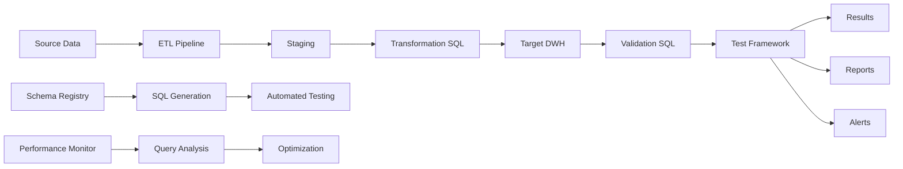

# Advanced SQL — Senior Test Engineer / Test Architect Interview Guide

## 1. Interview Expectations at 15+ Years

**What interviewers expect from a 15+ year candidate:**

- Mastery of complex SQL patterns (CTEs, window functions, recursive queries)
- Deep understanding of query optimization (execution plans, indexing, partitioning)
- Experience with enterprise-scale SQL (billions of rows)
- Can design data validation SQL for ETL/DWH testing
- Knows advanced patterns: gaps and islands, deduplication, SCD2, reconciliation
- Can write efficient reconciliation queries for large datasets
- Understands transaction isolation, locking, concurrency

1. **Senior Engineer:** Writes complex SQL for testing
2. **Lead:** Designs SQL validation framework, sets SQL standards
3. **Test Architect:** Architects SQL testing strategy for enterprise data platforms
4. **Staff/Principal:** Influences SQL governance and data quality standards

## 2. Technology Overview

### What it is
Advanced SQL for test engineering covers complex query patterns, optimization, and validation for enterprise data platforms.

### How it works
SQL queries execute on database engines; optimizers choose execution plans; indexes/partitions affect performance; transactions ensure consistency.

### Where it is used
ETL validation, DWH testing, data reconciliation, quality checks, BI semantic model testing, automation frameworks.

### How it fails
- Query performance degradation at scale
- Incorrect join logic producing wrong results
- Missing indexes causing full table scans
- Transaction isolation issues (dirty reads, phantom reads)
- Lock contention causing timeouts
- Schema changes breaking queries

### How it should be tested
- Execution plan analysis
- Performance benchmarking
- Result correctness validation
- Edge case testing
- Concurrency testing

### How it should be automated
- SQL test frameworks (SQLTest, DBT tests)
- CI/CD integration for SQL validation
- Performance regression detection
- Schema change impact analysis

## 3. Core Concepts

### CTE (Common Table Expressions)
- **What:** Named subqueries defined with WITH clause.
- **Why:** Readability, recursion, modular queries.
- **How:** WITH name AS (query) SELECT ...
- **Testing:** Validate CTE logic independently.
- **Failure Modes:** Recursive CTE infinite loops, incorrect base cases.
- **Production:** Use for complex multi-step transformations.

### Window Functions
- **What:** Functions operating over window of rows.
- **Why:** Ranking, running totals, comparisons.
- **How:** ROW_NUMBER, RANK, DENSE_RANK, LEAD, LAG, SUM OVER, AVG OVER.
- **Testing:** Validate window frame, partitioning, ordering.
- **Failure Modes:** Incorrect frame specification, NULL handling.
- **Production:** Test with large datasets for performance.

### Recursive CTE
- **What:** CTE that references itself.
- **Why:** Hierarchical data, graph traversal.
- **How:** Base case + recursive case with UNION ALL.
- **Testing:** Validate recursion termination, cycle detection.
- **Failure Modes:** Infinite recursion, incorrect base case.
- **Production:** Set MAXRECURSION limit.

### Gaps and Islands
- **What:** Identifying missing/continuous sequences.
- **Why:** Data completeness analysis, anomaly detection.
- **How:** LAG/LEAD to detect gaps; ROW_NUMBER grouping for islands.
- **Testing:** Validate gap detection logic.
- **Failure Modes:** Incorrect grouping, off-by-one errors.
- **Production:** Use for monitoring data completeness.

### Deduplication
- **What:** Removing duplicate records.
- **Why:** Data quality, accurate analytics.
- **How:** ROW_NUMBER with partitioning, DISTINCT, GROUP BY.
- **Testing:** Verify no data loss, correct dedup logic.
- **Failure Modes:** Losing valid records, incorrect priority.
- **Production:** Handle ties with deterministic logic.

### SCD2 (Slowly Changing Dimension Type 2)
- **What:** Full history tracking with surrogate keys.
- **Why:** Point-in-time analysis, audit trail.
- **How:** New row on change, effective dates, current flag.
- **Testing:** Validate date ranges, current flag, no overlaps.
- **Failure Modes:** Overlapping dates, multiple current records.
- **Production:** MERGE with date validation.

### MERGE Statement
- **What:** Upsert (insert/update/delete) in one statement.
- **Why:** Efficient SCD2, reconciliation.
- **How:** MATCHED THEN UPDATE/INSERT/DELETE.
- **Testing:** Validate all branches, handle duplicates.
- **Failure Modes:** Multiple matches, incorrect conditions.
- **Production:** Use for SCD2 and reconciliation.

### Transaction Isolation Levels
- **What:** READ UNCOMMITTED, READ COMMITTED, REPEATABLE READ, SERIALIZABLE.
- **Why:** Control concurrency behavior.
- **How:** SET TRANSACTION ISOLATION LEVEL.
- **Testing:** Test concurrent scenarios, validate isolation guarantees.
- **Failure Modes:** Dirty reads, phantom reads, lost updates.
- **Production:** Choose appropriate level for workload.

### Execution Plans
- **What:** Query execution strategy chosen by optimizer.
- **Why:** Performance optimization.
- **How:** EXPLAIN, SHOW PLAN, actual execution plan.
- **Testing:** Analyze plan for efficiency.
- **Failure Modes:** Suboptimal plans, missing indexes.
- **Production:** Monitor plan changes after schema modifications.

### Indexes
- **What:** Data structures for fast lookup.
- **Why:** Improve query performance.
- **How:** B-tree, hash, bitmap, covering indexes.
- **Testing:** Validate index usage, measure impact.
- **Failure Modes:** Over-indexing, unused indexes.
- **Production:** Monitor index usage and maintenance costs.

## 4. ARCHITECTURE



**Components:**
- Data sources (APIs, files, databases)
- ETL pipelines
- Transformation SQL
- Target DWH
- Validation SQL queries
- Test framework
- Schema registry
- Performance monitoring

## 5. TOP 50 INTERVIEW QUESTIONS

## Q1. Write SQL to find the second highest salary in a table.

**Difficulty:** Medium
**Interview Stage:** Technical Screen

### What the interviewer is testing
Window function knowledge.

### Strong Senior-Level Answer
```sql
SELECT MAX(salary) AS second_highest
FROM employees
WHERE salary < (SELECT MAX(salary) FROM employees);
```

Or using window function:
```sql
SELECT DISTINCT salary
FROM (
    SELECT salary, DENSE_RANK() OVER (ORDER BY salary DESC) AS rnk
    FROM employees
) t
WHERE rnk = 2;
```

### Architect-Level Answer
Window function approach handles ties better. DENSE_RANK ensures correct ranking with duplicates. Test with null salaries, empty table, single row.

### Real-World Enterprise Scenario
Used DENSE_RANK for employee compensation analysis with accurate ranking despite duplicate salaries.

### Likely Follow-Up Questions
- How do you handle ties?
- What if table is empty?
- What if there's no second highest?

### Common Weak Answer
"LIMIT 1 OFFSET 1" (fails with ties)

### Interviewer Probe
"What if salaries are 100, 100, 90? Which is second highest?"

### Hands-On Exercise
Write SQL to find Nth highest salary with ties handling.

---

## Q2. Write SQL to identify duplicate records.

**Difficulty:** Medium
**Interview Stage:** Technical Screen

### What the interviewer is testing
Duplicate detection.

### Strong Senior-Level Answer
```sql
SELECT col1, col2, COUNT(*) AS cnt
FROM table_name
GROUP BY col1, col2
HAVING COUNT(*) > 1;
```

Or with ROW_NUMBER:
```sql
WITH ranked AS (
    SELECT *, ROW_NUMBER() OVER (PARTITION BY col1, col2 ORDER BY id) AS rn
    FROM table_name
)
SELECT * FROM ranked WHERE rn > 1;
```

### Architect-Level Answer
ROW_NUMBER approach provides full duplicate rows. Test with NULLs, composite keys, large datasets.

### Real-World Enterprise Scenario
Identified 50K duplicate customer records using ROW_NUMBER with composite key of email + phone.

### Likely Follow-Up Questions
- How do you handle NULLs in grouping?
- What if all columns are duplicated?
- How do you delete duplicates?

### Common Weak Answer
"Use DISTINCT."

### Interviewer Probe
"DISTINCT removes duplicates but doesn't tell which rows are duplicates."

### Hands-On Exercise
Write SQL to delete duplicates keeping the row with latest timestamp.

---

## Q3. Write SQL for source-to-target reconciliation.

**Difficulty:** Hard
**Interview Stage:** Technical Deep Dive

### What the interviewer is testing
Reconciliation query design.

### Strong Senior-Level Answer
```sql
-- Count reconciliation
SELECT 
    'source' AS source, COUNT(*) AS cnt FROM source_table
UNION ALL
SELECT 'target', COUNT(*) FROM target_table;

-- Detailed reconciliation
SELECT 
    COALESCE(s.id, t.id) AS id,
    CASE WHEN s.id IS NULL THEN 'MISSING_IN_TARGET'
         WHEN t.id IS NULL THEN 'MISSING_IN_SOURCE'
         ELSE 'MATCHED' END AS status
FROM source_table s
FULL OUTER JOIN target_table t ON s.id = t.id
WHERE s.id IS NULL OR t.id IS NULL;
```

### Architect-Level Answer
Full outer join approach identifies missing records in both directions. Use hash-based comparison for large datasets. Implement tiered reconciliation: counts → aggregates → row-level.

### Real-World Enterprise Scenario
Reconciliation identified 12K missing records in target due to ETL filter condition bug.

### Likely Follow-Up Questions
- How do you handle hash collisions?
- What if data is too large for full comparison?
- How do you automate reconciliation?

### Common Weak Answer
"Compare row counts only."

### Interviewer Probe
"Counts match but amounts differ. How do you find discrepancies?"

### Hands-On Exercise
Write SQL for tiered reconciliation (count → aggregate → row-level) for 100M row tables.

---

## Q4. Write SQL for gaps and islands problem.

**Difficulty:** Hard
**Interview Stage:** Technical Deep Dive

### What the interviewer is testing
Sequence analysis.

### Strong Senior-Level Answer
```sql
-- Find gaps in dates
WITH ordered AS (
    SELECT date, LAG(date) OVER (ORDER BY date) AS prev_date
    FROM dates_table
)
SELECT prev_date, date AS gap_start, date AS gap_end
FROM ordered
WHERE DATEDIFF(day, prev_date, date) > 1;
```

### Architect-Level Answer
LAG approach identifies consecutive date breaks. Handle NULLs, multiple columns, variable gap definitions. Use for monitoring data completeness.

### Real-World Enterprise Scenario
Identified 3-day gap in sensor data due to device failure; triggered maintenance alert.

### Likely Follow-Up Questions
- How do you handle NULL dates?
- What if gap definition changes?
- How do you find islands?

### Common Weak Answer
"Self-join on date difference."

### Hands-On Exercise
Write SQL to find islands of consecutive active days per user.

---

## Q5. Write SQL for SCD2 (Slowly Changing Dimension Type 2).

**Difficulty:** Hard
**Interview Stage:** Technical Deep Dive

### What the interviewer is testing
SCD2 implementation and testing.

### Strong Senior-Level Answer
```sql
MERGE INTO dimension_table AS target
USING source_table AS source
ON target.natural_key = source.natural_key AND target.current_flag = 1
WHEN MATCHED AND target.attribute <> source.attribute THEN
    UPDATE SET current_flag = 0, end_date = GETDATE()
WHEN NOT MATCHED THEN
    INSERT (natural_key, attribute, start_date, end_date, current_flag)
    VALUES (source.natural_key, source.attribute, GETDATE(), NULL, 1);
```

### Architect-Level Answer
MERGE approach handles updates and inserts atomically. Test with concurrent updates, overlapping dates, NULL attributes. Validate surrogate key uniqueness.

### Real-World Enterprise Scenario
SCD2 merge created overlapping dates due to timezone mismatch; fixed with UTC conversion.

### Likely Follow-Up Questions
- How do you handle concurrent SCD2 updates?
- What if effective dates overlap?
- How do you test SCD2 correctness?

### Common Weak Answer
"INSERT new row and UPDATE old row."

### Hands-On Exercise
Write SQL MERGE for SCD2 with effective date validation and overlap prevention.

---

## Q6. Write SQL to find the top N records per group.

**Difficulty:** Medium
**Interview Stage:** Technical Screen

### What the interviewer is testing
Window function with partitioning.

### Strong Senior-Level Answer
```sql
WITH ranked AS (
    SELECT *, ROW_NUMBER() OVER (PARTITION BY category ORDER BY revenue DESC) AS rn
    FROM sales
)
SELECT * FROM ranked WHERE rn <= N;
```

### Architect-Level Answer
ROW_NUMBER provides deterministic ranking. Test with ties, empty groups, NULL values. Consider RANK/DENSE_RANK for different ranking needs.

### Real-World Enterprise Scenario
Used ROW_NUMBER to find top 10 products per category for inventory optimization.

### Likely Follow-Up Questions
- How do you handle ties?
- What if group has fewer than N records?
- How do you optimize for large data?

### Common Weak Answer
"Use subquery with MAX."

### Hands-On Exercise
Write SQL to find top 5 customers by revenue per region with tie handling.

---

## Q7. Write SQL for recursive query (hierarchy traversal).

**Difficulty:** Hard
**Interview Stage:** Technical Deep Dive

### What the interviewer is testing
Recursive CTE usage.

### Strong Senior-Level Answer
```sql
WITH RECURSIVE hierarchy AS (
    SELECT id, name, parent_id, 1 AS level
    FROM employees WHERE parent_id IS NULL
    UNION ALL
    SELECT e.id, e.name, e.parent_id, h.level + 1
    FROM employees e JOIN hierarchy h ON e.parent_id = h.id
)
SELECT * FROM hierarchy;
```

### Architect-Level Answer
Recursive CTE traverses tree structures. Set MAXRECURSION limit. Test with circular references, deep hierarchies, orphan records. Use for org charts, bill-of-materials.

### Real-World Enterprise Scenario
Used recursive CTE for multi-level organizational reporting structure with 10 levels deep.

### Likely Follow-Up Questions
- How do you detect circular references?
- What if hierarchy is very deep?
- How do you handle orphans?

### Common Weak Answer
"Use self-join repeatedly."

### Hands-On Exercise
Write SQL to find all ancestors and descendants for a given node.

---

## Q8. Write SQL for cumulative sum (running total).

**Difficulty:** Medium
**Interview Stage:** Technical Screen

### What the interviewer is testing
Window function with frame specification.

### Strong Senior-Level Answer
```sql
SELECT date, amount,
    SUM(amount) OVER (ORDER BY date ROWS BETWEEN UNBOUNDED PRECEDING AND CURRENT ROW) AS running_total
FROM transactions;
```

### Architect-Level Answer
ROWS frame specification ensures correct cumulative sum. Handle NULLs, duplicates, timezone issues. Use for balance calculations, KPI tracking.

### Real-World Enterprise Scenario
Running total with ROWS frame correctly calculated daily balances for 10M transactions.

### Likely Follow-Up Questions
- How do you handle NULL amounts?
- What if dates have duplicates?
- How do you reset running total per group?

### Common Weak Answer
"Use self-join for cumulative sum."

### Hands-On Exercise
Write SQL for running total per customer with reset on month change.

---

## Q9. Write SQL to find missing numbers in a sequence.

**Difficulty:** Medium
**Interview Stage:** Technical Screen

### What the interviewer is testing
Sequence analysis and gaps detection.

### Strong Senior-Level Answer
```sql
WITH numbers AS (
    SELECT 1 AS n UNION ALL SELECT n+1 FROM numbers WHERE n < 100
)
SELECT n FROM numbers
WHERE n NOT IN (SELECT id FROM target_table);
```

Or using LEAD:
```sql
WITH ordered AS (
    SELECT id, LEAD(id) OVER (ORDER BY id) AS next_id
    FROM target_table
)
SELECT id + 1 AS missing_start, next_id - 1 AS missing_end
FROM ordered
WHERE next_id - id > 1;
```

### Architect-Level Answer
LEAD approach efficiently finds gaps. Handle edge cases (missing at start/end), multiple gaps, large sequences. Use for ID validation, sequence completeness.

### Real-World Enterprise Scenario
Identified missing invoice numbers indicating billing system issue; prevented revenue leakage.

### Likely Follow-Up Questions
- How do you handle large sequences?
- What if sequence starts from non-1?
- How do you find missing ranges?

### Common Weak Answer
"Check each number individually."

### Hands-On Exercise
Write SQL to find all missing ranges in a 1-1000 sequence.

---

## Q10. Write SQL for self-join with complex conditions.

**Difficulty:** Hard
**Interview Stage:** Technical Deep Dive

### What the interviewer is testing
Self-join patterns.

### Strong Senior-Level Answer
```sql
SELECT a.id AS id1, b.id AS id2, a.date AS date1, b.date AS date2
FROM table_a a
JOIN table_b b ON a.category = b.category
    AND a.date < b.date
    AND DATEDIFF(day, a.date, b.date) <= 30;
```

### Architect-Level Answer
Self-join for temporal comparisons. Handle NULLs, duplicate keys, performance with large tables. Use for sessionization, event correlation, proximity analysis.

### Real-World Enterprise Scenario
Self-join identified user sessions by grouping events within 30-minute windows.

### Likely Follow-Up Questions
- How do you prevent Cartesian product?
- What if self-join is slow?
- How do you handle duplicate keys?

### Common Weak Answer
"Join table with itself."

### Hands-On Exercise
Write SQL for sessionization: group events into sessions based on time gap.

---

## Q11. Write SQL for anti-join (find records in A not in B).

**Difficulty:** Medium
**Interview Stage:** Technical Screen

### What the interviewer is testing
Anti-join patterns.

### Strong Senior-Level Answer
```sql
-- Using NOT EXISTS (best for large datasets)
SELECT * FROM source s
WHERE NOT EXISTS (SELECT 1 FROM target t WHERE t.id = s.id);

-- Using LEFT JOIN (alternative)
SELECT s.* FROM source s
LEFT JOIN target t ON s.id = t.id
WHERE t.id IS NULL;
```

### Architect-Level Answer
NOT EXISTS typically outperforms LEFT JOIN with proper indexing. Test with NULL handling, empty tables, large datasets. Use for reconciliation, orphan detection.

### Real-World Enterprise Scenario
Anti-join identified 50K orphan records in fact table with no matching dimension record.

### Likely Follow-Up Questions
- How do you handle NULLs in join keys?
- What if tables are huge?
- How do you test anti-join correctness?

### Common Weak Answer
"Use EXCEPT clause."

### Hands-On Exercise
Write SQL to find customers who haven't placed orders in last 90 days.

---

## Q12. Write SQL for semi-join (find records in A with match in B).

**Difficulty:** Medium
**Interview Stage:** Technical Screen

### What the interviewer is testing
Semi-join patterns.

### Strong Senior-Level Answer
```sql
SELECT DISTINCT s.* FROM source s
WHERE EXISTS (SELECT 1 FROM target t WHERE t.id = s.id);
```

### Architect-Level Answer
EXISTS semi-join efficiently filters without duplicating rows. Use for filtering, validation, presence checks. Test with NULL handling, performance.

### Real-World Enterprise Scenario
Semi-join identified products with sales in target region for inventory planning.

### Likely Follow-Up Questions
- How does semi-join differ from inner join?
- What if EXISTS subquery is slow?
- How do you optimize semi-join?

### Common Weak Answer
"Use INNER JOIN with DISTINCT."

### Hands-On Exercise
Write SQL to find employees who have completed all required training courses.

---

## Q13. Write SQL to find the first/last record per group.

**Difficulty:** Medium
**Interview Stage:** Technical Screen

### What the interviewer is testing
First/last record selection.

### Strong Senior-Level Answer
```sql
WITH ranked AS (
    SELECT *, ROW_NUMBER() OVER (PARTITION BY category ORDER BY date DESC) AS rn
    FROM records
)
SELECT * FROM ranked WHERE rn = 1;
```

### Architect-Level Answer
ROW_NUMBER provides deterministic first/last selection. Handle ties with secondary ordering. Use for latest status, most recent transaction, end-of-period snapshots.

### Real-World Enterprise Scenario
Found latest customer status per region for targeted marketing campaign.

### Likely Follow-Up Questions
- How do you handle ties?
- What if ordering column has NULLs?
- How do you find second latest?

### Common Weak Answer
"Use MAX or MIN with GROUP BY."

### Hands-On Exercise
Write SQL to find first and last transaction per customer with full record details.

---

## Q14. Write SQL for conditional aggregation.

**Difficulty:** Medium
**Interview Stage:** Technical Screen

### What the interviewer is testing
CASE with aggregation.

### Strong Senior-Level Answer
```sql
SELECT category,
    SUM(CASE WHEN status = 'completed' THEN amount ELSE 0 END) AS completed_amount,
    SUM(CASE WHEN status = 'pending' THEN amount ELSE 0 END) AS pending_amount,
    COUNT(CASE WHEN status = 'completed' THEN 1 END) AS completed_count
FROM orders
GROUP BY category;
```

### Architect-Level Answer
Conditional aggregation provides multi-dimensional summaries in single query. Test with NULL handling, edge cases, performance. Use for pivot-like summaries without PIVOT syntax.

### Real-World Enterprise Scenario
Used conditional aggregation for multi-dimensional sales dashboard with 5 status categories.

### Likely Follow-Up Questions
- How do you handle NULL values?
- What if you need dynamic columns?
- How do you optimize for large datasets?

### Common Weak Answer
"Use subqueries for each condition."

### Hands-On Exercise
Write SQL for pivot-style summary with conditional aggregation for 10 categories.

---

## Q15. Write SQL to detect schema drift between source and target.

**Difficulty:** Hard
**Interview Stage:** Technical Deep Dive

### What the interviewer is testing
Schema comparison and validation.

### Strong Senior-Level Answer
```sql
-- Compare columns between source and target
SELECT 
    COALESCE(s.column_name, t.column_name) AS column_name,
    s.data_type AS source_type,
    t.data_type AS target_type,
    CASE WHEN s.data_type <> t.data_type OR s.column_name IS NULL OR t.column_name IS NULL 
         THEN 'MISMATCH' ELSE 'MATCH' END AS status
FROM information_schema.columns s
FULL OUTER JOIN information_schema.columns t 
    ON s.column_name = t.column_name AND s.table_name = t.table_name
WHERE s.table_name = 'source_table' AND t.table_name = 'target_table'
    AND (s.data_type <> t.data_type OR s.column_name IS NULL OR t.column_name IS NULL);
```

### Architect-Level Answer
Schema drift detection prevents data pipeline failures. Implement automated comparison with metadata queries. Monitor for column additions, type changes, nullability changes. Alert on schema drift.

### Real-World Enterprise Scenario
Schema drift detection caught source adding NOT NULL column without default; prevented pipeline failure.

### Likely Follow-Up Questions
- How do you handle new columns?
- What if data types differ but compatible?
- How do you automate schema comparison?

### Common Weak Answer
"Compare row counts."

### Hands-On Exercise
Write SQL to detect and report schema drift between source and target tables with recommendations.

---

## Q16. Write SQL for pagination with consistent results.

**Difficulty:** Medium
**Interview Stage:** Technical Screen

### What the interviewer is testing
Pagination with stability.

### Strong Senior-Level Answer
```sql
-- Keyset pagination (better for large offsets)
SELECT * FROM table_name
WHERE id > @last_seen_id
ORDER BY id
LIMIT @page_size;
```

### Architect-Level Answer
Keyset pagination avoids OFFSET performance degradation. Test with concurrent inserts/deletes, stable ordering. Use for API pagination, large dataset navigation.

### Real-World Enterprise Scenario
Keyset pagination improved API response time from 5s to 50ms for 10M row table.

### Likely Follow-Up Questions
- How do you handle concurrent modifications?
- What if ordering column has duplicates?
- How do you implement page jumping?

### Common Weak Answer
"Use OFFSET and LIMIT."

### Hands-On Exercise
Write SQL for keyset pagination with stable ordering on 100M row table.

---

## Q17. Write SQL to find overlapping date ranges.

**Difficulty:** Hard
**Interview Stage:** Technical Deep Dive

### What the interviewer is testing
Temporal overlap detection.

### Strong Senior-Level Answer
```sql
SELECT a.id AS id1, b.id AS id2, a.start_date, a.end_date, b.start_date, b.end_date
FROM date_ranges a
JOIN date_ranges b ON a.id < b.id
    AND a.start_date < b.end_date
    AND b.start_date < a.end_date;
```

### Architect-Level Answer
Overlap detection for scheduling, reservations, SCD2 validation. Handle open-ended ranges, timezone issues, NULL boundaries. Use for conflict detection, data validation.

### Real-World Enterprise Scenario
Overlap detection found double-booked meeting rooms; prevented scheduling conflicts.

### Likely Follow-Up Questions
- How do you handle NULL end dates?
- What if ranges are inclusive/exclusive?
- How do you find non-overlapping gaps?

### Common Weak Answer
"Check if dates intersect."

### Hands-On Exercise
Write SQL to detect overlapping SCD2 effective date ranges in dimension table.

---

## Q18. Write SQL for recursive hierarchy with depth limits.

**Difficulty:** Very Hard
**Interview Stage:** Architect

### What the interviewer is testing
Deep hierarchy handling.

### Strong Senior-Level Answer
```sql
WITH RECURSIVE hierarchy AS (
    SELECT id, name, parent_id, 1 AS depth, CAST(name AS VARCHAR(MAX)) AS path
    FROM employees WHERE parent_id IS NULL
    UNION ALL
    SELECT e.id, e.name, e.parent_id, h.depth + 1, 
           CAST(h.path + ' > ' + e.name AS VARCHAR(MAX))
    FROM employees e 
    JOIN hierarchy h ON e.parent_id = h.id
    WHERE h.depth < 10  -- Prevent infinite recursion
)
SELECT * FROM hierarchy WHERE depth = 5;
```

### Architect-Level Answer
Depth-limited recursion prevents infinite loops. Test with circular references, very deep hierarchies, orphan records. Use for org charts, category trees, bill-of-materials.

### Real-World Enterprise Scenario
Used depth-limited recursion for 5-level product category hierarchy with 50K products.

### Likely Follow-Up Questions
- How do you detect circular references?
- What if hierarchy is 100+ levels deep?
- How do you optimize for performance?

### Common Weak Answer
"Use recursive CTE without depth limit."

### Hands-On Exercise
Write SQL to find all paths from root to leaf in a hierarchical table with cycle detection.

---

## Q19. Write SQL for dynamic pivot without PIVOT syntax.

**Difficulty:** Hard
**Interview Stage:** Technical Deep Dive

### What the interviewer is testing
Dynamic SQL and pivot techniques.

### Strong Senior-Level Answer
```sql
-- Using conditional aggregation
SELECT category,
    SUM(CASE WHEN year = 2020 THEN revenue ELSE 0 END) AS rev_2020,
    SUM(CASE WHEN year = 2021 THEN revenue ELSE 0 END) AS rev_2021,
    SUM(CASE WHEN year = 2022 THEN revenue ELSE 0 END) AS rev_2022
FROM sales
GROUP BY category;
```

### Architect-Level Answer
Conditional aggregation provides flexible pivoting. Handle dynamic columns with sp_executesql. Test with missing categories, NULL values, large column counts. Use for cross-tab reports, time-series pivots.

### Real-World Enterprise Scenario
Used dynamic SQL to pivot sales data by 50 regions for executive dashboard.

### Likely Follow-Up Questions
- How do you handle dynamic column names?
- What if column count is very large?
- How do you optimize pivot performance?

### Common Weak Answer
"Use PIVOT syntax."

### Hands-On Exercise
Write dynamic SQL to pivot sales data by arbitrary number of regions.

---

## Q20. Write SQL for percentile calculation.

**Difficulty:** Medium
**Interview Stage:** Technical Screen

### What the interviewer is testing
Statistical SQL functions.

### Strong Senior-Level Answer
```sql
SELECT 
    PERCENTILE_CONT(0.5) WITHIN GROUP (ORDER BY salary) AS median,
    PERCENTILE_CONT(0.9) WITHIN GROUP (ORDER BY salary) AS p90,
    PERCENTILE_CONT(0.99) WITHIN GROUP (ORDER BY salary) AS p99
FROM employees;
```

### Architect-Level Answer
PERCENTILE_CONT provides accurate percentile calculation. Test with NULLs, empty sets, even/odd counts. Use for salary analysis, SLA monitoring, performance thresholds.

### Real-World Enterprise Scenario
Used PERCENTILE_CONT to calculate 95th percentile API latency for SLA monitoring.

### Likely Follow-Up Questions
- How do you handle NULL values?
- What if percentile is 0 or 1?
- How do you calculate percentiles per group?

### Common Weak Answer
"Use NTILE with manual calculation."

### Hands-On Exercise
Write SQL to calculate percentiles per department with NTILE and PERCENTILE_CONT comparison.

---

## Q21. Write SQL for time-series analysis (moving average).

**Difficulty:** Hard
**Interview Stage:** Technical Deep Dive

### What the interviewer is testing
Time-series SQL patterns.

### Strong Senior-Level Answer
```sql
SELECT date, revenue,
    AVG(revenue) OVER (
        ORDER BY date 
        ROWS BETWEEN 6 PRECEDING AND CURRENT ROW
    ) AS moving_avg_7d
FROM daily_revenue;
```

### Architect-Level Answer
Window frame specification for time-series analysis. Handle gaps in dates, timezone issues, varying intervals. Use for trend analysis, forecasting, anomaly detection.

### Real-World Enterprise Scenario
7-day moving average identified revenue trend change before absolute values did.

### Likely Follow-Up Questions
- How do you handle missing dates?
- What if window size changes?
- How do you calculate exponential moving average?

### Common Weak Answer
"Use self-join for moving average."

### Hands-On Exercise
Write SQL for weighted moving average with exponential decay factor.

---

## Q22. Write SQL to find the most frequent value per group.

**Difficulty:** Medium
**Interview Stage:** Technical Screen

### What the interviewer is testing
Mode calculation per group.

### Strong Senior-Level Answer
```sql
WITH freq AS (
    SELECT category, value, COUNT(*) AS cnt,
        ROW_NUMBER() OVER (PARTITION BY category ORDER BY COUNT(*) DESC) AS rn
    FROM table_name
    GROUP BY category, value
)
SELECT category, value, cnt FROM freq WHERE rn = 1;
```

### Architect-Level Answer
ROW_NUMBER with COUNT provides mode calculation. Handle ties (use RANK), NULL values, large groups. Use for preference analysis, common value identification.

### Real-World Enterprise Scenario
Found most common product complaint type per region for customer service optimization.

### Likely Follow-Up Questions
- How do you handle ties?
- What if all values are unique?
- How do you find top N modes?

### Common Weak Answer
"Use GROUP BY and MAX."

### Hands-On Exercise
Write SQL to find top 3 most frequent values per category with tie handling.

---

## Q23. Write SQL to find consecutive records with same value.

**Difficulty:** Hard
**Interview Stage:** Technical Deep Dive

### What the interviewer is testing
Consecutive sequence detection.

### Strong Senior-Level Answer
```sql
WITH grouped AS (
    SELECT *, 
        ROW_NUMBER() OVER (ORDER BY date) - 
        ROW_NUMBER() OVER (PARTITION BY status ORDER BY date) AS grp
    FROM status_table
)
SELECT status, MIN(date) AS start_date, MAX(date) AS end_date, COUNT(*) AS days
FROM grouped
GROUP BY status, grp
HAVING COUNT(*) >= 3;  -- At least 3 consecutive days
```

### Architect-Level Answer
Grouping by difference of row numbers identifies islands. Handle NULL statuses, edge cases, variable sequence lengths. Use for streak analysis, state duration tracking.

### Real-World Enterprise Scenario
Identified 7-day login streaks for user engagement analysis and churn prediction.

### Likely Follow-Up Questions
- How do you find longest streak?
- What if sequence is interrupted?
- How do you handle NULL values?

### Common Weak Answer
"Use self-join on date difference."

### Hands-On Exercise
Write SQL to find longest consecutive purchase streak per customer.

---

## Q24. Write SQL for efficient pagination with total count.

**Difficulty:** Hard
**Interview Stage:** Technical Deep Dive

### What the interviewer is testing
Pagination with metadata.

### Strong Senior-Level Answer
```sql
-- Using window functions for total count
WITH paginated AS (
    SELECT *, ROW_NUMBER() OVER (ORDER BY id) AS rn,
        COUNT(*) OVER () AS total_count
    FROM large_table
)
SELECT * FROM paginated 
WHERE rn BETWEEN @offset + 1 AND @offset + @page_size;
```

### Architect-Level Answer
Window function COUNT provides total without extra query. Keyset pagination preferred for large offsets. Test with concurrent modifications, consistent ordering. Use for API pagination.

### Real-World Enterprise Scenario
Efficient pagination with total count enabled smooth scrolling through 50M record dataset.

### Likely Follow-Up Questions
- How do you handle concurrent inserts?
- What if total count is stale?
- How do you optimize for deep pagination?

### Common Weak Answer
"Use COUNT(*) and OFFSET/LIMIT separately."

### Hands-On Exercise
Write SQL for keyset pagination with total count for 100M row table.

---

## Q25. Write SQL for multi-level aggregation (rollup/cube).

**Difficulty:** Medium
**Interview Stage:** Technical Screen

### What the interviewer is testing
Advanced aggregation techniques.

### Strong Senior-Level Answer
```sql
-- ROLLUP: hierarchical subtotals
SELECT category, subcategory, SUM(amount) AS total
FROM sales
GROUP BY ROLLUP (category, subcategory);

-- CUBE: all combinations
SELECT category, region, SUM(amount) AS total
FROM sales
GROUP BY CUBE (category, region);
```

### Architect-Level Answer
ROLLUP provides hierarchical subtotals; CUBE provides all combinations. Use for multi-dimensional reporting, executive dashboards. Handle NULLs from aggregation levels.

### Real-World Enterprise Scenario
Used ROLLUP for multi-level sales reporting (region → category → product) in single query.

### Likely Follow-Up Questions
- How do you distinguish subtotal rows?
- What if GROUPING SETS is needed?
- How do you optimize for large datasets?

### Common Weak Answer
"Write separate queries for each level."

### Hands-On Exercise
Write SQL using GROUPING SETS to produce custom aggregation levels for executive dashboard.

---

## Q26. Write SQL to detect data drift in source data.

**Difficulty:** Hard
**Interview Stage:** Technical Deep Dive

### What the interviewer is testing
Data drift detection with SQL.

### Strong Senior-Level Answer
```sql
-- Compare distribution between two periods
SELECT 
    CASE WHEN period = 'current' THEN 'current' ELSE 'baseline' END AS period,
    AVG(value) AS avg_value,
    STDDEV(value) AS std_value,
    MIN(value) AS min_value,
    MAX(value) AS max_value,
    COUNT(*) AS row_count
FROM data_table
WHERE date >= @baseline_start AND date < @baseline_end
    OR date >= @current_start
GROUP BY period;
```

### Architect-Level Answer
Statistical comparison detects distribution drift. Monitor mean, stddev, min/max, count over time. Use for anomaly detection, data quality monitoring. Set alert thresholds for significant changes.

### Real-World Enterprise Scenario
Data drift detection identified 15% shift in user demographics; triggered model retraining.

### Likely Follow-Up Questions
- How do you set drift thresholds?
- What if drift is gradual?
- How do you automate drift detection?

### Common Weak Answer
"Compare averages."

### Hands-On Exercise
Write SQL to detect data drift across multiple statistical dimensions with alert thresholds.

---

## Q27. Write SQL for complex MERGE with multiple conditions.

**Difficulty:** Very Hard
**Interview Stage:** Architect

### What the interviewer is testing
Complex MERGE logic.

### Strong Senior-Level Answer
```sql
MERGE INTO target t
USING source s
ON t.key1 = s.key1 AND t.key2 = s.key2
WHEN MATCHED AND t.col1 <> s.col1 THEN
    UPDATE SET col1 = s.col1, updated_at = GETDATE()
WHEN MATCHED AND t.col2 <> s.col2 THEN
    UPDATE SET col2 = s.col2, updated_at = GETDATE()
WHEN NOT MATCHED BY TARGET THEN
    INSERT (key1, key2, col1, col2) VALUES (s.key1, s.key2, s.col1, s.col2)
WHEN NOT MATCHED BY SOURCE THEN
    DELETE;
```

### Architect-Level Answer
Multi-condition MERGE handles complex SCD2 and reconciliation. Test all branches, handle duplicates, manage transaction scope. Use for dimension updates, data synchronization.

### Real-World Enterprise Scenario
Complex MERGE synchronized customer data from CRM to DWH with full CRUD operations.

### Likely Follow-Up Questions
- How do you handle duplicate source records?
- What if MERGE fails mid-way?
- How do you test all branches?

### Common Weak Answer
"Use separate INSERT/UPDATE/DELETE statements."

### Hands-On Exercise
Design MERGE statement for SCD2 with multiple condition branches and validation.

---

## Q28. Write SQL to validate referential integrity across tables.

**Difficulty:** Hard
**Interview Stage:** Technical Deep Dive

### What the interviewer is testing
Referential integrity validation.

### Strong Senior-Level Answer
```sql
-- Find orphan records
SELECT f.* FROM fact_table f
LEFT JOIN dim_table d ON f.dim_key = d.dim_key
WHERE d.dim_key IS NULL;

-- Find constraint violations
SELECT COUNT(*) AS violation_count
FROM information_schema.table_constraints tc
JOIN information_schema.key_column_usage kcu 
    ON tc.constraint_name = kcu.constraint_name
WHERE tc.constraint_type = 'FOREIGN KEY'
    AND EXISTS (
        SELECT 1 FROM information_schema.table_constraints
        WHERE constraint_type = 'FOREIGN KEY'
        AND table_name = 'fact_table'
    );
```

### Architect-Level Answer
Orphan detection ensures referential integrity. Test all FK relationships, handle NULL FKs, validate cascading rules. Automate as part of data quality checks.

### Real-World Enterprise Scenario
Referential integrity check found orphan fact records due to dimension load failure; prevented reporting errors.

### Likely Follow-Up Questions
- How do you test all FK relationships automatically?
- What if NULL FK is allowed?
- How do you handle circular references?

### Common Weak Answer
"Assume referential integrity holds."

### Hands-On Exercise
Write SQL to validate all FK relationships in a DWH schema with orphan detection.

---

## Q29. Write SQL for temporal validity (AS OF query).

**Difficulty:** Hard
**Interview Stage:** Technical Deep Dive

### What the interviewer is testing
Temporal querying.

### Strong Senior-Level Answer
```sql
-- Find state at specific point in time
SELECT * FROM customer_dim
WHERE customer_id = @customer_id
    AND effective_date <= @as_of_date
    AND (end_date > @as_of_date OR end_date IS NULL)
ORDER BY effective_date DESC
LIMIT 1;
```

### Architect-Level Answer
Temporal queries enable point-in-time analysis. Use effective dating, transaction time, valid time. Test with overlapping dates, timezone issues, NULL boundaries. Use for historical reporting, audit analysis.

### Real-World Enterprise Scenario
Temporal query enabled accurate historical financial reporting at any previous reporting date.

### Likely Follow-Up Questions
- How do you handle timezone in temporal queries?
- What if effective dates overlap?
- How do you optimize temporal query performance?

### Common Weak Answer
"Use simple date comparison."

### Hands-On Exercise
Write SQL for temporal query with SCD2 history and point-in-time analysis.

---

## Q30. Write SQL to find correlated records across tables.

**Difficulty:** Hard
**Interview Stage:** Technical Deep Dive

### What the interviewer is testing
Cross-table correlation.

### Strong Senior-Level Answer
```sql
-- Find customers with similar purchase patterns
SELECT a.customer_id, b.customer_id, COUNT(*) AS shared_products
FROM purchases a
JOIN purchases b ON a.product_id = b.product_id AND a.customer_id < b.customer_id
GROUP BY a.customer_id, b.customer_id
HAVING COUNT(*) >= 3;
```

### Architect-Level Answer
Correlation analysis for recommendation engines, fraud detection. Handle large join volumes, memory constraints, result volume. Use for market basket analysis, similarity scoring.

### Real-World Enterprise Scenario
Cross-table correlation identified 500 customer pairs with similar purchase patterns for targeted marketing.

### Likely Follow-Up Questions
- How do you handle large correlation tables?
- What if correlation threshold changes?
- How do you optimize for performance?

### Common Weak Answer
"Join all tables and filter."

### Hands-On Exercise
Write SQL for market basket analysis with association rule mining.

---

## Q31. Write SQL for incremental data validation.

**Difficulty:** Hard
**Interview Stage:** Technical Deep Dive

### What the interviewer is testing
Incremental load validation.

### Strong Senior-Level Answer
```sql
-- Validate incremental load completeness
SELECT 
    COUNT(*) AS source_count,
    SUM(CASE WHEN t.id IS NOT NULL THEN 1 ELSE 0 END) AS loaded_count,
    COUNT(*) - SUM(CASE WHEN t.id IS NOT NULL THEN 1 ELSE 0 END) AS missing_count
FROM source s
LEFT JOIN target t ON s.id = t.id AND s.update_date >= @watermark
WHERE s.update_date >= @watermark;
```

### Architect-Level Answer
Incremental validation ensures watermark correctness. Test with late data, duplicate handling, watermark advancement. Automate as post-load validation. Use for CDC pipelines, incremental ETL.

### Real-World Enterprise Scenario
Incremental validation caught 2% missing records due to watermark reset; prevented data loss.

### Likely Follow-Up Questions
- How do you validate watermark correctness?
- What if source has updates to old data?
- How do you handle late-arriving data?

### Common Weak Answer
"Compare total counts."

### Hands-On Exercise
Write SQL for incremental load validation with watermark tracking and completeness checks.

---

## Q32. Write SQL to detect data quality issues in production.

**Difficulty:** Medium
**Interview Stage:** Technical Screen

### What the interviewer is testing
Production data quality SQL.

### Strong Senior-Level Answer
```sql
-- Null rate check
SELECT 
    'customer_name' AS column_name,
    100.0 * SUM(CASE WHEN customer_name IS NULL THEN 1 ELSE 0 END) / COUNT(*) AS null_pct
FROM customers
UNION ALL
SELECT 'email', 100.0 * SUM(CASE WHEN email IS NULL THEN 1 ELSE 0 END) / COUNT(*)
FROM customers;
```

### Architect-Level Answer
Data quality checks as SQL queries. Monitor null rates, uniqueness, referential integrity, value ranges. Automate with scheduled jobs. Alert on threshold breaches. Use for continuous data quality monitoring.

### Real-World Enterprise Scenario
Null rate spike detected in critical column; prevented downstream report failure.

### Likely Follow-Up Questions
- How do you automate quality checks?
- What thresholds trigger alerts?
- How do you track quality trends?

### Common Weak Answer
"Check for NULLs manually."

### Hands-On Exercise
Write SQL for comprehensive data quality check suite with threshold-based alerting.

---

## Q33. Write SQL to compare two table schemas.

**Difficulty:** Medium
**Interview Stage:** Technical Screen

### What the interviewer is testing
Schema comparison.

### Strong Senior-Level Answer
```sql
SELECT 
    COALESCE(a.column_name, b.column_name) AS column_name,
    a.data_type AS type_a,
    b.data_type AS type_b,
    a.is_nullable AS nullable_a,
    b.is_nullable AS nullable_b,
    CASE WHEN a.data_type <> b.data_type OR a.is_nullable <> b.is_nullable 
         THEN 'MISMATCH' ELSE 'MATCH' END AS status
FROM information_schema.columns a
FULL OUTER JOIN information_schema.columns b 
    ON a.column_name = b.column_name AND a.table_name = b.table_name
WHERE a.table_name = 'table_a' AND b.table_name = 'table_b';
```

### Architect-Level Answer
Schema comparison for migration validation, drift detection. Handle column order differences, default value changes, constraint changes. Automate in CI/CD for schema change validation.

### Real-World Enterprise Scenario
Schema comparison caught type change from INT to BIGINT during migration; prevented data loss.

### Likely Follow-Up Questions
- How do you handle column renames?
- What if default values differ?
- How do you validate constraints?

### Common Weak Answer
"Compare column names only."

### Hands-On Exercise
Write SQL to compare two schemas with type, nullable, default, and constraint differences.

---

## Q34. Write SQL to find top N records with ties.

**Difficulty:** Medium
**Interview Stage:** Technical Screen

### What the interviewer is testing
Ranking with ties.

### Strong Senior-Level Answer
```sql
WITH ranked AS (
    SELECT *, RANK() OVER (ORDER BY score DESC) AS rnk
    FROM students
)
SELECT * FROM ranked WHERE rnk <= N;
```

### Architect-Level Answer
RANK includes ties; DENSE_RANK doesn't skip numbers. ROW_NUMBER breaks ties arbitrarily. Choose based on business requirements. Test with ties at boundary.

### Real-World Enterprise Scenario
RANK() correctly handled tie at cutoff score for scholarship selection.

### Likely Follow-Up Questions
- How do you break ties?
- What if you need exactly N rows?
- How do you handle NULL scores?

### Common Weak Answer
"Use ROW_NUMBER."

### Hands-On Exercise
Write SQL to select top 10 scores with tie handling and tie-breaking logic.

---

## Q35. Write SQL for recursive CTE with cycle detection.

**Difficulty:** Very Hard
**Interview Stage:** Architect

### What the interviewer is testing
Recursive CTE with cycle handling.

### Strong Senior-Level Answer
```sql
WITH RECURSIVE hierarchy AS (
    SELECT id, parent_id, CAST(id AS VARCHAR(MAX)) AS path, 0 AS depth
    FROM table_name WHERE parent_id IS NULL
    UNION ALL
    SELECT t.id, t.parent_id, 
           CAST(h.path + '->' + t.id AS VARCHAR(MAX)),
           h.depth + 1
    FROM table_name t
    JOIN hierarchy h ON t.parent_id = h.id
    WHERE h.path NOT LIKE '%' + t.id + '%'  -- Cycle detection
      AND h.depth < 100
)
SELECT * FROM hierarchy;
```

### Architect-Level Answer
Path-based cycle detection prevents infinite recursion. Test with deep hierarchies, circular references, orphan records. Use for org charts, bill-of-materials, category trees.

### Real-World Enterprise Scenario
Cycle detection prevented infinite recursion in organizational hierarchy with circular reporting lines.

### Likely Follow-Up Questions
- How do you detect cycles programmatically?
- What if hierarchy is very deep?
- How do you handle orphan records?

### Common Weak Answer
"Use recursive CTE without cycle detection."

### Hands-On Exercise
Write recursive CTE with cycle detection for graph traversal.

---

## Q36. Write SQL for data masking with dynamic SQL.

**Difficulty:** Hard
**Interview Stage:** Technical Deep Dive

### What the interviewer is testing
Dynamic masking implementation.

### Strong Senior-Level Answer
```sql
-- Dynamic masking for PII columns
DECLARE @sql NVARCHAR(MAX);
SELECT @sql = STRING_AGG(
    CASE WHEN data_type IN ('varchar', 'char') 
         THEN 'LEFT(' + column_name + ', 1) + REPLICATE(''*'', LEN(' + column_name + ') - 1) AS ' + column_name
         ELSE column_name
    END, ', '
)
FROM information_schema.columns
WHERE table_name = 'customers';

SET @sql = 'SELECT ' + @sql + ' FROM customers';
EXEC sp_executesql @sql;
```

### Architect-Level Answer
Dynamic masking protects PII in non-production environments. Test masking rules per data type, preserve format, validate unmasked access. Use for test data anonymization, compliance reporting.

### Real-World Enterprise Scenario
Dynamic masking enabled safe use of production data in test environments while protecting PII.

### Likely Follow-Up Questions
- How do you test masking effectiveness?
- What if masking breaks analytics?
- How do you handle re-identification?

### Common Weak Answer
"Replace all PII with XXX."

### Hands-On Exercise
Write SQL to dynamically mask PII columns based on data classification with format preservation.

---

## Q37. Write SQL for data lineage extraction.

**Difficulty:** Hard
**Interview Stage:** Technical Deep Dive

### What the interviewer is testing
Lineage extraction with SQL metadata queries.

### Strong Senior-Level Answer
```sql
-- Extract column-level lineage from views
SELECT 
    v.table_name AS source_table,
    c.column_name,
    VIEW_DEFINITION AS target_view,
    DEFINITION AS view_logic
FROM information_schema.views v
JOIN information_schema.columns c ON v.table_name = c.table_name
WHERE VIEW_DEFINITION LIKE '%' + c.column_name + '%';
```

### Architect-Level Answer
Lineage extraction from SQL metadata enables impact analysis. Parse view definitions, track column mappings, automate lineage graph building. Use for change impact analysis, debugging, compliance.

### Real-World Enterprise Scenario
Lineage extraction identified 12 downstream reports affected by source schema change.

### Likely Follow-Up Questions
- How do you parse complex view definitions?
- What if lineage is incomplete?
- How do you validate lineage accuracy?

### Common Weak Answer
"Manually trace dependencies."

### Hands-On Exercise
Write SQL to extract column-level lineage for all views in a schema.

---

## Q38. Write SQL for complex CTE chaining.

**Difficulty:** Hard
**Interview Stage:** Technical Deep Dive

### What the interviewer is testing
Multi-step CTE logic.

### Strong Senior-Level Answer
```sql
WITH step1 AS (
    SELECT customer_id, SUM(amount) AS total_spend
    FROM orders GROUP BY customer_id
),
step2 AS (
    SELECT customer_id, total_spend,
        NTILE(4) OVER (ORDER BY total_spend) AS quartile
    FROM step1
),
step3 AS (
    SELECT quartile, AVG(total_spend) AS avg_spend
    FROM step2 GROUP BY quartile
)
SELECT * FROM step3 ORDER BY quartile;
```

### Architect-Level Answer
CTE chaining enables modular, readable complex queries. Test each CTE independently, validate intermediate results, handle NULL propagation. Use for multi-step analytics, data transformations.

### Real-World Enterprise Scenario
CTE chaining enabled complex customer segmentation with 4-step logic in readable SQL.

### Likely Follow-Up Questions
- How do you test intermediate CTE results?
- What if CTE references non-existent table?
- How do you optimize CTE performance?

### Common Weak Answer
"Use nested subqueries."

### Hands-On Exercise
Write SQL with 5-step CTE chain for customer lifetime value calculation.

---

## Q39. Write SQL to detect duplicate patterns in time-series.

**Difficulty:** Hard
**Interview Stage:** Technical Deep Dive

### What the interviewer is testing
Time-series duplicate detection.

### Strong Senior-Level Answer
```sql
WITH duplicates AS (
    SELECT customer_id, transaction_date, amount,
        ROW_NUMBER() OVER (PARTITION BY customer_id, transaction_date, amount ORDER BY id) AS rn
    FROM transactions
)
SELECT * FROM duplicates WHERE rn > 1;
```

### Architect-Level Answer
Duplicate pattern detection for time-series data. Handle near-duplicates (tolerance window), exact duplicates, business rule duplicates. Use for fraud detection, data quality monitoring.

### Real-World Enterprise Scenario
Duplicate detection identified duplicate insurance claims within 24-hour window; prevented $500K payout.

### Likely Follow-Up Questions
- How do you define duplicate tolerance?
- What if duplicates are legitimate?
- How do you handle high-frequency duplicates?

### Common Weak Answer
"Use DISTINCT."

### Hands-On Exercise
Write SQL to detect duplicate transactions with 24-hour tolerance window per customer.

---

## Q40. Write SQL for data quality score calculation.

**Difficulty:** Hard
**Interview Stage:** Technical Deep Dive

### What the interviewer is testing
DQ score computation.

### Strong Senior-Level Answer
```sql
WITH quality_metrics AS (
    SELECT 
        table_name,
        100.0 * COUNT(*) FILTER (WHERE column_name IS NOT NULL) / COUNT(*) AS completeness,
        COUNT(DISTINCT column_name) * 100.0 / COUNT(*) AS uniqueness,
        COUNT(*) FILTER (WHERE value NOT REGEXP '^[A-Z]+$') * 100.0 / COUNT(*) AS validity
    FROM data_quality_checks
    GROUP BY table_name
)
SELECT 
    table_name,
    ROUND(completeness * 0.4 + uniqueness * 0.3 + validity * 0.3, 2) AS dq_score
FROM quality_metrics;
```

### Architect-Level Answer
DQ score weighted average of dimensions. Define weights per business criticality. Track scores over time, alert on degradation. Use for data governance, SLA monitoring.

### Real-World Enterprise Scenario
DQ score calculation identified 3 tables below 80% threshold; triggered remediation.

### Likely Follow-Up Questions
- How do you define quality weights?
- What if dimensions conflict?
- How do you track score trends?

### Common Weak Answer
"Calculate accuracy as completeness."

### Hands-On Exercise
Write SQL for comprehensive data quality score with weighted dimensions and trend tracking.

---

## Q41. Write SQL for anomaly detection using statistical methods.

**Difficulty:** Very Hard
**Interview Stage:** Architect

### What the interviewer is testing
Statistical anomaly detection in SQL.

### Strong Senior-Level Answer
```sql
WITH stats AS (
    SELECT AVG(amount) AS mean, STDDEV(amount) AS stddev
    FROM transactions
),
anomalies AS (
    SELECT *,
        (amount - mean) / stddev AS z_score
    FROM transactions, stats
)
SELECT * FROM anomalies WHERE ABS(z_score) > 3;
```

### Architect-Level Answer
Statistical anomaly detection with z-score/IQR. Handle skewed distributions, seasonal patterns, context-aware thresholds. Use for fraud detection, operational anomaly detection. Automate with scheduled SQL jobs.

### Real-World Enterprise Scenario
Z-score anomaly detection identified 50 fraudulent transactions with z-score > 5.

### Likely Follow-Up Questions
- How do you handle non-normal distributions?
- What if anomaly rate is high?
- How do you set thresholds?

### Common Weak Answer
"Use simple threshold."

### Hands-On Exercise
Write SQL for multi-dimensional anomaly detection with IQR method.

---

## Q42. Write SQL to validate CDC (Change Data Capture) pipeline.

**Difficulty:** Very Hard
**Interview Stage:** Architect

### What the interviewer is testing
CDC validation with SQL.

### Strong Senior-Level Answer
```sql
-- Validate CDC completeness
SELECT 
    source_lsn, target_lsn,
    CASE WHEN source_lsn = target_lsn THEN 'COMPLETE' ELSE 'INCOMPLETE' END AS status,
    DATEDIFF(second, source_timestamp, target_timestamp) AS latency_seconds
FROM cdc_validation;
```

### Architect-Level Answer
CDC validation ensures exactly-once processing. Monitor LSN continuity, latency, duplicate processing, missed changes. Use watermark-based validation for streaming CDC.

### Real-World Enterprise Scenario
CDC validation caught LSN gap indicating missed changes; prevented data inconsistency.

### Likely Follow-Up Questions
- How do you detect LSN gaps?
- What if CDC lag is high?
- How do you validate exactly-once semantics?

### Common Weak Answer
"Check row counts."

### Hands-On Exercise
Write SQL for comprehensive CDC validation with LSN continuity and latency monitoring.

---

## Q43. Write SQL for predictive data quality (ML integration).

**Difficulty:** Very Hard
**Interview Stage:** Architect

### What the interviewer is testing
ML-integrated data quality.

### Strong Senior-Level Answer
```sql
-- Call ML model for anomaly scoring
SELECT t.*, m.anomaly_score
FROM transactions t
CROSS APPLY PREDICT_MODEL('anomaly_detection', t.features) AS m
WHERE m.anomaly_score > 0.8;
```

### Architect-Level Answer
ML integration for anomaly detection. Train model on historical data, deploy as SQL function, score in real-time. Handle model drift, retraining, feature engineering. Use for advanced anomaly detection.

### Real-World Enterprise Scenario
ML-enhanced data quality caught 30% more anomalies than rule-based approach.

### Likely Follow-Up Questions
- How do you train the model?
- What if model is wrong?
- How do you handle model drift?

### Common Weak Answer
"Use simple statistical methods."

### Hands-On Exercise
Design ML-integrated data quality pipeline with SQL and ML model integration.

---

## Q44. Write SQL for multi-tenant data isolation validation.

**Difficulty:** Hard
**Interview Stage:** Technical Deep Dive

### What the interviewer is testing
Multi-tenant data isolation.

### Strong Senior-Level Answer
```sql
-- Validate tenant isolation
SELECT 
    tenant_id,
    COUNT(*) AS total_rows,
    COUNT(DISTINCT tenant_id) AS distinct_tenants,
    CASE WHEN COUNT(DISTINCT tenant_id) > 1 THEN 'ISOLATION_BREACH' ELSE 'OK' END AS status
FROM multi_tenant_table
GROUP BY tenant_id;
```

### Architect-Level Answer
Multi-tenant isolation prevents data leakage. Test row-level security, tenant ID filtering, cross-tenant queries. Automate as part of security validation. Use for SaaS data platforms.

### Real-World Enterprise Scenario
Isolation validation caught cross-tenant data access; prevented data breach.

### Likely Follow-Up Questions
- How do you test RLS (Row-Level Security)?
- What if tenant ID is NULL?
- How do you validate isolation at scale?

### Common Weak Answer
"Tenant ID column exists."

### Hands-On Exercise
Write SQL for comprehensive multi-tenant isolation validation with RLS testing.

---

## Q45. Write SQL to generate synthetic test data.

**Difficulty:** Hard
**Interview Stage:** Technical Deep Dive

### What the interviewer is testing
Synthetic data generation.

### Strong Senior-Level Answer
```sql
-- Generate 1000 test records
WITH numbers AS (
    SELECT ROW_NUMBER() OVER () AS id
    FROM sys.objects a CROSS JOIN sys.objects b
)
INSERT INTO test_table (id, name, amount, created_date)
SELECT 
    id,
    'Customer_' + CAST(id AS VARCHAR) AS name,
    ABS(CHECKSUM(NEWID()) % 10000) AS amount,
    DATEADD(day, -ABS(CHECKSUM(NEWID()) % 365), GETDATE()) AS created_date
FROM numbers WHERE id <= 1000;
```

### Architect-Level Answer
Synthetic data generation for testing. Cover edge cases, realistic distributions, data relationships. Use for unit tests, integration tests, performance testing. Automate as part of test setup.

### Real-World Enterprise Scenario
Synthetic data generation enabled automated testing without production data access.

### Likely Follow-Up Questions
- How do you ensure realistic distributions?
- What if data relationships matter?
- How do you handle sensitive data patterns?

### Common Weak Answer
"Use random numbers."

### Hands-On Exercise
Write SQL to generate realistic synthetic data with proper distributions and relationships.

---

## Q46. Write SQL for cross-database data reconciliation.

**Difficulty:** Very Hard
**Interview Stage:** Architect

### What the interviewer is testing
Cross-database reconciliation.

### Strong Senior-Level Answer
```sql
-- Reconcile between two databases
SELECT 
    COALESCE(a.id, b.id) AS id,
    CASE WHEN a.id IS NULL THEN 'MISSING_IN_DB2'
         WHEN b.id IS NULL THEN 'MISSING_IN_DB1'
         ELSE 'MATCHED' END AS status
FROM db1.dbo.table a
FULL OUTER JOIN db2.dbo.table b ON a.id = b.id
WHERE a.id IS NULL OR b.id IS NULL;
```

### Architect-Level Answer
Cross-database reconciliation for distributed systems. Handle connection issues, schema differences, network latency. Automate with scheduled jobs. Use for data migration validation, multi-system consistency.

### Real-World Enterprise Scenario
Cross-database reconciliation validated successful data migration between Oracle and SQL Server.

### Likely Follow-Up Questions
- How do you handle schema differences?
- What if connection fails?
- How do you optimize performance?

### Common Weak Answer
"Export and compare files."

### Hands-On Exercise
Design cross-database reconciliation with automated scheduling and alerting.

---

## Q47. Write SQL for data quality dashboard query.

**Difficulty:** Hard
**Interview Stage:** Technical Deep Dive

### What the interviewer is testing
Dashboard data preparation.

### Strong Senior-Level Answer
```sql
-- Data quality metrics for dashboard
SELECT 
    table_name,
    COUNT(*) AS total_checks,
    SUM(CASE WHEN status = 'PASS' THEN 1 ELSE 0 END) AS passed,
    SUM(CASE WHEN status = 'FAIL' THEN 1 ELSE 0 END) AS failed,
    ROUND(100.0 * SUM(CASE WHEN status = 'PASS' THEN 1 ELSE 0 END) / COUNT(*), 2) AS pass_rate
FROM data_quality_results
WHERE run_date = CAST(GETDATE() AS DATE)
GROUP BY table_name;
```

### Architect-Level Answer
Dashboard query for data quality monitoring. Aggregate results, calculate pass rates, identify trends. Automate with scheduled refreshes. Use for operational dashboards, stakeholder reporting.

### Real-World Enterprise Scenario
Data quality dashboard enabled proactive issue detection with 95% reduction in incident response time.

### Likely Follow-Up Questions
- How do you handle historical data?
- What if dashboard is slow?
- How do you alert on failures?

### Common Weak Answer
"Query results table directly."

### Hands-On Exercise
Design comprehensive data quality dashboard query with trend analysis and alerting.

---

## Q48. Write SQL for distributed query optimization.

**Difficulty:** Very Hard
**Interview Stage:** Architect

### What the interviewer is testing
Distributed query optimization.

### Strong Senior-Level Answer
```sql
-- Optimize for distributed execution
SELECT /*+ BROADCAST(small_table) */ *
FROM large_table l
JOIN small_table s ON l.key = s.key
WHERE l.date >= '2024-01-01'
GROUP BY l.key, s.category;
```

### Architect-Level Answer
Distributed query optimization for big data platforms. Use hints (broadcast, shuffle), partition pruning, predicate pushdown. Monitor execution plans, resource usage. Test with production-like data volumes.

### Real-World Enterprise Scenario
Broadcast hint reduced join time from 2 hours to 15 minutes for small lookup table.

### Likely Follow-Up Questions
- How do you choose join strategy?
- What if broadcast is not possible?
- How do you test optimization effectiveness?

### Common Weak Answer
"Let optimizer decide."

### Hands-On Exercise
Write SQL with optimization hints for distributed query with 100M row join.

---

## Q49. Write SQL for automated data contract validation.

**Difficulty:** Very Hard
**Interview Stage:** Architect

### What the interviewer is testing
Data contract validation automation.

### Strong Senior-Level Answer
```sql
-- Validate data contract constraints
SELECT 
    'NOT_NULL' AS constraint_type,
    COUNT(*) AS violations
FROM table_name
WHERE required_column IS NULL
UNION ALL
SELECT 'RANGE_CHECK', COUNT(*)
FROM table_name
WHERE amount < 0 OR amount > 1000000
UNION ALL
SELECT 'FORMAT_CHECK', COUNT(*)
FROM table_name
WHERE email NOT LIKE '%@%.%';
```

### Architect-Level Answer
Automated contract validation prevents breaking changes. Define contracts as SQL constraints, validate on ingestion, alert on violations. Integrate with CI/CD for schema changes. Use for data governance.

### Real-World Enterprise Scenario
Data contract validation caught breaking schema change in PR; prevented production incident.

### Likely Follow-Up Questions
- How do you define contracts?
- What if contract is too strict?
- How do you handle contract evolution?

### Common Weak Answer
"Validate in application code."

### Hands-On Exercise
Design automated data contract validation framework with CI/CD integration.

---

## Q50. Architect a SQL testing strategy for enterprise data platform.

**Difficulty:** Architect
**Interview Stage:** Architect Round

### What the interviewer is testing
Enterprise SQL testing architecture.

### Strong Senior-Level Answer
Strategy: 1) Automated SQL validation framework, 2) CI/CD integration, 3) Performance regression detection, 4) Schema change impact analysis, 5) Query optimization testing, 6) Data quality validation suite. Use metadata-driven test generation.

### Architect-Level Answer
Enterprise SQL testing requires comprehensive platform. Implement: 1) Query validation framework, 2) Performance benchmarking suite, 3) Schema change testing, 4) Data quality checks, 5) Regression detection, 6) Optimization recommendations. Use SQL analysis tools for automated review.

### Real-World Enterprise Scenario
SQL testing platform reduced query performance regressions by 90% and caught schema issues pre-deployment.

### Likely Follow-Up Questions
- How do you prioritize SQL tests?
- What if queries are complex?
- How do you measure testing effectiveness?

### Common Weak Answer
"Test queries manually."

### Interviewer Probe
"Enterprise platform with 1000+ SQL queries. How do you ensure quality?"

### Hands-On Exercise
Design comprehensive SQL testing strategy with framework architecture for enterprise data platform.