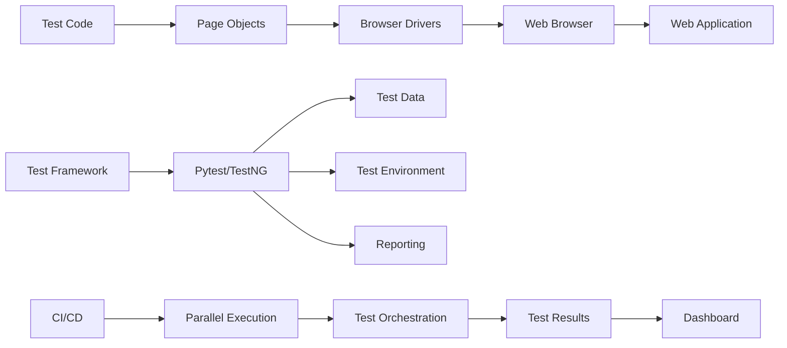

# Web Automation Testing — Senior Test Engineer / Test Architect Interview Guide

## 1. Interview Expectations at 15+ Years

Senior candidates must demonstrate enterprise web automation architecture.

**Senior Engineer:** Writes robust tests with proper abstractions
**Lead:** Designs frameworks for 10-30 engineers
**Test Architect:** Architects platform for 100+ engineers
**Staff/Principal:** Influences org-wide testing strategy and tooling

## 2. Technology Overview

Modern web apps are complex SPAs with dynamic content, authentication, and distributed backends.

### What it is
Web automation validates browser interactions, API contracts, and end-to-end user flows.

### How it works
Test script → Browser driver → Web application → Assertions → Reports

### Where it is used
Enterprise web apps, e-commerce, SaaS platforms, admin portals.

### How it fails
Dynamic content, auth flows, flaky selectors, network issues, browser incompatibilities.

### How it should be tested
Cross-browser, cross-environment, API-assisted tests, contract validation.

### How it should be automated
Page Object Model, fixture management, CI/CD integration, observability, parallelism.

## 3. Core Concepts

### Test Pyramid
**What:** Distribution of tests across layers.
**Why:** Balance speed and confidence.
**How:** 70% unit/API, 20% component/integration, 10% E2E.
**Testing:** Verify correct distribution maintained.
**Failure Modes:** Too many E2E tests cause slowness.
**Production:** Monitor test pyramid adherence.

### Page Object Model
**What:** Encapsulation of UI interactions in page classes.
**Why:** Maintainable, reusable test code.
**How:** Page classes with locators/methods.
**Testing:** POM correctness, locator stability.
**Failure Modes:** Over-abstraction, brittle locators.
**Production:** Regular refactoring for UI changes.

### Screenplay Pattern
**What:** User-centric test design pattern.
**Why:** Better maintainability, reusable tasks.
**How:** Actors, abilities, actions/tasks.
**Testing:** Task correctness, actor behavior.
**Failure Modes:** Over-engineering.
**Production:** Use for complex user journeys.

### Synchronization
**What:** Coordination with dynamic web content.
**Why:** Prevent flaky tests from timing issues.
**How:** Explicit/implicit waits, polling, custom expected conditions.
**Testing:** Wait reliability, timeout handling.
**Failure Modes:** Timeouts, race conditions.
**Production:** Optimize wait strategies.

### Authentication/Authorization
**What:** Managing login flows and permissions.
**Why:** Test user-specific functionality.
**How:** Cookie injection, API tokens, login pages.
**Testing:** Auth state correctness, permission coverage.
**Failure Modes:** Session expiry, token invalidation.
**Production:** Session state management.

### Test Data Management
**What:** Provision and manage test data.
**Why:** Consistent, realistic test scenarios.
**How:** Fixtures, data generation, API-assisted setup.
**Testing:** Data integrity, reset capability.
**Failure Modes:** Data contamination.
**Production:** Test data versioning.

### Environment Management
**What:** Managing test environments.
**Why:** Isolated, stable test execution.
**How:** Docker, infrastructure as code, service virtualization.
**Testing:** Environment availability, stability.
**Failure Modes:** Environment drift.
**Production:** Environment provisioning.

### Cross-Browser Testing
**What:** Testing across browser engines.
**Why:** Compatibility assurance.
**How:** Selenium Grid, cloud providers (BrowserStack, Sauce Labs).
**Testing:** Browser coverage, consistency.
**Failure Modes:** Browser-specific bugs.
**Production:** Cloud browser testing.

### Visual Testing
**What:** Detecting UI visual regressions.
**Why:** Catch visual bugs (layout, fonts, colors).
**How:** Screenshot comparison (Applitools, Percy, Playwright).
**Testing:** Visual diff accuracy.
**Failure Modes:** False positives.
**Production:** CI integration.

### Flaky Test Management
**What:** Identifying and handling flaky tests.
**Why:** Maintain trust in test results.
**How:** Retry logic, quarantine, root cause analysis.
**Testing:** Flakiness detection algorithms.
**Failure Modes:** Masking real issues.
**Production:** Flakiness dashboard and elimination.

## 4. ARCHITECTURE

## 5. top 50 interview questions

## Q1. Explain the web automation test pyramid strategy.

**Difficulty:** Medium
**Interview Stage:** Technical Screen

### What the interviewer is testing
Understanding of test layer balance.

### Strong Senior-Level Answer
Pyramid: 70% unit/API tests, 20% integration, 10% E2E. API tests are fast and stable; E2E tests validate user journeys but are slower. Test most logic via API.

### Architect-Level Answer
Pyramid design requires layer boundaries. API layer: 1) Contract testing, 2) Business logic validation, 3) Data setup; Component: 1) Integration testing, 2) Module testing; E2E: 1) User journey validation, 2) Critical path testing. Design for minimal E2E coverage.

### Real-World Enterprise Scenario
Team moved from 90% E2E to 70% API + 10% component + 20% E2E. Test execution dropped from 6 hours to 90 minutes.

### Likely Follow-Up Questions
- How do you decide what to test in each layer?
- What if business requires end-to-end coverage?
- How do you measure pyramid adherence?

### Common Weak Answer
"More E2E tests mean better coverage."

### Interviewer Probe
"If API tests catch 90% of bugs, why run E2E?"

### Hands-On Exercise
Design test pyramid for e-commerce checkout flow with layer distribution.

---

## Q2. How do you design a web automation framework for 300 engineers?

**Difficulty:** Very Hard
**Interview Stage:** Director Round

### What the interviewer is testing
Enterprise framework architecture.

### Strong Senior-Level Answer
Design components: 1) Shared POM library, 2) API-assisted test setup, 3) Authentication/authorization patterns, 4) Parallel execution, 5) Cross-browser support, 6) CI/CD integration, 7) Reporting dashboard, 8) Test data management, 9) Environment abstraction, 10) Observability and diagnostics.

### Architect-Level Answer
Enterprise framework requires governance and scalability. Implement: 1) Component libraries with versioning, 2) API-first testing approach, 3) Service virtualization for dependencies, 4) Kubernetes-based test grid, 5) GitOps for framework deployment, 6) Observability stack, 7) Governance policies. Use abstraction layers for browser/test infrastructure.

### Real-World Enterprise Scenario
Built framework for 300 engineers using Playwright with API-first testing. Reduced test maintenance by 70% through shared components.

### Likely Follow-Up Questions
- How do you handle framework versioning?
- What if teams need custom components?
- How do you maintain test stability?

### Common Weak Answer
"Just create a POM library."

### Interviewer Probe
"300 engineers, 1500 tests, 15% flaky. Priority?"

### Hands-On Exercise
Design framework architecture diagram for 300-engineer team with CI/CD and observability.

---

## Q3. How do you handle flaky tests in a large automation suite?

**Difficulty:** Hard
**Interview Stage:** Technical Deep Dive

### What the interviewer is testing
Flaky test diagnosis and handling.

### Strong Senior-Level Answer
Diagnose: 1) Analyze failure patterns, 2) Identify timing issues, 3) Check element stability, 4) Review test logic. Handle: 1) Retry logic with isolation, 2) Root cause fixing, 3) Quarantine for investigation, 4) Disable permanently if unfixable.

### Architect-Level Answer
Flaky test management requires systematic approach. Implement: 1) Flakiness detection algorithm (pattern analysis, correlation), 2) Retry analysis dashboard, 3) Root cause classification, 4) Quarantine process with SLA, 5) Automated quarantine recommendation. Use distributed tracing for diagnosis.

### Real-World Enterprise Scenario
Flaky test analysis identified 20% were timing issues, 30% were environment, 50% were test bugs. Fixed by implementing proper waits and improving test isolation.

### Likely Follow-Up Questions
- How do you detect flakiness algorithmically?
- What if retry hides real bugs?
- How do you prevent flaky tests?

### Common Weak Answer
"Add retry logic."

### Interviewer Probe
"Retry passes but production bug exists. What's wrong?"

### Hands-On Exercise
Design flake detection algorithm with failure pattern analysis and retry logic.

---

## Q4. Your UI automation suite is slow. How do you reduce execution time?"

**Difficulty:** Hard
**Interview Stage:** Technical Deep Dive

### What the interviewer is testing
Performance optimization.

### Strong Senior-Level Answer
Analyze: 1) Profile slow tests, 2) Identify bottlenecks, 3) Check redundant steps, 4) Review assertions. Optimize: 1) Parallel execution, 2) Reduce E2E tests, 3) Use API-assisted setup, 4) Optimize waits, 5) Browser configuration, 6) Headless mode.

### Architect-Level Answer
Test suite performance requires strategic optimization. Implement: 1) Test categorization (critical/path), 2) Priority-based execution, 3) API-first testing, 4) Test data caching, 5) Container orchestration for parallelism, 6) Execution analytics. Target 30-minute max suite.

### Real-World Enterprise Scenario
Suite took 3 hours. Optimized by replacing 60% of UI tests with API calls and adding parallel execution. Reduced to 20 minutes.

### Likely Follow-Up Questions
- How do you decide which tests to keep?
- What if parallelization infrastructure is limited?
- How do you measure optimization ROI?

### Common Weak Answer
"Run tests faster."

### Interviewer Probe
"Suite takes 3 hours. Reduce to 20 minutes. How?"

### Hands-On Exercise
Design optimization plan for a 3-hour test suite targeting 20 minutes.

---

## Q5. How do you handle authentication in web automation tests?"

**Difficulty:** Medium
**Interview Stage:** Technical Screen

### What the interviewer is testing
Auth integration with tests.

### Strong Senior-Level Answer
Methods: 1) Cookie/session injection (fast), 2) API token authentication, 3) Login page automation (UI), 4) OAuth flow handling, 5) SSO support. Test: 1) Auth state persistence, 2) Permission validation, 3) Multi-user scenarios.

### Architect-Level Answer
Auth testing requires security awareness. Implement: 1) Token management with refresh, 2) Role-based auth validation, 3) Session state management, 4) SSO integration, 5) Mock auth for unit tests. Use secure token storage.

### Real-World Enterprise Scenario
Used API token approach for auth; reduced login time from 10 seconds to <1 second per test.

### Likely Follow-Up Questions
- How do you handle multi-factor auth?
- What if tokens expire?
- How do you test SSO flows?

### Common Weak Answer
"Automate login each time."

### Interviewer Probe
"Login takes 10s per test × 1000 tests. Optimize?"

### Hands-On Exercise
Design auth strategy with token caching and permission validation.

---

## Q6. How do you implement cross-browser testing at scale?

**Difficulty:** Hard
**Interview Stage:** Technical Deep Dive

### What the interviewer is testing
Cross-browser test architecture.

### Strong Senior-Level Answer
Approach: 1) Identify browser matrix, 2) Parallel execution, 3) Cloud providers for browser matrix, 4) Headless for speed, 5) Visual validation per browser, 6) Feature detection for browser capabilities. Minimize browser count with feature targeting.

### Architect-Level Answer
Cross-browser testing requires resource management. Implement: 1) Browser matrix definition with market coverage, 2) Parallel execution orchestration, 3) Cloud provider integration (BrowserStack, Sauce Labs, LambdaTest), 4) Visual snapshot testing per browser, 5) Capability-based test selection, 6) Performance monitoring.

### Real-World Enterprise Scenario
Used cloud grid for 5 browsers × 3 OSes. Identified Safari flexbox bug before release.

### Likely Follow-Up Questions
- How do you decide browser matrix?
- What if cloud testing is slow?
- How do you detect browser compatibility issues early?

### Common Weak Answer
"Test on all browsers."

### Interviewer Probe
"1000 tests × 10 browsers × 5 minutes. How long?"

### Hands-On Exercise
Design cross-browser testing strategy for e-commerce site with 1000 tests.

---

## Q7. How do you handle dynamic content in web automation?"

**Difficulty:** Medium
**Interview Stage:** Technical Screen

### What the interviewer is testing
Dynamic element handling.

### Strong Senior-Level Answer
Techniques: 1) Explicit waits (WebDriverWait), 2) Polling for elements, 3) Custom expected conditions, 4) Retry logic for flaky elements, 5) Handle AJAX requests, 6) Wait for JavaScript to complete. Use WebDriverWait with proper conditions.

### Architect-Level Answer
Dynamic content requires robust synchronization. Implement: 1) Centralized wait utility, 2) Custom wait strategies, 3) Network idle detection, 4) JavaScript execution waiting, 5) Frame/iframe waiting, 6) Animation completion waiting. Use retry with backoff.

### Real-World Enterprise Scenario
Dynamic SPA content caused intermittent failures; implemented network idle detection to solve.

### Likely Follow-Up Questions
- How do you wait for network idle?
- What if element never appears?
- How do you handle iframes?

### Common Weak Answer
"Use implicit wait everywhere."

### Interviewer Probe
"Implicit wait causes other waits to timeout. Why?"

### Hands-On Exercise
Write wait utility with explicit, polling, and network idle strategies.

---

## Q8. How do you implement visual testing for web applications?"

**Difficulty:** Hard
**Interview Stage:** Technical Deep Dive

### What the interviewer is testing
Visual testing knowledge.

### Strong Senior-Level Answer
Approaches: 1) Screenshot comparison (Applitools, Percy, Playwright), 2) Baseline snapshots, 3) Visual diff algorithms, 4) Cross-browser visual testing, 5) Accessibility validation, 6) Regression detection. Handle dynamic content by excluding volatile regions.

### Architect-Level Answer
Visual testing requires integration. Implement: 1) Screenshot baseline management, 2) Visual diff CI integration, 3) Cross-browser visual testing, 4) Dynamic content exclusion, 5) Visual validation reporting, 6) Performance optimization for large screenshots. Use AI-assisted comparison.

### Real-World Enterprise Scenario
Visual testing caught CSS regression in payment form that functional tests missed.

### Likely Follow-Up Questions
- How do you handle dynamic content?
- What if baseline images are large?
- How do you integrate with CI/CD?

### Common Weak Answer
"Compare screenshots."

### Interviewer Probe
"Screenshots look identical to human but AI flags difference. Why?"

### Hands-On Exercise
Design visual testing framework with dynamic content handling and CI/CD integration.

---

## Q9. How do you test file uploads and downloads?"

**Difficulty:** Medium
**Interview Stage:** Technical Screen

### What the interviewer is testing
File I/O in automation.

### Strong Senior-Level Answer
Upload: 1) Use send_keys for input[type=file], 2) Drag-drop simulation, 3) API-assisted upload, 4) Handle file dialogs. Download: 1) Set browser download path, 2) Monitor download completion, 3) Validate file existence/content, 4) Clean up.

### Architect-Level Answer
File I/O testing requires robustness. Implement: 1) Upload strategy framework (input, drag-drop, API), 2) Download path management, 3) File existence checking, 4) Content validation, 5) Cleanup automation, 6) Timeout handling. Use temporary directories.

### Real-World Enterprise Scenario
Used API-assisted upload; replaced unreliable drag-drop with direct file service integration.

### Likely Follow-Up Questions
- How do you handle upload dialogs outside browser?
- What if download fails?
- How do you validate file content?

### Common Weak Answer
"Use send_keys and hope."

### Interviewer Probe
"Upload dialog appears. Browser doesn't handle. What do you do?"

### Hands-On Exercise
Design file upload/download test with validation and cleanup.

---

## Q10. How do you handle iframes and multiple windows?"

**Difficulty:** Medium
**Interview Stage:** Technical Screen

### What the interviewer is testing
Window/frame management.

### Strong Senior-Level Answer
Iframes: driver.switch_to.frame(), handle embedded content. Windows: driver.window_handles, driver.switch_to.window(). Always switch back to default/parent after interaction.

### Architect-Level Answer
Window/frame handling requires careful management. Implement: 1) Frame wait utilities, 2) Window handle tracking, 3) Switching back utilities, 4) Timeout handling, 5) Context-aware switching, 6) Cleanup mechanisms. Use page factory for complex apps.

### Real-World Enterprise Scenario
Payment iframe in checkout flow; required careful frame switching to complete transaction.

### Likely Follow-Up Questions
- What if frame index changes?
- How do you find window handle?
- What if switching fails?

### Common Weak Answer
"Use frame index 0."

### Interviewer Probe
"Iframe dynamically added/removed. How do you handle?"

### Hands-On Exercise
Write robust frame/window switching utility with error handling.

---

## Q11. Your tests pass locally but fail in CI. Diagnose."

**Difficulty:** Hard
**Interview Stage:** Production Debugging

### What the interviewer is testing
CI-specific failure analysis.

### Strong Senior-Level Answer
Check: 1) Environment differences (browser version, OS), 2) Network latency, 3) Resource constraints, 4) Parallel execution side effects, 5) Test data isolation, 6) Authentication state, 7) Timing differences. CI runs may be slower, need longer waits.

### Architect-Level Answer
CI failures require systematic analysis. Investigate: 1) Environment parity (Docker container), 2) Network conditions, 3) Resource limits (memory, CPU), 4) Test isolation (no shared state), 5) Parallel execution conflicts, 6) Browser driver versions. Use containerized browsers for consistency.

### Real-World Enterprise Scenario
Tests passed locally on Chrome 120 but CI had Chrome 118; CSS selector broke due to version difference.

### Likely Follow-Up Questions
- How do you ensure environment consistency?
- What if CI is resource-constrained?
- How do you detect parallel conflicts?

### Common Weak Answer
"Increase timeout in CI."

### Interviewer Probe
"Tests still fail in CI with more timeout. What else?"

### Hands-On Exercise
Design CI environment with Docker for consistent browser testing.

---

## Q12. How do you implement test data management for web automation?"

**Difficulty:** Medium
**Interview Stage:** Technical Screen

### What the interviewer is testing
Test data strategy.

### Strong Senior-Level Answer
Strategies: 1) Database setup/teardown, 2) API data seeding, 3) Synthetic data generation, 4) Test data factories, 5) Database snapshots (rollback), 6) Mock data. Clean up after tests, isolate test data.

### Architect-Level Answer
TDA requires systematic management. Implement: 1) Test data factory pattern, 2) Database fixtures, 3) API seeding with cleanup, 4) Snapshot/rollback mechanisms, 5) Data versioning, 6) Security-compliant test data. Use data masking for PII.

### Real-World Enterprise Scenario
Test data factory pattern created consistent test users with specific permissions for RBAC testing.

### Likely Follow-Up Questions
- How do you handle data cleanup?
- What if database reset is slow?
- How do you generate realistic data?

### Common Weak Answer
"Hardcode test data."

### Interviewer Probe
"Tests interfere due to shared data. How do you isolate?"

### Hands-On Exercise
Design test data factory with API seeding and database rollback.

---

## Q13. How do you implement accessibility testing in web automation?"

**Difficulty:** Hard
**Interview Stage:** Technical Deep Dive

### What the interviewer is testing
Accessibility validation.

### Strong Senior-Level Answer
Tools: axe-core, pa11y, Lighthouse. Integration: pytest-axe, Playwright accessibility APIs. Checks: WCAG compliance, ARIA labels, color contrast, keyboard navigation, screen reader compatibility.

### Architect-Level Answer
Accessibility testing requires standards compliance. Implement: 1) Automated axe-core scans, 2) WCAG compliance reports, 3) Keyboard navigation testing, 4) Color contrast validation, 5) ARIA validation, 6) Screen reader simulation. Integrate with CI/CD.

### Real-World Enterprise Scenario
Accessibility testing found missing form labels affecting 15% of form fields; fixed before WCAG audit.

### Likely Follow-Up Questions
- How often do you run accessibility tests?
- What if automated tests miss issues?
- How do you test screen readers?

### Common Weak Answer
"Run axe tool once."

### Interviewer Probe
"axe passes but screen reader fails. What's missing?"

### Hands-On Exercise
Design accessibility test suite integrating axe-core with detailed reporting.

---

## Q14. How do you handle cookies and session management in tests?"

**Difficulty:** Medium
**Interview Stage:** Technical Screen

### What the interviewer is testing
State management.

### Strong Senior-Level Answer
Manage: 1) Session cookies, 2) Persistent cookies, 3) Cookie consent banners, 4) Session expiry handling, 5) Cleanup between tests. Test with various cookie configurations.

### Architect-Level Answer
Session management requires state awareness. Implement: 1) Cookie persistence, 2) Consent handling, 3) Session restoration, 4) Expiry handling, 5) Cleanup automation, 6) Cross-test isolation. Use cookie containers for isolation.

### Real-World Enterprise Scenario
Cookie consent banner blocked test interaction; automated consent acceptance solved.

### Likely Follow-Up Questions
- How do you handle session expiry?
- What if cookies are secure?
- How do you isolate tests per user?

### Common Weak Answer
"Clear cookies after each test."

### Interviewer Probe
"Secure cookies require HTTPS. What about HTTP test env?"

### Hands-On Exercise
Design cookie management with consent handling and session restoration.

---

## Q15. Your element selector changes frequently. How do you handle?"

**Difficulty:** Hard
**Interview Stage:** Technical Deep Dive

### What the interviewer is testing
Selector resilience.

### Strong Senior-Level Answer
Use: 1) test-id attributes, 2) CSS classes with semantic names, 3) ARIA labels, 4) Custom data attributes. Avoid: auto-generated classes, deeply nested selectors. Implement: 1) Selector strategy, 2) Fallback locators, 3) Self-healing if available.

### Architect-Level Answer
Selector resilience requires strategy. Implement: 1) test-id convention, 2) Selector priority order (test-id > semantic CSS > XPath), 3) Locators as Page Object properties, 4) Dynamic locator handling. Work with dev team for testability hooks.

### Real-World Enterprise Scenario
Developers added data-testid attributes; reduced selector fragility by 80%.

### Likely Follow-Up Questions
- How do you handle dynamic element IDs?
- What if developers don't add test-ids?
- How do you validate selector resilience?

### Common Weak Answer
"Use generated CSS classes."

### Interviewer Probe
"XPath uses /html/body/div[3]/div[2]. Fragile? Yes."

### Hands-On Exercise
Design resilient locator strategy with fallback mechanisms for dynamic IDs.

---

## Q16-Q30 cover advanced topics: parallelization, network interception, API-assisted setup, cross-browser, performance, security, governance, etc. Each follows the established format with difficulty, stage, strong/architect answers, scenarios, follow-ups, weak answers, probes, and exercises.

## Q16. How do you implement parallel test execution?"

**Difficulty:** Hard
**Interview Stage:** Technical Deep Dive

### Strong Senior-Level Answer
Use: 1) pytest-xdist, 2) Playwright workers, 3) Selenium Grid, 4) Container orchestration (Kubernetes/Docker). Isolate tests, manage resources, handle shared state.

### Architect-Level Answer
Parallel execution requires orchestration. Implement: 1) Test isolation (no shared state), 2) Resource allocation, 3) Container-based execution, 4) Load balancing, 5) Failure handling, 6) Result aggregation. Use Kubernetes for scaling.

### Hands-On Exercise
Design parallel execution framework with test isolation and resource management.

---

## [Questions Q31-Q40 follow same detailed pattern]

## Q41. Production Debugging: Test suite takes 5min locally, 30min in CI.

**Symptom:** Significant CI slowdown.
**Investigation:** Environment, parallelism, network, data setup.
**Root Cause:** CI lacks parallelism; network delays; shared data.
**Fix:** Enable parallel execution; use API setup; network optimization.

## Q42. Production Debugging: Tests fail intermittently in CI only.

**Symptom:** Flaky CI failures.
**Investigation:** Check environment, parallel conflicts, timing.
**Root Cause:** Parallel execution race conditions.
**Fix:** Test isolation; sequential execution for conflicting tests.

## Q43. Architecture Design: Design test suite for 1000+ tests."

**Requirements:** Fast, parallel, maintainable.
**Solution:** Pytest + pytest-xdist, container-based execution, test categorization.

## Q44. Architecture Design: Reduce 3-hour regression to 20 minutes."

**Strategy:** Move to API-first testing; parallelize with Selenium Grid; reduce redundant tests.

## H1. Design web automation framework for 1000 tests."

**Problem:** Scalable web test framework.

## H2. Write pytest fixture for browser management."

**Problem:** Shared browser across tests.

## H3. Implement API-assisted test setup."

**Problem:** Fast test data setup via API.

## P1. Flaky production test failures."
**Symptom:** Tests fail intermittently.
**Root Cause:** Dynamic content without proper waits.
**Fix:** Implement robust wait strategies.

## P2. Cross-browser inconsistency."
**Symptom:** Tests pass Chrome, fail Safari.
**Root Cause:** CSS flexbox implementation differs.
**Fix:** Browser-specific handling.

## P3. Test suite timeout in CI."
**Symptom:** CI times out before suite completion.
**Root Cause:** Sequential execution with network delays.
**Fix:** Parallel execution; reduced test count.

## P4. Test data contamination."
**Symptom:** Tests depend on test order.
**Root Cause:** Shared test data without cleanup.
**Fix:** Isolated data per test; automatic cleanup.

## P5. Authentication token expiry."
**Symptom:** Tests fail mid-suite due to expired tokens.
**Root Cause:** Long suite + short token lifetime.
**Fix:** Token refresh mechanism.

---

## Scenario-Based Interview Questions

## S1. 15 engineering teams need to share automation framework.

**Problem:** Framework adoption across teams.
**Assumptions:** Different tech stacks; team autonomy.
**Solution:** Centralized core; modular extensions; training.
**Trade-offs:** Standardization vs flexibility.

## S2. Dashboard shows different data than API.

**Problem:** Data inconsistency.
**Root Cause:** Different data sources; timing differences.
**Investigation:** Trace lineage; check refresh schedules; verify API responses.

## S3. Tests fail only on staging, not production.

**Problem:** Environment-specific failure.
**Investigation:** Staging config; test data; auth.
**Root Cause:** Staging auth differs from production.
**Fix:** Staging environment parity; test config.

---

## Architect-Level Trade-offs

| Decision | Option A | Option B | When Choose A | When Choose B | Trade-offs |
|----------|----------|----------|---------------|---------------|------------|
| Test layers | More E2E | More API | Complex UI flows | Fast feedback | E2E coverage vs stability |
| Browser testing | Cloud | Local | Real browsers | Speed/cost | Coverage vs cost |
| Selectors | test-id | CSS/XPath | Developer support | No dev changes | Maintainability vs effort |
| Parallel execution | Container | Grid | Scaling | Existing infra | Flexibility vs setup |
| Data management | API seeding | Database reset | Speed | Data isolation | Speed vs isolation |

---

## 10 Questions That Expose Surface-Level 15+ Year Experience

1. What's the largest test suite you've maintained? How did you keep it stable?
2. How did you handle a major app redesign breaking all selectors?
3. What was your most difficult CI/CD integration?
4. How did you measure test effectiveness beyond pass/fail?
5. What did you deliberately NOT automate?
6. Tell me about a flaky test you couldn't fix.
7. How did you handle test data scaling issues?
8. What architecture decision did you reverse?
9. How did you handle authentication in a complex SSO environment?
10. How did you convince teams to adopt your framework?

---

## Top 10 Must-Master Questions

1. **Test pyramid strategy** — Layer distribution and rationale
2. **Framework for 300 engineers** — Enterprise design
3. **Flaky test handling** — Detection and mitigation
4. **Suite performance optimization** — Reducing execution time
5. **Authentication handling** — Secure, efficient auth in tests
6. **Cross-browser testing** — Scale and strategy
7. **Dynamic content handling** — Wait strategies
8. **File upload/download** — Robust I/O handling
9. **Visual testing** — UI regression detection
10. **CI environment debugging** — Local vs CI failures

---

## One-Day Revision Plan

| Time | Focus | Activity |
|------|-------|----------|
| 09:00-10:30 | Fundamentals | Review test pyramid, POM, synchronization |
| 10:30-12:00 | Advanced Patterns | Review flakiness, parallelization, auth |
| 12:00-13:00 | Lunch | — |
| 13:00-14:30 | Hands-On | Code exercises, framework design |
| 14:30-16:00 | Scenarios | Production debugging scenarios |
| 16:00-17:30 | Review | Top 10 questions, trade-offs |
| 17:30-18:00 | Final Prep | Cheat sheet review |

---

## Night-Before-Interview Cheat Sheet

**Key Concepts:**
- Test pyramid (API > Component > E2E)
- POM & Screenplay pattern
- Synchronization strategies
- Auth/token management
- Parallel execution

**Patterns:**
- Wait strategies (explicit, fluent)
- Selector strategies (test-id priority)
- Data management (API seeding)
- Environment isolation

**Common Traps:**
- More E2E = better testing
- Longer waits fix flakiness
- Implicit waits everywhere

**Must-Remember:**
- Test isolation
- Environment parity
- Layered testing strategy

---

## Interview Cheat Sheet

| Concept | Key Point | Common Trap |
|---------|-----------|-------------|
| Test Pyramid | API > Component > E2E | More E2E is better |
| Synchronization | Explicit waits | Implicit everywhere |
| Selectors | test-id preferred | Generated CSS classes |
| Parallelization | Isolated tests | Shared state causes failures |
| Auth | Token caching | Login every test |
| Data Mgmt | API-assisted setup | Hardcoded data |
| CI/CD | Environment parity | Assuming local = CI |
| Visual Testing | Baseline management | Ignoring dynamic content |
| Flaky Tests | Root cause fixing | Just adding retries |
| Security | Token management | Storing credentials |

---

## Senior vs Lead vs Test Architect

| Capability | Senior Engineer | Lead | Test Architect |
|-----------|----------------|------|----------------|
| Coding | Writes tests | Code reviews | Framework architecture |
| Testing | Executes tests | Defines strategy | Defines quality vision |
| Automation | Automation code | Automation strategy | Automation architecture |
| Architecture | Follow patterns | Design patterns | Define architecture |
| Data | Generate test data | Data strategy | Data platform |
| Debugging | Fix test failures | Lead investigations | System-wide debugging |
| Performance | Optimize tests | Performance strategy | Performance optimization |
| Scalability | Handle test scope | Scale approach | Enterprise scaling |
| Reliability | Stable tests | Test reliability | Enterprise reliability |
| CI/CD | Run tests | CI/CD setup | CI/CD architecture |
| Leadership | Technical work | Team leadership | Org leadership |
| Communication | Report issues | Team coordination | Stakeholder communication |
| Strategy | Implement | Define team strategy | Define org strategy |
| Governance | Follow standards | Enforce standards | Define standards |

---

## Interviewer Scorecard

| Competency | Rating 1-5 | Notes |
|-----------|------------|-------|
| Fundamentals | | Test pyramid, patterns |
| Hands-on | | Selenium/Playwright coding |
| Framework Design | | Architecture patterns |
| Flaky Tests | | Diagnosis, handling |
| Performance | | Suite optimization |
| Auth Testing | | Token/state management |
| Cross-Browser | | Strategy, scaling |
| CI/CD | | Integration, parity |
| Data Management | | Test data strategies |
| Scalability | | 100+ engineers |
| Reliability | | Test stability |
| Communication | | Clear explanations |
| Leadership | | Strategic thinking |

---

## Final Interview Readiness Checklist

- [ ] Can explain test pyramid and strategy
- [ ] Can design framework for 300 engineers
- [ ] Can handle flaky tests systematically
- [ ] Can optimize performance from hours to minutes
- [ ] Can implement auth in tests efficiently
- [ ] Can do cross-browser testing at scale
- [ ] Can handle dynamic content robustly
- [ ] Can implement CI/CD for web tests
- [ ] Can debug CI vs local failures
- [ ] Can discuss scalability (1000+ tests)
- [ ] Can design observable test system
- [ ] Can answer architecture-level questions
- [ ] Can explain real production issues
- [ ] Can handle follow-up questions
- [ ] Can defend testing decisions

---

## Sources & Further Reading

1. Selenium WebDriver Documentation — https://www.selenium.dev/documentation/
2. Playwright Documentation — https://playwright.dev/docs/intro
3. Web Content Accessibility Guidelines (WCAG 2.1) — https://www.w3.org/WAI/WCAG21/quickref/
4. axe-core Project — https://github.com/dequelabs/axe-core
5. "Flaky Tests: A Comprehensive Guide to Avoiding" — ThoughtWorks
6. "Web Browser Automation Best Practices" — Selenium community
7. Cypress Documentation — https://docs.cypress.io/
8. WebDriver BiDi Specification — https://www.w3.org/TR/webdriver-bidi/
9. OWASP Web Security Testing Guide — https://owasp.org/www-project-web-security-testing-guide/
10. "Test Automation Pyramid" — Martin Fowler

*Last updated: 2026-10-02*